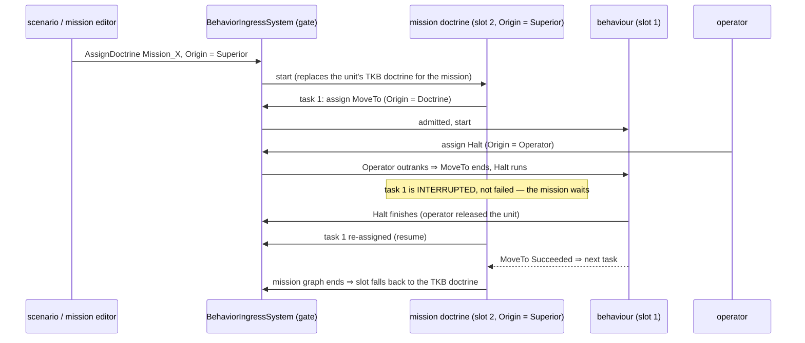

<!--STATUS
state: LIVE
updated: 2026-10-04
build-state: DESIGN — under discussion with the user (G2, G3 open); G1 and G2b approved.
current-answer: §1 (what is decided), §2 (the mission as a doctrine — the live discussion).
stale-below: nothing — new document.
known-rot: none.
known-conflict:
  - docs/DESIGN_Sensors_And_Doctrine.md §11.2b G2 ("a mission PHASE may name a doctrine") — superseded by §2 here: ONE doctrine per MISSION, replacing the triggers (user, 2026-10-04). That document gets the pointer in the same change.
related-designs:
  - docs/DESIGN_Sensors_And_Doctrine.md — OWNS the doctrine slot, the origin gate (R-188, R-189, R-193) and the sensor side; this document owns what decides inside the slot (missions, threat, intent, utility).
  - docs/blueprints/batches/FRAME_Decision_Layer.md — the frame this answers (G1–G11).
  - docs/blueprints/DESIGN_Unified_Behaviour_Run.md — §6 "the mission plan as a blueprint" (the user's earlier direction) and §7 Demo_MissionPlan, the concept this generalises; U-10/U-11 the Behaviour Task node.
  - docs/designs/utility-ai/Utility_AI_Design_v1_1.md — OWNS scoring; a doctrine calls it (§7), never a host.
  - docs/designs/brain-death/BD1-DESIGN.md — OWNS what a unit does with no behaviour.
-->

# The decision layer — missions, doctrine, threat, intent

> 🔒 **User, `2026-10-04`:** *"G1: approved"* · *"G2b: wake on event is good."* · on G2: *"What is a phase? A mission
> task? Task is just a behavior. What is your idea a doctrine will do for that task (that single behavior)? My idea was
> that a doctrine comes one per mission to replace the triggers (same concept like the blueprint defined sequence of
> behaviors we made recently)"*

## 1. Decided

| # | ruling | consequence |
|---|---|---|
| **G1** ✅ | a remembered contact keeps WHAT it is (its danger does not fade) apart from HOW FRESH my knowledge of it is (fades) — *"hidden does not mean harmless"* | danger is judged at read time in one place — an input to the existing `ThreatRankingDecision` fed by the TKB (target class, weapons vs my armour, range); the memory entry stores identity + freshness, never a danger score. The backend's memory stage (S4) keeps the freshness field |
| **G2b** ✅ | a doctrine running below frame rate wakes on events | a sensor change, a finished behaviour or a refused assignment for the unit ⇒ its doctrine ticks the next frame (bus events live one frame, `FdpEventBus.cs:30`); HSM events already wait in their queue |

## 2. The mission as a doctrine *(G2 — the user's direction; details under discussion)*

📐 **What a "phase" is today:** `MissionPhase {BehaviorId, Trigger, TriggerParam}` (`MissionComponents.cs:42`) — ONE
behaviour plus ONE trigger; `MissionDirectorSystem` advances on the trigger and assigns the next phase's behaviour
directly (`MissionDirectorSystem.cs:215`). ⇒ ⛔ a doctrine per phase would be a doctrine for one behaviour — nothing
to decide. ⛔ SUPERSEDED: `DESIGN_Sensors_And_Doctrine.md` §11.2b's "a mission phase may name a doctrine".

📐 **Corpus:** 8 shipped scenarios carry a mission; every one uses only the `BehaviorFinished` trigger, 7 of them with a
single task. The trigger vocabulary (`TimerElapsed`, `UnderAttack`, `HealthCritical`, `BehaviorFinished`) has no other
user in the repo.

*What the picture shows that prose hid:* the mission must DRIVE the behaviour slot (assign through the gate), not HOST
its tasks inside itself — hosted children share the host's run (U-10), so an operator order would end the whole
mission; driven tasks are merely interrupted and resumed.

| sub-question | ⭐ lean | why |
|---|---|---|
| **M1** the mission's form | the mission IS a Behaviour-kind blueprint run in the doctrine slot — the same graph shape as `Demo_MissionPlan` (Behaviour Task nodes, `Succeeded`/`Failed` branches, events, `When`) | one authoring vocabulary for a sequence; triggers become graph edges and events |
| **M2** a Behaviour Task node in the doctrine slot | ONE node, two modes by slot: in the behaviour slot it HOSTS (today, U-11); in the doctrine slot it ASSIGNS to slot 1 through the gate and waits for that run's `BehaviorFinishedEvent` | a second "assign task" node would duplicate the vocabulary |
| **M3** an order interrupts a task | the task is INTERRUPTED (a third outcome beside Succeeded / Failed); default: the mission re-assigns it when the higher origin releases the unit | the user's model: a human always wins, the mission continues afterwards |
| **M4** the unit's own doctrine | ONE doctrine slot: the mission replaces the TKB doctrine for its duration; when the mission graph ends the slot falls back to the TKB default | two doctrines per unit = a second arbitration layer |
| **M5** reactions inside a mission | authored in the mission (events / `When`), optionally by hosting a reusable reaction sub-graph | the mission author decides how much autonomy the mission keeps |
| **M6** what retires | `MissionDirectorSystem`, `MissionPhase` / `MissionTrigger` (three representations: `Hrot.Core` class, NED struct, Toolkits enum), the trigger editor; the networked `MissionPlan` becomes "assign this mission doctrine with these params" | measured corpus above: one trigger kind in use |
