<!--STATUS
state: LIVE
updated: 2026-10-04
build-state: BUILDING §4 — BUILT: ROE + RecentSenses (CE-2074/2076, §4.4), reactions in the gate (CE-2078, §4.1), the two SOP actions (CE-2079, §4.6), the shipped SOP (CE-2080, §4.7); next CE-2082 (demo scenario). READY-TO-BUILD for §3.3 (one scoring step, combat posture; approved 2026-10-04, not started); G3 open; G1, G2b approved; the mission stays unchanged.
current-answer: §1 (decided), §2 (the mission stays), §3.3 (the approved build design and its tasks); §3.1–§3.2 are its reasoning.
stale-below: nothing — new document.
known-rot: none.
known-conflict:
  - docs/DESIGN_Sensors_And_Doctrine.md §11.2b G2 ("a mission PHASE may name a doctrine") — superseded by §2 here: the mission is NOT changed (user, 2026-10-04).
related-designs:
  - docs/DESIGN_Sensors_And_Doctrine.md — OWNS the SOP slot (its text still says "doctrine" — renamed by R-198), the origin gate (R-188, R-189, R-193) and the sensor side; this document owns what decides inside the slot (missions, threat, intent, utility).
  - docs/blueprints/batches/FRAME_Decision_Layer.md — the frame this answers (G1–G11).
  - docs/blueprints/DESIGN_Unified_Behaviour_Run.md — §6 "the mission plan as a blueprint" (the user's earlier direction) and §7 Demo_MissionPlan, the concept this generalises; U-10/U-11 the Behaviour Task node.
  - docs/designs/utility-ai/Utility_AI_Design_v1_1.md — OWNS scoring; an SOP calls it (§7), never a host.
  - docs/designs/brain-death/BD1-DESIGN.md — OWNS what a unit does with no behaviour.
-->

# The decision layer — missions, SOP, threat, intent

> 🔒 **User, `2026-10-04`:** *"G1: approved"* · *"G2b: wake on event is good."* · on G2: *"What is a phase? A mission
> task? Task is just a behavior. What is your idea a doctrine will do for that task (that single behavior)? My idea was
> that a doctrine comes one per mission to replace the triggers (same concept like the blueprint defined sequence of
> behaviors we made recently)"*

## 1. Decided

| # | ruling | consequence |
|---|---|---|
| **G1** ✅ | a remembered contact keeps WHAT it is (its danger does not fade) apart from HOW FRESH my knowledge of it is (fades) — *"hidden does not mean harmless"* | danger is judged at read time in one place — an input to the existing `ThreatRankingDecision` fed by the TKB (target class, weapons vs my armour, range); the memory entry stores identity + freshness, never a danger score. The backend's memory stage (S4) keeps the freshness field |
| **G2b** ✅ | an SOP running below frame rate wakes on events | a sensor change, a finished behaviour or a refused assignment for the unit ⇒ its SOP ticks the next frame (bus events live one frame, `FdpEventBus.cs:30`); HSM events already wait in their queue |

## 2. The mission stays as it is *(user, `2026-10-04`)*

> 🔒 *"our existing mission is not a blueprint. Mission is a sequence of behaviors (called tasks), executed one by one with
> optional skipping defined by triggers. We are not going to change this, this an ordinary end-user-facing surface which
> they can grasp well. We are looking for alternative ways of defining similar concept, or maybe a bit different concept
> that is better suited for game AI, to be authored by more skilled game logic personnel. I did not understand why there is
> anything to be changed in the demo mission plan, it was just a demo … What i wanted to discuss was how to integrate the
> utility ai into how we build the game ai, how can it help or make that easier"*

| | |
|---|---|
| ✅ the mission | unchanged: tasks (behaviours) in sequence, triggers to advance / skip — the END-USER surface |
| ✅ `Demo_MissionPlan` | unchanged — a demo of a mission built as a blueprint, nothing to migrate |
| ⏳ the open question | a concept for SKILLED game-logic authors, beside the mission — and how utility AI serves it (§3) |

## 3. Utility AI — what exists, and where it can help *(under discussion)*

### INVENTORY *(`search_graph` via the codebase-memory CLI, `2026-10-04`; `check_index_coverage` is not available through the CLI, so absence claims are grep-corroborated)*

| query | total (production, tests excluded) |
|---|---|
| `search_graph name_pattern=.*Utility.* label=Class` | ~40 — core, inputs, starter pack, integration helpers, editor, analyzers |
| `search_graph .*TacticalIntent.*` | 14 — the existing "tactical intent" is a NAMED ORDER mapped to a behaviour (`TacticalIntentResolutionSystem`), not unit state |
| `search_graph .*MissionDirector.*\|.*MissionTrigger.*\|.*MissionPhase.*` | 10 — `MissionTrigger` exists three times (Hrot.Core class, NED struct, Toolkits enum) |
| `search_graph .*Goal.*` | 0 |
| `search_graph .*ThreatEval.*\|.*ThreatMatrix.*\|.*ThreatRank.*` | 5 |
| grep `ScoreDecision\|ReadRankedResult` over shipped assets and scenarios | 0 — no consumer |

📐 **Measured `2026-10-04`:** the engine is BUILT and has NO consumer.

| piece | state |
|---|---|
| scorer (weighted product / sum, hysteresis), curves, `UtilityResultBuffer` (top-N + trace) | ✅ built (`Fdp.Toolkits/Utility/Core`) |
| 26 input readers — self (health, ammo), contact (threat, distance, LOS), weapon (range band, effectiveness), EQS (`EqsTopScore`, count), squad (assigned target / role / slot, strength) | ✅ built (`Utility/Inputs`) |
| 5 decisions, authored in C# (fluent builder + generator): `CombatPosture`, `ThreatRanking`, `WeaponSelection`, `LeaderAssignment`, `ManeuverSelect` | ✅ built; registered at CGF start (`CgfLogicPack.cs:185`) |
| editor | ⛔ **not usable** (corrected `2026-10-04`): `UtilityDecisionWindow` draws only *"Card-table UI coming in a later batch"* (`UtilityDecisionWindow.cs:78`) and `Hrot.Utility.Editor` is referenced by no app project — its model, C# emitter, curve widget and preview runner exist as library code with tests only. Decisions are authored in C# (fluent builder). An overlay source exists (`UtilityDecisionOverlaySource`) |
| blueprint `ScoreDecision` / `ReadRankedResult` nodes | ✅ compiled, in the palette (`BlueprintNodePaletteEntries.cs:333`) — ⛔ no Details drawer for the decision id (only `ReadRankedResult` has one, `BlueprintEditorBootstrap.cs:81`); ⛔ `ScoreDecision` always runs posture-select (`UtilityBlueprintBridge.ScoreDecision` → `SelectPosture`), so a ranking decision cannot be run from a blueprint; ⛔ both need a `UtilityResultBuffer` on the unit and no production code adds one ⇒ on a real unit they return 0; ⚠ one buffer per unit holds the hysteresis memory, so two decisions on one unit overwrite each other. No shipped asset uses them |
| BTree `UtilitySelectorNode`, HSM `UtilityTransitionArbiter` | ⚠ C# helpers, not authorable nodes, no callers. Intended as authored nodes (utility design §7.1 a scoring selector, §7.2 a transition guard). 📐 the HSM guard LOST its `[HsmGuard]` attribute in a compile fix — FastHSM wants an unmanaged function-pointer signature (`.dev/_DONE/utility-ai/reports/BATCH-06-REPORT.md:226`) — and was never re-made; the BTree helper keeps its "last branch" on the C# object (`UtilitySelectorNode._activeBranch`), so one instance cannot serve many units, and a `[BTreeCondition]` is a static method with nowhere to hold one |
| squad tick (`CommanderUtilityTickSystem`), fire assignment (`ThreatMatrixAssignmentSystem`) | ⛔ deliberately not run — no danger-area provider (`SquadCoordinationSystem.cs:18`, Squad Wiring §5 D3) |

### 3.1 The utility behaviour — combat posture as the first one *(PROPOSAL, under discussion — nothing built)*

A **utility behaviour** = a decision whose options are **behaviours (+ params)**. It scores, runs the winner as a hosted
child, re-scores on events, switches with hysteresis. Combat posture is the first instance.

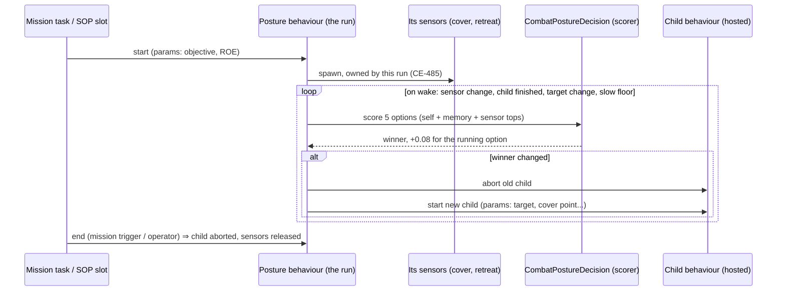

*What the picture shows that prose hid: the sensors are spawned by the POSTURE run, before any child runs — an option
is scored from a sensor that its own child behaviour would otherwise only start once it had already won.*

| option | inputs it scores on (as built) | child behaviour | exists? |
|---|---|---|---|
| AdvanceAndAttack | health, ammo, enemy strength (inverse), have target | advance to objective + fire at target | ⚠ `MoveToLocation` + `FireAtTarget` exist separately; one move-and-shoot child is needed (G9: one behaviour owns every channel) |
| TakeCover | health (inverse), cover sensor top score, enemy strength | move to the cover point, fire from it | ⛔ no cover behaviour; template `FindCoverFromTarget` exists |
| Suppress | ammo, have target, ally advancing nearby | fire at target from here | ✅ `FireAtTarget`; ⛔ `AllyAdvancingNearby` is a stub returning 0 (`StandardInputs.cs` §D) ⇒ weighted product ⇒ **Suppress always scores 0** |
| Flee (fall back) | health (inverse quadratic), retreat sensor top score, enemy strength | move to the retreat point | ⛔ no fall-back behaviour; template `FindSafeRetreatPoint` exists (`StarterTemplates.cs`) — the `CE-2051` remark in `CombatPostureDecision.cs` is stale |
| Hold | health, constant 0.2 (weighted sum — the floor) | hold position | ✅ `HoldPosition` |

📐 **Measured against the decided rulings:**

| fact | source | consequence |
|---|---|---|
| `EnemyStrengthRatio` sums `TargetMemory.ThreatScores`, which DECAY over time | `StandardInputs.cs` `EnemyStrengthRatio`; `ThreatEvaluationSystem.cs:57` | ⛔ contradicts **G1** (`R-194`: danger does not fade). Three of five options read it ⇒ a hidden enemy makes the unit braver |
| `HaveLiveTarget` = memory count > 0, no freshness | `StandardInputs.cs` `HaveLiveTarget` | a contact seen once long ago keeps `AdvanceAndAttack`/`Suppress` alive — needs the memory stage's freshness |
| `EqsTopScore` finds ANY EQS child of the unit with the template id | `StandardInputs.cs` `TryFindEqsChild` | a sensor only scores while something has spawned it ⇒ the posture run must own it |
| behaviour-owned sensors are stamped with the ROOT run and keyed by (site, key, run) | `EqsChildSensor.cs:30–37` | a child switch does not release them (good); a child spawning the same template at its own site makes a SECOND sensor — ⭐ ACCEPTED `2026-10-04`: each behaviour owns its own sensor, the solver solves identical queries once (`CE-3056`, `DESIGN_Sensors_And_Doctrine.md` §5.6) |
| an SOP cannot replace a mission task | `R-188` (`Operator > Superior > SOP`) | a posture SOP never interrupts a running mission task — see the open questions |

#### Which asset type hosts it *(lean, under discussion — user `2026-10-04`: "ok with using the combat posture as a mission task")*

The utility design gives each tier its own way to use a decision (`Utility_AI_Design_v1_1.md` §7.1–§7.3); none needs the
decision itself to know about behaviours ⇒ ⛔ the earlier idea of binding options to behaviours inside the decision asset
is dropped: the HOST's structure is the binding.

| host | what exists | what is missing |
|---|---|---|
| ⭐ **Behavior-kind blueprint** *(lean)* | `ScoreDecision` (hysteresis inside), `SpawnEqsSensor` / `ReadEqsResult`, the Behaviour Task node with Start / Abort (S7, `CE-2019`/`CE-2020`), any tier as the child (S5a) | the unit's `UtilityResultBuffer`; a decision picker in Details; hysteresis memory per call site, not per unit; one Behaviour Task node per option (the author wires the switch) |
| HSM | states host any-tier children; guards read live (`R-155`); `UtilityTransitionArbiter` (C# helper) | the arbiter as an authorable guard; something that scores each tick; sensor spawning from an HSM |
| BTree | `Subtree` hosts any tier; `ObserverSelector` in the vocabulary | ⛔ the interpreter runs `ObserverSelector` as a plain selector (`Interpreter.cs:267`) — no abort until `CE-3041`; ⛔ `Service` has no interpreter case; `UtilitySelectorNode` is a C# helper, not a node |

### 3.2 One scoring step for all three hosts *(PROPOSAL — lean awaiting approval)*

> 🔒 **User, `2026-10-04`:** *"if UtilityTransitionArbiter got forgotten because of refactor, shouldn't we re-make it as now
> it is just a dead and wrong code? seems like an omission. Same with the btree - there are no reall assets that can need
> them. We are building infrastructure so such assets can be created at all."*

📐 **Corrected `2026-10-04`:** a BTree condition CAN keep per-unit state. Since `CE-504` (one C# node signature for BTree
and HSM) a `[SharedAiCondition]` takes `(Entity, EntityRepository)`, `(ref P, Entity, EntityRepository)` or the STATEFUL
`(ref P, ref WS, Entity, EntityRepository)` — the working state lives per unit in the behaviour's block
(`DESIGN_BTree_Node_Call_Shapes.md` §4 C-2, slices 1–4 built), and the same method binds as an HSM transition guard
(`DESIGN_Behavior_Action_Binding.md` §5.3b `S8`, built; `ActionSchemaExporter.cs` gives a shared condition the guard bit).
Actions and conditions read their bound host variables live (`R-155`).

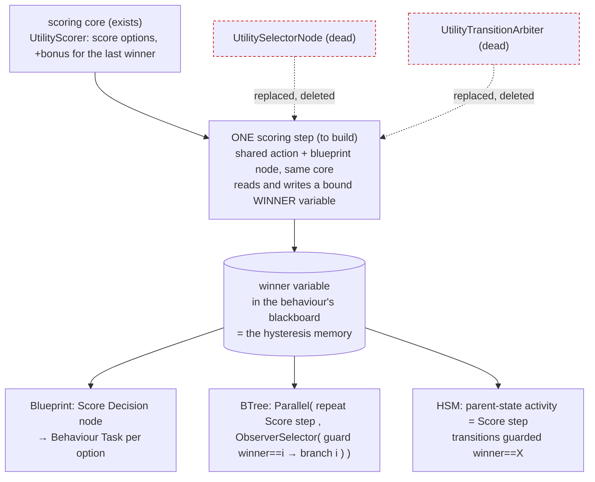

*What the picture shows that prose hid: the three hosts differ only in HOW they switch; WHAT wins is one step, and the
memory of the last winner is an ordinary variable — so two decisions on one unit no longer share one buffer, and the
debugger's Watch shows the current posture.*

| | |
|---|---|
| ⭐ lean | one scoring step (a `[SharedAiAction]` for BTree/HSM, and the existing blueprint node, both calling one core) that writes the winner into a bound variable; branches and transitions only compare that variable. The two dead helpers are deleted, not re-made |
| still needed for the BTree | `CE-3041` (`ObserverSelector` aborts the running lower branch) — today it runs as a plain selector (`Interpreter.cs:267`) |
| rejected | re-make the two helpers 1:1 — two implementations of one concept, and each guard would score separately (five scorings a tick, five memories) · keep the per-unit `UtilityResultBuffer` as the memory — two decisions on one unit overwrite each other |

### 3.3 The build design — one scoring step, three hosts, combat posture first *(build-state: READY-TO-BUILD — approved by the user `2026-10-04`; tasks `CE-2067`–`CE-2073`; not started)*

> 🔒 **User, `2026-10-04`:** *"approved. pls write the design diagrams. record tasks. do not start building yet."*

**Basis:** §3.1 (posture composition), §3.2 (one scoring step, approved), `R-197` (infrastructure for all three tiers),
`R-194` (danger at read time), `R-155` (actions / conditions read bound host variables live), `R-184` (the TYPE makes a
field pickable), `CE-504` / S8 (one shared C# node signature; stateful form on BTree and HSM).

*What the picture shows that prose hid: there is ONE scorer entry per mode, and three thin callers; the memory of the
last winner moved off the unit (`UtilityResultBuffer`) into the CALLER's own storage — a bound variable for BTree/HSM, a
hidden node field for the blueprint — so two decisions on one unit cannot collide and the scorer needs no component.*

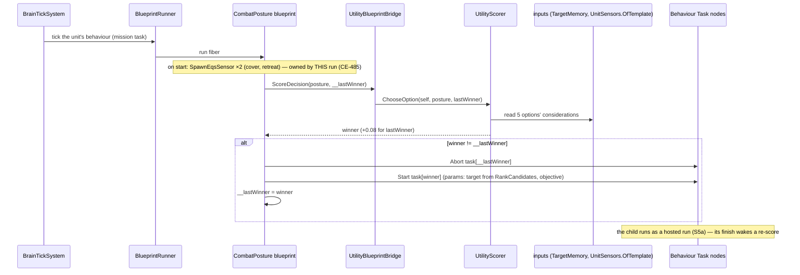

*What the picture shows that prose hid: the posture never moves the unit itself — every frame it only decides; the
moving and firing is always one hosted child at a time (G9).*

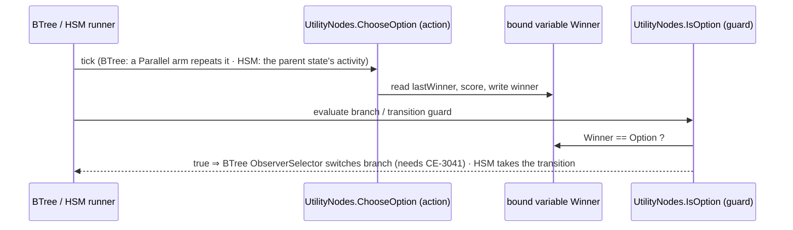

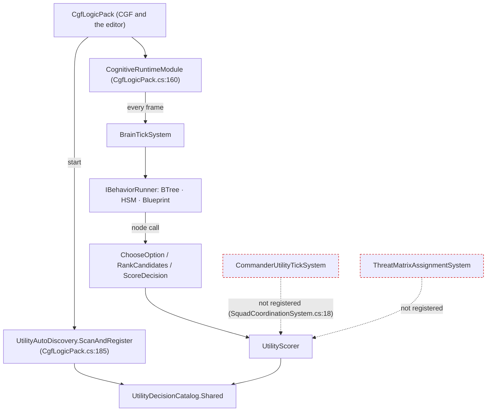

*What the picture shows that prose hid: nothing new is scheduled — the scorer only ever runs inside a behaviour's own
tick, on the editor and CGF alike (both build `CgfLogicPack`); the two squad systems (red) stay unregistered and are not
part of this plan.*

| task | what | depends on | touches the backend lane? |
|---|---|---|---|
| `CE-2067` | scorer core without the unit buffer: `ChooseOption`, `RankCandidates` | — | no |
| `CE-2068` | `UtilityDecisionRef` + its Details picker (the type makes the field pickable) | — | no |
| `CE-2069` | `UtilityNodes` (shared action ×2 + condition) for BTree and HSM; rails: a BTree and an HSM switch on the winner; measure the BTree Parallel-repeat shape first (§3.2's assumed row); delete `UtilitySelectorNode` / `UtilityTransitionArbiter`; mark utility design §7.1–7.2 superseded | `CE-2067`, `CE-2068`, `CE-3041` for the BTree rail | no |
| `CE-2070` | `ScoreDecision` node rerouted: hidden `__lastWinner`, ranking pins, no unit buffer needed | `CE-2067`, `CE-2068` | no |
| `CE-2071` | ⚠ **SHRUNK `2026-10-04`** (user: *"backend builds sensor lookup"*; FRAME_Decision_Layer Addendum 3): `OfTemplate` is BUILT by backend; ours is only rerouting `EqsTopScore` / `EqsResultCount` onto it. ⛔ *"children reuse the posture's sensor"* is SUPERSEDED: every behaviour that needs a query spawns its OWN sensor (no borrowing) and the solver answers identical queries once (`CE-3056`, backend) | — | no (backend part done) |
| `CE-2072` | `CombatPostureDecision` tuning: Suppress without the stub input; the stale `CE-2051` remark | — | no |
| `CE-2073` | the `CombatPosture` blueprint behaviour + acceptance in `tt-nav-los` as a mission task | `CE-2067`–`CE-2072`, `CE-3031` children, `CE-3054` | no |
| `CE-3054` *(existing, ours)* | threat inputs to `R-194`: danger from the TKB judged at read time × freshness | the backend's memory stage (`CE-3037`) | ⚠ **yes — joint freshness design** |
| `CE-3031` *(existing, ours)* | the children: take cover, fall back, advance-and-fire | `CE-2071` | no |
| `CE-3041` *(existing, ours)* | `ObserverSelector` aborts the running lower branch | — | no |

## 4. Standing orders and drills — reacting without embedding it in every behaviour *(PROPOSAL, under discussion)*

> 🔒 **User, `2026-10-04`:** *"Standing orders sound good."* (the name for what the corpus calls the DOCTRINE — rename
> sweep deferred until this section settles) · *"if a unit is directly ordered to patrol or something that does not
> involve combat directly, i do not want to embed in each behavior that when fired upon, the unit should take cover, and
> maybe return fire or whatever which is ok with the rules of engagement."*

📐 **The gap, measured `2026-10-04`:** an order outranks standing orders (`R-188`), so a patrol ordered at `Superior`
cannot be interrupted by them; the only built interrupt is `CognitiveInterruptType.MobilityLost`, which each HSM must
handle itself (`CognitiveInterruptType.cs`); no reaction, battle-drill or suspend/resume concept exists (grep
`ReactToContact|battle drill|Reaction(Layer|System)`: none); ROE exists nowhere in code (G7). ⚠ A behaviour that is
REPLACED publishes no finish (the only publisher is `BrainTickSystem.cs:298`), but a behaviour that ENDS does, and
`MissionDirectorSystem` advances on any `BehaviorFinishedEvent` for the entity ⇒ a drill ending would advance the
mission unless the finish says whose run ended.

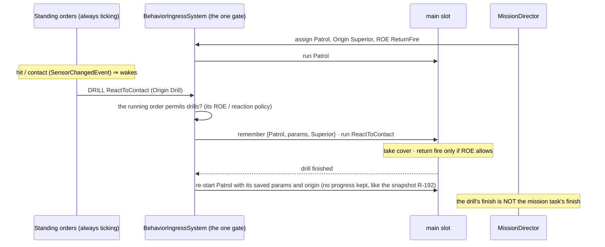

*What the picture shows that prose hid: the reaction lives once, in the unit's standing orders, not in Patrol; the order
decides whether it may be interrupted; and the gate — not the drill author — remembers and restores the task.*

### 4.1 Refined with the user — the SOP, reactions, and what RESUME would take *(PROPOSAL v2)*

> 🔒 **User, `2026-10-04`:** *"drill interrupts, task restarts afterwards is acceptable for now, resume would be better"* ·
> *"isnt SOP - standard operation procedure - closer in the meaning to what we need?"* · *"the doctrine keeps running also
> while the 'interrupt handler' is running so no further interrupt of same or lower priority should be allowed"* · *"it
> should stay relatively simple otherwise no one would understand it"*

| word | means |
|---|---|
| **task** | what the unit was told to do (operator, superior, mission) — one at a time |
| **SOP** | the unit's own logic, always ticking: what to do when idle + how to react to events |
| **reaction** | a behaviour the SOP starts to answer an event; it PAUSES the task, the task continues after |

| rule (enforced by the one gate, `BehaviorIngressSystem`) |
|---|
| ① a task beats the SOP's idle choice |
| ② a reaction pauses the task — unless the order forbids reactions — and the task continues when the reaction ends |
| ③ a running reaction yields only to a MORE urgent reaction or a new order; same or lower urgency is refused |
| ④ at most ONE thing is paused: the task (a more urgent reaction replaces a less urgent one, it is not stacked) |

⭐ **AS-BUILT `CE-2078` (`2026-10-04`) — the four rules are in the gate.** `BehaviorIngressSystem.AdmitsWithReactions`
applies them; a reaction is an assignment with `Origin = Reaction` and an `Urgency` (`Alert < Contact < UnderFire < Hit`;
none given ⇒ `Alert`), both stored on `BehaviorState`.

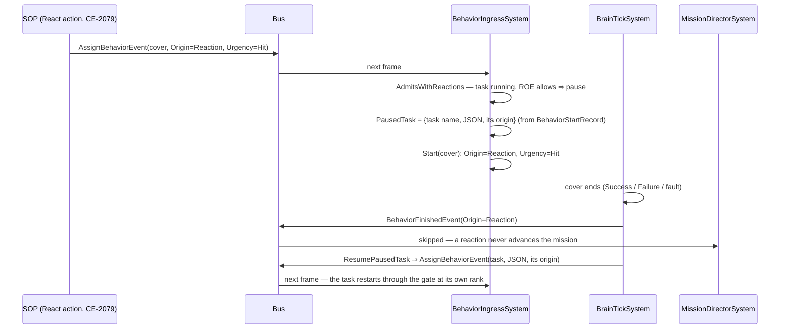

*What the picture shows that the rules table cannot: the paused task is never held in the slot — it is a RECORD
(`PausedTask`, managed, transient) and comes back as an ordinary assignment through the same gate, one frame after the
reaction ends. ⇒ restart, not resume (`CE-2081`).*

| incoming ↓ · running → | empty / SOP idle choice | a task (Superior / Operator) | a reaction (urgency r) |
|---|---|---|---|
| **reaction, urgency u** | start, pause nothing | ROE `StayOnTask` ⇒ refuse · else **pause the task**, start | u > r ⇒ replace (the paused task stays) · else refuse |
| **SOP idle choice** | rank rule | rank rule (refused) | refuse (and wake the SOP) |
| **an order** (assign or clear) | rank rule | rank rule | weighed against the PAUSED task's origin; admitted ⇒ the paused task is dropped |
| **Self** | admit | admit | admit — a reaction restarting itself stays a reaction; a reaction clearing itself **restarts the task** |

| as built | where |
|---|---|
| a reaction ENDS three ways, each restarts the paused task: finish, self-clear, a failed hot-reload restart | `BrainTickSystem.Finish` · `ClearResumingAPausedTask` · the ingress clear path |
| a task stamped directly (no `BehaviorStartRecord`) cannot be restarted ⇒ the reaction simply replaces it | `PauseRecord` |
| the hash path (`AssignBehaviorHashEvent`, mission phase advance) is gated the same; it carries no urgency | `Execute` |
| ⚠ not built: a reaction published to the SOP slot (`AssignSopEvent`) is ranked as an order — the React action never does that | follow-up, with `CE-2079` |

Rails: `SopSlotTests.CE2078_*` (6) · `MissionDirectorSystemTests.CE2078_AReactionsFinish_DoesNotAdvanceTheMission`.

⭐ **Planned demo (`CE-2082`, user `2026-10-04`):** a recipe scenario `Recipes/Scenarios/sop-demo` that exercises exactly
this table — a squad fired upon on a move task (reaction, pause, restart), a squad under ROE `StayOnTask` (refused), an
idle unit whose idle choice yields to an order — with a headless rail asserting the sequence. Built after the recipe
(`CE-2080`).

📐 **What resume would take — measured `2026-10-04`:**

| run state | where it lives | on pause / resume |
|---|---|---|
| hash, preemption token, tier | `BehaviorState` (`BehaviorComponents.cs:44`) | save on a one-deep stack, restore |
| params, variables, tree cursor, HSM instance | the entity's block, keyed by behaviour hash (`OccurrenceSlotKey.ComputeRootStateKey`) | today REPLACING a behaviour detaches its slots (`DetachHostedOccurrenceSlots`, `BehaviorIngressSystem.cs:546`) ⇒ pause must SKIP that detach; the store must hold task + reaction together |
| owned sensors | stamped with the run's token, released on the three token sites (`BehaviorIngressSystem.cs:163, :295`) | pause must not release them |
| in-flight channel commands (a move under way) | cancelled once the token changes (`ChannelArbitrationSystem.cs:44`) | ⚠ THE DEVIL: the paused task's running leaf waits for a command that no longer exists ⇒ resume must RE-ENTER the running leaf (BTree deactivator + reactivate, HSM re-enter the current state, blueprint latent re-issue) — progress kept, only the leaf restarts |
| timers | absolute sim time (`__waitUntilTime`) | expire during the pause — acceptable |
| same asset as task and reaction | one hash ⇒ one block key | collision — refuse, or key by slot |

### 4.2 How an SOP is authored — a table first, a smarter tier when the table is not enough *(⛔ SUPERSEDED by §4.3 the same day — the "table" is a BTree; kept for its two-actions diagram)*

> 🔒 **User, `2026-10-04`:** *"SOP name accepted. 3 words and 4 rules accepted. Urgency accepted. Restart with resume as
> followup accepted."* (`R-198`, `R-199`) · *"could there be such a table (replacable by blueprint if table is not
> sufficient?) Or BTree/HSM as smarter version of the table … SOP should also be possible to program as c# hardcoded - so
> it should likely have a behavior shape."*

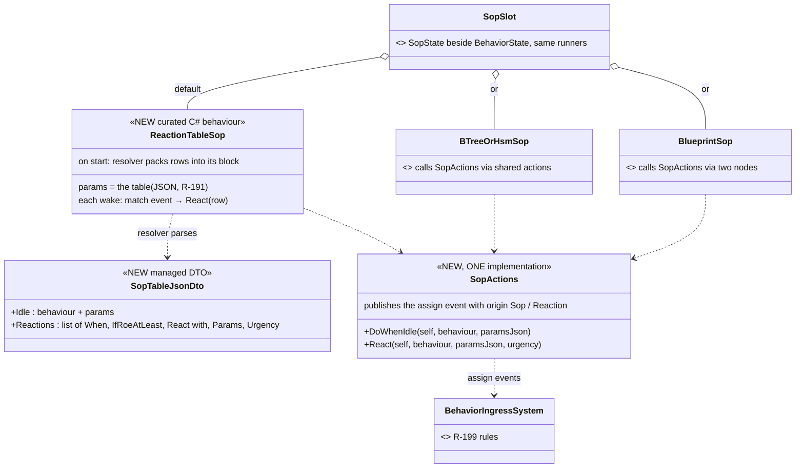

*What the picture shows that prose hid: the table is not a new asset kind — it is one built-in C# behaviour whose params
are the table, so it proves the "C# SOP" path, is edited by the one params form (`CE-3043`), saved like any params
(`R-191`/`R-192`) and named per unit type by the TKB; every richer SOP is just another behaviour in the same slot calling
the same two actions.*

| level | when to use it | what it adds over the table |
|---|---|---|
| ① **reaction table** (default) | most units | — *idle behaviour + rows "when ⟨Hit / FirstThreat / Acquired / AllClear⟩, if ROE ≥ x, react with ⟨behaviour, params⟩ at ⟨urgency⟩"* |
| ② **HSM SOP** | the reaction depends on a MODE (relaxed / alert / engaged) | per-state rows, transitions on sensor events (`CE-3040`), the mode visible in the debugger |
| ③ **BTree SOP** | the reaction depends on CONDITIONS polled each wake (danger, ammo, distance) | a priority list re-evaluated from the root |
| ④ **blueprint SOP** | anything else — utility scoring, timers, custom events | full flexibility |
| C# | hard-coded logic | any curated behaviour calling `SopActions` — the table itself is one |

### 4.3 Feasibility — the BTree IS the table *(PROPOSAL, supersedes §4.2's separate table)*

> 🔒 **User, `2026-10-04`:** *"the trigger would need to be a condition like in BTree, not just event, it must be more
> flexible; Isn't the btree exceptionally well suited for replacing the table? … just not sure about the urgency
> priorities … The SOP should still come from TKB and still should be replacable at runtime"*

📐 **Measured:**

| question | answer | where |
|---|---|---|
| can params hold an array of structs? | ✅ yes — a fixed-capacity list of any type, parsed / formatted by name | `BlueprintTypeRef.Capacity` (`Declarations.cs:43-60`), `InstanceEmitter.EmitParamsDefaults` |
| can a table row hold a flexible condition? | ⛔ only by inventing an expression language inside params | — ⇒ a BTree condition node already IS that, with an editor |
| how does a BTree hand params to a sub-behaviour? | a node names a host variable (`ParamsVariable`) holding the child's typed params DTO | `BehaviorTreeAssetDto.cs:220`, `DESIGN_Parameter_Model` §P |
| can a condition read "was hit recently"? | ⛔ no readable state — `SensorChangedEvent` lives one frame and the SOP wakes the NEXT frame | `SensorChangedEvent.cs`, `R-195`; grep `LastHit\|LastDamage`: none |
| can the TKB name an SOP with params? | ⛔ the profile holds a behaviour HASH only | `BehaviorProfileDto.DefaultBehaviorHash` |

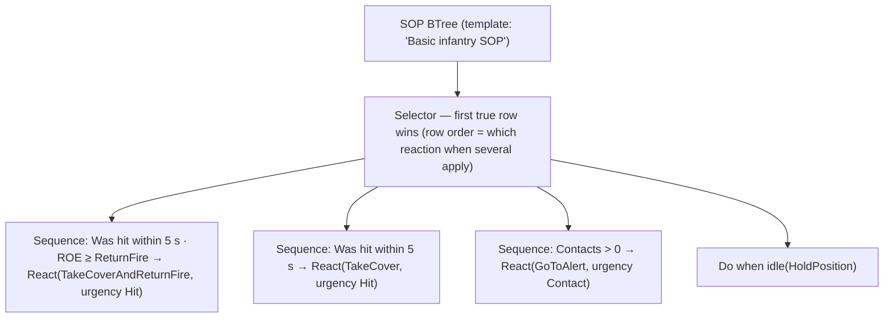

*What the picture shows that prose hid: a reaction table is exactly a Selector of condition → action rows, read top to
bottom; every leaf is INSTANT (React and Do-when-idle only publish an assignment — the reaction runs in the main slot), so
the SOP tree finishes every wake and is re-read from the root next time — no running branch to abort (no dependency on
`CE-3041`).*

| | |
|---|---|
| ⭐ row order vs urgency | **row order** decides WHICH reaction when several conditions are true at once; **urgency** (a field on React) decides whether it may interrupt what is ALREADY running (`R-199` ③) — two different questions, both needed |
| ⭐ conditions read STATE | a small per-unit `RecentSenses` (last tick of each `SensorChange` kind), written by one system from `SensorChangedEvent` ⇒ *"was hit within N s"*, *"contact within N s"*; plus existing state (contacts now, health) and the new ROE |
| ⭐ React = the Subtree node's shape | behaviour picker + `ParamsVariable` (typed params, edited as defaults in the BTree editor) + urgency; at fire the params are formatted to JSON for the assignment (blueprints: `FormatParams`, CE-3044; curated: their JSON DTO; ⚠ BTree/HSM asset params — to measure) |
| ⭐ TKB + runtime replace | the TKB profile gains `DefaultSop {Name, ParamsJson}`; replacing at runtime = an SOP assign at Operator / Superior (`CE-3035`); saved by the snapshot (`CE-3042`) |
| ⭐ C# | a curated BTree built in C# (how `MoveToLocation` is made), or any curated behaviour calling the two actions |

### 4.4 Params to JSON, the recipe, and the ROE *(✅ ROE approved `2026-10-04`, R-200 — 🔒 *"ROE shape ok."*)*

> 🔒 **User, `2026-10-04`:** *"yes it is OK."* (§4.3) · *"I would guess that by simple serializing of the behavior param
> dto"* · *"Shipped template = recipe (existing concept)"* · *"What the ROE would look like?"*

📐 **Params → JSON, measured:** every behaviour declares its authored params type, `BehaviorDefinition.JsonParamsDtoType`
(`BehaviorRegistry.cs:289`) — the "editor fields + JSON schema" type the intent JSON deserialises into. It is a STRUCT for
all three kinds: curated (`MoveToLocationParamsJsonDto` is a struct, `MoveToLocationParamsJsonDto.cs:27`), generated
BTree/HSM (the emitted `*_Blackboard`), blueprint (its `Params`, with an emitted `FormatParams`, CE-3044). A struct can be
a blackboard variable (`Demo_MissionPlan` holds one) ⇒ **React binds a variable of the reaction's authored DTO type; at
fire it is serialised with the same options the parse side uses** (`IncludeFields`, case-insensitive names, the
`EntityRef` bare-number converter) — the exact inverse of the intent path. ⚠ One shared options object and a round-trip
rail per kind, so the two directions cannot drift.

📐 **Recipe:** recipes are the shipped-template concept and already know BTrees — `AssetRoots` names `Recipes/BTrees`
(`AssetRoots.cs:207-215`); the folder does not exist yet in `Hrot.AI.Behaviors/Recipes` (only Blueprints, Scenarios,
Terrain). ⇒ the SOP template ships as `Recipes/BTrees/BasicInfantrySop`.

**ROE — the lean:** one small per-unit component, two fields, the military "weapons control" axis plus the "may I
deviate from my task" axis (the shape many simulators use — e.g. hold fire / defend only / fire at will):

| field | values | read by |
|---|---|---|
| `Fire` | `HoldFire` (never) · `ReturnFire` (only when fired upon — was hit / shot at within N s) · `FireAtWill` | SOP conditions; ⭐ ENFORCED once in the fire executor (`AimAndFireExecutor`, the only weapon-channel executor) so no behaviour can forget it |
| `Reactions` | `StayOnTask` (the order forbids reactions — R-199 ②) · `React` | the gate (`BehaviorIngressSystem`) |

| rule | |
|---|---|
| set by | an order (Operator / Superior) — with the assignment or on its own; the TKB gives the default per unit type |
| lifetime | unit state, persists across tasks until changed (ROE are set by command, not per task); a mission task MAY set it |
| saved | in the scenario snapshot when it differs from the TKB default (`R-192`) |
| edited | a row in the editor AI section (`CE-3043`) |
| later | `WeaponsTight` (identified hostiles only) needs identification (G11) — not now |

> ⭐ **AS-BUILT `CE-2074` + `CE-2076` (`2026-10-04`).** `Roe {Fire, Reactions, SetBy}` (`Behavior/Components/Roe.cs`),
> changed only by `SetRoeEvent` through `RoeSystem` (gated like a behaviour: a lower origin than `SetBy` is refused; the TKB
> default has `SetBy = Unmarked` and yields to anyone); TKB `DefaultRoeFire` / `DefaultRoeReactions`; reads go through
> `RoeOf` (no component / zero ⇒ `FireAtWill` / `React`). ⚠ Deviation: the zero members are `FireUnset` /
> `ReactionsUnset`, not `Unset` — the DDS code generator emits IDL for every component and IDL puts every enum member of
> a module in one scope. `RecentSenses` (`Behavior/Components/RecentSenses.cs`) is written by `RecentSensesSystem`, the
> Input-phase system of `CognitiveRuntimeModule` (⛔ first drafted as the first SIMULATION system — that shifted the
> rails that index the simulation list, so it moved, `2026-10-04`); conditions read `RecentSensesOf.Within(view, unit, kind, seconds)`.
> Not yet: the fire guard (`CE-2075`, backend's executor), saving (`CE-3042`), the editor row (`CE-3043`).

### 4.5 Keeping the SOP off the channels — measured *(PROPOSAL)*

> 🔒 **User, `2026-10-04`:** *"How can be calling actions touching various channel avoided from SOP btree? Isn't SOP just a
> behavior that naturally can call action nodes? Is it necessary to prevent it? Maybe the roslyn analyzers can just warn?"*

📐 **What already knows which channels a behaviour drives:** C# actions declare `[WritesChannel(Locomotion | Weapon |
Interaction)]` (`SharedAiAttributes.cs:89`, 20 production methods; the BTree/HSM generators already use it for cleanup
wrappers) · a blueprint's channels are DERIVED by the compiler, nothing authored (`BlueprintChannelDerivation`, CE-388 —
"an empty list means commands no channel") · at runtime an SOP's channel command is cancelled by construction
(`ChannelArbitrationSystem.cs:44`, the SOP token space is disjoint — §6 of the sensors design).

| layer | lean |
|---|---|
| why prevent at all | ⭐ yes, semantically: one owner per channel (G9). An SOP that moves the unit fights the task it is supposed to sit beside — exactly what the gate and the pause exist to prevent; anything that must move the body goes through React |
| ① assign time | ⭐ the SOP slot REFUSES (visibly, like an origin refusal) a behaviour whose channel set is non-empty — the union of its bound actions' `[WritesChannel]` (BTree/HSM, stored at registration — small new work) or its derived blueprint channels |
| ② editor | the AI section's SOP row offers only channel-free behaviours; the BTree editor warns on a channel-writing node in an asset tagged as an SOP (the recipe carries the tag) |
| ③ C# | an analyzer WARNING when a curated SOP binds a `[WritesChannel]` method |
| ④ runtime backstop | the first cancelled SOP channel command per run is logged loudly, never silent |

### 4.6 The two SOP actions — `CE-2079` *(build-state: BUILT, `2026-10-04` — as-built below the rules table)*

> 🔒 Approved with §4.3–§4.5 (*"ok approved. start building"*, `2026-10-04`). This section is the build design.

**INVENTORY** *(the code-graph index could not be built this session — a run aborted on files changing under a build —
so this is `grep` over `*.cs`, `2026-10-04`, stated as such)*: `SopActions|DoWhenIdle|SopOrder|ReactNode` → **0** hits.
No BTree action publishes `AssignBehaviorEvent`; two publish `AssignTacticalIntentEvent` (`CommanderNodes.cs:67`,
`HillAttackCommanderNodes.cs:125` — the latter serialises its DTO with `FdpJsonOptionsRegistry.DefaultRelaxed`). The ONE
params options object already exists: `BehaviorParams.JsonOptions` ⇒ `DefaultRelaxed` (`BehaviorParams.cs:72`); every
parse path aliases it (curated `FromBlockResolver`, generated BTree/HSM `__paramJsonOpts`, blueprint `__ParamJsonOptions`).

📐 **The measurement that decides the node's shape:** a BTree action node carries NO constants — everything reaches the
method through ONE host variable (`BehaviorActionBindingDto.ExpressionTargetField`; the delegate's `int` is the payload
index, not a parameter). ⇒ a node that names a behaviour, an urgency AND a typed params variable cannot be an action
binding; it needs a payload, exactly as `Subtree` has (`BTreeSubtreePayloadDto {SubtreeName, ParamsVariable}`) — which
§4.3 already said (*"React = the Subtree node's shape"*). ⭐ **As built it is a payload ON THE ACTION NODE, not a new node
kind** (`BTreeActionNodeDto.SopOrder`): the editor's node model is keyed by the KERNEL's `Fbt.NodeType`, so a new kind
would have meant a kernel node type that never executes — while an action node already is an instant leaf with pills,
and the order lowers to an action key anyway.

*What the picture shows that prose hid: there is ONE implementation (`SopActions`) and every authoring surface — C#, the
BTree node, later the blueprint node — only calls it; the BTree node needs no runtime node type at all, it lowers to an
ordinary action key whose generated thunk calls `SopActions` with the variable projected at its baked offset.*

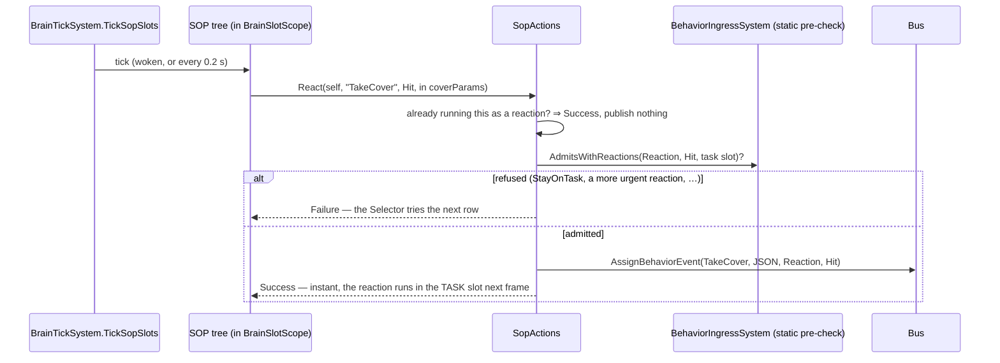

*What the picture shows: the action never publishes something the gate will refuse. ⚠ That matters beyond tidiness — a
refused Sop-origin assignment WAKES the SOP (R-195), so a `DoWhenIdle` that published blindly under a running order would
wake itself every frame.*

| rule | why |
|---|---|
| both actions are INSTANT (Success / Failure, never Running) | §4.3: the SOP tree finishes every wake, no running branch to abort |
| `DoWhenIdle` publishes only when the task slot is empty or runs ANOTHER Sop-origin choice (or the same one with different params) | re-publishing the running idle choice every 0.2 s would restart it; publishing under an order is refused and wakes the SOP |
| `React` returns Success without publishing when that behaviour already runs as a reaction | the condition stays true for seconds after a hit; the reaction must not restart on every wake |
| params serialise with `BehaviorParams.JsonOptions`; no params variable ⇒ `"{}"` (authored defaults) | one options object both ways; a round-trip rail per kind (curated, generated BTree, blueprint) pins it |
| the editor surface (palette entries "Do when idle" / "React", the behaviour picker, the variable + urgency fields) | follows the node — mirrors the Subtree node's inspector |
| ⚠ the analyzer warning (§4.5 ③) | the BTree generator warns when an SOP tree binds a `[WritesChannel]` method; ⭐ as built NO flag: a tree that carries SOP orders IS an SOP (`BTREE0004`) |

⭐ **AS-BUILT `CE-2079` (`2026-10-04`).**

| piece | where |
|---|---|
| the ONE implementation | `Fdp.Toolkits/Behavior/SopActions.cs` — `DoWhenIdle` / `React` (by JSON or by typed params), `ToJson`; pre-checks `BehaviorIngressSystem.AdmitsWithReactions` |
| the BTree node | `BTreeActionNodeDto.SopOrder` (`BTreeSopOrderPayloadDto {Kind, BehaviorName, ParamsVariable, Urgency}`; `SopUrgencyDto` mirrors `ReactionUrgency` because the persistence assembly is netstandard2.0) · topology `BTreeEmitCore.EmitAction` → `.Action(key)` · bridge `BTreeBridgeEmitCore.EmitSopOrderThunks` → one `SopActions` call, params projected at the HOST offset · ONE key spelling `BTreeSopOrderPayloadDto.ActionKey` |
| the editor | palette group "SOP" — "Do when idle" / "React" (`BTreeKinds.SopDoWhenIdle` / `SopReact` → an action node with the order) · `BTreeSopOrderFacet`: behaviour (`[AiBehaviorPicker]` — every registered behaviour, any tier, hand-written included), params variable (COMPOSED on pick, typed as the behaviour's authored params — `ChildInputTypes.ParamsDtoLookup`; a class DTO binds nothing ⇒ defaults), urgency · validator `SopOrderIncomplete` · mapper both ways |
| the warning | `BTREE0004` (`BTreeJsonGenerator.ReportSopChannelWrites`) — once per channel-writing method in a tree that carries SOP orders; a warning, the asset still builds |
| rails | `SopSlotTests.CE2079_*` (5, incl. the curated round-trip) · `SopParamsRoundTripTests` (EVERY production behaviour of every kind reads what an order sends — two values, two blocks) · `SharedAiBindingCompilesTests.CE2079_*` (2, compiled) · `BTreeFacetMapperTests.CE2079_*` (2) · `BTreeValidationTests.CE2079_*` · `BTreeCommandSinkTests.CE2079_*` |
| ⚠ not built | an SOP order in an HSM state or a blueprint node (an HSM / blueprint SOP calls `SopActions` from C# today) — follow-up; the C# SOP path needs nothing more |

### 4.7 The shipped SOP — `CE-2080` *(build-state: BUILT, `2026-10-04`)*

`BasicInfantrySop` — ONE file, two roles: compiled from `Hrot.AI.Behaviors/Assets/BTrees/Sop/` (so a TKB template can name it
as `DefaultSop`, `CE-2077`) and published as the BTree recipe at `Recipes/BTrees/` (a `Content` link in the `.csproj` — a
copy would drift). It is §4.3's reaction table, built only from the pieces §4.4–§4.6 added:

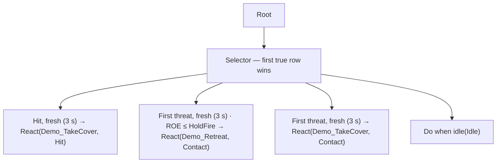

*What the picture shows that prose hid: the ROE row sits ABOVE the general contact row — row order is how "a unit that must
hold fire withdraws instead of taking up a firing position" is expressed, with no special rule anywhere.*

| decision | why |
|---|---|
| ⭐ rows ask **SensedFresh**, not "sensed within N s" | 📐 measured on this recipe: the stand-in cover lasts 1 s, so a plain 3-second window re-fired the same hit's reaction after the task restarted (rail red-proved). ⭐ Fresh = within N s **and** since the task slot's current run began (`BehaviorState.RunSince`, set by every start and clear) — an event that already caused a reaction is older than the restarted task |
| conditions are shared C# (`Fdp.Toolkits/Behavior/SopConditions.cs`: `SensedWithin`, `SensedFresh`, `RoeFireAtLeast`, `RoeFireAtMost`) | any BTree / HSM asset binds them; params `SopSenseParams {Kind, Seconds}`, `SopRoeParams {Fire}` |
| the reactions are the existing `Demo_TakeCover` / `Demo_Retreat` stand-ins (a 1 s / 0.5 s delay) | ⚠ no real take-cover behaviour exists yet; a project swaps them in the React node's behaviour picker — the recipe shows the SHAPE |
| ⚠ not built | edge-latching for conditions that are not sensing changes (e.g. "health below 30 %" stays true) — a row on such a condition re-fires after each reaction; the fresh rule covers sensed EVENTS only |

Rails: `BasicInfantrySopTests` (SimHost, the production registry through the real ingress + brain: idles with no order; a
hit pauses the task with cover, the task restarts, the same hit does not fire again; HoldFire withdraws, otherwise cover).

## ⛔ HISTORY

*Superseded `2026-10-04` the same day:* a §2 "the mission as a doctrine" with leans M1–M6 (a mission graph in the
doctrine slot, triggers retired). ⛔ WITHDRAWN — it misread the user's G2 remark; the mission is not changed (§2).
