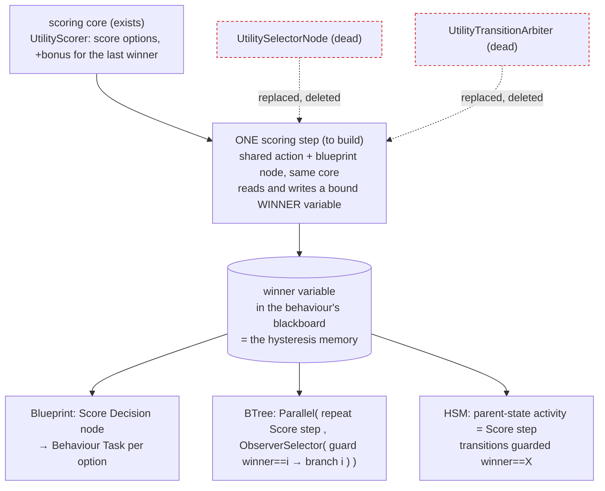
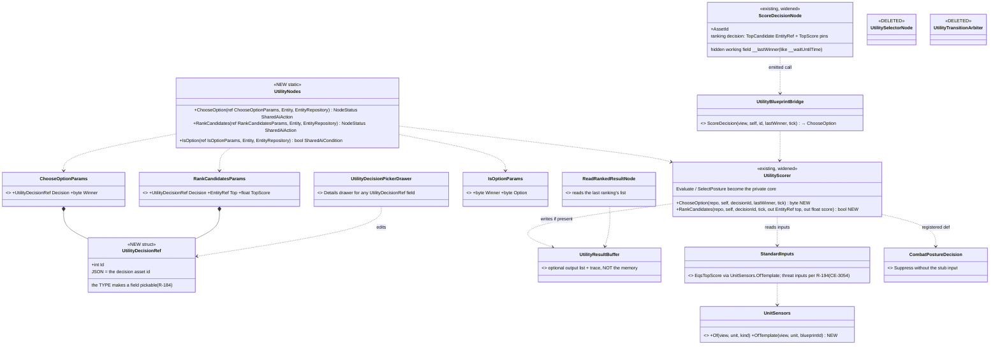
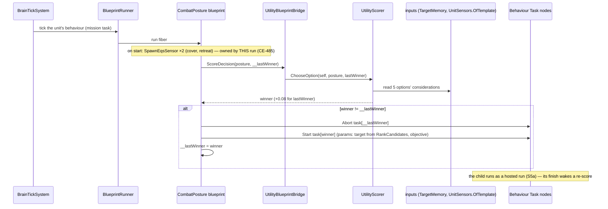
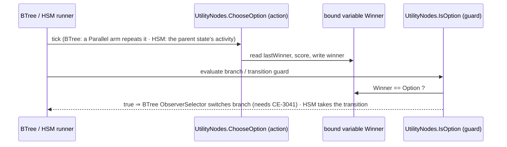
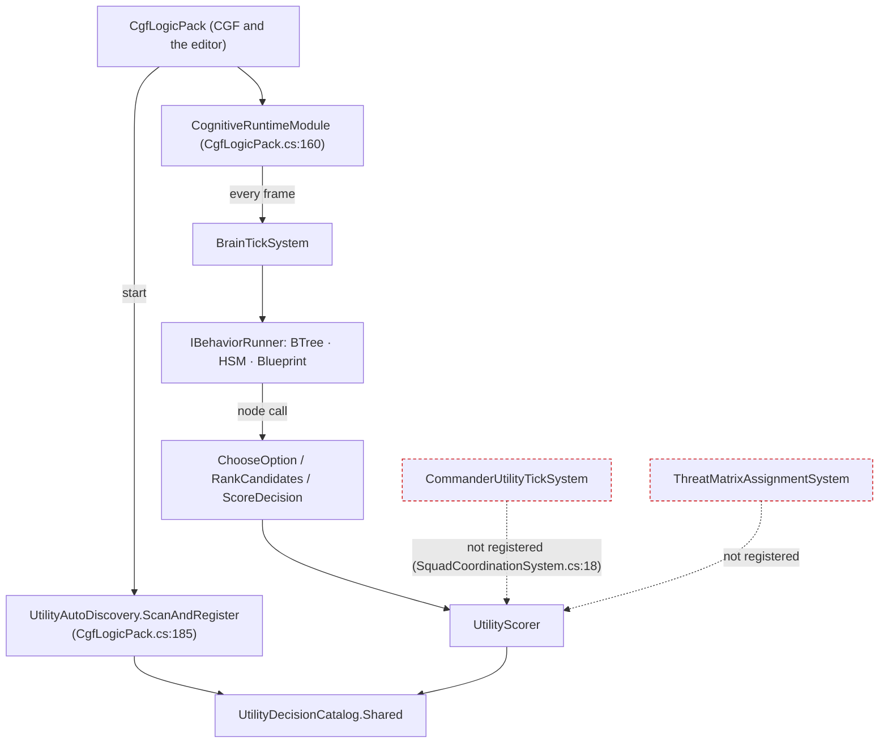

<!--STATUS
state: LIVE
updated: 2026-10-04
build-state: READY-TO-BUILD for §3.3 (one scoring step, combat posture; approved 2026-10-04, not started); G3 open; G1, G2b approved; the mission stays unchanged.
current-answer: §1 (decided), §2 (the mission stays), §3.3 (the approved build design and its tasks); §3.1–§3.2 are its reasoning.
stale-below: nothing — new document.
known-rot: none.
known-conflict:
  - docs/DESIGN_Sensors_And_Doctrine.md §11.2b G2 ("a mission PHASE may name a doctrine") — superseded by §2 here: the mission is NOT changed (user, 2026-10-04).
related-designs:
  - docs/DESIGN_Sensors_And_Doctrine.md — OWNS the doctrine slot, the origin gate (R-188, R-189, R-193) and the sensor side; this document owns what decides inside the slot (missions, threat, intent, utility).
  - docs/blueprints/batches/FRAME_Decision_Layer.md — the frame this answers (G1–G11).
  - docs/blueprints/DESIGN_Unified_Behaviour_Run.md — §6 "the mission plan as a blueprint" (the user's earlier direction) and §7 Demo_MissionPlan, the concept this generalises; U-10/U-11 the Behaviour Task node.
  - docs/designs/utility-ai/Utility_AI_Design_v1_1.md — OWNS scoring; a doctrine calls it (§7), never a host.
  - docs/designs/brain-death/BD1-DESIGN.md — OWNS what a unit does with no behaviour.
-->

# The decision layer — missions, doctrine, threat, intent

> 🔒 **User, `2026-10-04`:** *"G1: approved"* · *"G2b: wake on event is good."* · on G2: *"What is a phase? A mission
> task? Task is just a behavior. What is your idea a doctrine will do for that task (that single behavior)? My idea was
> that a doctrine comes one per mission to replace the triggers (same concept like the blueprint defined sequence of
> behaviors we made recently)"*

## 1. Decided

| # | ruling | consequence |
|---|---|---|
| **G1** ✅ | a remembered contact keeps WHAT it is (its danger does not fade) apart from HOW FRESH my knowledge of it is (fades) — *"hidden does not mean harmless"* | danger is judged at read time in one place — an input to the existing `ThreatRankingDecision` fed by the TKB (target class, weapons vs my armour, range); the memory entry stores identity + freshness, never a danger score. The backend's memory stage (S4) keeps the freshness field |
| **G2b** ✅ | a doctrine running below frame rate wakes on events | a sensor change, a finished behaviour or a refused assignment for the unit ⇒ its doctrine ticks the next frame (bus events live one frame, `FdpEventBus.cs:30`); HSM events already wait in their queue |

## 2. The mission stays as it is *(user, `2026-10-04`)*

> 🔒 *"our existing mission is not a blueprint. Mission is a sequence of behaviors (called tasks), executed one by one with
> optional skipping defined by triggers. We are not going to change this, this an ordinary end-user-facing surface which
> they can grasp well. We are looking for alternative ways of defining similar concept, or maybe a bit different concept
> that is better suited for game AI, to be authored by more skilled game logic personnel. I did not understand why there is
> anything to be changed in the demo mission plan, it was just a demo … What i wanted to discuss was how to integrate the
> utility ai into how we build the game ai, how can it help or make that easier"*

| | |
|---|---|
| ✅ the mission | unchanged: tasks (behaviours) in sequence, triggers to advance / skip — the END-USER surface |
| ✅ `Demo_MissionPlan` | unchanged — a demo of a mission built as a blueprint, nothing to migrate |
| ⏳ the open question | a concept for SKILLED game-logic authors, beside the mission — and how utility AI serves it (§3) |

## 3. Utility AI — what exists, and where it can help *(under discussion)*

### INVENTORY *(`search_graph` via the codebase-memory CLI, `2026-10-04`; `check_index_coverage` is not available through the CLI, so absence claims are grep-corroborated)*

| query | total (production, tests excluded) |
|---|---|
| `search_graph name_pattern=.*Utility.* label=Class` | ~40 — core, inputs, starter pack, integration helpers, editor, analyzers |
| `search_graph .*TacticalIntent.*` | 14 — the existing "tactical intent" is a NAMED ORDER mapped to a behaviour (`TacticalIntentResolutionSystem`), not unit state |
| `search_graph .*MissionDirector.*\|.*MissionTrigger.*\|.*MissionPhase.*` | 10 — `MissionTrigger` exists three times (Hrot.Core class, NED struct, Toolkits enum) |
| `search_graph .*Goal.*` | 0 |
| `search_graph .*ThreatEval.*\|.*ThreatMatrix.*\|.*ThreatRank.*` | 5 |
| grep `ScoreDecision\|ReadRankedResult` over shipped assets and scenarios | 0 — no consumer |

📐 **Measured `2026-10-04`:** the engine is BUILT and has NO consumer.

| piece | state |
|---|---|
| scorer (weighted product / sum, hysteresis), curves, `UtilityResultBuffer` (top-N + trace) | ✅ built (`Fdp.Toolkits/Utility/Core`) |
| 26 input readers — self (health, ammo), contact (threat, distance, LOS), weapon (range band, effectiveness), EQS (`EqsTopScore`, count), squad (assigned target / role / slot, strength) | ✅ built (`Utility/Inputs`) |
| 5 decisions, authored in C# (fluent builder + generator): `CombatPosture`, `ThreatRanking`, `WeaponSelection`, `LeaderAssignment`, `ManeuverSelect` | ✅ built; registered at CGF start (`CgfLogicPack.cs:185`) |
| editor | ⛔ **not usable** (corrected `2026-10-04`): `UtilityDecisionWindow` draws only *"Card-table UI coming in a later batch"* (`UtilityDecisionWindow.cs:78`) and `Hrot.Utility.Editor` is referenced by no app project — its model, C# emitter, curve widget and preview runner exist as library code with tests only. Decisions are authored in C# (fluent builder). An overlay source exists (`UtilityDecisionOverlaySource`) |
| blueprint `ScoreDecision` / `ReadRankedResult` nodes | ✅ compiled, in the palette (`BlueprintNodePaletteEntries.cs:333`) — ⛔ no Details drawer for the decision id (only `ReadRankedResult` has one, `BlueprintEditorBootstrap.cs:81`); ⛔ `ScoreDecision` always runs posture-select (`UtilityBlueprintBridge.ScoreDecision` → `SelectPosture`), so a ranking decision cannot be run from a blueprint; ⛔ both need a `UtilityResultBuffer` on the unit and no production code adds one ⇒ on a real unit they return 0; ⚠ one buffer per unit holds the hysteresis memory, so two decisions on one unit overwrite each other. No shipped asset uses them |
| BTree `UtilitySelectorNode`, HSM `UtilityTransitionArbiter` | ⚠ C# helpers, not authorable nodes, no callers. Intended as authored nodes (utility design §7.1 a scoring selector, §7.2 a transition guard). 📐 the HSM guard LOST its `[HsmGuard]` attribute in a compile fix — FastHSM wants an unmanaged function-pointer signature (`.dev/_DONE/utility-ai/reports/BATCH-06-REPORT.md:226`) — and was never re-made; the BTree helper keeps its "last branch" on the C# object (`UtilitySelectorNode._activeBranch`), so one instance cannot serve many units, and a `[BTreeCondition]` is a static method with nowhere to hold one |
| squad tick (`CommanderUtilityTickSystem`), fire assignment (`ThreatMatrixAssignmentSystem`) | ⛔ deliberately not run — no danger-area provider (`SquadCoordinationSystem.cs:18`, Squad Wiring §5 D3) |

### 3.1 The utility behaviour — combat posture as the first one *(PROPOSAL, under discussion — nothing built)*

A **utility behaviour** = a decision whose options are **behaviours (+ params)**. It scores, runs the winner as a hosted
child, re-scores on events, switches with hysteresis. Combat posture is the first instance.

*What the picture shows that prose hid: the sensors are spawned by the POSTURE run, before any child runs — an option
is scored from a sensor that its own child behaviour would otherwise only start once it had already won.*

| option | inputs it scores on (as built) | child behaviour | exists? |
|---|---|---|---|
| AdvanceAndAttack | health, ammo, enemy strength (inverse), have target | advance to objective + fire at target | ⚠ `MoveToLocation` + `FireAtTarget` exist separately; one move-and-shoot child is needed (G9: one behaviour owns every channel) |
| TakeCover | health (inverse), cover sensor top score, enemy strength | move to the cover point, fire from it | ⛔ no cover behaviour; template `FindCoverFromTarget` exists |
| Suppress | ammo, have target, ally advancing nearby | fire at target from here | ✅ `FireAtTarget`; ⛔ `AllyAdvancingNearby` is a stub returning 0 (`StandardInputs.cs` §D) ⇒ weighted product ⇒ **Suppress always scores 0** |
| Flee (fall back) | health (inverse quadratic), retreat sensor top score, enemy strength | move to the retreat point | ⛔ no fall-back behaviour; template `FindSafeRetreatPoint` exists (`StarterTemplates.cs`) — the `CE-2051` remark in `CombatPostureDecision.cs` is stale |
| Hold | health, constant 0.2 (weighted sum — the floor) | hold position | ✅ `HoldPosition` |

📐 **Measured against the decided rulings:**

| fact | source | consequence |
|---|---|---|
| `EnemyStrengthRatio` sums `TargetMemory.ThreatScores`, which DECAY over time | `StandardInputs.cs` `EnemyStrengthRatio`; `ThreatEvaluationSystem.cs:57` | ⛔ contradicts **G1** (`R-194`: danger does not fade). Three of five options read it ⇒ a hidden enemy makes the unit braver |
| `HaveLiveTarget` = memory count > 0, no freshness | `StandardInputs.cs` `HaveLiveTarget` | a contact seen once long ago keeps `AdvanceAndAttack`/`Suppress` alive — needs the memory stage's freshness |
| `EqsTopScore` finds ANY EQS child of the unit with the template id | `StandardInputs.cs` `TryFindEqsChild` | a sensor only scores while something has spawned it ⇒ the posture run must own it |
| behaviour-owned sensors are stamped with the ROOT run and keyed by (site, key, run) | `EqsChildSensor.cs:30–37` | a child switch does not release them (good); a child spawning the same template at its own site makes a SECOND sensor |
| a doctrine cannot replace a mission task | `R-188` (`Operator > Superior > Doctrine`) | a posture DOCTRINE never interrupts a running mission task — see the open questions |

#### Which asset type hosts it *(lean, under discussion — user `2026-10-04`: "ok with using the combat posture as a mission task")*

The utility design gives each tier its own way to use a decision (`Utility_AI_Design_v1_1.md` §7.1–§7.3); none needs the
decision itself to know about behaviours ⇒ ⛔ the earlier idea of binding options to behaviours inside the decision asset
is dropped: the HOST's structure is the binding.

| host | what exists | what is missing |
|---|---|---|
| ⭐ **Behavior-kind blueprint** *(lean)* | `ScoreDecision` (hysteresis inside), `SpawnEqsSensor` / `ReadEqsResult`, the Behaviour Task node with Start / Abort (S7, `CE-2019`/`CE-2020`), any tier as the child (S5a) | the unit's `UtilityResultBuffer`; a decision picker in Details; hysteresis memory per call site, not per unit; one Behaviour Task node per option (the author wires the switch) |
| HSM | states host any-tier children; guards read live (`R-155`); `UtilityTransitionArbiter` (C# helper) | the arbiter as an authorable guard; something that scores each tick; sensor spawning from an HSM |
| BTree | `Subtree` hosts any tier; `ObserverSelector` in the vocabulary | ⛔ the interpreter runs `ObserverSelector` as a plain selector (`Interpreter.cs:267`) — no abort until `CE-3041`; ⛔ `Service` has no interpreter case; `UtilitySelectorNode` is a C# helper, not a node |

### 3.2 One scoring step for all three hosts *(PROPOSAL — lean awaiting approval)*

> 🔒 **User, `2026-10-04`:** *"if UtilityTransitionArbiter got forgotten because of refactor, shouldn't we re-make it as now
> it is just a dead and wrong code? seems like an omission. Same with the btree - there are no reall assets that can need
> them. We are building infrastructure so such assets can be created at all."*

📐 **Corrected `2026-10-04`:** a BTree condition CAN keep per-unit state. Since `CE-504` (one C# node signature for BTree
and HSM) a `[SharedAiCondition]` takes `(Entity, EntityRepository)`, `(ref P, Entity, EntityRepository)` or the STATEFUL
`(ref P, ref WS, Entity, EntityRepository)` — the working state lives per unit in the behaviour's block
(`DESIGN_BTree_Node_Call_Shapes.md` §4 C-2, slices 1–4 built), and the same method binds as an HSM transition guard
(`DESIGN_Behavior_Action_Binding.md` §5.3b `S8`, built; `ActionSchemaExporter.cs` gives a shared condition the guard bit).
Actions and conditions read their bound host variables live (`R-155`).

*What the picture shows that prose hid: the three hosts differ only in HOW they switch; WHAT wins is one step, and the
memory of the last winner is an ordinary variable — so two decisions on one unit no longer share one buffer, and the
debugger's Watch shows the current posture.*

| | |
|---|---|
| ⭐ lean | one scoring step (a `[SharedAiAction]` for BTree/HSM, and the existing blueprint node, both calling one core) that writes the winner into a bound variable; branches and transitions only compare that variable. The two dead helpers are deleted, not re-made |
| still needed for the BTree | `CE-3041` (`ObserverSelector` aborts the running lower branch) — today it runs as a plain selector (`Interpreter.cs:267`) |
| rejected | re-make the two helpers 1:1 — two implementations of one concept, and each guard would score separately (five scorings a tick, five memories) · keep the per-unit `UtilityResultBuffer` as the memory — two decisions on one unit overwrite each other |

### 3.3 The build design — one scoring step, three hosts, combat posture first *(build-state: READY-TO-BUILD — approved by the user `2026-10-04`; tasks `CE-2067`–`CE-2073`; not started)*

> 🔒 **User, `2026-10-04`:** *"approved. pls write the design diagrams. record tasks. do not start building yet."*

**Basis:** §3.1 (posture composition), §3.2 (one scoring step, approved), `R-197` (infrastructure for all three tiers),
`R-194` (danger at read time), `R-155` (actions / conditions read bound host variables live), `R-184` (the TYPE makes a
field pickable), `CE-504` / S8 (one shared C# node signature; stateful form on BTree and HSM).

*What the picture shows that prose hid: there is ONE scorer entry per mode, and three thin callers; the memory of the
last winner moved off the unit (`UtilityResultBuffer`) into the CALLER's own storage — a bound variable for BTree/HSM, a
hidden node field for the blueprint — so two decisions on one unit cannot collide and the scorer needs no component.*

*What the picture shows that prose hid: the posture never moves the unit itself — every frame it only decides; the
moving and firing is always one hosted child at a time (G9).*

*What the picture shows that prose hid: nothing new is scheduled — the scorer only ever runs inside a behaviour's own
tick, on the editor and CGF alike (both build `CgfLogicPack`); the two squad systems (red) stay unregistered and are not
part of this plan.*

| task | what | depends on | touches the backend lane? |
|---|---|---|---|
| `CE-2067` | scorer core without the unit buffer: `ChooseOption`, `RankCandidates` | — | no |
| `CE-2068` | `UtilityDecisionRef` + its Details picker (the type makes the field pickable) | — | no |
| `CE-2069` | `UtilityNodes` (shared action ×2 + condition) for BTree and HSM; rails: a BTree and an HSM switch on the winner; measure the BTree Parallel-repeat shape first (§3.2's assumed row); delete `UtilitySelectorNode` / `UtilityTransitionArbiter`; mark utility design §7.1–7.2 superseded | `CE-2067`, `CE-2068`, `CE-3041` for the BTree rail | no |
| `CE-2070` | `ScoreDecision` node rerouted: hidden `__lastWinner`, ranking pins, no unit buffer needed | `CE-2067`, `CE-2068` | no |
| `CE-2071` | `UnitSensors.OfTemplate`; `EqsTopScore` and the posture's children use it instead of spawning a second sensor | — | ⚠ **yes — `UnitSensors.cs` is backend code** (S3) |
| `CE-2072` | `CombatPostureDecision` tuning: Suppress without the stub input; the stale `CE-2051` remark | — | no |
| `CE-2073` | the `CombatPosture` blueprint behaviour + acceptance in `tt-nav-los` as a mission task | `CE-2067`–`CE-2072`, `CE-3031` children, `CE-3054` | no |
| `CE-3054` *(existing, ours)* | threat inputs to `R-194`: danger from the TKB judged at read time × freshness | the backend's memory stage (`CE-3037`) | ⚠ **yes — joint freshness design** |
| `CE-3031` *(existing, ours)* | the children: take cover, fall back, advance-and-fire | `CE-2071` | no |
| `CE-3041` *(existing, ours)* | `ObserverSelector` aborts the running lower branch | — | no |

## ⛔ HISTORY

*Superseded `2026-10-04` the same day:* a §2 "the mission as a doctrine" with leans M1–M6 (a mission graph in the
doctrine slot, triggers retired). ⛔ WITHDRAWN — it misread the user's G2 remark; the mission is not changed (§2).
