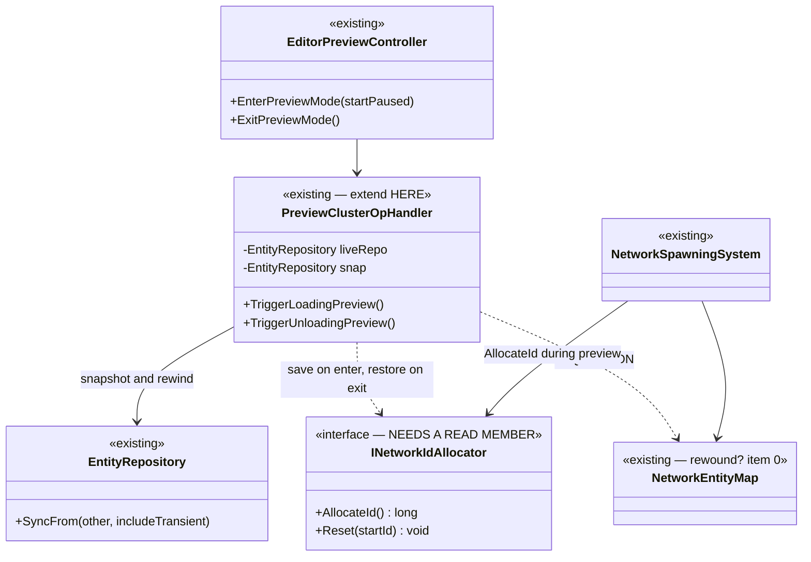
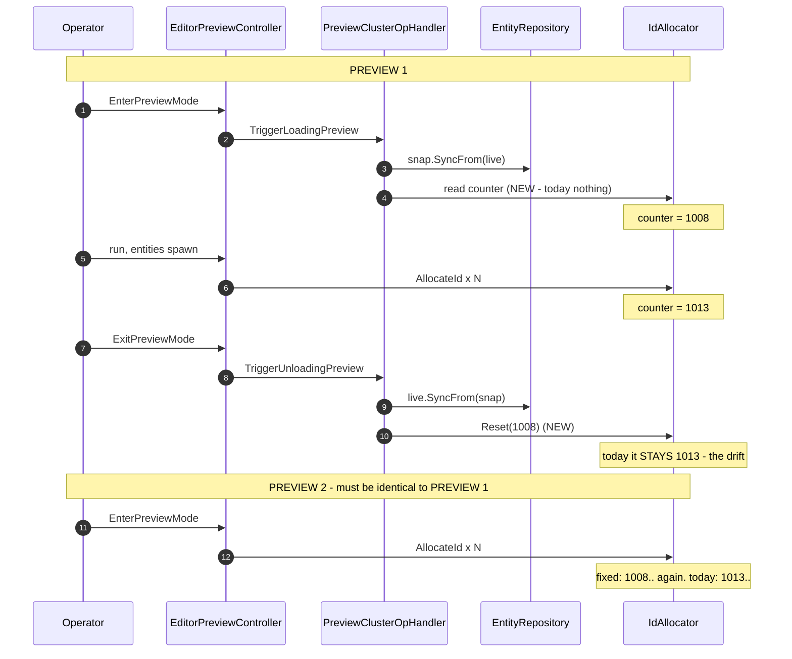

<!--STATUS
state: LIVE
build-state: READY-TO-BUILD
updated: 2026-08-23
current-answer: §1 — the requirement is PREVIEW, and it is "a preview leaves no trace". The allocator
  counter is a trace it currently leaves. §3 the seam gap, §4 the design, §5 the UML, §6 the rails.
  §7–§9 are the history of two earlier wrong framings, kept because each contains a measured fact.
design-basis: 🔒 user 2026-08-23 (§1) · docs/designs/mgmt-1/DESIGN.md §5.7 (the cluster reset, built) ·
  PROGRAMME_Unification_And_Harness.md D6 (the original decision) · HN-010 (DeterminismRails).
known-conflict: ⚠ charter D6 names `RegisterWorldResetObserver` as the seam. 📐 MEASURED WRONG for this
  use: preview exit publishes NO WorldResetEvent (§2). D6's requirement stands; its seam does not.
-->
# DESIGN — **a preview must leave no trace** *(the network-id counter, and what else)*

## 1. ⭐⭐⭐ THE REQUIREMENT — **user, `2026-08-23`**

> 🔒 *"the reset is still wanted feature in scenario preview — when we finish the preview the world resets
> but not so the network id allocator — so next preview (without restart of the app) does not start from
> same id as previous preview, but continues. Not desired; for repeated runs of the same we would like to
> have same ids."*

⭐⭐ **Stated as an invariant:** ⛔ **a preview is a DRY RUN. It must leave the process exactly as it found
it** ⇒ **preview N and preview N+1 produce identical ids.**

## 2. ⭐⭐⭐ THE MEASURED MECHANISM — **and why `D6`'s seam is the wrong one**

📐 `PreviewClusterOpHandler` *(`Hrot.Network.Orchestration`)*, driven by `EditorPreviewController`
*(`EditorSubsystem.cs:525-553`)*:

| step | what it does |
|---|---|
| **enter** — `TriggerLoadingPreview` | `var snap = new EntityRepository(); snap.SyncFrom(_liveRepo, includeTransient: true);` |
| **exit** — `TriggerUnloadingPreview` | `_liveRepo.SyncFrom(_snap, includeTransient: true); _snap.Dispose();` |

⇒ ⭐⭐⭐ **preview restores the world by a SNAPSHOT REWIND of the `EntityRepository` — and NOTHING ELSE.**

| 🔴 consequence | |
|---|---|
| ⛔⛔ **NO `WorldResetEvent` is published on preview exit** | ⇒ ⭐⭐ **charter `D6`'s named seam — `ScenarioFileService.RegisterWorldResetObserver` — IS NOT ON THE PREVIEW PATH AT ALL.** ⚠ Hooking the reset there would do **nothing** for this requirement. 📌 That was rule ① of this file's previous version; **it was wrong** *(§8)* |
| ⭐⭐⭐ **the allocator lives OUTSIDE the repository** | 📐 `EditorSubsystem.cs:1101` — `new SequentialIdAllocator()` in `Initialize`, handed to `NetworkSpawningSystem` *(`:1102`)*. ⛔ `SyncFrom` **cannot** restore it ⇒ ⭐ **exactly the user's symptom: the world rewinds, the counter does not** |

### 🔴🔴 AND IT IS A CLASS OF BUG, NOT ONE BUG

⭐⭐⭐ **The general fault: state outside the `EntityRepository` survives the preview rewind.**
📐 Measured — `PreviewClusterOpHandler` references **only `_liveRepo`**; `grep NetworkEntityMap` in it is
**empty**. And `Initialize` builds **two** mutable non-ECS things and gives both to the spawn system:

| ⛔ | outside the repo | rewound by preview? |
|---|---|---|
| **`idAllocator`** *(`:1101`)* | ✅ yes | 🔴 **NO** — the confirmed defect |
| **`entityMap`** *(`NetworkEntityMap`, `:895`)* | ✅ yes | ⚠ **UNKNOWN — enumerate before building** *(§4 item ⓪)*. ⭐ A comment on the record/replay path says `EcsRecordReplayController` *"rebuilds the map"* — ⛔ **that is a different path**, not preview |

⇒ ⭐⭐ **Fixing only the allocator would leave the same defect standing next door.** ⛔ **`⓪` comes first.**

## 3. ⛔⛔ THE SEAM GAP — **the counter cannot be READ**

```csharp
// FDP/Toolkits/Fdp.Toolkits/NetworkSpawning/Abstractions/INetworkIdAllocator.cs — the WHOLE interface
public interface INetworkIdAllocator : IDisposable
{
    long AllocateId();                    // consumes
    void Reset( long startId = 0 );       // writes
}
```

⭐⭐⭐ **There is no way to read the current value.** ⇒ **save/restore is not expressible today**; the
interface needs a read member. ⛔ **And you cannot fake it with `AllocateId()`** — that burns an id, and
📐 **it returns a different thing on each implementation** *(next-to-issue vs last-issued — §4's hazard)*.

## 4. ⭐⭐⭐ THE DESIGN

| # | ⭐ |
|---|---|
| **⓪** | ⭐⭐⭐ **FIRST, ENUMERATE what else preview fails to rewind** *(§2's class-of-bug)*. ⭐ Start with `NetworkEntityMap`; report the list. ⛔ **A one-thing fix to a class-of-bug is the finding, not the fix** |
| **①** | ⭐⭐ **SAVE / RESTORE around the preview bracket — ⛔ NOT reset-to-a-constant.** ⭐ Restoring the **pre-preview** value cannot collide with authored ids; ⛔ a fixed constant can. ⭐⭐ **And it is what preview already IS** — the counter is simply state the snapshot does not cover, so **extend the bracket**, do not add a reset |
| **②** | ⭐⭐ **Add a READ member to `INetworkIdAllocator`** *(§3)*. ⚠ **5+ implementations** — `SequentialIdAllocator` *(`Hrot.Core.Network`)* · the editor's private nested one · `DdsIdAllocator` · `IgSequentialIdAllocator` · test doubles |
| **③** | 🔴🔴 **PIN WHAT THE COUNTER MEANS — this is where the two implementations DISAGREE.** 📐 `Hrot.Core.Network`: `_next = 1`, `Interlocked.Increment` ⇒ **pre**-increment, `_next` is **last issued**. 📐 The editor's nested: `_next = 1000`, `_next++` ⇒ **post**-increment, `_next` is **next to issue**. ⇒ ⭐⭐⭐ **`Reset(Read())` MUST be an identity on BOTH**, and that is a **rail**, not a comment *(§6)* |
| **④** | ⭐ **Hook it in `PreviewClusterOpHandler`**, beside the snapshot it already takes — ⭐ so *"what preview saves"* has **one** home. ⛔ **Not in `ExitPreviewMode`**, which would make the editor a second place that knows the list |
| **⑤** | ⚠ **`PreviewClusterOpHandler` is in `Hrot.Network.Orchestration` and today knows only `_liveRepo`.** ⇒ ⭐ it must be **given** what to save. ⛔ **Do not reach for a general `IPreviewStateCapture` vocabulary until `⓪` says how many participants there are** — ⭐ **two justifies a small list; one does not** |

## 5. ⭐⭐⭐ THE UML

### 5.1 Class view



### 5.2 Sequence — ⭐⭐ **two previews, and why the second one drifts today**



## 6. ⭐⭐ THE RAILS

| ⭐ | |
|---|---|
| ⭐⭐⭐ **two consecutive previews in ONE process produce identical ids** | ⛔ this is the user's requirement stated as a test, and **it must be seen to FAIL first** — 📐 it fails today |
| ⭐⭐⭐ **`Reset(Read())` is an IDENTITY — asserted on EVERY implementation** | 🔴 **item ③'s pre/post-increment disagreement is a real trap**, and a parameterised rail over the implementations is the only thing that keeps a fifth one honest |
| ⭐⭐ **a preview leaves NO trace** — the general form | ⭐ whatever `⓪` enumerates gets a row. ⛔ **One row per participant**, so a future non-ECS singleton fails loudly rather than silently persisting |
| ⚠ **and the authored-load case must not regress** | 📐 `HN-010` already pins it *(ids `1000`–`1007` from the file)* — ⭐ this change must not disturb it |

## 7. ⭐ THE ORIGINAL FINDING THAT STANDS — **the cluster reset is designed AND BUILT**

📄 **`docs/designs/mgmt-1/DESIGN.md` §5.7** *"Centralized Network Identity Authority"*: the reset is
**master-owned**, triggered inside the 2PC `LoadingReplay`, **broadcast** as `Resp_Reset`, and clients
**flush their pooled ids and re-fetch**. 📐 Built: `DdsIdAllocatorServer.HandleReset`, `Req_Reset`,
`Resp_Reset`, `DdsIdAllocator.Reset`.

⚠ **Two intents, opposite directions — do NOT unify the call sites:** §5.7 resets **FORWARD** to a
high-water mark *(collision avoidance, deliberately not reproducible)*; ⭐ **preview restores BACKWARD to a
captured value.** ⛔ Same method, contradictory purposes.

⚠ **And `D6`'s *"zero production callers"* is true of the CALLERS, not of the mechanism.**

## ⛔ HISTORY — **two earlier framings of this file, both wrong, each with a fact worth keeping**

### 8. ⛔ v1 — *"reset on scenario load, hooked on `WorldResetEvent`"*

🔴 **Wrong seam.** 📐 Measured `2026-08-23`: **preview exit publishes no `WorldResetEvent`** ⇒ the
`RegisterWorldResetObserver` hook is not on the path. ⭐ **Kept because it is the reason `D6`'s seam must
not be quoted for this work.**

### 9. ⛔ v2 — *"not needed at all"*

🔴 **Wrong scope, and it was right about the wrong half.** 📐 `HN-010` measured that **authored** entities
get their ids **from the scenario file** *(`scenarios/hill-attack/scenario.json` carries `1000`–`1007`)*
and the allocator is never consulted on that path — ⭐ **true, and still true.** ⛔ But it concluded *"so no
reset is needed"*, having only ever looked at **scenario load**. ⚠ **The very same document then wrote the
caveat that names this requirement** — *"entities SPAWNED at runtime DO go through the allocator, and
nothing resets it ⇒ drifts across a reload in one process"* — ⭐⭐ **and preview is exactly that case.**

⇒ ⭐⭐⭐ **The lesson, stated once:** 📌 I answered *"is a reset needed?"* by measuring **one workflow** and
generalised to **all**. ⛔ **The scope of a negative claim is the scope you measured**, and the caveat I
wrote in the same breath was already pointing at the case I had not.
