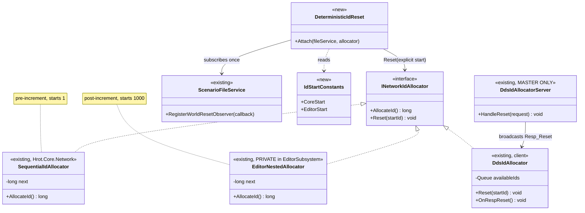
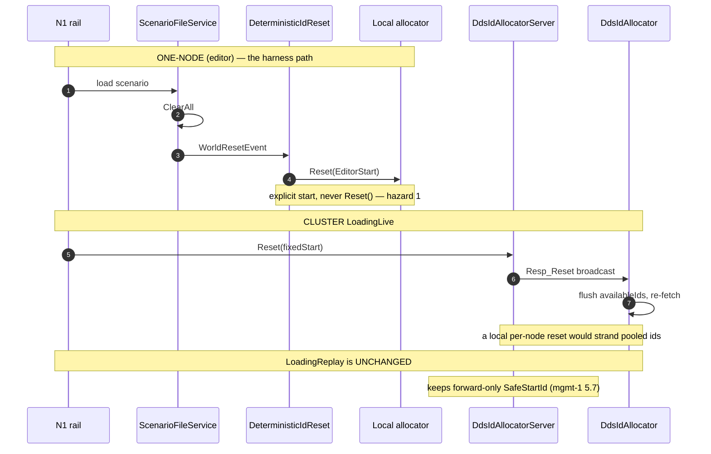

<!--STATUS
state: LIVE
build-state: READY-TO-BUILD
updated: 2026-08-23
current-answer: the whole file. §0 answers "where is the design" honestly: the ALLOCATOR and its RESET
  are designed AND BUILT (docs/designs/mgmt-1/DESIGN.md §5.7); what did NOT exist until now is the
  DETERMINISTIC reset, which charter D6 decided and N1 dispatched with no design behind it.
design-basis: ⭐⭐⭐ docs/designs/mgmt-1/DESIGN.md §5.7 "Centralized Network Identity Authority" (the
  owning design — master-owned, 2PC-triggered, DDS-broadcast reset) · §14 "Deterministic Batch Runs" ·
  docs/designs/hexag-2/DESIGN.md §4.2.5 (DdsIdAllocatorServer lifecycle) ·
  PROGRAMME_Unification_And_Harness.md D6 (the decision) · DESIGN_Regression_Net.md §7 N1 (the item).
known-conflict: ⚠ charter D6's caveats ②/③ are SUPERSEDED by §3 of this file — they were written
  without §5.7 and understate both hazards. D6's DECISION stands; its mechanism notes do not.
-->
# DESIGN — **deterministic network ids** *(charter `D6`, item `N1`)*

## 0. ⛔⛔⛔ WHERE THE DESIGN WAS — **the honest answer**

> 🔒 **User, `2026-08-23`:** *"where is the design for the deterministic network id allocation and
> reset"*

| what | where | state |
|---|---|---|
| ⭐⭐⭐ **network id ALLOCATION** | 📄 **`docs/designs/mgmt-1/DESIGN.md` §5.7** *"Centralized Network Identity Authority (`DdsIdAllocatorServer`)"* + 📄 `docs/designs/hexag-2/DESIGN.md` §4.2.5 *(lifecycle)* | ✅ **DESIGNED AND BUILT** |
| ⭐⭐⭐ **the RESET** | 📄 **the same §5.7** — ⭐ fully specified: **master-owned**, triggered inside the **2PC `LoadingReplay`** transaction, **broadcast over DDS**, clients flush their pool and re-fetch | ✅ **DESIGNED AND BUILT** — 📐 `DdsIdAllocatorServer.HandleReset` · `EIdRequestType.Req_Reset` · `EIdResponseType.Resp_Reset` · `DdsIdAllocator.Reset(startId)` |
| ⛔ **the DETERMINISTIC reset** *(the same ids on every run)* | ⛔⛔ **NOWHERE.** Only charter **`D6`** *(a decision row)* and `DESIGN_Regression_Net.md` §7 **`N1`** *(a one-line item)* — ⭐ **this file is that missing design** | ⭐ **now designed** |

### ⛔ And the process failure, stated plainly

⭐⭐⭐ **`D6` was written without reading §5.7 — the design that owns the thing it proposes to reset.**
📌 **`R-129` exactly**: I measured the code *(`Reset` exists everywhere, zero production callers)* and
reasoned from **how it IS**. ⇒ ⛔ **`D6` reads as *"a dormant local capability to wire up."*** 📐 The
truth: **a built cluster protocol with a designed owner, trigger and broadcast.** ⚠ **And `N1` was
dispatched on that reading — twice** *(the design's own UML obligation ④ says a design with no UML is not
dispatchable; the regression net's diagrams cover the golden harness, ⛔ **not this**)*.

## 1. INVENTORY — **the queries, and what they found**

| query run | total | result |
|---|---|---|
| `search_graph(name_pattern=".*IdAllocator.*|.*IdManager.*")` | **171** | ⭐⭐ **this is what grep missed**: it surfaced `DdsIdAllocatorServer` *(in-degree **11**)* and the `docs/designs/mgmt-1` §5.7 / `hexag-2` §4.2.5 **design sections** — ⛔ `D6` had cited neither |
| `grep -rn "class SequentialIdAllocator"` | **3** | 🔴 **three DIFFERENT types with one name** — `Hrot.Core.Network` *(real)* · `EditorSubsystem` *(private nested)* · `EditorHarness` *(test nested)* |
| `grep "Resp_Reset|Req_Reset"` in `Fdp.Network.Cyclone/Services/` | **6** | ✅ **§5.7's broadcast reset is BUILT**, not designed-only |
| `grep "RegisterWorldResetObserver|WorldResetEvent"` *(non-test)* | **10** | 🔴 **`WorldResetEvent` is published from THREE sites** in `ScenarioFileService` *(`:100`, `:188`, `:234`)*, and ⭐ **already has a consumer** — `IgApplication.cs:989` |
| `grep ".Reset(" --include=*.cs` *(non-test)* | **0** | ⭐ `D6`'s measurement holds: **zero production CALLERS.** ⚠ **But that is a fact about callers, ⛔ not about the mechanism** |

## 2. ⭐⭐⭐ THE INSIGHT — **two resets, OPPOSITE directions, one method**

| | §5.7's reset *(built)* | ⭐ this design's reset |
|---|---|---|
| **why** | ⛔ **collision avoidance** — new entities must not collide with ids baked into a `.fdprec` | ⭐ **repeatability** — run 1 and run 2 of one scenario must produce **the same** ids |
| **direction** | 🔴 **FORWARD, to a high-water mark**: `SafeStartId = max(all nodes' MaxNetworkId) + 10 000` | ⭐⭐ **BACK to the SAME start, every time** |
| **reproducible?** | ⛔⛔ **NO, by construction** — it depends on the recording's contents | ⭐ **yes — that is the entire requirement** |
| **when** | once, at `LoadingReplay`; ⛔ **explicitly NOT re-reset on `ReplaySeek`** | ⭐ at **`LoadingLive` / scenario load** |

⇒ ⭐⭐⭐ **They are the same method with contradictory intents.** ⛔⛔ **So this design must not be
implemented by changing §5.7's path** — it is a **second, differently-triggered call site** of a protocol
that already exists, and 🔒 **§5.7's replay behaviour is untouched.**

## 3. ⚠⚠ THE MEASURED HAZARDS — **these SUPERSEDE charter `D6`'s caveats ② and ③**

| 🔴 | hazard | consequence |
|---|---|---|
| **①** | ⭐⭐⭐ **`Reset()`'s DEFAULT IS NOT THE CONSTRUCTION VALUE — on BOTH allocators, differently.** 📐 `Hrot.Core.Network`: `_next = 1`, `AllocateId() => Interlocked.Increment(ref _next)` ⇒ **pre-increment, first id = 2**; `Reset(0)` ⇒ **first id = 1**. 📐 `EditorSubsystem`'s nested: `_next = 1000`, `AllocateId() => _next++` ⇒ **post-increment, first id = 1000**; `Reset(0)` ⇒ **first id = 0** | ⛔⛔ **A reset run and a fresh-process run produce DIFFERENT ids** ⇒ 🔴 **`N1` would go red for a reason that is the fix's own fault.** ⇒ ⭐⭐⭐ **RULE: always `Reset(explicitStart)` matching that allocator's construction value — NEVER `Reset()`** |
| **②** | ⭐⭐ **THE CLUSTER RESET IS A BROADCAST, NOT A LOCAL CALL** *(§5.7)*. Clients **pre-allocate a pool** *(`_availableIds`)*; the server's `Resp_Reset` is what makes them **flush and re-fetch** | ⛔⛔ **Resetting per-node locally leaves every client holding ids from the OLD range** ⇒ ⚠ **charter `D6` caveat ② called distributed mode "a hazard" — 📐 it is not a hazard, it is a DESIGNED PROTOCOL, and the design already answers it** |
| **③** | 🔴 **THREE types named `SequentialIdAllocator`**, one of them `private` inside `EditorSubsystem` | ⛔ a fix applied to `Hrot.Core.Network`'s **does not touch the editor's**, which is the one the harness runs. ⚠ `D6` caveat ④ named the shadowing; ⭐ **hazard ① is why it matters** |
| **④** | ⭐ **`WorldResetEvent` has THREE publish sites** *(`ScenarioFileService:100,188,234`)*, and `RegisterWorldResetObserver` *(`:84`)* is a **separate** callback seam | ⭐ subscribe **once**, to the seam or the event — ⛔ **not per call site**, or a fourth site added later silently misses |
| **⑤** | ⚠ **ids are not the only non-determinism** | ⭐ `N1` diffs **panel dumps too**; expect float formatting, dictionary order, wall-clock stamps, spawn order. ⛔⛔ **`D6` caveat ①: do NOT widen an ignore-list to make it green** |

## 4. ⭐⭐ THE DESIGN

| # | rule |
|---|---|
| **①** | ⭐⭐⭐ **Editor / one-node** *(`OfflineNetworkFactory`)*: on `WorldResetEvent`, call **`Reset(constructionStart)`** on the allocator that host actually uses. ⛔ **Never the parameterless overload** *(hazard ①)* |
| **②** | ⭐⭐⭐ **Cluster `LoadingLive`**: reset **through the master** — `DdsIdAllocatorServer.Reset(fixedStart)`, which broadcasts `Resp_Reset` and makes every client flush *(§5.7's built path)*. ⛔ **Never per-node** *(hazard ②)* |
| **③** | 🔒 **`LoadingReplay` is UNCHANGED** — it keeps §5.7's forward-only high-water `SafeStartId`. ⛔ **Determinism applies to `LoadingLive` only** |
| **④** | ⭐⭐ **The construction start becomes a NAMED CONSTANT, not a literal**, so *"reset to where a fresh process starts"* is checkable rather than remembered |
| **⑤** | ⭐ **One subscription**, on the `RegisterWorldResetObserver` seam *(hazard ④)* |

## 5. ⭐⭐⭐ THE UML

### 5.1 Class view

### 5.2 Sequence — ⭐⭐ **the two paths, and why they differ**

## 6. ⭐⭐ WHAT `N1` MUST ASSERT

| ⭐ | |
|---|---|
| ⭐⭐⭐ **two FRESH PROCESSES, same scenario ⇒ byte-identical id→entity mapping** | ⛔ not one process loading twice — that would pass on a leaked pool |
| ⭐⭐ **a RESET run equals a FRESH-PROCESS run** | 📌 **the direct test of hazard ①**, and the one most likely to fail first |
| ⭐ **every captured panel dump is byte-identical too** | ⭐ ids are the *enabler*; the dumps are the *deliverable* |
| ⛔ **and it must be seen to FAIL** | ⭐ perturb the start by one and confirm the rail reddens — ⛔ *"it was green first time"* is not evidence |

## 7. ⚠ OPEN — **named, not hidden**

| | ⭐ recommendation |
|---|---|
| **Does `LoadingLive` in a REAL cluster need this at all yet?** | ⭐⭐ **No — defer.** The harness is one-node *(the editor is a one-node cluster)*. ⇒ ⭐ **build rule ①, design rules ②/③ and leave them unbuilt**, so the cluster path is *decided* without being *speculatively coded* |
| **Is a fixed start safe when a scenario is loaded twice in one session?** | ⚠ **Yes if `ClearAll` truly empties the map** — 📐 `ScenarioFileService` publishes the event **after** `ClearAll` deliberately. ⛔ **Verify, do not assume** |
| **Does the editor's private nested allocator survive at all?** | ⭐ Hazard ③ says it is a **duplicate of a `Hrot.Core.Network` type** ⇒ ⭐⭐ **ruling 9 says one implementation** — ⚠ **but that is a separate change**, and ⛔ **not `N1`'s to make under a running batch** |
