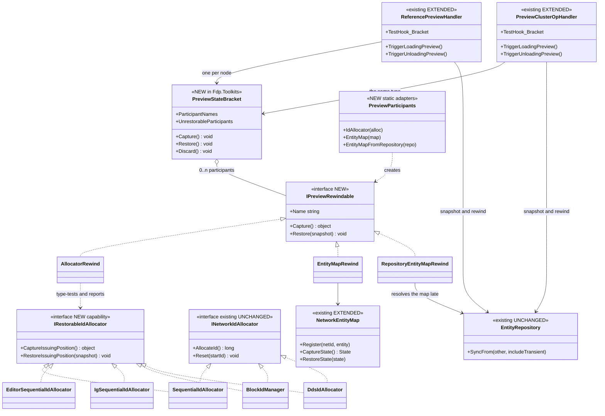
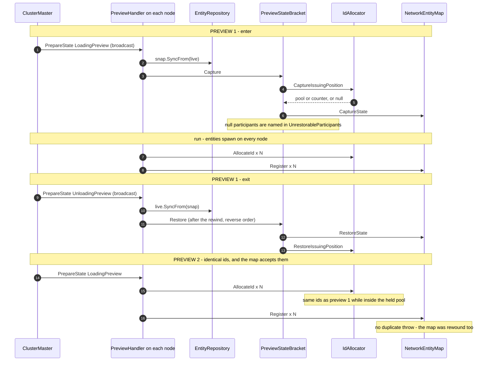
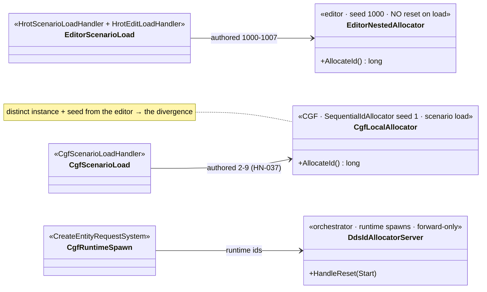
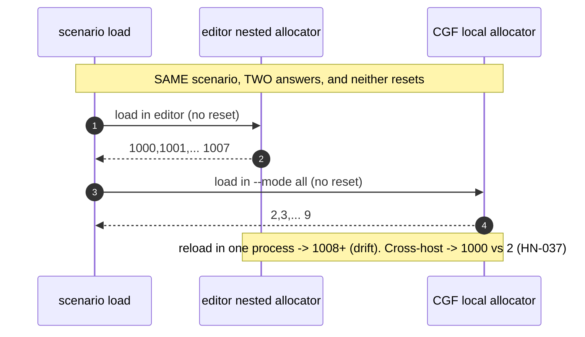
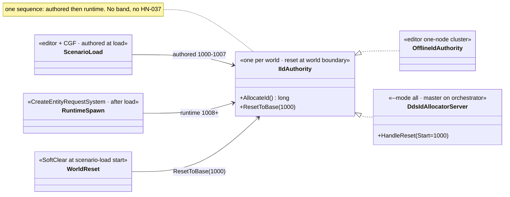
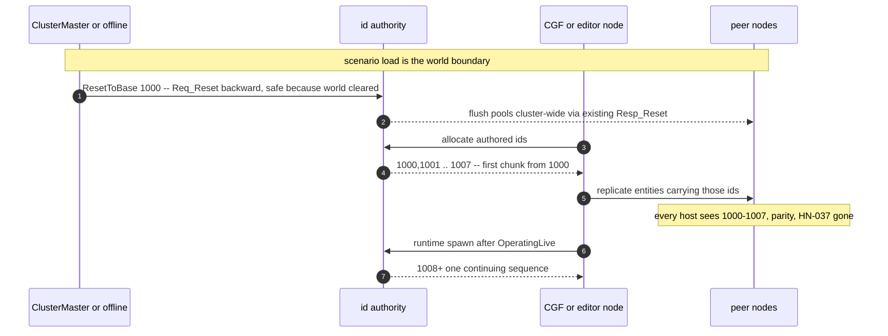
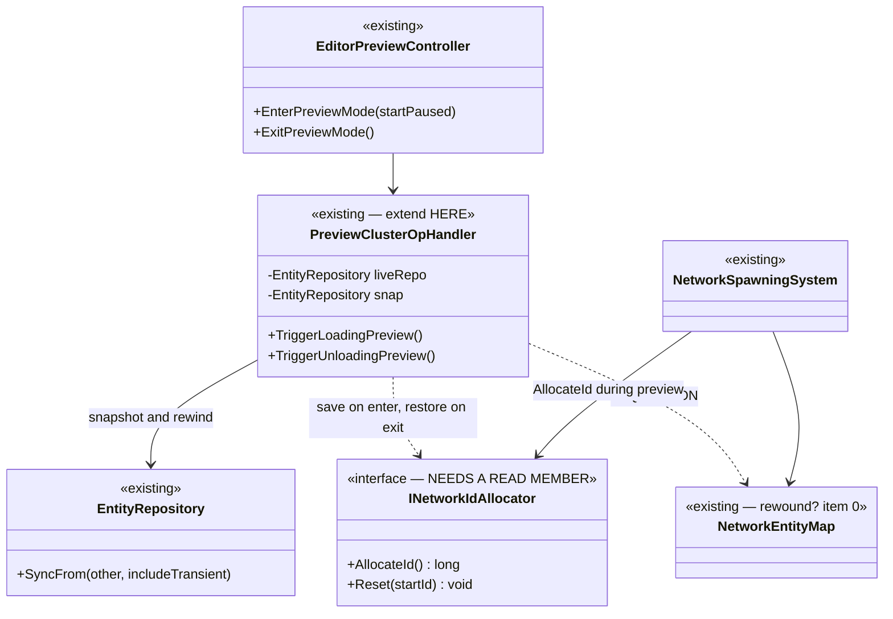
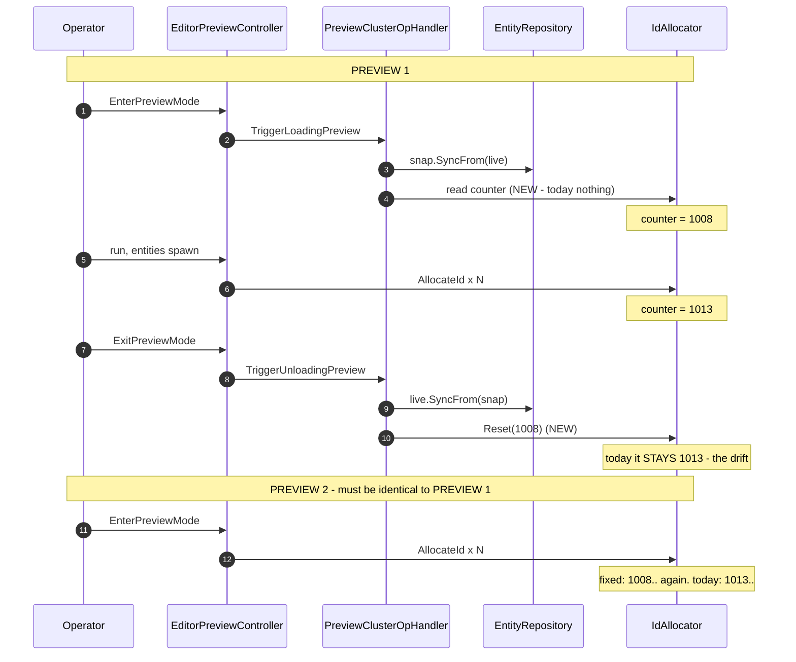

<!--STATUS
state: LIVE
build-state: SPLIT — the PREVIEW half (§4c/§4d) is BUILT `2026-08-24`. ⭐⭐ The SCENARIO-LOAD half (§11 —
  one id authority per world, reset to 1000 at world reset, HN-037) is NEW and READY-TO-BUILD, with its
  current-vs-new UML in §11a/§11b. ⛔ §4's items ①–⑤ and §4b's recommendation are the PRE-BUILD preview
  design and are SUPERSEDED where §4c/§4d disagree — do not quote §4 ③/④ or §4b's "pooled allocators opt out".
updated: 2026-08-24
current-answer: TWO halves. PREVIEW (BUILT): §4d — the as-built; §1 requirement, §2b enumeration, §4c approach,
  §5 as-built UML, §6 rails. SCENARIO-LOAD (READY-TO-BUILD): §11 — one authority per world reset to 1000 at
  the world boundary; §11c is the three-reset-policy reconciliation, §11d the lane-tagged change points.
  §7 stands (now with a third policy, see §11c). §8–§10 are history of earlier wrong framings.
design-basis: 🔒 user 2026-08-23 (§1) · 🔒 user 2026-08-23 (§2c, §4c) · 🔒 user 2026-08-23 ("update the id
  allocator's home design doc to keep it in sync with the new state" ⇒ §4d) · docs/designs/mgmt-1/DESIGN.md
  §5.7 (the cluster reset, built) · PROGRAMME_Unification_And_Harness.md D6 · HN-010 (DeterminismRails).
known-conflict: ⚠ charter D6 names `RegisterWorldResetObserver` as the seam. 📐 MEASURED WRONG for this
  use: preview exit publishes NO WorldResetEvent (§2). D6's requirement stands; its seam does not.
known-rot: ⛔ §4 ④ says "hook it in PreviewClusterOpHandler so 'what preview saves' has ONE home" — 📐 that
  handler is registered on NO ClusterSlave and is EDITOR-ONLY (§2b), and the build put the one home in
  `Fdp.Toolkits` instead (§4d). ⛔ §4 ③'s "Reset(Read()) is an identity on EVERY implementation" is
  IMPOSSIBLE for the two pooled allocators (§4b) and was NOT built. ⛔ §4b's closing recommendation
  ("the two pooled ones do not implement it") is SUPERSEDED by §4c — all five implement it. Do not quote
  §4 ③/④ or §4b's recommendation without §4c and §4d.
-->
# DESIGN — **a preview must leave no trace** *(the network-id counter, and what else)*

## 1. ⭐⭐⭐ THE REQUIREMENT — **user, `2026-08-23`**

> 🔒 *"the reset is still wanted feature in scenario preview — when we finish the preview the world resets
> but not so the network id allocator — so next preview (without restart of the app) does not start from
> same id as previous preview, but continues. Not desired; for repeated runs of the same we would like to
> have same ids."*

⭐⭐ **Stated as an invariant:** ⛔ **a preview is a DRY RUN. It must leave the process exactly as it found
it** ⇒ **preview N and preview N+1 produce identical ids.**

## 2. ⭐⭐⭐ THE MEASURED MECHANISM — **and why `D6`'s seam is the wrong one**

📐 `PreviewClusterOpHandler` *(`Hrot.Network.Orchestration`)*, driven by `EditorPreviewController`
*(`EditorSubsystem.cs:525-553`)*:

| step | what it does |
|---|---|
| **enter** — `TriggerLoadingPreview` | `var snap = new EntityRepository(); snap.SyncFrom(_liveRepo, includeTransient: true);` |
| **exit** — `TriggerUnloadingPreview` | `_liveRepo.SyncFrom(_snap, includeTransient: true); _snap.Dispose();` |

⇒ ⭐⭐⭐ **preview restores the world by a SNAPSHOT REWIND of the `EntityRepository` — and NOTHING ELSE.**

| 🔴 consequence | |
|---|---|
| ⛔⛔ **NO `WorldResetEvent` is published on preview exit** | ⇒ ⭐⭐ **charter `D6`'s named seam — `ScenarioFileService.RegisterWorldResetObserver` — IS NOT ON THE PREVIEW PATH AT ALL.** ⚠ Hooking the reset there would do **nothing** for this requirement. 📌 That was rule ① of this file's previous version; **it was wrong** *(§8)* |
| ⭐⭐⭐ **the allocator lives OUTSIDE the repository** | 📐 `EditorSubsystem.cs:1101` — `new SequentialIdAllocator()` in `Initialize`, handed to `NetworkSpawningSystem` *(`:1102`)*. ⛔ `SyncFrom` **cannot** restore it ⇒ ⭐ **exactly the user's symptom: the world rewinds, the counter does not** |

### 🔴🔴 AND IT IS A CLASS OF BUG, NOT ONE BUG

⭐⭐⭐ **The general fault: state outside the `EntityRepository` survives the preview rewind.**
📐 Measured — `PreviewClusterOpHandler` references **only `_liveRepo`**; `grep NetworkEntityMap` in it is
**empty**. And `Initialize` builds **two** mutable non-ECS things and gives both to the spawn system:

| ⛔ | outside the repo | rewound by preview? |
|---|---|---|
| **`idAllocator`** *(`:1101`)* | ✅ yes | 🔴 **NO** — the confirmed defect |
| **`entityMap`** *(`NetworkEntityMap`, `:895`)* | ✅ yes | ⭐⭐ **ANSWERED by §2b: NO** — ⚠ this row said *"UNKNOWN, enumerate first"* and the enumeration settled it. ⭐ A comment on the record/replay path says `EcsRecordReplayController` *"rebuilds the map"* — ⛔ **that is a different path**, not preview |

⇒ ⭐⭐ **Fixing only the allocator would leave the same defect standing next door.** ⛔ **`⓪` comes first.**

## 2b. ⭐⭐⭐ ITEM ⓪ — **THE ENUMERATION** *(measured `2026-08-23`; this is what §2 twice failed to state)*

### ⭐⭐ What `NetworkSpawningSystem` holds outside the `EntityRepository`

📐 Its constructor takes four non-repo things *(`:37-44`)*, and the editor's call site is `:1102`:

| outside the repo | mutable? | rewound by preview? | 🔴 consequence |
|---|---|---|---|
| ⭐ **`INetworkIdAllocator`** *(`:1101`)* | ✅ | 🔴 **NO** | the reported defect — ids drift |
| 🔴🔴 **`NetworkEntityMap`** *(`:895`)* | ✅ | 🔴 **NO** | ⛔⛔ **and `Register` THROWS on a duplicate id** — see below |
| 🔴 **`EntityLifecycleModule`** | ✅ | 🔴 **NO** | `_pendingConstruction` / `_pendingDestruction` are keyed by **`Entity` handles the rewind invalidates**, plus `_blueprintRequirements` |
| ✅ `ITkbDatabase` | ⛔ read-only catalogue | n/a | fine |

⇒ ⭐⭐ **THREE participants, not one.** 📌 §4 ⑤ said *"two justifies a small list; one does not"* — **three
settles it**, and the list is the deliverable, not a general `IPreviewStateCapture` vocabulary.

### 🔴🔴🔴 THE FINDING THAT STOPS THE BUILD — **fixing the allocator ALONE makes it WORSE**

📐 `NetworkEntityMap.Register` *(`:36-38`)*:

```csharp
if (_netToEntity.ContainsKey(netId))
     throw new InvalidOperationException($"NetworkId {netId} already registered");
```

📐 And the editor **never prunes the map**: `PruneDeadEntities`' only production caller on this path is
`DisposalMonitoringSystem`, registered by `ReplicationLogicModule` / `NedReplicationModule` — ⛔ but the
editor uses **`OfflineNetworkFactory`**, whose `CreateReplicationModule()` returns a
**`NullReplicationModule`** *(and that even builds its own throwaway `new NetworkEntityMap()` for
`GhostCreationSystem`, not the editor's)*.

⇒ ⛔⛔⛔ **Today the DRIFT is what HIDES the map leak.** Restore the allocator and preview 2 re-issues
preview 1's ids into a map that still holds them ⇒ **`InvalidOperationException` on the spawn.** ⭐ Not
"possible" — **certain**, in the editor, on the second preview that spawns anything.
⇒ ⭐⭐ **item ① MUST NOT ship without the map.** 📌 Exactly what item ⓪ exists to catch.

### 🔴🔴 AND THERE ARE **TWO** PREVIEW HANDLERS — one concept, already diverging

| | `ReferencePreviewHandler` | `PreviewClusterOpHandler` |
|---|---|---|
| home | `Fdp.Toolkits/Orchestration/Handlers/` | `Hrot.Common/Orchestration/Handlers/` |
| interface | `IClusterStateHandler` | `IClusterOpHandler` |
| ⭐ **registered on a ClusterSlave** | ✅ **5 production sites** — IG, CGF ×2, SimHost, ExCon | 🔴 **NONE** |
| driven by | the **2PC broadcast** | the editor, directly via `TriggerLoadingPreview/Unloading` |
| the snapshot | `snap.SyncFrom(_liveRepo)` | `SyncFrom(_liveRepo, includeTransient: **true**)` |

⇒ ⛔⛔ **§4 ④'s *"one home"* names the EDITOR-ONLY handler.** ⭐ Hooking the save/restore there would give
the editor the fix and leave every cluster node without it — ⚠ **the precise hardwiring §2c forbids.**
⭐ They already disagree on `includeTransient`, so this is a live ruling-9 duplicate, not a latent one.

## 2c. ⭐⭐⭐ USER RULING — **PREVIEW IS NOT EDITOR-ONLY, AND THE RESET MUST BE CLUSTER-WIDE** *(`2026-08-23`)*

> 🔒 **User, verbatim:** *"note the preview could work also in distributed env so no hardwiring directly
> just for editor, reset must be cluster wide"*

⭐⭐ **Measured consequences, and one of them inverts §7's advice:**

| ⭐ | |
|---|---|
| ⭐⭐⭐ **The cluster-wide mechanism ALREADY EXISTS and needs no new broadcast** | 📐 both handlers are `PrepareState` handlers for `LoadingPreview`/`UnloadingPreview` — **the master broadcasts, every node commits LOCALLY.** ⇒ ⭐ a per-node capture/restore inside the handler **is** the cluster-wide reset. ⛔ Do not add a second broadcast |
| ⛔⛔ **But the editor's preview never goes through 2PC** | 📐 `EditorPreviewController` calls `Trigger*` directly, and `PreviewClusterOpHandler` is on no slave ⇒ ⭐⭐ **the fix must live where BOTH entry points pass** — the private commit helpers — ⛔ never in `EditorPreviewController` |
| 🔴🔴 **`INetworkIdAllocator.Reset` IS ALREADY CLUSTER-WIDE — and that is exactly why it is the WRONG primitive here** | 📐 `DdsIdAllocator.Reset(startId)` **writes a global `Req_Reset` to the server**, which broadcasts to every client and flushes their pools. ⇒ ⛔ using it to restore a preview would reset the **whole cluster's** id authority BACKWARD and flush pools other nodes are mid-way through — and §7's `Resp_Reset` is designed to move the high-water mark **FORWARD** for collision avoidance. ⭐⭐ **Two intents, one method — now with the measurement that makes §7's warning concrete** |
| ⚠ **`BlockIdManager.Reset` ignores its argument** | 📐 it `_localPool.Clear()`s and its own comments admit the semantics are unsettled. ⇒ there is no scalar position to restore |

⇒ ⭐⭐⭐ **The shape the steer implies:** the preview bracket restores **each node's own allocator position**,
driven by the existing 2PC; ⛔ it is **not** expressed as `INetworkIdAllocator.Reset`; and ⭐ an allocator
that cannot express a restorable position *(pooled/DDS)* must **say so** rather than silently do the wrong
thing.

## 4b. ⛔⛔ ITEM ③ IS IMPOSSIBLE AS WRITTEN — **`Reset(Read())` cannot be an identity on every implementation**

📐 Measured across all five:

| implementation | init | `AllocateId()` | `Reset(s)` | `Reset(Read())` identity? |
|---|---|---|---|---|
| `Hrot.Core.Network.SequentialIdAllocator` | `_next = 1` | `Interlocked.Increment` ⇒ **pre**, first id **2** | `_next = s` | ✅ |
| `EditorSubsystem`'s **private nested** | `_next = 1000` | `_next++` ⇒ **post**, first id **1000** | `_next = s` | ✅ |
| `IgSequentialIdAllocator` | `_nextId = 1` | `Interlocked.Increment` | `_nextId = s` | ✅ |
| 🔴 **`BlockIdManager`** | a **`Queue<long>` of leased ids** | `Dequeue()` | ⛔ **`Clear()`, argument IGNORED** | ⛔ **NO — the pool IS the state and `Reset` destroys it** |
| 🔴🔴 **`DdsIdAllocator`** | local `Queue<long>` **+ server state** | `Dequeue()` | ⛔ **global DDS broadcast + clear** | ⛔ **NO — and it mutates the whole cluster** |

⭐⭐ **The three scalar ones agree on the identity even though they DISAGREE on the meaning** *(last-issued
vs next-to-issue)* — ⇒ ⭐ **a read member must be defined BY THE IDENTITY, not by "the next id":** a name
like `PeekNextId()` is false for one and `LastIssuedId()` is false for the others. ⛔ Neither name is safe;
the contract is *"the value that, passed to the restore, puts this allocator back"*.

⇒ ⭐⭐ **Recommendation for the coordinator:** make restorability an **opt-in capability** rather than a
widened universal interface — the three scalar allocators implement it, the two pooled ones do not, and the
preview bracket then **reports** that this node cannot guarantee reproducible ids. ⛔ A universal member
that two implementations cannot honour is a lie the type system would stop advertising.

> ⛔⛔ **SUPERSEDED IN HALF, `2026-08-23/24`.** ⭐ The **capability-interface** half was right and shipped
> *(`IRestorableIdAllocator`)*. ⛔ The *"the two pooled ones do not implement it"* half was **wrong** —
> §4c's framing *(the pool IS the position)* lets **all five** implement it, and 📐 the as-built does
> *(§4d ②)*. ⚠ **Do not quote this paragraph as the current answer.**

## 4c. ⭐⭐⭐ THE CHOSEN APPROACH — **each node restores its OWN pool; the central allocator does not move** *(user, `2026-08-23`)*

> 🔒 **User, verbatim:** *"maybe each node needs to remember the ids/chunks used during the run and on world
> reset to simply reset to their beginning while the central allocatore stays where it is for potential
> fresh allocations? nodes will allocated form their already reserved pools, with high chance that they will
> repeat same allocations in same way?"*

⭐⭐⭐ **ACCEPTED, and it is better than both options this document previously carried.** ⛔ It supersedes §4
③'s `Reset(Read())` **and** §4b's *"pooled allocators opt out"* recommendation — ⚠ **that recommendation was
mine and it was the weaker answer:** it excluded the two pooled allocators from the mechanism, where this
framing lets them participate.

### ⭐⭐ Why it fits the measured mechanics exactly

📐 `DdsIdAllocator`: `Queue<long> _availableIds`; a chunk arrives as a **contiguous range**
*(`_availableIds.Enqueue(response.Start + i)`)*; `AllocateId` dequeues **FIFO**; a refill fires at
`Count < LOW_WATER_MARK (10)` for `CHUNK_SIZE (100)`.
📐 `BlockIdManager`: the same shape — `Queue<long> _localPool`, `AddBlock(start, count)`.

⇒ ⭐⭐ **"remember what I held, put it back"** is a queue snapshot and restore. ⛔ **No server call, no
`Req_Reset`, no broadcast.**

| ⭐ what this buys, that neither earlier option did | |
|---|---|
| ⭐⭐⭐ **ONE concept covers ALL FIVE implementations** | the two pooled ones restore a **queue prefix**; the three scalar ones restore an **integer** — 📌 *"restore my own issuing position"* is the same idea at both ends, which is exactly what §4 ③ could not express |
| ⭐⭐⭐ **The central authority is never touched** | ⇒ ⛔ the §2c hazard is **designed out, not managed**: no backward global reset, no flushing another node's pool, no fighting §7's deliberately-FORWARD high-water mark |
| ⭐⭐ **Cluster-wide by the mechanism that already exists** | the master broadcasts `PrepareState(LoadingPreview/UnloadingPreview)`; **each node restores its own pool locally** ⇒ 🔒 *"reset must be cluster wide"* is satisfied with **no new protocol** |
| ⭐ **Nothing is hardwired to the editor** | the editor is one node whose pool happens to be a bare counter |

### ⭐⭐⭐ The guarantee, stated EXACTLY — ⛔ it is not "high chance"

⚠ **The user's own caveat deserves a precise answer rather than a hopeful one.** 📐 Because the pool is FIFO
and the restore is a snapshot, the outcome splits cleanly at one boundary:

| case | guarantee |
|---|---|
| ⭐⭐ **the preview consumes ≤ the ids the node HELD at enter** | ✅ **EXACT, not probabilistic** — the same ids in the same order, because the queue is restored byte-for-byte and `AllocateId` is FIFO. ⭐ Combined with `HN-010`'s measured stable spawn ORDER, preview N+1 is identical to preview N |
| ⛔ **the preview EXHAUSTS the pool and pulls a fresh chunk mid-run** | ⚠ **the prefix repeats; the tail legitimately differs.** ⛔⛔ **And the ids obtained MID-PREVIEW must NOT be re-issued** — the server's high-water mark advanced past them and may have handed that range to another node ⇒ re-issuing them is a genuine cross-node collision. ⇒ ⭐ **restore only what was held at ENTER** |

⇒ ⭐⭐ **So the contract is: *"ids repeat exactly while a preview stays within the ids the node already
held; past that they diverge, and the boundary is REPORTED."*** ⛔ A silent crossing of that boundary is the
one thing this must not do — 📌 it would be reproducible-looking and occasionally wrong, the worst of both.
⭐ 📐 Sizing it: `CHUNK_SIZE` is **100**, so a preview spawning fewer than ~100 entities is inside the exact
case; the editor's scalar allocator has no boundary at all.

### 🔴🔴 AND IT MAKES `HN-013` A HARD PREREQUISITE, not a nice-to-have

⛔⛔ **The better the id determinism, the harder the map collision bites.** 📐 §2b: `NetworkEntityMap.Register`
throws on a duplicate and the editor never prunes. ⇒ ⭐⭐ **exact id repetition makes that throw CERTAIN on
preview 2**, where today's drift merely hides it. ⚠ **This approach does not dodge the map — it removes the
last excuse for not fixing it.**

⇒ ⭐ **Build order: the map (and `EntityLifecycleModule`) rewind FIRST, or together. ⛔ Never the allocator
alone.**

## 4d. ⭐⭐⭐ THE AS-BUILT — **what shipped `2026-08-24`, and where it deviated**

> 🔒 **User:** *"ok build it please and once done and tested and working update the aid allocator's home
> design doc to keep it in sync with the new state."* ⇒ ⭐⭐ **this section is that record.** ⛔ Where it
> disagrees with §4/§4b, **it wins** — §4 is the pre-build design and §4b's recommendation is superseded.

### ⭐⭐ ① The seam — **three new types, one home, both handlers**

| what | where | it is |
|---|---|---|
| ⭐⭐⭐ **`IPreviewRewindable`** | `FDP/Toolkits/Fdp.Toolkits/Orchestration/Preview/` | `Name` · `object? Capture()` · `void Restore(object)` — ⭐ the capture is **opaque**, so each participant owns its own invariants |
| ⭐⭐⭐ **`PreviewStateBracket`** | *(same folder)* | `Capture()` · `Restore()` *(reverse order)* · `Discard()` · `ParticipantNames` · ⭐⭐ **`UnrestorableParticipants`** |
| ⭐⭐ **`PreviewParticipants`** | *(same folder)* | the adapters — `IdAllocator(INetworkIdAllocator)` · `EntityMap(NetworkEntityMap)` · ⭐ **`EntityMapFromRepository(EntityRepository)`** *(late-resolved — see ④)* |
| ⭐⭐⭐ **`IRestorableIdAllocator`** | `Fdp.Toolkits/NetworkSpawning/Abstractions/INetworkIdAllocator.cs` | `object? CaptureIssuingPosition()` · `void RestoreIssuingPosition(object)` — ⛔ **a capability interface, NOT a member on `INetworkIdAllocator`** *(13 implementations; a default member would be a silent default on all 8 doubles)* |
| ⭐⭐ **`NetworkEntityMap.State`** + `CaptureState()` / `RestoreState(State)` | `Fdp.Toolkits/Replication/Services/NetworkEntityMap.cs` | ⛔ **the half without which the allocator fix is WORSE than nothing** *(§2b)* |

⭐⭐⭐ **The home is `Fdp.Toolkits`, not either handler** — ⛔ **this is the deviation from §4 ④**, and it is
the user's steer honoured: `Fdp.Toolkit.Orchestration.Handlers.ReferencePreviewHandler` *(the 2PC path, five
production slaves)* and `Hrot.Network.Orchestration.PreviewClusterOpHandler` *(the editor's direct path)*
**both construct the same `PreviewStateBracket`**, so there is one implementation of *"what preview saves"*
even while `HN-016`'s duplicate handlers stand. 📌 §4 ④ named the editor-only handler as the *"one home"* —
that would have been exactly the hardwiring §2c forbids.

### ⭐⭐ ② The five allocators — **one concept, two shapes**

| allocator | its issuing position, as built | `null` when |
|---|---|---|
| `Hrot.Core.Network.SequentialIdAllocator` | `Interlocked.Read(ref _next)` — **last issued** | never |
| `EditorSubsystem`'s private nested `SequentialIdAllocator` | `_next` — **next to issue** *(post-increment)* | never |
| `IgSequentialIdAllocator` | `Interlocked.Read(ref _nextId)` | never |
| ⭐ **`BlockIdManager`** | **`_localPool.ToArray()`** — the queue of ids it already holds | ⚠ **pool empty** |
| ⭐ **`DdsIdAllocator`** | **`_availableIds.ToArray()`** | ⚠ **pool empty** |

⭐⭐⭐ **The restore REPLACES the pool, it does not prepend** — ⛔ so an id pulled from a **fresh chunk
mid-preview is never re-offered**. 📌 That is §4c's boundary made executable: re-issuing an id the central
authority handed out after the capture would be a **cross-node collision**, reproducible-looking and
occasionally wrong. ⭐ **Asserted** by `Ids_acquired_after_the_capture_are_not_reoffered`.

⛔ **No implementation talks to a central authority** — ⭐ `DdsIdAllocator.RestoreIssuingPosition` is local
only, deliberately: `Reset` would write a global `Req_Reset` and drag the whole cluster backward *(§2c)*.

### ⭐⭐⭐ ③ Cluster-wide with NO new protocol — **the wiring, per production node**

| node | site | participants passed | ⭐ |
|---|---|---|---|
| ⭐ **Editor** | `EditorSubsystem.cs` §8 → `EditorPreviewController` → `PreviewClusterOpHandler` | **allocator + map** | the reported defect's own node |
| ⭐ **CGF** *(subsystem)* | `CgfSubsystem.cs:499` | ⭐⭐ **BOTH allocators + map** | ⚠ **CGF has TWO** — `_context.IdAllocator` *(runtime spawn)* and the local `cgfIdAllocator` *(scenario load)*; passing one would have been an **inert fix** |
| ⭐ **SimHost** | `NodeBootstrapper.cs` *(`ReferencePreviewHandler`)* | ⭐ **`scenarioIdAllocator` when non-null + map, late-resolved** | ⚠⚠ **this site HAD both and passed neither** — the `2026-08-16` silent-default shape, fixed in this batch |
| ⚪ **IG** | `IgNodeBootstrapper.cs:268` | **none** — `liveRepo: null` | ⭐ correct: no ECS state, nothing to rewind |
| ⚪ **ExCon** | `ExConSubsystem.cs:226` | **none** — `liveRepo: null` | ⭐ correct |
| ⚪ **CgfApplication** | `CgfApplication.cs:218` | **none** — `liveRepo: null` | ⭐ correct |

⭐⭐⭐ **Why that IS the cluster-wide reset the user asked for:** both handlers answer
`PrepareState(LoadingPreview / UnloadingPreview)`; **the master broadcasts and every node commits
locally** ⇒ each node captures and restores **its own** reservation. ⛔ No second broadcast, ⛔ no editor
hardwiring, ⛔ nothing central moved.

### ⭐⭐ ④ The deviation the design did not anticipate — **the map is resolved LATE on SimHost**

📐 **Measured `2026-08-24`:** `SimHostApp` calls `SetSingletonManaged<NetworkEntityMap>(...)` **after**
`NodeBootstrapper.BuildOrchestration` has already registered the preview handler ⇒ ⛔ an eager
`PreviewParticipants.EntityMap(...)` at the registration site would **throw at startup**.
⇒ ⭐ `EntityMapFromRepository(repo)` resolves the singleton at **`Capture()`** time — preview ENTER, long
after startup — and reports itself unrestorable when there is no map.

⛔⛔ **And being a repo singleton does NOT make the map preview-safe:** 📐 `EntityRepository.Sync.cs` syncs
component tables and **only the EQS solver's singleton tables** — a managed singleton is **not** part of a
`SyncFrom` rewind. ⭐ This participant is what makes it safe.

### ⛔⛔ ⑤ WHAT WAS DELIBERATELY **NOT** BUILT — **stated, so nobody reads silence as coverage**

| ⛔ not built | ⭐ why, measured |
|---|---|
| ⛔ **`EntityLifecycleModule` as a third participant** — §2b's third stale participant | 📐 `_pendingConstruction` / `_pendingDestruction` entries are **created and drained within a tick** *(`BeginConstruction` enqueues; `DrainInstantComplete`, run by `LifecycleSystem` each tick, promotes and removes)* ⇒ at a preview boundary they are normally **empty**. ⚠ **And a non-empty queue cannot be restored by a plain copy** — the keys are `Entity` handles the repo rewind invalidates, so a correct participant needs the rewind's identity mapping, not a snapshot. ⇒ ⭐ **a separate finding (`HN-018`), not a silent omission**; the bracket takes a LIST precisely so it can be added |
| ⛔ **`Reset(Read())` as the mechanism** *(§4 ③)* | 📐 **impossible** — §4b. Not attempted |
| ⛔ **a forwarding rail on the CONSTRUCTED editor object** | ⚠ **the honest gap.** The `2026-08-16` control wants a per-dependency rail asserted on the constructed object; `EditorPreviewController` is a private nested type inside `EditorSubsystem` and no unit suite constructs an initialised `EditorSubsystem`. ⇒ ⭐ **both handlers expose `TestHook_Bracket`** so such a rail is cheap the moment a harness exists |
| ⛔ **the END-TO-END system rail** *(two previews, ids read from the API)* | 🔴 **blocked by `HN-015`** — `GET /entities` answers **500** after any runtime spawn *(a non-finite float in `ScenarioSerializer.SerializeEntity`, reached via `ExtractEntities`)*. ⚠ Registering the existing safe-float converters on the API's `JsonSerializerOptions` was **tried and MEASURED not to fix it** *(the throw is upstream)* and was **reverted** rather than left looking like a fix. ⇒ ⭐ `HN-015`'s tripwire ships; the requirement is asserted by the unit rails instead — `R-131`: a rail that can only be red for an unrelated reason must not ship |

### ⭐ ⑥ Gates

| gate | verbatim | result |
|---|---|---|
| build | `dotnet build IOS-IG-SimHost.sln` | ⭐ **succeeded, 0 errors** |
| ⭐⭐ **the requirement** | `quick-check.sh Fdp.Toolkits.Tests APreviewLeavesNoTrace` | ⭐ **11 / 11 pass** |
| ⭐⭐ **revert-goes-red** | inverse edits to `SequentialIdAllocator.RestoreIssuingPosition` + `BlockIdManager.RestoreIssuingPosition`; then to `RepositoryEntityMapRewind` | ⭐ **4 of 9 red**, then **2 of 2 new red** — restored green |
| preview handler | `Hrot.SimHost.Tests --filter PreviewClusterOpHandler` | ⭐ **6 / 6 pass** |
| editor | `Hrot.Editor.Tests` *(whole suite)* | ⭐ **234 pass, 1 skip, 0 fail** |
| system | `scripts/run-system-tests.sh` | ⭐ **58 / 58 pass** |
| ⚠ `Fdp.Toolkits.Tests` *(whole suite)* | `dotnet test --no-build` | ⚠ **3 red — PRE-EXISTING, proved**: 2 pass in isolation *(order-dependent)*; `FakeDangerAreaProvider_Refresh_ZeroAllocAfterWarmup` was run **3× on a stashed tree with no changes** and gave **pass, fail, fail** ⇒ flaky at base. 📌 `DEBT-AIB-030`'s shape |
| ⚠ `Hrot.SimHost.Tests` *(whole suite)* | `dotnet test --no-build` | ⚠ **rotating reds, PRE-EXISTING, proved**: two identical runs on a **stashed** tree gave **4** then **11** failures; with the change, **5** then **8**, and `StagingEntityExtractorTests` passes **18 / 18 in isolation** twice ⇒ ⛔ **a second suite with `DEBT-AIB-030`'s defect**, worth its own finding |

## 3. ⛔⛔ THE SEAM GAP — **the counter cannot be READ**

```csharp
// FDP/Toolkits/Fdp.Toolkits/NetworkSpawning/Abstractions/INetworkIdAllocator.cs — the WHOLE interface
public interface INetworkIdAllocator : IDisposable
{
    long AllocateId();                    // consumes
    void Reset( long startId = 0 );       // writes
}
```

⭐⭐⭐ **There is no way to read the current value.** ⇒ **save/restore is not expressible today**; the
interface needs a read member. ⛔ **And you cannot fake it with `AllocateId()`** — that burns an id, and
📐 **it returns a different thing on each implementation** *(next-to-issue vs last-issued — §4's hazard)*.

## 3b. INVENTORY — **the queries, and what they found**

| query run | total | result |
|---|---|---|
| `search_graph(name_pattern=".*IdAllocator.*\|.*IdManager.*")` | **171** | ⭐⭐ **what grep could not do**: surfaced `DdsIdAllocatorServer` *(in-degree **11**)* **and the design sections that own it** — `docs/designs/mgmt-1/DESIGN.md` §5.7, `hexag-2` §4.2.5 *(§7)*. ⛔ Charter `D6` cited neither |
| `search_graph(name_pattern="LoadScenarioByName\|LoadScenario", label="Method")` | **42** | ⭐ traced the **authored** load path to `ScenarioFileService.LoadScenario` *(`SoftClear` → deserialise)*, ⛔ **not** through the allocator |
| `grep "interface INetworkIdAllocator"` | **1** | 🔴 **two members, neither readable** — `AllocateId()` · `Reset(startId)` *(§3)* |
| `grep -rn "class SequentialIdAllocator"` | **3** | 🔴 `Hrot.Core.Network` · **`EditorSubsystem` private nested** · `EditorHarness` test nested *(§4 ③)* |
| `grep "HrotEditLoadHandler"` *(non-definition)* | **11** | 🔴 **all tests — NO production construction site.** ⇒ the `StagingEntityExtractor.Extract(…, idAllocator)` path *(`:216`)* is not live |
| `grep "WorldReset\|SoftClear\|Snapshot\|Restore"` in `PreviewClusterOpHandler.cs` | **3** | ⭐⭐⭐ **only `_snap.Dispose()`** — ⛔ **no `WorldResetEvent`, no `SoftClear`.** The rewind is `_liveRepo.SyncFrom(_snap)` and nothing else *(§2)* |
| `grep "NetworkEntityMap\|entityMap"` in `PreviewClusterOpHandler.cs` | **0** | 🔴 **preview does not touch the entity map** ⇒ §2's class-of-bug, and item ⓪ |
| `grep "new NetworkEntityMap\|new SequentialIdAllocator"` in `EditorSubsystem.cs` | **2** | `:895` and `:1101` — ⭐ **both in `Initialize`, both outside the repo, both handed to `NetworkSpawningSystem` `:1102`** |

⚠ **What the enumeration did NOT cover, stated so nobody over-reads it:** ⛔ **other subsystems' preview
paths** *(this measured the EDITOR's)*, and ⛔ **non-ECS state held by modules rather than by `Initialize`**
— ⭐ **that is exactly what item ⓪ is for.**

## 4. ⭐⭐⭐ THE DESIGN

| # | ⭐ |
|---|---|
| **⓪** | ⭐⭐⭐ **FIRST, ENUMERATE what else preview fails to rewind** *(§2's class-of-bug)*. ⭐ Start with `NetworkEntityMap`; report the list. ⛔ **A one-thing fix to a class-of-bug is the finding, not the fix** |
| **①** | ⭐⭐ **SAVE / RESTORE around the preview bracket — ⛔ NOT reset-to-a-constant.** ⭐ Restoring the **pre-preview** value cannot collide with authored ids; ⛔ a fixed constant can. ⭐⭐ **And it is what preview already IS** — the counter is simply state the snapshot does not cover, so **extend the bracket**, do not add a reset |
| **②** | ⭐⭐ **Add a READ member to `INetworkIdAllocator`** *(§3)*. ⚠ **5+ implementations** — `SequentialIdAllocator` *(`Hrot.Core.Network`)* · the editor's private nested one · `DdsIdAllocator` · `IgSequentialIdAllocator` · test doubles |
| **③** | 🔴🔴 **PIN WHAT THE COUNTER MEANS — this is where the two implementations DISAGREE.** 📐 `Hrot.Core.Network`: `_next = 1`, `Interlocked.Increment` ⇒ **pre**-increment, `_next` is **last issued**. 📐 The editor's nested: `_next = 1000`, `_next++` ⇒ **post**-increment, `_next` is **next to issue**. ⇒ ⭐⭐⭐ **`Reset(Read())` MUST be an identity on BOTH**, and that is a **rail**, not a comment *(§6)* |
| **④** | ⭐ **Hook it in `PreviewClusterOpHandler`**, beside the snapshot it already takes — ⭐ so *"what preview saves"* has **one** home. ⛔ **Not in `ExitPreviewMode`**, which would make the editor a second place that knows the list |
| **⑤** | ⚠ **`PreviewClusterOpHandler` is in `Hrot.Network.Orchestration` and today knows only `_liveRepo`.** ⇒ ⭐ it must be **given** what to save. ⛔ **Do not reach for a general `IPreviewStateCapture` vocabulary until `⓪` says how many participants there are** — ⭐ **two justifies a small list; one does not** |

## 5. ⭐⭐⭐ THE UML — **AS-BUILT `2026-08-24`**

⚠ **The pre-build diagrams are in `## ⛔ HISTORY` §10, marked SUPERSEDED** — ⛔ they show the save/restore
hooked into `PreviewClusterOpHandler` *(the editor-only handler)* and a read member on
`INetworkIdAllocator`; **neither is what shipped.** ⭐ Obligation ⑤: the design carries the truth.

### 5.1 Class view — ⭐ existing boxes marked, so a duplicate would be visible



### 5.2 Sequence — ⭐⭐ **two previews on a cluster, AS BUILT**



## 6. ⭐⭐ THE RAILS — **as SHIPPED** *(`FDP/Toolkits/Fdp.Toolkits.Tests/Orchestration/APreviewLeavesNoTraceTests.cs`)*

⭐ **11 rails, all green; 6 of them shown RED by inverse edits** *(§4d ⑥)*.

| ⭐ rail | what it pins |
|---|---|
| ⭐⭐⭐ `A_scalar_allocator_reissues_the_same_ids_after_a_restore` *(Theory)* | the requirement on the scalar shape — ⭐ parameterised because §4b measured that the scalar allocators **disagree on what the counter means** |
| ⭐⭐⭐ `A_pooled_allocator_reissues_the_same_ids_after_a_restore` | the half `Reset(Read())` could never do |
| ⛔⛔ `Ids_acquired_after_the_capture_are_not_reoffered` | ⭐⭐ **§4c's boundary** — an id from a chunk taken mid-preview is **not** re-offered *(it would be a cross-node collision)* |
| ⚠ `An_empty_pool_reports_no_restorable_position` | `null` is a real answer, not a fake token |
| 🔴🔴 `Restoring_the_map_lets_the_same_id_be_registered_again` | ⭐⭐ **why the pair is coherent** — it asserts the duplicate-`Register` throw first, then that the restore removes it |
| ⭐ `The_repository_resolved_map_restores_a_singleton_registered_after_construction` | ⭐ the **SimHost ordering** *(§4d ④)*: the participant is built before the map singleton exists |
| ⚠ `A_repository_with_no_map_singleton_reports_no_position` | ⛔ no fabricated empty map |
| ⭐⭐ `The_bracket_restores_every_participant` | the whole claim, through the object **both** handlers hold |
| ⭐⭐ `An_unrestorable_participant_is_reported` | §4c's boundary is **visible**, not silent |
| ⚠ `No_participants_is_legal` | ExCon / IG / `CgfApplication` must not read as misconfigured |
| ⭐ `A_discarded_capture_is_not_applied` | an **aborted** preview restores nothing — the repo was never rewound |

⛔⛔ **NOT shipped, and why** *(both in §4d ⑤)*: the **end-to-end system rail** *(blocked by `HN-015`'s
500)* and a **forwarding rail on the constructed editor object** *(no unit harness builds an initialised
`EditorSubsystem`)*. ⚠ `HN-010`'s authored-load ids `1000`–`1007` still pass — 58/58 system rails green.

## 7. ⭐ THE ORIGINAL FINDING THAT STANDS — **the cluster reset is designed AND BUILT**

📄 **`docs/designs/mgmt-1/DESIGN.md` §5.7** *"Centralized Network Identity Authority"*: the reset is
**master-owned**, triggered inside the 2PC `LoadingReplay`, **broadcast** as `Resp_Reset`, and clients
**flush their pooled ids and re-fetch**. 📐 Built: `DdsIdAllocatorServer.HandleReset`, `Req_Reset`,
`Resp_Reset`, `DdsIdAllocator.Reset`.

⚠ **Two intents, opposite directions — do NOT unify the call sites:** §5.7 resets **FORWARD** to a
high-water mark *(collision avoidance, deliberately not reproducible)*; ⭐ **preview restores BACKWARD to a
captured value.** ⛔ Same method, contradictory purposes.

⚠ **And `D6`'s *"zero production callers"* is true of the CALLERS, not of the mechanism.**

⭐⭐ **UPDATED `2026-08-24` — there is now a THIRD reset policy, and it does NOT break this rule.** §11 adds
*world-reset → reset BACKWARD to 1000*. It is a distinct call site from §5.7's forward replay reset and from
§4d's local preview restore — ⭐ **same mechanism family, three policies, kept apart** *(the reconciliation
table is §11)*. ⛔ §7's warning stands: do not merge the call sites; ⭐ it is not violated by adding one.

## 11. ⭐⭐⭐ THE SCENARIO-LOAD ALLOCATOR UNIFICATION — **one authority per world, reset on world reset** *(`HN-037`, user `2026-08-24`)*

<!--build-state: READY-TO-BUILD — DESIGN. Carries the current-vs-new UML below. Sibling to §4d (preview, BUILT).-->

> 🔒 **User, `2026-08-24`:** *"there should be one single allocation path in both [edit and live] cases.
> Editor is no exception… both should use same allocator that resets to initial value (1000 for the first
> entity allocated) whenever whole 'world' resets (which should be happening at the beginning of scenario
> load)… I still do not see any reason for 2 separate allocators."*

### 11a. ⭐⭐ THE MEASURED CURRENT STATE — **it is two allocators split by PURPOSE, and the editor uses a different INSTANCE**

📐 Measured `2026-08-24` *(the authored-allocation trace)*:

| fact | evidence |
|---|---|
| ⭐⭐⭐ **authored allocation is ALREADY single-authority** | in `--mode all` **only CGF** runs `StagingEntityExtractor` and allocates authored ids *(`CgfSubsystem.cs:490-495`)*; SimHost passes `scenarioSerializer:null` *(`SimHostNodeBootstrapper.cs:250`)*, IG/ExCon register no scenario handler. Peers receive the entities as **ghosts carrying CGF's id** *(`SpawnEntityCommand{NetworkId, InitType=AllPeers}`)*. ⇒ ⛔ **there is NO per-node-independent authored allocation to reconcile** |
| 🔴 **the split is per-PURPOSE on one node** | CGF holds **two** allocators — `_context.IdAllocator` *(the DDS runtime client)* and a local `cgfIdAllocator = new SequentialIdAllocator()` *(scenario load, seed 1 ⇒ first id 2)* *(`CgfSubsystem.cs:488`)* |
| 🔴 **the editor uses a DIFFERENT instance + seed** | its private nested `SequentialIdAllocator` *(seed 1000, post-increment ⇒ first id 1000)* serves **both** authored and runtime *(`EditorSubsystem.cs:1127`)* — ⭐ the editor ALREADY proves one allocator can serve both |
| 🔴🔴 **`HN-037`: same scenario, different ids** | editor `1000–1007`, `--mode all` `2–9` — purely the two seeds, not two authorities |
| 🔴 **nothing resets on load** | a second `LoadScenarioByName` in one process allocates `1008–1015` — the drift |





### 11b. ⭐⭐⭐ THE NEW STATE — **ONE authority per world, reset to 1000 at the world boundary**

⭐⭐ **One id authority per world** — an **offline** implementation in the editor's one-node cluster, the
**DDS master** in `--mode all` — **reset to 1000 at every world reset** *(the start of scenario load, after
`SoftClear`)*, assigning **authored** ids *(at load)* and **runtime** ids *(after)* from **one monotonic
sequence**. Authored entities are still allocated on the single loader *(CGF / the editor node)* and
replicated; because the authority is reset first, the first authored entity is **1000 on every host** — so
the reproducible 1000-block AND cross-host parity fall out of the same reset.

⭐⭐ **Why resetting the master BACKWARD is safe here and not in preview:** the world is **cleared** at load
*(`SoftClear`)*, so a cluster-wide `Req_Reset(1000)` that flushes every node's pool collides with nothing —
the exact opposite of preview *(§4d)*, which does **not** clear the world and therefore must restore its own
pool locally. ⇒ ⛔ **the master reset is used ONLY at a world boundary; never mid-exercise** — that guard is
the whole safety argument.





### 11c. ⭐⭐ THE THREE RESET POLICIES — **one mechanism family, kept as distinct call sites**

| situation | world state | reset target | direction | mechanism | § |
|---|---|---|---|---|---|
| ⭐⭐ **scenario load / world reset** *(NEW)* | **cleared** | **1000** *(constant)* | backward | master `Req_Reset(1000)` *(cluster)* · offline reset *(editor)* — safe: nothing survives | **§11** |
| **replay load** | pre-populated | high-water | forward | master `Req_Reset(high-water)` | §7 / mgmt-1 §5.7 |
| **preview** | **not** cleared | captured position | backward, **LOCAL** | per-node `CaptureIssuingPosition`/`Restore` — ⛔ never touches the master | §4d |

⛔ **§7 still holds — do not MERGE these call sites.** ⭐ They share the `Req_Reset`/reset machinery for the
two cluster-authority cases, but the *policy* (value, direction, and whether it is safe) is decided by the
world state, and preview is deliberately local.

### 11d. ⭐ THE CHANGE POINTS — **small, and lane-tagged**

| # | change | where | lane |
|---|---|---|---|
| ⭐ **①** | reset the single offline allocator to 1000 at world reset | editor — the one allocator already serves both paths *(`EditorSubsystem.cs:1127`)*; add the reset | **editor/UI lane** |
| ⭐⭐ **②** | point `CgfScenarioLoadHandler` at `_context.IdAllocator` *(the DDS client)*; **retire the standalone `cgfIdAllocator`** *(`CgfSubsystem.cs:488`)* — authored ids now come from the one authority | CGF | **CGF lane** |
| 🔴🔴 **③** | fire `Req_Reset(Start=1000)` on the **world-reset / load fan-out**, **guarded to the world boundary only** — never mid-exercise | orchestrator / `ClusterMaster` + the DDS server | ⛔ **replication / orchestrator lane** *(cross-lane, like `HN-028`)* |

⚠ **The load-bearing guard (item ③):** `Req_Reset` is cluster-wide-destructive by design *(§2c)*. It is
**correct** at a world reset *(world gone)* and **catastrophic** mid-exercise *(it would fight §5.7's forward
high-water and clobber live pools)*. ⇒ ⛔ **it must be reachable ONLY from the world-reset/scenario-load
path**, asserted by a rail. 📌 This is why item ③ is cross-lane and coordinated, not a drive-by.

### 11e. ⭐⭐ WHAT IT ELIMINATES

| ⭐ | |
|---|---|
| ⭐⭐⭐ **`HN-037`** | one authority reset to 1000 ⇒ editor and cluster both start at 1000 ⇒ cross-host id parity **by construction**. The `HN-037` tripwire rail flips green-as-improvement and is deleted |
| ⭐⭐ **the authored/runtime band-collision** | one monotonic sequence *(authored 1000-1007, runtime 1008+)* ⇒ no reserved band to police, no collision between the CGF `2-9` scenario ids and the DDS runtime pool from 1 |
| ⭐⭐ **the editor-special split** | the editor becomes the offline one-node instance of the same authority — the *"editor is a one-node cluster"* principle applied to id allocation, as it already is to time stepping and scenario load |

### 11f. ⚠ THE ONE SUBTLETY TO VERIFY AT BUILD — **CGF must pull the first chunk after the reset**

📐 The DDS client is **chunked** *(`CHUNK_SIZE=100`)*. For authored ids to be `1000-1007`, CGF must pull the
first chunk *(`[1000-1099]`)* **after** the world-reset `Req_Reset(1000)` and **before** any other node draws
a runtime chunk. ⭐ Measured-safe today: during `LoadingLive`, only CGF allocates *(authored is CGF-only,
peers get ghosts)* and runtime spawns do not start until `OperatingLive` ⇒ no node races CGF for the first
chunk. ⛔ **The build must assert this ordering** *(a rail: after a load, the lowest authored id is 1000 on
every host)* rather than assume it — 📌 an out-of-order chunk pull is exactly the silent-divergence shape
`HN-037` was.

## ⛔ HISTORY — **two earlier framings of this file, both wrong, each with a fact worth keeping**

### 8. ⛔ v1 — *"reset on scenario load, hooked on `WorldResetEvent`"*

🔴 **Wrong seam.** 📐 Measured `2026-08-23`: **preview exit publishes no `WorldResetEvent`** ⇒ the
`RegisterWorldResetObserver` hook is not on the path. ⭐ **Kept because it is the reason `D6`'s seam must
not be quoted for this work.**

### 9. ⛔ v2 — *"not needed at all"*

🔴 **Wrong scope, and it was right about the wrong half.** 📐 `HN-010` measured that **authored** entities
get their ids **from the scenario file** *(`scenarios/hill-attack/scenario.json` carries `1000`–`1007`)*
and the allocator is never consulted on that path — ⭐ **true, and still true.** ⛔ But it concluded *"so no
reset is needed"*, having only ever looked at **scenario load**. ⚠ **The very same document then wrote the
caveat that names this requirement** — *"entities SPAWNED at runtime DO go through the allocator, and
nothing resets it ⇒ drifts across a reload in one process"* — ⭐⭐ **and preview is exactly that case.**

⇒ ⭐⭐⭐ **The lesson, stated once:** 📌 I answered *"is a reset needed?"* by measuring **one workflow** and
generalised to **all**. ⛔ **The scope of a negative claim is the scope you measured**, and the caveat I
wrote in the same breath was already pointing at the case I had not.

### 10. ⛔ THE PRE-BUILD UML — **SUPERSEDED by §5 (as-built, `2026-08-24`)**

⚠ Kept for one reason: it shows what the design *expected* — a read member on `INetworkIdAllocator` and the hook inside the editor-only handler. ⛔ **Neither shipped**; §5 and §4d carry the truth.

#### 10.1 Pre-build class view



#### 10.2 Pre-build sequence


