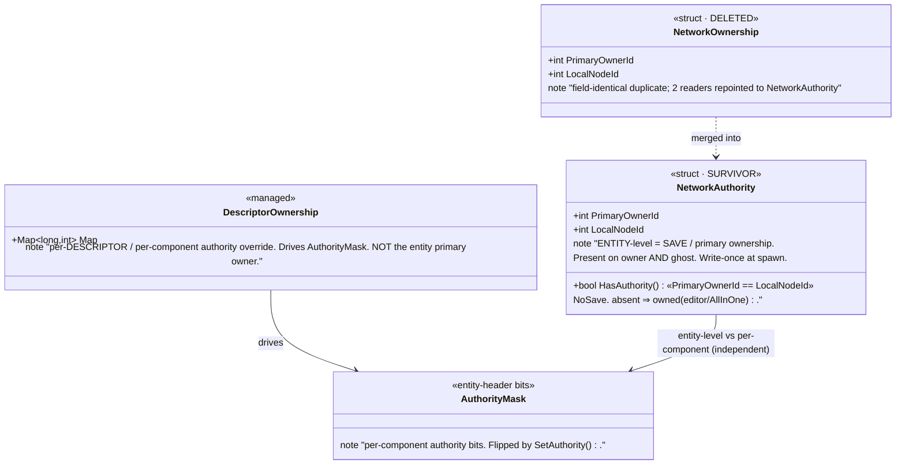
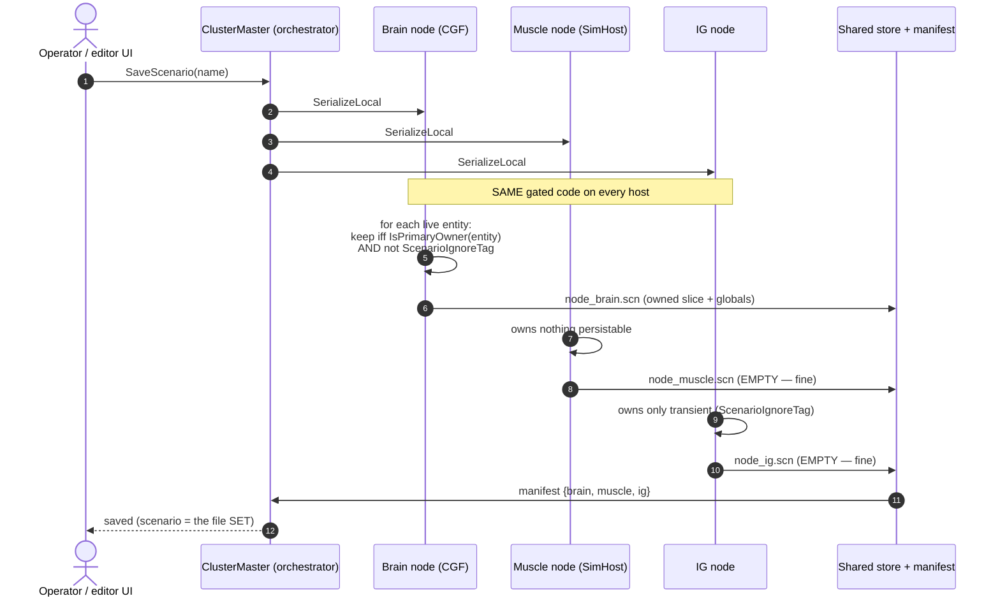
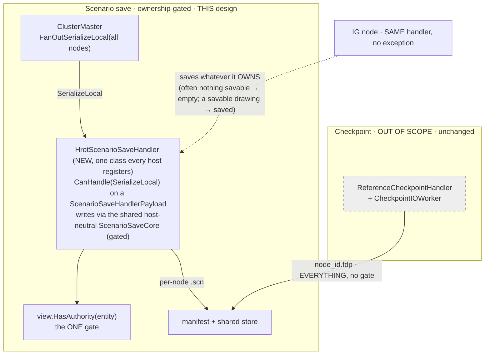
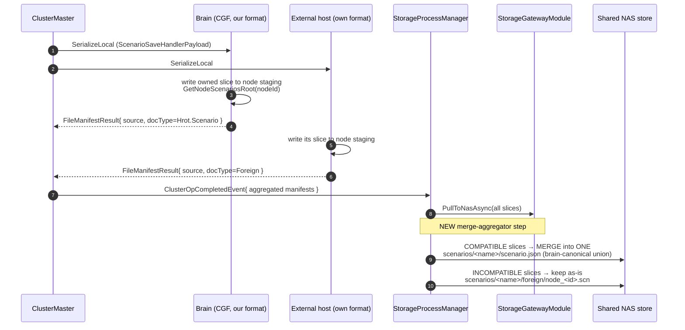
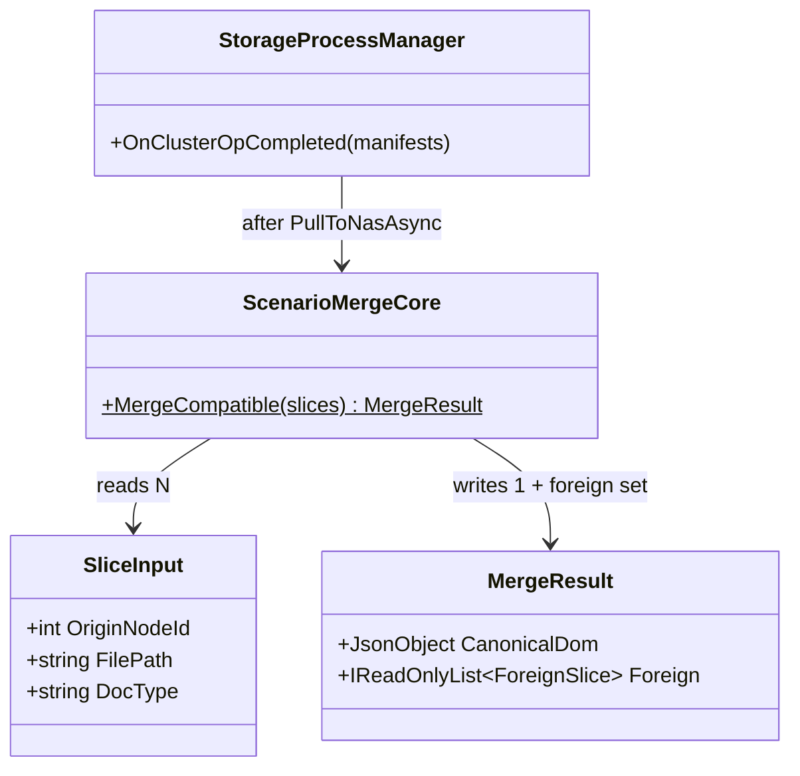
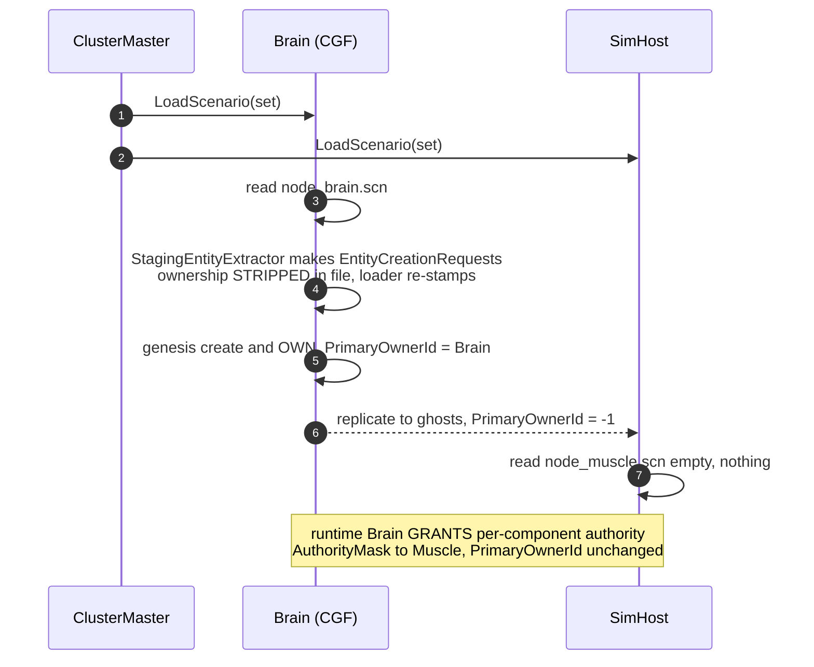
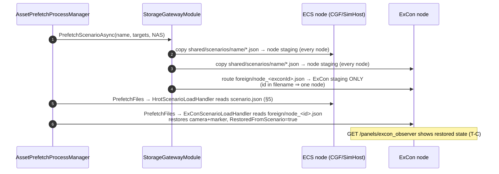

<!--STATUS
state: LIVE
updated: 2026-09-14
build-state: BUILDING
build-progress: Stage A (CE-275 ④ / OQ12) + Stage B (CE-275 ② the save gate) BUILT & GREEN `2026-09-14`.
  Stage A: OwnershipIngressSystem mirrors an EntityMaster-ordinal transfer into NetworkAuthority.PrimaryOwnerId
  (master ordinal injected network-agnostically via DescriptorOwnershipMap.PrimaryOwnerDescriptorOrdinal,
  set by NedReplicationModule; 3 rails in OwnershipTests). Stage B: CollectSaveableEntities now gates on
  HasAuthority (absent⇒owned) as well as ScenarioIgnoreTag; OQ7 (parts ride parent) + OQ8 (editor saves all)
  RESOLVED with rails in AuthorityExtensionsTests + ScenarioSerializerTests. Fdp.Toolkits.Tests 82/82,
  Hrot.Network.NED build clean.
  Stage C1+C2 BUILT & GREEN `2026-09-14` (see §4 AS-BUILT): one host-neutral ScenarioSaveCore; the ONE
  HrotScenarioSaveHandler; ScenarioFileService reduced to a shim; ClusterMaster SaveScenarioJson routing;
  EditorScenarioSession.SaveAs/SaveCurrent reroute (editor AND CGF go through the cluster, no local write);
  handler registered on editor + CGF. Rails: HrotScenarioSaveHandlerTests 3, EditorScenarioSessionSaveTests 3,
  ScenarioFileService shim tests green, orchestration struct tests 55/55.
  Stage C3 BUILT & GREEN `2026-09-14`: the SAME handler now registered on ALL FOUR hosts (editor, CGF, SimHost,
  IG — IG included per user ruling, its file empty by the gate not a missing handler); NodeRolePersistenceRails
  rewritten (IG must not hold an UNGATED checkpoint handler, but DOES hold the gated scenario handler; R-140
  enforced by the gate) — 10/10; Node_Roles §7.1 marked superseded. IG + SimHost + editor + CGF build clean.
  ⇒ scenario save is UNIFIED across every host; there is no editor-only save path.
  CE-280 BUILT & GREEN `2026-09-15` (see §5a): the LOAD-side foreign round-trip — PrefetchScenarioAsync routes
  foreign/node_<id>.json to its origin node; ExConScenarioLoadHandler restores observer state (RestoredFromScenario
  ⇒ GET /panels/excon_observer). Rails: ExConScenarioLoadHandlerTests 3, StorageGatewayTests foreign-route 1.
  T-C ExCon-part + T-D mechanism DONE; live --mode all confirm still pending.
  Stage E DONE `2026-09-15` (CE-281, see §7 as-built): NetworkOwnership retired, merged into NetworkAuthority
  (2 readers repointed, 17 test files fixed; id 140 reserved). Ownership is now the single NetworkAuthority component.
  REMAINING: CE-277 follow-ons (OQ1 CGF zone service; retire raw-path SaveTo; multi-process staging+NAS pull;
  T3 --mode all E2E).
current-answer: §4 save flow, §5 load flow (R-A, ruled §8.1), §6 the ONE gate — keyed on the
  NETWORK-AGNOSTIC primary-owner fact (NetworkAuthority.PrimaryOwnerId, entity-level HasAuthority;
  absent⇒owned), NEVER a wire descriptor, §6a globals (brain-owned), §6b format recognition, §6c the
  ECS↔network seam (primary owner is an ECS fact; transport DERIVES EntityMaster from it; transfer
  updates PrimaryOwnerId ⇒ save follows), §7 the NetworkAuthority/NetworkOwnership merge, §1a paradigm
  correction. ⭐ ALL blockers + OQ6 closed `2026-09-14`; OQ9 corrected (editor is ALREADY a single-node
  cluster). §6c reconciled with the BDC/NED spec: EntityMaster ownership (transferable via the generic
  OwnershipUpdate, possibly EXTERNAL) IS the primary owner; PrimaryOwnerId is its ECS mirror. OQ12 (the
  OwnershipUpdate→PrimaryOwnerId sync for receiving an external transfer) is PULLED INTO the build
  (CE-275); the transfer INITIATION feature stays deferred (CE-276). Build = CE-275 (4 steps: merge,
  gate+rail, per-node handler+editor reroute+CGF zone service, OQ12 sync); build-time OQ7 (verify parts)
  + OQ8 (rail). ⇒ BUILDABLE; awaiting go-ahead.
stale-below: §4b's "zones can't be just entities" argument — superseded in place with the dead text under
  a HISTORY quote. §6a's `Zones` row and its "the brain must gain an IZoneManagerService" consequence.
known-rot: ⛔⛔ EVERYTHING THIS DOCUMENT SAYS ABOUT **ZONES** IS SUPERSEDED (2026-09-16) — §6a's
  "globals ride the brain file" no longer covers `Zones` (the user RETRACTED "zones should for sure be
  handled by brain"; the consumers are muscle-side and SimHost already composes the service), §4b's
  "zones can't be just entities" reasoned from the road-network half to the whole, and the
  `ScenarioMergeCore` I4 guard cites a retired "brain-only" rule. ⇒ **OQ1 and CE-277(a) are CLOSED,
  NOT BUILT.** ⭐ `$meta` / `Header.TkbName` / sim-time are UNAFFECTED — the brain-file rule still holds
  for them. 📄 docs/blueprints/Architect_Question_71_Terrain_Zones_And_The_Asset_Build.md §5.
known-conflict: DESIGN_Node_Roles_And_Policies.md §7.1 says IG-persistence is enforced "by an
  ABSENCE" (IG registers no save handler). ⭐ THIS design supersedes that enforcement with a
  UNIFORM per-entity GATE (§6): every host runs the same gated save; IG's file is empty by the
  gate, not by a missing handler. §7.1's ABSENCE becomes belt-and-suspenders, not the mechanism.
superseded-by: —
design-basis:
  - docs/DESIGN_Node_Roles_And_Policies.md §4 (ownership axes), §5 (persistence policy R-140),
    §7.2/§7.3 (the ungated save, measured), §8 ① (the parked save question)
  - docs/designs/cgf-scn-2/DESIGN.md (scenario serialization correctness; DataPolicy.NoScenario)
  - docs/designs/cgf-scn/DESIGN.md (CGF as authoritative genesis source on LOAD)
  - docs/DESIGN_Entity_Creation_Unification.md (the shared creation pipeline; §3.4b level mismatch)
  - docs/UX/UX_Feature_Authority_Aware_Writes.md §335/§342/§343 (the NetworkAuthority/NetworkOwnership
    duplication named as debt; "pick NetworkAuthority"; absent-component = owned)
  - docs/blueprints/RULINGS.md R-138 (fully distributed), R-140 (IG passive/non-persisting)
  - docs/reference/BDC_NED_SST_Descriptor_Rules.md (AUTHORITATIVE wire spec: entities-as-descriptors,
    EntityMaster lifecycle, per-descriptor ownership, the generic OwnershipUpdate transfer — §6c maps it
    onto our ECS and records the PrimaryOwnerId-mirror compliance gap)
related-designs:
  - docs/designs/routes-1/ROUTES1-DESIGN.md — owns the ROUTE model; §16 records that RoutePlan has no
    scenario translator, so routes pass this gate as entities but reload with no waypoints (BP-518).
  - docs/DESIGN_Terrain_Zones_And_Assets.md — the terrain/zone/asset model (Area entities, the
    entity-is-the-definition rule, PrepareTerrainAsset/CommitTerrainAsset and the road compile).
  - DESIGN_Node_Roles_And_Policies.md — owns the ROLE/ownership POLICY (who may own what, R-138/R-140);
    THIS doc owns the SAVE/LOAD MECHANISM that enforces it and the ownership-component unification.
  - docs/designs/cgf-scn-2/DESIGN.md — owns per-COMPONENT-TYPE save correctness (which components are
    NoScenario, serializer truncation); THIS doc owns per-ENTITY save selection (which entities each node saves).
  - docs/designs/cgf-scn/DESIGN.md — owns the LOAD genesis pipeline (scenario JSON → creation requests);
    THIS doc owns which FILE(S) each node loads and re-ownership at load.
  - DESIGN_Entity_Creation_Unification.md — owns the CREATION pipeline whose OwnerNodeId stamps the
    save-ownership THIS doc gates on. ⭐ ALSO owns the measured analysis that `NetworkAuthority` is
    runtime-only. ⚠ SUPERSEDED `2026-09-14`: the `2026-09-02` withdrawal (which said "use the extractor
    context-mask, NOT a global flag") is REVERSED by CE-277(e) — `[DataPolicy(DataPolicy.NoScenario)]` IS now
    applied to `NetworkAuthority` + `DescriptorOwnership` (the process-local pair; NOT `NetworkIdentity`/
    `TkbIdentity`, whose data the LOAD path reads from the file — measured, 10 rails). Stage E adds NO flag; §7.
  - DESIGN_Role_Affinity_Ownership.md — owns WHO OWNS WHICH COMPONENT (the role-affinity tables
    REGISTER = owned ∪ read, AUTHORITY = owned; the per-component AuthorityMask). It DECIDES the
    per-component/per-entity ownership; THIS doc only READS the primary-owner fact at save time and
    never decides it. The per-component AuthorityMask it owns is axis ② here (§3); PrimaryOwnerId is axis ①.
  - DESIGN_Entity_Genesis_End_To_End.md — owns the end-to-end genesis STAGE SEQUENCE and vocabulary
    (request → spawn → grant → ghost → takeover → Active). Its takeover stage is where per-component
    authority moves and where a future primary-ownership transfer (§6c) would sit; THIS doc consumes the
    resulting owner at save time, it does not move it.
  - UX_Feature_Authority_Aware_Writes.md — owns the AUTHORITY-GATED WRITE UX and first named the
    NetworkAuthority/NetworkOwnership duplication (§335/§342); §7 here is the merge it deferred.
  - DESIGN_SaveScenario_Legacy_Op_Retirement.md — owns the RETIREMENT of the legacy binary
    SaveScenario=2 op (CE-278), the half-built stub whose *intended* purpose THIS doc's SaveScenarioJson=17
    replaces; it also documents the exercise-recording/checkpoint enumeration and the Orchestrator.json
    sidecar. THIS doc owns the replacement; that doc owns removing the predecessor.
  - DESIGN_Entity_Ownership_Transfer.md — owns the INITIATION side of an entity-ownership transfer (CE-276,
    descriptor-level, NED-initiated); THIS doc owns the save gate and the RECEIVE side (§6c, OQ12). §6c's
    "make NetworkAuthority replicated" gap note is SUPERSEDED by it. Reciprocal.
  - DESIGN_Unified_Cluster_Handler_Registration.md — CE-279; owns the role-based unification of cluster-handler
    registration + payload-agnostic SerializeLocal wire. THIS doc's T-B distributed save is BLOCKED on that
    unification (§4 T-B block); that doc owns the fix.
-->

# ⭐⭐⭐ Unified Distributed Scenario Persistence & the Single Ownership Component

> **Two decisions, one document.**
> **① Scenario SAVE and LOAD are ONE cluster-orchestrated, ownership-gated operation** — the editor
> is just the degenerate single-node (all-in-one, brain-perspective) case, not a separate path.
> **② `NetworkOwnership` is merged into `NetworkAuthority`** — one component, one responsibility:
> *entity-level primary / save ownership*. Per-**component** runtime authority stays a separate axis.
> **⛔ Checkpoints are OUT OF SCOPE** — they save/load *everything* on *every* host regardless of
> ownership, by design; nothing here changes them.

📌 **Why this document exists.** The save path has **no ownership gate** — `CollectSaveableEntities`
filters only `ScenarioIgnoreTag` (measured, `DESIGN_Node_Roles §7.3 ④`). That is harmless with ONE
saver (the editor owns everything) and **wrong** the moment two nodes save: each writes its ghosts too.
And two field-identical ownership components (`NetworkAuthority`, `NetworkOwnership`) encode one concept,
named "debt" in `UX_Feature_Authority_Aware_Writes.md` but never merged.

---

## 1. ⭐⭐ THE MODEL IN ONE PARAGRAPH

Every host runs the **same** gated save with **no role exceptions**. A host writes to its **own**
per-node scenario file **exactly the non-transient entities it is the entity-level primary owner of**
(`view.HasAuthority(entity)`), whatever its role — a host owns an entity because it *created* it, and a
host creates entities because of the roles it was assigned, **not** because it is "a brain" or "passive".
⛔ There is **no** "IG never persists" special case: if any host owns a savable (non-transient) entity —
e.g. the editor's or an IG's 2D-map role authored a persistable tactical drawing — that host saves it,
full stop (see §1a). A host that happens to own nothing savable writes an empty file — harmless. The
**editor** is the degenerate single node that hosts **all** roles, so it owns everything and writes the
whole scenario as **one** file; that file equals a brain-role file **only circumstantially** — because
the other roles usually own little that is savable, not by definition. **One rule — save an entity iff
you are its non-transient primary owner — makes the editor, the brain, the IG and every future partition
fall out of the same code.** ⚠ **The multi-file ↔ single-file LOAD round-trip is NOT yet fully resolved —
see §8 OQ11, the central open question.**

### 1a. ⭐⭐⭐ PARADIGM CORRECTION `2026-09-14` — passivity is EMERGENT, not designed

> 🔒 **User, verbatim:** *"'IG is passive, non-persisting' — this is the old paradigm. Hosts are not
> passive by design; passivity results from whether they create their own entities, which comes from the
> roles they are assigned. Any single host can create entities (thus be their primary owner) so if that
> happens and the entity is savable to scenario (non transient) also the IG must save it to the scenario,
> no exceptions, no differences, unified rules and implementation."*

⛔ This **refines `R-140`** (`DESIGN_Node_Roles §5`, "IG is passive and non-persisting"): R-140's
*behaviour* still usually holds — an IG typically owns only transient entities — but as an **emergent
consequence of its role assignment, NOT a hard rule the save path enforces.** ⇒ the save path is
**uniform**; the only gate is ownership + transience. `DESIGN_Node_Roles §5/§7` must be updated to say
"passivity is emergent" rather than "IG may not persist" (recorded as a follow-up there).

---

## 2. 🔴 INVENTORY — measured 2026-09-14 (grep + code read; codebase-memory MCP flaky this session)

> ⚠ codebase-memory MCP dropped mid-session; the enumerations below are grep/`find.sh` + direct reads.
> Re-verify the exhaustive claims (reader counts) with `search_graph` when the graph is back.

| # | thing | measured |
|---|---|---|
| ① | the save gate | `ScenarioSerializer.CollectSaveableEntities` (`Fdp.Toolkits/Scenario/ScenarioSerializer.cs:523-541`) skips **only** `ScenarioIgnoreTag`; no ownership/ghost filter |
| ② | the entity-JSON writer | `ScenarioFileService.SaveScenario` → `ScenarioSerializer.Serialize` (`Hrot.Presentation/.../ScenarioFileService.cs:114-120`); built by the **editor** (`EditorSubsystem:1314`) AND **CGF** (`CgfSubsystem:1058`, over CGF's own world via `EditorScenarioSession`) |
| ③ | the distributed cluster save today | `ClusterMaster.SaveScenario` → `FanOutSerializeLocal(all active nodes)` (`ClusterMaster.cs:983-987`) → each node's `SerializeLocal` handler is **`ReferenceArchiveHandler`**, which only **reports** an existing per-node `node_{id}.fdp` — ⛔ **it does NOT run the scenario-JSON serializer.** ⇒ there is **no per-node gated scenario-JSON writer today**; the fan-out collects **checkpoint recordings** |
| ④ | the save-ownership helper (already exists) | `AuthorityExtensions.HasAuthority(view, entity)` (`Fdp.Toolkits/Replication/Extensions/AuthorityExtensions.cs:9`): resolves part→parent, skips the per-descriptor override at key 0, returns `NetworkAuthority.HasAuthority`; **absent component ⇒ true (owned)** (`:33-40`) |
| ⑤ | the two ownership structs | `NetworkAuthority` (`.../Components/NetworkAuthority.cs`) and `NetworkOwnership` (`.../Components/NetworkComponents.cs:20`) are **field-identical** `{PrimaryOwnerId, LocalNodeId, HasAuthority}`; `NetworkOwnership`'s per-descriptor `Map` was removed (BATCH-07) |
| ⑥ | `PrimaryOwnerId` (the owner node-id) | **write-once at spawn today**: `NetworkSpawningSystem.cs:160/163` (owner), `EntityMasterIngressTranslator.cs:149` (ghost = `-1`). It is the **network-agnostic source of truth** for primary/save ownership (`NetworkAuthority`, `Fdp.Toolkits`, no DDS). ⚠ Nothing updates it after spawn **yet** — an entity-transfer FEATURE would (§6c). The transport (`EntityMaster`) is **derived** from it; the per-descriptor `DescriptorOwnership`/`AuthorityMask` transfer path is for per-COMPONENT authority, not entity ownership |
| ⑦ | `NetworkAuthority` readers | **~57** production sites via `.HasAuthority`; present on owner AND ghost |
| ⑧ | `NetworkOwnership` readers | **2** production sites — `CycloneNetworkCleanupSystem.cs:47/52` (query then `if(!HasAuthority) continue`) and `OwnershipExtensions.OwnsDescriptor*` (absent ⇒ false) |
| ⑨ | LOAD authority | `CgfScenarioLoadHandler` / `CgfEpisodeLoadHandler` call `StagingEntityExtractor.Extract(serializer, json, idAllocator)` → `EntityCreationRequest[]` → genesis pipeline; the extractor **strips** `NetworkAuthority`/`NetworkOwnership`/`NetworkIdentity` (`HROT-Engine-Guide §166`, `StagingEntityExtractor:52/56`) |
| ⑩ | global scenario data | `ScenarioFileService` also writes a **`Zones`** section from `IZoneManagerService` (`:122-125`). ⛔ **CGF composes NO zone service** (`CgfSubsystem:1053`, `zoneService: null`) — zones are **editor-only** today |
| ⑪ | IG persistence enforcement | IG registers **no** save handler (`DESIGN_Node_Roles §7.1`); SimHost/CGF/ExCon **do** register `ReferenceArchiveHandler` |

---

## 3. ⭐⭐⭐ THE OWNERSHIP MODEL — one component per axis

> **Diagram first.** The class diagram is the design; the prose says only *why*.



*Caption — what the picture shows that prose hid:* two distinct axes. **① entity / SAVE ownership** =
`NetworkAuthority.PrimaryOwnerId` — the **network-agnostic** owner node-id, *who deletes and who saves*.
**② per-component runtime authority** = `AuthorityMask` (core header) — *who simulates a component this
frame*, moved by the grant / `DescriptorOwnership`. The Muscle taking `SimTransform` flips an `AuthorityMask`
bit and never touches axis ① — so the save gate is immune to runtime authority moves. A genuine **primary
transfer moves axis ① (`PrimaryOwnerId`)**, and the save gate follows because it reads that fact (§6c). The
transport's `EntityMaster` ownership is **derived** from axis ①, not a third store. `NetworkOwnership` was a
redundant copy of axis ① and is deleted.

| axis | store | layer | mutated by | answers |
|---|---|---|---|---|
| **① entity / SAVE ownership** | `NetworkAuthority.PrimaryOwnerId` | toolkit (transport-agnostic) | default at spawn; a **transfer** feature (rare) | *do I delete / save this entity?* |
| **② per-component runtime authority** | `AuthorityMask` (+ `DescriptorOwnership`) | core header + toolkit | grant / auto-takeover (per frame) | *do I simulate this component now?* |

---

## 4. ⭐⭐⭐ SAVE — the unified, ownership-gated, cluster-orchestrated flow



*Caption:* the fan-out already exists (`ClusterMaster.FanOutSerializeLocal`, INVENTORY ③); **what is new
is the per-node handler that RUNS the gated `ScenarioSerializer` instead of only reporting a checkpoint
recording.** Every host runs identical code; **content differs only by what each host owns.** The editor
collapses this to one node that owns everything ⇒ one non-empty file.

### Module / registration view — who runs the save, and the ONE dead edge



*Caption — what the picture shows that prose hid:* the checkpoint lane (grey) is a **separate** mechanism
that ignores ownership; do not fold it in. ⭐ **Every host — IG included — runs the identical handler with
no role branch**; the content of each file is purely *what that host owns*. This retires
`Node_Roles §7.1`'s "enforce by a missing IG handler": there is no missing handler and no IG special case
(§1a). An IG file is empty *when* the IG owns nothing savable, not *because* it is an IG.

#### ⭐ AS-BUILT (Stage C, `2026-09-14`)

- **One host-neutral save core.** `ScenarioSaveCore.Write` (`Hrot.Core`, namespace `Hrot.Map.Common.Scenario`)
  is the ONLY scenario-save implementation — gated `ScenarioSerializer` + `$meta` + this host's zones. ⛔ There
  is NO editor-specific save: `ScenarioFileService.SaveScenario` is now a THIN SHIM over the same core, and
  every host's one `HrotScenarioSaveHandler` calls it. *(The §4 diagram's `NodeScenarioSerializeHandler` frame
  name is realised as `HrotScenarioSaveHandler` reusing the shared core.)*
- **Trigger → orchestrator.** `EditorScenarioSession.SaveAs/SaveCurrent` (the ONE session class — editor AND
  CGF) publish `ExecuteStorageOpIntent{ Operation=SaveScenarioJson, ScenarioName }`;
  `ClusterMaster.ProcessStorageOpIntent` fans `SerializeLocal` out with a `ScenarioSaveHandlerPayload`
  (distinct from the `.fdp` archive payload, so `ReferenceArchiveHandler` and the scenario handler coexist).
- **Name, not path.** The operator picks a relative name / subfolder under the NAS scenarios root; no
  filesystem path is ever chosen. The raw-path `EditorScenarioSession.SaveTo` has no production caller and is
  scheduled for removal (C3).
- **File target (INTERIM shortcut — see §4a for the ruled target).** For the single-authoritative-node case
  (editor / CGF brain owning all persistable, R-A) the handler writes `<scenariosRoot>/<name>/scenario.json` in
  place and reports NO manifest. ⚠ This **under-adopts a seam that already exists**: the per-node staging +
  `FileManifestResult` + `StorageGatewayModule.PullToNasAsync` transport is BUILT and used by the `.fdp` archive
  path (`ReferenceArchiveHandler`). ⛔ Writing direct-to-shared **collides** if two nodes ever own persistable
  entities (both write the same `<name>/scenario.json`, last-writer-wins). Safe today only because the sole
  trigger is the editor (one node) and R-A means only the brain owns. **§4a is the ruled multi-owner target.**
- **Registered by every host** (unification, no IG exception): editor + CGF built `2026-09-14`; SimHost + IG
  land in C3 with the `NodeRolePersistenceRails` update (IG carries the handler; the gate — not a missing
  handler — keeps its file empty).

#### ⭐ AS-BUILT — the HTTP trigger is the EXISTING `/scenario/save`, not a new route (c0, `2026-09-14`)

> 🔒 **User:** *"how comes saving a scenario is not accessible via HTTP? isn't there a save scenario endpoint
> implemented? it should be triggering the cluster-wide save."*

⭐⭐ `POST /scenario/save {name}` already existed; it was **editor-only** because the route was gated on
`editor.authoring` and its handler called `IEditorLogic.SaveScenarioAs` directly — so on a cluster node it
returned **501**. The fix mirrors HN-029's `/scenario/load` split exactly — ⛔ NOT a parallel `/cluster/...`
route:

| piece | as-built |
|---|---|
| **capability** | `/scenario/save` gets its OWN key `DebugCapabilities.SaveScenarioJson` (`"scenario.saveJson"`), ordered before the `/scenario` catch-all in `CapabilityManifest.cs` — a node that CAN trigger the save advertises it honestly instead of reading as "authoring absent" |
| **endpoint** | `DebugApiService.SaveScenario` is now symmetric with `LoadScenarioEdit`: editor-driver arm (`_editorLogic.SaveScenarioAs`, which already publishes the `SaveScenarioJson` intent via `EditorScenarioSession`) OR cluster-intent arm (`_dispatcher.RequestSaveScenarioJsonAnyNode(name)`) on a headless node |
| **provider** | each subsystem contributes `RequestSaveScenarioJson` via `SubsystemDebugProvider.SavesScenarioJsonVia(bus)`, publishing `ExecuteStorageOpIntent{ SaveScenarioJson, ScenarioName }` on its OWN control-plane bus (SimHost · IG · CGF · ExCon) — the same shape as `TransitionsVia`/`DumpsVia` |
| **network route** | when the HTTP-hit node is NOT the master, `ClusterOpEgressTranslator` maps `SaveScenarioJson` and serialises the name as `{"ScenarioName": …}` (⛔ the `ArchivePayloadDto` other storage ops use has no name field); `ClusterOpMasterTranslator` reconstructs `ExecuteStorageOpIntent{ SaveScenarioJson, ScenarioName }`. On the master node the intent is read directly by `ClusterMaster`. Both master-side paths (this networked one and the in-process `ClusterOpRequestAdapter`) read the name identically |

⇒ ⭐ any perspective's HTTP port now triggers the fan-out; the name (never a path) is preserved end to end.

#### ✅ T-B GREEN `2026-09-15` — the distributed save works end to end (after CE-279 A+B)
Live `--mode all` (`simhost,ig,excon,cgf`), loaded `hill-attack`, `POST /scenario/save`:
`{"saved":…,"via":"cluster-intent"}` → on NAS `shared/scenarios/<name>/`: a merged **`scenario.json`**
(docType `Hrot.Scenario`, **9 entities**) **and** `foreign/node_200.json` (docType `ExCon.Observer`) **and**
`foreign/index.json`. Log: `SaveScenarioJson → fan-out to 5 node(s)` → nodes 100 & 400 wrote `Hrot.Scenario`
slices, node 200 (ExCon) wrote the foreign observer slice → `StorageProcessManager merged 3 slice(s) →
scenario.json` + `kept 1 foreign slice`. ⇒ the R-A compatible-merge + foreign-route runs side by side in one
save, triggered over HTTP. The two remaining "No handler for SerializeLocal" nodes are the ones with no save
handler (e.g. SimHost's null serializer) — benign: the payload-aware archive handler correctly declines the
scenario payload. What unblocked it: **CE-279 Layer A** (unified registration + payload-aware selection) +
**Layer B** (the wire carries the scenario payload). 📄 `DESIGN_Unified_Cluster_Handler_Registration.md`.

#### ⛔ HISTORY — T-B `2026-09-14`: c0 trigger PROVEN, but the fan-out produced NO slice (defects since fixed by CE-279)

Ran `--mode all` (`simhost,ig,excon,cgf`), loaded `hill-attack` live (8 entities), `POST /scenario/save`:

- ✅ **c0 works.** Response `{"saved":…,"via":"cluster-intent"}` (no 501); log:
  `ClusterMaster: SaveScenarioJson '<name>' → SerializeLocal fan-out to 5 node(s)`. The HTTP trigger →
  intent → master → fan-out chain is confirmed end to end.
- ⛔ **No merged `scenario.json` produced; no node wrote a scenario slice.** Re-run `2026-09-15` after a
  first attempted fix showed the payload-aware `CanHandle` patch was **necessary but NOT sufficient** — the
  real cause is a family of defects, all symptoms of **NON-UNIFIED, per-host cluster-handler registration**.
  ⭐ Root cause + full plan: 📄 **`DESIGN_Unified_Cluster_Handler_Registration.md` (CE-279)**. The measured
  defects:
  1. **Payload-blind `SerializeLocal` handler selection.** `SerializeLocal` is shared by the `.fdp` archive
     and the scenario-JSON save; `ClusterSlave` dispatches to the FIRST `CanHandle`-true handler
     (`ClusterSlave.cs:362-364`), and `CanHandle(intent)` defaults to operation-only
     (`IClusterStateHandler.cs:29`; only `HrotEditLoadHandler:92` overrides it). ⇒ where `ReferenceArchiveHandler`
     is registered before the scenario handler it SWALLOWS the scenario payload. **But registration order is
     itself divergent** (see #3), so the shadowing manifests differently per host.
  2. **The wire drops the scenario payload.** `NodeOpSlaveTranslator.cs:174-178` hardcodes `SerializeLocal` →
     `ArchiveHandlerPayload` (and the egress `NodeOpMasterTranslator` has no `ScenarioSaveHandlerPayload` arm).
     So on every DDS hop to a remote node the scenario payload — and its `ScenarioName` — is lost/rebuilt as an
     empty archive payload. The distributed scenario save cannot cross the wire at all.
  3. **Divergent registration (measured `2026-09-15`).** There is no shared role-driven registration: SimHost
     via `NodeBootstrapper.BuildOrchestration` (param-gated, **prod passes `scenarioSerializer: null` ⇒ SimHost
     registers NO save handler**); IG/CGF/ExCon/Editor hand-roll inline. IG + Editor register **no**
     `ReferenceArchiveHandler`; CGF registers Save **before** Archive while SimHost/ExCon do Archive **before**
     Save (opposite order → #1 bites differently); ExCon substitutes `ExConScenarioSaveHandler`. `NodeRole`
     (`Fdp.Core/Abstractions/NodeRole.cs`) exists but drives none of this.

⇒ **c0 (the HTTP trigger) is DONE and proven.** The end-to-end distributed save (T-B) is blocked on the
non-unification above and is retargeted as **CE-279** (unify handler registration + payload-agnostic
`SerializeLocal` wire). ⚠ The first payload-aware `CanHandle` patch was **reverted** `2026-09-15` — it is
correct but belongs inside the unified fix, not as five hand-edited handlers (and one edit tripped a
pre-existing path-mismatch in `ReferenceArchiveHandlerTests.Commit_ProducesManifestJson`, to be handled with
CE-279).

### 4a. ⭐⭐⭐ R-A DISTRIBUTED SAVE — **orchestrated pull + compatible-merge** *(user ruling `2026-09-14`)*

> 🔒 **User, verbatim:** *"R-A as agreed. Each node uses orchestrated pull. Aggregator merges compatible
> scenario files to one as if brain owned all and saved (later loaded by brain) and leaves the non-compatible
> ones (later distributed to original nodes and loaded by them)."*

⭐⭐ **This REUSES the existing archive transport instead of the direct-to-shared shortcut**, and adds ONE new
step (a scenario merge-aggregator). The compatible/incompatible split is the §6b format tag (`$meta.docType`).



*Caption — what the picture shows that prose can't:* two DIFFERENT fates for a pulled slice keyed on its
format tag — the compatible ones **collapse to one file** (as if the brain had owned all and saved it), the
incompatible ones **stay separate**. The merge is the one genuinely new component; everything else
(`FanOutSerializeLocal`, per-node staging, `FileManifestResult`, `PullToNasAsync`) already exists.

| ⭐ the ruled model | mechanism | built? |
|---|---|---|
| each node writes its owned slice to **its own** staging dir | `HrotScenarioSaveHandler` → `GetNodeScenariosRoot(nodeId)` + return `FileManifestResult` | ⛔ handler change (drop the direct-to-shared shortcut) |
| orchestrator **pulls** every slice to NAS | `PullToNasAsync` | ✅ exists |
| **merge** the format-compatible slices into ONE `<name>/scenario.json` | ⭐⭐ NEW scenario merge-aggregator (`INodeResponseAggregator` for the scenario op, or a merge in `StorageProcessManager`) | ⛔ NEW |
| **leave** incompatible-format slices as separate per-node files | keyed on `$meta.docType` ≠ our type (§6b) | ⛔ NEW (a filter) |
| LOAD: brain loads the merged canonical file, owns all | §5 · genesis re-stamps owner = loader | ✅ exists (single file) |
| LOAD: incompatible files **routed back** to their origin nodes, loaded there | ✅ **CE-280 (AS-BUILT):** `PrefetchScenarioAsync` routes `foreign/node_<id>.json` to the matching node's staging (not `PushToNodesAsync` — see §5a); each node's own load handler reads it. ExCon: `ExConScenarioLoadHandler` on `PrefetchFiles` | ✅ built (§5a) |

⭐ **Why merge-on-pull and not merge-on-load:** the canonical `<name>/scenario.json` becomes a normal
single-file scenario the brain (or a fresh editor) loads with **zero** new load logic — the round-trip
already proven in the editor test. The distribution boundary is the **format tag**, exactly §6b: our hosts
unify into one file; a foreign host keeps its own.

### 4b. ⭐⭐⭐ THE MERGE — detailed design *(why it is trivial, proven — `2026-09-14`)*

📐 **The scenario DOM, measured** *(`ScenarioSerializer.Serialize:120-202`, `ScenarioSaveCore.BuildDom:33-45`)*:

```json
{ "$meta":  { "docType": "Hrot.Scenario", "schemaVersion": 2 },
  "Header": { "TkbName": "<active TKB>" },
  "Entities": { "<random-guid>": { "<Component>": { … }, … }, … },
  "Zones":  [ … ] }              // present ONLY on a host with a zone service (brain, §6a)
```

#### The merge is a disjoint dict-union + brain-sourced globals — and here is the PROOF

| # | invariant | why it holds | code |
|---|---|---|---|
| **I1** | **one entity → one slice** (semantic disjointness) | the save gate is `save ⇔ IsPrimaryOwner(entity)`; every entity has exactly ONE primary owner, so it is serialized by exactly one node | `ScenarioSerializer.CollectSaveableEntities` (CE-275 ②) |
| **I2** | **entity keys never collide** (syntactic disjointness) | the DOM key is `Guid.NewGuid()` generated **per save**, not the network id — two slices' key sets are disjoint whatever they contain | `ScenarioSerializer.cs:127` |
| **I3** | **references stay intra-slice** (no renumbering on union) | a parent and its child parts share ONE owner (parts ride parent, OQ7), so every in-file GUID reference resolves inside the same slice; the union carries each slice's keys unchanged | `ScenarioSerializer.cs:539` · OQ7 |
| **I4** | **globals have ONE authoritative source** | `TkbName` is cluster-wide identical (one active TKB); `Zones` are written ONLY by a host with a zone service, i.e. the brain (§6a — muscle/IG pass `zoneService:null`) | `ScenarioSaveCore.cs:41-43` · §6a |

⇒ ⭐⭐⭐ **given I1–I4 the merge is literally:**

```
compatible = slices where $meta.docType == "Hrot.Scenario"     // §6b tag
merged = {
  "$meta":    compatible[any].$meta,                            // I4 + assert equal schemaVersion
  "Header":   brainSlice.Header,                                // I4 (TkbName; assert equal across compatible)
  "Entities": ⋃ compatible[i].Entities,                         // I1+I2 ⇒ disjoint union, no overwrite
  "Zones":    brainSlice.Zones                                  // I4 (the only slice that has any)
}
write merged → <sharedNAS>/scenarios/<name>/scenario.json
```

⭐ **No id remapping, no reference fix-up, no entity reconciliation** — that is the whole content of the
"trivial" claim, and I1–I3 are exactly why. ⚠ The steady state is even smaller: after any load every entity
is brain-owned (§5), so a later save has ONE non-empty slice and the union is `{brain} ∪ {∅,∅}`. The merge
does real work ONLY for a **non-brain live-authored** entity (IG draws) between loads — the case §8.1 R-A
folds into the brain anyway; here it folds at save.

#### ⛔ Fail-loud guards (a merge must never silently corrupt)

| guard | on violation |
|---|---|
| `schemaVersion` differs across compatible slices | **reject** the save — a version skew needs migration, not a blind union |
| `Header.TkbName` differs across compatible slices | **reject** — a cluster runs ONE TKB; a mismatch is a config fault |
| a GUID key appears in two slices (I2 impossible) | **reject** — signals a broken save, never overwrite |
| `Zones` present on a non-brain slice | **warn**, keep the brain's (I4 says brain is the source) |
| zero compatible slices (all foreign) | **valid** — no canonical file written; only the foreign set (c3) |

#### The incompatible set (c3) — routing, never parsing

⭐ A pulled slice whose `$meta.docType` ≠ `"Hrot.Scenario"` is **copied verbatim** to
`<name>/foreign/node_<id>.scn` and indexed `{ originNodeId, docType }`. ⛔ **It is never opened, parsed or
merged.** On LOAD the index drives `StorageGatewayModule.PushToNodesAsync` to return each foreign file to its
origin node, which loads it with its own editor (§6b). ⭐⭐ **This is genuinely simpler than the merge** — no
JSON touched — which is why it ships WITH c2, not after *(user ruling `2026-09-14`: no deferral)*.

⚠ **ONE open sub-question, with a lean** — *how does a foreign slice enter the pulled set?* (a) a foreign
host runs a minimal FDP node shell that deposits its file into per-node staging like any node **(lean — it
matches "each node uses orchestrated pull" and keeps the classify step uniform)**, or (b) the foreign host
writes to NAS entirely out-of-band and the orchestrator only avoids clobbering + routes on load. ⭐ I lean
(a); it needs confirming before c3 is coded, because it decides whether the pull enumerates foreign nodes.

#### Where it lives — one host-neutral helper, mirroring `ScenarioSaveCore`



*Caption:* `ScenarioMergeCore` is a pure JSON transform (no ECS, no engine) beside `ScenarioSaveCore` in
`Hrot.Core`; `StorageProcessManager` calls it after the existing `PullToNasAsync`. ⭐ The only NEW code is
this one class + its registration; every arrow into it already exists.

#### ⭐ WHY `Zones` is a DOM PEER of `Entities`, not entities-like-anything-else *(measured — answers I4)*

📐 A **zone is a DEFINITION, not entity data** — `ZoneDefinitionDto` = `{ RoadNetworkPath, TerrainDatabaseId,
Obstacles }`, keyed by **name** (`Dictionary<string, ZoneDefinitionDto>`, an authoring identity, not a
network id). On load `ZoneManagerService.LoadZones` **generates** two very different things from it:

| the definition produces | kind | is it an entity? |
|---|---|---|
| the **road network** (from `RoadNetworkPath`) | a **singleton** `ZoneEnvironmentData` blob (navmesh/roads) | ⛔ **no entity exists for it** — it is world environment data |
| **obstacles** | ordinary entities with `SimTransform`+`PhysicsCollider` | ✅ yes — saved as entities like anything else |

⛔⛔⛔ **THE PARAGRAPH BELOW IS SUPERSEDED `2026-09-16`** — 📄 **[`Architect_Question_71`](blueprints/Architect_Question_71_Terrain_Zones_And_The_Asset_Build.md) §5.**
⭐ **What it got right:** the road network genuinely has no entity to be — it is a natively-loaded blob.
🔴 **What it got wrong:** it concluded from that half that the WHOLE zone must be a non-entity bundle.
The ruling splits the two axes instead — the **terrain/zone artefact** stays non-entity *(a geographic
`ZoneSpec {ZoneId, Bounds, DataPath}`)*, while **roads and obstacles become world-content ENTITIES**
authored like anything else and compiled into assets by an explicit build
*(`PrepareTerrainAsset`/`CommitTerrainAsset`)*. ⚠ Its own second table row already conceded obstacles are
saved as entities — which is precisely the **double representation** the ruling removes. ⛔ And
*"zones = brain-only is a load-bearing invariant"* is retired with §6a: the real invariant was only ever
*"exactly one source"*, and the wired source was the **muscle**, never the brain.

> ⛔ **HISTORY — the superseded argument, kept so nobody re-derives it:**
> *"Zones can't be 'just entities' because half of what a zone yields (the road-network singleton) has no
> entity to be. The definition is a compact **generator** edited as a named unit; storing it beats storing its
> generated output. So `Zones` is a legitimately different KIND — a named environment/authoring layer — and its
> brain-single-source (§6a) is what makes I4 hold: name-keyed zones **could** collide across slices (unlike
> random-GUID entities), and the only thing preventing it is that **only the brain writes them.** That makes
> 'zones = brain-only' a load-bearing invariant, not a convenience — the merge asserts a single Zones source."*

### 4c. ⭐⭐⭐ c3 REALISED — **ExCon saves an intentionally-incompatible slice** *(user, `2026-09-14`)*

> 🔒 **User:** *"what about making ExCon save its scenario (something fake, but let's pretend ExCon has
> something real to save, for example initial location of observer's camera) in intentionally incompatible
> format?"*

⭐⭐ **This makes c3 a REAL participant, not a mock — and it settles the open sub-question as (a):** ExCon is a
node in the roster, so it takes the `SerializeLocal` fan-out like any host and **deposits a foreign slice into
its own per-node staging.** ExCon has **no ECS world** (it is the observer/console), so its slice is genuinely
NOT entity-shaped — the perfect incompatible case.

| step | ExCon does | orchestrator does |
|---|---|---|
| SAVE | its NEW `ExConScenarioSaveHandler` writes observer state *(fake: camera position/look-at)* to `GetNodeScenariosRoot(exconId)/<name>/excon.observer.json` with `$meta.docType = "ExCon.Observer"` (≠ `Hrot.Scenario`); returns a `FileManifestResult{ docType="ExCon.Observer" }` | classifies it INCOMPATIBLE → copies verbatim to `<name>/foreign/node_<exconId>.json`, indexes `{ exconId, "ExCon.Observer" }`; **never parses it** |
| LOAD | its own reader restores the camera from the routed-back file | ✅ AS-BUILT (§5a): `PrefetchScenarioAsync` routes `foreign/node_<exconId>.json` to ExCon's staging; `ExConScenarioLoadHandler` restores it |

⭐ **Why it is the right test:** it exercises every c3 edge with a host that *cannot* be merged by construction
(no entities, foreign tag), and it proves the compatible-merge and the foreign-route run **side by side in one
save**. It also gives ExCon a first real persistence surface. ⚠ **Scope guard:** the camera state is
deliberately minimal — it is a *fixture for the routing path*, not a new ExCon feature; keep it a few fields.

#### ⭐⭐ HOW ExCon's foreign part is PROVEN read (the observability answer)

🔒 **User:** *"ExCon should read the incompatible part — but how you can read/prove?"* — ExCon has **no ECS
world**, so `/entities` proves nothing. ⇒ ExCon's restored state MUST have a **readable debug surface**:

| ExCon does | proof over HTTP |
|---|---|
| on load, restore the camera into a **dumpable panel model** (ExCon panels already dump their model — the smoke suite asserts on exactly this) | `POST /perspective {name:"ExCon"}` → `GET /panel/<observerPanelId>` returns the restored camera; the rail asserts it equals the saved position |

⛔ Without a readable surface a "load" that silently did nothing is indistinguishable from success — the same
trap as the whole `intent-vs-status` discipline. ⭐ So the fixture is not done until `get_panel` shows the
camera; that assertion IS the c3 proof.

#### ⭐⭐⭐ TEST MATRIX — nothing is done until every cell is green *(user, `2026-09-14`)*

| # | scenario | proof |
|---|---|---|
| **T-A** | editor round-trip on the UNIFIED path (save → fresh editor load) | entities + ids identical (re-run the harness from the single-node proof) |
| **T-B** | `--mode all` SAVE, two owners (CGF ECS + ExCon foreign) | on NAS: ONE `<name>/scenario.json` (CGF entities, merged) **and** `<name>/foreign/node_<exconId>.json` (untouched) |
| **T-C** | load the multi-saved scenario **to the cluster** | CGF perspective: entities present + owned by the loader; ExCon perspective: `get_panel` shows the restored camera. ⭐ **ExCon foreign-restore wiring BUILT & rail-GREEN `2026-09-15` (CE-280, §5a);** ECS-side via `DistributedScenarioLoadTests`; live `--mode all` confirm pending |
| **T-D** | load the multi-saved scenario **to the editor** | editor loads the ECS canonical (entities present); the ExCon foreign file is **ignored** (§6b — the editor has no ExCon; it loads only what it recognises), no error. ⭐ mechanism = `Deserialize` skip-unknown (§6b), no code; live confirm pending |
| **T-E** | unit: `ScenarioMergeCore` | ✅ done — 9 rails |

⚠ **T-D's "ignored, no error" is a real assertion**, not an absence — the editor must skip a foreign file by
its `$meta.docType`, exactly today's `Deserialize` graceful-skip (§6b), and prove it loaded the rest.

---

## 5. ⭐⭐ LOAD — per-node file, brain canonical  ✅ R-A (ruled §8.1)



*Caption:* load re-establishes save-ownership on the loading (brain) node because the file **strips**
ownership (INVENTORY ⑨) and the genesis pipeline stamps `OwnerNodeId = loader`. A muscle's empty file is
correct — it receives entities by **replication**, and per-component authority arrives later by **grant**,
never changing `PrimaryOwnerId`. This is why the round-trip is stable: *save-owner in = save-owner out*.
⭐ **Format-incompatible slices (§4a) do NOT funnel here** — they are routed back to their origin nodes and
loaded by *that* host's own load handler, the one place "each host loads its own content" still literally
holds (§6b). ⭐⭐ **As-built mechanism: §5a.**

---

## 5a. ✅ LOAD — the foreign slice returns to its origin node  *(CE-280 AS-BUILT `2026-09-15`)*



*Caption:* what the picture shows that prose hid — **the foreign slice rides the SAME prefetch rail as the
canonical `scenario.json`, but is delivered to exactly one node** (the id encoded in `node_<id>.json`),
whereas `scenario.json` goes to every node. No change to the 2PC load sequence; the restore hooks the
`PrefetchFiles` phase, where the file has just arrived.

| ⭐ as-built | site |
|---|---|
| route each `foreign/node_<id>.json` to the target whose `NodeId` matches (defensive: no `foreign/` ⇒ no-op) | `StorageGatewayModule.PrefetchScenarioAsync` (foreign-routing arm) + `TryParseForeignNodeId` |
| ExCon's ONE `PrefetchFiles` handler: ensure staging + ACK (subsumes `ReferencePrefetchHandler`), then restore observer state from the routed slice | `Hrot.ExCon.Observer.ExConScenarioLoadHandler` |
| the restore target is the shared `ExConObserverState` the panel dumps | `ExConObserverPanelViewModel` (`GET /panels/excon_observer`) |

⛔⛔ **DEVIATION from the earlier plan's literal `StorageGatewayModule.PushToNodesAsync` (§4c/old §5):**
the foreign return is done **inside the existing `PrefetchScenarioAsync`/`PrefetchFiles` rail**, not as a
separate `PushToNodesAsync` call. ⭐ **Why:** it reuses the proven prefetch ACK/fan-out (`AssetPrefetchProcessManager`)
— no new async saga, no new node op, no touch to the 2PC load sequence — so the blast radius is one gateway
method + one ExCon handler. `PushToNodesAsync` is retained (multi-machine push primitive; unit-tested) but is
**not** the load-side foreign path. ⚠ **The prior "pushed back via `PushToNodesAsync`" wording in §4c and the
old §5 note is SUPERSEDED by this section.**

⭐ **Rails:** `ExConScenarioLoadHandlerTests` (save→route→restore round-trip, marker is the value-level proof;
+ panel dump = the T-C surface; + no-foreign no-op) · `StorageGatewayTests.PrefetchScenario_RoutesForeignSlice_ToOriginNodeOnly`
(foreign goes to origin node only, canonical to all). ECS load unchanged — `DistributedScenarioLoadTests`.

---

## 6. ⭐⭐⭐ THE ONE GATE

```
save/keep entity  ⇔  IsPrimaryOwner(entity)  AND  NOT ScenarioIgnoreTag(entity)
                       // IsPrimaryOwner = HasAuthority(entity) at entity level = NetworkAuthority.PrimaryOwnerId
                       //                  == LocalNodeId, with absent NetworkAuthority ⇒ owned
```

- ⭐⭐⭐ **Key on the NETWORK-AGNOSTIC primary-owner FACT, never on a wire descriptor** — see §6d. The save
  gate reads the ECS-level owner (`NetworkAuthority.PrimaryOwnerId`, a transport-agnostic component), so it
  works identically under NED, BDC, or no transport at all. ⛔ It must **not** name `EntityMaster` — that is
  a NED wire concept, and the gate lives below the transport (`ScenarioSerializer` is in `Fdp.Toolkits`).
- `HasAuthority(entity)` (INVENTORY ④): **absent `NetworkAuthority` ⇒ owned** (editor / AllInOne); else
  `PrimaryOwnerId == LocalNodeId`.
- **Editor / AllInOne** ⇒ owns everything ⇒ saves everything. No mode flag; the gate is always on.
- **Ghost** ⇒ `PrimaryOwnerId = -1` ⇒ false ⇒ skipped ⇒ no duplication across per-node files.
- `ScenarioIgnoreTag` still gates **my own transient** entities (a sketch I own but must not persist).
  The ownership gate makes the *ghost* case redundant, but the *own-transient* case keeps it necessary.

⚠ **Placement:** the gate goes in `CollectSaveableEntities` — one site, editor and cluster both inherit it.
`HasAuthority` and `NetworkAuthority` are both in `Fdp.Toolkits` (same assembly as `ScenarioSerializer`)
⇒ **no new dependency and no layer seam.** *(This reverts an earlier draft that keyed on the EntityMaster
descriptor and needed a NED ordinal injected — that was the wrong layer; see §6d.)*

### 6a. ⭐⭐ GLOBAL / NON-ENTITY DATA — the complete set, owned by the brain file *(ruling `2026-09-14`)*

📐 **Measured — a scenario carries exactly this much that is NOT a per-entity component:**

| datum | where it lives today | owner under this design |
|---|---|---|
| `$meta` (`docType`, `schemaVersion`) | DOM envelope (`ScenarioSerializer.Serialize:200`) | **brain file** |
| `Header.TkbName` (active TKB database) | DOM `Header` (`:198-199`) | **brain file** |
| `Zones` (tactical zones) | DOM `Zones`, from `IZoneManagerService` (`ScenarioFileService:124`) | ⛔⛔ **SUPERSEDED `2026-09-16` — THE WHOLE ROW IS RETIRED.** 🔒 The user RETRACTED *"zones should for sure be handled by brain"*: zones are consumed by **MuscleGround / Perception / NavigationSolver** (road network → `CarKinematicsSystem`, obstacles → colliders/LOS); **the brain needs none of it**, and SimHost already composes the service. ⇒ ⭐ the embedded `Zones` section is itself retired — a zone becomes a GEOGRAPHIC WINDOW (`mgmt-1` §11 `ZoneSpec`), roads/obstacles become world-content ENTITIES. 📄 **[`Architect_Question_71`](blueprints/Architect_Question_71_Terrain_Zones_And_The_Asset_Build.md) §5.** ⇒ **`OQ1` and `CE-277(a)` are CLOSED, not built** — they would add a zone service to the one role with no zone consumer |
| scenario **sim-time** | already **cluster/manifest** level (`GlobalContextClusterOpHandler.ScenarioTimeSeconds`), **not** in any per-node DOM | **orchestrator context** — already global, no change |

⭐ **The rule:** all per-node-DOM globals ride the **brain-role file** (the canonical scenario), because
the brain is the node that owns the scenario as a whole. ⭐ That still holds for **`$meta` and
`Header.TkbName`**. Sim-time needs nothing — it is already orchestrator-owned.

⛔⛔ **`Zones` IS NO LONGER ONE OF THEM — SUPERSEDED `2026-09-16`.** The prior build consequence
*("the brain node must gain a real `IZoneManagerService`")* is **withdrawn**; see the table row above.
📌 Two measurements killed it: the zone consumers are all **muscle-side** *(`CarKinematicsSystem` reads
the road network; obstacles are `PhysicsCollider`/LOS)* and **SimHost already composes the service on both
its load and save handlers** *(`NodeBootstrapper.cs:306,313`)*, so the *"brain-only"* rule was one the
wiring never followed. ⚠ **Consequence for `ScenarioMergeCore.cs:115-123`:** its I4 guard throws *"Two
Zones sources… Zones are brain-only (§6a, I4)"* — that message cites a retired rule. The guard's real
invariant was ever only *"exactly ONE source"*, and once the `Zones` section is retired the guard goes
with it. 📄 **[`Architect_Question_71`](blueprints/Architect_Question_71_Terrain_Zones_And_The_Asset_Build.md).**

### 6b. ⭐⭐ FORMAT RECOGNITION — a host loads only files it understands *(ruling `2026-09-14`)*

> 🔒 **User:** *"There is still a case the host uses incompatible scenario format (host being external
> software, interacting with others on orchestration network level only); in such a case that host
> requires its own editor that maintains that host-specific scenario file; meaning our current scenario
> editor capabilities must recognize the scenario file format and load just those compatible ones."*

⭐⭐ **The mechanism already exists.** Every scenario file stamps a format tag — `$meta.docType` (legacy:
`Header.SubsystemType`) — and `ScenarioSerializer.Deserialize` **gracefully skips** a file whose tag does
not match the loader's `_subsystemType` (`ScenarioSerializer.cs:327-343`, `return;` — no entities created).

| ⭐ the rule | |
|---|---|
| a host loads **only** the partial files whose **format tag it recognises** | ⇒ an external host that speaks a **different scenario format** keeps its OWN file, maintained by **its own editor**, and interacts with the cluster only at the **orchestration-network** level |
| our editor/CGF **skips** a foreign-format file silently | ✅ this is today's `Deserialize` behaviour — no new mechanism, just make it explicit in the load rule |
| ⚠ within R-A, "compatible" partials all funnel into the loading brain | ⛔ incompatible ones do **not** — they are that host's responsibility, the one place "different hosts save/load their own content" still literally holds |

⇒ ⭐ **R-A unifies the SAME-format hosts; the format tag is the boundary** past which a host is on its own.

### 6c. ⭐⭐⭐ THE ECS ↔ NETWORK SEAM — where ownership lives, who publishes, how transfer works

> 🔒 **User:** *"the ECS core is fully network agnostic. Where is the primary owner stored now in the ECS?
> How does the ECS host know it should publish EntityMaster? How can an ECS host initiate entity transfer
> resulting in the ownership transfer of the EntityMaster network descriptor?"*

📐 **Measured layering — three layers, and ownership is split across them:**

| layer | assembly | ownership state it holds |
|---|---|---|
| ⭐ **ECS core — network-AGNOSTIC** | `Fdp.Core` | **`AuthorityMask`** (`BitMask512` in the entity header, `EntityMetadataCold.cs:17`) — a **per-component boolean**: *"do I own component X?"* ⛔ **No owner node-id.** The core also reserves the component-id constants (`NetworkAuthority=51`, …) but does **not** define the structs |
| ⭐⭐ **replication toolkit — transport-agnostic** | `Fdp.Toolkits/Replication` | **`NetworkAuthority.PrimaryOwnerId`** (the owner **node-id** — plain int, no DDS knowledge) and **`DescriptorOwnership.Map`** (per-descriptor override). This is where *"who is the primary owner"* actually lives |
| ⛔ **transport — NED/BDC** | `Hrot.Network.NED` | the **`EntityMaster`** DDS descriptor + translators. The **only** layer that knows the word "EntityMaster" |

⭐⭐⭐ **The correcting insight:** the primary owner has **two faces of ONE fact** — the **network-agnostic ECS
mirror** `NetworkAuthority.PrimaryOwnerId` (an int, transport-agnostic) and the **wire owner** of the
`EntityMaster` descriptor (BDC-authoritative). They are kept in sync **bidirectionally**: for an entity we own,
the wire is **published from** `PrimaryOwnerId`; for an **incoming** transfer, the `OwnershipUpdate` is the
source and **writes** `PrimaryOwnerId` (the compliance sync, §6c rule 3). The **save gate reads the ECS mirror**
so it stays network-agnostic. So:

- **Q1 — where is it stored?** As component data: the owner **node-id** in `NetworkAuthority.PrimaryOwnerId`
  (toolkit, transport-agnostic), and the per-component **authority bits** in the core `AuthorityMask`
  (`Fdp.Core`, fully network-agnostic). ⛔ It is **not** `EntityInfo` (that holds only `Name`/`ForceId`), and
  there is **no owner-id in the core header** — only the boolean mask. *(Open choice below: should the owner-id
  move into the core header to be truly core-level?)*
- **Q2 — how does a host know to publish `EntityMaster`?** It doesn't, at the ECS level. The **network layer's**
  `EntityMasterEgressTranslator` runs each replication tick, scans the ECS, and **derives** the decision from
  the authority state — it publishes/deletes `EntityMaster` for entities this node is authoritative over
  (`EntityMasterEgressTranslator.cs:67-74`). The mapping *"primary owner → publish EntityMaster"* is **entirely
  in the transport layer**; the ECS core never names the descriptor.
- **Q3 — how does an ECS host initiate a transfer?** ⭐⭐⭐ **The native, consistent way: transfer OWNERSHIP
  OF THE `NetworkAuthority` COMPONENT** — since `PrimaryOwnerId` is a field of `NetworkAuthority`, entity
  ownership is just *"who owns the `NetworkAuthority` component,"* and it moves by the **same generic
  per-component authority-transfer** mechanism as everything else (`DeferredTakeOwnershipCommand` →
  `OwnershipUpdate` → `AuthorityMask`). **No special "entity transfer" primitive.** The new owner then holds
  authority over `NetworkAuthority` and reflects it in `PrimaryOwnerId`; the save gate and the derived
  `EntityMaster` wire ownership both follow.
  ⛔⛔ **SUPERSEDED `2026-09-15` by [`DESIGN_Entity_Ownership_Transfer.md`](DESIGN_Entity_Ownership_Transfer.md)
  (CE-276).** The paragraph below claimed the transfer feature must make `NetworkAuthority` a **replicated
  descriptor / `TargetComponent`**. ⭐ **It does not.** Transfer is **per-DESCRIPTOR at the NED level** (the
  `2026-09-15` ruling): initiation emits an `EntityMaster` `OwnershipUpdate`, and `PrimaryOwnerId` is
  **derived** from that descriptor's ownership on **both** sides (receive = OQ12 mirror below; initiate =
  CE-276's mirror), so the owner id never travels as a replicated component value. ⇒ ⛔ do NOT replicate
  `NetworkAuthority`. See CE-276 §1/§6.
  ⚠ **HISTORY (the superseded claim):** ~~`NetworkAuthority` is not a replicated descriptor / `TargetComponent`,
  its value is set locally (spawn `NetworkSpawningSystem`; ghost `-1` `EntityMasterIngress`), so the transfer
  feature must make it ownership-tracked / replicated.~~ The *mechanism* facts are still true; the
  *prescription* is not.

#### ⭐ The rule this design commits to — so transfer is ENABLED, not prevented

1. ⭐⭐⭐ **`PrimaryOwnerId` (the network-agnostic ECS fact) is the SINGLE SOURCE OF TRUTH for entity primary
   / save ownership.** The **save gate reads it** (§6, entity-level `HasAuthority`), never a wire descriptor.
2. ⭐⭐ **The transport DERIVES `EntityMaster` ownership from `PrimaryOwnerId`** (publish + delete-order), and
   an **entity transfer UPDATES `PrimaryOwnerId`** cluster-wide — the transport re-derives from it.
   ⇒ **the save gate follows a transfer automatically**, because both read the same ECS fact.
3. ⭐⭐ **`EntityMaster` ownership transfer is a FIRST-CLASS BDC operation, and our ECS must MIRROR it into
   `PrimaryOwnerId`.** The BDC/NED spec ([`reference/BDC_NED_SST_Descriptor_Rules.md`](reference/BDC_NED_SST_Descriptor_Rules.md))
   defines a generic **`OwnershipUpdate{EntityId, DescrTypeId, DescrInstanceId, NewOwner}`** message that
   transfers ownership of **any** descriptor — including `EntityMaster` — and it **may originate from ANY node,
   including an EXTERNAL system handing an entity to us.** ⇒ this is *the* compliant way to move the primary
   owner (not a per-component `DescriptorOwnership` override we invent). Our rule: an `EntityMaster`
   `OwnershipUpdate` **is** the primary-ownership transfer, and applying it **must write `PrimaryOwnerId`** so
   the ECS mirror (and the save gate) stays consistent with who now owns/publishes `EntityMaster`.
   ⚠ **Per-component grants are different** — a non-master descriptor's ownership (the Muscle taking `SimTransform`)
   moves `AuthorityMask` only and does **not** change entity ownership (spec §Disposal: a non-master dispose
   *returns* ownership to the master's owner).

#### ⚠⚠ RECONCILIATION with the BDC/NED spec — and the COMPLIANCE GAP *(measured `2026-09-14`)*

🔒 **The spec is authoritative** *(user-provided, [`reference/BDC_NED_SST_Descriptor_Rules.md`](reference/BDC_NED_SST_Descriptor_Rules.md))*:
> *"EntityMaster descriptor controls the life of the entity."* · *"Owner is the one updating the entity… the
> owner is whoever published the current value."* · `OwnershipUpdate` is *"for the current and the new owner
> only"*: current owner stops writing (does **not** dispose); new owner writes to confirm.

⇒ **The primary owner IS the `EntityMaster` owner, per the spec** — there is **no** contradiction with "we
don't move `PrimaryOwnerId`"; rather, `PrimaryOwnerId` is the **ECS mirror** of the `EntityMaster` owner, and
the two must be **kept in sync at the NED boundary.** The save gate reads the network-agnostic `PrimaryOwnerId`
(§6) and is thereby **spec-compliant** — *provided the mirror is maintained.*

⛔⛔ **The current gap — our mirror is NOT maintained today:**

| what happens on an incoming `OwnershipUpdate{EntityMaster, NewOwner}` | measured |
|---|---|
| the message is delivered generically (no descriptor-type filter) | ✅ `OwnershipUpdateTranslator` ingress, `OwnershipIngressSystem` |
| `DescriptorOwnership.Map[EntityMasterKey] = NewOwner` + `AuthorityMask` for `{NetworkIdentity, TkbIdentity}` flipped ⇒ the **egress follows** (new node publishes, old stops) | ✅ `OwnershipIngressSystem.cs:27/42` |
| ⛔ **`NetworkAuthority.PrimaryOwnerId` is NOT written** ⇒ the **save gate stays stale** — we'd publish `EntityMaster` as the new owner but *not save the entity* | 🔴 `OwnershipIngressSystem` never touches `PrimaryOwnerId` |

⇒ 🔴 **Today our system is only PARTIALLY compliant for an `EntityMaster` transfer:** it honours the egress
side but not the ECS primary-owner mirror. **The fix (compliance requirement, folded into the deferred transfer
feature): when an `OwnershipUpdate` for the `EntityMaster` descriptor is applied, also write
`NetworkAuthority.PrimaryOwnerId = NewOwner`** (and, per spec, the new owner writes `EntityMaster` to confirm;
the old owner stops without disposing). Then an **externally-originated** transfer lands the entity — including
its save-ownership — on us correctly, with no code above the NED boundary needing to know a transfer happened.

⭐ **This does not change the save gate** (still the network-agnostic `PrimaryOwnerId`, §6) — the BDC mapping
lives exactly where it should, at the `OwnershipUpdate` ingress on the NED boundary. ⚠ It also does **not**
block the immediate scenario-save build: no external transfer occurs in our current runs, so the mirror is
never stale today; but the sync is a **named compliance requirement** so we are ready when one does.

✅ **IN THE INITIAL BUILD (`CE-275`, OQ12) — receiving an external transfer:**
- ⭐⭐ **Sync `PrimaryOwnerId` at the `EntityMaster` `OwnershipUpdate` ingress** — when `OwnershipIngressSystem`
  applies an update whose `DescrTypeId == dtEntityMaster`, write `NetworkAuthority.PrimaryOwnerId = NewOwner`
  (today it writes only `DescriptorOwnership.Map` + `AuthorityMask`) so the save gate follows. Map the spec's
  `NewOwner` `NodeId{Domain, Node}` → our int. The egress already stops-without-disposing on authority loss
  (spec-correct: a dispose would mean *entity deleted*), so no handoff change is needed just to RECEIVE.

✅ **RECEIVE-SIDE UNIFIED `2026-09-15` (CE-276) — the mirror now runs on EVERY NED host.** It was originally
registered only on pure-Brain / pure-IG, so a Muscle received the wire ingress but never APPLIED it (measured:
`CGF→SimHost(Muscle)` left `primaryOwnerId=-1`; `CGF→IG` applied). `OwnershipIngressSystem` is now registered
**role-independently** in `NedReplicationModule` (one unconditional registration replacing the two role-gated
ones; the own-takeover loopback it now also consumes is idempotent). `LocalAuthorityYieldSystem` stays
pure-Brain. Live re-proof: `CGF→SimHost(Muscle) MasterOnly` now lands (SimHost `primaryOwnerId=1`, master
owned). ⇒ both faces of an `EntityMaster` transfer — initiate and receive — are host-agnostic. 📄
`DESIGN_Entity_Ownership_Transfer.md`.

⚠ **DEFERRED — the transfer INITIATION feature (`CE-276`, a later design):**
- **Make `NetworkAuthority` ownership-tracked so WE can initiate a transfer** — register it / replicate its
  `PrimaryOwnerId` value (today the ghost carries the `-1` sentinel, not the real owner id) so a node can hand
  an entity away by emitting the `EntityMaster` `OwnershipUpdate` and have peers converge.
- **The confirm-write handoff on initiation** — spec §Ownership updates: the new owner writes `EntityMaster`
  to confirm; ensure the gaining node re-publishes and the losing node stays quiet without disposing.
- **Does transfer also move per-component authority?** Independent axis; the feature decides whether an
  `EntityMaster` transfer drags the other descriptors' `AuthorityMask` bits along or leaves them as separate
  grants (spec allows partial owners).

✅ **DECIDED `2026-09-14` — `PrimaryOwnerId` stays in the `NetworkAuthority` component** (not promoted into
the `Fdp.Core` header). 🔒 User: *"leave PrimaryOwnerId in NetworkAuthority."* ⭐ Reconciled with the BDC spec:
the **wire** mechanism is the `EntityMaster` `OwnershipUpdate` (spec-authoritative, possibly external); the
**ECS** effect is that `NetworkAuthority.PrimaryOwnerId` moves to match. "Transfer the `NetworkAuthority`
component" and "`OwnershipUpdate` on `EntityMaster`" are the ECS and wire faces of the **same** transfer, joined
by the ingress sync (deferred sub-item 1). ⇒ **for THIS design, nothing to build for transfer** — the
requirement "do not prevent it" is met by rule 1 (the gate reads the ECS `PrimaryOwnerId` fact); the
`OwnershipUpdate→PrimaryOwnerId` sync is the later transfer feature's compliance fix.

---

## 7. ⭐⭐ THE MERGE — delete `NetworkOwnership`, keep `NetworkAuthority`

**Safe** (INVENTORY ⑤⑥⑦⑧; `UX_Authority_Aware_Writes §342` already elects `NetworkAuthority`). Both
readers repoint with identical behaviour: the cleanup query gains ghost matches but already drops them
via `if(!HasAuthority) continue`; `OwnsDescriptor`'s `absent⇒false` becomes `ghost(-1)⇒false`.

| step | site |
|---|---|
| delete struct + `[ComponentId(140)]` + `[DataPolicy(NoSave)]` | `NetworkComponents.cs:14-31` |
| drop owner-side write; keep the `NetworkAuthority` add | `NetworkSpawningSystem.cs:158-163` |
| repoint 2 readers → `NetworkAuthority` | `CycloneNetworkCleanupSystem.cs:47/52`, `OwnershipExtensions.cs:36/38/69/71` |
| drop from the static save mask (NetworkAuthority already masked) | `StagingEntityExtractor.cs:56` |
| drop registration | `HrotSharedComponentRegistry.cs:41` (+ example `DistributedTankScenario.cs:320`) |
| doc/comment fixes | `DebugApiRouteDocs.cs:713`, `GroundKinematicsModule.cs:34`, dds-to-ecs/mgmt docs |

⛔ **The merge does NOT change any `DataPolicy` flag** — it just deletes `NetworkOwnership`, repoints its 2
readers to `NetworkAuthority`, and drops `NetworkOwnership`'s bit-140 entry from `StagingEntityExtractor`'s
static mask. Whether `NetworkAuthority` should be *scenario*-excluded is a **separate deliberate decision**
(CE-277), not a rider on a struct deletion.

⭐⭐⭐ **MEASURED `2026-09-14` — `DataPolicy` has THREE disjoint bits, one per save context**, so "checkpoint"
and "scenario" do NOT share a flag *(rail: `Fdp.Toolkits.Tests/Scenario/DataPolicySaveContextMeasurement.cs`)*:

| bit *(name from `2026-09-14`)* | mask | ONLY production consumer | context |
|---|---|---|---|
| `NoPreview` *(was `NoSnapshot`)* | `GetSnapshotableMask` | live rewind/preview | in-memory snapshot |
| `NoReplay` *(was `NoRecord`)* | `GetRecordableMask` | **`RecorderSystem` → `.fdp`** | the CHECKPOINT recording |
| `NoScenario` *(was `NoSave`)* | `GetSaveableMask` | **`ScenarioSerializer` (only)** | the SCENARIO persist |

⇒ **`NoScenario` is scenario-ONLY** — it cannot touch the `.fdp` checkpoint (that keys on `NoReplay`). So the
earlier claim *"a global scenario-exclusion would break the Checkpoint pipeline"* is **measurably FALSE**, and
the claim *"the scenario-save exclusion already lives in the extractor mask"* is also false for THIS save path:
`StagingEntityExtractor.BuildStaticMask` is a **different** (CGF staging / load-side) path; the
`ScenarioSerializer` path this design uses had **no** exclusion for `NetworkAuthority`, so scenario save
genuinely **wrote** it before this change (measured round-trip). ⇒ there was a GAP, not a duplicate.

##### ✅ APPLIED `2026-09-14` (CE-275) — **the rename, and CE-277(e) part 1 (TWO flags, not four)**

⭐⭐ **Two changes landed together:**
1. **Rename** (Roslyn, root solution + out-of-solution sed for `Hrot.MuscleCharacter.Animation.Tests`;
   `Stride/` has **0** references, `HrotStrideApp.Windows` verified 0): `NoSnapshot`→`NoPreview` ·
   `NoRecord`→`NoReplay` · `NoSave`→`NoScenario`. Full-solution build green.
2. **CE-277(e) part 1 — the declarative flags on the PROCESS-LOCAL pair only:**
   `[DataPolicy(DataPolicy.NoScenario)]` added to **`NetworkAuthority`** and **`DescriptorOwnership`** —
   network-managed ownership re-established from the live topology on load, never read back from the file.
   Rail: `DataPolicySaveContextMeasurement.cs` asserts the applied policy (excluded from scenario, kept in
   checkpoint — independence proven).

⛔⛔ **MEASURED CORRECTION `2026-09-14` — the flag does NOT go on all seven `BuildStaticMask` members.**
📌 The `BuildStaticMask` 7 split into TWO kinds, and this was proven by **10 red `StagingEntityExtractorTests`**:

| kind | members | in scenario file? | why |
|---|---|---|---|
| ⭐ process-local runtime state | `NetworkAuthority` · `DescriptorOwnership` (+ already-flagged `GhostStateTracker`/`NetworkOwnership`/`PendingNetworkAck`) | ⛔ NO → `NoScenario` | re-established by spawn/replication systems; the file value is meaningless |
| 🔴 **CONSUME-AND-STRIP data** | **`NetworkIdentity`** · **`TkbIdentity`** | ✅ **YES — must be saved** | the LOAD path READS them out of the DOM (`StagingEntityExtractor.cs:239/280/298/305`) to recover the network id + TkbType, THEN strips them from `InitialComponents`. `NoScenario` on them read the id/type back as `0` and broke 10 rails |

⇒ ⭐⭐ **`BuildStaticMask` (strip-from-`InitialComponents`) is NOT the same set as the non-saveable mask** —
two of its members must be *in the file*. **The load-side strip and the save-side exclusion are different
concerns.**

##### ⛔ CE-277(e) part 2 — **DISPROVEN: the hardcoded exclusion CANNOT be replaced by `NoScenario`**

⭐⭐⭐ The user's question — *"if proper flags are used, no special hardcoded exclusion would be necessary?"* —
is answered **NO, by measurement.** `BuildStaticMask` must keep `NetworkIdentity`/`TkbIdentity` **in the
scenario file** while stripping them from a loaded entity's `InitialComponents` (their id/type is consumed to
build the creation request). A `NoScenario`-derived mask would drop them from the file and break load. ⇒ the
consume-and-strip pair is the **irreducible core** of the hardcoded list; it does something `NoScenario`
cannot. *(The other 5 members are redundant with their `NoScenario`/`Transient` flags and could be trimmed
from `BuildStaticMask` as belt-and-suspenders cleanup — cosmetic, not required.)*

⚠ ⭐ Keep the **name** `NetworkAuthority` (renaming ~57 sites buys only cosmetics — optional later follow-up).
Stage E (the `NetworkOwnership`→`NetworkAuthority` merge) is still separate and adds **no** flag.

##### ✅ STAGE E APPLIED `2026-09-15` (CE-281) — **`NetworkOwnership` retired, merged into `NetworkAuthority`**

⭐⭐ **Safety re-verified by measurement before the cut** (not assumed): the two structs are byte-identical
(`PrimaryOwnerId`/`LocalNodeId`/`HasAuthority`); `NetworkSpawningSystem` wrote **both** on adjacent lines with
the same values; `NetworkAuthority` has **3** writers (`NetworkSpawningSystem`, `OwnershipIngressSystem`,
`EntityMasterIngressTranslator` with the `-1` ghost sentinel) vs `NetworkOwnership`'s **1**, so they are NOT
always co-present — ghosts carry `NetworkAuthority` alone. The two readers repoint with identical behaviour:
`CycloneNetworkCleanupSystem`'s query gains ghost matches but its `if(!HasAuthority) continue` drops them
(and it now correctly tracks a transferred-to-us entity — a latent *fix*); `OwnershipExtensions.OwnsDescriptor*`
has **only test callers** and `GetDescriptorOwner*` has **ZERO** callers, so the `absent⇒0` vs `ghost(-1)`
difference is inert.

| as-built change | site |
|---|---|
| struct + `[ComponentId(140)]` + `[DataPolicy]` deleted | `NetworkComponents.cs` (id 140 kept RESERVED in `GlobalComponentIds`) |
| dropped the duplicate write; kept the `NetworkAuthority` add | `NetworkSpawningSystem.cs:158` |
| 2 readers repointed → `NetworkAuthority` | `CycloneNetworkCleanupSystem.cs`, `OwnershipExtensions.cs` (both methods) |
| dropped registration (×2) + static-mask bit 140 | `HrotSharedComponentRegistry.cs`, `DistributedTankScenario.cs`, `StagingEntityExtractor.cs` |

⛔⛔ **CORRECTION to the §7 step table above — the TEST surface was UNDER-COUNTED.** The table listed only
production sites + 1 example. Measured `2026-09-15`: **17 test files** referenced `NetworkOwnership` (mostly
`RegisterComponent<NetworkOwnership>()` setup lines + a handful of asserts + the `DataPolicySaveContextMeasurement`
rail). All repointed to `NetworkAuthority` (delete the registration where `NetworkAuthority` was already
registered, else rename; asserts swap the shape-identical type). ⭐ This is the HN-037 lesson: **measure the
test surface, not just production callers, before calling a deletion "mechanical."** Production build green;
test repoint mechanical.

---

## 8. ⛔⛔⛔ OPEN QUESTIONS & FLAWS — **the design is NOT buildable until these are closed**

| # | question / flaw | severity | lean |
|---|---|---|---|
| **OQ1** | ✅ **DECIDED `2026-09-14`** — global data (the complete set: `$meta`, `Header.TkbName`, `Zones`; sim-time is already orchestrator-owned — §6a) rides the **brain-role file**. 🔒 User: *"zones should for sure be handled by brain."* ⛔ **Build consequence:** the brain node (CGF) must compose a real `IZoneManagerService` — today only the editor has one (INVENTORY ⑩). | ✅ closed | brain owns all per-node-DOM globals; give CGF a zone service. |
| **OQ2** | ✅ **DECIDED `2026-09-14`** — **crash of the primary owner = the entity dies with it; no resolution; silent loss ACCEPTED.** 🔒 User: *"crash of primary owner means the entity dies with it, it has no resolution, silent loss accepted (no idea how to make brain nodes more stable than others)."* ⇒ **no** "reclaim orphan" rule, **no** brain-stability assumption. | ✅ closed | none — accepted risk, documented. |
| **OQ3** | ✅ **DECIDED `2026-09-14`** — a distributed scenario is a **set** of per-node files; **reuse the existing cluster-wide collection** (`FileManifestResult`/NAS-pull is file-agnostic — INVENTORY ③), **brain file is canonical "the scenario"**, each node loads its own slice. 🔒 User: *"nothing new… the design as well as implementation is counting with that already."* | ✅ closed | verify at build that the collection path is truly format-agnostic (it pulls whatever file the handler reports — it is). |
| **OQ4** | ✅ **CLOSED via R-A (§8.1)** — editor file ≡ the loaded union; old single-file scenarios load unchanged; distributed set loads with the brain file canonical. | ✅ closed | — |
| **OQ11** | ✅ **RESOLVED `2026-09-14` = R-A (§8.1).** Loading brain owns all persistable at load; multi-file reconverges; per-node/role ownership preservation (R-B) deferred as a future feature. Plus §6b format recognition. | ✅ closed | R-A accepted in full. |
| **OQ5** | ✅ **APPROVED `2026-09-14`** — add a per-node scenario-serialize handler that runs the gated `ScenarioSerializer` over the node's world, wired into `FanOutSerializeLocal`, distinct from the checkpoint recorder; reuse the archive/NAS collection. ⚠ Runs on **every** host including the editor (see OQ9). | ✅ core build | new handler, no editor exception. |
| **OQ6** | ✅ **RESOLVED `2026-09-14` — transfer is ENABLED by construction (§6c).** The primary owner is a **network-agnostic ECS fact** (`NetworkAuthority.PrimaryOwnerId`); the transport **derives** `EntityMaster` ownership from it. The save gate reads that fact (§6, entity-level), so an entity transfer — which updates `PrimaryOwnerId` cluster-wide — **carries save-ownership with it for free**. The transfer *feature* (a propagation message + DDS handoff) is deferred (§6c). ⛔ Rule: transfer moves `PrimaryOwnerId`, **not** a per-descriptor override. `request-to-owner` (`Node_Roles §5/§6`) picks an owner *at creation*. | ✅ closed | gate reads the ECS primary-owner fact (done, §6); build no transfer machinery now; do not couple the gate to a wire descriptor. |
| **OQ7** | ✅ **RESOLVED `2026-09-14` (Stage B).** `HasAuthority` resolves a `PartMetadata` child to its root entity before reading authority, so a multi-part entity gates as a UNIT: parent owned ⇒ parent+children saved; parent foreign ⇒ both skipped. No orphan part is ever emitted (a saved part always rides a saved parent). Rail: `AuthorityExtensionsTests.HasAuthority_ChildPart_FollowsParentOwnership`. | ✅ closed | children ride the parent — proven at the `HasAuthority` layer the gate calls. |
| **OQ8** | ✅ **RESOLVED `2026-09-14` (Stage B).** The absent-`NetworkAuthority` ⇒ owned arm is what makes the editor / AllInOne save everything; proven directly by `ScenarioSerializerTests.Serialize_AppliesTheOwnershipGate_SavingOnlyOwnedEntities` (an entity with no `NetworkAuthority` is saved, a foreign-owned one is dropped, a locally-owned one is saved). | ✅ closed | rail added; editor-saves-all is the absent-authority arm. |
| **OQ9** | ✅ **DECIDED `2026-09-14` — NO editor exception; unified BY CONSTRUCTION.** 🔒 User: *"no direct write in the editor… same code everywhere, driven by role/host config… the plumbing resulting naturally from using the same (unified) code (orchestration handlers etc.)."* ⇒ the editor runs the **same orchestration** as a single-node, all-roles cluster; scenario save goes through the fan-out + per-node handler, never `ScenarioFileService.SaveScenario` directly. ✅ **CORRECTED `2026-09-14` — the editor is ALREADY a single-node cluster.** An earlier draft here claimed the editor "has no orchestrator" and would need one built; that was WRONG — it read the mode roster, not the EditorSubsystem's internals. Measured: `EditorSubsystem` self-hosts `ClusterMaster` (`:318`, `:2074` `new ClusterMaster(_orchestrationBus, offlineConfig)` — "offline single-node orchestrator"), `StorageGatewayModule` (`:323/:2092`), and a `ClusterSlave` (`:1301`) on which it registers cluster handlers (`:1422-1623`), ticked at `:2590`. The config's "no editor + orchestrator" ban (`HrotRunnerConfiguration.cs:181-187`) merely prevents a **second** orchestrator, not a missing one. ⇒ **the real build is small:** the editor's slave registers only LOAD handlers today; save still bypasses the orchestrator via `IEditorLogic.SaveScenarioAs` (`:3864/:3958`). Work = **register the new save handler on every slave (editor included)** + **route the editor save through `_clusterMaster`** instead of the direct call. | 🟢 **small build, plumbing exists** | register the save handler uniformly; reroute the editor save trigger; retire the direct `ScenarioFileService.SaveScenario`. |
| **OQ10** | ✅ **CLOSED via R-A** — CGF/brain owns ALL persistable at load; per-component authority granted at runtime; muscles never own persistable entities. | ✅ closed | R-A. |
| **OQ12** | ✅ **PULLED INTO THE INITIAL BUILD `2026-09-14`** (🔒 user). BDC compliance: on an incoming `OwnershipUpdate` whose `DescrTypeId == dtEntityMaster`, `OwnershipIngressSystem` must also write `NetworkAuthority.PrimaryOwnerId = NewOwner` (mapping `NodeId{Domain,Node}` → our int) so the save gate follows an EXTERNAL transfer. The egress already stops-without-disposing on authority loss, so this one write is self-contained. Tracked: **CE-275**. | ✅ in build | build step 2c + a rail (external EntityMaster `OwnershipUpdate` → receiving node saves, prior owner stops). The transfer INITIATION side stays deferred → **CE-276**. |

⭐⭐ **ALL BLOCKERS CLOSED `2026-09-14`.** OQ1 (globals → brain), OQ2 (orphan loss accepted), OQ3 (reuse
collection, brain canonical), OQ4/OQ10/OQ11 (R-A round-trip), OQ5 (per-node handler), OQ9 (editor is
**already** a single-node cluster — small build), plus §6b format recognition (mechanism exists).
⭐ **BUILD-TIME QUESTIONS NOW CLOSED (Stage B, `2026-09-14`):** OQ7 (parent/child parts ride the gate — proven
at the `HasAuthority` layer) and OQ8 (editor saves all — the absent-authority arm, railed). ⇒ the only OPEN
items are the **later features**: OQ12's initiation half (**CE-276**) and Stage C's distributed wiring.
⇒ **the design is BUILDABLE**; Stages A+B are BUILT.

### 8.1 ✅ OQ11 — THE ROUND-TRIP: **RESOLVED `2026-09-14` = R-A**

> ✅ **RULING (`2026-09-14`): R-A, accepted in full.** 🔒 User: *"R-A approved and accepted in full. Per
> node/role partial loading might be a future feature when needed… for now we rather unify to same
> consistent approach. IG-authored drawing going through editor load and resaved gets loaded as brain
> owned, this is fine (this only happens for persistable entities)."*
> ⇒ ⭐ **the loading brain (editor: the editor) owns all persistable at load**; per-component authority is
> granted at runtime; the multi-file save reconverges on load. **R-B (ownership preserved by role) is a
> FUTURE feature, not now.** §5 is therefore no longer provisional. ⭐ **New rider — format recognition —
> see §6b:** a host with an *incompatible* scenario format keeps its own file via its own editor; ours
> loads only files it recognises. The original question and the R-A/R-B comparison are kept below as the
> rationale.

> 🔒 **User, verbatim (the question that produced R-A):** *"The distributed saving on CGF and IG nodes when both produce their own partial
> save file for their owned entities is not yet resolved — how to load these into editor? load all in
> sequence, likely, or integrating the IG saved stuff into the 'master' scenario file, and when saving the
> scenario loaded this way from editor, the tactical drawings natively become saved to the single editor
> saved scenario file. This needs some thinking, i feel it is still incomplete and needs clearer rules."*

**The asymmetry that must be ruled on.** SAVE splits by owner → N partial files. The EDITOR is one world
that owns everything. So a load must funnel N partials into that one world — and the question is **what
owns each entity after a load**, which decides whether an IG-authored drawing stays IG-owned or becomes
brain/editor-owned across a round-trip.

| | ⭐ **R-A — re-converge on load** *(lean)* | **R-B — preserve ownership by role** |
|---|---|---|
| who owns a loaded entity | the **loading brain** (editor: the editor; distributed: CGF) owns **all** persistable; per-component authority granted to muscles at runtime | each entity is re-owned by **the host whose ROLE owns it** — the drawing reloads IG-owned, the tank brain-owned |
| load of N partials | **load all partials in sequence** into the loader's world (or merge into one master first) — the editor and CGF both just ingest the union | each node loads **only the partials for the roles it hosts**; the editor hosts all roles ⇒ loads all |
| editor round-trip | ✅ natural — editor owns all ⇒ re-saves as one file; a drawing "natively" lands in the single editor file | ⚠ editor still collapses to one owner (it IS all roles), so a re-save loses the per-role split unless it re-derives roles per entity |
| matches current code | ✅ **yes** — CGF genesis owns all at load today (INVENTORY ⑨) | ⛔ **no** — needs role-driven per-entity ownership at load; a substantial load-pipeline change |
| cost of the model | cheap; the multi-file save is a save-time distribution detail that reconverges on load | the "truly distributed, each host loads its own content" ideal, but a real redesign of the genesis pipeline |
| what it loses | **entity-level authorship is not preserved** across a round-trip (IG drawing → brain-owned after reload) | nothing — authorship survives, at the cost of complexity |

⭐ **My lean: R-A** — it matches the editor (which is unavoidably one owner), matches today's brain-centric
genesis, and makes "load all partials in sequence" + "editor re-saves the union as one file" fall out
exactly as you described. ⛔ **The cost is explicit and must be accepted:** a drawing authored+owned on an
IG, once it passes through an editor save, reloads **brain-owned**, not IG-owned. In a purely distributed
run (no editor in the loop) R-A still means the **loading brain owns everything** — a non-brain partial
file is only produced by **runtime** authorship (e.g. an IG draws live), and on the next load that content
folds into brain ownership too.

⚠ **What would push to R-B:** a requirement that a host **reload and re-own its own authored content**
without a central brain — i.e. each host is truly responsible for loading its slice and owning it. Your
earlier "different hosts are responsible for loading their content" leans this way; R-A contradicts it for
the *ownership* half while honouring it for the *file* half. **This is the tension to rule on.**

**Sub-questions inside OQ11, once R-A vs R-B is chosen:**
1. **Load mechanism** — load partials *in sequence* into one world, or *merge* them into a master file
   first? (R-A works with either; sequence is simpler and needs no merge step.)
2. **Is there a persistent "master" file** distinct from the per-role partials, or is "the scenario" always
   just the manifest-linked set with the brain file as its head?
3. **Editor re-save shape** — always one file (R-A), or re-split per role on save (only meaningful under R-B)?

⇒ 🔴 **Until OQ11 is ruled, the LOAD half of §5 is provisional** — §5's diagram currently assumes R-A
(brain owns all, muscles get ghosts). If you choose R-B, §5 and the genesis pipeline change materially.

---

## 9. ⭐ RELATIONSHIP TO EXISTING DESIGNS (supersessions are marked in those files)

| document | what changes |
|---|---|
| `DESIGN_Node_Roles_And_Policies.md` §5, §7.1/§7.2/§7.3, §8 ① | §7.2 "ownership is DISCARDED at save time (the good half)" is **superseded for distributed save** — ownership IS now consulted (§6). §7.1's "enforce by a missing IG handler" is retired — there is no IG special case (§1a). ⭐ **§5's R-140 "IG is passive and non-persisting" is REFINED (§1a): passivity is EMERGENT from role-driven creation, not a save-path rule** — needs a follow-up edit in that file. §8 ① (the parked question) is **answered here**. |
| `docs/designs/cgf-scn-2/DESIGN.md` | unchanged in scope (per-component-TYPE correctness); gains a pointer — per-ENTITY selection lives HERE. |
| `docs/designs/cgf-scn/DESIGN.md` | unchanged (LOAD genesis); gains a pointer — which FILE each node loads lives HERE. |
| `docs/UX/UX_Feature_Authority_Aware_Writes.md` §335/§342 | the "do not merge them here" debt is **scheduled here**; §7 is the merge. |
| `docs/DESIGN_Entity_Creation_Unification.md` | unchanged; the `OwnerNodeId` it stamps IS the save-ownership this doc gates on. |
