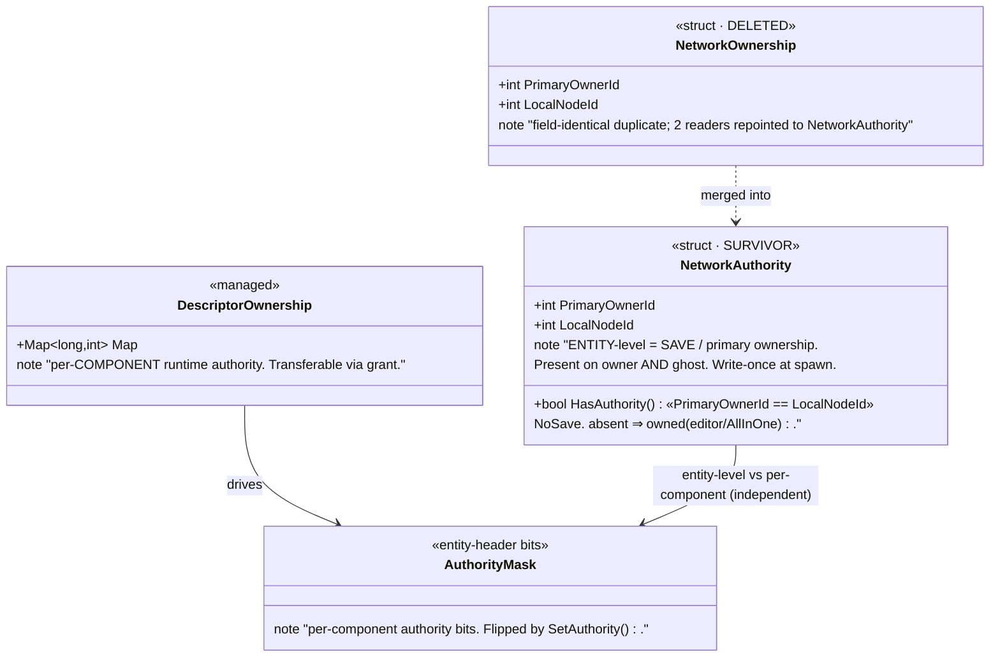
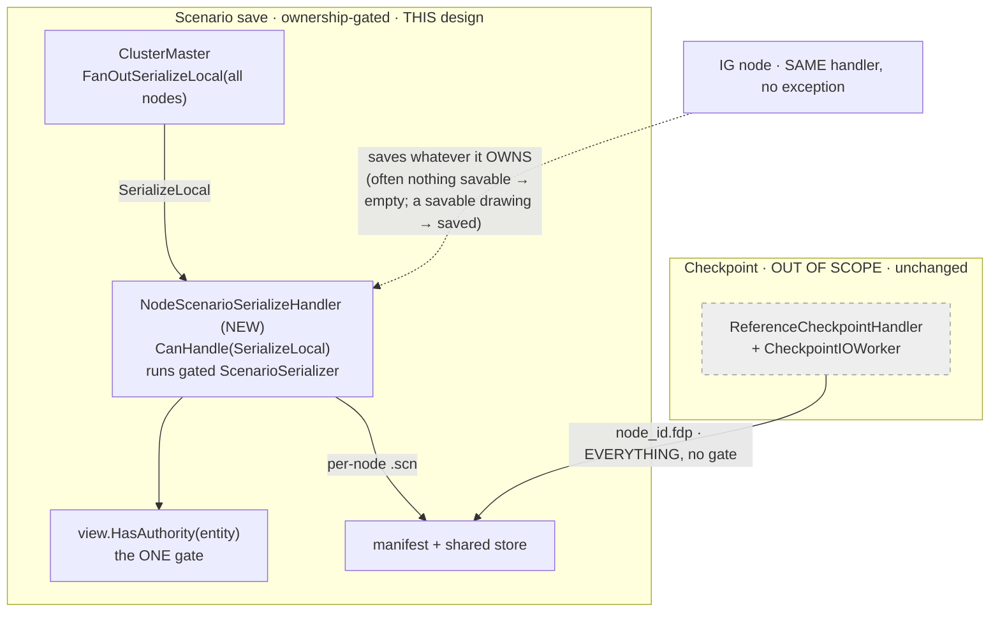
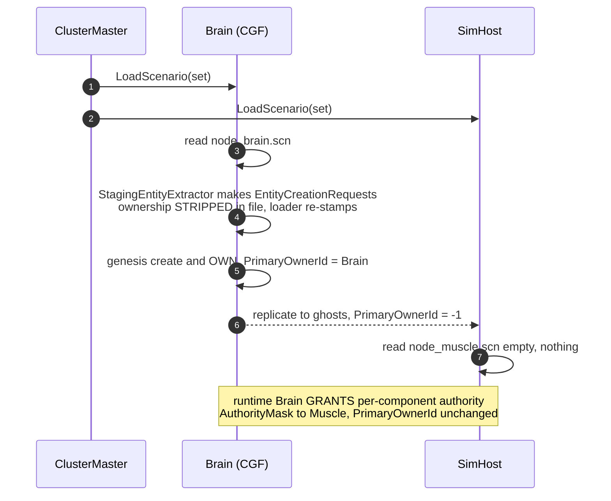

<!--STATUS
state: LIVE
updated: 2026-09-14
build-state: READY-TO-BUILD
current-answer: §4 save flow, §5 load flow (R-A, ruled §8.1), §6 the ONE gate (view.HasAuthority),
  §6a globals (brain-owned), §6b format recognition ($meta.docType graceful-skip), §7 the
  NetworkAuthority/NetworkOwnership merge, §1a paradigm correction (passivity is emergent, no IG
  special case). ⭐ ALL blockers closed `2026-09-14` (OQ1/OQ2/OQ3/OQ4/OQ5/OQ9/OQ10/OQ11); OQ9 corrected —
  the editor is ALREADY a single-node cluster (has ClusterMaster/StorageGateway/ClusterSlave). Remaining
  are minor: OQ6 (nod), OQ7 (verify parts, build step 1), OQ8 (rail). ⇒ BUILDABLE; awaiting go-ahead.
stale-below: nothing yet (new document).
known-rot: nothing known.
known-conflict: DESIGN_Node_Roles_And_Policies.md §7.1 says IG-persistence is enforced "by an
  ABSENCE" (IG registers no save handler). ⭐ THIS design supersedes that enforcement with a
  UNIFORM per-entity GATE (§6): every host runs the same gated save; IG's file is empty by the
  gate, not by a missing handler. §7.1's ABSENCE becomes belt-and-suspenders, not the mechanism.
superseded-by: —
design-basis:
  - docs/DESIGN_Node_Roles_And_Policies.md §4 (ownership axes), §5 (persistence policy R-140),
    §7.2/§7.3 (the ungated save, measured), §8 ① (the parked save question)
  - docs/designs/cgf-scn-2/DESIGN.md (scenario serialization correctness; DataPolicy.NoSave)
  - docs/designs/cgf-scn/DESIGN.md (CGF as authoritative genesis source on LOAD)
  - docs/DESIGN_Entity_Creation_Unification.md (the shared creation pipeline; §3.4b level mismatch)
  - docs/UX/UX_Feature_Authority_Aware_Writes.md §335/§342/§343 (the NetworkAuthority/NetworkOwnership
    duplication named as debt; "pick NetworkAuthority"; absent-component = owned)
  - docs/blueprints/RULINGS.md R-138 (fully distributed), R-140 (IG passive/non-persisting)
related-designs:
  - DESIGN_Node_Roles_And_Policies.md — owns the ROLE/ownership POLICY (who may own what, R-138/R-140);
    THIS doc owns the SAVE/LOAD MECHANISM that enforces it and the ownership-component unification.
  - docs/designs/cgf-scn-2/DESIGN.md — owns per-COMPONENT-TYPE save correctness (which components are
    NoSave, serializer truncation); THIS doc owns per-ENTITY save selection (which entities each node saves).
  - docs/designs/cgf-scn/DESIGN.md — owns the LOAD genesis pipeline (scenario JSON → creation requests);
    THIS doc owns which FILE(S) each node loads and re-ownership at load.
  - DESIGN_Entity_Creation_Unification.md — owns the CREATION pipeline whose OwnerNodeId stamps the
    save-ownership THIS doc gates on.
-->

# ⭐⭐⭐ Unified Distributed Scenario Persistence & the Single Ownership Component

> **Two decisions, one document.**
> **① Scenario SAVE and LOAD are ONE cluster-orchestrated, ownership-gated operation** — the editor
> is just the degenerate single-node (all-in-one, brain-perspective) case, not a separate path.
> **② `NetworkOwnership` is merged into `NetworkAuthority`** — one component, one responsibility:
> *entity-level primary / save ownership*. Per-**component** runtime authority stays a separate axis.
> **⛔ Checkpoints are OUT OF SCOPE** — they save/load *everything* on *every* host regardless of
> ownership, by design; nothing here changes them.

📌 **Why this document exists.** The save path has **no ownership gate** — `CollectSaveableEntities`
filters only `ScenarioIgnoreTag` (measured, `DESIGN_Node_Roles §7.3 ④`). That is harmless with ONE
saver (the editor owns everything) and **wrong** the moment two nodes save: each writes its ghosts too.
And two field-identical ownership components (`NetworkAuthority`, `NetworkOwnership`) encode one concept,
named "debt" in `UX_Feature_Authority_Aware_Writes.md` but never merged.

---

## 1. ⭐⭐ THE MODEL IN ONE PARAGRAPH

Every host runs the **same** gated save with **no role exceptions**. A host writes to its **own**
per-node scenario file **exactly the non-transient entities it is the entity-level primary owner of**
(`view.HasAuthority(entity)`), whatever its role — a host owns an entity because it *created* it, and a
host creates entities because of the roles it was assigned, **not** because it is "a brain" or "passive".
⛔ There is **no** "IG never persists" special case: if any host owns a savable (non-transient) entity —
e.g. the editor's or an IG's 2D-map role authored a persistable tactical drawing — that host saves it,
full stop (see §1a). A host that happens to own nothing savable writes an empty file — harmless. The
**editor** is the degenerate single node that hosts **all** roles, so it owns everything and writes the
whole scenario as **one** file; that file equals a brain-role file **only circumstantially** — because
the other roles usually own little that is savable, not by definition. **One rule — save an entity iff
you are its non-transient primary owner — makes the editor, the brain, the IG and every future partition
fall out of the same code.** ⚠ **The multi-file ↔ single-file LOAD round-trip is NOT yet fully resolved —
see §8 OQ11, the central open question.**

### 1a. ⭐⭐⭐ PARADIGM CORRECTION `2026-09-14` — passivity is EMERGENT, not designed

> 🔒 **User, verbatim:** *"'IG is passive, non-persisting' — this is the old paradigm. Hosts are not
> passive by design; passivity results from whether they create their own entities, which comes from the
> roles they are assigned. Any single host can create entities (thus be their primary owner) so if that
> happens and the entity is savable to scenario (non transient) also the IG must save it to the scenario,
> no exceptions, no differences, unified rules and implementation."*

⛔ This **refines `R-140`** (`DESIGN_Node_Roles §5`, "IG is passive and non-persisting"): R-140's
*behaviour* still usually holds — an IG typically owns only transient entities — but as an **emergent
consequence of its role assignment, NOT a hard rule the save path enforces.** ⇒ the save path is
**uniform**; the only gate is ownership + transience. `DESIGN_Node_Roles §5/§7` must be updated to say
"passivity is emergent" rather than "IG may not persist" (recorded as a follow-up there).

---

## 2. 🔴 INVENTORY — measured 2026-09-14 (grep + code read; codebase-memory MCP flaky this session)

> ⚠ codebase-memory MCP dropped mid-session; the enumerations below are grep/`find.sh` + direct reads.
> Re-verify the exhaustive claims (reader counts) with `search_graph` when the graph is back.

| # | thing | measured |
|---|---|---|
| ① | the save gate | `ScenarioSerializer.CollectSaveableEntities` (`Fdp.Toolkits/Scenario/ScenarioSerializer.cs:523-541`) skips **only** `ScenarioIgnoreTag`; no ownership/ghost filter |
| ② | the entity-JSON writer | `ScenarioFileService.SaveScenario` → `ScenarioSerializer.Serialize` (`Hrot.Presentation/.../ScenarioFileService.cs:114-120`); built by the **editor** (`EditorSubsystem:1314`) AND **CGF** (`CgfSubsystem:1058`, over CGF's own world via `EditorScenarioSession`) |
| ③ | the distributed cluster save today | `ClusterMaster.SaveScenario` → `FanOutSerializeLocal(all active nodes)` (`ClusterMaster.cs:983-987`) → each node's `SerializeLocal` handler is **`ReferenceArchiveHandler`**, which only **reports** an existing per-node `node_{id}.fdp` — ⛔ **it does NOT run the scenario-JSON serializer.** ⇒ there is **no per-node gated scenario-JSON writer today**; the fan-out collects **checkpoint recordings** |
| ④ | the save-ownership helper (already exists) | `AuthorityExtensions.HasAuthority(view, entity)` (`Fdp.Toolkits/Replication/Extensions/AuthorityExtensions.cs:9`): resolves part→parent, skips the per-descriptor override at key 0, returns `NetworkAuthority.HasAuthority`; **absent component ⇒ true (owned)** (`:33-40`) |
| ⑤ | the two ownership structs | `NetworkAuthority` (`.../Components/NetworkAuthority.cs`) and `NetworkOwnership` (`.../Components/NetworkComponents.cs:20`) are **field-identical** `{PrimaryOwnerId, LocalNodeId, HasAuthority}`; `NetworkOwnership`'s per-descriptor `Map` was removed (BATCH-07) |
| ⑥ | `PrimaryOwnerId` writers | **write-once at spawn only**: `NetworkSpawningSystem.cs:160/163` (owner), `EntityMasterIngressTranslator.cs:149` (ghost = `-1`). **No reassignment anywhere** — transfers write the *separate* `AuthorityMask` (`OwnershipIngressSystem.cs:67-80`) |
| ⑦ | `NetworkAuthority` readers | **~57** production sites via `.HasAuthority`; present on owner AND ghost |
| ⑧ | `NetworkOwnership` readers | **2** production sites — `CycloneNetworkCleanupSystem.cs:47/52` (query then `if(!HasAuthority) continue`) and `OwnershipExtensions.OwnsDescriptor*` (absent ⇒ false) |
| ⑨ | LOAD authority | `CgfScenarioLoadHandler` / `CgfEpisodeLoadHandler` call `StagingEntityExtractor.Extract(serializer, json, idAllocator)` → `EntityCreationRequest[]` → genesis pipeline; the extractor **strips** `NetworkAuthority`/`NetworkOwnership`/`NetworkIdentity` (`HROT-Engine-Guide §166`, `StagingEntityExtractor:52/56`) |
| ⑩ | global scenario data | `ScenarioFileService` also writes a **`Zones`** section from `IZoneManagerService` (`:122-125`). ⛔ **CGF composes NO zone service** (`CgfSubsystem:1053`, `zoneService: null`) — zones are **editor-only** today |
| ⑪ | IG persistence enforcement | IG registers **no** save handler (`DESIGN_Node_Roles §7.1`); SimHost/CGF/ExCon **do** register `ReferenceArchiveHandler` |

---

## 3. ⭐⭐⭐ THE OWNERSHIP MODEL — one component per axis

> **Diagram first.** The class diagram is the design; the prose says only *why*.



*Caption — what the picture shows that prose hid:* there are **two independent axes**, not one.
`NetworkAuthority.PrimaryOwnerId` (entity, stable, = who saves) and `DescriptorOwnership`/`AuthorityMask`
(per-component, transferable, = who simulates this frame). The Muscle taking `SimTransform` authority
flips an `AuthorityMask` bit and **never touches `PrimaryOwnerId`** — so a per-entity save gate is immune
to runtime authority moves. `NetworkOwnership` was a redundant copy of the *entity* axis and is deleted.

| axis | component (after merge) | mutated by | answers |
|---|---|---|---|
| **entity / save ownership** | `NetworkAuthority` | set once at spawn | *do I save this entity? do I own its lifecycle?* |
| **per-component runtime authority** | `DescriptorOwnership` + `AuthorityMask` | grant / auto-takeover | *do I simulate this component this frame?* |

---

## 4. ⭐⭐⭐ SAVE — the unified, ownership-gated, cluster-orchestrated flow


*Caption:* the fan-out already exists (`ClusterMaster.FanOutSerializeLocal`, INVENTORY ③); **what is new
is the per-node handler that RUNS the gated `ScenarioSerializer` instead of only reporting a checkpoint
recording.** Every host runs identical code; **content differs only by what each host owns.** The editor
collapses this to one node that owns everything ⇒ one non-empty file.

### Module / registration view — who runs the save, and the ONE dead edge



*Caption — what the picture shows that prose hid:* the checkpoint lane (grey) is a **separate** mechanism
that ignores ownership; do not fold it in. ⭐ **Every host — IG included — runs the identical handler with
no role branch**; the content of each file is purely *what that host owns*. This retires
`Node_Roles §7.1`'s "enforce by a missing IG handler": there is no missing handler and no IG special case
(§1a). An IG file is empty *when* the IG owns nothing savable, not *because* it is an IG.

---

## 5. ⭐⭐ LOAD — per-node file, brain canonical  ✅ R-A (ruled §8.1)



*Caption:* load re-establishes save-ownership on the loading (brain) node because the file **strips**
ownership (INVENTORY ⑨) and the genesis pipeline stamps `OwnerNodeId = loader`. A muscle's empty file is
correct — it receives entities by **replication**, and per-component authority arrives later by **grant**,
never changing `PrimaryOwnerId`. This is why the round-trip is stable: *save-owner in = save-owner out*.

---

## 6. ⭐⭐⭐ THE ONE GATE

```
save/keep entity  ⇔  view.HasAuthority(entity)  AND  NOT ScenarioIgnoreTag(entity)
```

- `HasAuthority(entity)` (INVENTORY ④) = entity-level primary ownership, **absent ⇒ owned**.
- **Editor / AllInOne** ⇒ owns everything ⇒ saves everything. No mode flag; the gate is always on.
- **Ghost** ⇒ `HasAuthority` false ⇒ skipped ⇒ no duplication across per-node files.
- `ScenarioIgnoreTag` still gates **my own transient** entities (a sketch I own but must not persist).
  The ownership gate makes the *ghost* ScenarioIgnoreTag case redundant, but the *own-transient* case
  keeps it necessary — both remain.

⚠ **Placement:** the gate goes in `CollectSaveableEntities` (one site, both editor and cluster inherit
it). `HasAuthority` lives in `Fdp.Toolkits`, same assembly as `ScenarioSerializer` ⇒ no new dependency.

### 6a. ⭐⭐ GLOBAL / NON-ENTITY DATA — the complete set, owned by the brain file *(ruling `2026-09-14`)*

📐 **Measured — a scenario carries exactly this much that is NOT a per-entity component:**

| datum | where it lives today | owner under this design |
|---|---|---|
| `$meta` (`docType`, `schemaVersion`) | DOM envelope (`ScenarioSerializer.Serialize:200`) | **brain file** |
| `Header.TkbName` (active TKB database) | DOM `Header` (`:198-199`) | **brain file** |
| `Zones` (tactical zones) | DOM `Zones`, from `IZoneManagerService` (`ScenarioFileService:124`) — ⛔ **editor-only today**; CGF passes `zoneService: null` | ⭐⭐ **brain** *(user ruling: "zones should for sure be handled by brain")* ⇒ the brain node must compose a real `IZoneManagerService` |
| scenario **sim-time** | already **cluster/manifest** level (`GlobalContextClusterOpHandler.ScenarioTimeSeconds`), **not** in any per-node DOM | **orchestrator context** — already global, no change |

⭐ **The rule:** all per-node-DOM globals ride the **brain-role file** (the canonical scenario), because
the brain is the node that owns the scenario as a whole. ⛔ **The one build consequence:** the brain node
(CGF) must gain a real `IZoneManagerService` — today only the editor has one, so a headless-CGF save would
drop zones. Sim-time needs nothing — it is already orchestrator-owned.

### 6b. ⭐⭐ FORMAT RECOGNITION — a host loads only files it understands *(ruling `2026-09-14`)*

> 🔒 **User:** *"There is still a case the host uses incompatible scenario format (host being external
> software, interacting with others on orchestration network level only); in such a case that host
> requires its own editor that maintains that host-specific scenario file; meaning our current scenario
> editor capabilities must recognize the scenario file format and load just those compatible ones."*

⭐⭐ **The mechanism already exists.** Every scenario file stamps a format tag — `$meta.docType` (legacy:
`Header.SubsystemType`) — and `ScenarioSerializer.Deserialize` **gracefully skips** a file whose tag does
not match the loader's `_subsystemType` (`ScenarioSerializer.cs:327-343`, `return;` — no entities created).

| ⭐ the rule | |
|---|---|
| a host loads **only** the partial files whose **format tag it recognises** | ⇒ an external host that speaks a **different scenario format** keeps its OWN file, maintained by **its own editor**, and interacts with the cluster only at the **orchestration-network** level |
| our editor/CGF **skips** a foreign-format file silently | ✅ this is today's `Deserialize` behaviour — no new mechanism, just make it explicit in the load rule |
| ⚠ within R-A, "compatible" partials all funnel into the loading brain | ⛔ incompatible ones do **not** — they are that host's responsibility, the one place "different hosts save/load their own content" still literally holds |

⇒ ⭐ **R-A unifies the SAME-format hosts; the format tag is the boundary** past which a host is on its own.

---

## 7. ⭐⭐ THE MERGE — delete `NetworkOwnership`, keep `NetworkAuthority`

**Safe** (INVENTORY ⑤⑥⑦⑧; `UX_Authority_Aware_Writes §342` already elects `NetworkAuthority`). Both
readers repoint with identical behaviour: the cleanup query gains ghost matches but already drops them
via `if(!HasAuthority) continue`; `OwnsDescriptor`'s `absent⇒false` becomes `ghost(-1)⇒false`.

| step | site |
|---|---|
| delete struct + `[ComponentId(140)]` + `[DataPolicy(NoSave)]` | `NetworkComponents.cs:14-31` |
| drop owner-side write; keep the `NetworkAuthority` add | `NetworkSpawningSystem.cs:158-163` |
| repoint 2 readers → `NetworkAuthority` | `CycloneNetworkCleanupSystem.cs:47/52`, `OwnershipExtensions.cs:36/38/69/71` |
| drop from the static save mask (NetworkAuthority already masked) | `StagingEntityExtractor.cs:56` |
| drop registration | `HrotSharedComponentRegistry.cs:41` (+ example `DistributedTankScenario.cs:320`) |
| add `[DataPolicy(NoSave)]` to `NetworkAuthority` | so save-exclusion no longer relies only on the static mask |
| doc/comment fixes | `DebugApiRouteDocs.cs:713`, `GroundKinematicsModule.cs:34`, dds-to-ecs/mgmt docs |

⚠ **Roslyn only** (never text-replace a C# symbol); grep sweep afterward for `HrotStrideApp.Windows`
(out-of-solution). Frees component id `140`. ⭐ Keep the **name** `NetworkAuthority` (renaming ~57 sites
buys only cosmetics — optional later follow-up).

---

## 8. ⛔⛔⛔ OPEN QUESTIONS & FLAWS — **the design is NOT buildable until these are closed**

| # | question / flaw | severity | lean |
|---|---|---|---|
| **OQ1** | ✅ **DECIDED `2026-09-14`** — global data (the complete set: `$meta`, `Header.TkbName`, `Zones`; sim-time is already orchestrator-owned — §6a) rides the **brain-role file**. 🔒 User: *"zones should for sure be handled by brain."* ⛔ **Build consequence:** the brain node (CGF) must compose a real `IZoneManagerService` — today only the editor has one (INVENTORY ⑩). | ✅ closed | brain owns all per-node-DOM globals; give CGF a zone service. |
| **OQ2** | ✅ **DECIDED `2026-09-14`** — **crash of the primary owner = the entity dies with it; no resolution; silent loss ACCEPTED.** 🔒 User: *"crash of primary owner means the entity dies with it, it has no resolution, silent loss accepted (no idea how to make brain nodes more stable than others)."* ⇒ **no** "reclaim orphan" rule, **no** brain-stability assumption. | ✅ closed | none — accepted risk, documented. |
| **OQ3** | ✅ **DECIDED `2026-09-14`** — a distributed scenario is a **set** of per-node files; **reuse the existing cluster-wide collection** (`FileManifestResult`/NAS-pull is file-agnostic — INVENTORY ③), **brain file is canonical "the scenario"**, each node loads its own slice. 🔒 User: *"nothing new… the design as well as implementation is counting with that already."* | ✅ closed | verify at build that the collection path is truly format-agnostic (it pulls whatever file the handler reports — it is). |
| **OQ4** | ✅ **CLOSED via R-A (§8.1)** — editor file ≡ the loaded union; old single-file scenarios load unchanged; distributed set loads with the brain file canonical. | ✅ closed | — |
| **OQ11** | ✅ **RESOLVED `2026-09-14` = R-A (§8.1).** Loading brain owns all persistable at load; multi-file reconverges; per-node/role ownership preservation (R-B) deferred as a future feature. Plus §6b format recognition. | ✅ closed | R-A accepted in full. |
| **OQ5** | ✅ **APPROVED `2026-09-14`** — add a per-node scenario-serialize handler that runs the gated `ScenarioSerializer` over the node's world, wired into `FanOutSerializeLocal`, distinct from the checkpoint recorder; reuse the archive/NAS collection. ⚠ Runs on **every** host including the editor (see OQ9). | ✅ core build | new handler, no editor exception. |
| **OQ6** | **No entity-level ownership TRANSFER exists** (INVENTORY ⑥). Persistence ownership is fixed at creation. Cross-node persistence (IG authors, CGF must persist) requires **request-to-owner** (`Node_Roles §5/§6`), not a handover. | 🟢 boundary | keep request-to-owner; do NOT add entity-ownership transfer now. Revisit only if a real need appears. |
| **OQ7** | **Parent/child parts under the gate.** `HasAuthority` resolves child→parent, so a multi-part entity gates as a unit — but verify the **save side** (`ScenarioSerializer.Serialize`) emits parent+children coherently when the gate is applied per-entity. | 🟠 verify | almost certainly fine (children ride the parent), but must be measured before build. |
| **OQ8** | **Editor "saves everything" is by construction but unproven.** Editor localNodeId / `HasAuthority=true` for editor scenario entities not directly measured this session. | 🟢 rail | airtight by construction (single node has no ghosts); add a rail asserting the editor saves the full set. |
| **OQ9** | ✅ **DECIDED `2026-09-14` — NO editor exception; unified BY CONSTRUCTION.** 🔒 User: *"no direct write in the editor… same code everywhere, driven by role/host config… the plumbing resulting naturally from using the same (unified) code (orchestration handlers etc.)."* ⇒ the editor runs the **same orchestration** as a single-node, all-roles cluster; scenario save goes through the fan-out + per-node handler, never `ScenarioFileService.SaveScenario` directly. ✅ **CORRECTED `2026-09-14` — the editor is ALREADY a single-node cluster.** An earlier draft here claimed the editor "has no orchestrator" and would need one built; that was WRONG — it read the mode roster, not the EditorSubsystem's internals. Measured: `EditorSubsystem` self-hosts `ClusterMaster` (`:318`, `:2074` `new ClusterMaster(_orchestrationBus, offlineConfig)` — "offline single-node orchestrator"), `StorageGatewayModule` (`:323/:2092`), and a `ClusterSlave` (`:1301`) on which it registers cluster handlers (`:1422-1623`), ticked at `:2590`. The config's "no editor + orchestrator" ban (`HrotRunnerConfiguration.cs:181-187`) merely prevents a **second** orchestrator, not a missing one. ⇒ **the real build is small:** the editor's slave registers only LOAD handlers today; save still bypasses the orchestrator via `IEditorLogic.SaveScenarioAs` (`:3864/:3958`). Work = **register the new save handler on every slave (editor included)** + **route the editor save through `_clusterMaster`** instead of the direct call. | 🟢 **small build, plumbing exists** | register the save handler uniformly; reroute the editor save trigger; retire the direct `ScenarioFileService.SaveScenario`. |
| **OQ10** | ✅ **CLOSED via R-A** — CGF/brain owns ALL persistable at load; per-component authority granted at runtime; muscles never own persistable entities. | ✅ closed | R-A. |

⭐⭐ **ALL BLOCKERS CLOSED `2026-09-14`.** OQ1 (globals → brain), OQ2 (orphan loss accepted), OQ3 (reuse
collection, brain canonical), OQ4/OQ10/OQ11 (R-A round-trip), OQ5 (per-node handler), OQ9 (editor is
**already** a single-node cluster — small build), plus §6b format recognition (mechanism exists).
**Remaining before the first commit — all minor:** OQ6 (a one-line nod on the no-transfer boundary),
OQ7 (verify parent/child parts under the gate — build step 1), OQ8 (add the editor-saves-all rail).
⇒ **the design is BUILDABLE.**

### 8.1 ✅ OQ11 — THE ROUND-TRIP: **RESOLVED `2026-09-14` = R-A**

> ✅ **RULING (`2026-09-14`): R-A, accepted in full.** 🔒 User: *"R-A approved and accepted in full. Per
> node/role partial loading might be a future feature when needed… for now we rather unify to same
> consistent approach. IG-authored drawing going through editor load and resaved gets loaded as brain
> owned, this is fine (this only happens for persistable entities)."*
> ⇒ ⭐ **the loading brain (editor: the editor) owns all persistable at load**; per-component authority is
> granted at runtime; the multi-file save reconverges on load. **R-B (ownership preserved by role) is a
> FUTURE feature, not now.** §5 is therefore no longer provisional. ⭐ **New rider — format recognition —
> see §6b:** a host with an *incompatible* scenario format keeps its own file via its own editor; ours
> loads only files it recognises. The original question and the R-A/R-B comparison are kept below as the
> rationale.

> 🔒 **User, verbatim (the question that produced R-A):** *"The distributed saving on CGF and IG nodes when both produce their own partial
> save file for their owned entities is not yet resolved — how to load these into editor? load all in
> sequence, likely, or integrating the IG saved stuff into the 'master' scenario file, and when saving the
> scenario loaded this way from editor, the tactical drawings natively become saved to the single editor
> saved scenario file. This needs some thinking, i feel it is still incomplete and needs clearer rules."*

**The asymmetry that must be ruled on.** SAVE splits by owner → N partial files. The EDITOR is one world
that owns everything. So a load must funnel N partials into that one world — and the question is **what
owns each entity after a load**, which decides whether an IG-authored drawing stays IG-owned or becomes
brain/editor-owned across a round-trip.

| | ⭐ **R-A — re-converge on load** *(lean)* | **R-B — preserve ownership by role** |
|---|---|---|
| who owns a loaded entity | the **loading brain** (editor: the editor; distributed: CGF) owns **all** persistable; per-component authority granted to muscles at runtime | each entity is re-owned by **the host whose ROLE owns it** — the drawing reloads IG-owned, the tank brain-owned |
| load of N partials | **load all partials in sequence** into the loader's world (or merge into one master first) — the editor and CGF both just ingest the union | each node loads **only the partials for the roles it hosts**; the editor hosts all roles ⇒ loads all |
| editor round-trip | ✅ natural — editor owns all ⇒ re-saves as one file; a drawing "natively" lands in the single editor file | ⚠ editor still collapses to one owner (it IS all roles), so a re-save loses the per-role split unless it re-derives roles per entity |
| matches current code | ✅ **yes** — CGF genesis owns all at load today (INVENTORY ⑨) | ⛔ **no** — needs role-driven per-entity ownership at load; a substantial load-pipeline change |
| cost of the model | cheap; the multi-file save is a save-time distribution detail that reconverges on load | the "truly distributed, each host loads its own content" ideal, but a real redesign of the genesis pipeline |
| what it loses | **entity-level authorship is not preserved** across a round-trip (IG drawing → brain-owned after reload) | nothing — authorship survives, at the cost of complexity |

⭐ **My lean: R-A** — it matches the editor (which is unavoidably one owner), matches today's brain-centric
genesis, and makes "load all partials in sequence" + "editor re-saves the union as one file" fall out
exactly as you described. ⛔ **The cost is explicit and must be accepted:** a drawing authored+owned on an
IG, once it passes through an editor save, reloads **brain-owned**, not IG-owned. In a purely distributed
run (no editor in the loop) R-A still means the **loading brain owns everything** — a non-brain partial
file is only produced by **runtime** authorship (e.g. an IG draws live), and on the next load that content
folds into brain ownership too.

⚠ **What would push to R-B:** a requirement that a host **reload and re-own its own authored content**
without a central brain — i.e. each host is truly responsible for loading its slice and owning it. Your
earlier "different hosts are responsible for loading their content" leans this way; R-A contradicts it for
the *ownership* half while honouring it for the *file* half. **This is the tension to rule on.**

**Sub-questions inside OQ11, once R-A vs R-B is chosen:**
1. **Load mechanism** — load partials *in sequence* into one world, or *merge* them into a master file
   first? (R-A works with either; sequence is simpler and needs no merge step.)
2. **Is there a persistent "master" file** distinct from the per-role partials, or is "the scenario" always
   just the manifest-linked set with the brain file as its head?
3. **Editor re-save shape** — always one file (R-A), or re-split per role on save (only meaningful under R-B)?

⇒ 🔴 **Until OQ11 is ruled, the LOAD half of §5 is provisional** — §5's diagram currently assumes R-A
(brain owns all, muscles get ghosts). If you choose R-B, §5 and the genesis pipeline change materially.

---

## 9. ⭐ RELATIONSHIP TO EXISTING DESIGNS (supersessions are marked in those files)

| document | what changes |
|---|---|
| `DESIGN_Node_Roles_And_Policies.md` §5, §7.1/§7.2/§7.3, §8 ① | §7.2 "ownership is DISCARDED at save time (the good half)" is **superseded for distributed save** — ownership IS now consulted (§6). §7.1's "enforce by a missing IG handler" is retired — there is no IG special case (§1a). ⭐ **§5's R-140 "IG is passive and non-persisting" is REFINED (§1a): passivity is EMERGENT from role-driven creation, not a save-path rule** — needs a follow-up edit in that file. §8 ① (the parked question) is **answered here**. |
| `docs/designs/cgf-scn-2/DESIGN.md` | unchanged in scope (per-component-TYPE correctness); gains a pointer — per-ENTITY selection lives HERE. |
| `docs/designs/cgf-scn/DESIGN.md` | unchanged (LOAD genesis); gains a pointer — which FILE each node loads lives HERE. |
| `docs/UX/UX_Feature_Authority_Aware_Writes.md` §335/§342 | the "do not merge them here" debt is **scheduled here**; §7 is the merge. |
| `docs/DESIGN_Entity_Creation_Unification.md` | unchanged; the `OwnerNodeId` it stamps IS the save-ownership this doc gates on. |
