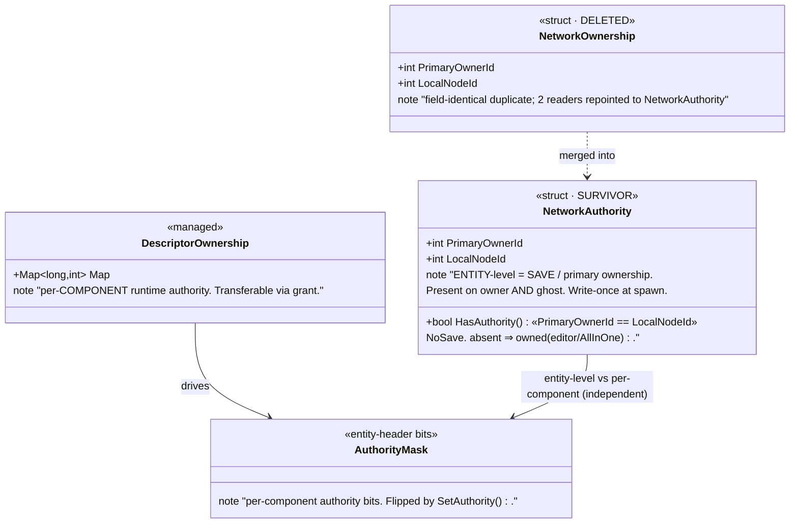
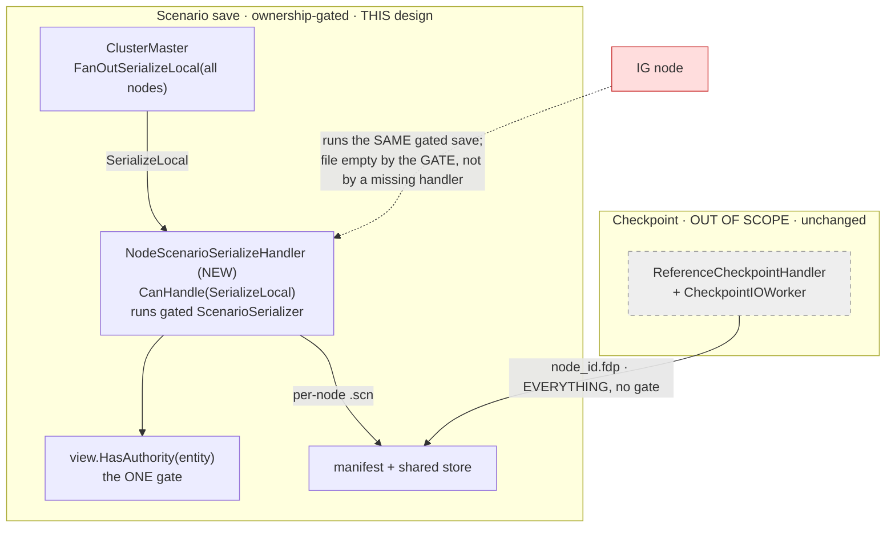
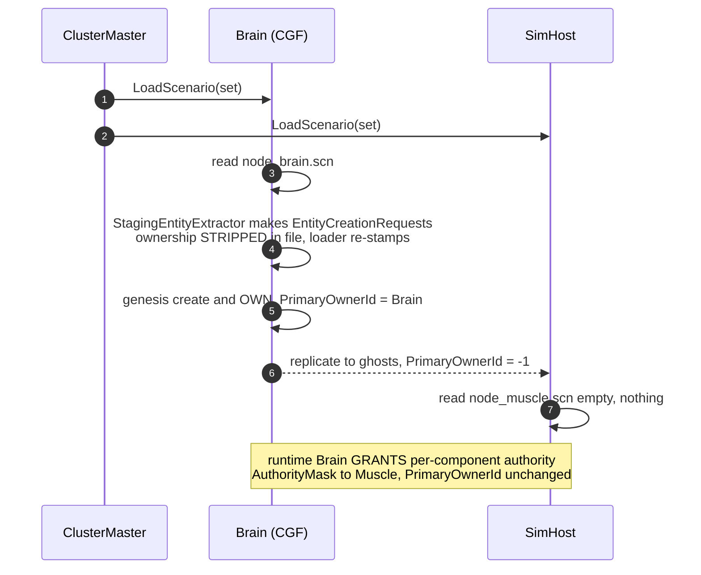

<!--STATUS
state: LIVE
updated: 2026-09-14
build-state: DESIGN
current-answer: §4 is the unified save flow, §5 the load flow, §6 the ONE gate
  (view.HasAuthority(entity)), §7 the NetworkAuthority/NetworkOwnership merge, §8 the OPEN
  QUESTIONS that MUST be closed before build. ⛔ Nothing here is READY-TO-BUILD yet — §8 has
  load-bearing open questions (global/zone data ownership OQ1, multi-file manifest OQ3).
stale-below: nothing yet (new document).
known-rot: nothing known.
known-conflict: DESIGN_Node_Roles_And_Policies.md §7.1 says IG-persistence is enforced "by an
  ABSENCE" (IG registers no save handler). ⭐ THIS design supersedes that enforcement with a
  UNIFORM per-entity GATE (§6): every host runs the same gated save; IG's file is empty by the
  gate, not by a missing handler. §7.1's ABSENCE becomes belt-and-suspenders, not the mechanism.
superseded-by: —
design-basis:
  - docs/DESIGN_Node_Roles_And_Policies.md §4 (ownership axes), §5 (persistence policy R-140),
    §7.2/§7.3 (the ungated save, measured), §8 ① (the parked save question)
  - docs/designs/cgf-scn-2/DESIGN.md (scenario serialization correctness; DataPolicy.NoSave)
  - docs/designs/cgf-scn/DESIGN.md (CGF as authoritative genesis source on LOAD)
  - docs/DESIGN_Entity_Creation_Unification.md (the shared creation pipeline; §3.4b level mismatch)
  - docs/UX/UX_Feature_Authority_Aware_Writes.md §335/§342/§343 (the NetworkAuthority/NetworkOwnership
    duplication named as debt; "pick NetworkAuthority"; absent-component = owned)
  - docs/blueprints/RULINGS.md R-138 (fully distributed), R-140 (IG passive/non-persisting)
related-designs:
  - DESIGN_Node_Roles_And_Policies.md — owns the ROLE/ownership POLICY (who may own what, R-138/R-140);
    THIS doc owns the SAVE/LOAD MECHANISM that enforces it and the ownership-component unification.
  - docs/designs/cgf-scn-2/DESIGN.md — owns per-COMPONENT-TYPE save correctness (which components are
    NoSave, serializer truncation); THIS doc owns per-ENTITY save selection (which entities each node saves).
  - docs/designs/cgf-scn/DESIGN.md — owns the LOAD genesis pipeline (scenario JSON → creation requests);
    THIS doc owns which FILE(S) each node loads and re-ownership at load.
  - DESIGN_Entity_Creation_Unification.md — owns the CREATION pipeline whose OwnerNodeId stamps the
    save-ownership THIS doc gates on.
-->

# ⭐⭐⭐ Unified Distributed Scenario Persistence & the Single Ownership Component

> **Two decisions, one document.**
> **① Scenario SAVE and LOAD are ONE cluster-orchestrated, ownership-gated operation** — the editor
> is just the degenerate single-node (all-in-one, brain-perspective) case, not a separate path.
> **② `NetworkOwnership` is merged into `NetworkAuthority`** — one component, one responsibility:
> *entity-level primary / save ownership*. Per-**component** runtime authority stays a separate axis.
> **⛔ Checkpoints are OUT OF SCOPE** — they save/load *everything* on *every* host regardless of
> ownership, by design; nothing here changes them.

📌 **Why this document exists.** The save path has **no ownership gate** — `CollectSaveableEntities`
filters only `ScenarioIgnoreTag` (measured, `DESIGN_Node_Roles §7.3 ④`). That is harmless with ONE
saver (the editor owns everything) and **wrong** the moment two nodes save: each writes its ghosts too.
And two field-identical ownership components (`NetworkAuthority`, `NetworkOwnership`) encode one concept,
named "debt" in `UX_Feature_Authority_Aware_Writes.md` but never merged.

---

## 1. ⭐⭐ THE MODEL IN ONE PARAGRAPH

Every host runs the **same** gated save. A host writes to its **own** per-node scenario file **only the
entities it is the entity-level primary owner of** (`view.HasAuthority(entity)`); a host that owns
nothing writes an empty file — harmless. The **editor** is a single-node cluster that owns everything
(absent authority ⇒ owned), so it writes the whole scenario as **one** file — the **brain-role file**,
consumed by the brain node (CGF) in a distributed run. **Load** is the mirror: each node loads its own
file; the brain file is canonical and CGF distributes its entities through the genesis pipeline, owning
them and replicating ghosts to the muscles (whose own files are empty). **One rule — save/keep an entity
iff you are its primary owner — makes the editor, the brain and every future partition fall out of the
same code.**

---

## 2. 🔴 INVENTORY — measured 2026-09-14 (grep + code read; codebase-memory MCP flaky this session)

> ⚠ codebase-memory MCP dropped mid-session; the enumerations below are grep/`find.sh` + direct reads.
> Re-verify the exhaustive claims (reader counts) with `search_graph` when the graph is back.

| # | thing | measured |
|---|---|---|
| ① | the save gate | `ScenarioSerializer.CollectSaveableEntities` (`Fdp.Toolkits/Scenario/ScenarioSerializer.cs:523-541`) skips **only** `ScenarioIgnoreTag`; no ownership/ghost filter |
| ② | the entity-JSON writer | `ScenarioFileService.SaveScenario` → `ScenarioSerializer.Serialize` (`Hrot.Presentation/.../ScenarioFileService.cs:114-120`); built by the **editor** (`EditorSubsystem:1314`) AND **CGF** (`CgfSubsystem:1058`, over CGF's own world via `EditorScenarioSession`) |
| ③ | the distributed cluster save today | `ClusterMaster.SaveScenario` → `FanOutSerializeLocal(all active nodes)` (`ClusterMaster.cs:983-987`) → each node's `SerializeLocal` handler is **`ReferenceArchiveHandler`**, which only **reports** an existing per-node `node_{id}.fdp` — ⛔ **it does NOT run the scenario-JSON serializer.** ⇒ there is **no per-node gated scenario-JSON writer today**; the fan-out collects **checkpoint recordings** |
| ④ | the save-ownership helper (already exists) | `AuthorityExtensions.HasAuthority(view, entity)` (`Fdp.Toolkits/Replication/Extensions/AuthorityExtensions.cs:9`): resolves part→parent, skips the per-descriptor override at key 0, returns `NetworkAuthority.HasAuthority`; **absent component ⇒ true (owned)** (`:33-40`) |
| ⑤ | the two ownership structs | `NetworkAuthority` (`.../Components/NetworkAuthority.cs`) and `NetworkOwnership` (`.../Components/NetworkComponents.cs:20`) are **field-identical** `{PrimaryOwnerId, LocalNodeId, HasAuthority}`; `NetworkOwnership`'s per-descriptor `Map` was removed (BATCH-07) |
| ⑥ | `PrimaryOwnerId` writers | **write-once at spawn only**: `NetworkSpawningSystem.cs:160/163` (owner), `EntityMasterIngressTranslator.cs:149` (ghost = `-1`). **No reassignment anywhere** — transfers write the *separate* `AuthorityMask` (`OwnershipIngressSystem.cs:67-80`) |
| ⑦ | `NetworkAuthority` readers | **~57** production sites via `.HasAuthority`; present on owner AND ghost |
| ⑧ | `NetworkOwnership` readers | **2** production sites — `CycloneNetworkCleanupSystem.cs:47/52` (query then `if(!HasAuthority) continue`) and `OwnershipExtensions.OwnsDescriptor*` (absent ⇒ false) |
| ⑨ | LOAD authority | `CgfScenarioLoadHandler` / `CgfEpisodeLoadHandler` call `StagingEntityExtractor.Extract(serializer, json, idAllocator)` → `EntityCreationRequest[]` → genesis pipeline; the extractor **strips** `NetworkAuthority`/`NetworkOwnership`/`NetworkIdentity` (`HROT-Engine-Guide §166`, `StagingEntityExtractor:52/56`) |
| ⑩ | global scenario data | `ScenarioFileService` also writes a **`Zones`** section from `IZoneManagerService` (`:122-125`). ⛔ **CGF composes NO zone service** (`CgfSubsystem:1053`, `zoneService: null`) — zones are **editor-only** today |
| ⑪ | IG persistence enforcement | IG registers **no** save handler (`DESIGN_Node_Roles §7.1`); SimHost/CGF/ExCon **do** register `ReferenceArchiveHandler` |

---

## 3. ⭐⭐⭐ THE OWNERSHIP MODEL — one component per axis

> **Diagram first.** The class diagram is the design; the prose says only *why*.



*Caption — what the picture shows that prose hid:* there are **two independent axes**, not one.
`NetworkAuthority.PrimaryOwnerId` (entity, stable, = who saves) and `DescriptorOwnership`/`AuthorityMask`
(per-component, transferable, = who simulates this frame). The Muscle taking `SimTransform` authority
flips an `AuthorityMask` bit and **never touches `PrimaryOwnerId`** — so a per-entity save gate is immune
to runtime authority moves. `NetworkOwnership` was a redundant copy of the *entity* axis and is deleted.

| axis | component (after merge) | mutated by | answers |
|---|---|---|---|
| **entity / save ownership** | `NetworkAuthority` | set once at spawn | *do I save this entity? do I own its lifecycle?* |
| **per-component runtime authority** | `DescriptorOwnership` + `AuthorityMask` | grant / auto-takeover | *do I simulate this component this frame?* |

---

## 4. ⭐⭐⭐ SAVE — the unified, ownership-gated, cluster-orchestrated flow


*Caption:* the fan-out already exists (`ClusterMaster.FanOutSerializeLocal`, INVENTORY ③); **what is new
is the per-node handler that RUNS the gated `ScenarioSerializer` instead of only reporting a checkpoint
recording.** Every host runs identical code; **content differs only by what each host owns.** The editor
collapses this to one node that owns everything ⇒ one non-empty file.

### Module / registration view — who runs the save, and the ONE dead edge



*Caption — the dead/never-non-empty edges drawn on purpose:* the checkpoint lane (grey) is a **separate**
mechanism that ignores ownership; do not fold it in. The IG edge (red) is the design's key simplification
— **IG participates uniformly** and its file is empty **by the gate**, retiring `Node_Roles §7.1`'s
"enforce by a missing handler".

---

## 5. ⭐⭐ LOAD — per-node file, brain canonical



*Caption:* load re-establishes save-ownership on the loading (brain) node because the file **strips**
ownership (INVENTORY ⑨) and the genesis pipeline stamps `OwnerNodeId = loader`. A muscle's empty file is
correct — it receives entities by **replication**, and per-component authority arrives later by **grant**,
never changing `PrimaryOwnerId`. This is why the round-trip is stable: *save-owner in = save-owner out*.

---

## 6. ⭐⭐⭐ THE ONE GATE

```
save/keep entity  ⇔  view.HasAuthority(entity)  AND  NOT ScenarioIgnoreTag(entity)
```

- `HasAuthority(entity)` (INVENTORY ④) = entity-level primary ownership, **absent ⇒ owned**.
- **Editor / AllInOne** ⇒ owns everything ⇒ saves everything. No mode flag; the gate is always on.
- **Ghost** ⇒ `HasAuthority` false ⇒ skipped ⇒ no duplication across per-node files.
- `ScenarioIgnoreTag` still gates **my own transient** entities (a sketch I own but must not persist).
  The ownership gate makes the *ghost* ScenarioIgnoreTag case redundant, but the *own-transient* case
  keeps it necessary — both remain.

⚠ **Placement:** the gate goes in `CollectSaveableEntities` (one site, both editor and cluster inherit
it). `HasAuthority` lives in `Fdp.Toolkits`, same assembly as `ScenarioSerializer` ⇒ no new dependency.

---

## 7. ⭐⭐ THE MERGE — delete `NetworkOwnership`, keep `NetworkAuthority`

**Safe** (INVENTORY ⑤⑥⑦⑧; `UX_Authority_Aware_Writes §342` already elects `NetworkAuthority`). Both
readers repoint with identical behaviour: the cleanup query gains ghost matches but already drops them
via `if(!HasAuthority) continue`; `OwnsDescriptor`'s `absent⇒false` becomes `ghost(-1)⇒false`.

| step | site |
|---|---|
| delete struct + `[ComponentId(140)]` + `[DataPolicy(NoSave)]` | `NetworkComponents.cs:14-31` |
| drop owner-side write; keep the `NetworkAuthority` add | `NetworkSpawningSystem.cs:158-163` |
| repoint 2 readers → `NetworkAuthority` | `CycloneNetworkCleanupSystem.cs:47/52`, `OwnershipExtensions.cs:36/38/69/71` |
| drop from the static save mask (NetworkAuthority already masked) | `StagingEntityExtractor.cs:56` |
| drop registration | `HrotSharedComponentRegistry.cs:41` (+ example `DistributedTankScenario.cs:320`) |
| add `[DataPolicy(NoSave)]` to `NetworkAuthority` | so save-exclusion no longer relies only on the static mask |
| doc/comment fixes | `DebugApiRouteDocs.cs:713`, `GroundKinematicsModule.cs:34`, dds-to-ecs/mgmt docs |

⚠ **Roslyn only** (never text-replace a C# symbol); grep sweep afterward for `HrotStrideApp.Windows`
(out-of-solution). Frees component id `140`. ⭐ Keep the **name** `NetworkAuthority` (renaming ~57 sites
buys only cosmetics — optional later follow-up).

---

## 8. ⛔⛔⛔ OPEN QUESTIONS & FLAWS — **the design is NOT buildable until these are closed**

| # | question / flaw | severity | lean |
|---|---|---|---|
| **OQ1** | **Global / non-entity data (zones, `$meta`, sim time) has no owner.** The gate is per-entity, but `Zones` is a file section, and **only the editor has a zone service** (INVENTORY ⑩) — a distributed CGF save would **lose zones**. | 🔴 **blocker** | the **brain-role file** carries all globals; give the brain node a real `IZoneManagerService` (or make zones entity-backed so they gate like everything else). Decide: globals = "owned by the scenario-singleton owner" = brain. |
| **OQ2** | **Orphaned persistable entity.** If a persistable entity's primary owner has **left/crashed**, every survivor sees a ghost ⇒ **nobody saves it** (silent data loss). | 🟠 | accept for transient (R-140); for persistable, make it an **invariant**: persistable entities are owned by a stable persisting role (brain). Optionally a "reclaim orphan before save" rule later. |
| **OQ3** | **Multi-file scenario identity & manifest.** A distributed-saved scenario is a **set** of per-node files. Need a manifest and a load rule (each node loads its own; brain file canonical). Does the existing exercise/NAS manifest suffice, or is a scenario-manifest schema needed? | 🔴 **blocker** | reuse the exercise manifest machinery (INVENTORY ③) with a scenario `$meta` linking the set; brain file is the addressable "the scenario". |
| **OQ4** | **Editor-file ⇄ distributed-set compatibility.** Editor writes ONE file; distributed writes N. Loading an editor file distributed = brain loads it, others empty (works today). Loading a distributed set in the editor = editor loads **the brain file** (others empty). Confirm this is THE rule and old single-file scenarios remain loadable unchanged. | 🟠 | brain file ≡ editor file; others are additive and usually empty ⇒ backward-compatible. State explicitly. |
| **OQ5** | **The per-node scenario-serialize handler does not exist** (INVENTORY ③). Must add a `NodeScenarioSerializeHandler` (or extend `ReferenceArchiveHandler`) that runs the gated `ScenarioSerializer` over the node's world, wired into `FanOutSerializeLocal`, distinct from the checkpoint recorder. | 🔴 **core build** | new handler; reuse the archive/NAS collection; editor keeps its direct path as the degenerate single-node case. |
| **OQ6** | **No entity-level ownership TRANSFER exists** (INVENTORY ⑥). Persistence ownership is fixed at creation. Cross-node persistence (IG authors, CGF must persist) requires **request-to-owner** (`Node_Roles §5/§6`), not a handover. | 🟢 boundary | keep request-to-owner; do NOT add entity-ownership transfer now. Revisit only if a real need appears. |
| **OQ7** | **Parent/child parts under the gate.** `HasAuthority` resolves child→parent, so a multi-part entity gates as a unit — but verify the **save side** (`ScenarioSerializer.Serialize`) emits parent+children coherently when the gate is applied per-entity. | 🟠 verify | almost certainly fine (children ride the parent), but must be measured before build. |
| **OQ8** | **Editor "saves everything" is by construction but unproven.** Editor localNodeId / `HasAuthority=true` for editor scenario entities not directly measured this session. | 🟢 rail | airtight by construction (single node has no ghosts); add a rail asserting the editor saves the full set. |
| **OQ9** | **Does the "unified" op route the editor through cluster orchestration, or only share the gate + format?** User: "editor should follow, being just a special all-in-one case." | 🟠 decision | **share the gate + file format + load semantics**; the editor keeps its direct single-node write (no orchestrator needed in `--mode editor`). Confirm this reading. |
| **OQ10** | **Load-time re-ownership across roles.** Today CGF owns ALL persistable at load and grants per-component authority at runtime; muscles never own persistable entities. Confirm this stays the model (vs. role-affinity creating muscle-owned persistable entities directly at load). | 🟠 confirm | keep brain-owns-all-at-load + runtime grants; it is what makes the brain file the whole scenario. |

⭐ **Blockers (🔴): OQ1, OQ3, OQ5.** The design is buildable only once OQ1 (globals owner) and OQ3
(manifest) have a decided rule and OQ5 (the handler) has a shape. OQ2/OQ4/OQ7/OQ9/OQ10 need a one-line
ruling each; OQ6/OQ8 are a boundary and a rail.

---

## 9. ⭐ RELATIONSHIP TO EXISTING DESIGNS (supersessions are marked in those files)

| document | what changes |
|---|---|
| `DESIGN_Node_Roles_And_Policies.md` §7.1/§7.2/§7.3, §8 ① | §7.2 "ownership is DISCARDED at save time (the good half)" is **superseded for distributed save** — ownership IS now consulted (§6). §7.1's "enforce by a missing IG handler" becomes belt-and-suspenders behind the uniform gate. §8 ① (the parked question) is **answered here**. |
| `docs/designs/cgf-scn-2/DESIGN.md` | unchanged in scope (per-component-TYPE correctness); gains a pointer — per-ENTITY selection lives HERE. |
| `docs/designs/cgf-scn/DESIGN.md` | unchanged (LOAD genesis); gains a pointer — which FILE each node loads lives HERE. |
| `docs/UX/UX_Feature_Authority_Aware_Writes.md` §335/§342 | the "do not merge them here" debt is **scheduled here**; §7 is the merge. |
| `docs/DESIGN_Entity_Creation_Unification.md` | unchanged; the `OwnerNodeId` it stamps IS the save-ownership this doc gates on. |
