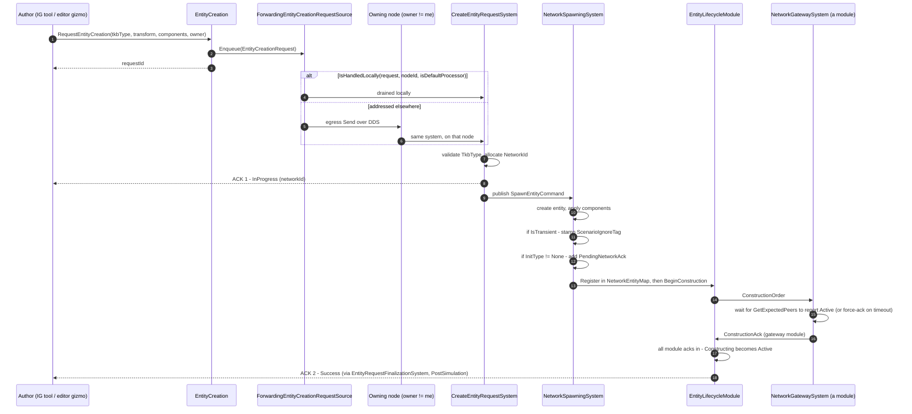

<!--STATUS
state: LIVE
updated: 2026-09-12
build-state: BUILDING - the NON-UI half is BUILT (2026-09-12); the UI half is not started.
  SPLIT BY USER ORDERING (2026-09-12, verbatim): "best do the non ui half of authoring surface first,
  then p3, then the ui". §8 now carries which half owns each acceptance row.
  ✅ BUILT: §4's API (on EntityCreation), §4b's one-method shape, ①b's routing constant, §2's
  author/translator rule written down at the affordance and at both translator sites, and rails
  ④/⑤/⑤b/①c in Hrot.SimHost.Tests/EntityCreationPackRails.cs (the feature's own suite).
  ⛔ NOT BUILT - the UI half, acceptance ②③⑧⑨⑩⑪⑫: §5/§5b's per-host authoring tails (IG stops building
  its own gizmo and IgEntityCreationRequests dies, StrideHrotGame's 12-line DTO, ScenarioSpawnAdapter as
  a thin caller closing G1+G2, SimHost + ReplayBrowser gaining the adapter).
as-built: TWO deviations from the dispatched design, both folded in where they stood -
  (a) the signature has NINE parameters, not eight: `disType`.
      ⛔⛔ THE REASON ORIGINALLY GIVEN HERE WAS WRONG AND IS RETRACTED (2026-09-12). It read: "added
      because CreateEntityRequestSystem copies request.DisType VERBATIM and derives nothing from TkbType,
      so an 8-parameter affordance would have stripped the DIS type off every authored entity (R-137)".
      FALSE — I measured CreateEntityRequestSystem and stopped one hop short of where the value LANDS.
      NetworkSpawningSystem.cs:154 stamps `cmd.DisType != 0 ? cmd.DisType : template.DisType.Value`, a
      template fallback that recovers a zero; and the only other consumer, GetInitialGrants, never reads
      the parameter in its one production implementation. Passing 0 loses nothing.
      The parameter STAYS as an explicit template OVERRIDE (optional, defaulted, costs no caller
      anything, and removing shipped surface would be churn) — but R-137 must not be cited for it.
      §3's disType row carries the full retraction.
  (b) §4 claimed "creation.NodeId is already on it" and §6's classDiagram drew it as an existing member.
      FALSE - EntityCreation had no NodeId; it was added in the same commit. §4's row and §6's new caption
      carry the correction, and the caption states the general trap: a <<EXISTS>> stereotype labels the
      BOX, so a NEW member on an existing class inherits "exists" silently.
current-answer: §4 is the API - ONE method, RequestEntityCreation, with an `owner` parameter; §4b is why
  one and not two; §4c is the creation sequence including the double ACK; §1.3b is the GESTURE STACK
  inventory (what is already shared) plus defects G1/G2; §5 the per-host fit; §5b is where the per-host
  variation belongs - the four-point tail design, the R-141 sharing ruling, and §5b.3's proof that the
  port must stay thin; §2 the author/translator rule; §7 resolves the four questions BY REASONING (R5
  reverses an earlier lean; R1 and R4 are RESTATED for the one-method shape). §7c is the one genuine
  product decision, and it does NOT block the API.
stale-below: nothing.
known-rot: three FACTUAL errors of an earlier version are corrected in place and called out where they
  stood - (a) §1.1 row ② labelled ScenarioSpawnAdapter as the Editor's when it is SHARED engine code,
  (b) §5 said CGF has no authoring site when CgfSubsystem.cs:1225 constructs that same adapter, and
  (c) §1.2 framed the duplication as two hosts inventing the same class when the real shape is one host
  (IG) bypassing a shared stack. All three came from inventorying producer CLASSES rather than HOSTS.
  §5b.3 also corrects an earlier lean of "widen the port"; the ADAPTER widens, the port stays void.
supersedes: DESIGN_Entity_Creation_Unification.md §3.4's TWO-METHOD API shape
  (RequestFromDefaultProcessor / CreateLocallyOwned). That section is marked SUPERSEDED and points here;
  its owner TABLE and its ReliableInitType reasoning are untouched and still live.
known-rot: R1's original argument ("a translator cannot express its case through the affordance") was
  true only of the two-method shape and is DEAD. The rule survives on §2's definition instead - stated
  in R1 as the weaker guarantee it now is.
known-conflict: none.
related-designs:
  - DESIGN_Entity_Creation_Unification.md — owns the PIPELINE and the owner TABLE this affordance calls
    into (the pack, the routing, D1's forwarder). THIS doc owns only the CALLER-side surface, and
    supersedes that one's §3.4 two-method API shape.
  - DESIGN_Role_Affinity_Ownership.md — owns what happens to component-level AUTHORITY *after* the entity
    exists (P3 auto-takeover, BirthCriticalComponents). Measured 2026-09-12: the two are INDEPENDENT —
    zero references either way — because this one is "who asks and whom they nominate" and that one is
    "who ends up simulating which components".
  - DESIGN_Node_Roles_And_Policies.md — owns the PERSISTENCE convention (R-140, IG is passive and
    non-persisting) that §7c's open product question belongs to. It, not this doc, decides whether IG's
    map drawings are disposable.
  - DESIGN_Uniform_Gizmo_Membership.md — owns how a gizmo becomes a member of a host's map; this doc
    owns only what happens when the gesture ENDS.
  - designs/edit-1/DESIGN.md — owns ISpawnController as a PANEL-FACING port; §5b.3 explains why the
    gesture handle must land on the adapter rather than widening that port.
  - designs/replay-and-modules/DESIGN.md — owns the ELM's replay/rewind contract. Relevant because §4c's
    ACK **A** (the module barrier) is the handshake an authored entity waits on.
-->

# ⭐⭐⭐ THE UNIFIED ENTITY-AUTHORING SURFACE

> 🔒 **User, `2026-09-03`:** *"all ecs nodes must use same shared code in the same way, just configured
> differently if necessary"* · *"extending shared base is not an issue but must be well reasoned."*

⭐⭐ **The problem in one sentence:** the entity-creation **contract** (`EntityCreationRequest`) and the
**pipeline** (`EntityCreationPack`) are shared, but the **authoring surface is not built at all** — so every
host that authors an entity hand-rolls the DTO or grows a private adapter.

📄 Extends [`DESIGN_Entity_Creation_Unification.md`](DESIGN_Entity_Creation_Unification.md) §3.4 — whose
owner **table** stands, and whose two-method **API shape** this document **supersedes** with one method
*(§4b)*. Both were deferred behind `CE-143`.
⭐ **`CE-143` is now RESOLVED** — `EntityCreationRequest.InitType` exists
*(`EntityLifecycleInterfaces.cs:92`, defaulted `AllPeers`)*, so the affordances are unblocked.

---

## 1. INVENTORY

⭐ Queries run `2026-09-03`, `codebase-memory` + grep, production only *(tests/harnesses excluded)*.

```
grep -rn "new EntityCreationRequest" --include=*.cs Hrot FDP Stride     → 5 producers
grep -rn "EntityCreationPack.Build"  --include=*.cs Hrot FDP Stride     → 6 composition roots
grep -rn "\.Enqueue(new EntityCreationRequest\|Source\.Enqueue("        → 2 enqueue sites
```

### 1.1 The five producers, and what each sets

| # | producer | Owner | Components | AttrJson | RequestId | PreAllocId | ChildOverrides |
|---|---|---|---|---|---|---|---|
| ① | `StagingEntityExtractor` *(CGF scenario load)* | `0` | ✅ | — | generated | ✅ | ✅ |
| ② | `ScenarioSpawnAdapter` *(gizmo → request)* — ⭐ **SHARED**, `Hrot.Presentation/Adapters/` | `cmd.OwnerNodeId` | ✅ | ✅ | ✅ passed | — | — |
| ③ | `StrideHrotGame` *(Stride editor authoring)* | `0` | ✅ | — | generated | — | — |
| ④ | `NedCgfEntityLifecycleAdapters` *(DDS wire ingress)* | `msg.Owner…` | ✅ | ✅ | ✅ passed | — | — |
| ⑤ | `IgEntityCreationRequests` *(**IG** tools → request, `2026-09-02`)* | `0` | ✅ | ✅ | ✅ passed | ✅ *(dead — always 0)* | — |

⚠⚠ **CORRECTED `2026-09-03`. This table counts PRODUCER CLASSES, and an earlier version read it as
counting HOSTS — which is wrong twice over:**
⛔ ② is **shared engine code, not the Editor's** — an earlier row labelled it *"(Editor gizmo → request)"*,
naming its *user* rather than its *home*;
⛔ and it is used by **the Editor AND CGF** *(`EditorSubsystem.cs:2093`, `CgfSubsystem.cs:1225`)*, so CGF's
authoring capability **vanished from the inventory** because it reuses a class already counted once.
⇒ ⭐⭐ **A producer-class census cannot answer *"which hosts can author"*.** §1.4 answers that question, and
it is the one §5 needed all along.

### 1.2 🔴 THE FINDING — **IG reaches PAST a shared adapter that already exists** *(restated `2026-09-03`)*

⛔ **An earlier version of this section said *"② and ⑤ are the same class written twice, in two
subsystems."* That framing was wrong in a way that mattered:** ② is not the Editor's — it is **shared**,
and CGF already reuses it. ⇒ this is **not** two hosts independently inventing the same thing.

⭐⭐⭐ **The true shape:** `Hrot.Presentation` carries a complete, shared authoring gesture stack — the
tools, the port, the adapter *(§1.4)*. **Four map hosts use it or could. IG is the one that bypasses it**,
constructing `EntityPlacementGizmo` itself at `MapCommandController.cs:185` and translating the command in
its own private `IgEntityCreationRequests`. 📐 Measured: **zero references to `ISpawnController` anywhere in
`Hrot.IG`.**

⇒ ⭐⭐ **The seam law still applies, but at the other end: the shared thing WAS built, and one host did not
adopt it.** ⛔ **searched `docs/` + `.dev/`, no design sanctions the bypass** — §5b says why it happened and
what removes the reason.

### 1.3b ⭐⭐⭐ THE GESTURE STACK — **what is already shared, measured `2026-09-03`**

| layer | where it lives | who uses it |
|---|---|---|
| map machinery *(buffer, both registries, the reflection pass, 3 systems + self-check, the gate)* | ⭐ `MapInteractionPack` — **shared** | ⭐⭐ **5 hosts**: IG · CGF · ReplayBrowser · SimHost · Editor |
| gizmo **membership** | `GizmoReflectionRegistrar` — one reflection pass, uniform by construction | all five. 📄 [`DESIGN_Uniform_Gizmo_Membership.md`](DESIGN_Uniform_Gizmo_Membership.md) |
| the **tools** — `EntityPlacementGizmo` · `PointSequenceGizmo` | ⭐ **shared**, `Hrot.Presentation/ScenarioEditor/Gizmos/` | — |
| the **port** *"start an authoring gesture"* | ⭐ `ISpawnController` — **shared**, `Hrot.Presentation/Facades/` | Editor · CGF · ExCon. 📄 design basis: [`designs/edit-1/DESIGN.md`](designs/edit-1/DESIGN.md) §Ports |
| the **adapter** *(tool lifetime → request)* | ⭐ `ScenarioSpawnAdapter` — **shared**, `Hrot.Presentation/Adapters/` | Editor · CGF |

⇒ ⭐⭐⭐ **The gizmos and the map interaction logic are ALREADY shared, and a per-host seam for the tail
ALREADY exists.** ⛔ What is missing is not a seam — it is **adoption** *(IG)* and **reach**
*(SimHost / ReplayBrowser hold the machinery and no authoring affordance)*.

#### 🔴 TWO DEFECTS the enumeration turned up — **both in SHARED code**

| # | | |
|---|---|---|
| ⭐⭐⭐ **G1** | **the shared adapter contradicts itself across its own three affordances** | `StartPlacementMode` enqueues onto the request source *(when one was passed)*; ⛔ **`StartAreaAuthoringMode` and `StartRouteAuthoringMode` call `_bus.PublishManaged(cmd)` UNCONDITIONALLY** and never touch it. ⇒ on CGF an authored area is a node-local **ORDER** that never becomes a cross-node **REQUEST** — 🔴 **`D1`'s level mismatch, alive in shared code, on the two affordances host (f) never retargeted** |
| ⭐⭐ **G2** | **`nameResolver` is DEAD** | `EntityPlacementGizmo.cs:207`: `_ = _nameResolver; // retained for future use`. 📐 IG builds a session name generator *(`UniqueNameGenerator.CreateSessionGenerator`)* and threads it through `MapCommandController.cs:190` — **the gizmo drops it.** ⇒ the **10th** instance of the silent-default pattern, and the clear-cut kind: 🔒 *"a production caller that HAS a dependency must PASS it"* — here it **does** pass it and the callee discards it |

⚠ **One thing that looked like a third defect and is NOT** *(checked before reporting)*: the gizmo mints its
own `RequestId = Guid.NewGuid()`, not the `requestId` the remote `CMD_PLACE_ENTITY` carried. 📐 That is
**correct** — IG correlates on **two** levels: `_pendingEntityRequests` keys on the *entity* request id
*(`:323`)* while the command reply uses `_sessionRequestId` *(`:359`)*.

### 1.3 The six composition roots

`CgfSubsystem` · `EditorSubsystem` · `IgNodeBootstrapper` · `SimHostNodeBootstrapper` ·
`StrideNodeBootstrapper` · `EditorStrideSubsystem`. ⭐ All six build the pack; all six therefore already
hold a `creation.LocalRequests` — **the affordance has a home on every host with no new plumbing.**

---

## 2. ⭐⭐⭐ THE RULE — **AUTHOR vs TRANSLATOR**

⛔ **This distinction is currently INFERRED, not written down anywhere.** It is the load-bearing rule of
this document, and `§7 Q1` asks for it to be ratified.

| role | definition | must use the affordance? |
|---|---|---|
| ⭐⭐ **AUTHOR** | a **new intent originates here** — a human gesture, an AI decision, a tool. Nothing outside has decided the fields yet | ⭐⭐⭐ **YES — always** |
| ⭐ **TRANSLATOR** | an **existing external representation** is being mapped in — a scenario file, a DDS sample, another node's message. The representation already fixed the fields | ⛔ **NO — it constructs the DTO directly, and that is correct** |

⭐ **Why translators are exempt and it is not a loophole:** an affordance's job is to make the *authoring
choice* explicit — *"do I own this, or does the arbiter?"* 📐 A translator has no such choice: the owner
arrived in the message. ⛔ Forcing it through an affordance would mean inventing an authoring intent it
does not have.

⇒ ① `StagingEntityExtractor` and ④ NED ingress are **translators** — they stay as they are, and
`§7 Q1`'s ratification is what stops a future session reading them as violations.

---

## 3. WHY THE THREE EXTRA PARAMETERS — **each justified, or excluded**

⛔ §3.4's proposed shape is `(tkbType, transform, initialComponents, initType)`. Three fields beyond it
appear in the producer table. **Two are in, one is out.**

| field | verdict | reasoning |
|---|---|---|
| `owner` | ✅ **IN — and it is what collapsed two methods into one** | 📐 the sole routing input *(`EntityCreationRouting.cs:47-51`)*, with **three** legal values ⇒ a parameter, not a verb. 📄 §4b |
| `isTransient` | ✅ **IN** | ⭐ `R5` below — a per-request property exactly like `initType`; omitting it forces callers to bypass the affordance |
| `initType` | ✅ **already designed** | §3.4: *"both affordances take an explicit `initType`, defaulted to `AllPeers` so adoption changes nothing"*, and *"IG's drawings pass `None`"*. ⭐ §4c shows what it buys: it is the `PendingNetworkAck` that makes `NetworkGatewaySystem` wait for peers |
| `initialAttributesJson` | ✅ **IN** | 📐 the operator's placement command carries property JSON — `MapCommandController.ActivatePlacementCommand(…, initialPropertiesJson)` → `EntityPlacementGizmo.cs:219`, railed as `EPG-006`. ⭐ It is an **authoring input**: the human typed it |
| `requestId` | ✅ **IN** | 📐 `MapCommandController` correlates the two-phase ACK through `_pendingEntityRequests[RequestId]`; it cannot let the affordance mint one. ⭐ An **author that must be told the outcome** needs to name its request |
| ⭐ `disType` | ✅ **IN — but the JUSTIFICATION below was WRONG and is retracted** ⚠ | ⛔⛔ **RETRACTED `2026-09-12`.** This row said: *"`CreateEntityRequestSystem` copies `request.DisType` VERBATIM and derives nothing from `TkbType`, so an 8-parameter affordance would have stripped the DIS type off every authored entity once `ScenarioSpawnAdapter` became a thin caller (`R-137`)."* 🔴 **FALSE, and I stopped measuring one hop too early.** 📐 Re-measured, following the value to where it LANDS: ① the entity's DIS header is stamped by **`NetworkSpawningSystem.cs:154`**, which reads `cmd.DisType != 0 ? cmd.DisType : template.DisType.Value` — ⭐ **a template fallback, so a zero is recovered**; ② the only other consumer is `BuildOwnershipGrants` → `IOwnershipDistributionStrategy.GetInitialGrants(disType, …)`, and the one production implementation *(`BrainMuscleOwnershipStrategy.cs:40-55`)* **never reads that parameter at all** — it keys purely on the cluster cache. ⇒ ⭐ **passing `0` loses NOTHING, on either arm.** ✅ **WHY IT STAYS ANYWAY** *(decide-and-log, not R-137)*: it is an **explicit OVERRIDE** of the template's DIS type — a coherent authoring choice for a variant of one TKB template — it is optional and defaulted `0`, so it costs no caller anything, and removing a shipped parameter would be churn for no functional gain. ⚠ **But it carries no capability anyone uses today**: measured, both producers that pass it *(`ScenarioSpawnAdapter:223`, `IgEntityCreationRequests:67`)* pass a value the gizmo already resolved FROM the template, so it equals the fallback. ⛔ **Do not cite `R-137` for it** |
| `preAllocatedNetworkId` | ⛔ **OUT** | 📐 one producer only — ① the scenario **extractor**, a translator. ⚠ ⑤ passes it today and it is **dead**: every IG tool sets `NetworkId = 0` *(`IgApplication.cs:3562`, `:3662`)* |
| `childComponentOverrides` | ⛔ **OUT** | 📐 one producer only — ① again. Bulk scenario shape, not an authoring choice |

⚠⚠ **The justification that was WRONG and is corrected here.** An earlier pass argued
`initialAttributesJson` and `requestId` were justified *"because ② and ④ already use them."* ⛔ ② and ④ are
a **translator** and a **wire adapter** — counting them as peers of an authoring API was invalid.
⭐ **The real argument is a capability one:** IG is the first *author* whose gesture carries
operator-supplied properties **and** must correlate an ACK. The Stride editor authors without either,
which is exactly why both parameters are **optional with defaults**.

⭐⭐ **Geometry needs NOTHING.** `InitialComponents` is `List<object>` and all five producers already use
it. `EditablePolyline` / `RoutePlan` are ordinary ECS components in that list, exactly like `SimTransform`
and `TkbIdentity`. ⛔ **The shared base never learns what a polyline is** — no geometry-shaped parameter,
now or later.

---

## 4. THE API — **ONE method**

```csharp
// on EntityCreation (the pack result object)
Guid RequestEntityCreation(
        long tkbType,
        SimTransform? transform                  = null,
        IReadOnlyList<object>? initialComponents = null,
        int owner        = EntityCreationRouting.DefaultEntityCreationRequestProcessor,   // 0
        ReliableInitType initType                = ReliableInitType.AllPeers,
        string? initialAttributesJson            = null,
        bool isTransient                         = false,
        ulong disType                            = 0,       // ⭐ ADDED WHILE BUILDING - see §3
        Guid requestId                           = default);
```

> ⚠⚠ **AS-BUILT, `2026-09-12`. The signature above is the SHIPPED one and differs from the dispatched
> design in ONE place: `disType`.** ⛔ The dispatched version had eight parameters; §3's new `disType` row
> carries the measurement that forced a ninth. Nothing else moved.

```csharp
// the arbiter owns and runs genesis — today's behaviour, and the overwhelming majority of call sites
creation.RequestEntityCreation(tkbType, transform, components);

// I own this: full lifecycle locally, and nobody has to ACK a scratch drawing
creation.RequestEntityCreation(tkbType, transform, components,
                               owner: creation.NodeId, initType: ReliableInitType.None);

// a third node by name — expressible, with no third method
creation.RequestEntityCreation(tkbType, transform, components, owner: thatNodeId);
```

| ⭐ | |
|---|---|
| ⭐⭐⭐ **ONE method, an `owner` argument** | 🔒 **User, `2026-09-03`:** *"the node simply says who is the executor and default owner in its request… whoever it is, it calls entity creation on its node as if it was a local request. no difference between if the request comes from the same node or other."* — ⭐ §4b measures that this is exactly what the code does |
| ⭐⭐ **`owner` is an `int` node id, not a bool or an enum** | ⛔ **the domain has three values, not two** *(`0`, `localNodeId`, *"a third node by name"* — §3.4's own table)*. A two-valued affordance leaves the third with no expression, and its author hand-rolls the DTO |
| ⭐ **the default is a NAMED constant** | `DefaultEntityCreationRequestProcessor` ⇒ an omitted `owner` reads as a decision, not as a forgotten `0`. 🔒 User: *"rather long than misleading"* |
| **returns the `Guid`** | the request id — minted when the caller passed `default`, echoed when it supplied one. ⭐ An author that wants the ACK keeps it; one that does not, ignores it |
| ⛔ **no policy table, no TKB flag, no config switch** | 🔒 §3.4: *"only concrete authoring code picks the way it needs"* |
| **lives on `EntityCreation`** | the pack's result object, which every one of the six roots already holds. ⛔ No new seam, no new constructor argument |
| ⚠⚠ **`creation.NodeId` — CORRECTED `2026-09-12`** | ⛔ **This row previously read *"`creation.NodeId` is already on it, so 'mine' needs no extra lookup"*. 🔴 FALSE, and §6's class diagram drew it as an existing member on the strength of it.** 📐 Measured at build time: `EntityCreation` had **no `NodeId`** — the value was a composition input *(`EntityCreationContext.NodeId`)* that stopped at the request system and the spawn system, so an author wanting `owner: myNodeId` had to reach back to the host for a number the pack already held. ⭐ **It was ADDED in the same commit**, so the conclusion survives; only the tense was wrong |

### 4b. ⭐⭐ WHY ONE METHOD — **the measurement, not a preference**

⛔ §3.4 specified **two** methods, `RequestFromDefaultProcessor` / `CreateLocallyOwned`. ⭐⭐ **That shape is
SUPERSEDED, and the reason is measurable in three files:**

| the claim the two-method shape rested on | code — how it IS | design basis — how it was MEANT to be |
|---|---|---|
| the two paths are two **behaviours** | ⛔ **FALSE.** `CreateEntityRequestSystem` drains a **composite** of the local and the wire source and cannot distinguish them; the sole routing input is `EntityCreationRouting.IsHandledLocally(request, localNodeId, isDefaultProcessor)` *(`EntityCreationRouting.cs:47-51`)*, which reads **`OwnerAppInstanceId` only** | ⭐ §3.4's own words: *"the routing is ONE FIELD"* — ⇒ the design already said it; the API shape contradicted the design |
| provenance *(who authored it)* affects servicing | ⛔ **FALSE — never consulted.** `EntityCreationRequest` carries no origin field | ⭐ `Q65` §4: `isDefaultProcessor` is a **broadcast tiebreaker**, not an authority gate |
| two values are enough | ⛔ **FALSE.** §3.4's table has **three** rows: `0`, `localNodeId`, *"a third node by name"* | ⭐ the wire ingress already receives arbitrary owners *(`NedCgfEntityLifecycleAdapters.cs:78`)* |

⇒ ⭐⭐⭐ **Two verbs for one field name the ARGUMENT, not the behaviour.** ⛔ And they cannot express row 3,
so the affordance would have had a hole exactly where a future multi-node deployment needs it.

#### ⭐ Where the constant lives

⭐⭐ **`EntityCreationRouting.DefaultEntityCreationRequestProcessor = 0`** — 📐 that class is *"THE Level-1
routing rule in exactly ONE place"* and **already contains the literal**: `bool isDefaultTarget =
targetNodeId == 0` *(`:49`)*. ⇒ ⭐ the constant is not new vocabulary, it is a **name for a magic number that
already had a meaning there**, and the routing rule adopts it in the same edit. ⛔ Not on
`EntityCreationRequest` — the DTO carries the value, it does not interpret it.

---

## 4c. ⭐⭐⭐ WHAT THE AUTHOR SET IN MOTION — **the full creation sequence, including the double ACK**

> 🔒 **User, `2026-09-03`:** *"pls explain the sequence of entity creation including the double ack."*
> ⭐ It belongs here because it is what the **one** parameter `owner` selects between, and because
> `requestId` (§3) only makes sense once the ACK stream is on the page.

### ⚠⚠ THREE DIFFERENT THINGS ARE CALLED AN "ACK" — **and conflating them is how the F4 hazard was mis-read**

| # | the ack | who sends it | who waits for it | scope |
|---|---|---|---|---|
| ⭐ **A** | `ConstructionAck { ModuleId }` | ⭐⭐ **each ECS MODULE on the servicing node**, when its own components are ready | `EntityLifecycleModule` — flips `Constructing → Active` when **all** registered modules have acked | ⛔ **NODE-LOCAL.** 📄 `FDP/Docs/projects/toolkits/FDP.Toolkit.Lifecycle.md` §2 |
| ⭐ **B** | *(the peer wait — no message of its own)* | ⭐⭐ **`NetworkGatewaySystem`, which is itself one of those modules**, by **withholding its own `ConstructionAck`** | the same ELM tally | ⭐ cross-node, but expressed entirely as **A**. `GetExpectedPeers((long)pendingInfo.ExpectedType)` → wait for every peer to report `Active`; **`peerSet.Count == 0` ⇒ ack immediately**; a `reliableInitTimeoutFrames` **force-ack** prevents deadlock *(`NetworkGatewaySystem.cs:112-165`)* |
| ⭐⭐⭐ **C** | `CreateUpdateDeleteEntityAck` — **the DOUBLE ACK** | `CreateEntityRequestSystem` *(phase 1)* and `EntityRequestFinalizationSystem` *(phase 2)* | **the AUTHOR**, keyed by `RequestId` | ⭐ the request/response protocol — the only one an authoring call site ever sees |

⛔⛔ **Only C is "the double ack".** ⭐ **A** is a module-readiness tally and **B** is one module being slow
on purpose. 📌 **This distinction dissolved the blocker that stopped F4** *(scheduling `NetworkSpawningSystem`
on IG)*: the fear was *"teardown waits for cluster acks, so a non-owning node could stall"* — false, because
the acks are **local module acks**, and `.dev/_DONE/two-ack/TwoAck-DESIGN.md` §6 states the invariant
*"the ELM and `NetworkSpawningSystem` remain pure, generic ECS systems."*

### ⭐⭐ THE DOUBLE ACK — **why two, and what each one promises**

| phase | status | sent when | what the author may conclude |
|---|---|---|---|
| **1** | `InProgress` | ⭐ **immediately**, the same tick the request is drained, right after the network id is allocated *(`CreateEntityRequestSystem.cs:207-211`)* | *"accepted, and here is your `NetworkId`"* — ⛔ the entity does **not** exist yet |
| **2** | `Success` | ⭐ in `PostSimulation`, once the entity is **in the `NetworkEntityMap`** *(**A**+**B** complete)* | *"it exists, it is `Active`, and every peer that had to know does"* |

⇒ ⭐ **Phase 1 exists for LATENCY** — 📐 the header says it verbatim: *"so the ExCon client unblocks with
minimal latency"*. ⛔ A single ack could not do both jobs: an early one cannot promise existence, and a late
one leaves a remote operator's UI blocked for the whole peer handshake.
⚠ **The failure arms are phase 1 too** — a bad `TkbType` answers `UnknownDescriptorType` and there is no
phase 2. ⇒ ⭐ **an author that waits must accept `InProgress`, `Success` *or* a rejection.**



⭐⭐ **What the diagram makes visible, and why it belongs in an AUTHORING design:**
**the branch is the ONLY thing `owner` controls, and everything after it is identical.** ⛔ There is no
second pipeline for *"my own"* entities — 🔒 exactly the user's *"as if it was a local request."*
⇒ ⭐ that is the structural reason §4 is **one** method.

---

## 5. PER-HOST FIT

⚠⚠ **REWRITTEN `2026-09-03`. The previous version of this table said *"CGF: ⛔ none — it loads and
arbitrates"*. 🔴 That is FALSE** — `CgfSubsystem.cs:1225` constructs `ScenarioSpawnAdapter`, and `:1068`
says verbatim *"`CE-061` — StartPlacementMode is SUPPLIED now, **and it has to be**"* *(`CE-061` = the batch
that gave CGF its placement affordance)*. ⇒ 📌 the error came straight from §1.1's producer-class census.

| host | map machinery? | authors today? | how | after |
|---|---|---|---|---|
| ⭐ **IG** | ✅ | ✅ operator draws / places | ⛔ **bypasses the shared stack** — builds `EntityPlacementGizmo` itself, translates in `IgEntityCreationRequests` | uses the shared adapter; ⭐ `IgEntityCreationRequests` **deleted** |
| ⭐ **Editor** | ✅ | ✅ gizmo placement | ✅ shared `ScenarioSpawnAdapter` | unchanged path; its tail becomes `RequestEntityCreation` |
| ⭐ **CGF** | ✅ | ✅ **YES** *(`CE-061`)* | ✅ the **same** shared adapter | same — ⭐ and `G1` stops silently downgrading its areas/routes to orders |
| ⭐ **SimHost** | ✅ | ⛔ no affordance | — | ⭐ **gets one, by sharing** — see the ruling below |
| ⭐ **ReplayBrowser** | ✅ | ⛔ no affordance | — | ⭐ same |
| **Stride editor** *(`StrideHrotGame`)* | ⛔ own stack | ✅ places an entity | ③ hand-rolled DTO, 12 lines | `RequestEntityCreation(tkbType, transform, components)` |
| **ExCon** | ⛔ **no ECS world** | ✅ but **remotely** | its `ISpawnController` sends `CMD_PLACE_ENTITY` over DDS for an **IG** to run the tool | ⭐ **unchanged, and correctly so** — see §5b |

⇒ ⭐⭐⭐ **Five map hosts, one gesture stack, one call at the tail.** ⛔ The earlier *"three authors"* framing
undercounted because it counted producer classes.

---

## 5b. ⭐⭐⭐ THE TAIL — **where the per-host variation belongs**

> 🔒 **User, `2026-09-03`:** *"all hosts showing the 2d map should be unified and use same mechanisms
> regarding gizmos… These placement tools (gizmos, map interaction logic) are shared (i hope) but when tool
> ends the way how the entity creation request is sent must be customizable per host."*

### 5b.1 ⭐⭐ The measured answer to the premise — **the tail does NOT actually vary per host**

📐 Both real ECS paths do the same thing at the end of the gesture: **build the request and enqueue it
locally.** What differs is not the *send*:

| what actually differs | which host | what it is |
|---|---|---|
| **enrichment** | Editor / CGF | seeds a baseline `EntityInfo` so the entity appears in the ORBAT tree, then compiles the property JSON on top |
| **bookkeeping** | IG | correlates a two-phase ACK back to a remote ExCon client |
| ⭐⭐ **the send itself** | — | ⛔ **identical** |

⇒ ⭐⭐⭐ **A per-host `IEntityCreationSender` interface would be a SECOND seam over one that already
routes.** 📐 `EntityCreation` *(the pack result)* is already the per-host configuration point: every ECS
host composes it, and §4's `owner` / `initType` / `isTransient` are exactly the knobs a host would want.
⛔ Adding an interface on top is the seam law repeating itself.

### 5b.2 ⭐⭐⭐ THE DESIGN — **four points**

| # | | |
|---|---|---|
| **①** | ⭐⭐ **one shared adapter for every map host, IG included** | `MapCommandController` keeps its session / ACK / remote-command duties and **delegates the gesture**; it stops constructing gizmos. `IgEntityCreationRequests` dies |
| **②** | ⭐⭐⭐ **the tail is `creation.RequestEntityCreation(...)` for ALL THREE affordances** | ⭐ this is what fixes `G1` **by construction** — placement, area and route stop disagreeing because there is only one call left. ⛔ No new interface: per-host customisation is *which `EntityCreation` the adapter is given*, plus its owner/initType/isTransient defaults |
| **③** | ⭐⭐⭐ **widen the ADAPTER, keep the PORT thin** — see §5b.3 | the adapter gains a **gesture-returning** method taking `requestId` + `nameResolver`; `ISpawnController.StartPlacementMode` stays `void`, implemented on top of it. ⭐ `G2` is fixed in the same edit |
| **④** | ⭐⭐ **SimHost and ReplayBrowser get the adapter** | ⭐ **not a per-host decision** — see the ruling below |

> 🔒🔒 **USER RULING, `2026-09-03`, verbatim:** *"'SimHost and ReplayBrowser get the adapter too' — this
> should be the natural outcome of sharing the code, not a per-host decision; unused capability does not
> harm is present as sharing/unification is more important for overall maintenance"*
>
> ⇒ ⭐⭐⭐ **A capability arriving on a host that has no use for it is NOT a cost to weigh.** ⛔ Do not ask
> *"does this host need it?"* before sharing — ⭐ **sharing is the default and the reason; the question does
> not get asked.** 📌 This generalises past this design; indexed as **`R-141`** in
> [`RULINGS.md`](blueprints/RULINGS.md).

### 5b.3 ⛔⛔ WHY THE PORT MUST NOT CARRY IT — **the one thing that could have broken ①**

⭐ **IG's gesture is not fire-and-forget.** It is a session run for a remote client, and it owes that client
a terminal status. It needs **three** notifications:

| # | notification | what it does | source |
|---|---|---|---|
| ① | an entity was requested | `OnEntityCreatedByTool` → `_pendingEntityRequests[reqId] = true` | the gizmo's `onEntityCreated` |
| ② | ⭐⭐ **the tool exited** | `OnCreationToolExited` → `_toolFinished = true`; if nothing was created, publish **Cancelled** and `ClearSession` | the gizmo's `onRemove` |
| ③ | the ack came back | `OnCreateEntityAck` → drop from pending; when `_toolFinished && pending == 0`, publish **Finished** | DDS |

⛔⛔ **`ScenarioSpawnAdapter` swallows ① and ② today** — ① lives inside its closure and returns nothing, and
its `onRemove` only calls `Unregister(id)`. ⇒ **delegating to it as it stands HANGS IG**: `_toolFinished`
never becomes true, `PublishAck` never fires, `ClearSession` never runs, the remote client waits forever —
**and the guard at the top of `ActivatePlacementCommand`** *(`contextId == _sessionContextId &&
!_toolFinished` → `return`)* **then refuses every subsequent placement.** 🔴 A hang, not a quibble.

✅ **It does not require owning the gizmo.** 📐 `EntityPlacementGizmo` already publishes both, deliberately:
`event Action? Exited` — raised **before** `_onRemove()`, *"allows external observers to detect gizmo
lifecycle changes"* — and `event Action<SpawnEntityCommand>? OnCommandPublished`, *"so tests and integrators
can observe the event without inspecting the delegate's capture list."* ⇒ ⭐⭐ **the gizmo was built for
this; the adapter simply never surfaces them.**

⚠⚠ **This CORRECTS an earlier lean of *"widen the port by two optional parameters."*** ⛔ Wrong place, for
two measured reasons:

| | |
|---|---|
| 📐 **`ISpawnController` is PANEL-FACING** | its callers are `SpawnerPanel` · `OrbatPanel` · `ScenarioOrbatAdapter` · `ExConOrbatAdapter` — *"the operator clicked Place Entity."* ⛔ `MapCommandController` is **not** such a caller; it is a command executor, a **peer** of the adapter |
| ⛔ **a gesture handle on the port would be UNHONOURABLE by one implementation** | ExCon runs no local tool ⇒ its handle would always be null ⇒ **the silent-default pattern, by construction** |

⇒ ⭐⭐⭐ **The adapter grows; the port stays `void`.** ⭐ Panels unchanged, ExCon unchanged, no nullable
handle anywhere, and `requestId`/`nameResolver` land on the adapter method where IG can reach them.

---

## 6. UML

```mermaid
classDiagram
    class EntityCreation {
        <<pack result - EXISTS>>
        +ScenarioEntityCreationRequestSource LocalRequests
        +int NodeId
        +RequestEntityCreation(tkbType, transform, components, owner, initType, attrJson, isTransient, disType, requestId) Guid
    }
    class EntityCreationRouting {
        <<EXISTS - gains the constant>>
        +int DefaultEntityCreationRequestProcessor$
        +IsHandledLocally(request, localNodeId, isDefaultProcessor) bool$
    }
    class EntityCreationRequest {
        <<contract - EXISTS>>
        +Guid RequestId
        +int OwnerAppInstanceId
        +long TkbType
        +ulong DisType
        +List~object~ InitialComponents
        +string InitialAttributesJson
        +ReliableInitType InitType
        +bool IsTransient
    }
    class ScenarioEntityCreationRequestSource {
        <<EXISTS>>
        +Enqueue(request)
    }
    class ISpawnController {
        <<port - EXISTS, panel-facing, stays void>>
        +StartPlacementMode(tkbType, propsJson) void
        +StartAreaAuthoringMode(styleJson) void
        +StartRouteAuthoringMode() void
    }
    class ScenarioSpawnAdapter {
        <<SHARED adapter - EXISTS, gains the gesture method>>
        +BeginPlacement(tkbType, propsJson, requestId, nameResolver) AuthoringGesture
    }
    class AuthoringGesture {
        <<NEW - what the adapter returns>>
        +event RequestEnqueued
        +event Exited
    }
    class EntityPlacementGizmo {
        <<shared tool - EXISTS, already raises both events>>
        +event OnCommandPublished
        +event Exited
    }
    class MapCommandController {
        <<IG session + ACK - stops building gizmos>>
    }
    class StrideHrotGame {
        <<Stride editor author>>
    }
    class StagingEntityExtractor {
        <<TRANSLATOR - exempt>>
    }
    class NedEntityCreationRequestSource {
        <<TRANSLATOR - exempt>>
    }
    class IgEntityCreationRequests {
        <<DELETED by this design>>
    }

    EntityCreation --> ScenarioEntityCreationRequestSource : enqueues onto
    EntityCreation ..> EntityCreationRequest : builds
    EntityCreation ..> EntityCreationRouting : default owner constant
    ScenarioSpawnAdapter ..|> ISpawnController : implements, in terms of BeginPlacement
    ScenarioSpawnAdapter --> EntityPlacementGizmo : constructs, owns lifetime
    ScenarioSpawnAdapter ..> AuthoringGesture : returns
    AuthoringGesture ..> EntityPlacementGizmo : forwards its two events
    MapCommandController --> ScenarioSpawnAdapter : BeginPlacement
    MapCommandController ..> AuthoringGesture : observes for session close
    ScenarioSpawnAdapter --> EntityCreation : RequestEntityCreation
    StrideHrotGame --> EntityCreation : RequestEntityCreation
    StagingEntityExtractor ..> EntityCreationRequest : constructs directly
    NedEntityCreationRequestSource ..> EntityCreationRequest : constructs directly
    IgEntityCreationRequests ..> EntityCreationRequest : constructs directly
```



⚠⚠ **CAPTION — what the diagram shows that the prose hid, and what it got WRONG.** ⭐ The picture's
value is that every box except three is marked `EXISTS`: the affordance adds **one method and one
property**, not a layer. ⛔ **But `<<pack result - EXISTS>>` made `NodeId` look existing when it was
not** — a class-diagram stereotype applies to the BOX, and a member added to an existing box inherits
its label silently. 📌 That is how §4's *"already on it"* survived review. ⇒ ⭐ **when a member is new on
an existing class, say so in the caption; the stereotype cannot.** ✅ Both `NodeId` and
`RequestEntityCreation` were built `2026-09-12`; `DisType` / `IsTransient` were always on the DTO and
are drawn now only because the affordance carries them.

📄 **The `sequenceDiagram` is §4c** — the full authoring call through both routings, both ACK phases and
the ELM handshake. ⛔ It is **not** redrawn here: 🔒 *"never both for the same thing — two pictures of one
architecture rot apart."*

---

## 7. ⭐⭐⭐ THE FOUR QUESTIONS — **RESOLVED BY REASONING, not by ruling**

> 🔒 **User, `2026-09-03`:** *"the questions you are asking should be answered by your reasoning, not my
> ruling."* ⭐ Each below is decided by a measurement or by a consequence of a rule already ruled, not by
> preference. ⚠ **`R5` REVERSES the lean an earlier pass gave.**

### R1 — the AUTHOR/TRANSLATOR rule stands, but on a DIFFERENT argument ⚠ *(restated `2026-09-03`)*

⚠⚠ **The original argument DIED with the two-method shape, and saying so is the honest version.** It ran:
*"the affordance offers only `0` and `NodeId`, the wire ingress receives an arbitrary owner, therefore a
translator cannot express its case."* ⛔ **§4's `owner` parameter takes any node id** ⇒ that impossibility is
gone, and a translator now *could* call `RequestEntityCreation`.

⭐⭐ **The rule survives because its real basis was never the signature — it is §2's definition.** A
translator has **no authoring choice to make**: the owner, the components and the id all arrived in the
representation it is mapping. ⇒ routing it through the affordance would add a defaulting layer over fields
that are already fully determined, and 📌 the two translators do things the affordance deliberately excludes
*(`preAllocatedNetworkId`, `childComponentOverrides` — §3)*.

⇒ ⭐ **Translators are now exempt by DEFINITION rather than excluded by construction.** ⚠ **That is a weaker
guarantee, and it is stated as one:** the check is §2's table and acceptance ⑥, not the type system.

### R2 — CGF has no authoring site ✅ *(measured, see §5)*

### R3 — `ScenarioSpawnAdapter` becomes a THIN CALLER, and loses a latent hazard ✅

📐 Measured, it owns three things: **gizmo lifetime** *(`Unregister(id)`, `autoPopOnPlace`)*, the
**transform/velocity folding** into `InitialComponents` *(`:118-127`)*, and a **null-source fallback**.
⇒ deleting it would lose the first two ⇒ **thin caller**, not deletion.

🔴 **And the fallback is a latent instance of the hazard this programme just removed from IG.**
📐 `if (_requestSource != null) { Enqueue } else { _bus.PublishManaged(cmd); }` — the else branch publishes
the **ORDER**, on a host that composes the pack and therefore registers the spawn system. ⚠ It is **dead
today** *(`EditorSubsystem.cs:2093` always passes `creation.LocalRequests`)*, but it is the silent-default
shape: an optional dependency whose absence changes behaviour instead of failing.
⇒ ⭐⭐ **The affordance removes it by construction** — there is no way to call
`creation.RequestFromDefaultProcessor(...)` without a `creation`.

### R4 — the *"who owns it"* axis ships NOW, and the question it once raised DISSOLVES ✅ ⚠ *(restated `2026-09-03`)*

⛔ The original question was *"do we ship a second method with no caller?"* ⭐⭐ **With one method it is not a
question at all** — `owner` is a parameter, so the second path costs **zero new surface** and cannot be a
dead method.

📐 §3.4's own table, row 2, still names its first user: *"an entity it owns itself **(IG map drawings shared
between IGs)** → `OwnerAppInstanceId = localNodeId`."* ⚠⚠ Those drawings are untargeted **today** only
because the retired `SpawnEntityCommandEgressTranslator` wrote `Owner = default` and ignored
`cmd.OwnerNodeId` *(§1.1 ⑤)*. ⇒ ⭐ **passing `owner: creation.NodeId` at IG's drawing tools is a SEPARATE
behavioural step** — see `§7c` — and the API is ready for it either way.

### R5 — ⚠ **REVERSED: `isTransient` DOES belong on the signature** ✅

⛔ **An earlier pass leaned "leave it off until the product question is answered." That was wrong**, and the
reason is a consistency argument that applies equally to a parameter already ruled in.

📐 `isTransient` is a **per-request property, exactly like `initType`** — and §3.4 puts `initType` on the
signature with a default precisely so *"adoption changes nothing"*. ⇒ ⛔ **omitting `isTransient` forces any
caller that needs it to bypass the affordance and hand-roll the DTO** — which is the disease this document
treats. ⭐ **Include it, defaulted `false`.**

⚠ **What stays open is a CALL-SITE question, not a signature question:** *which* IG tools pass `true`.
📐 The tension is real and recorded — `R-140` says an IG-owned entity is disposable, yet the tac-graphic
overlay descriptor is built `PersistenceMode.MODE_PERSISTENT`. ⇒ that is `§7c`, and it does not block the
API.

---

## 7c. ⛔ THE ONE THING THAT IS GENUINELY A PRODUCT DECISION

⭐⭐ **Are IG's map drawings IG-owned-and-disposable, or arbiter-owned-and-persistent?** ⛔ **Not answerable
from code**, and the two records conflict:

| says disposable | says persistent |
|---|---|
| 🔒 `R-140`: *"IF IG crashes, its entities are gone, but no one cares, they were temporary anyway"* | 📐 the overlay descriptor is emitted `PersistenceMode.MODE_PERSISTENT` *(`CreateEntityRequestDescriptorBuilder`)* |
| §3.4 row 2 puts IG map drawings at `OwnerAppInstanceId = localNodeId` ⇒ under `R-140`, non-persistable | 📐 today they are untargeted ⇒ CGF owns and **saves** them |

⇒ ⭐ **This design does NOT decide it, and does not need to.** ⛔ The API carries both axes; the call sites
choose. ⚠ **The migration is deliberately staged:** IG's tools keep the default `owner` +
`isTransient: false` — today's exact behaviour — until this is answered. 📄 The answer belongs with the
scenario-saving question already parked in
[`DESIGN_Node_Roles_And_Policies.md`](DESIGN_Node_Roles_And_Policies.md) §8.

---

## 7b. ⛔ SCOPE BOUNDARY — **what this surface does NOT cover**

⭐⭐ **Only NETWORKED entities** — those that get a `NetworkIdentity`, replicate, and may be persisted.

📐 Measured: the AI's EQS sensor children are created and destroyed straight through `ctx.World` and
`ecb.DestroyEntity` *(`EqsLifecycleNodes.cs:227,277-282`)*. They are **local probe entities** — no network
id, no replication, no scenario. ⛔ **They must NOT be routed through this affordance**: it would give them
network identity and a lifecycle handshake they have no use for.

⇒ ⭐ **The trigger for "must I use the affordance?" is `does this entity need a network identity?`**, not
"am I creating an entity".

---

## 8. ACCEPTANCE

⭐⭐ **SPLIT `2026-09-12` at the user's ordering** — 🔒 *"best do the non ui half of authoring surface
first, then p3, then the ui"*. ⛔ The rows are unchanged; what is new is **which half owns each**.

| # | | state |
|---|---|---|
| ① | `RequestEntityCreation` exists on `EntityCreation`, `owner` defaulted to `EntityCreationRouting.DefaultEntityCreationRequestProcessor` and `initType` to `AllPeers` | ✅ **DONE** *(non-UI)* — ⚠ nine parameters, not eight; §3's `disType` row says why |
| ①b | ⭐ `EntityCreationRouting` **carries the constant and uses it** — `:49`'s literal `0` is gone. ⛔ Not a second definition of the number | ✅ **DONE** *(non-UI)* |
| ①c | ⭐ **ADDED** — `EntityCreation.NodeId` is surfaced, so *"mine"* needs no host lookup | ✅ **DONE** *(non-UI)* — it was **not** there, contra §4/§6 |
| ② | `IgEntityCreationRequests` is **deleted**; IG's two controllers call the affordance | ⛔ **UI half** |
| ③ | `StrideHrotGame` and `ScenarioSpawnAdapter` call the affordance — ⭐ **three authors, one call** | ⛔ **UI half** |
| ④ | a rail on a **production-built** pack: the default yields `OwnerAppInstanceId == 0`; `owner: NodeId` yields `== NodeId`; ⭐ **`owner: 7` yields `== 7`** — the third case the two-method shape could not express | ✅ **DONE** *(non-UI)* — `RequestEntityCreation_ExpressesAllThreeOwnerValues_IncludingAThirdNode`. ⚠ the third node is `42`, because the rail fixture's own `NodeId` **is** `7` and reusing it would make row 2 and row 3 the same assertion |
| ⑤ | a rail: the returned `Guid` equals a caller-supplied `requestId`, and is non-empty when omitted | ✅ **DONE** *(non-UI)* |
| ⑤b | ⭐ **ADDED** — a rail that every argument reaches the **spawn order** through the production request system, `transform` included | ✅ **DONE** *(non-UI)* — ⛔ a DTO-only rail would pass while the `InitialComponents` fold ↔ `SimTransform` extraction hand-off was broken |
| ⑥ | ① and ④ *(the two translators)* still construct the DTO directly, and §2's rule says so in writing | ✅ **DONE** *(non-UI)* — the rule is on `RequestEntityCreation`'s own doc comment and at both translator sites |
| ⑦ | `design-digest.py --check` and `mermaid-check.mjs` pass | ✅ **DONE** |
| ⭐ **⑧** | 🔴 **`G1` closed**: all three affordances of `ScenarioSpawnAdapter` end in `RequestEntityCreation`. ⛔ **zero `_bus.PublishManaged(cmd)` left in the file** — a rail asserts an authored AREA reaches the request source, which reddens today | ⛔ **UI half** |
| ⭐ **⑨** | 🔴 **`G2` closed**: `_ = _nameResolver` is gone; a rail asserts the resolver's string reaches the request's `EntityInfo` | ⛔ **UI half** |
| ⭐ **⑩** | `ScenarioSpawnAdapter.BeginPlacement` returns a gesture whose `Exited` fires; ⭐ **a rail drives IG's full session** — place → exit → ack → **Finished published and `ClearSession` ran**, and a **cancel with nothing placed publishes Cancelled**. ⛔ Without this the §5b.3 hang ships | ⛔ **UI half** |
| ⭐ **⑪** | `ISpawnController` is **unchanged** *(still three `void` methods)*; `Hrot.IG` still holds **zero** references to it; ⭐ ExCon's shim is untouched | ⛔ **UI half** |
| ⭐ **⑫** | `SimHostApp` and `ReplayBrowserSubsystem` construct the adapter — ⭐ **no per-host justification required or given** *(`R-141`)* | ⛔ **UI half** |
