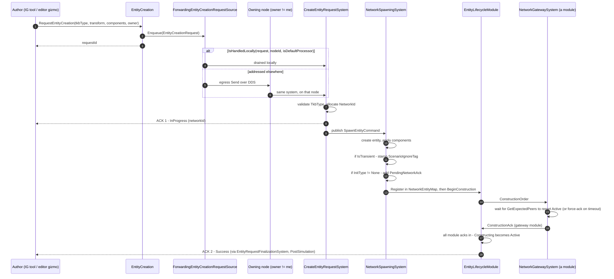
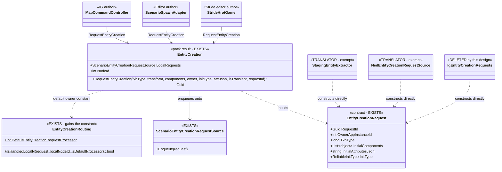

<!--STATUS
state: LIVE
updated: 2026-09-03
build-state: READY-TO-BUILD
current-answer: §4 is the API - ONE method, RequestEntityCreation, with an `owner` parameter; §4b is why
  one and not two; §4c is the creation sequence including the double ACK; §5 the per-host fit; §2 the
  author/translator rule; §7 resolves the four questions BY REASONING (R5 reverses an earlier lean; R1
  and R4 are RESTATED for the one-method shape). §7c is the one genuine product decision, and it does NOT
  block the API - the staged migration keeps today's behaviour until it is answered.
stale-below: nothing.
supersedes: DESIGN_Entity_Creation_Unification.md §3.4's TWO-METHOD API shape
  (RequestFromDefaultProcessor / CreateLocallyOwned). That section is marked SUPERSEDED and points here;
  its owner TABLE and its ReliableInitType reasoning are untouched and still live.
known-rot: R1's original argument ("a translator cannot express its case through the affordance") was
  true only of the two-method shape and is DEAD. The rule survives on §2's definition instead - stated
  in R1 as the weaker guarantee it now is.
known-conflict: none.
-->

# ⭐⭐⭐ THE UNIFIED ENTITY-AUTHORING SURFACE

> 🔒 **User, `2026-09-03`:** *"all ecs nodes must use same shared code in the same way, just configured
> differently if necessary"* · *"extending shared base is not an issue but must be well reasoned."*

⭐⭐ **The problem in one sentence:** the entity-creation **contract** (`EntityCreationRequest`) and the
**pipeline** (`EntityCreationPack`) are shared, but the **authoring surface is not built at all** — so every
host that authors an entity hand-rolls the DTO or grows a private adapter.

📄 Extends [`DESIGN_Entity_Creation_Unification.md`](DESIGN_Entity_Creation_Unification.md) §3.4 — whose
owner **table** stands, and whose two-method **API shape** this document **supersedes** with one method
*(§4b)*. Both were deferred behind `CE-143`.
⭐ **`CE-143` is now RESOLVED** — `EntityCreationRequest.InitType` exists
*(`EntityLifecycleInterfaces.cs:92`, defaulted `AllPeers`)*, so the affordances are unblocked.

---

## 1. INVENTORY

⭐ Queries run `2026-09-03`, `codebase-memory` + grep, production only *(tests/harnesses excluded)*.

```
grep -rn "new EntityCreationRequest" --include=*.cs Hrot FDP Stride     → 5 producers
grep -rn "EntityCreationPack.Build"  --include=*.cs Hrot FDP Stride     → 6 composition roots
grep -rn "\.Enqueue(new EntityCreationRequest\|Source\.Enqueue("        → 2 enqueue sites
```

### 1.1 The five producers, and what each sets

| # | producer | Owner | Components | AttrJson | RequestId | PreAllocId | ChildOverrides |
|---|---|---|---|---|---|---|---|
| ① | `StagingEntityExtractor` *(CGF scenario load)* | `0` | ✅ | — | generated | ✅ | ✅ |
| ② | `ScenarioSpawnAdapter` *(**Editor** gizmo → request)* | `cmd.OwnerNodeId` | ✅ | ✅ | ✅ passed | — | — |
| ③ | `StrideHrotGame` *(Stride editor authoring)* | `0` | ✅ | — | generated | — | — |
| ④ | `NedCgfEntityLifecycleAdapters` *(DDS wire ingress)* | `msg.Owner…` | ✅ | ✅ | ✅ passed | — | — |
| ⑤ | `IgEntityCreationRequests` *(**IG** tools → request, `2026-09-02`)* | `0` | ✅ | ✅ | ✅ passed | ✅ *(dead — always 0)* | — |

### 1.2 🔴 THE FINDING — **② and ⑤ are the SAME CLASS, written twice**

📐 `ScenarioSpawnAdapter` *(Editor)* and `IgEntityCreationRequests` *(IG)* both do exactly one thing:
**translate a host gizmo's `SpawnEntityCommand` into an `EntityCreationRequest`.** Same inputs, same
fields, same owner semantics, **two private implementations in two subsystems.**

⇒ ⭐⭐⭐ **This is not "IG is different." It is the seam law: the shared thing was never built, so the
second host to need it wrote its own — exactly as the first host had.** ⛔ A third host would write a third.

### 1.3 The six composition roots

`CgfSubsystem` · `EditorSubsystem` · `IgNodeBootstrapper` · `SimHostNodeBootstrapper` ·
`StrideNodeBootstrapper` · `EditorStrideSubsystem`. ⭐ All six build the pack; all six therefore already
hold a `creation.LocalRequests` — **the affordance has a home on every host with no new plumbing.**

---

## 2. ⭐⭐⭐ THE RULE — **AUTHOR vs TRANSLATOR**

⛔ **This distinction is currently INFERRED, not written down anywhere.** It is the load-bearing rule of
this document, and `§7 Q1` asks for it to be ratified.

| role | definition | must use the affordance? |
|---|---|---|
| ⭐⭐ **AUTHOR** | a **new intent originates here** — a human gesture, an AI decision, a tool. Nothing outside has decided the fields yet | ⭐⭐⭐ **YES — always** |
| ⭐ **TRANSLATOR** | an **existing external representation** is being mapped in — a scenario file, a DDS sample, another node's message. The representation already fixed the fields | ⛔ **NO — it constructs the DTO directly, and that is correct** |

⭐ **Why translators are exempt and it is not a loophole:** an affordance's job is to make the *authoring
choice* explicit — *"do I own this, or does the arbiter?"* 📐 A translator has no such choice: the owner
arrived in the message. ⛔ Forcing it through an affordance would mean inventing an authoring intent it
does not have.

⇒ ① `StagingEntityExtractor` and ④ NED ingress are **translators** — they stay as they are, and
`§7 Q1`'s ratification is what stops a future session reading them as violations.

---

## 3. WHY THE THREE EXTRA PARAMETERS — **each justified, or excluded**

⛔ §3.4's proposed shape is `(tkbType, transform, initialComponents, initType)`. Three fields beyond it
appear in the producer table. **Two are in, one is out.**

| field | verdict | reasoning |
|---|---|---|
| `owner` | ✅ **IN — and it is what collapsed two methods into one** | 📐 the sole routing input *(`EntityCreationRouting.cs:47-51`)*, with **three** legal values ⇒ a parameter, not a verb. 📄 §4b |
| `isTransient` | ✅ **IN** | ⭐ `R5` below — a per-request property exactly like `initType`; omitting it forces callers to bypass the affordance |
| `initType` | ✅ **already designed** | §3.4: *"both affordances take an explicit `initType`, defaulted to `AllPeers` so adoption changes nothing"*, and *"IG's drawings pass `None`"*. ⭐ §4c shows what it buys: it is the `PendingNetworkAck` that makes `NetworkGatewaySystem` wait for peers |
| `initialAttributesJson` | ✅ **IN** | 📐 the operator's placement command carries property JSON — `MapCommandController.ActivatePlacementCommand(…, initialPropertiesJson)` → `EntityPlacementGizmo.cs:219`, railed as `EPG-006`. ⭐ It is an **authoring input**: the human typed it |
| `requestId` | ✅ **IN** | 📐 `MapCommandController` correlates the two-phase ACK through `_pendingEntityRequests[RequestId]`; it cannot let the affordance mint one. ⭐ An **author that must be told the outcome** needs to name its request |
| `preAllocatedNetworkId` | ⛔ **OUT** | 📐 one producer only — ① the scenario **extractor**, a translator. ⚠ ⑤ passes it today and it is **dead**: every IG tool sets `NetworkId = 0` *(`IgApplication.cs:3562`, `:3662`)* |
| `childComponentOverrides` | ⛔ **OUT** | 📐 one producer only — ① again. Bulk scenario shape, not an authoring choice |

⚠⚠ **The justification that was WRONG and is corrected here.** An earlier pass argued
`initialAttributesJson` and `requestId` were justified *"because ② and ④ already use them."* ⛔ ② and ④ are
a **translator** and a **wire adapter** — counting them as peers of an authoring API was invalid.
⭐ **The real argument is a capability one:** IG is the first *author* whose gesture carries
operator-supplied properties **and** must correlate an ACK. The Stride editor authors without either,
which is exactly why both parameters are **optional with defaults**.

⭐⭐ **Geometry needs NOTHING.** `InitialComponents` is `List<object>` and all five producers already use
it. `EditablePolyline` / `RoutePlan` are ordinary ECS components in that list, exactly like `SimTransform`
and `TkbIdentity`. ⛔ **The shared base never learns what a polyline is** — no geometry-shaped parameter,
now or later.

---

## 4. THE API — **ONE method**

```csharp
// on EntityCreation (the pack result object)
Guid RequestEntityCreation(
        long tkbType,
        SimTransform? transform                  = null,
        IReadOnlyList<object>? initialComponents = null,
        int owner        = EntityCreationRouting.DefaultEntityCreationRequestProcessor,   // 0
        ReliableInitType initType                = ReliableInitType.AllPeers,
        string? initialAttributesJson            = null,
        bool isTransient                         = false,
        Guid requestId                           = default);
```

```csharp
// the arbiter owns and runs genesis — today's behaviour, and the overwhelming majority of call sites
creation.RequestEntityCreation(tkbType, transform, components);

// I own this: full lifecycle locally, and nobody has to ACK a scratch drawing
creation.RequestEntityCreation(tkbType, transform, components,
                               owner: creation.NodeId, initType: ReliableInitType.None);

// a third node by name — expressible, with no third method
creation.RequestEntityCreation(tkbType, transform, components, owner: thatNodeId);
```

| ⭐ | |
|---|---|
| ⭐⭐⭐ **ONE method, an `owner` argument** | 🔒 **User, `2026-09-03`:** *"the node simply says who is the executor and default owner in its request… whoever it is, it calls entity creation on its node as if it was a local request. no difference between if the request comes from the same node or other."* — ⭐ §4b measures that this is exactly what the code does |
| ⭐⭐ **`owner` is an `int` node id, not a bool or an enum** | ⛔ **the domain has three values, not two** *(`0`, `localNodeId`, *"a third node by name"* — §3.4's own table)*. A two-valued affordance leaves the third with no expression, and its author hand-rolls the DTO |
| ⭐ **the default is a NAMED constant** | `DefaultEntityCreationRequestProcessor` ⇒ an omitted `owner` reads as a decision, not as a forgotten `0`. 🔒 User: *"rather long than misleading"* |
| **returns the `Guid`** | the request id — minted when the caller passed `default`, echoed when it supplied one. ⭐ An author that wants the ACK keeps it; one that does not, ignores it |
| ⛔ **no policy table, no TKB flag, no config switch** | 🔒 §3.4: *"only concrete authoring code picks the way it needs"* |
| **lives on `EntityCreation`** | the pack's result object, which every one of the six roots already holds. ⛔ No new seam, no new constructor argument. ⭐ `creation.NodeId` is already on it, so *"mine"* needs no extra lookup |

### 4b. ⭐⭐ WHY ONE METHOD — **the measurement, not a preference**

⛔ §3.4 specified **two** methods, `RequestFromDefaultProcessor` / `CreateLocallyOwned`. ⭐⭐ **That shape is
SUPERSEDED, and the reason is measurable in three files:**

| the claim the two-method shape rested on | code — how it IS | design basis — how it was MEANT to be |
|---|---|---|
| the two paths are two **behaviours** | ⛔ **FALSE.** `CreateEntityRequestSystem` drains a **composite** of the local and the wire source and cannot distinguish them; the sole routing input is `EntityCreationRouting.IsHandledLocally(request, localNodeId, isDefaultProcessor)` *(`EntityCreationRouting.cs:47-51`)*, which reads **`OwnerAppInstanceId` only** | ⭐ §3.4's own words: *"the routing is ONE FIELD"* — ⇒ the design already said it; the API shape contradicted the design |
| provenance *(who authored it)* affects servicing | ⛔ **FALSE — never consulted.** `EntityCreationRequest` carries no origin field | ⭐ `Q65` §4: `isDefaultProcessor` is a **broadcast tiebreaker**, not an authority gate |
| two values are enough | ⛔ **FALSE.** §3.4's table has **three** rows: `0`, `localNodeId`, *"a third node by name"* | ⭐ the wire ingress already receives arbitrary owners *(`NedCgfEntityLifecycleAdapters.cs:78`)* |

⇒ ⭐⭐⭐ **Two verbs for one field name the ARGUMENT, not the behaviour.** ⛔ And they cannot express row 3,
so the affordance would have had a hole exactly where a future multi-node deployment needs it.

#### ⭐ Where the constant lives

⭐⭐ **`EntityCreationRouting.DefaultEntityCreationRequestProcessor = 0`** — 📐 that class is *"THE Level-1
routing rule in exactly ONE place"* and **already contains the literal**: `bool isDefaultTarget =
targetNodeId == 0` *(`:49`)*. ⇒ ⭐ the constant is not new vocabulary, it is a **name for a magic number that
already had a meaning there**, and the routing rule adopts it in the same edit. ⛔ Not on
`EntityCreationRequest` — the DTO carries the value, it does not interpret it.

---

## 4c. ⭐⭐⭐ WHAT THE AUTHOR SET IN MOTION — **the full creation sequence, including the double ACK**

> 🔒 **User, `2026-09-03`:** *"pls explain the sequence of entity creation including the double ack."*
> ⭐ It belongs here because it is what the **one** parameter `owner` selects between, and because
> `requestId` (§3) only makes sense once the ACK stream is on the page.

### ⚠⚠ THREE DIFFERENT THINGS ARE CALLED AN "ACK" — **and conflating them is how the F4 hazard was mis-read**

| # | the ack | who sends it | who waits for it | scope |
|---|---|---|---|---|
| ⭐ **A** | `ConstructionAck { ModuleId }` | ⭐⭐ **each ECS MODULE on the servicing node**, when its own components are ready | `EntityLifecycleModule` — flips `Constructing → Active` when **all** registered modules have acked | ⛔ **NODE-LOCAL.** 📄 `FDP/Docs/projects/toolkits/FDP.Toolkit.Lifecycle.md` §2 |
| ⭐ **B** | *(the peer wait — no message of its own)* | ⭐⭐ **`NetworkGatewaySystem`, which is itself one of those modules**, by **withholding its own `ConstructionAck`** | the same ELM tally | ⭐ cross-node, but expressed entirely as **A**. `GetExpectedPeers((long)pendingInfo.ExpectedType)` → wait for every peer to report `Active`; **`peerSet.Count == 0` ⇒ ack immediately**; a `reliableInitTimeoutFrames` **force-ack** prevents deadlock *(`NetworkGatewaySystem.cs:112-165`)* |
| ⭐⭐⭐ **C** | `CreateUpdateDeleteEntityAck` — **the DOUBLE ACK** | `CreateEntityRequestSystem` *(phase 1)* and `EntityRequestFinalizationSystem` *(phase 2)* | **the AUTHOR**, keyed by `RequestId` | ⭐ the request/response protocol — the only one an authoring call site ever sees |

⛔⛔ **Only C is "the double ack".** ⭐ **A** is a module-readiness tally and **B** is one module being slow
on purpose. 📌 **This distinction dissolved the blocker that stopped F4** *(scheduling `NetworkSpawningSystem`
on IG)*: the fear was *"teardown waits for cluster acks, so a non-owning node could stall"* — false, because
the acks are **local module acks**, and `.dev/_DONE/two-ack/TwoAck-DESIGN.md` §6 states the invariant
*"the ELM and `NetworkSpawningSystem` remain pure, generic ECS systems."*

### ⭐⭐ THE DOUBLE ACK — **why two, and what each one promises**

| phase | status | sent when | what the author may conclude |
|---|---|---|---|
| **1** | `InProgress` | ⭐ **immediately**, the same tick the request is drained, right after the network id is allocated *(`CreateEntityRequestSystem.cs:207-211`)* | *"accepted, and here is your `NetworkId`"* — ⛔ the entity does **not** exist yet |
| **2** | `Success` | ⭐ in `PostSimulation`, once the entity is **in the `NetworkEntityMap`** *(**A**+**B** complete)* | *"it exists, it is `Active`, and every peer that had to know does"* |

⇒ ⭐ **Phase 1 exists for LATENCY** — 📐 the header says it verbatim: *"so the ExCon client unblocks with
minimal latency"*. ⛔ A single ack could not do both jobs: an early one cannot promise existence, and a late
one leaves a remote operator's UI blocked for the whole peer handshake.
⚠ **The failure arms are phase 1 too** — a bad `TkbType` answers `UnknownDescriptorType` and there is no
phase 2. ⇒ ⭐ **an author that waits must accept `InProgress`, `Success` *or* a rejection.**



⭐⭐ **What the diagram makes visible, and why it belongs in an AUTHORING design:**
**the branch is the ONLY thing `owner` controls, and everything after it is identical.** ⛔ There is no
second pipeline for *"my own"* entities — 🔒 exactly the user's *"as if it was a local request."*
⇒ ⭐ that is the structural reason §4 is **one** method.

---

## 5. PER-HOST FIT

| host | authors? | today | after |
|---|---|---|---|
| ⭐ **IG** | ✅ operator draws / places | ⑤ private adapter `IgEntityCreationRequests` | `RequestEntityCreation(...)` — ⭐ adapter **deleted** |
| ⭐ **Editor** | ✅ gizmo placement | ② private adapter `ScenarioSpawnAdapter` builds the DTO | the adapter keeps its gizmo/undo duties but **calls the affordance** instead of constructing |
| ⭐ **Stride editor** *(`StrideHrotGame`)* | ✅ places an entity | ③ hand-rolled DTO, 12 lines | `RequestEntityCreation(tkbType, transform, components)` |
| **CGF** | ⛔ **none** — it **loads** *(①, via two load handlers)* and arbitrates | ① translator | unchanged *(`§7 Q2` closed)* |
| **SimHost** | ⛔ no producer at all | — | unchanged — it **services** requests, it does not author them |
| **Stride node** *(`StrideNodeBootstrapper`)* | ⛔ no producer | — | unchanged |

⇒ ⭐⭐ **Three authors, and all three converge on one call.** ⛔ Two of the three are outside IG, which is
what makes this a shared surface rather than a helper with one user.

---

## 6. UML



📄 **The `sequenceDiagram` is §4c** — the full authoring call through both routings, both ACK phases and
the ELM handshake. ⛔ It is **not** redrawn here: 🔒 *"never both for the same thing — two pictures of one
architecture rot apart."*

---

## 7. ⭐⭐⭐ THE FOUR QUESTIONS — **RESOLVED BY REASONING, not by ruling**

> 🔒 **User, `2026-09-03`:** *"the questions you are asking should be answered by your reasoning, not my
> ruling."* ⭐ Each below is decided by a measurement or by a consequence of a rule already ruled, not by
> preference. ⚠ **`R5` REVERSES the lean an earlier pass gave.**

### R1 — the AUTHOR/TRANSLATOR rule stands, but on a DIFFERENT argument ⚠ *(restated `2026-09-03`)*

⚠⚠ **The original argument DIED with the two-method shape, and saying so is the honest version.** It ran:
*"the affordance offers only `0` and `NodeId`, the wire ingress receives an arbitrary owner, therefore a
translator cannot express its case."* ⛔ **§4's `owner` parameter takes any node id** ⇒ that impossibility is
gone, and a translator now *could* call `RequestEntityCreation`.

⭐⭐ **The rule survives because its real basis was never the signature — it is §2's definition.** A
translator has **no authoring choice to make**: the owner, the components and the id all arrived in the
representation it is mapping. ⇒ routing it through the affordance would add a defaulting layer over fields
that are already fully determined, and 📌 the two translators do things the affordance deliberately excludes
*(`preAllocatedNetworkId`, `childComponentOverrides` — §3)*.

⇒ ⭐ **Translators are now exempt by DEFINITION rather than excluded by construction.** ⚠ **That is a weaker
guarantee, and it is stated as one:** the check is §2's table and acceptance ⑥, not the type system.

### R2 — CGF has no authoring site ✅ *(measured, see §5)*

### R3 — `ScenarioSpawnAdapter` becomes a THIN CALLER, and loses a latent hazard ✅

📐 Measured, it owns three things: **gizmo lifetime** *(`Unregister(id)`, `autoPopOnPlace`)*, the
**transform/velocity folding** into `InitialComponents` *(`:118-127`)*, and a **null-source fallback**.
⇒ deleting it would lose the first two ⇒ **thin caller**, not deletion.

🔴 **And the fallback is a latent instance of the hazard this programme just removed from IG.**
📐 `if (_requestSource != null) { Enqueue } else { _bus.PublishManaged(cmd); }` — the else branch publishes
the **ORDER**, on a host that composes the pack and therefore registers the spawn system. ⚠ It is **dead
today** *(`EditorSubsystem.cs:2093` always passes `creation.LocalRequests`)*, but it is the silent-default
shape: an optional dependency whose absence changes behaviour instead of failing.
⇒ ⭐⭐ **The affordance removes it by construction** — there is no way to call
`creation.RequestFromDefaultProcessor(...)` without a `creation`.

### R4 — the *"who owns it"* axis ships NOW, and the question it once raised DISSOLVES ✅ ⚠ *(restated `2026-09-03`)*

⛔ The original question was *"do we ship a second method with no caller?"* ⭐⭐ **With one method it is not a
question at all** — `owner` is a parameter, so the second path costs **zero new surface** and cannot be a
dead method.

📐 §3.4's own table, row 2, still names its first user: *"an entity it owns itself **(IG map drawings shared
between IGs)** → `OwnerAppInstanceId = localNodeId`."* ⚠⚠ Those drawings are untargeted **today** only
because the retired `SpawnEntityCommandEgressTranslator` wrote `Owner = default` and ignored
`cmd.OwnerNodeId` *(§1.1 ⑤)*. ⇒ ⭐ **passing `owner: creation.NodeId` at IG's drawing tools is a SEPARATE
behavioural step** — see `§7c` — and the API is ready for it either way.

### R5 — ⚠ **REVERSED: `isTransient` DOES belong on the signature** ✅

⛔ **An earlier pass leaned "leave it off until the product question is answered." That was wrong**, and the
reason is a consistency argument that applies equally to a parameter already ruled in.

📐 `isTransient` is a **per-request property, exactly like `initType`** — and §3.4 puts `initType` on the
signature with a default precisely so *"adoption changes nothing"*. ⇒ ⛔ **omitting `isTransient` forces any
caller that needs it to bypass the affordance and hand-roll the DTO** — which is the disease this document
treats. ⭐ **Include it, defaulted `false`.**

⚠ **What stays open is a CALL-SITE question, not a signature question:** *which* IG tools pass `true`.
📐 The tension is real and recorded — `R-140` says an IG-owned entity is disposable, yet the tac-graphic
overlay descriptor is built `PersistenceMode.MODE_PERSISTENT`. ⇒ that is `§7c`, and it does not block the
API.

---

## 7c. ⛔ THE ONE THING THAT IS GENUINELY A PRODUCT DECISION

⭐⭐ **Are IG's map drawings IG-owned-and-disposable, or arbiter-owned-and-persistent?** ⛔ **Not answerable
from code**, and the two records conflict:

| says disposable | says persistent |
|---|---|
| 🔒 `R-140`: *"IF IG crashes, its entities are gone, but no one cares, they were temporary anyway"* | 📐 the overlay descriptor is emitted `PersistenceMode.MODE_PERSISTENT` *(`CreateEntityRequestDescriptorBuilder`)* |
| §3.4 row 2 puts IG map drawings at `OwnerAppInstanceId = localNodeId` ⇒ under `R-140`, non-persistable | 📐 today they are untargeted ⇒ CGF owns and **saves** them |

⇒ ⭐ **This design does NOT decide it, and does not need to.** ⛔ The API carries both axes; the call sites
choose. ⚠ **The migration is deliberately staged:** IG's tools keep the default `owner` +
`isTransient: false` — today's exact behaviour — until this is answered. 📄 The answer belongs with the
scenario-saving question already parked in
[`DESIGN_Node_Roles_And_Policies.md`](DESIGN_Node_Roles_And_Policies.md) §8.

---

## 7b. ⛔ SCOPE BOUNDARY — **what this surface does NOT cover**

⭐⭐ **Only NETWORKED entities** — those that get a `NetworkIdentity`, replicate, and may be persisted.

📐 Measured: the AI's EQS sensor children are created and destroyed straight through `ctx.World` and
`ecb.DestroyEntity` *(`EqsLifecycleNodes.cs:227,277-282`)*. They are **local probe entities** — no network
id, no replication, no scenario. ⛔ **They must NOT be routed through this affordance**: it would give them
network identity and a lifecycle handshake they have no use for.

⇒ ⭐ **The trigger for "must I use the affordance?" is `does this entity need a network identity?`**, not
"am I creating an entity".

---

## 8. ACCEPTANCE

| # | |
|---|---|
| ① | `RequestEntityCreation` exists on `EntityCreation`, `owner` defaulted to `EntityCreationRouting.DefaultEntityCreationRequestProcessor` and `initType` to `AllPeers` |
| ①b | ⭐ `EntityCreationRouting` **carries the constant and uses it** — `:49`'s literal `0` is gone. ⛔ Not a second definition of the number |
| ② | `IgEntityCreationRequests` is **deleted**; IG's two controllers call the affordance |
| ③ | `StrideHrotGame` and `ScenarioSpawnAdapter` call the affordance — ⭐ **three authors, one call** |
| ④ | a rail on a **production-built** pack: the default yields `OwnerAppInstanceId == 0`; `owner: NodeId` yields `== NodeId`; ⭐ **`owner: 7` yields `== 7`** — the third case the two-method shape could not express |
| ⑤ | a rail: the returned `Guid` equals a caller-supplied `requestId`, and is non-empty when omitted |
| ⑥ | ① and ④ *(the two translators)* still construct the DTO directly, and §2's rule says so in writing |
| ⑦ | `design-digest.py --check` and `mermaid-check.mjs` pass |
