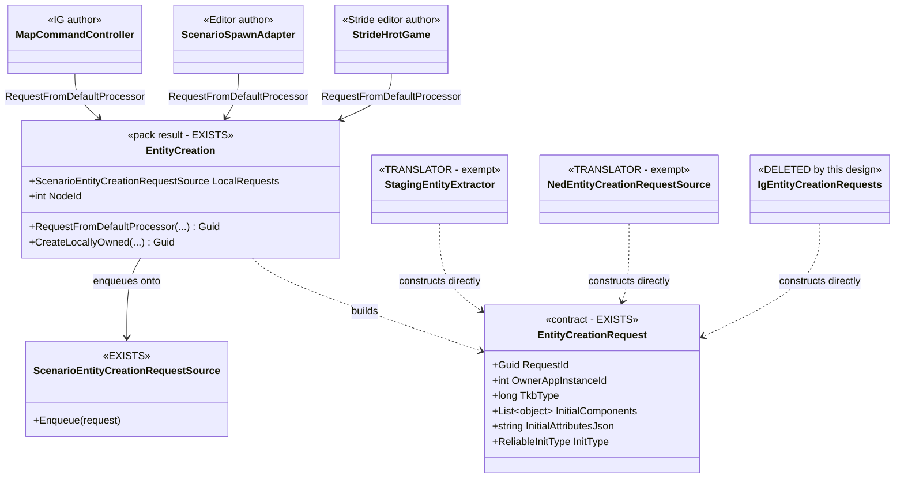
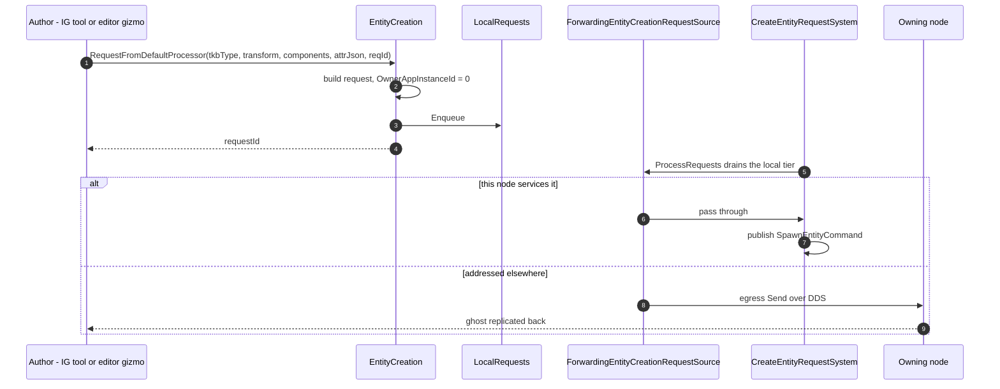

<!--STATUS
state: LIVE
updated: 2026-09-03
build-state: DESIGN
current-answer: §4 is the API; §5 is the per-host fit; §6 the author/translator rule. §7 carries the
  open questions that need a decision before this becomes READY-TO-BUILD.
stale-below: nothing.
known-conflict: none. This EXTENDS DESIGN_Entity_Creation_Unification.md §3.4, which specified the two
  affordances and their two-name/one-field shape; nothing here overturns it.
-->

# ⭐⭐⭐ THE UNIFIED ENTITY-AUTHORING SURFACE

> 🔒 **User, `2026-09-03`:** *"all ecs nodes must use same shared code in the same way, just configured
> differently if necessary"* · *"extending shared base is not an issue but must be well reasoned."*

⭐⭐ **The problem in one sentence:** the entity-creation **contract** (`EntityCreationRequest`) and the
**pipeline** (`EntityCreationPack`) are shared, but the **authoring surface is not built at all** — so every
host that authors an entity hand-rolls the DTO or grows a private adapter.

📄 Extends [`DESIGN_Entity_Creation_Unification.md`](DESIGN_Entity_Creation_Unification.md) §3.4, which
specified `RequestFromDefaultProcessor` / `CreateLocallyOwned` and deferred them behind `CE-143`.
⭐ **`CE-143` is now RESOLVED** — `EntityCreationRequest.InitType` exists
*(`EntityLifecycleInterfaces.cs:92`, defaulted `AllPeers`)*, so the affordances are unblocked.

---

## 1. INVENTORY

⭐ Queries run `2026-09-03`, `codebase-memory` + grep, production only *(tests/harnesses excluded)*.

```
grep -rn "new EntityCreationRequest" --include=*.cs Hrot FDP Stride     → 5 producers
grep -rn "EntityCreationPack.Build"  --include=*.cs Hrot FDP Stride     → 6 composition roots
grep -rn "\.Enqueue(new EntityCreationRequest\|Source\.Enqueue("        → 2 enqueue sites
```

### 1.1 The five producers, and what each sets

| # | producer | Owner | Components | AttrJson | RequestId | PreAllocId | ChildOverrides |
|---|---|---|---|---|---|---|---|
| ① | `StagingEntityExtractor` *(CGF scenario load)* | `0` | ✅ | — | generated | ✅ | ✅ |
| ② | `ScenarioSpawnAdapter` *(**Editor** gizmo → request)* | `cmd.OwnerNodeId` | ✅ | ✅ | ✅ passed | — | — |
| ③ | `StrideHrotGame` *(Stride editor authoring)* | `0` | ✅ | — | generated | — | — |
| ④ | `NedCgfEntityLifecycleAdapters` *(DDS wire ingress)* | `msg.Owner…` | ✅ | ✅ | ✅ passed | — | — |
| ⑤ | `IgEntityCreationRequests` *(**IG** tools → request, `2026-09-02`)* | `0` | ✅ | ✅ | ✅ passed | ✅ *(dead — always 0)* | — |

### 1.2 🔴 THE FINDING — **② and ⑤ are the SAME CLASS, written twice**

📐 `ScenarioSpawnAdapter` *(Editor)* and `IgEntityCreationRequests` *(IG)* both do exactly one thing:
**translate a host gizmo's `SpawnEntityCommand` into an `EntityCreationRequest`.** Same inputs, same
fields, same owner semantics, **two private implementations in two subsystems.**

⇒ ⭐⭐⭐ **This is not "IG is different." It is the seam law: the shared thing was never built, so the
second host to need it wrote its own — exactly as the first host had.** ⛔ A third host would write a third.

### 1.3 The six composition roots

`CgfSubsystem` · `EditorSubsystem` · `IgNodeBootstrapper` · `SimHostNodeBootstrapper` ·
`StrideNodeBootstrapper` · `EditorStrideSubsystem`. ⭐ All six build the pack; all six therefore already
hold a `creation.LocalRequests` — **the affordance has a home on every host with no new plumbing.**

---

## 2. ⭐⭐⭐ THE RULE — **AUTHOR vs TRANSLATOR**

⛔ **This distinction is currently INFERRED, not written down anywhere.** It is the load-bearing rule of
this document, and `§7 Q1` asks for it to be ratified.

| role | definition | must use the affordance? |
|---|---|---|
| ⭐⭐ **AUTHOR** | a **new intent originates here** — a human gesture, an AI decision, a tool. Nothing outside has decided the fields yet | ⭐⭐⭐ **YES — always** |
| ⭐ **TRANSLATOR** | an **existing external representation** is being mapped in — a scenario file, a DDS sample, another node's message. The representation already fixed the fields | ⛔ **NO — it constructs the DTO directly, and that is correct** |

⭐ **Why translators are exempt and it is not a loophole:** an affordance's job is to make the *authoring
choice* explicit — *"do I own this, or does the arbiter?"* 📐 A translator has no such choice: the owner
arrived in the message. ⛔ Forcing it through an affordance would mean inventing an authoring intent it
does not have.

⇒ ① `StagingEntityExtractor` and ④ NED ingress are **translators** — they stay as they are, and
`§7 Q1`'s ratification is what stops a future session reading them as violations.

---

## 3. WHY THE THREE EXTRA PARAMETERS — **each justified, or excluded**

⛔ §3.4's proposed shape is `(tkbType, transform, initialComponents, initType)`. Three fields beyond it
appear in the producer table. **Two are in, one is out.**

| field | verdict | reasoning |
|---|---|---|
| `initType` | ✅ **already designed** | §3.4: *"both affordances take an explicit `initType`, defaulted to `AllPeers` so adoption changes nothing"*, and *"IG's drawings pass `None`"* |
| `initialAttributesJson` | ✅ **IN** | 📐 the operator's placement command carries property JSON — `MapCommandController.ActivatePlacementCommand(…, initialPropertiesJson)` → `EntityPlacementGizmo.cs:219`, railed as `EPG-006`. ⭐ It is an **authoring input**: the human typed it |
| `requestId` | ✅ **IN** | 📐 `MapCommandController` correlates the two-phase ACK through `_pendingEntityRequests[RequestId]`; it cannot let the affordance mint one. ⭐ An **author that must be told the outcome** needs to name its request |
| `preAllocatedNetworkId` | ⛔ **OUT** | 📐 one producer only — ① the scenario **extractor**, a translator. ⚠ ⑤ passes it today and it is **dead**: every IG tool sets `NetworkId = 0` *(`IgApplication.cs:3562`, `:3662`)* |
| `childComponentOverrides` | ⛔ **OUT** | 📐 one producer only — ① again. Bulk scenario shape, not an authoring choice |

⚠⚠ **The justification that was WRONG and is corrected here.** An earlier pass argued
`initialAttributesJson` and `requestId` were justified *"because ② and ④ already use them."* ⛔ ② and ④ are
a **translator** and a **wire adapter** — counting them as peers of an authoring API was invalid.
⭐ **The real argument is a capability one:** IG is the first *author* whose gesture carries
operator-supplied properties **and** must correlate an ACK. The Stride editor authors without either,
which is exactly why both parameters are **optional with defaults**.

⭐⭐ **Geometry needs NOTHING.** `InitialComponents` is `List<object>` and all five producers already use
it. `EditablePolyline` / `RoutePlan` are ordinary ECS components in that list, exactly like `SimTransform`
and `TkbIdentity`. ⛔ **The shared base never learns what a polyline is** — no geometry-shaped parameter,
now or later.

---

## 4. THE API

```csharp
// PATH 1 — the cluster's arbiter owns and runs genesis. OwnerAppInstanceId = 0.
Guid RequestFromDefaultProcessor(
        long tkbType,
        SimTransform? transform                     = null,
        IReadOnlyList<object>? initialComponents    = null,
        ReliableInitType initType                   = ReliableInitType.AllPeers,
        string? initialAttributesJson               = null,
        Guid requestId                              = default);

// PATH 2 — I own this, full lifecycle locally. OwnerAppInstanceId = NodeId.
Guid CreateLocallyOwned( /* identical parameter list */ );
```

| ⭐ | |
|---|---|
| **returns the `Guid`** | the request id — minted when the caller passed `default`, echoed when it supplied one. ⭐ An author that wants the ACK keeps it; one that does not, ignores it |
| **two names, one field apart** | §3.4's rule, unchanged: the *only* difference is `OwnerAppInstanceId` = `0` vs `NodeId` |
| ⛔ **no bool, no policy table, no TKB flag** | 🔒 §3.4: *"only concrete authoring code picks the way it needs"* — and this codebase has had **five** silent-default defects from boolean parameters |
| **lives on `EntityCreation`** | the pack's result object, which every one of the six roots already holds. ⛔ No new seam, no new constructor argument |

---

## 5. PER-HOST FIT

| host | authors? | today | after |
|---|---|---|---|
| ⭐ **IG** | ✅ operator draws / places | ⑤ private adapter `IgEntityCreationRequests` | `RequestFromDefaultProcessor(...)` — ⭐ adapter **deleted** |
| ⭐ **Editor** | ✅ gizmo placement | ② private adapter `ScenarioSpawnAdapter` builds the DTO | the adapter keeps its gizmo/undo duties but **calls the affordance** instead of constructing |
| ⭐ **Stride editor** *(`StrideHrotGame`)* | ✅ places an entity | ③ hand-rolled DTO, 12 lines | `RequestFromDefaultProcessor(tkbType, transform, components)` |
| **CGF** | ⛔ **none** — it **loads** *(①, via two load handlers)* and arbitrates | ① translator | unchanged *(`§7 Q2` closed)* |
| **SimHost** | ⛔ no producer at all | — | unchanged — it **services** requests, it does not author them |
| **Stride node** *(`StrideNodeBootstrapper`)* | ⛔ no producer | — | unchanged |

⇒ ⭐⭐ **Three authors, and all three converge on one call.** ⛔ Two of the three are outside IG, which is
what makes this a shared surface rather than a helper with one user.

---

## 6. UML





---

## 7. ⭐ OPEN QUESTIONS — **need a ruling before READY-TO-BUILD**

| # | question | ⭐ lean |
|---|---|---|
| **Q1** | Ratify the **AUTHOR / TRANSLATOR** rule of §2 as canon? | ⭐⭐ **yes.** Without it, ① and ④ read as permanent violations and the rule gets re-litigated on every grep of `new EntityCreationRequest` |
| **Q2** | ✅ **CLOSED `2026-09-03` — CGF has NO authoring site.** 📐 Swept: its only two enqueue paths are `CgfEpisodeLoadHandler` and `CgfScenarioLoadHandler`, both consuming `_pendingRequests` produced by ① `StagingEntityExtractor` ⇒ **translators**, exempt by §2. ⚠ The AI's EQS sensor children *(`EqsLifecycleNodes.Action_SpawnEqsSensorChild`)* create and destroy through `ctx.World` / `ecb.DestroyEntity` **directly** — local non-networked entities that never enter this pipeline, so they are out of scope | — |
| **Q3** | Does `ScenarioSpawnAdapter` become a **thin caller**, or is it deleted like IG's? | ⭐ **thin caller.** 📐 It also owns gizmo lifetime and an offline `PublishManaged` fallback — real duties beyond the DTO. ⛔ Deleting it would lose those |
| **Q4** | Should `CreateLocallyOwned` ship now, with **no caller**? | ⭐⭐ **yes, both together.** §3.4 defines them as a pair whose whole point is the choice; shipping one makes the choice invisible. ⚠ But it is a knowingly-unused method until a host wants row 2 |
| **Q5** | `IsTransient` — an affordance parameter, or set by the caller afterwards? | ⛔ **not decided.** `D2` built the flag; **which IG affordances author sketches is still a product call**. ⭐ Lean: **leave it off the signature** until that product question is answered, rather than shipping a parameter nobody can correctly set |

---

## 7b. ⛔ SCOPE BOUNDARY — **what this surface does NOT cover**

⭐⭐ **Only NETWORKED entities** — those that get a `NetworkIdentity`, replicate, and may be persisted.

📐 Measured: the AI's EQS sensor children are created and destroyed straight through `ctx.World` and
`ecb.DestroyEntity` *(`EqsLifecycleNodes.cs:227,277-282`)*. They are **local probe entities** — no network
id, no replication, no scenario. ⛔ **They must NOT be routed through this affordance**: it would give them
network identity and a lifecycle handshake they have no use for.

⇒ ⭐ **The trigger for "must I use the affordance?" is `does this entity need a network identity?`**, not
"am I creating an entity".

---

## 8. ACCEPTANCE

| # | |
|---|---|
| ① | both affordances exist on `EntityCreation`, `initType` defaulted `AllPeers` |
| ② | `IgEntityCreationRequests` is **deleted**; IG's two controllers call the affordance |
| ③ | `StrideHrotGame` and `ScenarioSpawnAdapter` call the affordance — ⭐ **three authors, one call** |
| ④ | a rail: `RequestFromDefaultProcessor` yields `OwnerAppInstanceId == 0`, `CreateLocallyOwned` yields `== NodeId`, on a **production-built** pack |
| ⑤ | a rail: the returned `Guid` equals a caller-supplied `requestId`, and is non-empty when omitted |
| ⑥ | ① and ④ still construct the DTO directly, and §2's rule says so in writing |
| ⑦ | `design-digest.py --check` and `mermaid-check.mjs` pass |
