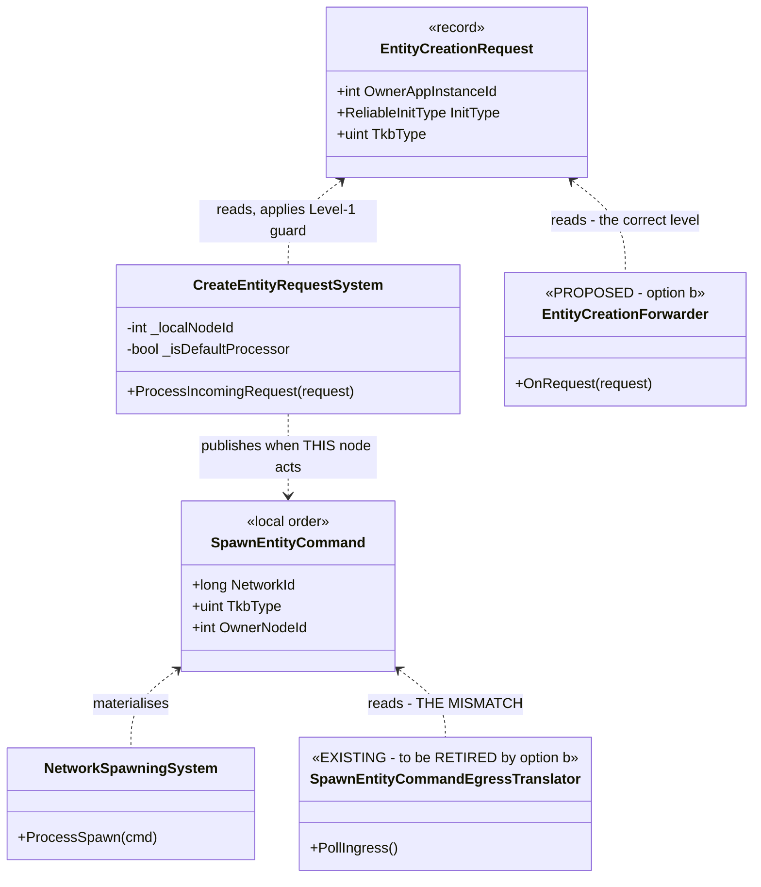
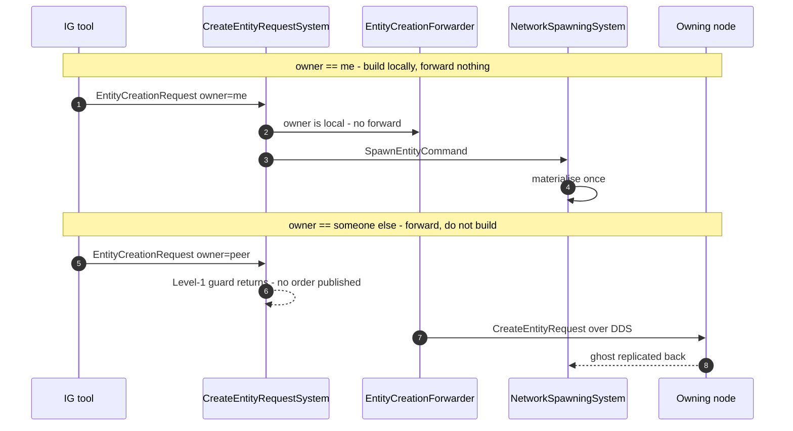
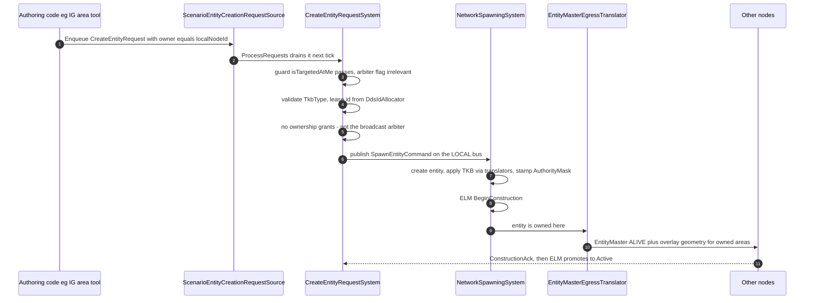
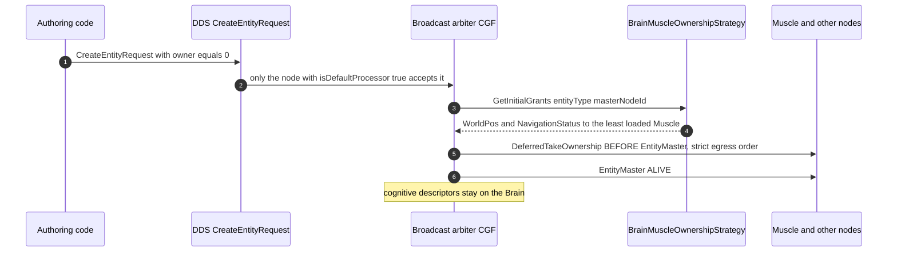

<!--STATUS
state: LIVE
updated: 2026-08-31
build-state: BUILDING
current-answer: §5 is the plan. Steps 1, 2 and 4 are BUILT. Step 1 + 2 (2026-08-30): TkbTranslatorSet is
  the one base list and all five spawning sites use it. Step 4 (2026-08-31): the UrbanCombat templates
  live in Hrot.Core.Tkb.UrbanCombatTkbCatalog, seeded from HrotEnvironment.CreateTkb() — §3.3's AS-BUILT
  block is authoritative, and it corrects three false premises. NOT STARTED: step 3, the
  EntityCreationPack (§3, §3.4 for the two authoring affordances, UML in §4). ⛔ Before step 3, do
  obstacle 1 — move CreateEntityRequestSystem + EntityRequestFinalizationSystem +
  DeleteEntityRequestSystem to Hrot.Core/Network (Q65 §5.4). ⛔ IG's step-3 adoption is ATOMIC with
  Q65-A' + CE-143 + CE-144 (Q65 §6's ordering hazard).
known-rot: §2.3's Role-selected HALVES are SUPERSEDED — Architect_Question_65 §4 resolved the question
  and there is ONE uniform pipeline. §2.3 is kept only as HISTORY. §3's Role invariant (item 4) still says
  "role decides which half"; that wording is stale and must be read against Q65 §4.
known-rot: the scorecard row and the composition sentence in §2.4 were corrected 2026-08-31 — ghost
  promotion is gated by the NodeRole inside NedReplicationModule, NOT by host composition, so the
  EntityCreationPack registers the two SPAWN systems only. Q65 §4's Q65-B carries the measurement.
known-rot: §2.3's "halves" language is dead everywhere it appeared. Removed from §3.1 invariant 4 and
  from §5.1 on 2026-08-31 under the user's no-suppression ruling (§3.1 invariant 6). §2.3 itself stays
  as HISTORY only. Any reader finding "which half" in this file outside a HISTORY block has found rot.
current-answer-note: §3.4 is the NEW load-bearing section (2026-08-31) — the two authoring affordances
  and the per-tier measurement of what each path already has. Read it before §5's sequencing.
approved: 2026-09-02, by the user, on §3.4b's option tables —
  D1 = (b) the forwarder subscribes to the REQUEST and fires when owner != me, wrapping the LOCAL
       source only so a wire-originated request cannot bounce.
  D2 = (b) the request carries a transient flag; ProcessSpawn stamps the existing ScenarioIgnoreTag.
       (Owned by DESIGN_Node_Roles_And_Policies.md §7.3; recorded here because the carrier is the
       request contract.)
  D3 = the OwnerAddress TYPE (Node | Role | DefaultProcessor), pre-resolution only — the user's
       encoding question is answered in §3.4b: it never coexists with the system's int node id.
  D4 = yes, the resolution policy is a one-method seam defaulting to GetLeastLoadedNode.
  D5 = DEFERRED, "needs more thinking" — the node-id promotion is NOT part of this work.
  WITHDRAWN 2026-09-02 (architect + measurement): the "mark NetworkAuthority [DataPolicy(NoSave)]"
       proposal is DEAD. StagingEntityExtractor.BuildStaticMask already excludes it (bit 51), and
       docs/designs/cgf-scn/DESIGN.md:62 forbids the global attribute for this component family.
       D5 needs no migration and no attribute. See the WITHDRAWN block in §3.4b.
  ⛔ D1 and D2 are the host (f) IG gate; D3+D4 follow; D5 is a separate architect question.
current-answer-note: ⭐⭐⭐ §3.4b is the NEWEST load-bearing section (2026-09-02) — THE LEVEL MISMATCH and
  the CROSS-HOST resolution of creation duplication. §3.4a says why double consumption is POSSIBLE;
  §3.4b says how it is RESOLVED, and corrects acceptance ⑪, which is too weak (CE-160: the pack's own
  CreateEntityRequestSystem publishes the order, so retargeting the tools is NOT sufficient — the spawn
  system and the spawn-egress translator are mutually exclusive unconditionally). ⛔ §3.4b is a DECISION,
  NOT BUILT; its build-state is DESIGN. ⛔ Host (f) IG must NOT adopt the pack until it is settled.
as-built: step 4 is BUILT (2026-08-31) — §3.3's AS-BUILT block is authoritative for it. THREE of that
  section's premises were false and are corrected there: TkbDatabase.Register THROWS on duplicates (so a
  production call site had to be DELETED, not forwarded); there were TWO divergent template copies, the
  private one missing StrideRenderModelDefDto (deleted); and "no new reference, no assembly-graph change"
  was wrong — the animation descriptor DTOs had to move into Fdp.Toolkits. CE-145 = the deferred
  namespace rename (53 files, needs a Windows/VS session).
ce-145-done: 2026-08-31, merged from claude/ce145-stride-namespace-win. The namespace rename is
  COMPLETE (55 files) and EditorStrideSubsystem now uses HrotEnvironment.CreateTkb(). §3.3's
  "CE-145 DONE" block is authoritative. NEW FINDING there: CE-146, the Capsule-infantry strip
  translator exists on ONE host while the crowd bridge that depends on it is shared. That is a design
  question with three options and one unmeasured premise -- do not pick before probing it.
known-rot: §3.4's split-authority row used to call the _roleHasBrain gate on ownership delegation
  "out of scope" and correct. FALSE — corrected 2026-08-31, see Q65 §5.3 / CE-142.
architect-review: 2026-08-31 — the NotebookLM architect reviewed both docs and APPROVED them, raising
  four watch-outs. Two became new findings: CE-142's neighbour CE-143 (ReliableInitType is hardcoded to
  AllPeers at :302 and :397 and the request has no field for it — Q65 §5.5), and the resolution of the
  assembly question for obstacle 1 (target is Hrot.Core/Network, zero new references — Q65 §5.4). One
  was already designed (the local in-memory request source, §3.4). One was agreement (CE-142 stays
  decoupled from path 2).
known-rot: §5.1 twice said IG "keeps GhostDestructionSystem". WRONG — it must be DROPPED when IG gains
  NetworkSpawningSystem (CE-144, Q65 §5.6). Corrected 2026-08-31.
mechanism: §3.4a (new 2026-08-31) explains WHY double consumption is possible — the FDP bus is a
  broadcast double-buffer (ManagedEventStream.Read() returns _front; only Swap() clears), so every
  reader of an event type gets the full list. Read it before touching any order-consuming system.
-->
# DESIGN — entity creation is assembled by hand at six sites; make it a pack

> 🔒 **User ruling, `2026-08-30`:** *"Basic concepts like entity creation should be shared across
> subsystems, not relying on that all subsystem do it right and the same way."*

⭐ This document exists because that reliance has now failed **five times in one week**, always the same
way: an optional constructor argument, a host that had the value and did not pass it, and no error.

## 1. INVENTORY — the queries, and what they returned

```
grep -rln ": ITkbEntityTranslator"                      → 9 production translators
grep -rln "abstract class SharedApplicationBootstrapper" → 1, Hrot.Common/Infrastructure
grep -rn  "new NetworkSpawningSystem"  (non-test)       → 6 construction sites
grep -rn  "HrotEnvironment.CreateTkb"  (non-test)       → 4 independent catalogue builds
grep -rn  "RegisterUrbanCombatTkbTemplates" (non-test)  → 2 hosts seed extra templates
cli search_graph name_pattern=".*(Tkb|Spawn|Lifecycle).*"  → corroborated the same production set
```

📄 **Design basis read first** *(the step this programme skipped twice before getting here)*:
[`tkb-1/DESIGN.md`](designs/tkb-1/DESIGN.md) §6.1 · §6.3 · §6.5 · **§6.5b** ·
[`Hrot-Simulation-Pipeline.md`](projects/relationships/Hrot-Simulation-Pipeline.md) §2 · §4.3 ·
[`SOLUTION-OVERVIEW.md`](projects/SOLUTION-OVERVIEW.md) §6.

## 2. 📐 THE MEASURED STATE — six sites, seven independent decisions each

| host | derives from `SharedApplicationBootstrapper`? | translator list | seeds UrbanCombat | `elm.SetTranslators` | `NetworkSpawningSystem(translators:)` |
|---|---|---|---|---|---|
| **SimHost** | ✅ | 7 | ⛔ | ✅ | ✅ |
| **IG** | ✅ | 2 | ⛔ | ⛔ *(no spawn path — correct, see below)* | ⛔ *(correct)* |
| **CGF** | 🔴 **no** — `HrotNodeBuilder` directly | 7 *(added `2026-08-30`, `CE-138`)* | ⛔ | ✅ *(added)* | ✅ *(added)* |
| **Editor** | 🔴 **no** — fully inline | 6 | ⭐ **✅** | ✅ | ✅ |
| **Stride node** | ✅ | 🔴 **none** → ✅ `Base()` *(fixed, `CE-139`)* | ⛔ | 🔴 no → ✅ | 🔴 **OMITTED** → ✅ |
| **Stride editor** | 🔴 **no** — its own second pipeline | 7 | ⭐ **✅** | ✅ | ✅ |
| ReplayBrowser | 🔴 no | — | — | — | — *(no spawn path)* |

⚠⚠ **CORRECTED `2026-08-30` — an earlier version of this row called IG *"the useful counter-example"*
and concluded *"IG does not adopt."* 🔴 That was too strong, and the user was right to challenge it:**
*"why doesn't IG adopt? … it is a fully equipped ECS node which can render a 2d map and the user on that
map should be able to create various tactical symbols (that are shared among all the IGs showing the same
map) so the IG should have the entity creation capabilities as well."*

📐 **Measured, and IG ORIGINATES entity creation.** Its placement tool goes
`ActivatePlacementTool` → `MapCommandController.ActivatePlacementCommand` → `EntityPlacementGizmo` →
`OnEntityCreatedByTool(SpawnEntityCommand)` → **`_eventBus.PublishManaged(cmd)`**. It also has
`ActivateAreaAuthoringTool` for tactical graphics, and it reads the TKB catalogue directly
*(`GetTkbPrefixForType` → `ITkbDatabase`)*. ⇒ 🔒 **IG is a full entity-creation participant.**

⭐⭐ **What IG genuinely lacks is only LOCAL MATERIALISATION** — and that is deliberate, not drift:
`RegisterSpawningPipeline` registers `GhostDestructionSystem` + `IgUnitHierarchyModule`, and the
`SpawnEntityCommand` IG publishes is picked up by `SpawnEntityCommandEgressTranslator` and forwarded to
the authority, whose ghost replicates back.

⛔⛔ **CORRECTED `2026-09-01` — this paragraph used to end *"Single spawn authority is the design (§4.3)"*.
🔴 That sentence is FALSE and it sat as live text directly above §2.3, which retracts it.** ⭐ **Read §2.3
and [`R-138`](blueprints/RULINGS.md).** 📐 What is true is narrower: **IG does not MATERIALISE locally
today** — it forwards its `SpawnEntityCommand` and takes the ghost back. ⛔ That is a property of **IG's
current composition**, not a rule that one node holds spawn authority: any ECS node that targets itself
*(`OwnerAppInstanceId == localNodeId`)* creates and finalises entities on its own, and `isDefaultProcessor`
is a **broadcast tiebreaker for unowned requests only**.

⇒ ⭐⭐⭐ **So the pack has TWO halves, and IG adopts one of them — see §2.3.**

### 2.3 ⛔⛔ SUPERSEDED — **the "halves" are gone; there is ONE pipeline** *(`2026-08-30`, same day)*

> ⛔ **Read [`Architect_Question_65`](blueprints/Architect_Question_65_Entity_Genesis_Uniformity.md) §4
> instead.** 📐 **Measured since:** `CreateEntityRequestSystem.cs:151-156` processes a request **targeted at
> the local node regardless of `isDefaultProcessor`** — and the comment above the guard says so. ⇒ 🔒
> **`isDefaultProcessor` is a BROADCAST TIEBREAKER, not an authority gate**, so peer-to-peer genesis is
> already the architecture. ⭐ Every ECS node composes the **identical** pipeline; `Role` selects only
> `isBroadcastArbiter`. ⛔ The half-split below was a workaround for a limitation that does not exist.
>
> 🔒 **User:** *"I do not want to end up in a system where everything needs to go via CGF. I need a
> distributed system where each node can create entities."* ⭐ **They can, today, by targeting themselves.**

#### ⛔ HISTORY — the superseded half-split

| half | what it is | who has it |
|---|---|---|
| ⭐ **origination** | the tools and request sources that emit `SpawnEntityCommand` / `CreateEntityRequest` | **IG** *(placement + area authoring)* · **Editor** · **CGF** *(from ExCon)* · **SimHost** *(non-default)* |
| ⭐ **materialisation** | `NetworkSpawningSystem` + the translator list + `ELM` — turning a command into a live entity | CGF *(the authority)* · SimHost · Editor · Stride ×2. ⛔ **not IG, by design** |
| ⭐ **the ghost projection** | `NedReplicationModule` / `GhostPromotionSystem` applying TKB descriptors to replicated entities — **also needs the translator list** | **IG** · SimHost |

⇒ 🔒 **IG adopts the pack for origination and the ghost projection, and opts out of materialisation only.**
⛔ *"IG does not adopt"* was wrong; **the pack must express the halves separately** rather than being
all-or-nothing per host. ⭐ That is a change to §3's shape: `Role` selects **which half**, not merely which
systems.

#### 🔴 `CE-141` — and IG's list WIDTH is an open question, not a settled decision

📐 **Measured over IG's real registration path** *(`HrotSharedComponentRegistry` + `IgRoleComponentRegistry`,
per `IgNodeBootstrapper:150-152`)*:

| registered on IG | ⭐ `Base()` translator that would fill it | in IG's 2-entry list? |
|---|---|---|
| `SimTransform` · `SimVelocity` | `SpatialCoreTkbTranslator` | ✅ |
| `VisualData` | `PresentationTkbTranslator` | ✅ |
| 🔴 `VehicleParams` · `PhysicsCollider` | `VehicleKinematicsTkbTranslator` | ⛔ **no** |
| 🔴 `Health` · `WeaponState` | `CombatTkbTranslator` | ⛔ **no** |
| 🔴 `PerceptionReceptor` · `TargetMemory` | `PerceptionTkbTranslator` | ⛔ **no** |
| *(not registered: `VehicleState`, `NavState`, `NavigationIntent`, `BehaviorState`, `BrainBlackboard`, `SimTier`, `EntityInfo`)* | — | — |

⇒ ⚠⚠ **IG registers six components that `Base()` would fill and its short list leaves untouched on every
ghost.** ⛔ **But do NOT widen it on that basis alone** — those six are plausibly populated by **DDS
replication** from SimHost instead, in which case TKB projection there is redundant *(or briefly shows
template defaults before the first update)*. 🔒 **The open question is which source should populate a
ghost's template-derived components**, and it needs a live comparison, not a source reading. ⭐ Filed as
**`CE-141`**; ⚠ the previous version of this design asserted the narrow list was correct **without
measuring it**.

### 2.1 🔴 The three findings

| # | finding |
|---|---|
| **①** | **`CE-139` — `StrideNodeBootstrapper:316` omits `translators:`** and never calls `SetTranslators`. **The fifth instance of the identical silent default**, after SimHost, Editor, Stride-editor and CGF. ⚠ Partly masked: `EditorStrideSubsystem:588` builds a **second, separate** pipeline that *does* pass them — so which behaviour you get depends on which composition ran |
| **②** | **Four independent `HrotEnvironment.CreateTkb()` calls** — `HrotNodeBuilder:197`, `IgNodeBootstrapper:133`, `EditorSubsystem:1229`, and twice inside `HrotNodeBuilderReplicationExtensions`. Each is a **separate catalogue instance** |
| **③** | ✅ **RULED — see §3.3.** Only the Editor and the Stride editor seed `RegisterUrbanCombatTkbTemplates` *(TkbTypes 1001–2003)*, so **the catalogue's CONTENTS differ by host**: a scenario referencing `1001` resolves in the Editor and **not** on SimHost or CGF. 🔒 **User ruling `2026-08-30`: *"if editor builds UrbanCombat stuff then everyone should, editor is the most advanced in that matter."*** ⇒ ⭐ the Editor is the reference, and the fix is a **MOVE**, not a per-host addition — 📐 the reason only two hosts seed it is the **reference graph**, not oversight |

### 2.2 ⭐⭐ Why convention has not held — the shape is always the same

📌 `tkb-1/DESIGN.md` §6.3 already says the list must be *"identical for all three systems within the same
node"*, and §6.5 calls it the node's *"single point of truth"*. ⛔ **Both are true statements that nothing
enforces.** Every failure was an **optional parameter with a silent empty default**, at a site whose
author held the value:

```csharp
NetworkSpawningSystem(…, IReadOnlyList<ITkbEntityTranslator>? translators = null)  // ⇒ Array.Empty
EntityLifecycleModule(…, IReadOnlyList<ITkbEntityTranslator>? translators = null)  // ⇒ Array.Empty
```

⇒ 🔒 **The fix is not more documentation** *(that was `CE-138`'s half, and it is done)* — ⭐ **it is making
the assembly a THING that is constructed once**, so a host cannot half-do it.

### 2.4 ⭐⭐ IS THIS ACTUALLY UNIFIED? — **it CAN be, and it needs no contract change** *(`2026-08-30`, corrected)*

> 🔒 **User:** *"so is the unification planned in a way that all ECS equipped node are able to create
> entities and all are able to receive ghost entities and all are using all TKB translator lists in the
> same way (gated just by ECS component registration on node)? i.e. will that be really unified cross
> hosts?"*

⛔ **Honest answer: not as this document is written.** §2.3's `Role`-selected halves **relocate** the
per-host divergence into one place rather than removing it. ⭐ Scored against the three criteria:

| criterion | today | this design as written | achievable? |
|---|---|---|---|
| all ECS nodes can create entities | ⚠⚠ **CORRECTED `2026-08-31` — NOT already true.** IG can *originate a request* 📐 but cannot **own** what it creates: it has no request source, no `CreateEntityRequestSystem` and no `NetworkSpawningSystem` ⇒ its every creation is an unowned broadcast routed to CGF *(`SpawnEntityCommandEgressTranslator.cs:167` writes `Owner = default`)* | ✅ the pack closes it — §3.4 | ✅ **three pieces, no protocol change** |
| all can receive ghosts | ⚠ `GhostCreationSystem` on 5 of 6; ⭐⭐ **promotion is gated by the NodeRole, not by the host** — `NedReplicationModule.RegisterSystems` registers `GhostPromotionSystem` only for `pureIgRole` *(:308)* or `_roleHasMuscle` *(:356)*, each also behind `_tkbDb != null && _lifecycleModule != null` ⇒ **pure-Brain (CGF) is excluded by construction** | ⛔ **not the pack's job** — it is one gate in one file | ✅ but ⛔ **only after Q65-A′**: until CGF receives entities it did not spawn, pure-Brain promotion is dead code |
| one list, gated only by registration | ⚠ 5 sites on `Base()`; 🔴 IG hand-narrowed *(`CE-141`)* | ⛔ unchanged | ✅ once `CE-141` settles |

⚠⚠ **CORRECTED the same day.** An earlier version of this section said the blocker was that
`SpawnEntityCommand` conflates INTENT and ORDER, and that true uniformity therefore needed a
**genesis-contract change**. 🔴 **The conflation is real but the conclusion was wrong** — and it would have
introduced the CGF bottleneck the user explicitly rejected.

📐 **Measured:** `CreateEntityRequestSystem.cs:151-156` — a request **targeted at the local node is
processed regardless of `isDefaultProcessor`**, and the comment above the guard states it. ⇒ 🔒 **genesis is
already peer-to-peer**; `isDefaultProcessor` arbitrates only **unowned broadcasts** *(`Owner == 0`, from
non-ECS clients like ExCon)*. ⭐ `EntityMaster` carries no owner field, and ID allocation is a DDS service
*(`DdsIdAllocator`/`DdsIdAllocatorServer`)*.

⇒ ⭐⭐⭐ **So uniformity is a COMPOSITION problem, which is exactly what this pack is for**: every node
registers `CreateEntityRequestSystem` + `NetworkSpawningSystem`, with `isBroadcastArbiter` the only
differing value.

⚠⚠ **CORRECTED `2026-08-31` — the two GHOST systems are NOT the pack's to register.** 📐 Both are already
constructed inside `NedReplicationModule`: `GhostCreationSystem` unconditionally *(`:252`, "all roles")* and
`GhostPromotionSystem` behind a **NodeRole** gate *(`:308` pure-IG, `:356` Muscle)*. ⇒ ⭐ **putting them in
the pack would create a second registrar for systems that already have one** — the duplicate-implementation
trap ruling 9 forbids. 🔒 **The pack registers the two SPAWN systems; ghost lifecycle stays with the
replication module, and Q65-B widens its role gate there.**
⚠ **The real obstacle is placement, not protocol:** `CreateEntityRequestSystem` lives in
**`Hrot.CGF/Systems/`**, a host assembly — it must move to a shared one before *"every node registers it"*
is even expressible. 📄 **[`Architect_Question_65`](blueprints/Architect_Question_65_Entity_Genesis_Uniformity.md)
§4-§6 for the resolved answers, the four obstacles and the sequencing.**

## 3. ⭐⭐⭐ THE DESIGN — `EntityCreationPack`, on the `MapInteractionPack` precedent

⭐⭐ **This shape is already proven in this lane.** `UXI-23` `S2b` replaced **five** hand-written map
compositions with `MapInteractionPack` — 📄 [`UX_Feature_Map_Parity.md`](UX/UX_Feature_Map_Parity.md)
§3.2d. Same disease, same cure, and the user's ruling there was **"pack constructs, host schedules"**,
enforced structurally by giving the context no kernel.

```csharp
var creation = EntityCreationPack.Build(new EntityCreationContext
{
    World          = world,          // required
    EntityMap      = entityMap,      // required
    NodeId         = nodeId,         // required
    TkbDb          = ctx.TkbDb,      // required — no host builds its own catalogue
    IdAllocator    = idAllocator,    // required — the DDS-served allocator when networked

    // ⭐⭐ THE REQUEST TIER — this is what makes path 2 possible on every node.
    NetworkRequestSource = adapters?.RequestSource,   // DDS ingress; null offline
    AckSink              = adapters?.AckSink,         // NullEntityAckSink offline
    IsBroadcastArbiter   = isBroadcastArbiter,        // ⭐ the ONLY value that differs per node

    ExtraTranslators = …,            // ⭐ ADD-ONLY; the base set is not overridable
});
// the HOST schedules — the pack never touches the kernel:
kernel.RegisterGlobalSystem(creation.RequestSystem);
kernel.RegisterGlobalSystem(creation.SpawnSystem);
creation.Unserviceable(scheduled);   // ⭐ the S2b diagnostic habit
```

### 3.1 🔒 The invariants the pack makes structural

| # | invariant | how the pack enforces it |
|---|---|---|
| **①** | **one translator list per node** | the pack builds it and hands **the same instance** to `NetworkSpawningSystem` and `elm.SetTranslators`; `GhostPromotionSystem` receives it **through the replication module** *(`.WithTranslators(...)` → `NedReplicationModule._tkbEntityTranslators`, or the factory's own field)*. ⇒ §6.3 true **by construction** — ⚠ but the pack must therefore be handed the SAME list the builder chain got, not build a second one |
| **②** | **the list is never empty** | there is no way to pass one — `ExtraTranslators` is *additive*. ⭐ The base set is the full projection set, and **gate ②** *(`IsComponentTypeRegistered`, `tkb-1` §6.5b)* does the per-host narrowing |
| **③** | **one catalogue per process** | `TkbDb` is a **required** context input, not something the pack builds. ⇒ finding ② cannot recur |
| **④** | ⭐⭐ **the ROLE selects `IsBroadcastArbiter` and NOTHING ELSE** | ⚠⚠ **CORRECTED `2026-08-31`.** The prior wording *("role decides WHICH HALF")* is SUPERSEDED by [`Q65`](blueprints/Architect_Question_65_Entity_Genesis_Uniformity.md) §4 — ⛔ there are no halves. ⭐ Every ECS node gets the identical `CreateEntityRequestSystem` + `NetworkSpawningSystem`; exactly one carries `isDefaultProcessor: true` for `Owner == 0` broadcasts. 📐 Component narrowing is gate ② (`tkb-1` §6.5b), never the system set |
| **⑤** | **a host that skips a piece SAYS SO** | `Unserviceable(scheduled)` reports what the pack built and the host did not schedule — the `S2b` mechanism, which is how a silent omission became loud there |
| **⑥** | 🔒🔒 **NO PER-HOST OPT-OUT from the genesis pipeline** | 🔒 **User ruling `2026-08-31`:** *"the shared code for entity creation support should not restrict any ECS enabled node from creating own networked entities … no exceptions, not removing capabilities by design, and only concrete authoring code picks the way it needs."* ⇒ ⛔ **`Build` has no flag that omits the request or spawn system.** ⭐ A node that never uses path 2 simply never enqueues a self-targeted request — the capability stays present and costs an idle system |

### 3.2 ⚠ What the pack must NOT do

⛔ **Not schedule.** `EntityCreationContext` carries **no `ModuleHostKernel`** — the same structural
enforcement `MapInteractionContext` uses. ⛔ **Not own the TKB catalogue** *(invariant ③)*.
⛔ **Not decide component registration** — that stays the host's `*ComponentRegistry`, which is the
narrowing lever *(`tkb-1` §6.5b)*. ⛔ **Not touch `SharedApplicationBootstrapper`'s hook set** — the pack
is what `RegisterSpawningPipeline` *calls*, so the three hosts that already derive from it keep their
structure and the three that do not can adopt the pack without inheriting.

⛔⛔ **And NOT omit the pipeline for any host.** 🔒 The `2026-08-31` ruling *(invariant ⑥)* makes this structural: ⛔ there is **no** `EntityCreationContext` flag, and no `Role` value, that suppresses `CreateEntityRequestSystem` or `NetworkSpawningSystem`. 📌 **This retires IG’s `SpawningModule` omission** — the *"IG must not duplicate entities"* comment in `IgBootstrapperHelpers.cs` describes a hazard that §3.4 removes at the source, and keeping the omission would be *"removing capabilities by design."*

### 3.3 ⭐⭐⭐ ONE CATALOGUE CONTENT SET — **the templates must LEAVE the Examples assembly**

> 🔒 **User ruling, `2026-08-30`:** *"if editor builds UrbanCombat stuff then everyone should, editor is
> the most advanced in that matter."*

📐 **Measured — and the cause is structural, which is why nobody "forgot".**
`RegisterUrbanCombatTkbTemplates` lives in **`FDP/Examples/Fdp.Examples.Scenarios`**
*(`Integrated/UrbanCombatNewScenario.cs:562-625`, five templates, ~63 lines)*, and that assembly is
referenced by exactly **two** production projects:

```
grep -rln "Fdp.Examples.Scenarios.csproj" --include=*.csproj
  → Hrot.Editor · HrotStrideApp.Game            (+ Examples.Runner and two test projects)
```

⇒ 🔒 **The two hosts that seed the templates are precisely the two that CAN.** ⛔ SimHost, CGF and IG
could not call it if they wanted to. ⇒ ⭐⭐ **this is not fixable by adding a call per host; the templates
have to move into a product assembly.**

#### ✅✅ AS-BUILT `2026-08-31` — **step 4 is BUILT.** ⚠ And three of this section's premises were FALSE

🔒 **User, `2026-08-31`, on what this content IS:** *"these exist as default for development now,
real system would read everything from files synced to all nodes."* ⇒ ⭐⭐ **`UrbanCombatTkbCatalog` is a
DEVELOPMENT SEED, not the product's authoring surface.** ⛔ Do not grow it; ⛔ do not treat its contents as a
contract. The production path is file-based TKB replicated across nodes.

🔒 **User, `2026-08-31`, on the shape:** *"can't we have one unified tkb templates source, the one
editor is using?"* ⇒ ✅ **exactly what was built** — see finding ② below.

| ⭐ what shipped | |
|---|---|
| ⭐⭐ **new** | `Hrot/Engine/Hrot.Core/Tkb/UrbanCombatTkbCatalog.cs` — `RegisterAll(ITkbDatabase)`, `BuildMannequinAnimationDef()`, the five **public** TkbType codes and the ten tuning constants |
| ⭐⭐ **seeded once, for everyone** | `HrotEnvironment.CreateTkb()` now calls `UrbanCombatTkbCatalog.RegisterAll(tkb)` beside `NedTkbCatalog.RegisterAll` ⇒ **all four `CreateTkb()` sites produce identical CONTENTS** |
| ⭐ **forwarders kept** | `UrbanCombatNewScenario.RegisterUrbanCombatTkbTemplates` and `.BuildMannequinAnimationDef` now one-line-forward to the catalogue, so the three test call sites and the Stride editor keep working |
| ⭐ **rails** | `Hrot.SimHost.Tests/UrbanCombatCatalogRails.cs` — **14 tests**, all through `HrotEnvironment.CreateTkb()` per acceptance ⑦ *(⛔ never by calling `RegisterAll` on a bare db — that would be vacuous)* |
| ⭐ **red-proofs, both inverse-edit** | ⓐ remove the seeding from `CreateTkb()` ⇒ **13 of 14 redden**; ⓑ strip `StrideRenderModelDefDto` from one template ⇒ **exactly 1 reddens** *(the right one)* |

##### 🔴 FINDING ① — **`TkbDatabase.Register` THROWS on a duplicate**, so "leave a forwarder" was not enough

📐 `FDP/Toolkits/Fdp.Toolkits/Tkb/TkbDatabase.cs:24-28` throws `InvalidOperationException` on a
duplicate **name or type**. ⇒ ⛔⛔ **`EditorSubsystem.cs` would have CRASHED AT STARTUP**: it called
`HrotEnvironment.CreateTkb()` at `:1229` and `RegisterUrbanCombatTkbTemplates(tkbDb)` **four lines later**.

| ⭐ resolution | |
|---|---|
| ✅ **`EditorSubsystem`'s explicit call REMOVED** | replaced by a comment saying why it must not come back |
| ⭐ **`EditorStrideSubsystem:585` LEFT ALONE** | 📐 it builds its own `new TkbDatabase()` rather than `CreateTkb()`, so there is no duplicate and no regression. ⚠ **But it therefore still misses `NedTkbCatalog` + the route templates** — unchanged from before. ⛔ Not fixed here: it is in the Stride tree, which **cannot compile on Linux**. Follow-up |
| ⚠ **the prior text said** *"do not delete the old entry point — it is called from five places"* | ⭐ **half right**: correct for the 3 TEST callers *(all build a fresh `new TkbDatabase()`)*, ⛔ **wrong for the 2 production ones** |

##### 🔴 FINDING ② — **there were TWO divergent copies**, and the drifted one is now DELETED

📐 `UrbanCombatNewScenario` carried the five templates **twice**:

| | five `private void Register<Type>()` methods *(`:439`-`:493`)* | `public static RegisterUrbanCombatTkbTemplates` *(`:562`)* |
|---|---|---|
| used by | the scenario's own run | the Editor, the Stride editor, 3 tests |
| `StrideRenderModelDefDto` | 🔴 **absent from all five** | ✅ **present on all five** |
| every other descriptor and value | identical | identical |

⇒ 🔴 **The private copy spawned entities with no render model and no collider.** 🔒 Per the
`2026-08-30` ruling *("editor is the most advanced in that matter")* the Editor's copy is authoritative ⇒
⭐⭐ **the five private methods were DELETED**, `RegisterTkbTemplates()` is now one call into the shared
catalogue, and the scenario's five TkbType constants **derive from** `UrbanCombatTkbCatalog`'s.
⭐ **That is the "one unified source" the user asked for.** ⛔ Moving one copy and leaving the other would
have been the ruling-9 duplicate trap. ⭐ Guarded by rail
`EveryUrbanCombatTemplate_CarriesTheRenderModelDescriptor`.

##### 🔴 FINDING ③ — **"no new reference, no assembly-graph change" was FALSE**

⚠ **The prior dependency-check table checked only the TKB DTOs.** ✅ Those were fine *(all in
`Fdp.Toolkits`/`Fdp.Core`, and the tuning constants are `private const` literals that travelled with the
method — so the "verify the constants" caveat was a NON-issue)*. 🔴 **But
`BuildMannequinAnimationDef()` returns `CharacterAnimationDefDto`, which lived in
`Hrot/Subsystems/Hrot.MuscleCharacter.Animation/`** — a subsystem `Hrot.Core` must not reference.

⭐⭐ **Resolved by moving the DTOs to where they belonged all along:** they are **TKB descriptor DTOs**
*(attached via `TkbTemplate.AddDescriptor()`, exactly like `SensorCapabilitiesDto`)*, so
`CharacterAnimationDefDto` *(+ `SlotDefDto`, `MontageDefDto`, `MontageNotifyRefDto`, `NotifyMarkerDefDto`,
`StanceTransitionDto`, `AimConfigDto`, `SlotCompositingMode`)*, `AnimNotifyCategory` and `StanceId` now
live in **`FDP/Toolkits/Fdp.Toolkits/Tkb/Domain/`**. ⭐ No cycle: the animation subsystem references only
`Fdp.Core` + `Fdp.Toolkits`, same as `Hrot.Core`.

| ⚠⚠ **and the NAMESPACES were deliberately NOT changed — `CE-145`** | |
|---|---|
| 📐 **the full rename is 53 files across 20 projects** | ⚠ **I first sized it at 24** — that count covered only four DTO names and missed `StanceId` + `AnimNotifyCategory`, which the DTOs REQUIRE. ⛔ Same mislabel shape as `HN-037`; recorded so the next estimate is not made the same way |
| ⭐⭐ **so the files moved and the namespaces stayed** | C# binds on **namespace identity, not assembly** ⇒ **zero consumer edits**, and `Hrot.Core` gets the DTOs from `Fdp.Toolkits` *(already referenced)*. ✅ **The objective is fully met** |
| ⛔ **the cost, stated plainly** | `Hrot.MuscleCharacter.Animation.*` namespaces now live inside `Fdp.Toolkits.dll`. ⚠ **A smell, and each moved file carries a header saying why** so it does not read as an accident |
| 🔒 **`CE-145` = the namespace rename**, deferred by the user | *"rename as later task i can do safely in windows session in visual studio"* — ⭐ **the right place for it: 6 of the 53 files are in the Stride tree, which cannot be compiled on Linux** |
| ⭐ **one new project reference** | `Fdp.Examples.Scenarios` → `Hrot.Core`, so the scenario can forward. ⚠ FDP/Examples → Hrot, but that project **already** referenced `Hrot.MuscleCharacter.Animation`, and `Hrot.Core` adds no cycle |

##### 📐 Gates

| gate | result |
|---|---|
| `Fdp.Toolkits` · `Hrot.MuscleCharacter.Animation` · `Hrot.Animation.Replication` · `Hrot.Editor.AiShared` · `Hrot.MuscleCharacter.Animation.Fake` · `Fdp.Examples.Scenarios` · `Hrot.Core` · `Hrot.Editor` · `Hrot.SimHost.Tests` · `Hrot.Editor.Tests` | ✅ **all build** *(per-project, `--no-restore`; ⛔ never the 149-project solution)* |
| `UrbanCombatCatalogRails` | ✅ **14/14** |
| `Hrot.Editor.Tests --filter UrbanCombat` *(the forwarder)* | ✅ **18/18** |
| **T1 — whole `Hrot.SimHost.Tests`** | ⚠ **798 passed · 1 failed · 3 skipped** |
| 🔴 **the 1 red, confirmed PRE-EXISTING** | `FullBranchPipelineTests.BranchedRecording_CapturesHistoricalStateAsKeyframe` = **`QA-012`**, backend-lane-owned. ⭐ **Proven this run, not quoted from memory**: `git stash -u` → rebuild → the same test fails on base `7face3aee` with none of these changes present |
| ⛔ **NOT verified** | the Stride tree *(`Microsoft.WindowsDesktop.App`)* — `EditorStrideSubsystem` and `MannequinAnimationDefIntegrationTests` are checked **statically only** |

##### ✅✅ `CE-145` DONE `2026-08-31` *(Windows/VS session, merged)* — **and it refuted my hypothesis**

⭐⭐ **The namespace rename is complete.** The ten animation TKB descriptor types now carry
`Fdp.Toolkit.Tkb.Domain`, matching their neighbours — ⇒ ⛔ **the `Hrot.*`-inside-`Fdp.Toolkits` smell is
gone**, and `Fdp.Examples.Scenarios`'s `Hrot.MuscleCharacter.Animation` ProjectReference was **dropped** as
now-redundant *(verified by building without it)*. ⭐ Item 3 also shipped: `EditorStrideSubsystem` now calls
`HrotEnvironment.CreateTkb()` and no longer registers UrbanCombat itself ⇒ **all six hosts share catalogue
CONTENTS**, verified by RUNNING the editor: `entities=6, visuals=6`, 4 Capsule mannequins + 2 OrientedBox.
⭐ They also took the strip-translator order fix — `BuildTranslators()` now places it at **index 2**,
honouring its positional contract instead of appending via `BasePlus`.

| ⚠⚠ **what my handoff's grep MISSED — three things, and one broke their build** | |
|---|---|
| **real count** | **55 files** *(3 moved + 51 consumers + 1 csproj)*. 📌 I had quoted 24, then 53, then 56 |
| 🔴 **relative-qualified references** | `Components.StanceId` — **15 refs across 6 files**, a hard `CS0234`. ⛔ A file-level grep for type NAMES cannot see these |
| ⚠ **a fully-qualified reference that must NOT move** | `…Contracts.AnimationBackendConfig` *(2 sites)* — same old namespace, but it stays behind |
| ⭐⭐ **the load-bearing one** | `…Animation.Descriptors` was declared by **the moved file alone** ⇒ the rename **DELETES that namespace**, so every `using` of it is an **error, not a tidy-up**. `…Contracts`/`…Components` survive because other files still declare them |

⇒ ⭐ **The habit to carry forward:** for a namespace move, grep for the **namespace segments** as well as the
type names, and check whether the moved file was the namespace's *only* declarant.

##### 🔴🔴 THE 4 STRIDE REDS — **my mechanism was wrong too. Their probe settled it.**

⛔ **I hypothesised the strip translator's Capsule GATE was unsatisfied** *(§4b of the handoff)*.
📐 **Refuted:** `Apply_Infantry_AddsCapsuleRenderDef` **passes** — Ned type 200 **does** carry a
Capsule `StrideRenderModelDefDto`, so the gate is satisfied. ⇒ ⚠ **that is the fifth wrong cause I proposed
today from reasoning rather than running the probe.** The two `VehicleState` reds have **two different**
causes:

| red | cause | owner |
|---|---|---|
| `Translator_Infantry200_DoesNotInjectVehicleState` | ⭐ **STALE TEST.** It calls `new VehicleKinematicsTkbTranslator().Inject()` **alone** and asserts no `VehicleState` — but the strip is a **separate post-pass**, so it never runs. ⇒ the test encodes the **pre-relocation** design the strip's own doc says was deliberately removed. ⛔ **Fix the TEST (re-home it onto the strip), not the product** | test-suite owner |
| 🔴 **`SI3_InfantryMoveTo_…`** | ⭐⭐ **A REAL CROSS-HOST GAP** — filed as **`CE-146`** below | ⭐ **this lane** |
| the two `StrD21` navigation reds | ⚠ **unattributed.** They may share `CE-146`'s root or be independent; nobody has run that down | — |

##### 🔴 `CE-147` — **`OnEntitySpawned` is the pack's LAST per-host hole, and it hides the `AX-011` attach**

📄 **The full finding, with the 16-site inventory and the failure modes, lives in
[`DESIGN_Cgf_AxisB_Rotation_Slice.md` §13.7](DESIGN_Cgf_AxisB_Rotation_Slice.md)** — that design owns
`AX-011`, and §13.7 marks its §13.3 placement ruling SUPERSEDED. ⛔ **Do not restate it here** *(the
diagrams-live-in-the-design rule)*. ⭐ **Filed under `CE-` because the defect is a COMPOSITION one and this
is where the pack is designed.**

📐 **In one line:** `EntityCreationPack` forwards `onEntitySpawned: ctx.OnEntitySpawned` *(`:123`)*, and
`EntityCreationContext.OnEntitySpawned` is **`Action<…>?` — optional** *(`:103`)*, documented as *"genuinely
host-specific … so it stays a parameter rather than moving into the pack."* ⇒ 🔴 **exactly ONE production
host passes one** *(`SimHostNodeBootstrapper:282`)*, and what it carries is the `AX-011` shadow attach — so
the pack unified the pipeline while leaving the invariant host-specific. ⛔ **This is the `SILENT-DEFAULT`
shape:** an optional dependency that one caller happens to pass and the next host will forget.

⇒ ⭐⭐ **The fix moves the attach into `GeoSpatialEgressTranslator`** *(§13.7.2 — the ingress side already
self-heals; egress is the asymmetric half)*, after which the hook's other three statements are all
redundant-or-dead ⇒ ⭐⭐⭐ **`OnEntitySpawned` can leave `EntityCreationContext` entirely.**

⚠⚠ **ORDERING CONSTRAINT — `SimHostNodeBootstrapper`'s block may NOT be deleted first.** 📐 The pack did
**not** absorb the attach, so removing it today re-opens `AX-011` *(no `WorldPos` on the wire at all)*.
⭐ The order is **① egress attaches → ② rail with an inverse-edit red-proof → ③ delete the hook's
`NetworkTransform` block → ④ retire `OnEntitySpawned`** — §13.7.5.

##### 🔴 `CE-146` — **the Capsule-infantry strip exists on ONE host, and the crowd bridge is SHARED**

📐 **Measured by the Windows session:** `SI3_InfantryMoveTo_…` boots the real `EditorSubsystem`,
which uses bare `TkbTranslatorSet.Base()` *(`EditorSubsystem.cs:1241`)*. The strip's **only** registrar is
`EditorStrideSubsystem`, and the strip lives in `Hrot.Stride.Core` — **unreachable from `Hrot.Editor`**.
⇒ ⛔ **Capsule infantry keeps `VehicleState` on every host except the Stride editor.**

⭐⭐ **Why that is this lane's problem and not a Stride curiosity:** `NavigationIntentBridgeSystem` — which
uses `!HasComponent<VehicleState>()` as its **crowd-eligibility guard** — lives in **shared
`Fdp.Toolkits/Navigation/Systems/`**, and its own error text names the strip. ⇒ **a shared system depends on
a projection step only one host performs.** 🔒 That is precisely the per-host divergence the
`2026-08-31` ruling is about.

##### ✅✅ PROBED `2026-08-31` — **the premise is ANSWERED, and my three options were the wrong frame**

⛔ **The A/B/C options above are SUPERSEDED by this measurement.** ⚠ They asked *"should the strip move
down, or is one-host-only correct?"* 📐 **Both readings were wrong, because the real root is a
DUPLICATE PIPELINE.**

| 📐 what the probe measured | |
|---|---|
| **the crowd guard is DOUBLE-gated** | both branches read `if (_dtCrowd != null && …)` *(`NavigationIntentBridgeSystem.cs:235`, `:243`)* ⇒ **with no crowd provider the `VehicleState` question is irrelevant** |
| **two production registrars of the bridge** | `Stride/HrotStrideApp.Game/StrideMuscleModules.cs:70` *(passes a crowd)* and ⭐ **`Hrot/Subsystems/Hrot.SimHost/SimHostCoreLogicPack.cs:118` — the NO-ARG ctor** ⇒ `_dtCrowd == null` ⇒ **the crowd path is INERT on SimHost.** ✅ So SimHost needs no strip, and its missing strip is **not** a gap |
| **who builds a crowd provider in production** | `DotRecastDtCrowdProvider` — **only in the Stride tree**, at `EditorStrideSubsystem.cs:635` and `:887`. ⭐ `Hrot.Editor` has **zero** `DtCrowd` references |
| 🔴 **BUT the Stride editor HOSTS an `EditorSubsystem`** | `EditorStrideSubsystem.cs:892` — `_editor = new EditorSubsystem();`, exposed as `HostedEditor`, with the Stride muscle injected through `EditorSubsystem.MuscleModuleFactory`. ⇒ ⭐⭐ **"`EditorSubsystem` + a LIVE crowd" is a REAL production configuration**, and `SI3_InfantryMoveTo_…` replicates it faithfully — ⛔ **it is NOT a fixture-only combination** |

⇒ 🔴🔴 **`CE-146` IS a real production defect, and its root is the TWO SPAWN PIPELINES OVER ONE
WORLD** — the very ambiguity `CE-139` named *("EditorStrideSubsystem builds a SECOND pipeline over the same
world … so the behaviour depended on which composition ran")*:

| pipeline | translator list | capsule infantry ends up |
|---|---|---|
| `EditorSubsystem`'s *(`:1241`)* | bare `TkbTranslatorSet.Base()` | 🔴 **keeps `VehicleState`** ⇒ crowd registration **SKIPPED** |
| `EditorStrideSubsystem`'s *(`BuildTranslators()`)* | `Base()` + the strip at index 2 | ✅ stripped ⇒ registers |

⇒ ⭐⭐ **Which pipeline handled a given spawn decides whether that infantry can join the crowd.** ⛔ That is
not a translator-placement question at all.

##### ✅ THE RESOLUTION — **it is step 3 host (e), and `ExtraTranslators` is the seam**

⭐⭐ **§5.1 already lists host (e) as *"fold it into the same pack call or delete it if
`StrideNodeBootstrapper`'s now suffices — that question is open and must be measured."*** ⇒ ⭐ **this
measurement answers WHY it must be folded: CORRECTNESS, not tidiness.** One world must have one list.

⭐⭐⭐ **And the fix needs no new reference.** `Hrot.Editor` cannot reference `Hrot.Stride.Core`, so it can
never name the strip — ⛔ but it does not have to. `EditorStrideSubsystem` **already injects** the Stride
muscle into its hosted `EditorSubsystem` via `MuscleModuleFactory`; ⇒ ⭐ **it supplies
`EntityCreationContext.ExtraTranslators` the same way.** 📌 That is exactly what the pack's add-only
`ExtraTranslators` exists for — the Stride side contributes its own translator, and the shared code stays
ignorant of it.

| ⭐ so `CE-146` becomes | |
|---|---|
| **not** a move of the strip | ⛔ options A and B are dead: the strip stays in `Hrot.Stride.Core` |
| **not** "one host only is fine" | ⛔ option C is dead too: the Editor genuinely runs a live crowd when Stride hosts it |
| ✅ **collapse the Stride editor's second pipeline into the pack** *(host e)*, and have the Stride side pass the strip through `ExtraTranslators` | ⇒ **one list per world, strip included, no new reference.** ⚠ Sequenced with step 3 host (e); ⛔ **cannot be verified on Linux** — hand the verification to the Windows lane |
| ⚠ **and the two `StrD21` navigation reds** | 📐 **plausibly the same root** — they are crowd/nav tests in the same host — ⛔ but **still unattributed**; do not claim them until host (e) is done and they are re-run |

##### ⚠ Two STALE DIAGNOSTICS this probe also exposes — **fix the words, not the code**

⭐ Both describe the **pre-relocation** design, in which `VehicleKinematicsTkbTranslator` itself was
shape-gated. 📐 That guard was deliberately removed *("the shared translator is kept == main")*, so
the text now misleads:

| where | the stale claim |
|---|---|
| `NavigationIntentBridgeSystem.cs:234-240` | *"after the BATCH-26 `VehicleKinematicsTkbTranslator` fix (ShapeKind=Capsule → no VehicleState injected) … If it does fire, the translator fix is absent."* ⇒ ⭐ the tripwire is still CORRECT, its explanation is not — the mechanism is a **separate strip translator**, and the real cause of a fire is **a pipeline without the strip** |
| `Translator_Infantry200_DoesNotInjectVehicleState` | calls the kinematics translator **alone** and asserts no `VehicleState` ⇒ ⛔ **encodes the removed design.** Re-home it onto the strip |

##### ✅ A pre-existing break the merge also resolves

⭐ Their baseline was **5** pre-existing reds, not 4: the fifth is the `AttributeCompilerFactory` **build**
break in `Hrot.SimHost.Integration.Tests`, which **blocked the whole `IOS-IG-SimHost.sln` build on
Windows**. ✅ **Obstacle ①'s commit already fixed it** *(§5.4)*, so their next full-solution build should
clear.

##### 📐 Merge verification *(cloud session, after `--no-ff` merge)*

| gate | result |
|---|---|
| fence | ✅ **no file of this lane's touched** — verified by path filter before merging |
| Linux builds of their rename | ✅ `Fdp.Toolkits` · `Hrot.MuscleCharacter.Animation` · `Hrot.Core` · `Hrot.Common` · `Fdp.Examples.Scenarios` · `Hrot.Animation.Replication` · `Hrot.Editor.AiShared` · `Hrot.SimHost.Tests` |
| **T1 `Hrot.SimHost.Tests`** | ✅ **818 passed · 1 failed · 3 skipped — identical to pre-merge** |
| ⚠ **observed intermittency, not chased** | one run reported **3** failures while printing only **one** name *(and took 26 s against a normal 14-15 s)*; two immediately following runs were 818/1/3. ⇒ **the steady state is 1**, but that suite is not perfectly deterministic under load and I am recording it rather than asserting it away |
| ⛔ **not run here** | `Hrot.MuscleCharacter.Animation.Tests` — needs a NuGet restore in this container *(`NETSDK1004`)*, environmental, not a code failure. ⭐ The Windows session ran it green |

### 3.4 ⭐⭐⭐ THE TWO AUTHORING AFFORDANCES — **the authoring code picks, per entity**

> 🔒 **User, `2026-08-31`:** *"there are entities we want to be created on CGF, these are the brain
> enabled entities, for those the request coming to default processor is the right choice, as it makes the
> CGF to own most of their components. but some entities might be desired to be owned by the IG who created
> them, like some map-local drawings that needs to be shared with other IGs and do not need any brain … my
> desire is to not suppress this second possibility by not instantiating some systems, not necessarily to use
> it for every entity."*

⭐⭐ **Both paths already exist in the protocol. The routing is ONE FIELD**, `OwnerAppInstanceId`, and
📐 `CreateEntityRequestSystem.cs:290-294` already honours all three of its values:

| the authoring code wants | it sets | who runs genesis | who owns the components |
|---|---|---|---|
| ⭐ **a brain-enabled entity** *(vehicles, units — CGF drives the AI)* | `OwnerAppInstanceId = 0` | the **broadcast arbiter** *(CGF)* | 📐 **CGF**, minus what `BrainMuscleOwnershipStrategy` delegates: `dtWorldPos` + `dtNavigationStatus` → least-loaded Muscle; mission/intent stay on the Brain |
| ⭐⭐ **an entity it owns itself** *(IG map drawings shared between IGs)* | `OwnerAppInstanceId = localNodeId` | ⭐ **the originating node**, in-process | 📐 **the creator keeps everything** — `:313` publishes ownership grants only `if (_isDefaultProcessor …)`, so a non-arbiter creator delegates nothing |
| *(a third node by name)* | `OwnerAppInstanceId = thatNodeId` | that node | that node |

⇒ 🔒🔒 **The `_isDefaultProcessor` gate on the grant table is NOT a limitation — it IS the
discriminator between the two entity classes.** ⛔ **Nothing about ownership, the strategy seam or the wire
format changes.** ⭐ What changes is only that **every node can reach row 2.**

#### ⭐ The API shape

```csharp
// PATH 1 — brain-enabled: hand it to the cluster's arbiter (today's behaviour, unchanged)
creation.RequestFromDefaultProcessor(tkbType, transform, initialComponents);

// PATH 2 — I own this: full lifecycle protocol, locally, right here
creation.CreateLocallyOwned(tkbType, transform, initialComponents);

// ⭐ and the SECOND, INDEPENDENT axis — whether the creator waits for peer ACKs
creation.CreateLocallyOwned(tkbType, transform, initialComponents,
                            initType: ReliableInitType.None);   // IG map drawing: don't wait
```

⚠⚠ **`ReliableInitType` is a SEPARATE axis and must not be folded into the affordance** — 📄 **`CE-143`,
[`Q65`](blueprints/Architect_Question_65_Entity_Genesis_Uniformity.md) §5.5. 📐 Measured `2026-08-31`:
`CreateEntityRequestSystem.cs:302` and `:397` hardcode `ReliableInitType.AllPeers` and
`EntityCreationRequest` carries no field to override it**, so today every request-tier entity waits for
`ConstructionAck` from all expected peers. ⛔ *"I own this"* does **not** imply *"nobody needs to ACK it"*
— ⭐ so both affordances take an explicit `initType`, **defaulted to `AllPeers` so adoption changes nothing**
*(acceptance ⑥)*, and IG's drawings pass `None`.

⭐⭐ **Two names, one field apart** — `CreateLocallyOwned` enqueues into `LocalRequests` with
`OwnerAppInstanceId = NodeId`; `RequestFromDefaultProcessor` leaves it `0`. ⛔ **No policy table, no TKB
flag, no config switch** — 🔒 *"only concrete authoring code picks the way it needs."*

⚠ **Why two explicit methods and not one with a bool:** a boolean parameter at a call site does not say
which entity class it means, and 📌 this codebase has now had **five** silent-default defects from
exactly that shape *(§2.2)*. ⭐ Two named affordances make the choice legible in the diff.

#### 📐 What each path already has, measured `2026-08-31`

| tier | path 1 | path 2 |
|---|---|---|
| request intake | ✅ `NedEntityCreationRequestSource` *(DDS)* on any node with a participant | ⭐ `ScenarioEntityCreationRequestSource` — **thread-safe in-memory queue, no DDS round trip**; merged by `CompositeEntityCreationRequestSource`. 📌 **CGF already composes exactly this** *(`CgfSubsystem:683-689`)*, and its comment says the local source is **always** included and DDS only *"when network is available"* |
| request → order | 🔴 `CreateEntityRequestSystem`, **3 construction sites only** — CGF `:697`, Editor `:1429`, Stride editor `:600` | 🔴 same system, same gap |
| order → entity | ✅ 5 hosts | 🔴 **IG omits `NetworkSpawningSystem` deliberately** |
| announce + publish geometry | — | ✅⭐ **already uniform**: `SharedTranslatorPack` is *"the shared translator set that all `NodeRole` values install regardless of specialisation"*, gated at `NedReplicationModule.cs:213` on **`participant != null` only, not on role** ⇒ every node has `EntityMasterEgressTranslator`, **`MapVisualOverlayEgressTranslator`** *("publishes tactical-graphic overlay geometry for **owned** area entities")*, `GeoSpatialEgressTranslator`, `EntityInfoEgressTranslator` — **and IG calls `.WithReplication(role)` at `IgNodeBootstrapper.cs:142`** |
| receivers project TKB | ✅ | ⚠ IG ✅ *(pure-IG gate)*; 🔴 **CGF ⛔** *(pure-Brain)* ⇒ **Q65-B** |
| split-authority delegation | ✅ `DeferredTakeOwnershipEgressTranslator`, gated `_roleHasBrain` *(`NedReplicationModule.cs:230`)* | ⭐ **not needed for path 2** — a single-owner drawing delegates nothing. ⚠⚠ **CORRECTED `2026-08-31`: an earlier version of this row called the gate "out of scope" and correct.** 📐 It is not — all three delegation pieces are pure mechanism and the receive side is doubly guarded ⇒ **`CE-142`**, 📄 [`Q65`](blueprints/Architect_Question_65_Entity_Genesis_Uniformity.md) §5.3 |

⇒ ⭐⭐⭐ **IG is not missing the ability to PUBLISH. It is missing the ability to BECOME THE OWNER** —
three pieces, all of them the pack’s.

### 3.4a ⭐⭐⭐ WHY DOUBLE CONSUMPTION IS POSSIBLE AT ALL — **the bus is a BROADCAST, not a work queue**

> 🔒 **User:** *"intents are usually sent via fdp bus and processed by some system so where the
> double consumption comes from?"*

⭐⭐ **That is the natural model, and it is not what this bus does.** 📐 **Measured
`2026-08-31` — one line settles it:**

```csharp
// FDP/Engine/Fdp.Core/ManagedEventStream.cs:95
public IReadOnlyList<T> Read() => _front;        // ⭐ returns the buffer. No pop, no removal, no claim flag.

// :101 — the ONLY place anything is cleared, at end of frame (verbatim, inside lock(_lock))
public void Swap()
{
    var temp = _front; _front = _back; _back = temp;
    _back.Clear();                       // "Clear the new write buffer (old read buffer)"
}
```

⇒ ⭐⭐⭐ **Every system that calls `ReadManaged<T>()` in a frame receives the SAME COMPLETE LIST.** ⛔ There
is no notion of an event being owned, claimed or consumed by whoever read it first.

⚠⚠ **And the engine's own doc comments actively mislead here** — `FdpEventBus.Read<T>()` is documented as
*"**Consumes** all events of type T… this is how systems 'subscribe' to events."* 🔴 **Nothing is
consumed.** ⭐ It is `subscribe`, and subscription is a **fan-out**.

#### ⭐ The distinction the bus CANNOT make

| event kind | many readers | example |
|---|---|---|
| **notification** — *"this happened"* | ✅ **the whole point** | `OwnershipUpdate` — every interested system should hear it |
| 🔴 **ORDER** — *"do this"* | ⛔⛔ **each reader ACTS** ⇒ the thing happens twice | `SpawnEntityCommand` · `DestroyEntityCommand` |

⇒ ⭐⭐ **Both known hazards are one shape: an imperative event with two systems that each take a real
action.**

| order | reader A | reader B | result |
|---|---|---|---|
| `SpawnEntityCommand` | `NetworkSpawningSystem.cs:92` — materialises locally | `SpawnEntityCommandEgressTranslator.cs:80` — forwards to DDS as a request | 🔴 **two entities** |
| `DestroyEntityCommand` | `GhostDestructionSystem` — immediate hard delete | `NetworkSpawningSystem.cs:98` → `:213` — ELM teardown | 🔴 **one teardown defeats the other** *(`CE-144`)* |

#### ⛔⛔⛔ THE CRUX — **today's safety is ACCIDENTAL, and the unification removes it**

📐 Neither hazard bites today, and **nothing guards against them**:

| | |
|---|---|
| **IG** | has the egress translator, ⛔ **but not `NetworkSpawningSystem`** |
| **the other five hosts** | have `NetworkSpawningSystem`, ⛔ **but not the egress translator** |

⇒ 🔒🔒🔒 **THE OMISSIONS *WERE* THE INVARIANT — undocumented as such.**
📌 The only trace in the whole codebase is `IgBootstrapperHelpers`' comment *"replaces
SpawningModule so IG does not duplicate entities"* — ⚠ **and it explains the SPAWN half only; nothing
anywhere mentions the destroy half.**

⭐⭐ **So this design is not introducing a fragility — it is removing the accident that stood in for an
invariant.** ⛔ That is why `CE-144` and the §5.1 ordering hazard are not incidental notes: they are the
invariant becoming explicit for the first time.

#### ⭐⭐ THE CONSEQUENCE — **the pack's job, stated narrowly**

⛔ **The bus cannot distinguish a notification from an order**, so *"exactly ONE actor per order type per
node"* is **not enforceable at runtime.** ⇒ ⭐⭐⭐ **it must hold at COMPOSITION time**, which is precisely
what the pack is for:

| ⭐ | |
|---|---|
| ⭐⭐ **the pack owns the composition of the ORDER-CONSUMING systems** | ⛔ not merely "assembles systems" — it is the single place that can guarantee no node ends up with two actors for one order |
| ⭐⭐ **acceptance ⑨–⑪ are SOURCE rails, not runtime assertions** — ⭐ and now the reason is written down | 📄 §6. ⛔ A runtime check cannot see the hazard: each reader is behaving correctly in isolation |
| ⚠ **this generalises — and deliberately is NOT swept** | ⭐ **any** imperative bus event with two potential actors has this shape. ⛔ **A broad detector over every bus event type would flag dozens of correct notification fan-outs and be switched off within a batch** *(the `CLAUDE.md` silent-default lesson)*. ⇒ ⭐ **gate the two ORDERS we have measured**, and treat a third as a finding when it appears |

### 3.4b ⭐⭐⭐ THE LEVEL MISMATCH — **the forwarder listens to the ORDER, when it should listen to the INTENT**

> 🔒 **User, `2026-09-02`:** *"Can't the request contain the desired creator/owner of the entity which
> will solve this?"* — and then, on where this belongs: *"the thing about duplicating entity creation and
> how to resolve … belongs to the entity creation design document … if we are planning the change of
> principle, this should be cross host and should have its own design."*

⛔⛔ **§3.4a says WHY double consumption is POSSIBLE. It does not say HOW TO RESOLVE IT, and the
resolution the acceptance criteria assume is WRONG.** ⭐⭐ This section is the resolution, and it is
**cross-host**: it changes what a forwarder subscribes to on *every* node that has one, not just IG.

🔴 **STATUS: DECISION, NOT BUILT.** ⛔ Nothing here is implemented; `build-state` for this section is
**DESIGN**, and host (f) IG must not adopt the pack until it is settled.

#### ⭐⭐ THE TWO LEVELS — **and they are genuinely different concepts**

📐 **Measured `2026-09-02`:**

| level | type | scope | who decides | carries |
|---|---|---|---|---|
| ⭐⭐ **INTENT / REQUEST** | `EntityCreationRequest` *(`Hrot.Core/Network/EntityLifecycleInterfaces.cs`)* | ⭐ **cross-node** — arrives over DDS | the **author** | `OwnerAppInstanceId` *(`:32`)* — **who should own it** · `InitType` *(`CE-143`)* — **who must ACK** |
| ⭐⭐ **ORDER / LOCAL COMMAND** | `SpawnEntityCommand` | ⛔ **node-local** — an `FdpEventBus` broadcast | the **request system**, having already decided this node acts | the resolved network id, the TKB type, the initial components |

⇒ ⭐⭐⭐ **The request answers *"who should do this."* The command means *"I am doing it, now."***

#### ✅ THE ROUTING RULE ALREADY EXISTS — **at the REQUEST level, and it is correct**

📐 `CreateEntityRequestSystem.ProcessIncomingRequest` *(`:171-181`)*, verbatim:

> *"If the request specifies an explicit target node, only that node processes it. If the target is 0
> (broadcast / "any default"), only the designated default processor intercepts it — all other nodes drop
> the packet silently to prevent duplicate ID allocation and cluster-wide race conditions."*

```csharp
int targetNodeId      = request.OwnerAppInstanceId;
bool isTargetedAtMe   = targetNodeId == _localNodeId;
bool isDefaultRequest = targetNodeId == 0;
if (!isTargetedAtMe && !(isDefaultRequest && _isDefaultProcessor))
    return;                       // Not our responsibility — silently ignore.
```

⭐⭐ **So the user's instinct is right: the request CAN carry the desired owner, and the guard that reads
it is built and working.** ⛔ **What it cannot do is decide who the message gets SENT to** — because the
sender is not looking at the request.

#### 🔴🔴🔴 THE MISMATCH — **the forwarder subscribes one level too low**

📐 `SpawnEntityCommandEgressTranslator.PollIngress` *(`:80`)* reads **`SpawnEntityCommand`** and writes a
DDS `CreateEntityRequest`. ⇒ it converts an **order back into an intent**, one level *down* from where
the routing decision lives.

| you post a request saying… | what actually happens on a host holding BOTH |
|---|---|
| **owner = me** | the guard passes → the request system publishes the order → the spawn system builds it **AND** the forwarder ships it to the arbiter ⇒ 🔴 **still a double spawn** |
| **owner = someone else** | the guard correctly returns → **no order is ever published** → the forwarder has nothing to read ⇒ 🔴 **the request never reaches that node at all** |

⇒ ⭐⭐⭐ **Neither column works.** ⛔ **The owner field cannot fix this while the forwarder listens to the
order**, because by the time an order exists the routing decision has already been made — and made
*locally*.

#### 🔴🔴 AND `CE-160` — **this is UNCONDITIONAL, which is what acceptance ⑪ gets wrong**

⚠ §6 ⑪ says the hazard applies *"while any tool still publishes bus-level `SpawnEntityCommand`"* — ⛔
**that implies retargeting the tools makes it safe. It does not.** 📐 `CreateEntityRequestSystem` —
**built by the pack itself** — publishes `SpawnEntityCommand` unconditionally at **two** sites: `:321`
*(the root entity)* and `:416` *(each auto-spawned TKB child)*.

⇒ ⭐⭐ **After every tool is retargeted, the pack's own plumbing still publishes the order the forwarder
reads.** ⇒ 🔒 **spawn system and spawn-egress translator are mutually exclusive, UNCONDITIONALLY.**
⚠ **Worse than 1:2** — a TKB template with `N` children publishes `N+1` orders, so one placement forwards
`N+1` requests.

📌 **Gated already:** `EntityGenesisHazardRails` *(`Hrot.SimHost.Tests`)* reddens the moment any
composition root holds both. ⭐ Written while green, before IG adopts.

#### ⭐⭐ THE OPTIONS — **and the lean**

| | option | verdict |
|---|---|---|
| **(a)** | **drop the forwarder from IG** *(the original plan)* | ⛔ **rejected.** It kills the double spawn **and** IG's ability to ever ask another node to create something. 🔒 That is a **lost capability**, which `R-137` forbids: *unification must not lose capability; put it back via configuration* |
| ⭐⭐ **(b)** | ⭐ **RAISE THE FORWARDER A LEVEL — it subscribes to the REQUEST and fires when the owner is someone else** | ✅ **THE LEAN.** ⭐⭐ One rule, both capabilities kept, and the double spawn becomes **impossible by construction** rather than by remembering to omit a component: <br>• `owner == me` → build locally, forward nothing<br>• `owner == other` → do not build, send it over the wire<br>• `owner == 0` → the default-processor tiebreaker decides, exactly as today |
| **(c)** | tag the order with *"already mine"* and have the forwarder skip those | ⛔ **rejected — it keeps the mismatch and adds state.** ⚠ It also cannot fix the second row of the table above: a request for a *remote* owner still publishes no order, so nothing is forwarded |

⭐ **Why (b) is cross-host and not an IG fix:** the rule *"forward when the owner is not me"* is correct on
**every** node. ⇒ ⭐⭐ **a host stops being special.** Today's arrangement — five hosts with a spawn system
and no forwarder, one host with a forwarder and no spawn system — is §3.4a's *"the omissions WERE the
invariant."* ⛔ Option (b) replaces that accident with a rule the pack can compose uniformly, which is
this whole document's thesis.

#### ⭐ THE UML — **the seam, and both routings**





#### ⭐ BLAST RADIUS, and the one cost

| | |
|---|---|
| ⭐ **new** | one forwarder that subscribes to `EntityCreationRequest` and fires on `owner != me` |
| ⭐ **retired** | `SpawnEntityCommandEgressTranslator` — ⛔ **the capability is not lost, it MOVES** *(`R-137`)* |
| ⚠ **the cost** | 📐 IG's drawing tools publish the **order** directly today, skipping the request system — `MapCommandController.cs:217`/`:312` *("Published SpawnEntityCommand")* and `MiniExConPanelState`. ⇒ **they must post REQUESTS instead.** ⭐ That is the same retarget already scoped for host (f), and 📐 **it is IG-local** — ⛔ it does not touch the editor's hand-tested scenario path |
| ⭐ **the pack's role** | ⛔ the pack **composes** the forwarder in place of the egress translator; it does not invent a per-host rule |

##### ⭐⭐⭐ THE SEAM THE RETARGET USES ALREADY EXISTS — **the Editor is the reference** *(user, `2026-09-02`: "how the Editor does it? Editor is usually correct")*

⚠⚠ **This CORRECTS an earlier framing of the cost row above**, which described the retarget as new work. ⛔ **It is not.** 📐 **Measured:** the shared authoring seam is **`IEntityCreationRequestSource`**, concretely **`ScenarioEntityCreationRequestSource`** — a thread-safe queue whose whole API is `Enqueue(EntityCreationRequest)`, drained each tick by `CreateEntityRequestSystem` through **`CompositeEntityCreationRequestSource`**, which merges it with the network source **`NedEntityCreationRequestSource`**.

| host | how it authors |
|---|---|
| ⭐⭐ **Editor** | `EditorSubsystem.EntityCreationRequestSource` — its own doc says *"enqueue an `EntityCreationRequest` here to spawn"* |
| **Stride editor** | takes **the same instance** as `EditorStrideSubsystem.ScenarioSource` |
| **CGF** | `CgfApplication.ScenarioEntityCreationSource`; `CgfScenarioLoadHandler` / `CgfEpisodeLoadHandler` enqueue into it |
| **Stride test harness** | `TestHarnessContext.ScenarioSource` |
| ⛔ **IG** | 🔴 **the ONLY outlier** — `MapCommandController` / `MiniExConPanelState` publish `SpawnEntityCommand` on the bus |

⇒ ⭐⭐⭐ **`SpawnEntityCommand` is not an authoring input anywhere except IG.** ⭐ It is what `CreateEntityRequestSystem` **emits**, downstream of the Level-1 guard. ⇒ ⛔ **IG's retarget is not new machinery — it is adopting the seam four other hosts already use**, which drops the risk of option (b) substantially.

##### 🔴🔴 A HAZARD OPTION (b) MUST DESIGN FOR — **the forwarder must not bounce a request it received**

📐 `CompositeEntityCreationRequestSource` **merges the local queue and the network source into one stream**, and `CreateEntityRequestSystem.ProcessIncomingRequest` sees both identically. ⇒ ⛔ **a naive forwarder placed on the request stream would re-forward a request that ARRIVED from the wire and is not addressed to this node** — an unbounded bounce between peers.

| ⭐ the two fixes | |
|---|---|
| ⭐⭐ **(i) the forwarder wraps the LOCAL source only** *(before the composite merges)* | ✅ **THE LEAN** — a request that came off the wire is **structurally unreachable** to the forwarder. ⛔ No provenance field, no bounce possible by construction |
| **(ii)** the request carries an origin field the forwarder tests | ⚠ works, but adds a field whose only job is to prevent a mistake ⇒ ⛔ **rejected on the same reasoning as everything else here: prefer a shape where the error cannot be expressed** |

⚠ **What would change the lean:** if a node must be able to forward an order it did **not** originate —
i.e. if forwarding is a *relay* rather than an *authoring* act. 📐 Nothing measured suggests that: the only
production forwarder is IG's, and it forwards its own tools' output.

#### ⭐⭐⭐ THE ADDRESS IS A ROLE, NOT ONLY A NODE — **and it must NOT ride the wire** *(user, `2026-09-02`)*

> 🔒 **User, verbatim:** *"IG should be able to say owner = whatever node. Maybe we should add what ROLE
> is owner, not just concrete node. Things are not always IG owned. The logic can change any commit, per
> feature etc. We need the flexibility on generic system level although we do not need to use it every
> time."*

⭐ **First half is already true and I was wrong to treat it as open.** 📐 `OwnerAppInstanceId` accepts **any**
node id and the Level-1 guard honours it — there is no rule anywhere that IG may only address itself.
⇒ ⛔ **the earlier open question *"should `owner = another node` stay reachable from IG"* is CLOSED: it was
never restricted.** ⭐ What was missing is only the FORWARDING, which is what option (b) fixes.

##### ⚠⚠ THREE LAYERS, and conflating them is the trap

| layer | question | mechanism | status |
|---|---|---|---|
| **A** | which node **BUILDS** it | `OwnerAppInstanceId` + the Level-1 guard | ✅ built, **node-id addressed** |
| **B** | which node is the entity's **PRIMARY OWNER** | the same field → `NetworkOwnership.PrimaryOwnerId` | ✅ built, node-id |
| ⭐⭐ **C** | which node owns which **COMPONENTS** | `IOwnershipDistributionStrategy` *(push, only the default processor)* today; **`IRoleAffinityPolicy`** in 📄 [`DESIGN_Role_Affinity_Ownership.md`](DESIGN_Role_Affinity_Ownership.md) *(pull — each node derives from **its own** role)* | one built, one **READY-TO-BUILD, not built** |

⇒ ⭐⭐⭐ **The user's ask lands on A and B. ⛔ It must NOT be extended to C** — 📌 role-affinity ownership
**deliberately removes** the need to address anything at layer C: two nodes running the same function over
the same entity cannot disagree. ⇒ **putting component-level role policy on the request would re-introduce
the push model that design exists to retire.**

##### ✅ THE RESOLVER ALREADY EXISTS

📐 **`IClusterStateCache.GetLeastLoadedNode(NodeRole requiredRole)`** — role → concrete node id, O(1), fed by
`NodeHeartbeatEvent` into `NodeCapability { NodeId, Role, CpuUsagePercent, … }`. ⭐ Already in production,
consumed by `BrainMuscleOwnershipStrategy`. ⇒ **role addressing needs no new resolution machinery.**

##### 🔴🔴 THE HAZARD THAT DECIDES THE SHAPE — **a role must be resolved by exactly ONE node**

📐 `IClusterStateCache` is documented as subscribing to `NodeHeartbeatEvent` **on the LOCAL `FdpEventBus`**,
with its own `PruneStale`. ⇒ ⛔ **two nodes' caches are not guaranteed to agree.** ⇒ 🔴 **if each RECEIVER
resolved `Role(X)` for itself, two nodes carrying that role could both conclude "that is me" and both
build the entity** — the same duplicate-creation family as the spawn hazard, one level up.

⇒ ⭐⭐⭐ **Resolve at the ORIGINATING node, before the request leaves.** Single resolver **by construction**;
and it is the same place option (b) already decides *"the owner is not me ⇒ forward"*. ⭐ **One place
resolves, one place forwards.**

##### ⭐ THE SHAPE — **and why it stays off the wire**

| | option | verdict |
|---|---|---|
| **(a)** | encode roles as negative `OwnerAppInstanceId` values | ⛔ **rejected — magic numbers**, banned by `CODE-STANDARDS §1` *(the rule `BrainMuscleOwnershipStrategy` cites in its own header)* |
| **(b)** | add `OwnerRole` **beside** `OwnerAppInstanceId` | ⛔ **rejected** — two fields that can disagree, with no rule saying which wins |
| ⭐⭐ **(c)** | ⭐ an **`OwnerAddress`** value type on `EntityCreationRequest`: exactly one of **`Node(id)`** · **`Role(NodeRole)`** · **`DefaultProcessor`** | ✅ **THE LEAN** — "both set" is **unrepresentable**, and `DefaultProcessor` names today's `0` instead of leaving it a magic literal |

##### ⛔⛔ THERE IS NO GENERIC NODE-ID CONCEPT — **and that, not the IDL, is the real finding** *(user, `2026-09-02`)*

> 🔒 **User, verbatim:** *"yes we need to promote the node id to a generic concept, not wire specific.
> Wire can use identical concept."*

⚠⚠ **THIS CORRECTS A CLAIM MADE EARLIER THE SAME DAY.** 🔴 I wrote that `Hrot.NED.Common.NodeId` *"carries
exactly one field, `AppInstanceId`"* and concluded *"do not put the role on the wire."* ⛔ **The premise was
FALSE**, and it was false in the way `CLAUDE.md` warns about: I grepped the **generated** marshaller for the
field names I expected and never searched for the one I did not. 📐 **The source says:**

```csharp
public partial struct NodeId          // Hrot.NED.Common
{
    public int AppDomainId;           // see DomainType
    public int AppInstanceId;         // individual node; unique within a domain
}
```

📐 **And the duplicate:** `Hrot.Network.BDC.BdcNodeId` is `{ AppDomainId, AppInstanceId }` — **field-for-field
identical**, in the second network stack. ⇒ 📌 **ruling 9 territory: two implementations of one concept.**

| 📐 tier | how a node is identified | |
|---|---|---|
| **NED wire** | `Hrot.NED.Common.NodeId { AppDomainId, AppInstanceId }` | ⭐ structured |
| **BDC wire** | `BdcNodeId { AppDomainId, AppInstanceId }` | ⛔ **a byte-identical duplicate** |
| 🔴 **the engine** | a bare **`int`** | ⚠ **see the correction directly below — it depends WHICH STACK** |

##### ⚠⚠ *"Is it lossy?"* — **the user pushed, and the honest answer is: ONLY IN ONE OF THE TWO STACKS** *(`2026-09-02`)*

> 🔒 **User:** *"is it lossy? isnt the NodeId used by the system simply a combination of AppDomainId and
> AppInstanceId?"*

⭐ **The instinct is right for one stack and wrong for the other, and the DISAGREEMENT is the real finding.**

| stack | how the engine `int` relates to the pair | lossy? |
|---|---|---|
| ⚠ **`Fdp.Network.Cyclone`** | **`NodeIdMapper`** — a **bijective registry**: external `NetworkAppId {AppDomainId, AppInstanceId}` ↔ internal `int` *(local reserved as `1`, then `2,3,…`)*, reversible via `GetExternalId`. ⭐ The int is an **opaque handle**, and `NetworkAppId`'s own summary says *"combines domain and instance to form a globally unique ID"* | ⚠ **the CLASS is lossless — but see the correction below: it never runs** |
| 🔴 **NED — and this is the path entity creation actually uses** | `NedCgfEntityLifecycleAdapters` does a plain field copy: `OwnerAppInstanceId = msg.Owner.AppInstanceId`. ⛔ **No mapper, no registry.** `AppDomainId` is set from config at composition *(`ClusterRunner/Program.cs`, `IgApplication`, `CgfSubsystem`, `SimHostApp`)* and then **never consulted again in the creation path** | ⛔ **YES — the int IS the instance half** |

##### ⛔⛔ CORRECTION `2026-09-02` — **`NodeIdMapper` IS NEVER INSTANTIATED IN PRODUCTION**

⚠⚠ **This corrects the row above, and it corrects a claim made in chat the same day.** 🔴 I described
Cyclone as *"not lossy"* — a property of the **STACK** — on the evidence of a **CLASS**. 📌 That is the
`CLAUDE.md` caution verbatim: ⛔ **never read a reference count as adoption; open the call sites.**

📐 **Measured:** `new NodeIdMapper(` appears **zero times** outside `Fdp.Network.Cyclone.Tests`.
⛔ `IgApplication.cs:132` is a bare `using NodeIdMapper = …` alias that **nothing in the file uses**.
⚠ `IgNetworkConstants` then documents ids *as if the mapper ran* — *"Internal local node ID returned by
`NodeIdMapper`… always maps the local instance to internal ID 1"* — while the code **hand-assigns**
`InstanceId = 300`.

⇒ ⭐⭐⭐ **NEITHER STACK MAPS IN PRODUCTION.** Cyclone **has** a mapper and does not use it; NED never had
one. ⇒ ⭐⭐ **the real finding is not that the two stacks disagree — it is that the one good model in the
repo is DORMANT**, and the hand-assigned `InstanceId = 300` exists precisely because of it: `IG`'s own
comment records that *"using `IgNetworkConstants.LocalNodeId` (1) caused collision with SimHost when
`--node-id 0`"*. 📌 The collision the mapper would have prevented **already happened**, and was patched
by hand.

##### 🔴🔴 *"Can we use `NodeIdMapper` for NED?"* — **the model yes; the class as-is NO** *(user, `2026-09-02`)*

| 📐 the blocker, and it is not cosmetic | |
|---|---|
| 🔴🔴🔴 **the mapper's internal id is NODE-LOCAL and DISCOVERY-ORDER-DEPENDENT** | `_nextId = 2`, incremented as each process first meets a peer ⇒ **node A's handle for node C need not equal node B's handle for node C** |
| ⛔⛔ **and `OwnerAppInstanceId` TRAVELS ON THE WIRE** | it is `msg.Owner.AppInstanceId` ⇒ 🔴 **a mapper handle put on the wire is meaningless to the receiver.** ⚠ Silently — it would resolve to *some* node |
| ⚠ **the class is also Cyclone-bound** | `NetworkAppId` is a `[DdsStruct]` in `Fdp.Network.Cyclone.Topics` ⇒ using it from NED would import one stack's wire type into another |

##### ✅✅✅ THE ANSWER — **a COMPOSED `long`. No mapper at all.** *(user, `2026-09-02`)*

> 🔒 **User, verbatim:** *"why would we need cheap local index if we can have long int combining (composed
> of) both domain and app instance? no mappr needed."*

⭐⭐⭐ **Correct, and it dissolves the problem rather than solving it.** ⚠ **An earlier draft of this section
proposed keeping `NodeIdMapper` for a "cheap local index" — that is WITHDRAWN.** A composed 64-bit id is
strictly better on every axis that mattered:

| the mapper needed… | a composed `long` |
|---|---|
| a registry, a lock, two dictionaries | ⭐ **nothing** — `((long)AppDomainId << 32) \| (uint)AppInstanceId` |
| ids assigned in **discovery order** ⇒ node-local, ⛔ unsendable | ⭐⭐ **derived from the value** ⇒ **identical on every node, so it is WIRE-SAFE** |
| translation at every boundary | ⭐ pack/unpack at the two NED adapter lines; ⛔ **no IDL change** — the wire keeps `{AppDomainId, AppInstanceId}` |
| a lookup per use | ⭐ a comparison, in a hot-path `HasAuthority` check |

⭐⭐ **And the precedent is already in the engine:** `NetworkIdentity` carries a `long` network id and
`DISEntityType.Value` a packed `ulong`. ⇒ **a packed 64-bit identity is the house style, not a novelty.**

⇒ ⭐⭐⭐ **`D5` is therefore: the engine's node id becomes a composed `long`; the two wire stacks keep their
`{domain, instance}` structs and pack/unpack at the boundary.** ⛔ `NodeIdMapper` is not adopted, and
Cyclone's dormant copy should be **deleted or documented as unused** rather than left to imply a model
nothing follows.

##### ⚠⚠ THE ONE REAL COST — **it IS a persisted-format change, via `NetworkAuthority`**

🔴 **Measured `2026-09-02`, and it contradicts the convenient assumption:**

| component | `DataPolicy` | reaches a saved scenario? |
|---|---|---|
| `NetworkOwnership` | ⭐ `[DataPolicy(DataPolicy.NoSave)]` | ✅ **no** |
| 🔴 **`NetworkAuthority`** | ⛔ **none** | 🔴 **YES — measured: 8 occurrences in a written `scenario.json`** |

📐 `NetworkAuthority` is `{ int PrimaryOwnerId; int LocalNodeId; }`. ⇒ **widening the node id changes that
component from 8 to 16 bytes, and that component is written to disk.** ⇒ ⛔ **`D5` needs a migration, not
just a retype.**

##### ✅✅✅ *"How comes we need a migration for something that should never be stored?"* — **WE DO NOT. It is a DEFECT.** *(user, `2026-09-02`)*

⚠⚠ **The user pushed on the cost above, and they are right. ⛔ The "migration" I proposed is withdrawn.**

📐 **What `NetworkAuthority` IS — measured:** `{ int PrimaryOwnerId; int LocalNodeId; }` plus
`HasAuthority => PrimaryOwnerId == LocalNodeId`. **Pure runtime state**, written at exactly **two** sites,
both runtime, and **re-derived on every spawn on every node**:

| writer | when |
|---|---|
| `NetworkSpawningSystem.ProcessSpawn:144` — `new NetworkAuthority(cmd.OwnerNodeId, _localNodeId)` | every local materialisation |
| `EntityMasterIngressTranslator:149` | when a remote entity arrives |

⇒ ⛔ **Nothing AUTHORS it.** ⭐ It is derived from the spawn command and the node's own id.

| 🔴 why it is in the file anyway | |
|---|---|
| ⛔ **it carries no `[DataPolicy(DataPolicy.NoSave)]`** | ⚠ while **`NetworkOwnership` — the same two fields, next door — DOES.** The save filters on `GetSaveableMask()`, which keys on that attribute, so `NetworkAuthority` slips through |
| 🔴 **and it is WRITE-ONLY** | `StagingEntityExtractor.BuildStaticMask` **strips it on LOAD** ⇒ **written, never read back** |
| 🔴🔴 **and the value is meaningless by construction** | `LocalNodeId` is *the saving process's own id* — a property of **who happened to save**, not of the entity. 📐 Measured in a **source-controlled** scenario: `scenarios/hill-attack/scenario.json` → `"NetworkAuthority": {"PrimaryOwnerId": 0, "LocalNodeId": 0}` *(all three shipped scenarios carry it)* |

##### ⛔⛔⛔ WITHDRAWN `2026-09-02` — **DO NOT mark `NetworkAuthority` `NoSave`. The exclusion ALREADY EXISTS.**

🔒 **Architect ruling, and the design record agrees:** [`docs/designs/cgf-scn/DESIGN.md:62`](designs/cgf-scn/DESIGN.md)
— *"these components must NOT be marked globally as non-saveable; they are required by the Checkpoint
pipeline."* ⭐ The right mechanism is the **context-specific exclusion mask owned by the scenario
extractor**, and 📐 **it is already built**: `StagingEntityExtractor.BuildStaticMask()` *(lines 51–57)* sets
`NetworkIdentity` 50 · **`NetworkAuthority` 51** · `DescriptorOwnership` 59 · `TkbIdentity` 65 ·
`GhostStateTracker` 66 · `NetworkOwnership` 140 · `PendingNetworkAck` 141. ⇒ ⛔⛔ **adding `NoSave` would be
a SECOND mechanism for one concept — ruling 9.**

⛔⛔ **AND THE PREMISE BELOW WAS FALSE.** 📐 The claim *"today the save writes a process-local value into a
shared artefact"* was never measured against the **current** save path. Measured `2026-09-02`: the extractor
excludes bits 50 **and** 51, yet the three shipped scenarios contain **both** `NetworkIdentity`
*(1000/1001/1002)* **and** `NetworkAuthority` *(`PrimaryOwnerId: 0, LocalNodeId: 0`)* ⇒ ⭐⭐ **those files
were NOT produced by the current extraction path** — they predate it or are hand-authored. ⛔ **There is no
evidence the live save path writes `NetworkAuthority` at all, so there was nothing to fix.**
⚠ **Still unmeasured:** a round-trip *(save a scenario, grep the output)* would settle it as proof rather
than as source-reading. ⭐ Cheap; do it before anyone re-opens this.

⇒ ⭐⭐ **Consequence for `D5`:** unchanged in substance — the node-id widening has **no scenario-format
impact** — but for a *better* reason: the extractor already keeps the component out, so `D5` never needed
a migration **and** never needed the attribute.

⚠⚠ **One correction to the architect's REASONING, so nobody builds on it.** 📐 The stated reason — *marking
it `NoSave` would break Checkpoint / Flight Recorder* — **does not hold against this code.** The three
policy flags are **independent** *(`EntityRepository.cs:728–738`: `NoSave` sets only `finalSave=false`;
`finalSnapshot` and `finalRecord` stay true)*; the checkpoint path is
`ReferenceCheckpointHandler → snap.SyncFrom(source) → GetSnapshotableMask()` *(`EntityRepository.Sync.cs:36,43`)*
and the Flight Recorder uses `GetRecordableMask()`. ⭐ Only `GetSaveableMask()` keys on `NoSave`, and its
sole production caller is `ScenarioSerializer.cs:134`. 📌 **The decisive counter-example: `NetworkOwnership`
carries `[DataPolicy(NoSave)]` AND sits in the exclusion mask (140)** — so the codebase already treats the
two as compatible, not exclusive. ⇒ ⭐⭐⭐ **the CONCLUSION stands on ruling 9 and on the design record, not
on the checkpoint argument.**

## ⛔ HISTORY — the withdrawn proposal *(kept so its reasoning is not re-derived)*

##### ⛔ SUPERSEDED — THE FIX IS ONE ATTRIBUTE — **and replay is NOT affected**

⚠ **The obvious worry — "does removing it from the save break recordings or replay?" — is measured and the
answer is NO.** 📐 The two masks are deliberately different, and `ScenarioSerializer` says so in its own
words: `GetSnapshotableMask()` *"to include `NoSave` execution-state"* versus `GetSaveableMask()` *"to
limit output to persistable components"*.

| path | mask | effect of marking `NetworkAuthority` `NoSave` |
|---|---|---|
| ⭐ **scenario save** | `GetSaveableMask()` | ✅ **drops it — the desired outcome** |
| ⭐⭐ **snapshots · recordings · replay · diagnostics** | `GetSnapshotableMask()` *(`EntityRepository.Sync`, `EntityStateExtractionService`, `ComponentDiffService`)* | ✅ **UNCHANGED — that mask includes `NoSave`** |

⇒ ⭐⭐⭐ **`D5` needs NO migration.** ⭐ Mark `NetworkAuthority` `[DataPolicy(DataPolicy.NoSave)]`, matching
`NetworkOwnership`; the stale key then disappears on the next save, and the three shipped scenarios are
harmless in the meantime because the load already strips it. ⇒ **the node-id widening becomes a pure
in-memory change.**

⭐ **This is a defect fix that stands on its own merits**, independent of `D5`: today the save writes a
process-local value into a shared artefact, and the loader throws it away.

⚠ **Blast radius, measured:** **78** production references to an `int` local-node id, and `AppInstanceId`
itself at **9 sites across 9 files**.

⚠ **Is it harmful TODAY? Not yet.** ⛔ It bites only when two nodes in **different `AppDomainId`s share an
`AppInstanceId`** — which config currently avoids. ⇒ ⭐ **a LATENT collision, not an active bug**; that is
why `D5` is *"needs more thinking"* and not urgent.

##### ⭐⭐⭐ THE CORRECTED SHAPE — **promote, then mirror**

⭐ A generic node-identity type in the **engine** *(alongside `NodeRole`, which already lives in
`Hrot.Common` and is network-free)*, carrying the domain/instance pair. ⭐⭐ **Both wire stacks then MIRROR
it** rather than defining it, and `OwnerAddress`'s `Node(…)` case names that type instead of an `int`.

| ⭐ what this buys | |
|---|---|
| ⭐⭐ **the role CAN ride the wire when it needs to** — as a mirrored field of one owned concept, ⛔ **not an ad-hoc IDL patch** | ⇒ my earlier *"keep the role off the wire"* conclusion is **withdrawn**; it rested on the false premise |
| ⭐⭐ **`AppDomainId` stops being silently dropped** | ⛔ today any multi-domain deployment collides in the engine's `int` |
| ⭐ **`BdcNodeId` collapses into the shared concept** | 📌 ruling 9, and the same *"one implementation per concept"* thesis as this whole document |
| ⚠ **the cost is real and must be owned** | ⛔ **it touches BOTH network stacks and every `int` node id in the engine** ⇒ this is the **large-blast-radius contract class**: an architect question resolved **with the user**, sequenced on its own, ⛔ **NOT folded into host (f)** |

⇒ ⭐⭐ **Sequencing consequence:** role addressing does **not** have to wait for the promotion. ⭐ Ship
`OwnerAddress` over today's `int` first *(resolved locally, per the hazard above)*; ⭐⭐ the promotion then
**widens the `Node(…)` case** without changing any caller's shape — which is exactly why `OwnerAddress`
should be a **type**, not a second field, from the start.

##### ✅ *"How does it encode to the node id the system uses?"* — **it does not. The two never coexist.**

> 🔒 **User, `2026-09-02`:** *"how to encode to current node id used by the system? or will we extend the
> internal id to 'owner address' type?"*

⛔⛔ **Neither — and that is what keeps `D3` small and independent of `D5`.** ⭐⭐⭐ **`OwnerAddress` is a
property of the REQUEST, not of node identity.** ⛔ The system's node id stays a plain `int` everywhere.

| phase | what carries the owner |
|---|---|
| ⭐ **pre-resolution** *(authoring, and only on the originating node)* | **`OwnerAddress`** — `Node(int)` · `Role(NodeRole)` · `DefaultProcessor` |
| ⭐⭐ **the resolution point** — the forwarder, before the request leaves | `Role(X)` → `int` via the `Resolve(NodeRole)` seam *(`D4`)* |
| ⭐ **post-resolution** *(everything downstream)* | ⛔ **a plain `int`, unchanged** — the Level-1 guard, `assignedOwner`, `NetworkOwnership.PrimaryOwnerId`, `SpawnEntityCommand.OwnerNodeId`, and the wire |

⇒ ⭐⭐⭐ **No downstream consumer ever sees an `OwnerAddress`.** ⇒ ⛔ **nothing about node identity changes**,
and `D5` remains a separate, deferrable decision.

| ⭐ two details that make it cost nothing at the call sites | |
|---|---|
| ⭐⭐ **an implicit `int` → `OwnerAddress` conversion** | ⇒ every existing `OwnerAppInstanceId = <n>` site *(the Stride harnesses, CGF's load handlers, the editor)* compiles **unchanged** |
| ⭐⭐ **`Node(0)` NORMALISES to `DefaultProcessor` in the factory** | ⇒ today's magic literal `0` keeps its exact meaning, ⭐ and gains a **name** rather than a second code path |

##### ⭐⭐ AND THE RESOLUTION POLICY IS A SEAM, NOT A CALL — **this is the "flexibility" half of the ask**

🔒 *"The logic can change any commit, per feature etc."* ⇒ ⛔ **the resolver must not hard-code
`GetLeastLoadedNode`.** 📐 `IClusterStateCache` offers **only** that one policy, and 📌
[`DESIGN_Role_Affinity_Ownership.md`](DESIGN_Role_Affinity_Ownership.md) §5 ③ already wants a different
one *(a stable brain index, `NetworkId % brainCount`)* ⇒ **two policies are already in demand.**

⇒ ⭐ **A one-method seam — `int? Resolve(NodeRole)` — whose default implementation delegates to
`GetLeastLoadedNode`.** ⭐⭐ Least-loaded, round-robin, sticky-by-`NetworkId`, or a fixed pin become a
composition choice per host and per feature, ⛔ **without the request contract learning about any of them.**
📌 That is exactly the *"mechanism vs policy"* split `Architect_Question_65` §5.3 already rules on.

⚠ **What would change this lean:** if a role-addressed request must be re-resolved *after* it crosses the
wire — e.g. the originally chosen node dies in flight and someone else must pick up. ⛔ **That is a
failover requirement, not an addressing one**, and it needs the role on the wire ⇒ the architect question.

#### 🔴 OPEN, and it is a question for the user, not a measurement

⭐ **Should `owner = another node` stay reachable FROM IG at all**, or are tactical graphics always
IG-owned? ⭐⭐ **The two are not equivalent** — 📄 `DESIGN_Node_Roles_And_Policies.md` §5/§7.3 says an
IG-owned entity is **transient by convention**, so *"ask SimHost to own it"* is currently the **only** way
IG can author something persistable. ⇒ ⛔ **removing that column would remove a capability;** ⭐ keeping it
is what option (b) buys.

## 4. ⭐⭐ UML

⚠⚠ **REDRAWN `2026-08-31`.** The previous pair modelled only the SPAWN tier and had **no request
tier at all** — no `CreateEntityRequestSystem`, no request source. 🛔 That made the pack unable to
deliver path 2 §3.4, which is the whole point of the unification. ⭐ Prior state moved to § HISTORY.

⭐⭐ **Boxes marked `EXISTS` in the notes are already in the codebase** — obligation ②: an existing class
drawn beside a proposed one makes a duplicate visible. 📐 Two of them were found only by measuring
`2026-08-31` and are why this section changed.


### ⭐⭐ PATH 2 — the node owns what it creates *(the capability that is missing today)*



### ⭐ PATH 1 — brain-enabled entity, the default processor owns most components *(already works)*



⭐⭐ **Read the two together and the design is one sentence:** ⭐⭐⭐ **the pack builds the same boxes on
every node, and the authoring code picks which sequence it wants by setting one field.**

## 5. ⭐ Sequencing

| step | what | risk |
|---|---|---|
| ✅ **1** | **`CE-139`** — **DONE `2026-08-30`.** `StrideNodeBootstrapper:316` now passes the list and calls `SetTranslators` | low; **gate ②** bounded it |
| ✅ **2** | **`TkbTranslatorSet`** — **DONE `2026-08-30`.** `Hrot.Core/Tkb/TkbTranslatorSet.cs` holds the one base set *(6 translators)*; **all five spawning sites** now call `Base()` or `BasePlus(…)`, and the two per-node additions that live above `Hrot.Core` — `AiDiagnosticsTkbTranslator` (SimHost, CGF) and `InfantryVehicleStateStripTkbTranslator` (Stride editor) — go through `BasePlus`. ⭐ IG keeps its narrower list **with the reason written at the site** | low — no behaviour change where the lists agreed |
| ⏳ **3** | **`EntityCreationPack`** over the six sites, one host at a time, `Unserviceable` reporting each | ⏳ **IN PROGRESS `2026-08-31`** — the pack is BUILT in `Hrot/Engine/Hrot.Common/EntityCreation/` and **host (a) Stride node has adopted it**. ⛔ Remaining: SimHost · Editor · CGF · IG *(IG atomic with Q65-A′ + CE-143 + CE-144)* |
| ✅ **4** | ✅✅ **DONE `2026-08-31`** — **§3.3**: the templates now live in `Hrot.Core.Tkb.UrbanCombatTkbCatalog`, seeded from `HrotEnvironment.CreateTkb()`, with forwarders for the test callers. ⚠⚠ **It was NOT "the smaller of the two"** — that estimate was wrong: it also required collapsing a second divergent copy, deleting a production call site that would have thrown, and relocating 10 animation DTOs into `Fdp.Toolkits` *(`CE-145` for the namespace rename)* |

⚠ **Step 2 was the cheap majority of the value** — it is where §6.3's *"identical list"* stopped being a
convention. ⭐ Step 3 buys invariants ④ and ⑤ and can follow later.

##### ✅ AS-BUILT `2026-08-30` — steps 1 and 2

| | |
|---|---|
| ⭐ **new** | `Hrot/Engine/Hrot.Core/Tkb/TkbTranslatorSet.cs` — `Base()` *(6, fresh list per call)* and add-only `BasePlus(params …)` |
| ⭐ **five sites converted** | `SimHostNodeBootstrapper` · `CgfSubsystem` · `EditorSubsystem` · `StrideNodeBootstrapper` *(also gained the missing `translators:`)* · `EditorStrideSubsystem` |
| ⭐ **IG left alone, and documented** | its 2-entry list now carries a comment saying **why** it is narrower and **not to replace it with `Base()`** — the one case where a short list is a decision, safe because IG never spawns |
| ⭐ **rails** | 4 new in `TkbTranslatorSpawnParityRails` *(non-empty · add-only · fresh-list · end-to-end spawn through `Base()`)*; the conformance Theory **retargeted** from *"constructs `PresentationTkbTranslator`"* to *"obtains `TkbTranslatorSet.Base`"* — ⭐ a **stronger** claim, since the shared set cannot silently lose a family. **21/21** across both rail files |
| ⚠ **red-proof** | removing `PresentationTkbTranslator` from `Base()` reddens **2** rails |
| ⚠ **not verified** | the Stride tree cannot build on Linux *(`Microsoft.WindowsDesktop.App`)*; `EditorStrideSubsystem`'s conversion is checked statically only |
| ⛔ **still open** | **step 3** *(the pack)* and **step 4** *(the `RegisterUrbanCombatTkbTemplates` ruling)* |

##### ⏳ STEP 3 PROGRESS `2026-08-31` — **the pack exists; host (a) has adopted**

| ⭐ built | |
|---|---|
| `Hrot/Engine/Hrot.Common/EntityCreation/EntityCreationPack.cs` | `Build(ctx)` — one translator list instance *(add-only)*, `elm.SetTranslators`, the **local in-memory request source** merged with DDS ingress behind the existing composite, `CreateEntityRequestSystem(isDefaultProcessor: IsBroadcastArbiter)`, `EntityRequestFinalizationSystem`, `NetworkSpawningSystem` |
| `EntityCreationContext.cs` | ⛔ **no `ModuleHostKernel`** *(pack constructs, host schedules — the `S2b` precedent)*; ⛔ **no flag or `NodeRole` that omits a system** — invariant ⑥ |
| `EntityCreation.cs` | the built pieces + `Unserviceable(scheduled)`, which **names** each unscheduled piece rather than failing a count |
| ⭐ **why `Hrot.Common`** | it must construct `CreateEntityRequestSystem`, which now lives there *(obstacle ①)*, and `Hrot.Common` is reachable from every host |

⚠ **The two AUTHORING AFFORDANCES (§3.4) are deliberately NOT in this slice.** They need an explicit
`ReliableInitType`, which `EntityCreationRequest` does not carry yet *(`CE-143`)* ⇒ shipping them now would
publish a signature that changes immediately. ⭐ They land with **Q65-A′ + `CE-143`**; this slice is the
CONSTRUCTION half, and it is a pure composition change.

⭐⭐ **Host (a) `StrideNodeBootstrapper` — adopted, and it closed a SECOND gap.** 📐 That host had
**no `CreateEntityRequestSystem` at all**, so nothing could ask it to create an entity — *not even itself*.
⭐ Scheduling is unchanged: the spawn system still goes through `SimHostModule` *(BeforeSync)*, the request
system and finalization system are `RegisterGlobalSystem` *(Input / PostSimulation)*.
⚠ **Follow-up, not a regression:** no DDS ingress source or ACK sink is passed there, because
`HrotNodeContext` exposes no lifecycle adapters — so that node serves **local requests only**. Strictly
better than before, when it had no request tier at all; wiring the network half needs a context addition.

| 📐 gates | |
|---|---|
| builds | ✅ `Hrot.Common` · `Hrot.NodeComposition` · `Hrot.SimHost.Tests` |
| ⭐ **new rails** `EntityCreationPackRails` | ✅ **8/8** — acceptance ②③⑤⑨ plus two structural tripwires *(no kernel on the context, no suppression flag)* |
| ⭐ **red-proof, inverse edit** | remove `ctx.Elm.SetTranslators(translators)` *(the `CE-139` defect class)* ⇒ **exactly 1 rail reddens**, the one asserting the same list instance reaches the ELM |
| **T1 `Hrot.SimHost.Tests`** | ✅ **818 passed** *(810 + 8)* · 1 failed *(`QA-012`, pre-existing)* · 3 skipped |
| **`Hrot.NodeComposition.Tests`** | ✅ **22/22** — the adopting host's own tests |
| ⚠ **honest note on acceptance ③** | the rail reads `EntityLifecycleModule._translators` by **reflection**: the ELM keeps it private with no accessor, so the §6.3 "one instance" invariant is not observable through its public API. ⭐ A read-only accessor on the ELM is the better fix and is a `Fdp.Toolkits` change, out of this slice |

### 5.1 ⭐ Step 3's adoption order — **easiest host first, so the pack is proven before the risky one**

| # | host | why this position |
|---|---|---|
| **a** | **Stride node** | ⭐ smallest call site *(one `if` block)*, and already derives from `SharedApplicationBootstrapper`. ⚠ **but cannot be compiler-verified on Linux** — so do it first for shape, verify last on Windows |
| **b** | **SimHost** | ⭐ the reference implementation; its `RegisterSpawningPipeline` is the hook the pack was designed to be called *from* |
| **c** | **Editor** | ⭐ largest inline block, and the one whose spawn path the user hand-tested — 🔒 **the standing caution about the editor's scenario path applies**: change composition, not behaviour |
| **d** | 🔴 **CGF — LAST** | ⚠ **reason CORRECTED `2026-09-01`** — this row used to say *"it is the entity spawning authority"*, which is [`R-138`](blueprints/RULINGS.md)'s false principle. ⭐ **The real reason to go last is unchanged and stronger:** CGF is the **broadcast arbiter** *(`isDefaultProcessor: true`)* **and** carries the `BrainMuscleOwnershipStrategy` delegation — so a composition mistake here breaks *unowned* requests for the whole cluster **and** every CGF-spawned entity's kinematics handover. ⇒ it adopts once the pack has three hosts of evidence |
| **e** | **Stride editor** | its second pipeline; fold it into the same pack call or delete it if `StrideNodeBootstrapper`'s now suffices — ⚠ **that question is open and must be measured, not assumed** |

⭐⭐ **IG adopts the pack in FULL** — ⚠⚠ **CORRECTED `2026-08-31`; the "halves" sentence that stood
here is SUPERSEDED** *(it said IG "gains no `NetworkSpawningSystem`", which invariant ⑥ now forbids as
capability removal by design)*. ⭐ IG keeps `IgUnitHierarchyModule`, ⛔⛔ **DROPS `GhostDestructionSystem`** *(`CE-144` — see below)*
**and gains the full genesis pipeline**, so its area/placement tools can own what they create *(§3.4 path 2)*.

⚠⚠ **CORRECTED again `2026-08-31`: an earlier version of this line said IG "keeps `GhostDestructionSystem`".**
🔴 **That is the destroy-side double-consumption bug** — `GhostDestructionSystem` hard-deletes
immediately while `NetworkSpawningSystem.ProcessDestroy` runs the ELM teardown, so holding both means
`EntityMaster` is never disposed and peer IGs keep zombie drawings. 📄 **[`Q65`](blueprints/Architect_Question_65_Entity_Genesis_Uniformity.md) §5.6.**

⛔⛔ **THE ORDERING HAZARD — read before adopting IG.** 📐 Measured: `NetworkSpawningSystem.cs:92`
and `SpawnEntityCommandEgressTranslator.cs:80` **read the same bus event**. ⇒ ⭐⭐ **a node holding both,
whose tools still publish bus-level `SpawnEntityCommand`, spawns the entity locally AND forwards a DDS
request — a DOUBLE SPAWN.** 🔒 **So IG’s `NetworkSpawningSystem` registration is gated on Q65-A′
(retarget its tools to `CreateEntityRequest`), NOT on "which half"** — same protection the old sentence gave
by accident, but now with a stated condition for lifting it. ⭐ Either retarget the tools in the same commit,
or adopt IG after Q65-A′.

⚠ **Its translator-list width is `CE-141`** and must not be changed as part of the pack adoption — settle
that separately, with a live comparison. 🔒 Note the `2026-08-31` ruling leans it toward `Base()`
*(a hand-narrowed list is also "removing capabilities by design", and gate ② narrows safely)*, ⛔ but the
live probe still comes first.

| # | host | why this position |
|---|---|---|
| **f** | **IG** | ⭐ adopt **after** the four materialising hosts — ⛔⛔ **and only together with Q65-A′**, or the double-spawn hazard above fires. ⛔ Do **not** fold `CE-141` into it |

## 6. ⭐ Acceptance

| # | |
|---|---|
| ① | ⭐⭐ **No production site constructs a translator list inline** — a source scan over the six composition roots, the same instrument as `EveryTkbSpawningHost_ConstructsThePresentationTranslator` |
| ② | ⭐⭐⭐ **No production site can pass an empty list** — a rail asserting `EntityCreationPack.Build` always yields `Translators.Count > 0`, and that `ExtraTranslators` only ever **adds** |
| ③ | ⭐ **One list instance reaches all three consumers** — reference equality across `SpawnSystem`, `Elm` and the promotion system |
| ④ | ⭐ **Role selects systems** — `Brain` ⇒ `isDefaultProcessor: true`; `Muscle` ⇒ `false`; render ⇒ neither |
| ⑤ | ⭐ **A skipped piece is reported** — `Unserviceable` names it, mirroring `MapInteraction`'s rail |
| ⑥ | ⚠ **Byte-identical default** — each host's spawned entity carries the same component set before and after adoption, measured per host. 🔴 **AS-BUILT `2026-09-02` (`CE-160`) — this criterion was VIOLATED in a place nobody was looking, and it is now gated.** `SimHostInstance` *(the `Hrot.SimHost.Integration.Tests` harness)* was a **seventh** composition root and hand-rolled **FIVE** translators where `TkbTranslatorSet.Base()` carries **SIX** ⇒ every test in that assembly projected a different component set than production. ⭐ It now composes through `EntityCreationPack.Build`, and `EntityCreationPackFlowRails.TheHarnessProjectsExactlyProductionsTranslatorSet` asserts the list matches `Base()` **by type AND order** *(order, because `CE-145`'s strip has a positional contract a set-equality assertion would miss)* |
| ⑦ | ⭐⭐ **step 4: one catalogue content set** — a rail asserting `HrotEnvironment.CreateTkb()` resolves **TkbTypes 1001–2003**, so every host's catalogue carries them. ⛔ A rail that calls `RegisterUrbanCombatTkbTemplates` itself is vacuous — it must go through the shared factory |
| ⑧ | ⭐ **step 4: nothing broke in the examples** — the forwarder keeps `Fdp.Examples.Scenarios`, `Fdp.Examples.Runner` and the two test projects compiling and green |
| ⑨ | 🔒🔒 **NO node is denied the genesis pipeline** — a rail over every production composition root asserting each obtains BOTH `RequestSystem` and `SpawnSystem` from the pack. ⭐ This is invariant ⑥ made checkable, and it is the acceptance criterion for the `2026-08-31` ruling |
| ⑩ | ⭐⭐ **path 2 works end to end without the arbiter** — a rail that enqueues a `CreateEntityRequest` with `OwnerAppInstanceId = localNodeId` on a node with `isDefaultProcessor: false`, and asserts the entity is materialised locally, `AuthorityMask` is stamped, and **no ownership grants were published**. ⛔ A rail that runs on the arbiter proves nothing — it is the old path. ✅ **BUILT `2026-09-02` (`CE-160`), PARTIALLY.** `EntityCreationPackFlowRails.ThePackTrio_DrivesARequestToATerminalAck` runs on a harness constructed with `IsBroadcastArbiter: false`, enqueues with `OwnerAppInstanceId == LocalNodeId`, and asserts the entity **materialises locally** with `HasAuthority<SimTransform>` **stamped**. ⚠ **The "no ownership grants were published" half is NOT asserted** — this harness passes no `OwnershipStrategy`, so no grant *could* be published and the assertion would be vacuous *(the `CE-049`/`CE-053`/`CE-064` rail-blindness family)*. ⇒ ⭐ that half needs a host that HAS a strategy; it belongs with the (f) IG adoption or the role-affinity work |
| ⑪ | ✅ **RAIL BUILT `2026-09-02` (`CE-160`) — `EntityGenesisHazardRails`, and it CORRECTS this row's own condition.** 🔴🔴 **The clause *"while any tool still publishes bus-level `SpawnEntityCommand`"* is TOO WEAK, and retargeting IG's tools would NOT have been sufficient.** 📐 Measured: `CreateEntityRequestSystem` — **which the pack itself constructs** — publishes `SpawnEntityCommand` onto `repo.Bus` unconditionally at **two** sites *(the root entity, and each auto-spawned TKB child)*, and `SpawnEntityCommandEgressTranslator` reads that same bus. ⇒ ⭐⭐⭐ **a host holding both would forward every LOCALLY-created entity to the arbiter, which materialises it again — a double spawn caused by the PACK, not by any tool.** ⇒ the condition is **unconditional**: the spawn system and the spawn-egress translator are **mutually exclusive**, so IG must **drop `SpawnEntityCommandEgressTranslator`** when it adopts. ⭐ Both rails are **red-proved**: inserting an `EntityCreationPack.Build` token into `IgNodeBootstrapper` reddens the spawn rail **and** the destroy rail together. ⛔ Original text below, unchanged: **no double spawn AND no double destroy** — a rail asserting no production composition root holds `NetworkSpawningSystem` **and** a registered `SpawnEntityCommandEgressTranslator` while any tool still publishes bus-level `SpawnEntityCommand`, **and** none holds `NetworkSpawningSystem` **and** a second `DestroyEntityCommand` consumer *(`GhostDestructionSystem`)*. 📌 Both hazards bite during IG adoption; ⚠ **the destroy one is SILENT and only visible on a peer** — 📄 `Q65` §5.6 / `CE-144` |
