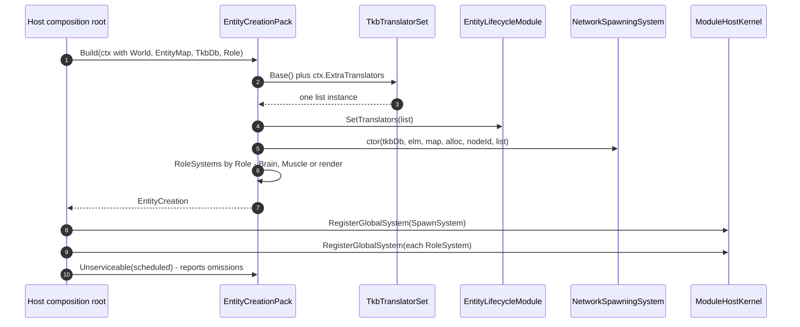

<!--STATUS
state: LIVE
updated: 2026-08-30
build-state: READY-TO-BUILD
current-answer: §5 is the plan. Steps 1 and 2 are BUILT (2026-08-30): TkbTranslatorSet is the one base
  list and all five spawning sites use it. Steps 3 and 4 are APPROVED BY THE USER and NOT STARTED —
  step 3 is the EntityCreationPack (§3, UML in §4), step 4 is the catalogue-contents move (§3.3).
  Start with step 4: it is smaller, independent, and unblocks nothing else.
known-conflict: none. tkb-1/DESIGN.md §6.3/§6.5/§6.5b state the intent this design makes structural;
  this document does not contradict them, it removes the need to remember them.
-->
# DESIGN — entity creation is assembled by hand at six sites; make it a pack

> 🔒 **User ruling, `2026-08-30`:** *"Basic concepts like entity creation should be shared across
> subsystems, not relying on that all subsystem do it right and the same way."*

⭐ This document exists because that reliance has now failed **five times in one week**, always the same
way: an optional constructor argument, a host that had the value and did not pass it, and no error.

## 1. INVENTORY — the queries, and what they returned

```
grep -rln ": ITkbEntityTranslator"                      → 9 production translators
grep -rln "abstract class SharedApplicationBootstrapper" → 1, Hrot.Common/Infrastructure
grep -rn  "new NetworkSpawningSystem"  (non-test)       → 6 construction sites
grep -rn  "HrotEnvironment.CreateTkb"  (non-test)       → 4 independent catalogue builds
grep -rn  "RegisterUrbanCombatTkbTemplates" (non-test)  → 2 hosts seed extra templates
cli search_graph name_pattern=".*(Tkb|Spawn|Lifecycle).*"  → corroborated the same production set
```

📄 **Design basis read first** *(the step this programme skipped twice before getting here)*:
[`tkb-1/DESIGN.md`](designs/tkb-1/DESIGN.md) §6.1 · §6.3 · §6.5 · **§6.5b** ·
[`Hrot-Simulation-Pipeline.md`](projects/relationships/Hrot-Simulation-Pipeline.md) §2 · §4.3 ·
[`SOLUTION-OVERVIEW.md`](projects/SOLUTION-OVERVIEW.md) §6.

## 2. 📐 THE MEASURED STATE — six sites, seven independent decisions each

| host | derives from `SharedApplicationBootstrapper`? | translator list | seeds UrbanCombat | `elm.SetTranslators` | `NetworkSpawningSystem(translators:)` |
|---|---|---|---|---|---|
| **SimHost** | ✅ | 7 | ⛔ | ✅ | ✅ |
| **IG** | ✅ | 2 | ⛔ | ⛔ *(no spawn path — correct, see below)* | ⛔ *(correct)* |
| **CGF** | 🔴 **no** — `HrotNodeBuilder` directly | 7 *(added `2026-08-30`, `CE-138`)* | ⛔ | ✅ *(added)* | ✅ *(added)* |
| **Editor** | 🔴 **no** — fully inline | 6 | ⭐ **✅** | ✅ | ✅ |
| **Stride node** | ✅ | 🔴 **none** → ✅ `Base()` *(fixed, `CE-139`)* | ⛔ | 🔴 no → ✅ | 🔴 **OMITTED** → ✅ |
| **Stride editor** | 🔴 **no** — its own second pipeline | 7 | ⭐ **✅** | ✅ | ✅ |
| ReplayBrowser | 🔴 no | — | — | — | — *(no spawn path)* |

⚠⚠ **CORRECTED `2026-08-30` — an earlier version of this row called IG *"the useful counter-example"*
and concluded *"IG does not adopt."* 🔴 That was too strong, and the user was right to challenge it:**
*"why doesn't IG adopt? … it is a fully equipped ECS node which can render a 2d map and the user on that
map should be able to create various tactical symbols (that are shared among all the IGs showing the same
map) so the IG should have the entity creation capabilities as well."*

📐 **Measured, and IG ORIGINATES entity creation.** Its placement tool goes
`ActivatePlacementTool` → `MapCommandController.ActivatePlacementCommand` → `EntityPlacementGizmo` →
`OnEntityCreatedByTool(SpawnEntityCommand)` → **`_eventBus.PublishManaged(cmd)`**. It also has
`ActivateAreaAuthoringTool` for tactical graphics, and it reads the TKB catalogue directly
*(`GetTkbPrefixForType` → `ITkbDatabase`)*. ⇒ 🔒 **IG is a full entity-creation participant.**

⭐⭐ **What IG genuinely lacks is only LOCAL MATERIALISATION** — and that is deliberate, not drift:
`RegisterSpawningPipeline` registers `GhostDestructionSystem` + `IgUnitHierarchyModule`, and the
`SpawnEntityCommand` IG publishes is picked up by `SpawnEntityCommandEgressTranslator` and forwarded to
the authority, whose ghost replicates back. **Single spawn authority is the design** *(§4.3)*.

⇒ ⭐⭐⭐ **So the pack has TWO halves, and IG adopts one of them — see §2.3.**

### 2.3 ⭐⭐⭐ THE PACK HAS TWO HALVES — **origination and materialisation** *(added `2026-08-30`)*

| half | what it is | who has it |
|---|---|---|
| ⭐ **origination** | the tools and request sources that emit `SpawnEntityCommand` / `CreateEntityRequest` | **IG** *(placement + area authoring)* · **Editor** · **CGF** *(from ExCon)* · **SimHost** *(non-default)* |
| ⭐ **materialisation** | `NetworkSpawningSystem` + the translator list + `ELM` — turning a command into a live entity | CGF *(the authority)* · SimHost · Editor · Stride ×2. ⛔ **not IG, by design** |
| ⭐ **the ghost projection** | `NedReplicationModule` / `GhostPromotionSystem` applying TKB descriptors to replicated entities — **also needs the translator list** | **IG** · SimHost |

⇒ 🔒 **IG adopts the pack for origination and the ghost projection, and opts out of materialisation only.**
⛔ *"IG does not adopt"* was wrong; **the pack must express the halves separately** rather than being
all-or-nothing per host. ⭐ That is a change to §3's shape: `Role` selects **which half**, not merely which
systems.

#### 🔴 `CE-141` — and IG's list WIDTH is an open question, not a settled decision

📐 **Measured over IG's real registration path** *(`HrotSharedComponentRegistry` + `IgRoleComponentRegistry`,
per `IgNodeBootstrapper:150-152`)*:

| registered on IG | ⭐ `Base()` translator that would fill it | in IG's 2-entry list? |
|---|---|---|
| `SimTransform` · `SimVelocity` | `SpatialCoreTkbTranslator` | ✅ |
| `VisualData` | `PresentationTkbTranslator` | ✅ |
| 🔴 `VehicleParams` · `PhysicsCollider` | `VehicleKinematicsTkbTranslator` | ⛔ **no** |
| 🔴 `Health` · `WeaponState` | `CombatTkbTranslator` | ⛔ **no** |
| 🔴 `PerceptionReceptor` · `TargetMemory` | `PerceptionTkbTranslator` | ⛔ **no** |
| *(not registered: `VehicleState`, `NavState`, `NavigationIntent`, `BehaviorState`, `BrainBlackboard`, `SimTier`, `EntityInfo`)* | — | — |

⇒ ⚠⚠ **IG registers six components that `Base()` would fill and its short list leaves untouched on every
ghost.** ⛔ **But do NOT widen it on that basis alone** — those six are plausibly populated by **DDS
replication** from SimHost instead, in which case TKB projection there is redundant *(or briefly shows
template defaults before the first update)*. 🔒 **The open question is which source should populate a
ghost's template-derived components**, and it needs a live comparison, not a source reading. ⭐ Filed as
**`CE-141`**; ⚠ the previous version of this design asserted the narrow list was correct **without
measuring it**.

### 2.1 🔴 The three findings

| # | finding |
|---|---|
| **①** | **`CE-139` — `StrideNodeBootstrapper:316` omits `translators:`** and never calls `SetTranslators`. **The fifth instance of the identical silent default**, after SimHost, Editor, Stride-editor and CGF. ⚠ Partly masked: `EditorStrideSubsystem:588` builds a **second, separate** pipeline that *does* pass them — so which behaviour you get depends on which composition ran |
| **②** | **Four independent `HrotEnvironment.CreateTkb()` calls** — `HrotNodeBuilder:197`, `IgNodeBootstrapper:133`, `EditorSubsystem:1229`, and twice inside `HrotNodeBuilderReplicationExtensions`. Each is a **separate catalogue instance** |
| **③** | ✅ **RULED — see §3.3.** Only the Editor and the Stride editor seed `RegisterUrbanCombatTkbTemplates` *(TkbTypes 1001–2003)*, so **the catalogue's CONTENTS differ by host**: a scenario referencing `1001` resolves in the Editor and **not** on SimHost or CGF. 🔒 **User ruling `2026-08-30`: *"if editor builds UrbanCombat stuff then everyone should, editor is the most advanced in that matter."*** ⇒ ⭐ the Editor is the reference, and the fix is a **MOVE**, not a per-host addition — 📐 the reason only two hosts seed it is the **reference graph**, not oversight |

### 2.2 ⭐⭐ Why convention has not held — the shape is always the same

📌 `tkb-1/DESIGN.md` §6.3 already says the list must be *"identical for all three systems within the same
node"*, and §6.5 calls it the node's *"single point of truth"*. ⛔ **Both are true statements that nothing
enforces.** Every failure was an **optional parameter with a silent empty default**, at a site whose
author held the value:

```csharp
NetworkSpawningSystem(…, IReadOnlyList<ITkbEntityTranslator>? translators = null)  // ⇒ Array.Empty
EntityLifecycleModule(…, IReadOnlyList<ITkbEntityTranslator>? translators = null)  // ⇒ Array.Empty
```

⇒ 🔒 **The fix is not more documentation** *(that was `CE-138`'s half, and it is done)* — ⭐ **it is making
the assembly a THING that is constructed once**, so a host cannot half-do it.

## 3. ⭐⭐⭐ THE DESIGN — `EntityCreationPack`, on the `MapInteractionPack` precedent

⭐⭐ **This shape is already proven in this lane.** `UXI-23` `S2b` replaced **five** hand-written map
compositions with `MapInteractionPack` — 📄 [`UX_Feature_Map_Parity.md`](UX/UX_Feature_Map_Parity.md)
§3.2d. Same disease, same cure, and the user's ruling there was **"pack constructs, host schedules"**,
enforced structurally by giving the context no kernel.

```csharp
var creation = EntityCreationPack.Build(new EntityCreationContext
{
    World          = world,          // required
    EntityMap      = entityMap,      // required
    NodeId         = nodeId,         // required
    TkbDb          = ctx.TkbDb,      // required — no host builds its own catalogue
    IdAllocator    = idAllocator,
    ExtraTranslators = …,            // ⭐ ADD-ONLY; the base set is not overridable
    Role           = NodeRole.Brain, // decides WHICH systems, never which translators
});
// the HOST schedules:
kernel.RegisterGlobalSystem(creation.SpawnSystem);
foreach (var s in creation.RoleSystems) kernel.RegisterGlobalSystem(s);
creation.Unserviceable(…);           // ⭐ the S2b diagnostic habit
```

### 3.1 🔒 The invariants the pack makes structural

| # | invariant | how the pack enforces it |
|---|---|---|
| **①** | **one translator list per node** | the pack builds it and hands **the same instance** to `NetworkSpawningSystem`, `elm.SetTranslators` and `GhostPromotionSystem`. ⇒ §6.3 true **by construction** |
| **②** | **the list is never empty** | there is no way to pass one — `ExtraTranslators` is *additive*. ⭐ The base set is the full projection set, and **gate ②** *(`IsComponentTypeRegistered`, `tkb-1` §6.5b)* does the per-host narrowing |
| **③** | **one catalogue per process** | `TkbDb` is a **required** context input, not something the pack builds. ⇒ finding ② cannot recur |
| **④** | **role decides WHICH HALF and which systems, never which components** | `Brain` ⇒ origination + materialisation, `CreateEntityRequestSystem(isDefaultProcessor: true)`; `Muscle` ⇒ materialisation + ghost, `false`; ⭐ **a render node (IG) ⇒ origination + ghost projection and NO `NetworkSpawningSystem`** — 📄 `Hrot-Simulation-Pipeline.md` §4.3 and §2.3 |
| **⑤** | **a host that skips a piece SAYS SO** | `Unserviceable(scheduled)` reports what the pack built and the host did not schedule — the `S2b` mechanism, which is how a silent omission became loud there |

### 3.2 ⚠ What the pack must NOT do

⛔ **Not schedule.** `EntityCreationContext` carries **no `ModuleHostKernel`** — the same structural
enforcement `MapInteractionContext` uses. ⛔ **Not own the TKB catalogue** *(invariant ③)*.
⛔ **Not decide component registration** — that stays the host's `*ComponentRegistry`, which is the
narrowing lever *(`tkb-1` §6.5b)*. ⛔ **Not touch `SharedApplicationBootstrapper`'s hook set** — the pack
is what `RegisterSpawningPipeline` *calls*, so the three hosts that already derive from it keep their
structure and the three that do not can adopt the pack without inheriting.

### 3.3 ⭐⭐⭐ ONE CATALOGUE CONTENT SET — **the templates must LEAVE the Examples assembly**

> 🔒 **User ruling, `2026-08-30`:** *"if editor builds UrbanCombat stuff then everyone should, editor is
> the most advanced in that matter."*

📐 **Measured — and the cause is structural, which is why nobody "forgot".**
`RegisterUrbanCombatTkbTemplates` lives in **`FDP/Examples/Fdp.Examples.Scenarios`**
*(`Integrated/UrbanCombatNewScenario.cs:562-625`, five templates, ~63 lines)*, and that assembly is
referenced by exactly **two** production projects:

```
grep -rln "Fdp.Examples.Scenarios.csproj" --include=*.csproj
  → Hrot.Editor · HrotStrideApp.Game            (+ Examples.Runner and two test projects)
```

⇒ 🔒 **The two hosts that seed the templates are precisely the two that CAN.** ⛔ SimHost, CGF and IG
could not call it if they wanted to. ⇒ ⭐⭐ **this is not fixable by adding a call per host; the templates
have to move into a product assembly.**

#### ⭐ The move — target measured as unblocked

| | |
|---|---|
| **from** | `Fdp.Examples.Scenarios/Integrated/UrbanCombatNewScenario.RegisterUrbanCombatTkbTemplates` |
| **to** | ⭐ **`Hrot.Core`, beside `NedTkbCatalog`** — the existing home for code-registered TKB content |
| ✅ **dependency check** | every descriptor the five templates use — `TkbMasterDto`, `StrideRenderModelDefDto`, `VehicleParametersDto`, `BehaviorProfileDto`, `SensorCapabilitiesDto` — lives in **`Fdp.Toolkits/Tkb/Domain`**, which `Hrot.Core` already references. ⇒ 🔒 **no new reference, no assembly-graph change** |
| ⭐ **then one line** | `HrotEnvironment.CreateTkb()` already seeds `NedTkbCatalog.RegisterAll(tkb)` and `RouteTkbExtensions.ApplyRoutePlanToBlueprint(tkb)`. Adding the moved call there gives **every host the same catalogue contents automatically** — and it makes finding ② *(four independent `CreateTkb()` calls)* harmless, because all four produce the same content |
| ⚠ **leave a forwarder** | `UrbanCombatNewScenario` keeps a `RegisterUrbanCombatTkbTemplates` that delegates to the moved one, so the examples, the runner and the two test projects keep compiling. ⛔ **Do not delete the old entry point** — it is called from five places |
| ⛔ **do NOT** | ⛔ move the *scenario* — only the **template registration**. `UrbanCombatNewScenario` is an example scenario and stays one |

⚠ **The one thing to verify at build time:** whether the names `TkbCivilianPedestrian` … and the tuning
constants *(`CivilianVisionRange`, `BehaviorConstants.SimTierCivilian`, …)* the method reads are
themselves reachable from `Hrot.Core`, or must move with it. 📐 The descriptors are; the constants were
not checked.

## 4. ⭐⭐ UML




## 5. ⭐ Sequencing

| step | what | risk |
|---|---|---|
| ✅ **1** | **`CE-139`** — **DONE `2026-08-30`.** `StrideNodeBootstrapper:316` now passes the list and calls `SetTranslators` | low; **gate ②** bounded it |
| ✅ **2** | **`TkbTranslatorSet`** — **DONE `2026-08-30`.** `Hrot.Core/Tkb/TkbTranslatorSet.cs` holds the one base set *(6 translators)*; **all five spawning sites** now call `Base()` or `BasePlus(…)`, and the two per-node additions that live above `Hrot.Core` — `AiDiagnosticsTkbTranslator` (SimHost, CGF) and `InfantryVehicleStateStripTkbTranslator` (Stride editor) — go through `BasePlus`. ⭐ IG keeps its narrower list **with the reason written at the site** | low — no behaviour change where the lists agreed |
| **3** | **`EntityCreationPack`** over the six sites, one host at a time, `Unserviceable` reporting each | medium — it is a composition change on the spawn path |
| **4** | ✅ **RULED, now buildable** — **§3.3**: move the template registration out of `Fdp.Examples.Scenarios` into `Hrot.Core` beside `NedTkbCatalog`, seed it from `HrotEnvironment.CreateTkb()`, leave a forwarder behind. ⭐ Independent of step 3 and can go first — it is the smaller of the two |

⚠ **Step 2 was the cheap majority of the value** — it is where §6.3's *"identical list"* stopped being a
convention. ⭐ Step 3 buys invariants ④ and ⑤ and can follow later.

##### ✅ AS-BUILT `2026-08-30` — steps 1 and 2

| | |
|---|---|
| ⭐ **new** | `Hrot/Engine/Hrot.Core/Tkb/TkbTranslatorSet.cs` — `Base()` *(6, fresh list per call)* and add-only `BasePlus(params …)` |
| ⭐ **five sites converted** | `SimHostNodeBootstrapper` · `CgfSubsystem` · `EditorSubsystem` · `StrideNodeBootstrapper` *(also gained the missing `translators:`)* · `EditorStrideSubsystem` |
| ⭐ **IG left alone, and documented** | its 2-entry list now carries a comment saying **why** it is narrower and **not to replace it with `Base()`** — the one case where a short list is a decision, safe because IG never spawns |
| ⭐ **rails** | 4 new in `TkbTranslatorSpawnParityRails` *(non-empty · add-only · fresh-list · end-to-end spawn through `Base()`)*; the conformance Theory **retargeted** from *"constructs `PresentationTkbTranslator`"* to *"obtains `TkbTranslatorSet.Base`"* — ⭐ a **stronger** claim, since the shared set cannot silently lose a family. **21/21** across both rail files |
| ⚠ **red-proof** | removing `PresentationTkbTranslator` from `Base()` reddens **2** rails |
| ⚠ **not verified** | the Stride tree cannot build on Linux *(`Microsoft.WindowsDesktop.App`)*; `EditorStrideSubsystem`'s conversion is checked statically only |
| ⛔ **still open** | **step 3** *(the pack)* and **step 4** *(the `RegisterUrbanCombatTkbTemplates` ruling)* |

### 5.1 ⭐ Step 3's adoption order — **easiest host first, so the pack is proven before the risky one**

| # | host | why this position |
|---|---|---|
| **a** | **Stride node** | ⭐ smallest call site *(one `if` block)*, and already derives from `SharedApplicationBootstrapper`. ⚠ **but cannot be compiler-verified on Linux** — so do it first for shape, verify last on Windows |
| **b** | **SimHost** | ⭐ the reference implementation; its `RegisterSpawningPipeline` is the hook the pack was designed to be called *from* |
| **c** | **Editor** | ⭐ largest inline block, and the one whose spawn path the user hand-tested — 🔒 **the standing caution about the editor's scenario path applies**: change composition, not behaviour |
| **d** | 🔴 **CGF — LAST** | it is the **entity spawning authority** *(`Hrot-Simulation-Pipeline.md` §2)*. ⛔ A composition mistake here breaks every entity in the cluster, so it adopts once the pack has three hosts of evidence |
| **e** | **Stride editor** | its second pipeline; fold it into the same pack call or delete it if `StrideNodeBootstrapper`'s now suffices — ⚠ **that question is open and must be measured, not assumed** |

⭐⭐ **IG DOES adopt — the origination and ghost-projection halves (§2.3)**, and opts out of
materialisation only. ⛔ Its `RegisterSpawningPipeline` keeps `GhostDestructionSystem` +
`IgUnitHierarchyModule` and gains no `NetworkSpawningSystem`. ⚠ **Its translator-list width is `CE-141`
and must not be changed as part of the pack adoption** — settle that separately, with a live comparison.

| # | host | why this position |
|---|---|---|
| **f** | **IG** | ⭐ adopt **after** the four materialising hosts, so the pack's two-half split is exercised by a host that uses only one of them. ⛔ Do **not** fold `CE-141` into it |

## 6. ⭐ Acceptance

| # | |
|---|---|
| ① | ⭐⭐ **No production site constructs a translator list inline** — a source scan over the six composition roots, the same instrument as `EveryTkbSpawningHost_ConstructsThePresentationTranslator` |
| ② | ⭐⭐⭐ **No production site can pass an empty list** — a rail asserting `EntityCreationPack.Build` always yields `Translators.Count > 0`, and that `ExtraTranslators` only ever **adds** |
| ③ | ⭐ **One list instance reaches all three consumers** — reference equality across `SpawnSystem`, `Elm` and the promotion system |
| ④ | ⭐ **Role selects systems** — `Brain` ⇒ `isDefaultProcessor: true`; `Muscle` ⇒ `false`; render ⇒ neither |
| ⑤ | ⭐ **A skipped piece is reported** — `Unserviceable` names it, mirroring `MapInteraction`'s rail |
| ⑥ | ⚠ **Byte-identical default** — each host's spawned entity carries the same component set before and after adoption, measured per host |
| ⑦ | ⭐⭐ **step 4: one catalogue content set** — a rail asserting `HrotEnvironment.CreateTkb()` resolves **TkbTypes 1001–2003**, so every host's catalogue carries them. ⛔ A rail that calls `RegisterUrbanCombatTkbTemplates` itself is vacuous — it must go through the shared factory |
| ⑧ | ⭐ **step 4: nothing broke in the examples** — the forwarder keeps `Fdp.Examples.Scenarios`, `Fdp.Examples.Runner` and the two test projects compiling and green |
