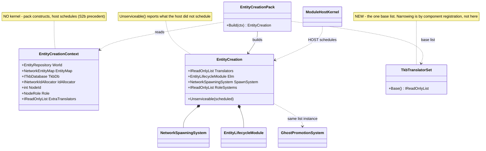
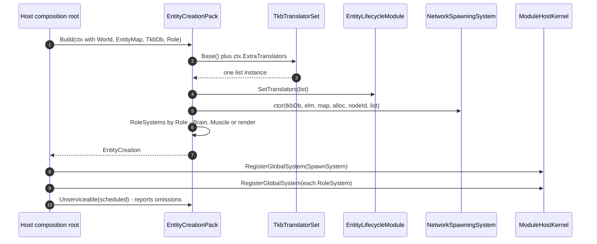

<!--STATUS
state: LIVE
updated: 2026-08-30
build-state: READY-TO-BUILD
current-answer: §5 — steps 1 and 2 are BUILT (2026-08-30): TkbTranslatorSet is the one base list and all
  five spawning sites use it. §3 (the EntityCreationPack) is step 3 and is still a PROPOSAL; §4 carries its
  UML. §5 step 4 needs a USER RULING, not code (should every host seed RegisterUrbanCombatTkbTemplates?).
known-conflict: none. tkb-1/DESIGN.md §6.3/§6.5/§6.5b state the intent this design makes structural;
  this document does not contradict them, it removes the need to remember them.
-->
# DESIGN — entity creation is assembled by hand at six sites; make it a pack

> 🔒 **User ruling, `2026-08-30`:** *"Basic concepts like entity creation should be shared across
> subsystems, not relying on that all subsystem do it right and the same way."*

⭐ This document exists because that reliance has now failed **five times in one week**, always the same
way: an optional constructor argument, a host that had the value and did not pass it, and no error.

## 1. INVENTORY — the queries, and what they returned

```
grep -rln ": ITkbEntityTranslator"                      → 9 production translators
grep -rln "abstract class SharedApplicationBootstrapper" → 1, Hrot.Common/Infrastructure
grep -rn  "new NetworkSpawningSystem"  (non-test)       → 6 construction sites
grep -rn  "HrotEnvironment.CreateTkb"  (non-test)       → 4 independent catalogue builds
grep -rn  "RegisterUrbanCombatTkbTemplates" (non-test)  → 2 hosts seed extra templates
cli search_graph name_pattern=".*(Tkb|Spawn|Lifecycle).*"  → corroborated the same production set
```

📄 **Design basis read first** *(the step this programme skipped twice before getting here)*:
[`tkb-1/DESIGN.md`](designs/tkb-1/DESIGN.md) §6.1 · §6.3 · §6.5 · **§6.5b** ·
[`Hrot-Simulation-Pipeline.md`](projects/relationships/Hrot-Simulation-Pipeline.md) §2 · §4.3 ·
[`SOLUTION-OVERVIEW.md`](projects/SOLUTION-OVERVIEW.md) §6.

## 2. 📐 THE MEASURED STATE — six sites, seven independent decisions each

| host | derives from `SharedApplicationBootstrapper`? | translator list | seeds UrbanCombat | `elm.SetTranslators` | `NetworkSpawningSystem(translators:)` |
|---|---|---|---|---|---|
| **SimHost** | ✅ | 7 | ⛔ | ✅ | ✅ |
| **IG** | ✅ | 2 | ⛔ | ⛔ *(no spawn path — correct, see below)* | ⛔ *(correct)* |
| **CGF** | 🔴 **no** — `HrotNodeBuilder` directly | 7 *(added `2026-08-30`, `CE-138`)* | ⛔ | ✅ *(added)* | ✅ *(added)* |
| **Editor** | 🔴 **no** — fully inline | 6 | ⭐ **✅** | ✅ | ✅ |
| **Stride node** | ✅ | 🔴 **none** → ✅ `Base()` *(fixed, `CE-139`)* | ⛔ | 🔴 no → ✅ | 🔴 **OMITTED** → ✅ |
| **Stride editor** | 🔴 **no** — its own second pipeline | 7 | ⭐ **✅** | ✅ | ✅ |
| ReplayBrowser | 🔴 no | — | — | — | — *(no spawn path)* |

⭐ **IG is correct and is the useful counter-example.** Its `RegisterSpawningPipeline` deliberately
registers only `GhostDestructionSystem` + `IgUnitHierarchyModule` — *"SpawnEntityCommand is forwarded to
SimHost … SimHost creates the authoritative ghost which DDS replicates back."* Its 2-entry translator
list goes to `.WithTranslators(…)` → `NedReplicationModule`, i.e. to the **ghost** projection. ⇒ a host
with no spawn path and translators only on the replication seam is a coherent configuration.

### 2.1 🔴 The three findings

| # | finding |
|---|---|
| **①** | **`CE-139` — `StrideNodeBootstrapper:316` omits `translators:`** and never calls `SetTranslators`. **The fifth instance of the identical silent default**, after SimHost, Editor, Stride-editor and CGF. ⚠ Partly masked: `EditorStrideSubsystem:588` builds a **second, separate** pipeline that *does* pass them — so which behaviour you get depends on which composition ran |
| **②** | **Four independent `HrotEnvironment.CreateTkb()` calls** — `HrotNodeBuilder:197`, `IgNodeBootstrapper:133`, `EditorSubsystem:1229`, and twice inside `HrotNodeBuilderReplicationExtensions`. Each is a **separate catalogue instance** |
| **③** | ⚠ **Only the Editor and the Stride editor seed `RegisterUrbanCombatTkbTemplates`** *(TkbTypes 1001–2003: MilitaryApc, InfantrySoldier, Insurgent, …)*. ⇒ **the catalogue's CONTENTS differ by host**: a scenario referencing 1001 resolves in the Editor and **not** on SimHost or CGF. ⛔ Unmeasured whether that is intentional *(dev/demo templates)* or drift — it needs a ruling, not a fix |

### 2.2 ⭐⭐ Why convention has not held — the shape is always the same

📌 `tkb-1/DESIGN.md` §6.3 already says the list must be *"identical for all three systems within the same
node"*, and §6.5 calls it the node's *"single point of truth"*. ⛔ **Both are true statements that nothing
enforces.** Every failure was an **optional parameter with a silent empty default**, at a site whose
author held the value:

```csharp
NetworkSpawningSystem(…, IReadOnlyList<ITkbEntityTranslator>? translators = null)  // ⇒ Array.Empty
EntityLifecycleModule(…, IReadOnlyList<ITkbEntityTranslator>? translators = null)  // ⇒ Array.Empty
```

⇒ 🔒 **The fix is not more documentation** *(that was `CE-138`'s half, and it is done)* — ⭐ **it is making
the assembly a THING that is constructed once**, so a host cannot half-do it.

## 3. ⭐⭐⭐ THE DESIGN — `EntityCreationPack`, on the `MapInteractionPack` precedent

⭐⭐ **This shape is already proven in this lane.** `UXI-23` `S2b` replaced **five** hand-written map
compositions with `MapInteractionPack` — 📄 [`UX_Feature_Map_Parity.md`](UX/UX_Feature_Map_Parity.md)
§3.2d. Same disease, same cure, and the user's ruling there was **"pack constructs, host schedules"**,
enforced structurally by giving the context no kernel.

```csharp
var creation = EntityCreationPack.Build(new EntityCreationContext
{
    World          = world,          // required
    EntityMap      = entityMap,      // required
    NodeId         = nodeId,         // required
    TkbDb          = ctx.TkbDb,      // required — no host builds its own catalogue
    IdAllocator    = idAllocator,
    ExtraTranslators = …,            // ⭐ ADD-ONLY; the base set is not overridable
    Role           = NodeRole.Brain, // decides WHICH systems, never which translators
});
// the HOST schedules:
kernel.RegisterGlobalSystem(creation.SpawnSystem);
foreach (var s in creation.RoleSystems) kernel.RegisterGlobalSystem(s);
creation.Unserviceable(…);           // ⭐ the S2b diagnostic habit
```

### 3.1 🔒 The invariants the pack makes structural

| # | invariant | how the pack enforces it |
|---|---|---|
| **①** | **one translator list per node** | the pack builds it and hands **the same instance** to `NetworkSpawningSystem`, `elm.SetTranslators` and `GhostPromotionSystem`. ⇒ §6.3 true **by construction** |
| **②** | **the list is never empty** | there is no way to pass one — `ExtraTranslators` is *additive*. ⭐ The base set is the full projection set, and **gate ②** *(`IsComponentTypeRegistered`, `tkb-1` §6.5b)* does the per-host narrowing |
| **③** | **one catalogue per process** | `TkbDb` is a **required** context input, not something the pack builds. ⇒ finding ② cannot recur |
| **④** | **role decides SYSTEMS, not components** | `Brain` gets `CreateEntityRequestSystem(isDefaultProcessor: true)`; `Muscle` gets it `false`; a render node gets `GhostDestructionSystem` only — 📄 exactly `Hrot-Simulation-Pipeline.md` §4.3 |
| **⑤** | **a host that skips a piece SAYS SO** | `Unserviceable(scheduled)` reports what the pack built and the host did not schedule — the `S2b` mechanism, which is how a silent omission became loud there |

### 3.2 ⚠ What the pack must NOT do

⛔ **Not schedule.** `EntityCreationContext` carries **no `ModuleHostKernel`** — the same structural
enforcement `MapInteractionContext` uses. ⛔ **Not own the TKB catalogue** *(invariant ③)*.
⛔ **Not decide component registration** — that stays the host's `*ComponentRegistry`, which is the
narrowing lever *(`tkb-1` §6.5b)*. ⛔ **Not touch `SharedApplicationBootstrapper`'s hook set** — the pack
is what `RegisterSpawningPipeline` *calls*, so the three hosts that already derive from it keep their
structure and the three that do not can adopt the pack without inheriting.

## 4. ⭐⭐ UML





## 5. ⭐ Sequencing

| step | what | risk |
|---|---|---|
| ✅ **1** | **`CE-139`** — **DONE `2026-08-30`.** `StrideNodeBootstrapper:316` now passes the list and calls `SetTranslators` | low; **gate ②** bounded it |
| ✅ **2** | **`TkbTranslatorSet`** — **DONE `2026-08-30`.** `Hrot.Core/Tkb/TkbTranslatorSet.cs` holds the one base set *(6 translators)*; **all five spawning sites** now call `Base()` or `BasePlus(…)`, and the two per-node additions that live above `Hrot.Core` — `AiDiagnosticsTkbTranslator` (SimHost, CGF) and `InfantryVehicleStateStripTkbTranslator` (Stride editor) — go through `BasePlus`. ⭐ IG keeps its narrower list **with the reason written at the site** | low — no behaviour change where the lists agreed |
| **3** | **`EntityCreationPack`** over the six sites, one host at a time, `Unserviceable` reporting each | medium — it is a composition change on the spawn path |
| **4** | ⚠ **finding ③ needs a RULING, not a fix** — should every host seed `RegisterUrbanCombatTkbTemplates`, or is it dev-only? ⛔ Do not "unify" it either way without that answer |

⚠ **Step 2 was the cheap majority of the value** — it is where §6.3's *"identical list"* stopped being a
convention. ⭐ Step 3 buys invariants ④ and ⑤ and can follow later.

##### ✅ AS-BUILT `2026-08-30` — steps 1 and 2

| | |
|---|---|
| ⭐ **new** | `Hrot/Engine/Hrot.Core/Tkb/TkbTranslatorSet.cs` — `Base()` *(6, fresh list per call)* and add-only `BasePlus(params …)` |
| ⭐ **five sites converted** | `SimHostNodeBootstrapper` · `CgfSubsystem` · `EditorSubsystem` · `StrideNodeBootstrapper` *(also gained the missing `translators:`)* · `EditorStrideSubsystem` |
| ⭐ **IG left alone, and documented** | its 2-entry list now carries a comment saying **why** it is narrower and **not to replace it with `Base()`** — the one case where a short list is a decision, safe because IG never spawns |
| ⭐ **rails** | 4 new in `TkbTranslatorSpawnParityRails` *(non-empty · add-only · fresh-list · end-to-end spawn through `Base()`)*; the conformance Theory **retargeted** from *"constructs `PresentationTkbTranslator`"* to *"obtains `TkbTranslatorSet.Base`"* — ⭐ a **stronger** claim, since the shared set cannot silently lose a family. **21/21** across both rail files |
| ⚠ **red-proof** | removing `PresentationTkbTranslator` from `Base()` reddens **2** rails |
| ⚠ **not verified** | the Stride tree cannot build on Linux *(`Microsoft.WindowsDesktop.App`)*; `EditorStrideSubsystem`'s conversion is checked statically only |
| ⛔ **still open** | **step 3** *(the pack)* and **step 4** *(the `RegisterUrbanCombatTkbTemplates` ruling)* |

## 6. ⭐ Acceptance

| # | |
|---|---|
| ① | ⭐⭐ **No production site constructs a translator list inline** — a source scan over the six composition roots, the same instrument as `EveryTkbSpawningHost_ConstructsThePresentationTranslator` |
| ② | ⭐⭐⭐ **No production site can pass an empty list** — a rail asserting `EntityCreationPack.Build` always yields `Translators.Count > 0`, and that `ExtraTranslators` only ever **adds** |
| ③ | ⭐ **One list instance reaches all three consumers** — reference equality across `SpawnSystem`, `Elm` and the promotion system |
| ④ | ⭐ **Role selects systems** — `Brain` ⇒ `isDefaultProcessor: true`; `Muscle` ⇒ `false`; render ⇒ neither |
| ⑤ | ⭐ **A skipped piece is reported** — `Unserviceable` names it, mirroring `MapInteraction`'s rail |
| ⑥ | ⚠ **Byte-identical default** — each host's spawned entity carries the same component set before and after adoption, measured per host |
