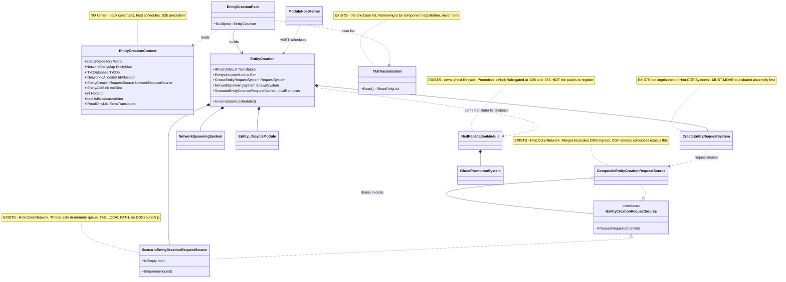
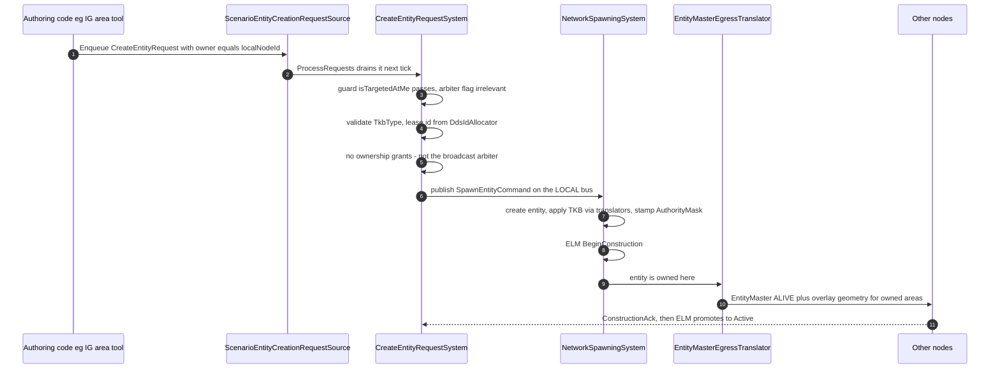
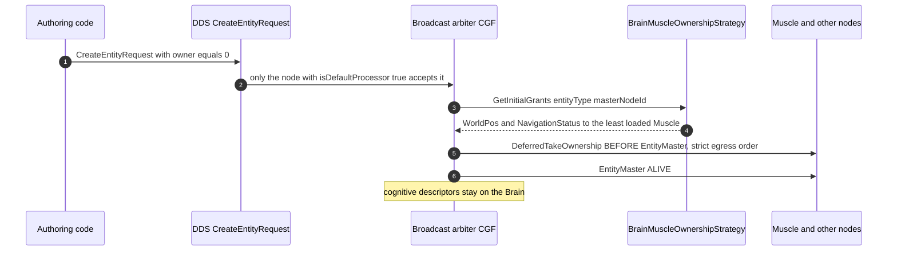

<!--STATUS
state: LIVE
updated: 2026-08-30
build-state: READY-TO-BUILD
current-answer: §5 is the plan. Steps 1 and 2 are BUILT (2026-08-30): TkbTranslatorSet is the one base
  list and all five spawning sites use it. Steps 3 and 4 are APPROVED BY THE USER and NOT STARTED —
  step 3 is the EntityCreationPack (§3, UML in §4), step 4 is the catalogue-contents move (§3.3).
  Start with step 4: it is smaller, independent, and unblocks nothing else.
known-rot: §2.3's Role-selected HALVES are SUPERSEDED — Architect_Question_65 §4 resolved the question
  and there is ONE uniform pipeline. §2.3 is kept only as HISTORY. §3's Role invariant (item 4) still says
  "role decides which half"; that wording is stale and must be read against Q65 §4.
known-rot: the scorecard row and the composition sentence in §2.4 were corrected 2026-08-31 — ghost
  promotion is gated by the NodeRole inside NedReplicationModule, NOT by host composition, so the
  EntityCreationPack registers the two SPAWN systems only. Q65 §4's Q65-B carries the measurement.
known-rot: §2.3's "halves" language is dead everywhere it appeared. Removed from §3.1 invariant 4 and
  from §5.1 on 2026-08-31 under the user's no-suppression ruling (§3.1 invariant 6). §2.3 itself stays
  as HISTORY only. Any reader finding "which half" in this file outside a HISTORY block has found rot.
current-answer-note: §3.4 is the NEW load-bearing section (2026-08-31) — the two authoring affordances
  and the per-tier measurement of what each path already has. Read it before §5's sequencing.
known-rot: §3.4's split-authority row used to call the _roleHasBrain gate on ownership delegation
  "out of scope" and correct. FALSE — corrected 2026-08-31, see Q65 §5.3 / CE-142.
architect-review: 2026-08-31 — the NotebookLM architect reviewed both docs and APPROVED them, raising
  four watch-outs. Two became new findings: CE-142's neighbour CE-143 (ReliableInitType is hardcoded to
  AllPeers at :302 and :397 and the request has no field for it — Q65 §5.5), and the resolution of the
  assembly question for obstacle 1 (target is Hrot.Core/Network, zero new references — Q65 §5.4). One
  was already designed (the local in-memory request source, §3.4). One was agreement (CE-142 stays
  decoupled from path 2).
known-rot: §5.1 twice said IG "keeps GhostDestructionSystem". WRONG — it must be DROPPED when IG gains
  NetworkSpawningSystem (CE-144, Q65 §5.6). Corrected 2026-08-31.
mechanism: §3.4a (new 2026-08-31) explains WHY double consumption is possible — the FDP bus is a
  broadcast double-buffer (ManagedEventStream.Read() returns _front; only Swap() clears), so every
  reader of an event type gets the full list. Read it before touching any order-consuming system.
-->
# DESIGN — entity creation is assembled by hand at six sites; make it a pack

> 🔒 **User ruling, `2026-08-30`:** *"Basic concepts like entity creation should be shared across
> subsystems, not relying on that all subsystem do it right and the same way."*

⭐ This document exists because that reliance has now failed **five times in one week**, always the same
way: an optional constructor argument, a host that had the value and did not pass it, and no error.

## 1. INVENTORY — the queries, and what they returned

```
grep -rln ": ITkbEntityTranslator"                      → 9 production translators
grep -rln "abstract class SharedApplicationBootstrapper" → 1, Hrot.Common/Infrastructure
grep -rn  "new NetworkSpawningSystem"  (non-test)       → 6 construction sites
grep -rn  "HrotEnvironment.CreateTkb"  (non-test)       → 4 independent catalogue builds
grep -rn  "RegisterUrbanCombatTkbTemplates" (non-test)  → 2 hosts seed extra templates
cli search_graph name_pattern=".*(Tkb|Spawn|Lifecycle).*"  → corroborated the same production set
```

📄 **Design basis read first** *(the step this programme skipped twice before getting here)*:
[`tkb-1/DESIGN.md`](designs/tkb-1/DESIGN.md) §6.1 · §6.3 · §6.5 · **§6.5b** ·
[`Hrot-Simulation-Pipeline.md`](projects/relationships/Hrot-Simulation-Pipeline.md) §2 · §4.3 ·
[`SOLUTION-OVERVIEW.md`](projects/SOLUTION-OVERVIEW.md) §6.

## 2. 📐 THE MEASURED STATE — six sites, seven independent decisions each

| host | derives from `SharedApplicationBootstrapper`? | translator list | seeds UrbanCombat | `elm.SetTranslators` | `NetworkSpawningSystem(translators:)` |
|---|---|---|---|---|---|
| **SimHost** | ✅ | 7 | ⛔ | ✅ | ✅ |
| **IG** | ✅ | 2 | ⛔ | ⛔ *(no spawn path — correct, see below)* | ⛔ *(correct)* |
| **CGF** | 🔴 **no** — `HrotNodeBuilder` directly | 7 *(added `2026-08-30`, `CE-138`)* | ⛔ | ✅ *(added)* | ✅ *(added)* |
| **Editor** | 🔴 **no** — fully inline | 6 | ⭐ **✅** | ✅ | ✅ |
| **Stride node** | ✅ | 🔴 **none** → ✅ `Base()` *(fixed, `CE-139`)* | ⛔ | 🔴 no → ✅ | 🔴 **OMITTED** → ✅ |
| **Stride editor** | 🔴 **no** — its own second pipeline | 7 | ⭐ **✅** | ✅ | ✅ |
| ReplayBrowser | 🔴 no | — | — | — | — *(no spawn path)* |

⚠⚠ **CORRECTED `2026-08-30` — an earlier version of this row called IG *"the useful counter-example"*
and concluded *"IG does not adopt."* 🔴 That was too strong, and the user was right to challenge it:**
*"why doesn't IG adopt? … it is a fully equipped ECS node which can render a 2d map and the user on that
map should be able to create various tactical symbols (that are shared among all the IGs showing the same
map) so the IG should have the entity creation capabilities as well."*

📐 **Measured, and IG ORIGINATES entity creation.** Its placement tool goes
`ActivatePlacementTool` → `MapCommandController.ActivatePlacementCommand` → `EntityPlacementGizmo` →
`OnEntityCreatedByTool(SpawnEntityCommand)` → **`_eventBus.PublishManaged(cmd)`**. It also has
`ActivateAreaAuthoringTool` for tactical graphics, and it reads the TKB catalogue directly
*(`GetTkbPrefixForType` → `ITkbDatabase`)*. ⇒ 🔒 **IG is a full entity-creation participant.**

⭐⭐ **What IG genuinely lacks is only LOCAL MATERIALISATION** — and that is deliberate, not drift:
`RegisterSpawningPipeline` registers `GhostDestructionSystem` + `IgUnitHierarchyModule`, and the
`SpawnEntityCommand` IG publishes is picked up by `SpawnEntityCommandEgressTranslator` and forwarded to
the authority, whose ghost replicates back. **Single spawn authority is the design** *(§4.3)*.

⇒ ⭐⭐⭐ **So the pack has TWO halves, and IG adopts one of them — see §2.3.**

### 2.3 ⛔⛔ SUPERSEDED — **the "halves" are gone; there is ONE pipeline** *(`2026-08-30`, same day)*

> ⛔ **Read [`Architect_Question_65`](blueprints/Architect_Question_65_Entity_Genesis_Uniformity.md) §4
> instead.** 📐 **Measured since:** `CreateEntityRequestSystem.cs:151-156` processes a request **targeted at
> the local node regardless of `isDefaultProcessor`** — and the comment above the guard says so. ⇒ 🔒
> **`isDefaultProcessor` is a BROADCAST TIEBREAKER, not an authority gate**, so peer-to-peer genesis is
> already the architecture. ⭐ Every ECS node composes the **identical** pipeline; `Role` selects only
> `isBroadcastArbiter`. ⛔ The half-split below was a workaround for a limitation that does not exist.
>
> 🔒 **User:** *"I do not want to end up in a system where everything needs to go via CGF. I need a
> distributed system where each node can create entities."* ⭐ **They can, today, by targeting themselves.**

#### ⛔ HISTORY — the superseded half-split

| half | what it is | who has it |
|---|---|---|
| ⭐ **origination** | the tools and request sources that emit `SpawnEntityCommand` / `CreateEntityRequest` | **IG** *(placement + area authoring)* · **Editor** · **CGF** *(from ExCon)* · **SimHost** *(non-default)* |
| ⭐ **materialisation** | `NetworkSpawningSystem` + the translator list + `ELM` — turning a command into a live entity | CGF *(the authority)* · SimHost · Editor · Stride ×2. ⛔ **not IG, by design** |
| ⭐ **the ghost projection** | `NedReplicationModule` / `GhostPromotionSystem` applying TKB descriptors to replicated entities — **also needs the translator list** | **IG** · SimHost |

⇒ 🔒 **IG adopts the pack for origination and the ghost projection, and opts out of materialisation only.**
⛔ *"IG does not adopt"* was wrong; **the pack must express the halves separately** rather than being
all-or-nothing per host. ⭐ That is a change to §3's shape: `Role` selects **which half**, not merely which
systems.

#### 🔴 `CE-141` — and IG's list WIDTH is an open question, not a settled decision

📐 **Measured over IG's real registration path** *(`HrotSharedComponentRegistry` + `IgRoleComponentRegistry`,
per `IgNodeBootstrapper:150-152`)*:

| registered on IG | ⭐ `Base()` translator that would fill it | in IG's 2-entry list? |
|---|---|---|
| `SimTransform` · `SimVelocity` | `SpatialCoreTkbTranslator` | ✅ |
| `VisualData` | `PresentationTkbTranslator` | ✅ |
| 🔴 `VehicleParams` · `PhysicsCollider` | `VehicleKinematicsTkbTranslator` | ⛔ **no** |
| 🔴 `Health` · `WeaponState` | `CombatTkbTranslator` | ⛔ **no** |
| 🔴 `PerceptionReceptor` · `TargetMemory` | `PerceptionTkbTranslator` | ⛔ **no** |
| *(not registered: `VehicleState`, `NavState`, `NavigationIntent`, `BehaviorState`, `BrainBlackboard`, `SimTier`, `EntityInfo`)* | — | — |

⇒ ⚠⚠ **IG registers six components that `Base()` would fill and its short list leaves untouched on every
ghost.** ⛔ **But do NOT widen it on that basis alone** — those six are plausibly populated by **DDS
replication** from SimHost instead, in which case TKB projection there is redundant *(or briefly shows
template defaults before the first update)*. 🔒 **The open question is which source should populate a
ghost's template-derived components**, and it needs a live comparison, not a source reading. ⭐ Filed as
**`CE-141`**; ⚠ the previous version of this design asserted the narrow list was correct **without
measuring it**.

### 2.1 🔴 The three findings

| # | finding |
|---|---|
| **①** | **`CE-139` — `StrideNodeBootstrapper:316` omits `translators:`** and never calls `SetTranslators`. **The fifth instance of the identical silent default**, after SimHost, Editor, Stride-editor and CGF. ⚠ Partly masked: `EditorStrideSubsystem:588` builds a **second, separate** pipeline that *does* pass them — so which behaviour you get depends on which composition ran |
| **②** | **Four independent `HrotEnvironment.CreateTkb()` calls** — `HrotNodeBuilder:197`, `IgNodeBootstrapper:133`, `EditorSubsystem:1229`, and twice inside `HrotNodeBuilderReplicationExtensions`. Each is a **separate catalogue instance** |
| **③** | ✅ **RULED — see §3.3.** Only the Editor and the Stride editor seed `RegisterUrbanCombatTkbTemplates` *(TkbTypes 1001–2003)*, so **the catalogue's CONTENTS differ by host**: a scenario referencing `1001` resolves in the Editor and **not** on SimHost or CGF. 🔒 **User ruling `2026-08-30`: *"if editor builds UrbanCombat stuff then everyone should, editor is the most advanced in that matter."*** ⇒ ⭐ the Editor is the reference, and the fix is a **MOVE**, not a per-host addition — 📐 the reason only two hosts seed it is the **reference graph**, not oversight |

### 2.2 ⭐⭐ Why convention has not held — the shape is always the same

📌 `tkb-1/DESIGN.md` §6.3 already says the list must be *"identical for all three systems within the same
node"*, and §6.5 calls it the node's *"single point of truth"*. ⛔ **Both are true statements that nothing
enforces.** Every failure was an **optional parameter with a silent empty default**, at a site whose
author held the value:

```csharp
NetworkSpawningSystem(…, IReadOnlyList<ITkbEntityTranslator>? translators = null)  // ⇒ Array.Empty
EntityLifecycleModule(…, IReadOnlyList<ITkbEntityTranslator>? translators = null)  // ⇒ Array.Empty
```

⇒ 🔒 **The fix is not more documentation** *(that was `CE-138`'s half, and it is done)* — ⭐ **it is making
the assembly a THING that is constructed once**, so a host cannot half-do it.

### 2.4 ⭐⭐ IS THIS ACTUALLY UNIFIED? — **it CAN be, and it needs no contract change** *(`2026-08-30`, corrected)*

> 🔒 **User:** *"so is the unification planned in a way that all ECS equipped node are able to create
> entities and all are able to receive ghost entities and all are using all TKB translator lists in the
> same way (gated just by ECS component registration on node)? i.e. will that be really unified cross
> hosts?"*

⛔ **Honest answer: not as this document is written.** §2.3's `Role`-selected halves **relocate** the
per-host divergence into one place rather than removing it. ⭐ Scored against the three criteria:

| criterion | today | this design as written | achievable? |
|---|---|---|---|
| all ECS nodes can create entities | ⚠⚠ **CORRECTED `2026-08-31` — NOT already true.** IG can *originate a request* 📐 but cannot **own** what it creates: it has no request source, no `CreateEntityRequestSystem` and no `NetworkSpawningSystem` ⇒ its every creation is an unowned broadcast routed to CGF *(`SpawnEntityCommandEgressTranslator.cs:167` writes `Owner = default`)* | ✅ the pack closes it — §3.4 | ✅ **three pieces, no protocol change** |
| all can receive ghosts | ⚠ `GhostCreationSystem` on 5 of 6; ⭐⭐ **promotion is gated by the NodeRole, not by the host** — `NedReplicationModule.RegisterSystems` registers `GhostPromotionSystem` only for `pureIgRole` *(:308)* or `_roleHasMuscle` *(:356)*, each also behind `_tkbDb != null && _lifecycleModule != null` ⇒ **pure-Brain (CGF) is excluded by construction** | ⛔ **not the pack's job** — it is one gate in one file | ✅ but ⛔ **only after Q65-A′**: until CGF receives entities it did not spawn, pure-Brain promotion is dead code |
| one list, gated only by registration | ⚠ 5 sites on `Base()`; 🔴 IG hand-narrowed *(`CE-141`)* | ⛔ unchanged | ✅ once `CE-141` settles |

⚠⚠ **CORRECTED the same day.** An earlier version of this section said the blocker was that
`SpawnEntityCommand` conflates INTENT and ORDER, and that true uniformity therefore needed a
**genesis-contract change**. 🔴 **The conflation is real but the conclusion was wrong** — and it would have
introduced the CGF bottleneck the user explicitly rejected.

📐 **Measured:** `CreateEntityRequestSystem.cs:151-156` — a request **targeted at the local node is
processed regardless of `isDefaultProcessor`**, and the comment above the guard states it. ⇒ 🔒 **genesis is
already peer-to-peer**; `isDefaultProcessor` arbitrates only **unowned broadcasts** *(`Owner == 0`, from
non-ECS clients like ExCon)*. ⭐ `EntityMaster` carries no owner field, and ID allocation is a DDS service
*(`DdsIdAllocator`/`DdsIdAllocatorServer`)*.

⇒ ⭐⭐⭐ **So uniformity is a COMPOSITION problem, which is exactly what this pack is for**: every node
registers `CreateEntityRequestSystem` + `NetworkSpawningSystem`, with `isBroadcastArbiter` the only
differing value.

⚠⚠ **CORRECTED `2026-08-31` — the two GHOST systems are NOT the pack's to register.** 📐 Both are already
constructed inside `NedReplicationModule`: `GhostCreationSystem` unconditionally *(`:252`, "all roles")* and
`GhostPromotionSystem` behind a **NodeRole** gate *(`:308` pure-IG, `:356` Muscle)*. ⇒ ⭐ **putting them in
the pack would create a second registrar for systems that already have one** — the duplicate-implementation
trap ruling 9 forbids. 🔒 **The pack registers the two SPAWN systems; ghost lifecycle stays with the
replication module, and Q65-B widens its role gate there.**
⚠ **The real obstacle is placement, not protocol:** `CreateEntityRequestSystem` lives in
**`Hrot.CGF/Systems/`**, a host assembly — it must move to a shared one before *"every node registers it"*
is even expressible. 📄 **[`Architect_Question_65`](blueprints/Architect_Question_65_Entity_Genesis_Uniformity.md)
§4-§6 for the resolved answers, the four obstacles and the sequencing.**

## 3. ⭐⭐⭐ THE DESIGN — `EntityCreationPack`, on the `MapInteractionPack` precedent

⭐⭐ **This shape is already proven in this lane.** `UXI-23` `S2b` replaced **five** hand-written map
compositions with `MapInteractionPack` — 📄 [`UX_Feature_Map_Parity.md`](UX/UX_Feature_Map_Parity.md)
§3.2d. Same disease, same cure, and the user's ruling there was **"pack constructs, host schedules"**,
enforced structurally by giving the context no kernel.

```csharp
var creation = EntityCreationPack.Build(new EntityCreationContext
{
    World          = world,          // required
    EntityMap      = entityMap,      // required
    NodeId         = nodeId,         // required
    TkbDb          = ctx.TkbDb,      // required — no host builds its own catalogue
    IdAllocator    = idAllocator,    // required — the DDS-served allocator when networked

    // ⭐⭐ THE REQUEST TIER — this is what makes path 2 possible on every node.
    NetworkRequestSource = adapters?.RequestSource,   // DDS ingress; null offline
    AckSink              = adapters?.AckSink,         // NullEntityAckSink offline
    IsBroadcastArbiter   = isBroadcastArbiter,        // ⭐ the ONLY value that differs per node

    ExtraTranslators = …,            // ⭐ ADD-ONLY; the base set is not overridable
});
// the HOST schedules — the pack never touches the kernel:
kernel.RegisterGlobalSystem(creation.RequestSystem);
kernel.RegisterGlobalSystem(creation.SpawnSystem);
creation.Unserviceable(scheduled);   // ⭐ the S2b diagnostic habit
```

### 3.1 🔒 The invariants the pack makes structural

| # | invariant | how the pack enforces it |
|---|---|---|
| **①** | **one translator list per node** | the pack builds it and hands **the same instance** to `NetworkSpawningSystem` and `elm.SetTranslators`; `GhostPromotionSystem` receives it **through the replication module** *(`.WithTranslators(...)` → `NedReplicationModule._tkbEntityTranslators`, or the factory's own field)*. ⇒ §6.3 true **by construction** — ⚠ but the pack must therefore be handed the SAME list the builder chain got, not build a second one |
| **②** | **the list is never empty** | there is no way to pass one — `ExtraTranslators` is *additive*. ⭐ The base set is the full projection set, and **gate ②** *(`IsComponentTypeRegistered`, `tkb-1` §6.5b)* does the per-host narrowing |
| **③** | **one catalogue per process** | `TkbDb` is a **required** context input, not something the pack builds. ⇒ finding ② cannot recur |
| **④** | ⭐⭐ **the ROLE selects `IsBroadcastArbiter` and NOTHING ELSE** | ⚠⚠ **CORRECTED `2026-08-31`.** The prior wording *("role decides WHICH HALF")* is SUPERSEDED by [`Q65`](blueprints/Architect_Question_65_Entity_Genesis_Uniformity.md) §4 — ⛔ there are no halves. ⭐ Every ECS node gets the identical `CreateEntityRequestSystem` + `NetworkSpawningSystem`; exactly one carries `isDefaultProcessor: true` for `Owner == 0` broadcasts. 📐 Component narrowing is gate ② (`tkb-1` §6.5b), never the system set |
| **⑤** | **a host that skips a piece SAYS SO** | `Unserviceable(scheduled)` reports what the pack built and the host did not schedule — the `S2b` mechanism, which is how a silent omission became loud there |
| **⑥** | 🔒🔒 **NO PER-HOST OPT-OUT from the genesis pipeline** | 🔒 **User ruling `2026-08-31`:** *"the shared code for entity creation support should not restrict any ECS enabled node from creating own networked entities … no exceptions, not removing capabilities by design, and only concrete authoring code picks the way it needs."* ⇒ ⛔ **`Build` has no flag that omits the request or spawn system.** ⭐ A node that never uses path 2 simply never enqueues a self-targeted request — the capability stays present and costs an idle system |

### 3.2 ⚠ What the pack must NOT do

⛔ **Not schedule.** `EntityCreationContext` carries **no `ModuleHostKernel`** — the same structural
enforcement `MapInteractionContext` uses. ⛔ **Not own the TKB catalogue** *(invariant ③)*.
⛔ **Not decide component registration** — that stays the host's `*ComponentRegistry`, which is the
narrowing lever *(`tkb-1` §6.5b)*. ⛔ **Not touch `SharedApplicationBootstrapper`'s hook set** — the pack
is what `RegisterSpawningPipeline` *calls*, so the three hosts that already derive from it keep their
structure and the three that do not can adopt the pack without inheriting.

⛔⛔ **And NOT omit the pipeline for any host.** 🔒 The `2026-08-31` ruling *(invariant ⑥)* makes this structural: ⛔ there is **no** `EntityCreationContext` flag, and no `Role` value, that suppresses `CreateEntityRequestSystem` or `NetworkSpawningSystem`. 📌 **This retires IG’s `SpawningModule` omission** — the *"IG must not duplicate entities"* comment in `IgBootstrapperHelpers.cs` describes a hazard that §3.4 removes at the source, and keeping the omission would be *"removing capabilities by design."*

### 3.3 ⭐⭐⭐ ONE CATALOGUE CONTENT SET — **the templates must LEAVE the Examples assembly**

> 🔒 **User ruling, `2026-08-30`:** *"if editor builds UrbanCombat stuff then everyone should, editor is
> the most advanced in that matter."*

📐 **Measured — and the cause is structural, which is why nobody "forgot".**
`RegisterUrbanCombatTkbTemplates` lives in **`FDP/Examples/Fdp.Examples.Scenarios`**
*(`Integrated/UrbanCombatNewScenario.cs:562-625`, five templates, ~63 lines)*, and that assembly is
referenced by exactly **two** production projects:

```
grep -rln "Fdp.Examples.Scenarios.csproj" --include=*.csproj
  → Hrot.Editor · HrotStrideApp.Game            (+ Examples.Runner and two test projects)
```

⇒ 🔒 **The two hosts that seed the templates are precisely the two that CAN.** ⛔ SimHost, CGF and IG
could not call it if they wanted to. ⇒ ⭐⭐ **this is not fixable by adding a call per host; the templates
have to move into a product assembly.**

#### ⭐ The move — target measured as unblocked

| | |
|---|---|
| **from** | `Fdp.Examples.Scenarios/Integrated/UrbanCombatNewScenario.RegisterUrbanCombatTkbTemplates` |
| **to** | ⭐ **`Hrot.Core`, beside `NedTkbCatalog`** — the existing home for code-registered TKB content |
| ✅ **dependency check** | every descriptor the five templates use — `TkbMasterDto`, `StrideRenderModelDefDto`, `VehicleParametersDto`, `BehaviorProfileDto`, `SensorCapabilitiesDto` — lives in **`Fdp.Toolkits/Tkb/Domain`**, which `Hrot.Core` already references. ⇒ 🔒 **no new reference, no assembly-graph change** |
| ⭐ **then one line** | `HrotEnvironment.CreateTkb()` already seeds `NedTkbCatalog.RegisterAll(tkb)` and `RouteTkbExtensions.ApplyRoutePlanToBlueprint(tkb)`. Adding the moved call there gives **every host the same catalogue contents automatically** — and it makes finding ② *(four independent `CreateTkb()` calls)* harmless, because all four produce the same content |
| ⚠ **leave a forwarder** | `UrbanCombatNewScenario` keeps a `RegisterUrbanCombatTkbTemplates` that delegates to the moved one, so the examples, the runner and the two test projects keep compiling. ⛔ **Do not delete the old entry point** — it is called from five places |
| ⛔ **do NOT** | ⛔ move the *scenario* — only the **template registration**. `UrbanCombatNewScenario` is an example scenario and stays one |

⚠ **The one thing to verify at build time:** whether the names `TkbCivilianPedestrian` … and the tuning
constants *(`CivilianVisionRange`, `BehaviorConstants.SimTierCivilian`, …)* the method reads are
themselves reachable from `Hrot.Core`, or must move with it. 📐 The descriptors are; the constants were
not checked.

### 3.4 ⭐⭐⭐ THE TWO AUTHORING AFFORDANCES — **the authoring code picks, per entity**

> 🔒 **User, `2026-08-31`:** *"there are entities we want to be created on CGF, these are the brain
> enabled entities, for those the request coming to default processor is the right choice, as it makes the
> CGF to own most of their components. but some entities might be desired to be owned by the IG who created
> them, like some map-local drawings that needs to be shared with other IGs and do not need any brain … my
> desire is to not suppress this second possibility by not instantiating some systems, not necessarily to use
> it for every entity."*

⭐⭐ **Both paths already exist in the protocol. The routing is ONE FIELD**, `OwnerAppInstanceId`, and
📐 `CreateEntityRequestSystem.cs:290-294` already honours all three of its values:

| the authoring code wants | it sets | who runs genesis | who owns the components |
|---|---|---|---|
| ⭐ **a brain-enabled entity** *(vehicles, units — CGF drives the AI)* | `OwnerAppInstanceId = 0` | the **broadcast arbiter** *(CGF)* | 📐 **CGF**, minus what `BrainMuscleOwnershipStrategy` delegates: `dtWorldPos` + `dtNavigationStatus` → least-loaded Muscle; mission/intent stay on the Brain |
| ⭐⭐ **an entity it owns itself** *(IG map drawings shared between IGs)* | `OwnerAppInstanceId = localNodeId` | ⭐ **the originating node**, in-process | 📐 **the creator keeps everything** — `:313` publishes ownership grants only `if (_isDefaultProcessor …)`, so a non-arbiter creator delegates nothing |
| *(a third node by name)* | `OwnerAppInstanceId = thatNodeId` | that node | that node |

⇒ 🔒🔒 **The `_isDefaultProcessor` gate on the grant table is NOT a limitation — it IS the
discriminator between the two entity classes.** ⛔ **Nothing about ownership, the strategy seam or the wire
format changes.** ⭐ What changes is only that **every node can reach row 2.**

#### ⭐ The API shape

```csharp
// PATH 1 — brain-enabled: hand it to the cluster's arbiter (today's behaviour, unchanged)
creation.RequestFromDefaultProcessor(tkbType, transform, initialComponents);

// PATH 2 — I own this: full lifecycle protocol, locally, right here
creation.CreateLocallyOwned(tkbType, transform, initialComponents);

// ⭐ and the SECOND, INDEPENDENT axis — whether the creator waits for peer ACKs
creation.CreateLocallyOwned(tkbType, transform, initialComponents,
                            initType: ReliableInitType.None);   // IG map drawing: don't wait
```

⚠⚠ **`ReliableInitType` is a SEPARATE axis and must not be folded into the affordance** — 📄 **`CE-143`,
[`Q65`](blueprints/Architect_Question_65_Entity_Genesis_Uniformity.md) §5.5. 📐 Measured `2026-08-31`:
`CreateEntityRequestSystem.cs:302` and `:397` hardcode `ReliableInitType.AllPeers` and
`EntityCreationRequest` carries no field to override it**, so today every request-tier entity waits for
`ConstructionAck` from all expected peers. ⛔ *"I own this"* does **not** imply *"nobody needs to ACK it"*
— ⭐ so both affordances take an explicit `initType`, **defaulted to `AllPeers` so adoption changes nothing**
*(acceptance ⑥)*, and IG's drawings pass `None`.

⭐⭐ **Two names, one field apart** — `CreateLocallyOwned` enqueues into `LocalRequests` with
`OwnerAppInstanceId = NodeId`; `RequestFromDefaultProcessor` leaves it `0`. ⛔ **No policy table, no TKB
flag, no config switch** — 🔒 *"only concrete authoring code picks the way it needs."*

⚠ **Why two explicit methods and not one with a bool:** a boolean parameter at a call site does not say
which entity class it means, and 📌 this codebase has now had **five** silent-default defects from
exactly that shape *(§2.2)*. ⭐ Two named affordances make the choice legible in the diff.

#### 📐 What each path already has, measured `2026-08-31`

| tier | path 1 | path 2 |
|---|---|---|
| request intake | ✅ `NedEntityCreationRequestSource` *(DDS)* on any node with a participant | ⭐ `ScenarioEntityCreationRequestSource` — **thread-safe in-memory queue, no DDS round trip**; merged by `CompositeEntityCreationRequestSource`. 📌 **CGF already composes exactly this** *(`CgfSubsystem:683-689`)*, and its comment says the local source is **always** included and DDS only *"when network is available"* |
| request → order | 🔴 `CreateEntityRequestSystem`, **3 construction sites only** — CGF `:697`, Editor `:1429`, Stride editor `:600` | 🔴 same system, same gap |
| order → entity | ✅ 5 hosts | 🔴 **IG omits `NetworkSpawningSystem` deliberately** |
| announce + publish geometry | — | ✅⭐ **already uniform**: `SharedTranslatorPack` is *"the shared translator set that all `NodeRole` values install regardless of specialisation"*, gated at `NedReplicationModule.cs:213` on **`participant != null` only, not on role** ⇒ every node has `EntityMasterEgressTranslator`, **`MapVisualOverlayEgressTranslator`** *("publishes tactical-graphic overlay geometry for **owned** area entities")*, `GeoSpatialEgressTranslator`, `EntityInfoEgressTranslator` — **and IG calls `.WithReplication(role)` at `IgNodeBootstrapper.cs:142`** |
| receivers project TKB | ✅ | ⚠ IG ✅ *(pure-IG gate)*; 🔴 **CGF ⛔** *(pure-Brain)* ⇒ **Q65-B** |
| split-authority delegation | ✅ `DeferredTakeOwnershipEgressTranslator`, gated `_roleHasBrain` *(`NedReplicationModule.cs:230`)* | ⭐ **not needed for path 2** — a single-owner drawing delegates nothing. ⚠⚠ **CORRECTED `2026-08-31`: an earlier version of this row called the gate "out of scope" and correct.** 📐 It is not — all three delegation pieces are pure mechanism and the receive side is doubly guarded ⇒ **`CE-142`**, 📄 [`Q65`](blueprints/Architect_Question_65_Entity_Genesis_Uniformity.md) §5.3 |

⇒ ⭐⭐⭐ **IG is not missing the ability to PUBLISH. It is missing the ability to BECOME THE OWNER** —
three pieces, all of them the pack’s.

### 3.4a ⭐⭐⭐ WHY DOUBLE CONSUMPTION IS POSSIBLE AT ALL — **the bus is a BROADCAST, not a work queue**

> 🔒 **User:** *"intents are usually sent via fdp bus and processed by some system so where the
> double consumption comes from?"*

⭐⭐ **That is the natural model, and it is not what this bus does.** 📐 **Measured
`2026-08-31` — one line settles it:**

```csharp
// FDP/Engine/Fdp.Core/ManagedEventStream.cs:95
public IReadOnlyList<T> Read() => _front;        // ⭐ returns the buffer. No pop, no removal, no claim flag.

// :101 — the ONLY place anything is cleared, at end of frame (verbatim, inside lock(_lock))
public void Swap()
{
    var temp = _front; _front = _back; _back = temp;
    _back.Clear();                       // "Clear the new write buffer (old read buffer)"
}
```

⇒ ⭐⭐⭐ **Every system that calls `ReadManaged<T>()` in a frame receives the SAME COMPLETE LIST.** ⛔ There
is no notion of an event being owned, claimed or consumed by whoever read it first.

⚠⚠ **And the engine's own doc comments actively mislead here** — `FdpEventBus.Read<T>()` is documented as
*"**Consumes** all events of type T… this is how systems 'subscribe' to events."* 🔴 **Nothing is
consumed.** ⭐ It is `subscribe`, and subscription is a **fan-out**.

#### ⭐ The distinction the bus CANNOT make

| event kind | many readers | example |
|---|---|---|
| **notification** — *"this happened"* | ✅ **the whole point** | `OwnershipUpdate` — every interested system should hear it |
| 🔴 **ORDER** — *"do this"* | ⛔⛔ **each reader ACTS** ⇒ the thing happens twice | `SpawnEntityCommand` · `DestroyEntityCommand` |

⇒ ⭐⭐ **Both known hazards are one shape: an imperative event with two systems that each take a real
action.**

| order | reader A | reader B | result |
|---|---|---|---|
| `SpawnEntityCommand` | `NetworkSpawningSystem.cs:92` — materialises locally | `SpawnEntityCommandEgressTranslator.cs:80` — forwards to DDS as a request | 🔴 **two entities** |
| `DestroyEntityCommand` | `GhostDestructionSystem` — immediate hard delete | `NetworkSpawningSystem.cs:98` → `:213` — ELM teardown | 🔴 **one teardown defeats the other** *(`CE-144`)* |

#### ⛔⛔⛔ THE CRUX — **today's safety is ACCIDENTAL, and the unification removes it**

📐 Neither hazard bites today, and **nothing guards against them**:

| | |
|---|---|
| **IG** | has the egress translator, ⛔ **but not `NetworkSpawningSystem`** |
| **the other five hosts** | have `NetworkSpawningSystem`, ⛔ **but not the egress translator** |

⇒ 🔒🔒🔒 **THE OMISSIONS *WERE* THE INVARIANT — undocumented as such.**
📌 The only trace in the whole codebase is `IgBootstrapperHelpers`' comment *"replaces
SpawningModule so IG does not duplicate entities"* — ⚠ **and it explains the SPAWN half only; nothing
anywhere mentions the destroy half.**

⭐⭐ **So this design is not introducing a fragility — it is removing the accident that stood in for an
invariant.** ⛔ That is why `CE-144` and the §5.1 ordering hazard are not incidental notes: they are the
invariant becoming explicit for the first time.

#### ⭐⭐ THE CONSEQUENCE — **the pack's job, stated narrowly**

⛔ **The bus cannot distinguish a notification from an order**, so *"exactly ONE actor per order type per
node"* is **not enforceable at runtime.** ⇒ ⭐⭐⭐ **it must hold at COMPOSITION time**, which is precisely
what the pack is for:

| ⭐ | |
|---|---|
| ⭐⭐ **the pack owns the composition of the ORDER-CONSUMING systems** | ⛔ not merely "assembles systems" — it is the single place that can guarantee no node ends up with two actors for one order |
| ⭐⭐ **acceptance ⑨–⑪ are SOURCE rails, not runtime assertions** — ⭐ and now the reason is written down | 📄 §6. ⛔ A runtime check cannot see the hazard: each reader is behaving correctly in isolation |
| ⚠ **this generalises — and deliberately is NOT swept** | ⭐ **any** imperative bus event with two potential actors has this shape. ⛔ **A broad detector over every bus event type would flag dozens of correct notification fan-outs and be switched off within a batch** *(the `CLAUDE.md` silent-default lesson)*. ⇒ ⭐ **gate the two ORDERS we have measured**, and treat a third as a finding when it appears |

## 4. ⭐⭐ UML

⚠⚠ **REDRAWN `2026-08-31`.** The previous pair modelled only the SPAWN tier and had **no request
tier at all** — no `CreateEntityRequestSystem`, no request source. 🛔 That made the pack unable to
deliver path 2 §3.4, which is the whole point of the unification. ⭐ Prior state moved to § HISTORY.

⭐⭐ **Boxes marked `EXISTS` in the notes are already in the codebase** — obligation ②: an existing class
drawn beside a proposed one makes a duplicate visible. 📐 Two of them were found only by measuring
`2026-08-31` and are why this section changed.



### ⭐⭐ PATH 2 — the node owns what it creates *(the capability that is missing today)*



### ⭐ PATH 1 — brain-enabled entity, the default processor owns most components *(already works)*



⭐⭐ **Read the two together and the design is one sentence:** ⭐⭐⭐ **the pack builds the same boxes on
every node, and the authoring code picks which sequence it wants by setting one field.**

## 5. ⭐ Sequencing

| step | what | risk |
|---|---|---|
| ✅ **1** | **`CE-139`** — **DONE `2026-08-30`.** `StrideNodeBootstrapper:316` now passes the list and calls `SetTranslators` | low; **gate ②** bounded it |
| ✅ **2** | **`TkbTranslatorSet`** — **DONE `2026-08-30`.** `Hrot.Core/Tkb/TkbTranslatorSet.cs` holds the one base set *(6 translators)*; **all five spawning sites** now call `Base()` or `BasePlus(…)`, and the two per-node additions that live above `Hrot.Core` — `AiDiagnosticsTkbTranslator` (SimHost, CGF) and `InfantryVehicleStateStripTkbTranslator` (Stride editor) — go through `BasePlus`. ⭐ IG keeps its narrower list **with the reason written at the site** | low — no behaviour change where the lists agreed |
| **3** | **`EntityCreationPack`** over the six sites, one host at a time, `Unserviceable` reporting each | medium — it is a composition change on the spawn path |
| **4** | ✅ **RULED, now buildable** — **§3.3**: move the template registration out of `Fdp.Examples.Scenarios` into `Hrot.Core` beside `NedTkbCatalog`, seed it from `HrotEnvironment.CreateTkb()`, leave a forwarder behind. ⭐ Independent of step 3 and can go first — it is the smaller of the two |

⚠ **Step 2 was the cheap majority of the value** — it is where §6.3's *"identical list"* stopped being a
convention. ⭐ Step 3 buys invariants ④ and ⑤ and can follow later.

##### ✅ AS-BUILT `2026-08-30` — steps 1 and 2

| | |
|---|---|
| ⭐ **new** | `Hrot/Engine/Hrot.Core/Tkb/TkbTranslatorSet.cs` — `Base()` *(6, fresh list per call)* and add-only `BasePlus(params …)` |
| ⭐ **five sites converted** | `SimHostNodeBootstrapper` · `CgfSubsystem` · `EditorSubsystem` · `StrideNodeBootstrapper` *(also gained the missing `translators:`)* · `EditorStrideSubsystem` |
| ⭐ **IG left alone, and documented** | its 2-entry list now carries a comment saying **why** it is narrower and **not to replace it with `Base()`** — the one case where a short list is a decision, safe because IG never spawns |
| ⭐ **rails** | 4 new in `TkbTranslatorSpawnParityRails` *(non-empty · add-only · fresh-list · end-to-end spawn through `Base()`)*; the conformance Theory **retargeted** from *"constructs `PresentationTkbTranslator`"* to *"obtains `TkbTranslatorSet.Base`"* — ⭐ a **stronger** claim, since the shared set cannot silently lose a family. **21/21** across both rail files |
| ⚠ **red-proof** | removing `PresentationTkbTranslator` from `Base()` reddens **2** rails |
| ⚠ **not verified** | the Stride tree cannot build on Linux *(`Microsoft.WindowsDesktop.App`)*; `EditorStrideSubsystem`'s conversion is checked statically only |
| ⛔ **still open** | **step 3** *(the pack)* and **step 4** *(the `RegisterUrbanCombatTkbTemplates` ruling)* |

### 5.1 ⭐ Step 3's adoption order — **easiest host first, so the pack is proven before the risky one**

| # | host | why this position |
|---|---|---|
| **a** | **Stride node** | ⭐ smallest call site *(one `if` block)*, and already derives from `SharedApplicationBootstrapper`. ⚠ **but cannot be compiler-verified on Linux** — so do it first for shape, verify last on Windows |
| **b** | **SimHost** | ⭐ the reference implementation; its `RegisterSpawningPipeline` is the hook the pack was designed to be called *from* |
| **c** | **Editor** | ⭐ largest inline block, and the one whose spawn path the user hand-tested — 🔒 **the standing caution about the editor's scenario path applies**: change composition, not behaviour |
| **d** | 🔴 **CGF — LAST** | it is the **entity spawning authority** *(`Hrot-Simulation-Pipeline.md` §2)*. ⛔ A composition mistake here breaks every entity in the cluster, so it adopts once the pack has three hosts of evidence |
| **e** | **Stride editor** | its second pipeline; fold it into the same pack call or delete it if `StrideNodeBootstrapper`'s now suffices — ⚠ **that question is open and must be measured, not assumed** |

⭐⭐ **IG adopts the pack in FULL** — ⚠⚠ **CORRECTED `2026-08-31`; the "halves" sentence that stood
here is SUPERSEDED** *(it said IG "gains no `NetworkSpawningSystem`", which invariant ⑥ now forbids as
capability removal by design)*. ⭐ IG keeps `IgUnitHierarchyModule`, ⛔⛔ **DROPS `GhostDestructionSystem`** *(`CE-144` — see below)*
**and gains the full genesis pipeline**, so its area/placement tools can own what they create *(§3.4 path 2)*.

⚠⚠ **CORRECTED again `2026-08-31`: an earlier version of this line said IG "keeps `GhostDestructionSystem`".**
🔴 **That is the destroy-side double-consumption bug** — `GhostDestructionSystem` hard-deletes
immediately while `NetworkSpawningSystem.ProcessDestroy` runs the ELM teardown, so holding both means
`EntityMaster` is never disposed and peer IGs keep zombie drawings. 📄 **[`Q65`](blueprints/Architect_Question_65_Entity_Genesis_Uniformity.md) §5.6.**

⛔⛔ **THE ORDERING HAZARD — read before adopting IG.** 📐 Measured: `NetworkSpawningSystem.cs:92`
and `SpawnEntityCommandEgressTranslator.cs:80` **read the same bus event**. ⇒ ⭐⭐ **a node holding both,
whose tools still publish bus-level `SpawnEntityCommand`, spawns the entity locally AND forwards a DDS
request — a DOUBLE SPAWN.** 🔒 **So IG’s `NetworkSpawningSystem` registration is gated on Q65-A′
(retarget its tools to `CreateEntityRequest`), NOT on "which half"** — same protection the old sentence gave
by accident, but now with a stated condition for lifting it. ⭐ Either retarget the tools in the same commit,
or adopt IG after Q65-A′.

⚠ **Its translator-list width is `CE-141`** and must not be changed as part of the pack adoption — settle
that separately, with a live comparison. 🔒 Note the `2026-08-31` ruling leans it toward `Base()`
*(a hand-narrowed list is also "removing capabilities by design", and gate ② narrows safely)*, ⛔ but the
live probe still comes first.

| # | host | why this position |
|---|---|---|
| **f** | **IG** | ⭐ adopt **after** the four materialising hosts — ⛔⛔ **and only together with Q65-A′**, or the double-spawn hazard above fires. ⛔ Do **not** fold `CE-141` into it |

## 6. ⭐ Acceptance

| # | |
|---|---|
| ① | ⭐⭐ **No production site constructs a translator list inline** — a source scan over the six composition roots, the same instrument as `EveryTkbSpawningHost_ConstructsThePresentationTranslator` |
| ② | ⭐⭐⭐ **No production site can pass an empty list** — a rail asserting `EntityCreationPack.Build` always yields `Translators.Count > 0`, and that `ExtraTranslators` only ever **adds** |
| ③ | ⭐ **One list instance reaches all three consumers** — reference equality across `SpawnSystem`, `Elm` and the promotion system |
| ④ | ⭐ **Role selects systems** — `Brain` ⇒ `isDefaultProcessor: true`; `Muscle` ⇒ `false`; render ⇒ neither |
| ⑤ | ⭐ **A skipped piece is reported** — `Unserviceable` names it, mirroring `MapInteraction`'s rail |
| ⑥ | ⚠ **Byte-identical default** — each host's spawned entity carries the same component set before and after adoption, measured per host |
| ⑦ | ⭐⭐ **step 4: one catalogue content set** — a rail asserting `HrotEnvironment.CreateTkb()` resolves **TkbTypes 1001–2003**, so every host's catalogue carries them. ⛔ A rail that calls `RegisterUrbanCombatTkbTemplates` itself is vacuous — it must go through the shared factory |
| ⑧ | ⭐ **step 4: nothing broke in the examples** — the forwarder keeps `Fdp.Examples.Scenarios`, `Fdp.Examples.Runner` and the two test projects compiling and green |
| ⑨ | 🔒🔒 **NO node is denied the genesis pipeline** — a rail over every production composition root asserting each obtains BOTH `RequestSystem` and `SpawnSystem` from the pack. ⭐ This is invariant ⑥ made checkable, and it is the acceptance criterion for the `2026-08-31` ruling |
| ⑩ | ⭐⭐ **path 2 works end to end without the arbiter** — a rail that enqueues a `CreateEntityRequest` with `OwnerAppInstanceId = localNodeId` on a node with `isDefaultProcessor: false`, and asserts the entity is materialised locally, `AuthorityMask` is stamped, and **no ownership grants were published**. ⛔ A rail that runs on the arbiter proves nothing — it is the old path |
| ⑪ | ⛔⛔ **no double spawn AND no double destroy** — a rail asserting no production composition root holds `NetworkSpawningSystem` **and** a registered `SpawnEntityCommandEgressTranslator` while any tool still publishes bus-level `SpawnEntityCommand`, **and** none holds `NetworkSpawningSystem` **and** a second `DestroyEntityCommand` consumer *(`GhostDestructionSystem`)*. 📌 Both hazards bite during IG adoption; ⚠ **the destroy one is SILENT and only visible on a peer** — 📄 `Q65` §5.6 / `CE-144` |
