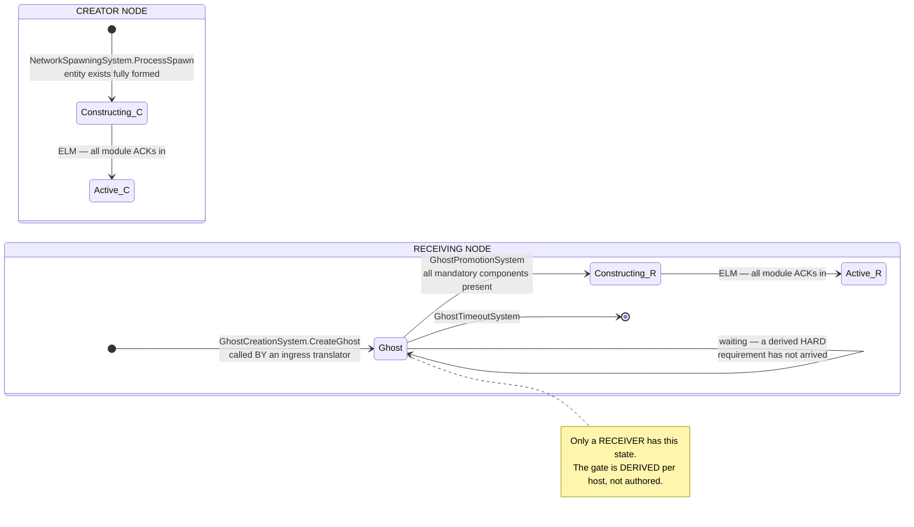
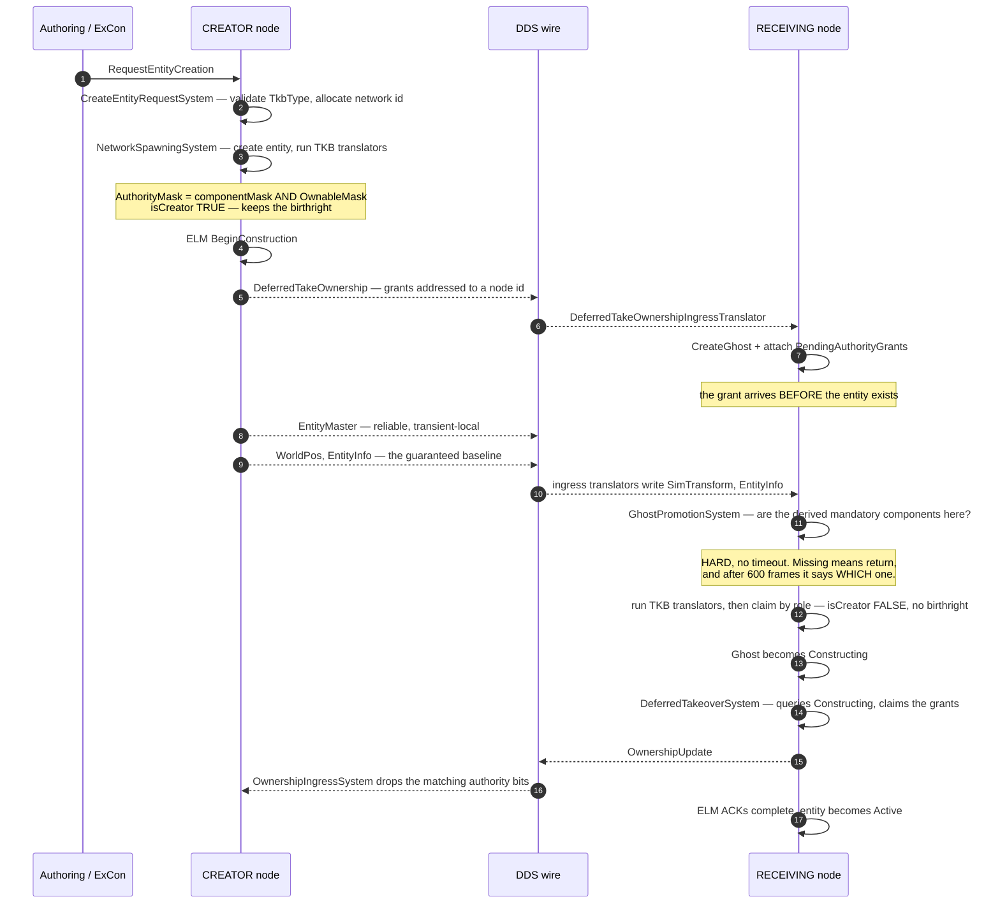
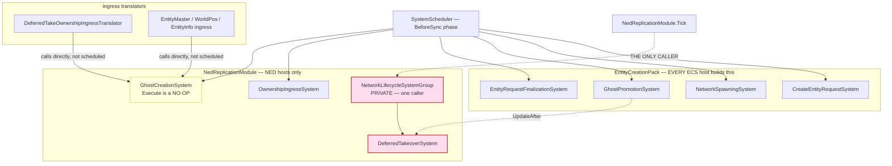
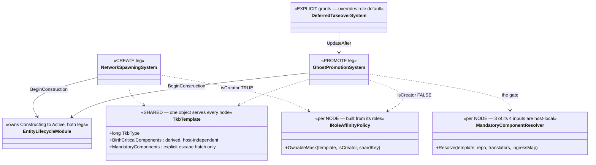

<!--STATUS
state: LIVE
build-state: N/A — this document describes a sequence that EXISTS. It specifies no new work.
updated: 2026-09-13
verified: 2026-09-13 — every stage below read from source this session, file:line inline.
  ⚠ check_index_coverage is NOT reachable through the codebase-memory CLI, so no coverage
  attestation is claimed; the enumerations were run through search_graph AND grep and agree.
current-answer: §1 IS THE DOCUMENT. Read the four diagrams in order and you have the whole genesis
  path. §2 is the stage table — it is a ROUTING TABLE to the owning designs, nothing more. §3 is the
  one question this document answers that no owner does. §4 is scope. §5 is rot found elsewhere.
  §6 is CHILD GENESIS (stage ⑪) and its three partial owners.
known-rot: ⛔ ONE, ITS OWN, corrected the same day it was written: the first version of §4 said child
  entities had "no owning design found". FALSE — that sentence was ASSERTED, not measured.
  designs/cgf-scn/DESIGN.md Decisions 5 + 11 and designs/commander-subordinates/DESIGN.md §7.2 both
  cover child genesis in substance. §6 now routes to them and records why a topical search reached
  neither. The retracted claim is named in §4 and §6 rather than deleted, because WHY it was wrong is
  the argument for this file existing. ⭐ §5 records rot found in OTHER documents.
owns: ⭐ EXACTLY ONE THING — THE END-TO-END STAGE SEQUENCE AND ITS VOCABULARY. No owning design has
  it, because each owns one stage. If a stage moves, THIS FILE IS WRONG and must be updated with it.
owns-nothing-else: ⛔ Do NOT cite this document to justify a change to any mechanism it draws.
  Every box belongs to an owner named in §2; the owner decides, this file only says where it sits.
  ⛔ And no structural fact here may be restated in an owning design, or the two will rot apart.
related-designs:
  - DESIGN_Cross_Node_Construction_Barrier.md — owns the RELIABLE-INIT variant of stage ⑨: how a creator
    holds an entity Constructing until peer nodes report ready (opt-in per entity), the timeout=abort-via-
    EntityMaster-dispose path, and the local poll-store result (§3b). Fast mode (this file's default) is unchanged.
  - DESIGN_Entity_Creation_Unification.md — owns the CREATE leg and EntityCreationPack: who may
    request an entity, which systems every host composes, and the authoring affordances.
  - DESIGN_Role_Affinity_Ownership.md — owns WHO OWNS WHAT: the role tables, the creator's
    birthright, and the two legs (create claims, promote claims) that must stay complementary.
  - designs/tkb-1/DESIGN.md — owns the TKB: templates, descriptors, translators, and the two derived
    component lists (birth-critical, mandatory) that gate the birthright and the promotion.
  - DESIGN_Entity_State_Sourcing.md — owns WHERE STATE MAY COME FROM (TKB defaults vs the wire);
    this file shows when each source is consulted, not which is legitimate.
  - blueprints/Architect_Question_65_Entity_Genesis_Uniformity.md — owns the RULING that there is one
    uniform pipeline rather than role-selected halves. This file draws the pipeline that ruling chose.
  - projects/Hrot/Network/Hrot.Network.NED.md — owns the NED wire: topics, QoS, the translator
    inventory, and "Diagram 3", the deferred-takeover protocol at DDS level.
  - designs/cgf-scn/DESIGN.md — Decisions 5 + 11 own CHILD ENTITIES most deeply: PartMetadata as the
    child marker, the double-spawn hazard, ChildComponentOverrides and PreAllocatedNetworkId. ⚠ Filed
    under "CGF scenario loading", so a topical search for "child entity" does not reach it.
  - designs/commander-subordinates/DESIGN.md — §7.2 owns COMPOSITE AUTHORING: TkbCompositionDef's
    subordinate slots, InitialUnitSubordinateIntent, GenesisMaterializationSystem.
  - designs/replication-fixes/REPL-DESIGN.md — §4.4 owns SubEntityCleanupSystem (child TEARDOWN, not
    genesis).
  - DESIGN_Cross_Node_Construction_Barrier.md — owns stage ⑨'s RELIABLE variant: how the creator holds
    Constructing until peer nodes report Active (reliable distributed init; the cross-node wait). Fast
    mode — the default this page draws — skips it.
  - DESIGN_Distributed_Scenario_Persistence.md — owns what the primary owner (set at the spawn stage,
    movable at the takeover stage) MEANS for scenario SAVE/LOAD: the per-entity save gate, the
    NetworkAuthority/NetworkOwnership merge, and the ECS↔network ownership seam. It consumes the owner
    this sequence establishes; it does not add a genesis stage.
-->

# ⭐⭐⭐ ENTITY GENESIS, END TO END — **the landing page**

> ⭐⭐ **What this is for.** The genesis path crosses **five** owning designs and **three** assemblies.
> Each owner is correct and none of them draws the whole line, so the shape has only ever existed in
> people's heads — and the one narrative that did draw it *(`projects/relationships/Hrot-Simulation-Pipeline.md`
> §4.3)* predates ghost promotion entirely and still reads as current. ⇒ **this file is the map.**

> ⛔⛔ **It is a MAP, not a territory.** Every mechanism here has an owner in §2. If this file and an
> owning design disagree, **the owner wins and this file is the bug.**

---

## 0. 📐 INVENTORY — **the enumerations the diagrams rest on** *(`2026-09-13`)*

⚠ **`check_index_coverage` is NOT reachable through the codebase-memory CLI** *(`unknown tool`)*, so no
coverage attestation is claimed. Every set below was run through **both** the graph and grep, and they agree.

| # | query | total | what it settled |
|---|---|---|---|
| ① | `search_graph(name_pattern="(Ghost\|Ownership\|Takeover\|TakeOwnership\|NetworkSpawning\|CreateEntityRequest\|EntityRequestFinalization\|Construction).*System", label="Class")` | **12** — 9 production, 3 test classes | the complete system cast of §1.3. Production: `NetworkSpawningSystem`, `GhostCreationSystem`, `GhostPromotionSystem`, `GhostTimeoutSystem`, `OwnershipEgressSystem`, `OwnershipIngressSystem`, `CreateEntityRequestSystem`, `EntityRequestFinalizationSystem`, `DeferredTakeoverSystem` |
| ② | `grep -rn "CreateGhost("` over `FDP/ Hrot/ Stride/`, minus tests | **8** production call sites, **0** from a scheduler | ⭐ `GhostCreationSystem.Execute` is a **no-op**; every ghost is made by a direct call from an ingress translator. This is why §1.3 colours it |
| ③ | `grep -rn "ExecuteGroup"`, minus tests | **1** production caller — `NedReplicationModule.cs:509` | 🔴 the dead edge in §1.3: `DeferredTakeoverSystem` is unreachable without the NED module |
| ④ | `grep -rl "GhostPromotion\|ghost promotion"` over `docs/ FDP/Docs/` | **38** documents | ⛔ none is an end-to-end explainer — the finding that produced this file |
| ⑤ | `grep -c "promote\|Promotion"` on `Hrot-Simulation-Pipeline.md` | **0** | §5's first row: the only other end-to-end narrative has no promotion stage at all |
| ⑥ | `grep -rli` over `docs/ .dev/ FDP/Docs/` for **8** child terms — `ChildBlueprint`, `SubEntity`, `sub-entity`, `PartMetadata`, `TkbCompositionDef`, `AsComposite`, `child entit`, `sub-part` | hits in **3** substantive designs | 🔴 **this is the one that corrected §4** — it was run only after the first version asserted "no owning design found". 📄 §6 |
| ⑦ | `grep -rn "ChildBlueprints"` over `FDP/ Hrot/ Stride/`, minus tests | **7** sites; the only ITERATOR is `CreateEntityRequestSystem.cs:363-400` | stage ⑪ is a loop inside ①, not a later stage |

---

## 1. ⭐⭐⭐ THE DIAGRAMS — *this is the document; §2 onward is routing*

### 1.1 The states, and what moves an entity between them

*What the picture shows that prose hides: **`Ghost` is not a stage of the creator's path at all.** The
creating node never has one. Two different nodes are drawn here, and only one of them ever waits.*

### 1.2 The genesis sequence across the wire

*What the picture shows that prose hides: **the order of the last three steps.** The grant arrives
**first** and waits; the takeover fires **after** promotion, not on arrival — so anything that delays
promotion delays the authority handover with it.*

### 1.3 Who registers what — ⚠ **and what never ticks**

*What the picture shows that neither of the above can: **`DeferredTakeoverSystem` is unreachable on a
host without the NED replication module.** It is not scheduled — it sits inside a private group whose
`ExecuteGroup` has **exactly one** production caller. On a BDC node or the editor's
`NullReplicationModule`, deferred grants are never claimed, and nothing says so.*

> 🔴 **Red = reachable ONLY through `NedReplicationModule.Tick`.** ⭐ Yellow = registered as a system but
> its `Execute` does nothing; the real entry point is a direct method call from a translator.

### 1.4 The participants

*What the picture shows that the sequence cannot: **which of these are per-node state and which are
shared records** — the distinction that decides where any derived answer may be cached.*

---

## 2. ⭐⭐ THE STAGE TABLE — **a routing table, not an explanation**

| # | stage | the code | ⭐ the OWNING design — go here to change it |
|---|---|---|---|
| ① | request → validate → allocate id | `CreateEntityRequestSystem.cs` | [`DESIGN_Entity_Creation_Unification.md`](DESIGN_Entity_Creation_Unification.md) · [`DESIGN_Entity_Authoring_Surface.md`](DESIGN_Entity_Authoring_Surface.md) |
| ② | spawn: entity + TKB projection | `NetworkSpawningSystem.cs:158-249` | [`designs/tkb-1/DESIGN.md`](designs/tkb-1/DESIGN.md) §6 *(translators)* |
| ③ | **the creator's authority** | `NetworkSpawningSystem.cs:229-238` — `AuthorityMask &= OwnableMask(isCreator: true)` | [`DESIGN_Role_Affinity_Ownership.md`](DESIGN_Role_Affinity_Ownership.md) §3.1, §3.9c |
| ④ | grant routing *(explicit, optional)* | `DeferredTakeOwnershipIngressTranslator.cs` → `PendingAuthorityGrants` | [`projects/Hrot/Network/Hrot.Network.NED.md`](projects/Hrot/Network/Hrot.Network.NED.md) "Diagram 3" *(⚠ see §5)* |
| ⑤ | ghost creation | `GhostCreationSystem.CreateGhost` — **called by translators, never by the scheduler** | [`projects/Hrot/Network/Hrot.Network.NED.md`](projects/Hrot/Network/Hrot.Network.NED.md) |
| ⑥ | **the promotion gate** | `GhostPromotionSystem.cs` + `MandatoryComponentResolver` | [`designs/tkb-1/DESIGN.md`](designs/tkb-1/DESIGN.md) **§6.6a / §6.6b** |
| ⑦ | **the promoter's authority** | `GhostPromotionSystem` — `OwnableMask(isCreator: false)` | [`DESIGN_Role_Affinity_Ownership.md`](DESIGN_Role_Affinity_Ownership.md) §3.2 |
| ⑧ | explicit takeover | `DeferredTakeoverSystem.cs` — queries `Constructing`, `[UpdateAfter(GhostPromotionSystem)]` | [`DESIGN_Role_Affinity_Ownership.md`](DESIGN_Role_Affinity_Ownership.md) §3.4 *(explicit grants still win)* |
| ⑨ | `Constructing` → `Active` | `EntityLifecycleModule.ProcessConstructionAck` | [`designs/two-ack/TwoAck-DESIGN.md`](designs/two-ack/TwoAck-DESIGN.md) · `FDP/Docs/projects/toolkits/FDP.Toolkit.Lifecycle.md` |
| ⑩ | ACK back to the requester | `EntityRequestFinalizationSystem.cs` | [`DESIGN_Entity_Creation_Unification.md`](DESIGN_Entity_Creation_Unification.md) |
| ⑪ | **CHILD entities / sub-parts** | `CreateEntityRequestSystem.cs:363-400` iterates `parentTemplate.ChildBlueprints` **inside stage ①**, before any spawn command is issued | see §6 — **three** partial owners, no single one |

⭐ **Stage ⑪ is not a later stage — it is a LOOP INSIDE ①.** A composite's children are spawned by the
same system that handled the parent's request, each getting its own network id and its own trip through
②–⑩. ⇒ everything above applies to a turret exactly as it does to its hull.

---

## 3. 🔒 THE ONE QUESTION THIS FILE ANSWERS THAT NO OWNER DOES

> **"There are three things that decide who owns a component. Which one wins?"**

⭐ They do not compete — **they apply at different moments, and each is narrower than the last:**

| | when | what it decides |
|---|---|---|
| **role affinity, create leg** ③ | the instant the entity is born, on the creating node | the default: *everything this node's roles may own*, **plus the creator's birthright** |
| **role affinity, promote leg** ⑦ | when a ghost promotes, on the receiving node | the complement: *everything this node's roles may own*, ⛔ **and no birthright** |
| **explicit grant** ⑧ | after promotion, only where a grant was addressed | **overrides both** — it is additive and deliberate |

⛔ **The two role legs must stay complementary or two nodes own one component and their egress fights.**
That property is not maintained by agreement — **both nodes evaluate the same function over the same
entity**, which is why the tables live in one place and take a role and nothing else.
📄 The rule and its rails: [`DESIGN_Role_Affinity_Ownership.md`](DESIGN_Role_Affinity_Ownership.md) §3.9c.

---

## 4. ⛔ SCOPE — **what this file deliberately does NOT draw**

| out of scope | why, and where it lives |
|---|---|
| **destruction / teardown** | a separate two-ack path with its own hazards — `FDP.Toolkit.Lifecycle.md`, [`designs/two-ack/TwoAck-DESIGN.md`](designs/two-ack/TwoAck-DESIGN.md) |
| **replay** | genesis is *suppressed* during playback rather than performed — [`designs/mgmt-1/DESIGN.md`](designs/mgmt-1/DESIGN.md) §8.10 |
| **which components are legitimate state** | [`DESIGN_Entity_State_Sourcing.md`](DESIGN_Entity_State_Sourcing.md) |
| **the DDS topics, QoS and translator inventory** | [`projects/Hrot/Network/Hrot.Network.NED.md`](projects/Hrot/Network/Hrot.Network.NED.md) |
| **child entities / sub-parts** | ⛔⛔ **an earlier version of this row said "no owning design found". THAT WAS FALSE** — see §2 stage ⑪ and §6. Three documents cover it; none is findable by topic |

---

## 5. ⚠ ROT FOUND IN OTHER DOCUMENTS — *(measured `2026-09-13`; each is fixed or flagged at source)*

| document | the rot |
|---|---|
| 🔴 [`projects/relationships/Hrot-Simulation-Pipeline.md`](projects/relationships/Hrot-Simulation-Pipeline.md) §4.3 | the only other end-to-end spawn narrative, and it contains **ZERO** occurrences of *"promote"*. It shows CGF as `isDefaultProcessor`, no `EntityCreationPack`, no role affinity and no promotion gate — the pre-P1/P2/P3 world. ⭐ A STATUS block with `known-rot` was added there rather than rewriting §4.3, which this file now supersedes |
| ⚠ [`projects/Hrot/Network/Hrot.Network.NED.md`](projects/Hrot/Network/Hrot.Network.NED.md) "Diagram 3" | the **protocol order is correct and it is the best picture of the handshake anywhere**. ⛔ But it predates `P2`: `GhostPromotionSystem` no longer belongs to the NED module — `EntityCreationPack` registers it on every ECS host. A correction note was added beside the diagram |

📌 **Both were found by asking *"is the genesis path described anywhere?"*** — and the answer being *"in
eleven places, none of them joined up"* is what produced this file.

---

## 6. ⭐⭐⭐ CHILD GENESIS — **stage ⑪, and the case that proves this file's point**

> 🔴🔴 **An earlier version of this document said *"no owning design found"* for child entities.**
> ⛔ **That was FALSE, and it was an ASSERTION rather than a measurement** — it is recorded here rather
> than quietly deleted because the *reason* it was false is the whole argument for a landing page.

📐 **Measured `2026-09-13` — child genesis is covered in THREE documents, and not one is reachable by a
topical search for "child entity":**

| what it owns | where | ⚠ why nobody finds it |
|---|---|---|
| ⭐⭐⭐ **the deepest treatment** — `PartMetadata` *(id 55)* is the child MARKER, attached by `NetworkSpawningSystem`; the double-spawn hazard; `ChildComponentOverrides` keyed by `PartMetadata.InstanceId`; `PreAllocatedNetworkId` so a child's id survives a scenario round-trip; ⛔ and **why `EntityInfo.CommanderId` must NOT be the child test** *(it would silently drop every subordinate unit)* | [`designs/cgf-scn/DESIGN.md`](designs/cgf-scn/DESIGN.md) **Decision 5** + **Decision 11** | it is filed under a programme named *"CGF scenario loading"* and reaches children only because extraction must **avoid** them |
| ⭐ **composite AUTHORING and the ORBAT angle** — `TkbCompositionDef`'s subordinate slots, `InitialUnitSubordinateIntent` on each spawned child, and `GenesisMaterializationSystem` resolving it once both ends are alive | [`designs/commander-subordinates/DESIGN.md`](designs/commander-subordinates/DESIGN.md) **§7.2** | filed under *"commander/subordinates"*; it says *"the system that processes `TkbCompositionDef`"* without naming it |
| ⚠ **TEARDOWN, not genesis** — `SubEntityCleanupSystem` | [`designs/replication-fixes/REPL-DESIGN.md`](designs/replication-fixes/REPL-DESIGN.md) **§4.4** | a `2026-03` bug-fix programme |

### ⭐ The shape, in one line

⭐⭐ **`CreateEntityRequestSystem` spawns children itself, inside stage ①** *(`:363-400`)*: for each
`ChildBlueprintDefinition` it allocates an id *(or takes `PreAllocatedId` from an override)*, resolves the
child's own TKB type, and issues a separate `SpawnEntityCommand`. ⇒ **a child is a first-class entity** —
it runs ②–⑩ exactly like its parent, and everything §3 says about ownership applies to it unchanged.

⚠ **One branch worth knowing about, because it looks like a bug and is not:**
`if (isScenarioLoad && !hasOverride) continue;` ⭐ On a scenario load, tactical subordinates were already
extracted as ROOT entities, so re-spawning them from the parent's blueprint list would duplicate them.
📄 That is Decision 5's rationale, stated from the extractor's side.

### 🔒 What was actually missing — and it is NOT a design

⛔ **No new design should be written for this.** The mechanism is specified, the hazards are named, and a
fourth document would be a fourth place to rot. ⭐ **What was missing was REACHABILITY**, which is exactly
what `CLAUDE.md`'s `related-designs` rule exists for — *"a design that does not name its NEIGHBOURS will be
missed"* — and the miss that produced that rule *(`mgmt-1` §8.10, found only via an architect relay)* has
the same shape: **the owning document lives under a programme name no topical search reaches.**

⇒ ✅ **The fix applied:** stage ⑪ above, plus reciprocal `related-designs` links between this file and
both owners — so the next reader finds them from the word *"child"* rather than from the word *"scenario"*.
