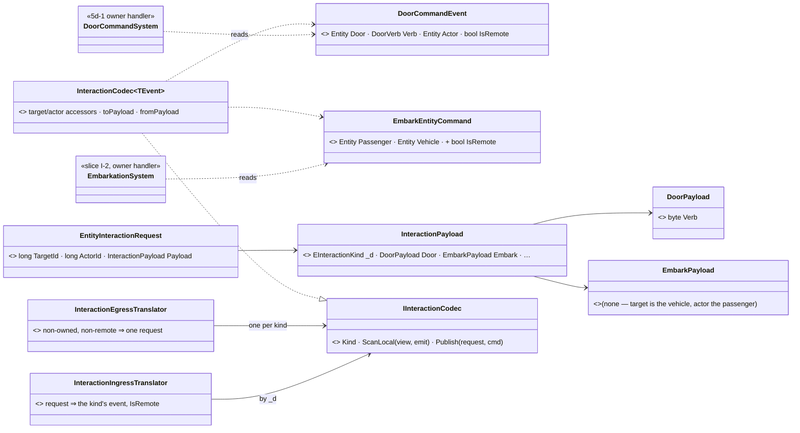
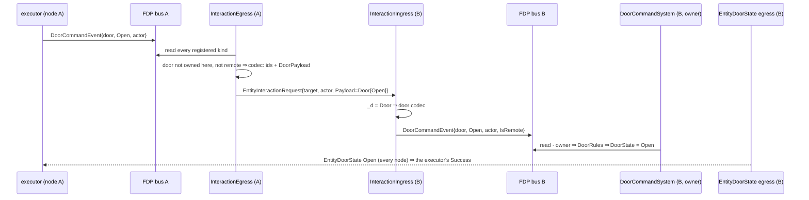
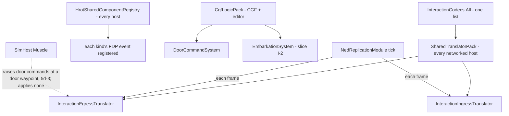
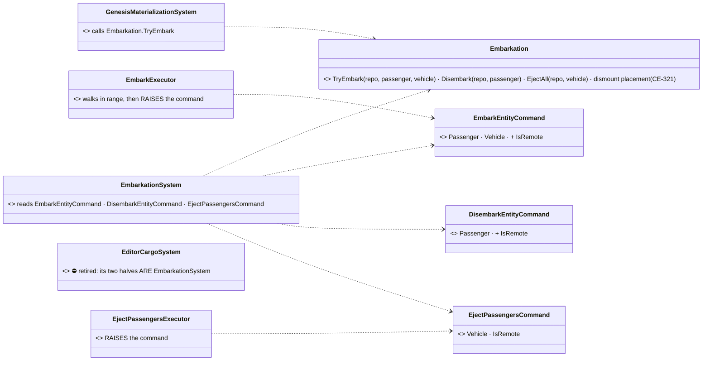
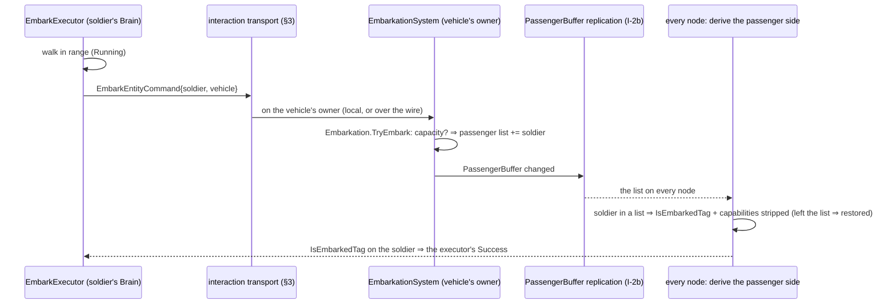

<!--STATUS
state: LIVE
updated: 2026-10-08 (I-1 as built; §7 split off to CE-3110 by the user)
build-state: BUILDING — I-1 built 2026-10-08; §7 (embarkation) is a separate task, CE-3110
current-answer: §2 the classes, §3 the sequence, §4 the modules, §5 the decisions, §6 the slices, §7 embarkation (I-2)
stale-below: nothing
known-rot: nothing yet
known-conflict: docs/DESIGN_Building_Interiors.md §3j "5d" — 5d-1 was built with a door-only topic (EntityDoorCommand) and door-only translators; slice I-1 here replaces them, and that section says so
related-designs:
  - docs/DESIGN_Building_Interiors.md §3j "5d" — OWNS doors (DoorRules, the door actions, DoorCommandSystem); doors are this design's first kind
  - docs/designs/edit-1/DESIGN.md §3.A — OWNS the typed FDP domain commands EmbarkEntityCommand / DisembarkEntityCommand; this design carries such commands to the owner
  - docs/DESIGN_Ownership_Groups_And_Grants.md — OWNS who owns what (descriptor claims, F-10 edit requests to the owner); a handler's gate is that design's descriptor ownership
  - docs/DESIGN_Role_Affinity_Ownership.md §6 — OWNS which role writes embarkation state (PassengerBuffer, IsEmbarkedTag)
  - FDP/Docs/projects/behavior-control/Behavior Control Subsystem Design.json.md §3.A–B — OWNS the interaction channel and its executors (the actor side)
-->

# DESIGN — **entity interactions** *(one way for an actor to act on an entity it does not own)*

> 🔒 **User, `2026-10-08`:** *"What if there are many other interactions with the world, like picking items, operating stuff in
> another way, boarding a vehicle, opening vehicle door… will we have separate topic for each, separate translator, separate
> event, separate handling system? It could grow."* → *"Wire compatibility matters. Dds fights this with data models. Extending
> data model is no issue on new interaction type. Arent dds unions good for that? Debuggability also matters. Fdp event with
> binary encoded data is opaque for anyone but the recipient."* → *"Measure just dds way but only if it matters, we anyway cant
> handle unknown interactions. Ignore dds monitor. Write design"*

**The rule:** each interaction kind is a **typed FDP event** (readable in every bus tool) applied by the **owner** of what it
changes. Every kind crosses the network on **one topic** whose payload is a **DDS union** with one case per kind. A new kind
extends the data model by adding a union case; it never adds a topic or a translator class.

## 1. INVENTORY — measured `2026-10-08`

| query | result |
|---|---|
| `search_graph` `.*(Executor)$` in `Behavior/Combat/Navigation.Executors` | 12. Interaction executors: `EjectPassengersExecutor`, `EmbarkExecutor`, the door actions (5d-1, after the graph snapshot) |
| `search_graph` `.*(Embark\|Disembark).*Command.*` | `EmbarkEntityCommand`, `DisembarkEntityCommand` (`Behavior/Events/`), designed in `edit-1/DESIGN.md` §3.A as **pure FDP domain commands**; one consumer, `EditorCargoSystem`. ⚠ The struct's doc names an `EmbarkationSystem` that does not exist, and `EmbarkExecutor` writes the vehicle's `PassengerBuffer` itself |
| `search_graph` / grep: request-to-owner wire messages *(the graph does not model the `[DdsTopic]` structs; grep)* | `CreateEntityRequest`, `DeleteEntityRequest`, `UpdateEntityDescriptorRequest`, `UpdateEntityAttributeRequest` (generic, VALUES), `WeaponFireRequest`, `EntityHitDamage` (one topic per kind), `MissionControlRequest`, `MapCommandRequest` (enum + JSON args, ExCon → IG UI), `EntityDoorCommand` (5d-1) |
| grep `[DdsUnion]` | `EntityDescriptorUnion` (`AllDescriptors.cs:75`), `AttributeValueUnion` (`GenericMessages.cs:72`): discriminator + `[DdsCase]` per kind. The bindings also have `DdsDefaultCase` and `DdsExtensibility`; nothing uses `DdsExtensibility` yet |
| `search_graph` `.*Event.*(Inspector\|Log\|Recorder).*` | `FdpEventBus.GetDebugInspectors()` (one inspector per event TYPE, events as objects with their fields), data breakpoints on bus events, the flight recorder records bus events |

## 2. CLASSES

*What it shows that prose hid:* the per-kind pieces are DATA (an event struct, a payload struct, a union case) plus one codec and
one handler. The transport, two translators and one topic, exists once. The FDP bus never sees the union, and the wire never sees
an entity handle.

## 3. SEQUENCE — an actor on node A opens a door owned by node B

## 4. MODULES — who registers, who runs it each frame

*What it shows that prose hid:* the translators tick wherever the NED module ticks, which is every networked host. Handlers tick
only on the Brain tier, where the doors and vehicles they change are owned. A command raised on a SimHost always crosses the
wire, even in `--mode all`, because each host keeps its own world. The dashed edge is 5d-3, not built.

## 5. DECISIONS

| decision | ⭐ lean | rejected (one line each) |
|---|---|---|
| the FDP side | ⭐ **one typed event per kind**, fields named for what they mean: readable in the bus inspectors, data breakpoints and the flight recorder. Existing typed domain commands (`EmbarkEntityCommand`) join as they are, plus `IsRemote` | one generic event with a byte block: opaque to every bus tool (user) · one event carrying the union: the inspector shows every case of it, not the one that happened |
| the wire | ⭐ **one topic, `EntityInteractionRequest`**, payload a **DDS union** keyed by `EInteractionKind`, one case per kind; Reliable + KeepAll (commands are events, CE-3095) | a topic per kind: grows the transport per kind (5d-1's shape) · a byte block: opaque on the wire (user) · `UpdateEntityAttributeRequest`: carries a VALUE, not an action the owner may refuse · `MapCommandRequest`'s JSON args: untyped, allocates, a UI channel |
| entities | ⭐ **target and actor in the header**, as network ids, mapped once by the generic translator; a payload names any further entity as an explicit network-id field its codec maps | entity handles in the payload: node-local, meaningless on another node |
| per-kind code | ⭐ a **codec** (`InteractionCodec<TEvent>`: target/actor accessors + event ↔ payload), listed in ONE `InteractionCodecs.All` | a translator class per kind: the growth this design removes |
| the loop guard | ⭐ each command event carries **`IsRemote`**; the egress skips remote events and events whose target this node owns | tracking which events the ingress injected: hidden state that a second publisher of the same event bypasses |
| the owner gate | ⭐ each **handler** gates on the ownership of the descriptor it writes (doors: `PackKey(dtDoorState,0)`, as built) | one gate in the transport: it cannot know which descriptor a kind changes |
| the answer | ⭐ the target's own replicated state; the actor's executor waits for it | a reply topic: a second message for what the state already says |
| wire compatibility | ⭐ **a cluster runs one build.** A new kind = a new enum member + a union case, appended; a node that does not know a kind drops it (it could not handle it anyway, user). ⛔ Not measured how CycloneDDS.NET decodes an unknown case on an older node. Per the user, it does not matter while every node runs one build | measure cross-version decoding now: no mixed-version cluster exists to need it |

**Known limits:**
- **Per-kind work:** every kind still needs its event, payload, codec, handler and executor. That is the kind's own data model and logic, and the transport needs nothing more.
- **Wire layout:** a payload's layout is wire format like any descriptor, so it changes only by appending.

## 6. SLICES

| slice | content | state |
|---|---|---|
| **I-1** | `EntityInteractionRequest` + `InteractionPayload` (case `Door`) + `EInteractionKind` (Door = 1; **Embark = 2, Disembark = 3, EjectPassengers = 4 RESERVED**, so §7's kinds cannot collide); `IInteractionCodec` / `InteractionCodec<T>` / `InteractionCodecs.All`; `InteractionEgressTranslator` + `InteractionIngressTranslator` in `SharedTranslatorPack`. Doors run on it; 5d-1's `EntityDoorCommand` and its two translators are DELETED, `dtDoorCommand` (121) retired, the topic is `dtInteractionRequest` (122) | ✅ built `2026-10-08` |
| **I-2** | embarkation onto this shape: ⛔ **split off as its own task, `CE-3110`** (user, `2026-10-08`: *"Leave the decision to be made as part of solving the embaraktion details later, as a separate task. I just need that iteraction shape unified now, so they do not collide later."*). §7 records the analysis and the open Q-1; I-1 reserves its kinds | ⏭ `CE-3110` |
| **I-3** | an `InteractionExecutor<TEvent>` base: reach + action time + one event + wait for the expected state. The door actions and Embark use it | ⏭ |

| rails | ✅ `EntityDoorStateTranslatorTests.Stage5d_*` re-pointed at the generic topic, unchanged in what it asserts · ✅ `InteractionTransportTests.R221_*`: the door round trip through its union case, the loop guard (a remote event and an owned target are never sent), an unknown kind dropped and counted · ⏭ Embark across two nodes (`CE-3110`) |
|---|---|

## 7. EMBARKATION — one applier, three callers *(slice I-2 → its own task, `CE-3110`)*

> ⚠ **Analysis, not a plan to build now.** The user split embarkation off as a separate task. Q-1 below is decided THERE.
> What I-1 guarantees today: the embark/disembark/eject kinds are reserved in `EInteractionKind`, so they will join this shape
> without colliding.

> 🔒 **User, `2026-10-08`:** *"Are embark and disembark similar logical category to open door and other interactions? If they
> fit, is there unification potential?"* → *"Yes, fold it in as I-2"*

**Same category, one difference.**
- **The same:** an actor acts on a target, under a precondition (reach, capacity), and the result is state on the target.
- **The difference:** a door changes only itself. Embark changes the vehicle (its passenger list) AND the passenger (its
  capabilities and its embarked tag). Eject changes the vehicle and every passenger.

| claim | code — how it IS | design — how it was MEANT |
|---|---|---|
| boarding is implemented three times | ✅ `EmbarkExecutor.cs:73-89` (Brain) · `EditorCargoSystem.cs:35-47` (editor) · `GenesisMaterializationSystem.cs:80-98` (SimHost, scenario load) | ⛔ ruling 9: one implementation per concept |
| leaving is implemented twice | ✅ `EjectPassengersExecutor.cs:48-90` · `EditorCargoSystem.cs:68-88` | same |
| the commands exist and were meant for a kernel applier that was never built | ✅ `EmbarkEntityCommand`/`DisembarkEntityCommand` name an `EmbarkationSystem` that does not exist; the editor is their only consumer | ✅ `edit-1/DESIGN.md` Phase 3: *"consumed by execution systems in the kernel"* |
| the state is cross-role, with no single owner | ✅ registered by `EmbarkationComponentRegistry` on SimHost, CGF and the editor | ✅ `DESIGN_Role_Affinity_Ownership.md` slice 3a: *"belongs to no single role"*; §3.9a: OWNED by SimHost (genesis writes it) |
| the state never replicates | ✅ no translator under `Hrot/Network` or `Replication/` names `PassengerBuffer` or `IsEmbarkedTag` | ⛔ nothing says how another node learns it |
| ⇒ a runtime boarding on CGF never reaches the SimHost that moves the bodies | ⛔ **inferred from the row above, not observed live** | — |

*What it shows that prose hid:*
- **One writer of the rules:** only `Embarkation` writes the passenger list, the tag and the capabilities.
- **Commands, not writes:** the executors and the editor's authoring raise commands; scenario load calls the rules directly.
  It resolves saved intents inside the load transaction, where a command would land a frame late.
- **The editor's system disappears**, because what it did is exactly the designed applier.

| decision | ⭐ lean | rejected (one line each) |
|---|---|---|
| where the rules live | ⭐ one static `Embarkation` (capacity, the list, the tag, the capabilities, the CE-321 dismount placement) | three copies, as today: they already differ (eject places passengers beside the hull, CE-321; the editor's disembark leaves them where they were) |
| who applies a command | ⭐ `EmbarkationSystem`, the consumer the commands were designed for (`edit-1` Phase 3), gated on owning the VEHICLE | the actor's node writes both entities: today's cross-node defect · `EditorCargoSystem` kept beside it: two appliers for one command |
| scenario load | ⭐ genesis calls `Embarkation` directly | genesis raises commands: the load transaction resolves intents and must not wait a frame |
| eject | ⭐ a new `EjectPassengersCommand { Vehicle }`; the vehicle's owner ejects everyone | one `DisembarkEntityCommand` per passenger: N commands for one action, and the dismount column needs them together |
| **Q-1: the passenger's side across nodes (I-2b)** | ⭐ **the vehicle's owner is the only arbiter; `PassengerBuffer` replicates from it (a new descriptor); every node DERIVES `IsEmbarkedTag` and the stripped capabilities from the list it holds.** One source of truth, one writer | the vehicle's owner also writes the passenger's components: needs the passenger's ownership too · a second request from the vehicle's owner to the passenger's owner: two round trips, and the two can disagree in between · replicate `IsEmbarkedTag` as well: a second copy of one fact |

✅ **Q-1 APPROVED `2026-10-08`** — 🔒 user: *"3110 lean approved"*: the vehicle's owner is the only arbiter of a boarding, `PassengerBuffer` replicates from it, every node derives the passenger's side. ~~**Q-1 needs your nod.** It adds a replicated descriptor and turns `IsEmbarkedTag` and the embark-capability bits into derived~~
state, which touches combat's `ActorCapabilityState` (SimHost-owned, §3.9a). ⛔ **Not yet measured:** which systems read
`IsEmbarkedTag` and the capability bits, and whether any of them would run before the derivation in a frame. That gets enumerated
before I-2b is built.

| I-2 slices | content |
|---|---|
| **I-2a** *(single node correct; no new replication)* | `Embarkation` rules · `EmbarkationSystem` + `EjectPassengersCommand` · `EmbarkExecutor`/`EjectPassengersExecutor` raise commands · `EditorCargoSystem` retired · genesis calls the rules · `IsRemote` on the two existing commands · both kinds registered with the interaction transport |
| **I-2b** *(across nodes, after Q-1)* | `PassengerBuffer` descriptor + translators (owner → every node) · the derivation system · the cross-node rail (a soldier on one node boards a vehicle owned by another) |
