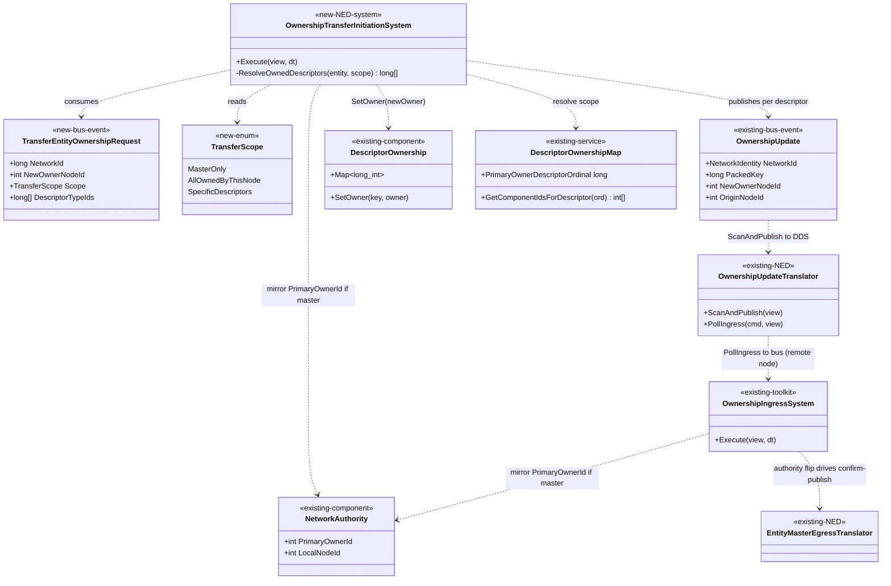
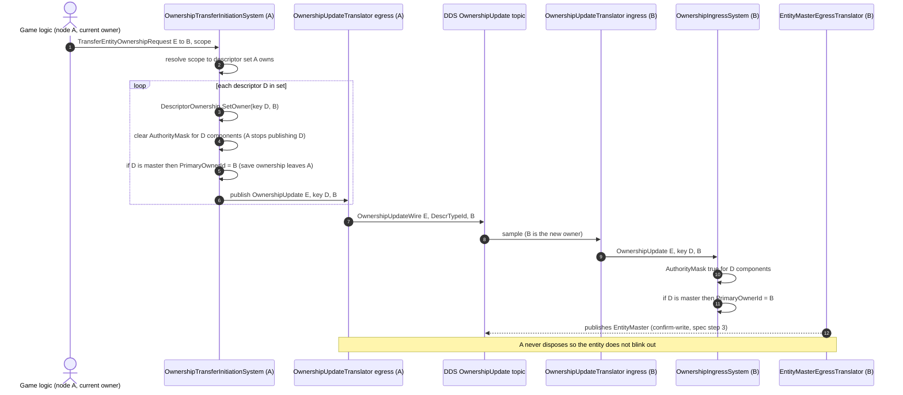
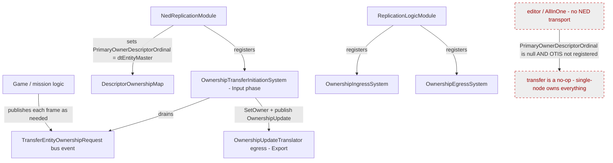
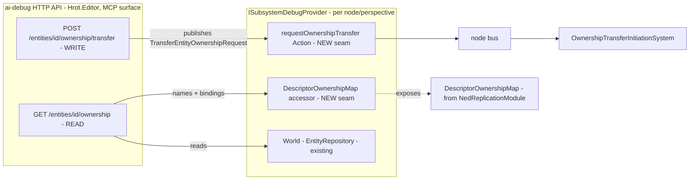

<!--STATUS
state: LIVE
updated: 2026-09-15
build-state: READY-TO-BUILD
current-answer: §1 the level ruling (descriptor-level, NED-initiated), §2 the diagrams (class +
  sequence + module + §2.4 HTTP surface), §3 the scope model, §4 the save-ownership rule, §5
  native-vs-external + the multi-node follow-on, §5a the ai-debug HTTP endpoints (drive + verify). The
  RECEIVE side is already built (OQ12 / CE-275 ④, see the persistence design §6c); THIS doc is the
  INITIATION side (CE-276) PLUS its HTTP surface, built as one feature.
stale-below: nothing yet (new document).
known-rot: nothing known.
known-conflict: DESIGN_Distributed_Scenario_Persistence.md §6c's "measured gap" note prescribes making
  NetworkAuthority a REPLICATED descriptor to enable transfer. THIS doc supersedes that: initiation is
  descriptor-level (emit an EntityMaster OwnershipUpdate), and PrimaryOwnerId is DERIVED from that on both
  sides — NetworkAuthority never needs to be replicated. The §6c note is being marked superseded in the
  same change.
superseded-by: —
design-basis:
  - docs/reference/BDC_NED_SST_Descriptor_Rules.md (AUTHORITATIVE wire spec) — L129 "ownership is
    determined for each descriptor individually, allowing for partial owners"; L137-141 the OwnershipUpdate
    handoff (current owner stops writing WITHOUT dispose; new owner writes to confirm); L60/67 EntityMaster
    controls the entity's life; L69 a non-master descriptor's default owner IS the EntityMaster owner.
  - docs/DESIGN_Distributed_Scenario_Persistence.md §6c — the ECS↔network seam, the receive-side
    OwnershipUpdate→PrimaryOwnerId mirror (OQ12 / CE-275 ④), the three-layer split.
  - docs/blueprints/Architect_Question_59_*.md §7.3 (Q59-E, user ruling 2026-08-26): "attributes are
    entity-related, network agnostic. In contrary, descriptors are a NED network concept." → transfer is a
    NED-level, per-descriptor operation.
related-designs:
  - DESIGN_Distributed_Scenario_Persistence.md — owns the SAVE GATE (reads NetworkAuthority.PrimaryOwnerId)
    and the RECEIVE side of a transfer (§6c, OQ12); THIS doc owns the INITIATION side. Reciprocal.
  - DESIGN_Role_Affinity_Ownership.md — owns WHO OWNS WHICH descriptor/component per role (the role-affinity
    tables); THIS doc moves ownership between nodes but never decides the role policy.
  - DESIGN_Entity_Genesis_End_To_End.md — owns the genesis stage sequence incl. the per-component takeover
    (DeferredTakeoverSystem, the PULL model); THIS doc is the PUSH (hand-away) counterpart on the same wire.
-->

# Entity ownership transfer — INITIATION (CE-276)

> **Tracker:** CE-276. The RECEIVE side (an external `OwnershipUpdate` for `EntityMaster` mirrored into
> `PrimaryOwnerId`) shipped as OQ12 / CE-275 ④. THIS is the reverse: **a node handing an entity (or part of
> it) away.**
> 🔒 **User ruling `2026-09-15`:** *"descriptor ownership transfer is network level so it must use network
> descriptor types, not underlying ECS component types."* · *"master only must be possible… but usually we
> move almost all at once… options should be available (transfer selected set OR transfer all)."*

**build-state: BUILT** `2026-09-15` — §2 carries the class + sequence + module + HTTP UML; §3 the scope model.
AS-BUILT matches the design: `OwnershipTransferInitiationSystem` (NED, role-independent), the three-scope
resolver keyed on `HasAuthority(entity, PackKey(ordinal,0))`, the loser-mirror + wire publish reusing the
existing `OwnershipUpdate` egress, and the two ai-debug endpoints (§5a). Rails: `OwnershipTransferInitiationTests`
4/4. Full solution builds clean; route-doc gate green; ai-debug catalog + SKILL regenerated (101 tools).
✅ **LIVE `--mode all` PROOF `2026-09-15`:** over the new HTTP endpoints — `POST /entities/1001/ownership/transfer
{newOwnerNodeId:100, MasterOnly}` from CGF (400) → CGF `primaryOwnerId 400→100`, master `ownedByThisNode=false`;
IG (100, receiver) `primaryOwnerId=100`, master `ownedByThisNode=true`. Wire log confirms the full chain
(initiation → egress `EntityId=1000 TypeId=0 NewOwner=1` → ingress on peers). `GET …/ownership` is the
verification surface, exactly as designed.

✅ **RECEIVE-SIDE UNIFIED `2026-09-15` — every NED host can now receive an `EntityMaster` transfer.**
Originally `OwnershipIngressSystem` (the OQ12 `OwnershipUpdate→PrimaryOwnerId` mirror) was registered ONLY on
pure-Brain + pure-IG nodes, so a Muscle received the wire ingress but never APPLIED it (measured: `CGF→SimHost`
left SimHost at `primaryOwnerId=-1`, while `CGF→IG` applied). ⇒ it is now registered **role-independently** in
`NedReplicationModule` (one unconditional registration replacing the two role-gated ones; consuming a node's own
takeover loopback is idempotent). `LocalAuthorityYieldSystem` stays pure-Brain (separate concern). **LIVE
RE-PROOF:** the same `CGF→SimHost (Muscle) MasterOnly` transfer now lands — SimHost `primaryOwnerId=1`, master
`ownedByThisNode=true`. ⇒ initiation AND receive are both host-agnostic; a whole-entity handover to a
Muscle-bearing external host is unblocked.

---

## 0. INVENTORY — the ownership-transfer machinery that already exists  *(grep + graph, `2026-09-15`)*

⭐ Initiation must reuse the existing per-descriptor transfer path, so the full set of parts is enumerated first.

```
grep "Publish(new OwnershipUpdate|ReadEvents<OwnershipUpdate>" --include=*.cs FDP Hrot   → the bus-event producers/consumers
search_graph name_pattern=".*Ownership.*"  (Class/System)                                → the systems + service
```

| part | role | reuse in CE-276 |
|---|---|---|
| `OwnershipUpdate` (`Fdp.Toolkits/Replication/Messages`, bus event `{NetworkId, PackedKey, NewOwnerNodeId, OriginNodeId}`) | the transport-agnostic transfer event; `OwnershipUpdateMsg` is an ALIAS of it in NED | ✅ emit it |
| `OwnershipUpdateWire` = `Fdp.Network.Cyclone.Topics.OwnershipUpdate` `{EntityId, DescrTypeId, InstanceId, NewOwner}` | the DDS wire form | ✅ (unchanged) |
| `OwnershipUpdateTranslator` (NED) — `ScanAndPublish` (bus→DDS, own-origin only), `PollIngress` (DDS→bus, drops loopback) | the wire egress/ingress | ✅ (unchanged) |
| `OwnershipEgressSystem` (toolkit) — diffs `DescriptorOwnership.Map`, publishes `OwnershipUpdate` per changed key | the diff-based emit | ✅ (an alternative emit path) |
| `OwnershipIngressSystem` (toolkit) — applies an `OwnershipUpdate`: `Map`, `AuthorityMask`, and the master→`PrimaryOwnerId` mirror | the RECEIVE side | ✅ already built (OQ12) |
| `DeferredTakeoverSystem` (NED) — the PULL takeover (gaining node claims) | the pattern CE-276 mirrors (push) | ✅ pattern reuse |
| `DescriptorOwnership` (component) `Map: Dictionary<long,int>` + `SetOwner` | per-descriptor owner dictionary | ✅ write it |
| `DescriptorOwnershipMap` (service) — descriptor↔component bridge, `GetComponentIdsForDescriptor`, `PrimaryOwnerDescriptorOrdinal` | resolve descriptor→components; identify master | ✅ resolve scope |
| `NetworkAuthority` (component) `PrimaryOwnerId`,`LocalNodeId` | the save-ownership fact | ✅ mirror on master |
| `EntityMasterEgressTranslator` (NED) — publishes `EntityMaster` for entities this node has authority over | derives publish from authority | ✅ auto-confirms / auto-stops |

**New in CE-276:** exactly two types + one system (§2) — a request event, a scope enum, and the NED initiation system. **No new wire message, no new transport, no replication of `NetworkAuthority`.**

---

## 1. THE LEVEL — descriptor-level, initiated at the NED transport layer

⭐⭐⭐ **The unit of ownership transfer is the network DESCRIPTOR, not the ECS component.** This is forced by
the measured many-to-many mapping in `DescriptorOwnershipMap` (its own docs): a descriptor binds an **array**
of components (`Dictionary<long,int[]>`), and a component belongs to **several** descriptors
(`Dictionary<int,long[]>`, e.g. `SimTransform` is covered by both `BdcWorldPosTranslator` and
`GeoSpatialEgressTranslator`). ⇒ "transfer component X" is ambiguous (which descriptor?) and leaky (its
descriptor's siblings come along). The wire `OwnershipUpdate` carries `DescrTypeId`; the transfer is
per-descriptor by construction.

| layer | assembly | its part in a transfer |
|---|---|---|
| ECS core (network-agnostic) | `Fdp.Core` | holds per-component `AuthorityMask`; **no descriptor concept** |
| replication toolkit (transport-agnostic MECHANISM) | `Fdp.Toolkits/Replication` | executes an ownership change per **opaque descriptor ordinal** (`DescriptorOwnership.Map`, egress/ingress) — never names a descriptor |
| **NED transport (INITIATION lives here)** | `Hrot.Network.NED` | knows the concrete descriptors (`EDescriptorType`), the entity's descriptor set, and the descriptor↔component bindings → **decides which descriptors move** |

⇒ initiation is a NED operation expressed in `EDescriptorType`; the toolkit stays the executor. *(This is the
Q59-E ruling made operational: descriptors are a NED concept.)*

---

## 2. THE DIAGRAMS

### 2.1 Class — existing machinery + the three new boxes



*Caption:* the only new boxes are the top three; every arrow below `OwnershipUpdate` is the **already-built**
path (the same one the receive side and `DeferredTakeoverSystem` use). The diagram makes the reuse explicit —
CE-276 adds an *entry point*, not a pipeline.

### 2.2 Sequence — A hands an entity to B



*Caption:* what prose hides — **A's local mirror is manual** (steps inside the loop), because A's own
ingress drops the loopback (`OriginNodeId == local`), so A must apply the loser-side effect itself; B's side
is entirely the built receive path. Confirm-write and stop-write are **derived** from the authority flip by
`EntityMasterEgressTranslator`, not coded here.

### 2.3 Module — who registers it, which phase, who drives it, what is NEVER reached



*Caption:* the **dead edge (red, dashed)** is the load-bearing part — on the editor / AllInOne host there is
no NED transport, `PrimaryOwnerDescriptorOrdinal` is `null`, and `OwnershipTransferInitiationSystem` is not
registered, so a transfer request is a **no-op** and that is CORRECT (a single-node host owns everything by
construction, sees no peers). Transfer only means anything where NED runs.

### 2.4 HTTP surface — the ai-debug endpoints that drive AND verify it



*Caption:* the two endpoints are **thin** — a read that joins the `EntityRepository` (already reachable) with
the newly-exposed `DescriptorOwnershipMap` for descriptor *names/bindings*, and a write that publishes the
§2.2 request through a new provider seam (mirroring the existing `requestSaveScenarioJson` seam). The read is
the **verification surface** for the write: query ownership per descriptor before, transfer, query after —
the same raw-HTTP proof pattern used for T-C when the MCP was down. Both are **capability-gated**: on a host
with no NED (`DescriptorOwnershipMap`/seam null) they answer `503`, exactly as the module dead-edge predicts.

---

## 3. THE SCOPE MODEL — expressed in DESCRIPTOR TYPES

`TransferScope`:

| value | descriptors moved | typical use |
|---|---|---|
| `MasterOnly` | just `EntityMaster` (if we own it) | hand off entity identity + save ownership; leave every other descriptor where it is |
| `AllOwnedByThisNode` | **every descriptor THIS node currently owns** for the entity | the common case; naturally excludes descriptors owned by other roles |
| `SpecificDescriptors(EDescriptorType[])` | the named subset (of the ones we own) | "transfer selected set" — e.g. everything except the world-position descriptor |

⭐ **Resolution is authority-based, not `Map`-based.** A spawn-owned descriptor may have no
`DescriptorOwnership.Map` entry yet (the `Map` records transfers/overrides), so "do I own descriptor D" is
answered by **`AuthorityMask` over D's component ids** (`DescriptorOwnershipMap.GetComponentIdsForDescriptor`).
`AllOwnedByThisNode` iterates the registered descriptors and keeps those we have authority over.

⛔ **The API names `EDescriptorType`, never component types** (the `2026-09-15` ruling). A component→descriptor
helper may exist elsewhere, but it is **not** the transfer API — that would reintroduce the leaky
many-to-many abstraction §1 rejects.

---

## 4. THE SAVE-OWNERSHIP RULE

`NetworkAuthority.PrimaryOwnerId` (and therefore the scenario save gate, persistence design §6) moves **iff
`EntityMaster` is in the transferred set.** So:

- `MasterOnly` and `AllOwnedByThisNode` (which includes master when we own it) → **save ownership moves.**
- a `SpecificDescriptors` set that **excludes** `EntityMaster` → we hand off some descriptors but **keep
  saving the entity** — a spec-legal partial/split owner (BDC spec L129).

This is the same rule the receive side already enforces (mirror only on the master ordinal); CE-276 just
applies it on the initiating node too, where the loopback drop means it must be done explicitly.

---

## 5. NATIVE vs EXTERNAL — and the multi-node follow-on

⭐ **The "almost all" the user described falls out for free: a node can only transfer descriptors it owns.**

- **Native (CGF/SimHost/IG):** the Brain owns `EntityMaster` + brain descriptors; the Muscle owns the
  world-position descriptor (`SimTransform`). Brain does `AllOwnedByThisNode` → moves its descriptors incl.
  master, but **not** the Muscle's world-position (it isn't the Brain's to give). ⇒ "keep `SimTransform` on
  the Muscle" is automatic.
- **External all-roles host:** a *whole-entity* handover (every descriptor, incl. the Muscle's) means **each
  owning node transfers its share** to the target. That is a **multi-node orchestration ON TOP OF this
  per-node primitive**, not part of it:

⚠ **FOLLOW-ON (not built here):** a cluster-level "consolidate entity E onto node N" flow that instructs each
current owner to `Transfer(E, N, AllOwnedByThisNode)`. The primitive in this doc is the building block; the
orchestration (who coordinates, ordering, ack) is a separate design when the external-host case is real.
📌 Ordering note for that design: the BDC spec prefers `EntityMaster` **last** on publish and **first** on
unpublish; a whole-entity transfer should sequence the master appropriately so the entity never appears
ownerless mid-transfer.

---

## 5a. THE HTTP SURFACE (ai-debug) — how the feature is driven and tested

⭐ The ai-debug HTTP API is the way to exercise and *verify* the transfer on a live `--mode all` cluster
(and the only way when the MCP server is down). Two endpoints, both **capability-gated** on NED presence.

| endpoint | reads / does | reachability |
|---|---|---|
| **`GET /entities/{id}/ownership`** | per-descriptor owner (`DescriptorOwnership.Map` + `AuthorityMask`), `PrimaryOwnerId`, and — via the newly-exposed `DescriptorOwnershipMap` — each descriptor's **name (`EDescriptorType`) + bound component ids**, and whether *this* node owns it | `EntityRepository` (already held) + `DescriptorOwnershipMap` (new provider seam) |
| **`POST /entities/{id}/ownership/transfer`** `{ newOwnerNodeId, scope, descriptors?[] }` | publishes a `TransferEntityOwnershipRequest` (§2.2) on the node's bus; `scope` ∈ `MasterOnly`/`AllOwnedByThisNode`/`SpecificDescriptors`; `descriptors` are `EDescriptorType` names (never components — §1/§3) | new `requestOwnershipTransfer` provider seam |

**Plumbing (the standard seam-per-dependency pattern):**
- `NedReplicationModule` exposes its `DescriptorOwnershipMap` (a getter — today it is private).
- `ISubsystemDebugProvider` gains two members: the `DescriptorOwnershipMap` accessor and a
  `requestOwnershipTransfer` `Action<TransferEntityOwnershipRequest>` (mirrors the existing
  `requestSaveScenarioJson` seam).
- Each NED-transport subsystem (`Hrot.IG` · `Hrot.CGF` · `Hrot.SimHost` · `Hrot.ExCon`) passes both into its
  `CreateDebugProvider(...)`. The editor / AllInOne passes `null` → the endpoints answer `503`
  (`"This host wires no NED transport"`), consistent with the §2.3 dead edge.
- A new `DebugApiService.Ownership.cs` partial + two `_routes.Add` entries + `RouteDoc`s + the
  `tools/ai-debug-mcp` tool-catalog / SKILL regen.

⛔ **The transfer endpoint is a THIN publisher** — it owns no transfer logic; it just triggers the §2.2
primitive. So it cannot exist before build items 1–3.

⚠ **Cross-lane note:** this feature spans the **MCP lane** (`Hrot.Editor/DebugApi`), the shared
`Hrot.Presentation` provider, four subsystems, and the NED/toolkit primitive — built together as one feature
(the MCP lane being inactive, the persistence/NED session carries it).

---

## 6. WHAT THIS SUPERSEDES

`DESIGN_Distributed_Scenario_Persistence.md` §6c's "measured gap" note said the transfer feature must make
`NetworkAuthority` a **replicated descriptor / TargetComponent**. ⛔ **Not needed.** `PrimaryOwnerId` is
**derived** from the `EntityMaster` descriptor's ownership on **both** sides (receive: OQ12 mirror; initiate:
this doc's mirror), so the owner id never has to travel as a replicated component value. §6c is being marked
superseded on this point in the same change, with a pointer here.

---

## 7. BUILD ITEMS (for the batch that implements this)

1. `TransferEntityOwnershipRequest` (bus event) + `TransferScope` enum + optional `DescriptorTypeIds`.
2. `OwnershipTransferInitiationSystem` (Hrot.Network.NED, Input phase): drain requests → `ResolveOwnedDescriptors(entity, scope)` → per descriptor: `SetOwner(key, newOwner)`, clear our `AuthorityMask` for its components, publish `OwnershipUpdate{…, OriginNodeId=local}`, and if `descriptorOrdinal == PrimaryOwnerDescriptorOrdinal` mirror `NetworkAuthority.PrimaryOwnerId = newOwner`.
3. Register it in `NedReplicationModule`; no-op safe when `PrimaryOwnerDescriptorOrdinal` is null.
4. **HTTP surface (§5a):** expose `DescriptorOwnershipMap` from `NedReplicationModule`; add the two `ISubsystemDebugProvider` seams (map accessor + `requestOwnershipTransfer`); wire them in IG/CGF/SimHost/ExCon `CreateDebugProvider` (editor → null → 503); add `DebugApiService.Ownership.cs` with `GET /entities/{id}/ownership` + `POST /entities/{id}/ownership/transfer`, the `_routes` entries, `RouteDoc`s, and the `tools/ai-debug-mcp` catalog/SKILL regen.
5. Rails (into the ownership feature suite): `OwnershipTests` — initiate `MasterOnly` (PrimaryOwnerId + master authority leave us; other descriptors untouched), `AllOwnedByThisNode` (all our descriptors leave, a foreign-owned one is untouched), `SpecificDescriptors` excluding master (descriptors move, PrimaryOwnerId stays); an integration rail on `ClusterRunner.Integration.Tests` proving B publishes `EntityMaster` after and A goes quiet without the entity disappearing; a live `--mode all` proof over the new HTTP endpoints (`GET /entities/{id}/ownership` before/after a `POST …/transfer`).
6. Fold the §6c supersession + reciprocal `related-designs` links.
