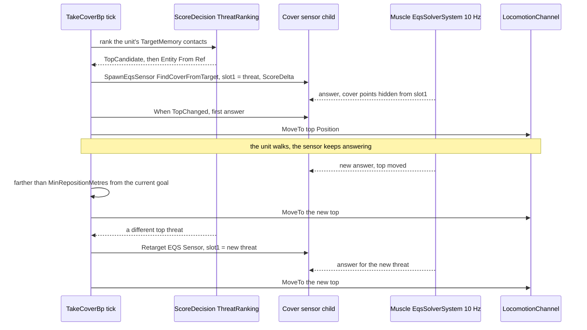
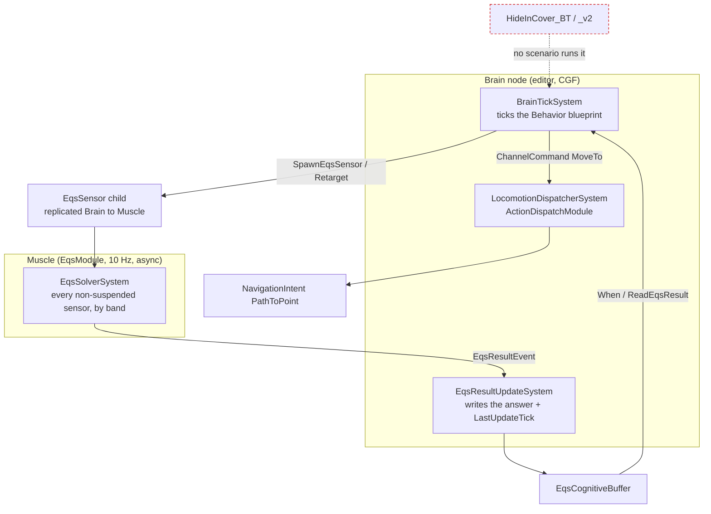

<!--STATUS
state: LIVE
updated: 2026-10-05
build-state: DESIGN — leans D1–D6 await the user; nothing built except the prerequisite fix CE-2089.
current-answer: the whole file — §2 the three diagrams, §3 claim table, §4 decisions with leans, §5 build plan.
stale-below: nothing — new document.
known-rot: none.
known-conflict:
  - docs/blueprints/batches/FRAME_Eqs_Consuming_Behaviours.md — D1 (one "cover, fall back if overrun" loop), D3 (re-point "with an epoch bump") and D5 (extend tt-nav-los) are adjusted here, each with the measured reason (§4).
related-designs:
  - docs/designs/eqs-2/EQS_Design_v1.3_final.md — OWNS the templates (§19.6), their sight rules and flags (§19.5), the child-sensor recipe (§17.6). This design only CONSUMES them.
  - docs/blueprints/batches/FRAME_Eqs_Consuming_Behaviours.md — the backend's frame (goal, fences, leans) this design answers.
  - docs/DESIGN_Decision_Layer.md — OWNS the CombatPosture parent (§3.3, CE-2073) that picks between these children, and the SOP reactions (§4.7) whose stand-ins these replace.
  - docs/DESIGN_Sensors_And_Doctrine.md — OWNS the When-on-EQS trigger fix this relies on (§7.9, CE-2089) and the threat inputs (§7.8, CE-3054).
  - docs/blueprints/DESIGN_Behaviour_Fault_And_Teardown.md — OWNS a behaviour's child-sensor lifetime (CE-485/486): the sensors here die with the run.
  - docs/DESIGN_Terrain_World.md — OWNS the sight (SegmentBlocked) the acceptance checks with.
-->

# Behaviours that use the terrain EQS queries — take cover, fall back *(`CE-3031`)*

> 🔒 **User, `2026-10-04`:** *"We will hand the eqs-using behaviors as a design and discussion task to the behavior lane."*

**In one line:** two small blueprint behaviours, `TakeCoverBp` and `FallBackBp`. Each finds its own top threat, owns
one standing EQS sensor pointed at that threat, and walks the unit to the sensor's best point through the locomotion
channel. Whoever starts them chooses between them: a mission task, an SOP reaction, or the CombatPosture parent.

## 1. INVENTORY *(measured before designing, `2026-10-05`)*

| query | total | what it found |
|---|---|---|
| `codebase-memory search_graph name_pattern=".*(Cover\|Retreat\|FallBack).*" label=Class` | 47 (12 relevant, rest are "Discovery"/"Coverage" name hits) | see §1a |
| `codebase-memory search_graph name_pattern=".*EqsSensor.*"` | 191 | the C# lifecycle (`EqsChildSensor`, BTree `EqsLifecycleNodes`), the blueprint callables, the NED translators — no blueprint re-point |
| grep `[BlueprintCallable]` over `Hrot/` + `FDP/` (all hosts: `BlueprintWorldLibrary.cs`, `SlotOps.cs`, `VectorOps.cs`, `NetworkEntityMapOps.cs`) | 0 | **no** callable that moves a unit, reads a top threat, or re-points a sensor |
| blueprint EQS nodes (`BuiltInNodeRegistry.cs:201-226`) | 3 | `SpawnEqsSensor` (find-or-create), `ReadEqsResult`, `When(EqsResult)`; plus callables `Refresh EQS Sensor`, `Destroy EQS Sensor` (`BlueprintWorldLibrary.cs:144,149`) |
| how a blueprint moves its OWN unit | 1 | `ChannelCommand(LocomotionChannel, MoveTo)` + `WaitForChannel` (`ChannelMoveAndWaitDemo.bp.json:101-120`) → `MoveToExecutor` writes `PathToPoint` (`MoveToExecutor.cs:51`) |
| existing take-cover code | 3 | `HideInCover_BT` / `_v2` (BTree, **no scenario runs them**); `MoveToOptimalCover` (BTree action); `Demo_TakeCover` / `Demo_Retreat` (blueprint STAND-INS, a 1 s / 0.5 s delay, used by the shipped SOP — Decision Layer §4.7:780) |

### 1a. Graph result

*(codebase-memory CLI, `2026-10-05`, project indexed this session: 209 474 nodes. `check_index_coverage` is not
available through the CLI, so the absence claims in §1 are grep-corroborated.)*

| class | where | role here |
|---|---|---|
| `FindCoverFromTarget`, `FindSafeRetreatPoint` | `Spatial/Eqs/` | ⭐ the two templates used, unchanged |
| `CoverPoint`, `CoverPointsGenerator`, `TerrainCoverProvider`, `ManualCoverProvider` | `Spatial/Eqs/` | the cover points the first template ranks (backend, unchanged) |
| `HideInCoverBlackboard`, `HideInCoverV2Blackboard` | `Hrot.AI.Behaviors/Brains/HideInCoverBehavior.cs` | the BTree versions — never ticked (§2.3, red) |
| `MoveToOptimalCoverParams` | `Hrot.AI.Behaviors/Brains/EqsCombatNodes.cs` | the BTree move action — the blueprint uses the channel MoveTo instead (same executor) |
| `CoverAwarePatrolEndToEndTest` | tests | an existing cover rail, not a behaviour |

## 2. Diagrams

### 2.1 Classes — what exists (plain) and what is new (⭐)

*What the picture shows that prose hid: the only new C# is ONE callable and ONE pin. Everything else is an existing node
wired in a blueprint, so there is no second cover mechanism (frame fence 2).*

### 2.2 Sequence — `TakeCoverBp`, from start to a moving threat

*What the picture shows that the frame's prose hid: a threat change and a better point are two different arrows. The
first re-points the sensor (new epoch); the second is only a new answer under the same epoch. Before `CE-2089` the
second arrow never reached the blueprint.*

### 2.3 Modules — who registers each system, who ticks it each frame

*What the picture shows that prose hid: nothing new is scheduled. The blueprint runs inside the brain tick it already
has, and the solver is the one the EQS slice registered on every host (EQS §17.3, §19.4). In red: the BTree versions
that exist but are never ticked; they stay out of this plan.*

## 3. Claim table

| claim the design rests on | code (how it IS) | design (how it was MEANT) |
|---|---|---|
| a standing sensor is re-solved every 10 Hz tick while the budget allows | ✅ `EqsSolverSystem.cs:16,112-147` | ✅ EQS §7.5 band shares (kept by Sensors §5) |
| `ScoreDelta` publishes only on a real change, and always the first answer of an epoch | ✅ `EqsSolverSystem.cs:425-451` | ✅ EQS §17.6 |
| ⚠ the `TopChanged` PUBLISH policy is not filtered by the solver (it publishes like `AlwaysPush`) | ✅ `EqsSolverSystem.cs:417-466` (only ScoreDelta is special-cased) | ⛔ `EqsComponents.cs:119-120` promises it ⇒ **a finding for the backend**, not needed here (we use ScoreDelta) |
| a `When` TopChanged now sees every new answer | ✅ CE-2089, `StatementEmitter.cs` | ✅ Sensors §7.9 |
| `SpawnEqsSensor` is find-or-create: a changed slot 1 on a later tick is IGNORED | ✅ `EqsChildSensor.cs:59-60` (`Ensure` returns the existing child) | ✅ EQS §17.6 (one sensor per site + key) |
| a re-point exists in C# but not for blueprints | ✅ `EqsChildSensor.Refresh(view, child, config)` (`EqsChildSensor.cs:145`); blueprint `RefreshEqsSensor` takes no config (`BlueprintWorldLibrary.cs:144`) | ✅ its own doc comment: *"this is how the next run points it at its own"* |
| the templates' slot 0 = self (the parent, for a child sensor), slot 1 = the threat; high score = better | ✅ `EqsContext.cs:18-22,48-53`; `CheapLineOfSightTest` slot 1; scores additive | ✅ EQS §19.5, §19.6 |
| every kept point is hidden from slot 1 | ✅ LOS `RequireHidden(slot 1)` in both templates | ✅ EQS §19.6 |
| a behaviour moves its own unit through the channel, pathed | ✅ `MoveToExecutor.cs:51` `PathToPoint` (CE-3026) | ✅ frame fence 3 |
| ⛔ `SendIntent(MoveToLocation)` to SELF would replace the running behaviour | ✅ it publishes `AssignTacticalIntentEvent` (`Nodes.cs:1182`) | ✅ Decision Layer §4: one task slot, a new assignment replaces |
| the top threat can be read in a blueprint today | ✅ `ScoreDecision` `TopCandidate` (`BuiltInNodeRegistry.cs:340`) over `ThreatRankingDecision`, then `Entity From Ref` (`BlueprintWorldLibrary.cs:47`) | ✅ Decision Layer §3.3 (CE-2070) |
| ⛔ a Rifleman (TKB 200) fills `TargetMemory` / `SensorContactList` on a live run | ⛔ **not measured** — it has `SensorRange = 500` (`BdcTkbCatalog.cs:174`) | — ⇒ **build step 1 measures it** (if empty, perception for infantry is a backend request; the design does not change) |
| the acceptance check already exists | ✅ `EqsDistributedTests.cs:449-457`: threat eye = `Mount(threat).Standing`, aim = point + `Mount(self).Crouched`, `SegmentBlocked` | ✅ frame acceptance ③ |

## 4. Decisions — leans for the user

| # | question | ⭐ lean | rejected (one line each) | blast radius |
|---|---|---|---|---|
| **D1** | which first behaviour | ⭐ **two** behaviours, `TakeCoverBp` (Running while the threat lasts; re-positions) and `FallBackBp` (moves once, Success at the point). "Fall back if overrun" is the PARENT's choice: CombatPosture (CE-2073) already scores TakeCover vs Retreat | ✗ one blueprint that does both — a second posture decision inside a child (two implementations of one choice) | ours |
| **D2** | host | ⭐ **Behavior blueprint** (as the frame) — usable unchanged as a mission task, an SOP reaction and a posture child | ✗ BTree — `HideInCover_BT` exists but no editor path authors and runs it today | ours |
| **D3** | where the threat comes from | ⭐ **inside the behaviour**: `ScoreDecision(ThreatRanking).TopCandidate` → `Entity From Ref`, re-pointed with a new callable `Retarget EQS Sensor(handle, target)` (wraps `EqsChildSensor.Refresh(view, child, config)`) | ✗ a behaviour PARAM — an SOP reaction (`React(Demo_TakeCover, Hit)`) has no threat to pass · ✗ `Key` = threat (one sensor per threat ever seen, alive until the run ends) | ours, one callable |
| **D4** | when to re-query / re-move | ⭐ standing sensor, `ScoreDelta` with a new `ScoreDeltaThreshold` pin (appended LAST, positional-link rule); move on `When TopChanged` only when the new top is ≥ `MinRepositionMetres` (5 m) from the current goal | ✗ AlwaysPush — 10 answers/s and a jittering goal · ✗ re-query every tick by Refresh — a new epoch empties the buffer each time | ours, one pin |
| **D5** | acceptance scenario | ⭐ a **new** `scenarios/tt-take-cover` on `test-town`: a Rifleman (TKB 200) at (280,230) by the Tower (300..330 × 240..270), one hostile to the north-east at (380,330); a second variant with the hostile 20 m away for `FallBackBp`. The unit must end at a point where `SegmentBlocked(threatEye, point)` is true, on the editor **and** `--mode all` | ✗ extend `tt-nav-los` — two EQS rails cite its geometry (`TerrainEqsTests.cs:325`, `EqsDistributedTests.cs:404`); a new unit there changes what they describe | ours |
| **D6** | the SOP stand-ins | ⭐ after D5 passes, the shipped `BasicInfantrySop` reacts with `TakeCoverBp` / `FallBackBp` instead of `Demo_TakeCover` / `Demo_Retreat` (Decision Layer §4.7 already says a project swaps them) | ✗ keep the stand-ins — the demo SOP would keep showing a 1 s pause as "cover" | ours; `BasicInfantrySopTests` rails move |

⚠ **What would change the leans:** if the step-1 measurement shows infantry has no `TargetMemory` on a live run, D3
still holds but the acceptance waits on the backend. If the user wants the "overrun → fall back" switch before
CE-2073, D1 becomes a third tiny parent blueprint, not a merged child.

## 5. Build plan *(after approval)*

| id | what | rails |
|---|---|---|
| `CE-2090` | callable `Retarget EQS Sensor(handle, target)` in `BlueprintWorldLibrary` | the sensor's slot 1 and epoch change; a dead handle → false |
| `CE-2091` | `SpawnEqsSensor` pin `ScoreDeltaThreshold` (last In pin) | lowering rail: the config carries it; a legacy asset without it still loads |
| `CE-2092` | `TakeCoverBp` (+ measure step 1: infantry contacts on a live run) | blueprint runtime rails: moves to the top; re-moves only past 5 m; re-points on a new threat |
| `CE-2093` | `FallBackBp` | moves to the retreat top, Success on arrival |
| `CE-2094` | `scenarios/tt-take-cover` + the hidden check on the editor and `--mode all` (D5), then the SOP swap (D6) | the `SegmentBlocked` assertion, as `EqsDistributedTests` |
