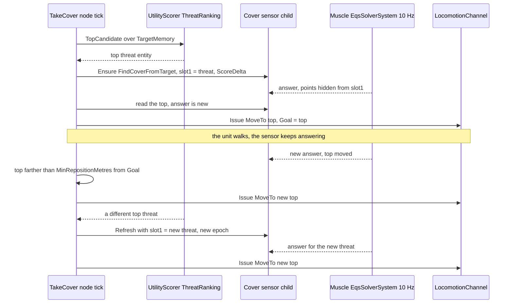
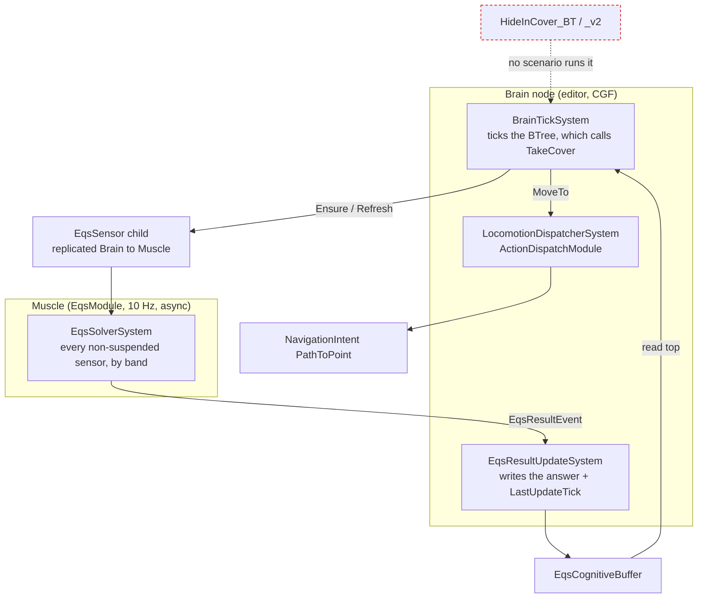
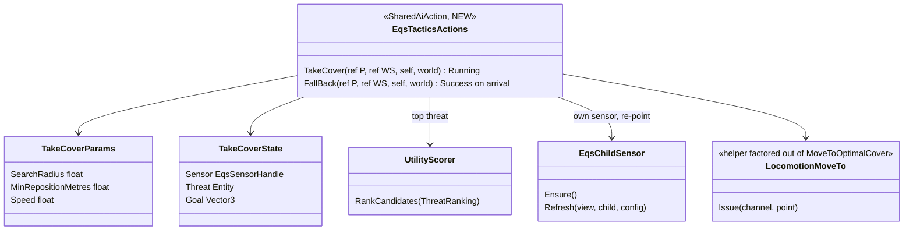
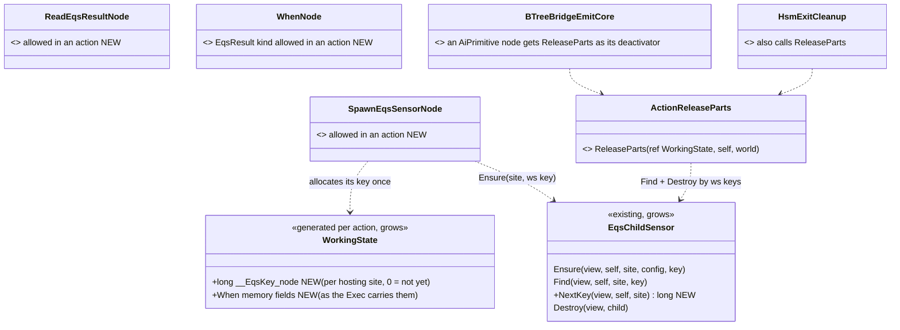
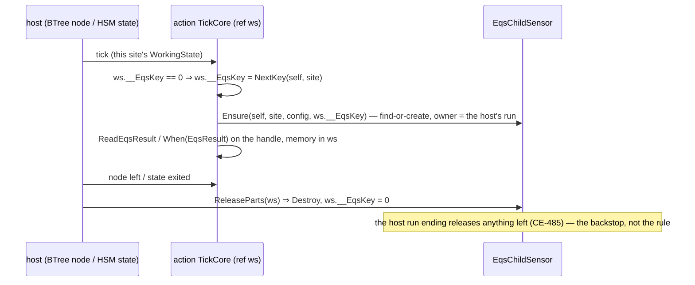
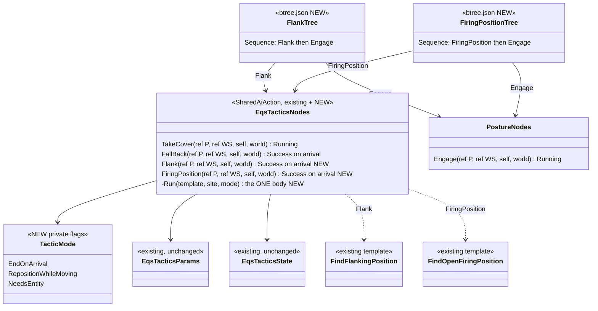
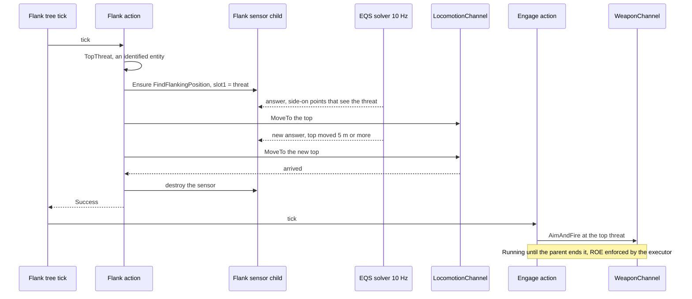
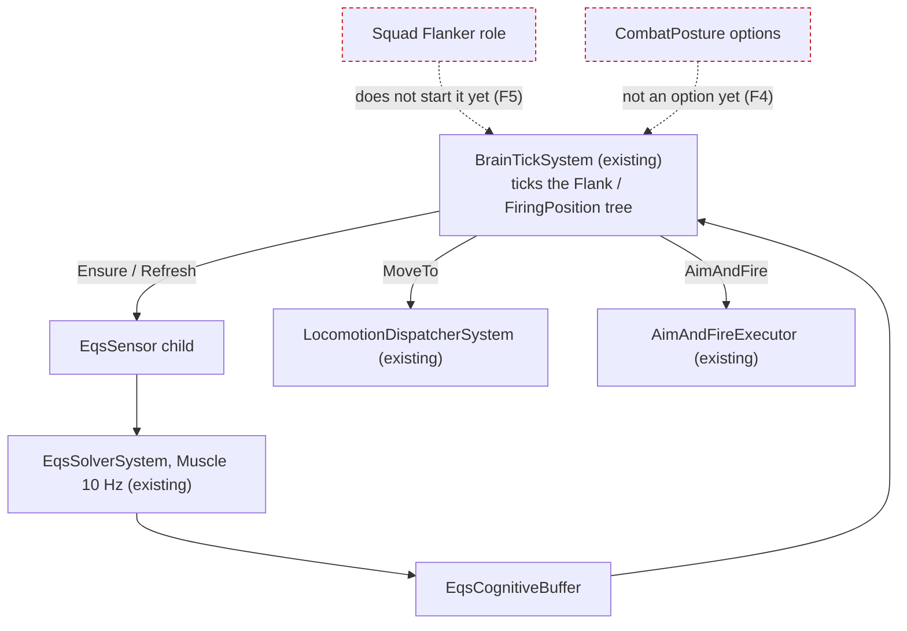
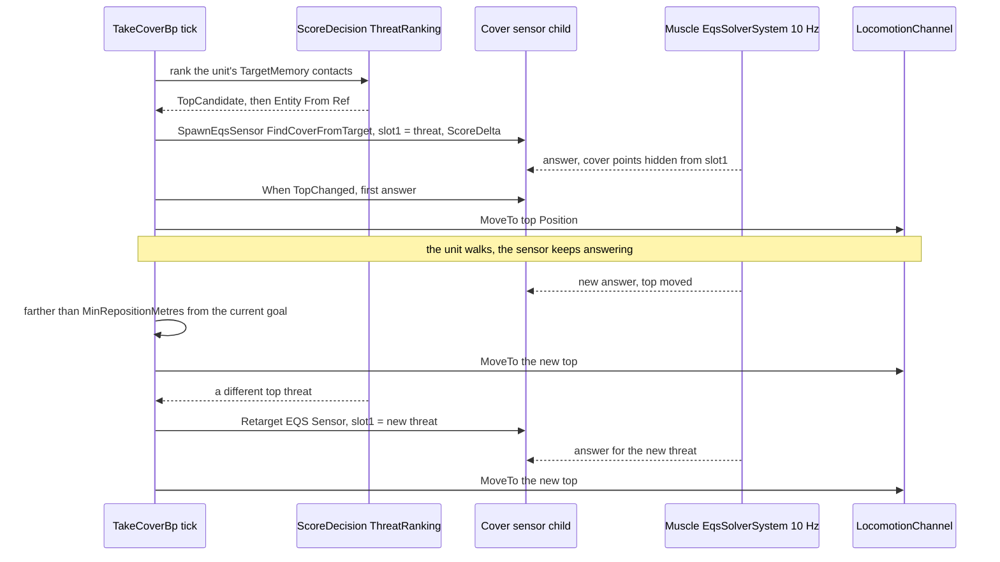
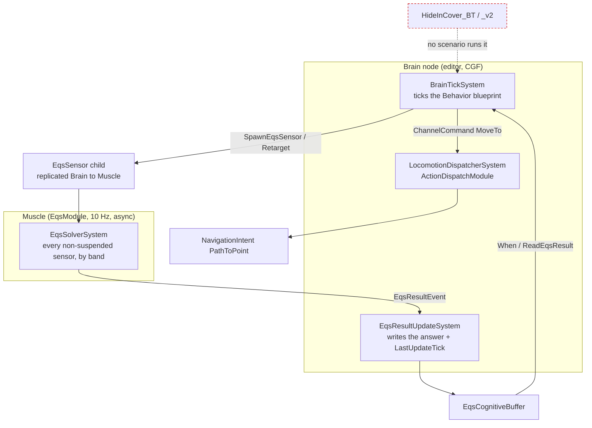

<!--STATUS
state: LIVE
updated: 2026-10-05
build-state: BUILDING — §9 (Flank / FiringPosition) F1–F6 approved, CE-2108 + CE-2109 BUILT (as-built §9.8, live); §8 (CE-2103) E1–E5 approved, PARKED on demand; D1–D6 approved 2026-10-05 (D2 = BTree with shared C# actions, R-204 (behaviors)); CE-2092 / CE-2093 BUILT (as-built §6); CE-2094 BUILT for the in-process cluster and CE-2100 verified on the editor host (§7).
current-answer: §9 (Flank / FiringPosition — §9.2–9.7 as amended by the as-built §9.8); §8 (CE-2103, EQS in a blueprint ACTION — PARKED; use a hosted Behaviour blueprint); §2 diagrams (BTree variant) with §6–§7 as-built, §3 claim table, §4 decisions as amended by §4.1–§4.3, §5 build plan.
stale-below: the ⛔ HISTORY section (the blueprint variant's diagrams) and the D2–D4 rows of the §4 table as first written (the blueprint wording) — §4.3 says what replaced them.
known-rot: none.
known-conflict:
  - docs/blueprints/batches/FRAME_Eqs_Consuming_Behaviours.md — D1 (one "cover, fall back if overrun" loop), D3 (re-point "with an epoch bump") and D5 (extend tt-nav-los) are adjusted here, each with the measured reason (§4).
related-designs:
  - docs/designs/eqs-2/EQS_Design_v1.3_final.md — OWNS the templates (§19.6), their sight rules and flags (§19.5), the child-sensor recipe (§17.6). This design only CONSUMES them.
  - docs/blueprints/batches/FRAME_Eqs_Consuming_Behaviours.md — the backend's frame (goal, fences, leans) this design answers.
  - docs/DESIGN_Decision_Layer.md — OWNS the CombatPosture parent (§3.3, CE-2073) that picks between these children, and the SOP reactions (§4.7) whose stand-ins these replace.
  - docs/DESIGN_Sensors_And_Doctrine.md — OWNS the When-on-EQS trigger fix this relies on (§7.9, CE-2089) and the threat inputs (§7.8, CE-3054).
  - docs/blueprints/DESIGN_Behaviour_Fault_And_Teardown.md — OWNS a behaviour's child-sensor lifetime (CE-485/486): the sensors here die with the run.
  - docs/DESIGN_Terrain_World.md — OWNS the sight (SegmentBlocked) the acceptance checks with.
  - docs/blueprints/DESIGN_Behavior_Action_Binding.md — OWNS the inspector binding; §5.6 (CE-2099) is the gap that keeps a designer from picking TakeCover / FallBack in the editor today.
  - docs/DESIGN_Thermal_And_Acoustic_Sensing.md — OWNS heard contacts (CE-3063); its §8 makes TakeCover / FallBack hide from a HEARD point (ThreatAim, the sensor's context point 1).
-->

# Behaviours that use the terrain EQS queries — take cover, fall back *(`CE-3031`)*

> 🔒 **User, `2026-10-04`:** *"We will hand the eqs-using behaviors as a design and discussion task to the behavior lane."*

**In one line:** two small BTree behaviours, `TakeCover` and `FallBack`, each a 3–4 node tree around ONE shared C#
action. The action finds the unit's top threat, owns one standing EQS sensor pointed at it, and walks the unit to the
sensor's best point through the locomotion channel. Whoever starts them chooses between them: a mission task, an SOP
reaction, or the CombatPosture parent.

## 1. INVENTORY *(measured before designing, `2026-10-05`)*

| query | total | what it found |
|---|---|---|
| `codebase-memory search_graph name_pattern=".*(Cover\|Retreat\|FallBack).*" label=Class` | 47 (12 relevant, rest are "Discovery"/"Coverage" name hits) | see §1a |
| `codebase-memory search_graph name_pattern=".*EqsSensor.*"` | 191 | the C# lifecycle (`EqsChildSensor`, BTree `EqsLifecycleNodes`), the blueprint callables, the NED translators — no blueprint re-point |
| grep `[BlueprintCallable]` over `Hrot/` + `FDP/` (all hosts: `BlueprintWorldLibrary.cs`, `SlotOps.cs`, `VectorOps.cs`, `NetworkEntityMapOps.cs`) | 0 | **no** callable that moves a unit, reads a top threat, or re-points a sensor |
| blueprint EQS nodes (`BuiltInNodeRegistry.cs:201-226`) | 3 | `SpawnEqsSensor` (find-or-create), `ReadEqsResult`, `When(EqsResult)`; plus callables `Refresh EQS Sensor`, `Destroy EQS Sensor` (`BlueprintWorldLibrary.cs:144,149`) |
| how a blueprint moves its OWN unit | 1 | `ChannelCommand(LocomotionChannel, MoveTo)` + `WaitForChannel` (`ChannelMoveAndWaitDemo.bp.json:101-120`) → `MoveToExecutor` writes `PathToPoint` (`MoveToExecutor.cs:51`) |
| existing take-cover code | 3 | `HideInCover_BT` / `_v2` (BTree, **no scenario runs them**); `MoveToOptimalCover` (BTree action); `Demo_TakeCover` / `Demo_Retreat` (blueprint STAND-INS, a 1 s / 0.5 s delay, used by the shipped SOP — Decision Layer §4.7:780) |

### 1a. Graph result

*(codebase-memory CLI, `2026-10-05`, project indexed this session: 209 474 nodes. `check_index_coverage` is not
available through the CLI, so the absence claims in §1 are grep-corroborated.)*

| class | where | role here |
|---|---|---|
| `FindCoverFromTarget`, `FindSafeRetreatPoint` | `Spatial/Eqs/` | ⭐ the two templates used, unchanged |
| `CoverPoint`, `CoverPointsGenerator`, `TerrainCoverProvider`, `ManualCoverProvider` | `Spatial/Eqs/` | the cover points the first template ranks (backend, unchanged) |
| `HideInCoverBlackboard`, `HideInCoverV2Blackboard` | `Hrot.AI.Behaviors/Brains/HideInCoverBehavior.cs` | the BTree versions — never ticked (§2.3, red) |
| `MoveToOptimalCoverParams` | `Hrot.AI.Behaviors/Brains/EqsCombatNodes.cs` | the BTree move action — the blueprint uses the channel MoveTo instead (same executor) |
| `CoverAwarePatrolEndToEndTest` | tests | an existing cover rail, not a behaviour |

## 2. Diagrams *(the BTree variant — D2 approved `2026-10-05`, R-204 (behaviors))*

### 2.1 Classes — what exists (plain) and what is new (⭐ NEW)

*What the picture shows that prose hid: the only new C# is one node class (two actions + one deactivator), one helper
that MoveToOptimalCover is routed through (one channel-MoveTo write, not two), and an overload of the existing scorer
that returns the threat as an entity. Each tree is Root → the action (as-built §6 A1); the tunables are the params a
designer edits.*

### 2.2 Sequence — `TakeCover`, from start to a moving threat

*What the picture shows that prose hid: a threat change and a better point are two different arrows. The first re-points
the sensor (new epoch, buffer emptied); the second is only a new answer under the same epoch, recognised by the
buffer's `LastUpdateTick` (the same per-answer stamp CE-2089 gave the blueprint `When`).*

### 2.3 Modules — who registers each system, who ticks it each frame

*What the picture shows that prose hid: nothing new is scheduled. The tree runs inside the brain tick it already has,
and the solver is the one the EQS slice registered on every host (EQS §17.3, §19.4). In red: the older C#-built BTree
versions that are never ticked; they are left as they are (no rush removals) and named superseded-by this design.*

## 3. Claim table

| claim the design rests on | code (how it IS) | design (how it was MEANT) |
|---|---|---|
| a standing sensor is re-solved every 10 Hz tick while the budget allows | ✅ `EqsSolverSystem.cs:16,112-147` | ✅ EQS §7.5 band shares (kept by Sensors §5) |
| `ScoreDelta` publishes only on a real change, and always the first answer of an epoch | ✅ `EqsSolverSystem.cs:425-451` | ✅ EQS §17.6 |
| ⚠ the `TopChanged` PUBLISH policy is not filtered by the solver (it publishes like `AlwaysPush`) — filed `CE-2097` | ✅ `EqsSolverSystem.cs:417-466` (only ScoreDelta is special-cased) | ⛔ `EqsComponents.cs:119-120` promises it ⇒ **a finding for the backend**, not needed here (we use ScoreDelta) |
| a `When` TopChanged now sees every new answer | ✅ CE-2089, `StatementEmitter.cs` | ✅ Sensors §7.9 |
| `SpawnEqsSensor` is find-or-create: a changed slot 1 on a later tick is IGNORED | ✅ `EqsChildSensor.cs:59-60` (`Ensure` returns the existing child) | ✅ EQS §17.6 (one sensor per site + key) |
| a re-point exists in C# but not for blueprints | ✅ `EqsChildSensor.Refresh(view, child, config)` (`EqsChildSensor.cs:145`); blueprint `RefreshEqsSensor` takes no config (`BlueprintWorldLibrary.cs:144`) | ✅ its own doc comment: *"this is how the next run points it at its own"* |
| the templates' slot 0 = self (the parent, for a child sensor), slot 1 = the threat; high score = better | ✅ `EqsContext.cs:18-22,48-53`; `CheapLineOfSightTest` slot 1; scores additive | ✅ EQS §19.5, §19.6 |
| every kept point is hidden from slot 1 | ✅ LOS `RequireHidden(slot 1)` in both templates | ✅ EQS §19.6 |
| a behaviour moves its own unit through the channel, pathed | ✅ `MoveToExecutor.cs:51` `PathToPoint` (CE-3026) | ✅ frame fence 3 |
| ⛔ `SendIntent(MoveToLocation)` to SELF would replace the running behaviour | ✅ it publishes `AssignTacticalIntentEvent` (`Nodes.cs:1182`) | ✅ Decision Layer §4: one task slot, a new assignment replaces |
| the top threat can be read in a blueprint today | ✅ `ScoreDecision` `TopCandidate` (`BuiltInNodeRegistry.cs:340`) over `ThreatRankingDecision`, then `Entity From Ref` (`BlueprintWorldLibrary.cs:47`) | ✅ Decision Layer §3.3 (CE-2070) |
| ⛔ a Rifleman (TKB 200) fills `TargetMemory` / `SensorContactList` on a live run | ⛔ **not measured** — it has `SensorRange = 500` (`BdcTkbCatalog.cs:174`) | — ⇒ **build step 1 measures it** (if empty, perception for infantry is a backend request; the design does not change) |
| a BTree asset binds a stateful shared action: params variable + a working-state variable | ✅ `T35_SharedWorkingState.btree.json` (`ExpressionTargetField` + `WorkingStateTargetField`); delegate `SharedNodeBinder.cs:20`, paired stateful deactivator `:33` | ✅ CE-504 C-2 |
| the threat ranking is callable from C#, keyed by the decision's asset id | ✅ `UtilityScorer.RankCandidates` (`UtilityScorer.cs:181`), `UtilityDecisionCatalog.ComputeId(assetId)` (`:144`), `ThreatRankingDecision` asset id `1a4f7c20-…threat0000001` | ✅ Decision Layer §3.3 (CE-2067) |
| ⚠ `RankCandidates` returns an `EntityRef`, which is `None` for an entity with no network id (an all-in-one world) | ✅ `UtilityScorer.cs:176-179,195` | ✅ CE-2067 as-built note ⇒ the action needs the ENTITY: a new overload returns it, and the `EntityRef` one is routed through it (one ranking) |
| the template id a C# caller puts in `EqsSensor.BlueprintId` | ✅ `FindCoverFromTarget.BlueprintId` const (`FindCoverFromTarget.cs:23`), the retreat template's in `StarterTemplates.cs` | ✅ EQS §19.6, CE-2034 |
| the channel MoveTo write already exists, once | ✅ `EqsCombatNodes.cs:80-120` (bumps `ActionInstanceId`, writes `MoveToParams`) | ✅ frame fence 3 ⇒ factored into one helper, not copied |
| the acceptance check already exists | ✅ `EqsDistributedTests.cs:449-457`: threat eye = `Mount(threat).Standing`, aim = point + `Mount(self).Crouched`, `SegmentBlocked` | ✅ frame acceptance ③ |

## 4. Decisions — leans for the user

| # | question | ⭐ lean | rejected (one line each) | blast radius |
|---|---|---|---|---|
| **D1** | which first behaviour | ⭐ **two** behaviours, `TakeCoverBp` (Running while the threat lasts; re-positions) and `FallBackBp` (moves once, Success at the point). "Fall back if overrun" is the PARENT's choice: CombatPosture (CE-2073) already scores TakeCover vs Retreat | ✗ one blueprint that does both — a second posture decision inside a child (two implementations of one choice) | ours |
| **D2** | host | ⭐ **Behavior blueprint** (as the frame) — usable unchanged as a mission task, an SOP reaction and a posture child | ✗ BTree — `HideInCover_BT` exists but no editor path authors and runs it today | ours |
| **D3** | where the threat comes from | ⭐ **inside the behaviour**: `ScoreDecision(ThreatRanking).TopCandidate` → `Entity From Ref`, re-pointed with a new callable `Retarget EQS Sensor(handle, target)` (wraps `EqsChildSensor.Refresh(view, child, config)`) | ✗ a behaviour PARAM — an SOP reaction (`React(Demo_TakeCover, Hit)`) has no threat to pass · ✗ `Key` = threat (one sensor per threat ever seen, alive until the run ends) | ours, one callable |
| **D4** | when to re-query / re-move | ⭐ standing sensor, `ScoreDelta` with a new `ScoreDeltaThreshold` pin (appended LAST, positional-link rule); move on `When TopChanged` only when the new top is ≥ `MinRepositionMetres` (5 m) from the current goal | ✗ AlwaysPush — 10 answers/s and a jittering goal · ✗ re-query every tick by Refresh — a new epoch empties the buffer each time | ours, one pin |
| **D5** | acceptance scenario | ⭐ a **new** `scenarios/tt-take-cover` on `test-town`: a Rifleman (TKB 200) at (280,230) by the Tower (300..330 × 240..270), one hostile to the north-east at (380,330); a second variant with the hostile 20 m away for `FallBackBp`. The unit must end at a point where `SegmentBlocked(threatEye, point)` is true, on the editor **and** `--mode all` | ✗ extend `tt-nav-los` — two EQS rails cite its geometry (`TerrainEqsTests.cs:325`, `EqsDistributedTests.cs:404`); a new unit there changes what they describe | ours |
| **D6** | the SOP stand-ins | ⭐ after D5 passes, the shipped `BasicInfantrySop` reacts with `TakeCoverBp` / `FallBackBp` instead of `Demo_TakeCover` / `Demo_Retreat` (Decision Layer §4.7 already says a project swaps them) | ✗ keep the stand-ins — the demo SOP would keep showing a 1 s pause as "cover" | ours; `BasicInfantrySopTests` rails move |

⚠ **What would change the leans:** if the step-1 measurement shows infantry has no `TargetMemory` on a live run, D3
still holds but the acceptance waits on the backend. If the user wants the "overrun → fall back" switch before
CE-2073, D1 becomes a third tiny parent blueprint, not a merged child.

### 4.1 The user's answer *(`2026-10-05`)*

🔒 **User:** *"3031 is ok but pls check if btree or hsm wouldnt be simplier (depends on complexity of the bluelrint vs the others )."*
⇒ D1, D3–D6 stand; **D2 (the host) is re-opened** pending the comparison in §4.2.

### 4.2 BTree, HSM or blueprint — the comparison *(measured `2026-10-05`)*

| | BTree | HSM | blueprint (§2 as drawn) |
|---|---|---|---|
| the logic lives in | ⭐ ONE shared stateful C# action per behaviour (`[SharedAiAction]`, `SharedNodeStatefulAction<P, WS>`, `SharedNodeBinder.cs:20`) | the SAME shared action, bound in a state (HSM binds `[SharedAiAction]`s, `HsmEmitCore.cs:916`) | ~15 wired graph nodes: ScoreDecision, Entity From Ref, Spawn, Retarget, When, ReadEqsResult, distance + compare, a goal variable, ChannelCommand, WaitForChannel |
| the asset | 3–4 nodes: `ObserverSelector[ Sequence(HasTarget, TakeCover) · Idle ]` (`BasicInfantrySop.btree.json` is 281 lines for a whole SOP) | 2 states + transitions — more structure than this loop needs; an HSM pays off for SWITCHING (posture), not for one loop | ~45 lines per node (`ChannelMoveAndWaitDemo.bp.json`: 258 lines, 6 nodes) ⇒ ~700 lines, plus a golden emit snapshot |
| new C# | 2 actions + their tests | same 2 actions | 1 callable (`CE-2090`) + 1 pin (`CE-2091`) + the graph |
| testing | ⭐ the action is called directly on a repo: plain unit rails, easy red-proofs | via the HSM runner | compile fixture + slot reads (as `WhenNodeRuntimeTests`) |
| reuse already there | `MoveToOptimalCover` (the channel MoveTo write, `EqsCombatNodes.cs:60-120`), `Condition_HasTarget`, `EqsChildSensor.Ensure/Refresh`, `UtilityScorer.RankCandidates` | same | the blueprint nodes listed in §1 |
| what it lacks today | `MoveToOptimalCover` moves ONCE (no re-position, `:97-100`); slot 1 is a static param (`EqsParams.ContextSlot1`) — both solved inside the new action | same | the re-point callable and the ScoreDelta pin |
| who can start it | mission task · SOP reaction · posture child — the one gate is tier-agnostic (R-199) | same | same |

⭐ **Lean: BTree, with the logic in two shared stateful actions** (`TakeCover`, `FallBack`) that an HSM can bind
unchanged. The blueprint version is ~15 nodes of wiring around the same steps; in C# they are ~80 lines that a plain
unit rail can check. The graph stays small enough to read in the editor, and the tunables (radius, 5 m re-position)
are node params there.

*What the picture shows that the table hid: with the BTree lean, the re-point and the re-position live in the working
state of ONE action, so they need no new blueprint callable and no new pin. `CE-2090` / `CE-2091` then become an
optional blueprint round-out, not a prerequisite.*

⚠ **A blueprint as the BTree's ACTION (`AiPrimitive`) is not an option today:** the compiler refuses `SpawnEqsSensor`,
`ReadEqsResult` and `When(EqsResult)` there (`Stage2_Validate.cs:1253,1553,1590`) — filed as `CE-2103`.

⛔ **Rejected:** HSM as the host — two states for a single loop (it is the right host for the posture switch, CE-2073) ·
composing small BTree actions that pass the threat between nodes — a node binds one variable plus one working state
(`CE-2069`'s measurement), so the threat would need a shared variable per tree.

### 4.3 Approved — the BTree host *(`2026-10-05`, R-204 (behaviors))*

🔒 **User:** *"BTree with C# actions approved."* ⇒ what moves in §4's table:

| row | as first written (blueprint) | ⭐ now |
|---|---|---|
| D2 | Behavior blueprint | BTree assets around shared C# actions (§4.2) |
| D3 | `ScoreDecision` → `Entity From Ref`, re-point by a new callable | the action calls `UtilityScorer.TopCandidate` (new, returns the `Entity`; `RankCandidates` is routed through it) and re-points with `EqsChildSensor.Refresh(view, child, config)` |
| D4 | a new `ScoreDeltaThreshold` pin; move on `When TopChanged` | the action sets `ScoreDelta` + the threshold from its params, and re-moves when a NEW answer (`LastUpdateTick` changed) has a top ≥ `MinRepositionMetres` from the goal |
| D6 | `TakeCoverBp` / `FallBackBp` | the `TakeCover` / `FallBack` trees |

## 5. Build plan *(approved `2026-10-05`)*

| id | what | rails |
|---|---|---|
| `CE-2092` | `EqsTacticsNodes.TakeCover` + its params / state + deactivator; `LocomotionMoveTo` helper (`MoveToOptimalCover` routed through it); `RankCandidates` Entity overload (the `EntityRef` one routed through it); the `TakeCover` tree. Step 1 also measures that infantry fills `TargetMemory` on a live run | direct-call rails: no threat ⇒ Failure; first answer ⇒ MoveTo the top; a new answer < 5 m away ⇒ no new move, ≥ 5 m ⇒ a new move; a new threat ⇒ slot 1 re-pointed + epoch bumped; abort ⇒ the sensor is destroyed |
| `CE-2093` | `EqsTacticsNodes.FallBack` + the `FallBack` tree | moves to the retreat top once; Success when the channel reports arrival |
| `CE-2094` | `scenarios/tt-take-cover` + the hidden check on the editor and `--mode all` (D5), then the SOP swap (D6) | the `SegmentBlocked` assertion, as `EqsDistributedTests` |
| `CE-2090`, `CE-2091` | ⛔ no longer on this path — a blueprint EQS round-out (re-point callable, `ScoreDeltaThreshold` pin), unscheduled | — |

## 6. As-built — `CE-2092` / `CE-2093` *(`2026-10-05`)*

Built as §2 draws it: `EqsTacticsNodes.TakeCover` / `FallBack` (+ stateful deactivators), `EqsTacticsParams`,
`EqsTacticsState`, `LocomotionMoveTo` (`MoveToOptimalCover` now writes the channel through it),
`UtilityScorer.TopCandidate(…, out Entity, out float)` (`RankCandidates` routed through it — a separate name: an overload on the `out` type made every `out var` caller ambiguous, CS0121), and the trees
`Assets/BTrees/Tactics/TakeCover.btree.json` / `FallBack.btree.json`. What the build found that §2 did not say:

| # | as built | ⛔ §2 / §4.2 said |
|---|---|---|
| A1 | ⭐ each tree is **Root → the action** (2 nodes). The action itself returns Success when the unit remembers no threat, so no `HasTarget` guard and no idle branch are needed; a reaction or task simply ends when nothing is left to hide from | "3–4 nodes: ObserverSelector[ Sequence(HasTarget, TakeCover) · Idle ]" |
| A2 | ⭐ **the tie rule:** the starter ranking keeps zero-score candidates (`UtilityScorer.cs` EvaluateCandidates fills every candidate), so when nothing is in sight — the unit already hidden — all score 0 and the order is the memory's. The action then KEEPS its current threat while it is still remembered, so the sensor is not re-pointed back and forth | — |
| A3 | a MoveTo that fails (or that another command took over) is re-issued on the next answer | — |
| A4 | `FallBack` re-points only until its one move is issued; a later, different answer does not turn the unit around | §2.2 drew TakeCover only |
| A5 | `EqsTacticsParams.FactionFilter` (0 = every acquired contact, `StarterTemplates.cs:5`) — the query's exposure scoring needs it | not listed |
| A7 | ⚠ the trees are hand-authored JSON: the inspector cannot yet bind a C# stateful node's working state (`DESIGN_Behavior_Action_Binding.md` §5.6, `CE-2099`) | — |
| A6 | ⚠ **step 1 (does infantry fill `TargetMemory` on a live run) moves to `CE-2094`** — it needs the acceptance scenario; the rails here set the memory directly | §5: "step 1 also measures…" in CE-2092 |

**Rails:** `EqsCombatNodesTests.CE2092_*` (6) + `CE2093_*` (1) — the feature's own suite, called directly: no threat ⇒
Success and no sensor · first answer ⇒ MoveTo the top · a new answer < 5 m ⇒ no new move, ≥ 5 m ⇒ a new one, the same
answer twice ⇒ looked at once · a different threat ⇒ the same sensor re-pointed with `NextEpoch` and its old answer gone
· a failed move is retried on the NEXT answer, not every tick (pins the per-answer stamp) · leaving the node ⇒ sensor destroyed and the move stopped · fall back moves once and succeeds on arrival.
`TacticsTreesTests` (SimHost, 2) — both trees compiled and registered; `TakeCover` ordered through the real ingress and
brain moves to the answer and ends (sensor gone) when the threat is forgotten. Red-proved: always re-move ⇒ the
re-position rail · no re-point ⇒ the re-point rail · no per-answer stamp ⇒ the retry rail (this mutation stayed green
until that rail was added).

## 7. As-built — `CE-2094` *(`2026-10-05`)*: the scenario, the live check, the SOP swap

| # | as built | ⛔ §4 D5 / D6 said |
|---|---|---|
| B1 | ⭐ `Recipes/Scenarios/tt-take-cover/scenario.json` on `test-town`: a **Rifleman** (urban infantry, TKB 2002 — the type `sop-demo` uses; soldier vision 150 m) at **(295, 285)** in the 10 m alley between Block C (230..290 × 230..300) and the Tower (300..330 × 240..270), SOP `BasicInfantrySop`, no task; a **Hostile** at (360, 320) | Rifleman TKB 200 at (280, 230), hostile at (380, 330) |
| B2 | 🔴 **why the first spot failed, measured:** at (280, 300) the unit stands on Block C's north edge; the template keeps the 32 cover points NEAREST the unit (`MaxCandidates`), all on Block C's north / east walls, all in the hostile's view ⇒ an EMPTY answer (`gen=32 afterLos=0`). ⭐ At (295, 285) the nearest points include the Tower's west wall and Block C's east wall, which the Tower shades: `afterLos=14`. ⚠ A unit with only exposed walls nearby gets NO answer — a backend note, not a defect here (the template ranks nearest-first by design, EQS §19.5) | — |
| B3 | ⭐ **the step-1 measurement (moved from CE-2092): ✅ infantry perception fills the rifleman's `TargetMemory` on CGF** within the live run | ⛔ assumed in §3 |
| B4 | ⭐ **the start is the SOP, not a task:** a `TakeCover` TASK given at load would end at once (nothing remembered yet, §6 A1). The rifleman's SOP reacts on its first contact (row 3 → `TakeCover`; under HoldFire row 2 → `FallBack`) | D5: "a rifleman … expected — moves to a point the hostile cannot see" (no trigger named) |
| B5 | ⭐ D6 done in the same item: `BasicInfantrySop`'s React rows name `TakeCover` / `FallBack`; the stand-in assets stay (other rails and demos name them). `BasicInfantrySopTests` moved: the unit is given a remembered threat, cover lasts while it is remembered, and the paused task returns when it is forgotten | "after D5 passes" — done together because D5 needs the SOP trigger (B4) |
| B6 | the live check is the in-process cluster (`HrotRunnerHarness` simhost + ig + excon + cgf, the `--mode all` set) through the real load, perception, brain, EQS solver and navigation | "on the editor **and** `--mode all`" |
| B7 | ⭐ **`CE-2100`, the EDITOR host (`--mode editor`, HTTP debug API, `2026-10-05`):** the editor lists the recipe itself (`Recipes/tt-take-cover`); a first live load reacts at t≈1.5 s with `TakeCover` (its `tactics` params in the brain), ONE pathed move (`IntentId 1`), `Arrived` at (298.83, 268.02) at t≈10.7 s — the hostile's line (360, 320) → there crosses the Tower's footprint (y≈269.0 at x=300), so the rifleman is hidden with ~1 m to spare | — |
| B8 | ⚠ **two findings on the way, both below this lane (filed for the backend):** ① `CE-2101` — after an Edit → Live reload the perception sensor children come back WITHOUT `EqsCognitiveBuffer` (first load: present), so nothing is ever perceived and the SOP only idles; ② `CE-2102` — ~50 s after arriving, with no new order, the unit steps ~1 m west (it moves with a car model, `VehicleParams.Class = PersonalCar`); here it stayed hidden by ~0.2 m | — |

**Rail:** `TakeCoverScenarioTests` (ClusterRunner integration, `HeavyE2ETests`) — both variants: the rifleman starts in
view, remembers the hostile, the SOP starts the expected tree, and the rifleman MOVES (pathed, `NavigationStatus =
Arrived`) to where `TerrainWorld.SegmentBlocked(hostile's standing eye, rifleman's crouched eye)` holds. On failure it
prints the chain link by link (sensor → answer → Muscle stages → MoveTo → NavigationIntent → status).

## 8. `CE-2103` — EQS nodes in a blueprint used as a BTree / HSM ACTION *(behaviors, `2026-10-05`; build-state: DESIGN — E1–E5 APPROVED, ⏸ PARKED on demand)*

⏸ **Parked (user `2026-10-05`).** The current answer for an EQS-using step is a **Behaviour blueprint hosted as a child** (BTree node or HSM state, S5a / E5 of `DESIGN_Unified_Behaviour_Run`): it already allows Spawn / Read / `When(EqsResult)`, and its sensor is released at run end (CE-485). This section is built only if a measured case needs an action instead (per-node release, hosted-run overhead).

> 🔒 User, `2026-10-05`: filed CE-2103 (*"a design of its own"*); *"Yes go ahead"* (this design).

**INVENTORY** *(grep + the codebase-memory CLI, `2026-10-05`; ⚠ `check_index_coverage` is not reachable through the CLI)*:

| exists | where | for the action |
|---|---|---|
| the three refusals: Spawn `BP2030`, ReadEqsResult `BP2020`, When `BP2001` (ALL When kinds) — each keyed on `Dispatch ∉ {Instance, Behavior}` | `Stage2_Validate.cs:1253`, `:1571`, `:1617` | ⭐ the only thing standing in the way of Read and Spawn |
| Spawn lowers to FIND-OR-CREATE `EqsChildSensor.Ensure(world, self, site, config, key)` every tick; the handle is a frame-local | `StatementEmitter.cs` `IrOp_SpawnEqsSensor` | ⭐ no persistent handle is needed |
| the sensor is matched on `(owner = the RUN of the slot, site, key)` and dies with the run | `EqsChildSensor.cs:28-67` (CE-485) | ⚠ an action inside a host run is stamped with the HOST's run ⇒ two uses of one action in one host share `(owner, site)` |
| an action is `TickCore(ref Params, ref WorkingState, self, world, time)` — no site argument — but each hosting site has its OWN WorkingState occurrence | `AiPrimitiveEmitter.cs:219`, `:429-434`, `:550` | ⭐ per-site memory exists: the WorkingState |
| the C# precedent `EqsTacticsNodes.TakeCover`: handle in WS, fixed site, `[BTreeDeactivator]` destroys the sensor on node exit | `EqsTacticsNodes.cs:74`, `:156`, `:303` | ⭐ the behaviour to match |
| exit hooks for a BLUEPRINT action: HSM `HsmExitCleanup` (channels only); ⛔ BTree — none (BTree deactivators bind C# `[BTreeDeactivator]` methods only) | `AiPrimitiveEmitter.cs:481`; `BTreeBridgeEmitCore.cs:41-64` | the gap for E3 |
| When memory: the `Exec` (Instance / Behavior) — an action's state variable is its WorkingState (`EmissionContext.StateVar` = `ws`) | `EmissionContext.cs:259` | E4's home |

*What the picture shows that prose hid:* the sensor never needs a stored handle — the WorkingState holds only a KEY that makes
this hosting site's sensor its own, and every exit path ends at one generated `ReleaseParts`.

| decision *(lean ⭐; the user approves or changes)* | why | rejected |
|---|---|---|
| **E1** ⭐ lift `BP2020` (ReadEqsResult) for actions | a component read from a handle — nothing to own | — |
| **E2** ⭐ lift `BP2030` (Spawn) for actions, with a per-site KEY in the WorkingState (allocated on first tick by a new `EqsChildSensor.NextKey`), combined with an authored `Key` pin when wired | two uses of one action in one host stay two sensors; no signature change | ⛔ thread the occurrence key into `TickCore` (every action thunk on both hosts and every action golden moves) · ⛔ the baked site alone (two sites share one sensor) |
| **E3** ⭐ release on EXIT through one generated `ReleaseParts(ref ws, self, world)`: the HSM's `HsmExitCleanup` calls it; the BTree bridge registers it as the AiPrimitive node's deactivator (a new deactivator form) | matches the C# `TakeCover`: a left node stops paying for solves and never re-enters onto a stale answer | release only at host-run end (a sensor solves for the rest of the run after its node is left) |
| **E4** ⭐ lift `BP2001` for the `EqsResult` When kind only, its memory in the WorkingState; the other When kinds stay refused (filed, demand-driven) | the demand is EQS; each other kind is its own question | lifting all When kinds now (four lowerings to re-check under a different state struct) |
| **E5** ⭐ blueprint round-outs `CE-2090` (re-point callable) / `CE-2091` (ScoreDelta pin) stay unscheduled | R-204 (behaviors) put TakeCover / FallBack on C# actions; nothing waits on them | — |

**Slices** (one commit each): **A1** E1 + E2 (validator, WS key field, `NextKey`, lowering) + rail: two BTree nodes using one EQS
action keep two sensors · **A2** E3 (`ReleaseParts`, HSM exit, BTree deactivator form) + rail: leaving the node destroys its sensor ·
**A3** E4 (When(EqsResult) memory in WS) + rail: it fires once per new answer in an action.

## 9. `Flank` and `FiringPosition` — the rest of `CE-3031`'s scope *(behaviors, `2026-10-05`; build-state: F1–F6 APPROVED; CE-2108 BUILT §9.8)*

> 🔒 **User, `2026-10-05`:** *"yes design flank and firing position"* — the two left from CE-3031's scope *"(take cover,
> fall back, flank, firing position)"* (frame goal, `FRAME_Eqs_Consuming_Behaviours.md:19`).

### 9.1 INVENTORY *(measured `2026-10-05`)*

| query | total | found |
|---|---|---|
| `[EqsTemplate]` classes (grep + graph) | 9 | ⭐ `FindOpenFiringPosition` (`0xE045506B`) and `FindFlankingPosition` (`0xC33075C4`) **exist** (`StarterTemplates.cs:10-44`, EQS §19.6) — used by tests only (`TerrainEqsTests.cs:346,380,397`, `EqsFlatTerrainGoldenTests.cs:62-65`); the rest: cover, retreat, threats-in-view, entities-in-area, three perception templates |
| query names `Flank*` / `FiringPosition*` / `Overwatch*` / `Attack*` in C# outside the templates | 0 | no behaviour, node or squad code consumes them (`RESUME_Backend_Lane.md:17`: *"No behaviour consumes the four new templates yet"*) |
| EQS use in `Fdp.Toolkits/Squad/` | 1 | only `DangerAreaSensorComponent` (not a query id). `BoundingOverwatch`, `SuppressAndManeuver`, … carry roles (incl. `Flanker`) but compute NO positions with EQS |
| fire actions | 3 | ⭐ `PostureNodes.Engage` (Running, fires at the top threat, `PostureNodes.cs:117`) · `AdvanceAndAttack` (move + fire) · `CgfNodes.Action_FireAtTarget` (older, ends on kill / max rounds) |
| move-to-a-query-point actions | 2 | `EqsTacticsNodes.TakeCover` (re-positions, never ends) · `FallBack` (one move, Success on arrival) — one shared step set (`TopAim`, `EnsureSensor`, `TryNewAnswer`, `Release`) |

**Design docs checked:**
`EQS_Design_v1.3_final.md` §19.6 — ⭐ applies: owns both templates (generator, filters, scores); its §6.6 / §6.6a are superseded by §19.
`Squad_Coordination_Design_v1_1.md:218-220,326-330` — applies as a CONSUMER: *"flanking positions come from a standard EQS query fired by the squad HSM"*; the `Flanker` role is the squad's, the position query is not built there ⇒ F5.
`DESIGN_Decision_Layer.md` §3.3 — owns CombatPosture (Advance / TakeCover / Suppress / Flee / Hold); neither new behaviour is a posture option today ⇒ F4; `:1026` names *"taking up a firing position"* only as an ROE example.
`Architect_Question_83_*.md:81` — an order outranks doctrine (*"a soldier told to hold does not wander off to flank"*): already true by the one gate (R-199), nothing to add.
`Utility_AI_Design_v1_1.md:87` — flank SELECTION stays in EQS, never re-implemented in scoring ⇒ consistent with F1.

### 9.2 Classes

*What the picture shows that prose hid: no new params, state, template or fire code. The two new actions are two more
entry points into ONE body that TakeCover and FallBack are routed through too (a mode says "end on arrival / re-position
while moving / needs a seen target"), and the shooting is the posture's existing `Engage`.*

### 9.3 Sequence — `Flank`, from the order to firing

*What the picture shows that prose hid: the sensor lives only while the unit is getting there — once it fires, nothing
keeps solving — and moving and firing are two channels, so a later variant could fire on the way (as AdvanceAndAttack
does) without new machinery.*

### 9.4 Modules

*What the picture shows that prose hid: nothing new is scheduled or registered. In red, the two starters that do NOT
reach these behaviours yet — a mission task or an SOP row can start them on day one; the posture and the squad role are
separate decisions.*

### 9.5 Claim table

| claim the leans rest on | code (how it IS) | design (how it was MEANT) |
|---|---|---|
| both templates exist, slot 1 = the target, keep only points that SEE it | ✅ `StarterTemplates.cs:10-44` (`RequireVisible`, viewer = candidate) | ✅ EQS §19.6 |
| the flank is side-on to the target→self line, not "behind the target's facing" | ✅ `DotProductTest{Pivot 1, Reference 0, PreferredDot 0}` (`:40`); golden *"the flank is side-on"* | ✅ EQS §19.6 / §19.7 rails |
| firing position stays near the unit (donut around self, nearer scores more) | ✅ `:18-21` (`AnchorSlot 0`, `DistanceScoreTest`) | ✅ EQS §19.6 |
| one body can serve all four: they differ only in template, site, "end on arrival", "re-position while moving" | ✅ `EqsTacticsNodes.cs:88-153` (TakeCover / FallBack share every step but those) | ✅ ruling *"unification and simplification is our goal"* |
| `Engage` fires at the top threat, re-aims, Running; ROE is the executor's | ✅ `PostureNodes.cs:117,207-226` | ✅ Decision Layer §3.3b, CE-2075 |
| moving and firing are separate channels | ✅ `LocomotionChannel` vs `WeaponChannel`; `AdvanceAndAttack` does both (`:125`) | ✅ Decision Layer §3.3b |
| a HEARD contact cannot be flanked or shot at: both templates need a visible target, and `Engage` aims at an entity | ✅ `Engage` → `TopThreat` (entities only, `PostureNodes.cs:210`) | ⛔ searched EQS §19 / Thermal §8: no rule for "see a point" ⇒ F2 refuses it rather than guessing |
| squad code computes no flank positions | ✅ `Fdp.Toolkits/Squad/` (no `Eqs` query use) | ✅ Squad §218-220 says the squad will FIRE the query ⇒ it can start this behaviour (F5) |

### 9.6 Decisions — leans for the user

| # | question | ⭐ lean | rejected (one line each) | blast radius |
|---|---|---|---|---|
| **F1** | shape *(amended §9.6a)* | ⭐ **move there, then fire** (+ optional fire on the move, §9.6a): each tree is `Sequence[ Flank \| FiringPosition , Engage ]`; the action ends (Success) on arrival and its sensor goes | ✗ move-and-fire in one action — AdvanceAndAttack already is that, for an objective; a flanker firing en route gives itself away · ✗ a "FlankAndEngage" action — a second copy of Engage | ours, 2 trees |
| **F2** | target | ⭐ an **identified entity** only (`TopThreat`); with none, the action FAILS so the parent picks something else | ✗ a heard point (as TakeCover hides from one) — "visible from P" and `Engage` both need an entity (claim table) | ours |
| **F3** | while moving *(as built: §9.8 G6 — re-route when the THREAT moves)* | ⭐ **re-position** like TakeCover (a new answer ≥ `MinRepositionMetres` from the goal re-issues the move) **until arrival**, then end like FallBack; a NEW top threat re-points the sensor | ✗ FallBack's "move once" — a flank on a moving target goes stale · ✗ keep re-positioning after arrival — that is TakeCover's job, and Engage owns the unit then | ours |
| **F4** | the unification | ⭐ ONE private body `Run(template, site, mode)`; all **four** actions are thin entry points into it; TakeCover / FallBack routed through it, their 7 + 2 rails unchanged | ✗ two more copies of the FallBack body (four near-identical bodies) | ours; `EqsTacticsNodes` only |
| **F5** | who starts them | ⭐ today: a **mission task** or an **SOP row** (as TakeCover). ⛔ NOT now: a CombatPosture option (needs a scoring row in the posture decision, Decision Layer's call) and the squad `Flanker` role (Squad §218-220) — both filed as one row | ✗ add them to CombatPosture now — changes a shipped decision's behaviour without a demand | ours; 1 filed row |
| **F6** | acceptance | ⭐ the feature's suites: direct-call rails in `EqsCombatNodesTests` (as CE-2092), both trees in `TacticsTreesTests`, and two variants in `TakeCoverScenarioTests` on `tt-take-cover`: ordered after the hostile is remembered, the rifleman ends where `!SegmentBlocked(own standing eye, hostile aim)` and (flank) the bearing is side-on within 30° | ✗ a new scenario — `tt-take-cover` already has the geometry and the hidden-check machinery | ours |

#### 9.6a F1 amended — fire on the move *(user `2026-10-05`: "yes to be able to fire on the move - but where to say that? do we have some ROE component or setting?")*

| | |
|---|---|
| ⭐ **lean** | a **behaviour param** `FireWhileMoving` (byte) on `EqsTacticsParams` (appended last), read by the one body: while moving it fires at the top threat through the SAME fire step `AdvanceAndAttack` uses (`PostureNodes.Fire`, made `internal` and shared — not copied). Tree defaults: `FiringPosition` = 1, `Flank` = 0 (a flanker that fires gives itself away); an order overrides it in its params JSON like any tunable |
| ⭐ **why not the ROE** | `Roe` (`Roe.cs:46`, Decision Layer §4.4, R-200) answers **may** the unit fire — `HoldFire` / `ReturnFire` / `FireAtWill` — and is persistent unit state that survives across tasks, changed only by `SetRoeEvent` under origin precedence. "Fire while moving" is **how this manoeuvre is flown**: put in the ROE it would leak into every later task and need an ROE order per manoeuvre |
| ⭐ **they compose for free** | every shot still goes through `AimAndFireExecutor.RoePermitsFire` (`AimAndFireExecutor.cs:33-42`): `FireWhileMoving = 1` under `HoldFire` fires nothing; under `ReturnFire` only within the window after a hit / near miss |
| rejected | ✗ a `Roe` field — wrong lifetime (above) · ✗ a third separate "move-and-fire" action — `AdvanceAndAttack` already exists, the param reuses its step |

⚠ **What would change the leans:** wanting the flanker to fire on the move flips F1 to a third mode (fire while
moving), still in the one body. Wanting flank from a heard contact needs a "visible from a point" rule in EQS first
(backend). Wanting them in CombatPosture now turns F5 into a Decision Layer change with its own scoring.

### 9.7 Build plan *(after approval)*

| id | what | rails |
|---|---|---|
| `CE-2108` | `EqsTacticsNodes.Run` + `Flank` / `FiringPosition` (+ deactivators, sites `0x21080001` / `0x21080002`); TakeCover / FallBack routed through `Run`; trees `Tactics/Flank.btree.json`, `Tactics/FiringPosition.btree.json` | direct calls: no seen threat ⇒ Failure, no sensor · first answer ⇒ MoveTo the top · new answer ≥ 5 m while moving ⇒ re-move, < 5 m ⇒ none · arrival ⇒ Success + sensor gone · a new threat ⇒ re-pointed; the existing CE-2092/2093 rails green unchanged |
| `CE-2109` | the two `tt-take-cover` variants (F6) | `TakeCoverScenarioTests`: ends with sight of the hostile; flank side-on |
| `CE-2110` | 💡 filed, unscheduled: Flank / FiringPosition as CombatPosture options and as the squad `Flanker` role's child (F5) | — |

### 9.8 As-built — `CE-2108` *(`2026-10-05`, F1–F6 + §9.6a approved: "yes approved, build it")*

Built as §9.2 draws it: `EqsTacticsNodes.Run(template, site, Mode)` is the one body; `TakeCover` / `FallBack` / `Flank` /
`FiringPosition` are one-line entry points (+ a deactivator each); trees `Tactics/Flank.btree.json` and
`Tactics/FiringPosition.btree.json` are `Root → Sequence[ the action , PostureNodes.Engage ]`. What the build added that §9
did not say:

| # | as built | ⛔ §9 said |
|---|---|---|
| G1 | ⭐ `EqsTacticsParams` grew TWO fields, appended last: `FireCooldownSeconds` (0 ⇒ 1 s) and `FireWhileMoving` — the shared fire step takes a cooldown | §9.6a: one byte `FireWhileMoving` |
| G2 | `EqsTacticsState` grew `EngageState Fire` (what the weapon is aimed at on the way); `Release` stops a weapon the node aimed, for all four actions | — |
| G3 | fire on the move runs only while the MoveTo reports Running; otherwise the weapon this node aimed stops (so an arrived TakeCover with the flag set would not keep firing from cover) | "while moving" |
| G4 | `PostureNodes.Fire` / `StopFiring` went `private` → `internal`: the ONE fire step | "made internal and shared" ✅ |
| G6 | 🔴 ⭐ **Flank / FiringPosition re-route only when the THREAT has moved ≥ `MinRepositionMetres` since the move was issued** (`Mode.RepositionOnThreatMove`, `EqsTacticsState.ThreatAtMove`, the threat's position read from the unit's own `TargetMemory`). 📐 Found while writing the live variant: both templates score relative to the unit's CURRENT position — the flank's bearing reference is slot 0 = self (`DotProductTest`, `StarterTemplates.cs:40`; `DotProductTest.cs` "reference = pivot → ReferenceSlot"), the firing position prefers points near self — so the unit's own walk moves the best point; re-routing on every far answer would chase it round the target. TakeCover keeps its live-proven rule | F3: "re-position like TakeCover (a new answer ≥ MinRepositionMetres from the goal)" — ⭐ the intent (*"a flank on a moving target goes stale"*) is kept, the trigger is now the target's move |
| G5 | tree defaults: Flank radius 40 m, speed 3, no fire on the move; FiringPosition radius 30 m, speed 2.5, fire on the move; both re-position at 5 m | — |

**Rails:** `EqsCombatNodesTests.CE2108_*` (4, direct calls): no identified threat — nothing, or only a HEARD contact ⇒
Failure and no sensor (while TakeCover hides from the heard point) · Flank does NOT re-route when only its own walk moved
the answer, does once the threat has moved 5 m, and ends on arrival with its sensor gone · FiringPosition points its own template at the threat · fire on the move aims the weapon
while the move runs, not when the flag is off, and stops on arrival. `TacticsTreesTests.CE2108_*` (2): both trees
registered; the FiringPosition TREE through the real ingress and brain moves firing, then on arrival its sensor goes and
the tree's Engage keeps the weapon on the threat. The CE-2092 / CE-2093 rails (7 + 2) pass unchanged through the shared
body.

**Live — `CE-2109`:** `TakeCoverScenarioTests.CE2109_*` (2) on `tt-take-cover` through the in-process cluster
(simhost + ig + excon + cgf): the rifleman (SOP removed, ROE HoldFire / StayOnTask so no reaction pre-empts the order and
no shot kills the hostile the check needs) is ORDERED once it remembers the hostile; it moves, arrives (the sensor goes),
ends with sight of the hostile, and — Flank — side-on to the hostile→start line within 30°; the run continues in Engage.
⭐ **Live red-proof of G6:** with Flank on the first-written rule (re-route on any far answer) the same rail fails — after
47 s the rifleman is at (359.6, 302.4), still re-routing (last goal (380, 320), 20 m past the hostile), never arriving.
All six `TakeCoverScenarioTests` pass (the four CE-2094 / CE-2101 rails unchanged).
⚠ Measured on the way, not this lane's code: in this session's main checkout the live rails failed at *"test-town must be
loaded on SimHost"* while the SAME source passed in a clean worktree — a stale build output in the long-lived checkout,
not the change (measured: in a clean worktree the base commit passes and base + this change passes; only the long-lived checkout fails, with or without the two new trees).

## ⛔ HISTORY

### The blueprint variant's diagrams *(SUPERSEDED `2026-10-05` by §2 — D2 = BTree, R-204 (behaviors); kept for the comparison in §4.2)*

#### (was §2) Diagrams — blueprint variant

#### 2.1 Classes — what exists (plain) and what is new (⭐)

*What the picture shows that prose hid: the only new C# is ONE callable and ONE pin. Everything else is an existing node
wired in a blueprint, so there is no second cover mechanism (frame fence 2).*

#### 2.2 Sequence — `TakeCoverBp`, from start to a moving threat

*What the picture shows that the frame's prose hid: a threat change and a better point are two different arrows. The
first re-points the sensor (new epoch); the second is only a new answer under the same epoch. Before `CE-2089` the
second arrow never reached the blueprint.*

#### 2.3 Modules — who registers each system, who ticks it each frame

*What the picture shows that prose hid: nothing new is scheduled. The blueprint runs inside the brain tick it already
has, and the solver is the one the EQS slice registered on every host (EQS §17.3, §19.4). In red: the BTree versions
that exist but are never ticked; they stay out of this plan.*

