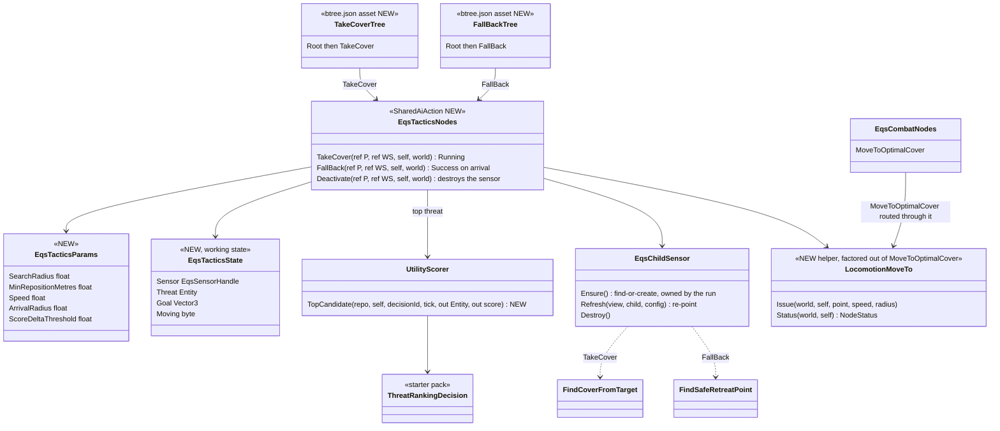
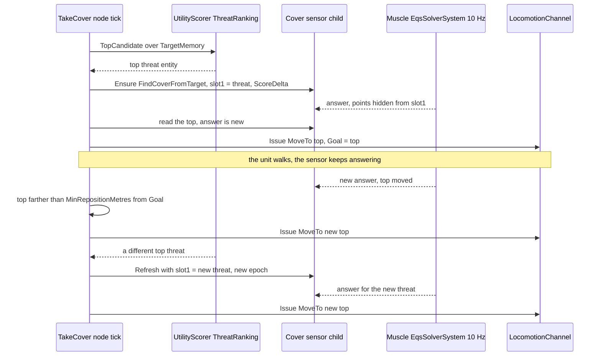
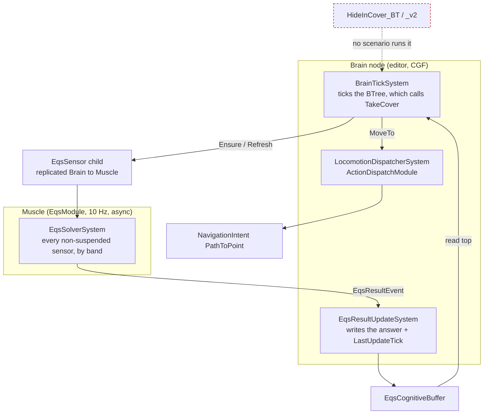
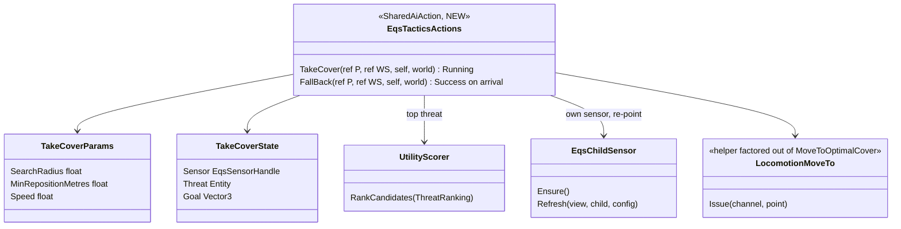
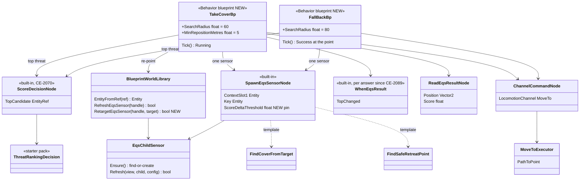
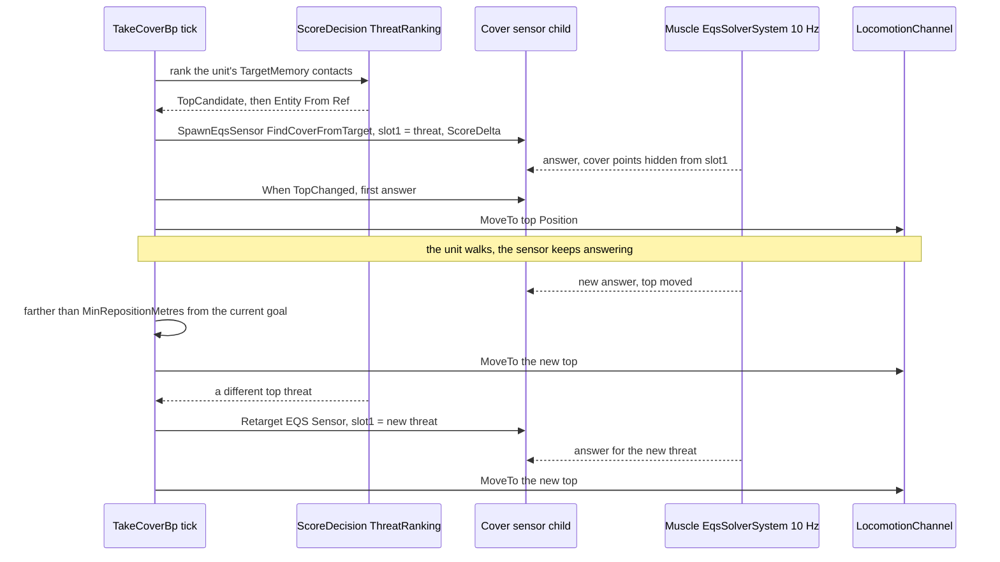
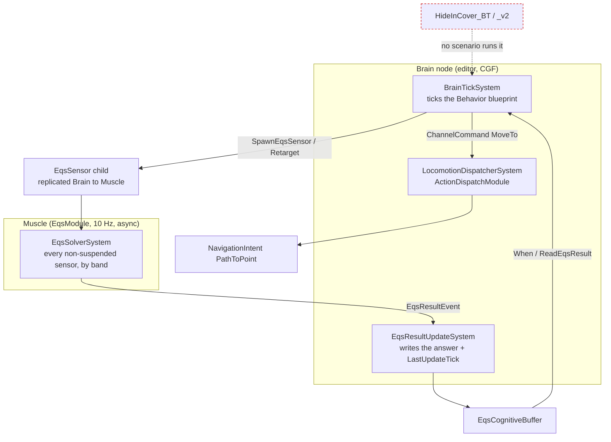

<!--STATUS
state: LIVE
updated: 2026-10-05
build-state: BUILDING — D1–D6 approved 2026-10-05 (D2 = BTree with shared C# actions, R-204); CE-2092 / CE-2093 BUILT (as-built §6); CE-2094 (scenario + live run) next.
current-answer: §2 diagrams (BTree variant) with §6 as-built, §3 claim table, §4 decisions as amended by §4.1–§4.3, §5 build plan.
stale-below: the ⛔ HISTORY section (the blueprint variant's diagrams) and the D2–D4 rows of the §4 table as first written (the blueprint wording) — §4.3 says what replaced them.
known-rot: none.
known-conflict:
  - docs/blueprints/batches/FRAME_Eqs_Consuming_Behaviours.md — D1 (one "cover, fall back if overrun" loop), D3 (re-point "with an epoch bump") and D5 (extend tt-nav-los) are adjusted here, each with the measured reason (§4).
related-designs:
  - docs/designs/eqs-2/EQS_Design_v1.3_final.md — OWNS the templates (§19.6), their sight rules and flags (§19.5), the child-sensor recipe (§17.6). This design only CONSUMES them.
  - docs/blueprints/batches/FRAME_Eqs_Consuming_Behaviours.md — the backend's frame (goal, fences, leans) this design answers.
  - docs/DESIGN_Decision_Layer.md — OWNS the CombatPosture parent (§3.3, CE-2073) that picks between these children, and the SOP reactions (§4.7) whose stand-ins these replace.
  - docs/DESIGN_Sensors_And_Doctrine.md — OWNS the When-on-EQS trigger fix this relies on (§7.9, CE-2089) and the threat inputs (§7.8, CE-3054).
  - docs/blueprints/DESIGN_Behaviour_Fault_And_Teardown.md — OWNS a behaviour's child-sensor lifetime (CE-485/486): the sensors here die with the run.
  - docs/DESIGN_Terrain_World.md — OWNS the sight (SegmentBlocked) the acceptance checks with.
-->

# Behaviours that use the terrain EQS queries — take cover, fall back *(`CE-3031`)*

> 🔒 **User, `2026-10-04`:** *"We will hand the eqs-using behaviors as a design and discussion task to the behavior lane."*

**In one line:** two small BTree behaviours, `TakeCover` and `FallBack`, each a 3–4 node tree around ONE shared C#
action. The action finds the unit's top threat, owns one standing EQS sensor pointed at it, and walks the unit to the
sensor's best point through the locomotion channel. Whoever starts them chooses between them: a mission task, an SOP
reaction, or the CombatPosture parent.

## 1. INVENTORY *(measured before designing, `2026-10-05`)*

| query | total | what it found |
|---|---|---|
| `codebase-memory search_graph name_pattern=".*(Cover\|Retreat\|FallBack).*" label=Class` | 47 (12 relevant, rest are "Discovery"/"Coverage" name hits) | see §1a |
| `codebase-memory search_graph name_pattern=".*EqsSensor.*"` | 191 | the C# lifecycle (`EqsChildSensor`, BTree `EqsLifecycleNodes`), the blueprint callables, the NED translators — no blueprint re-point |
| grep `[BlueprintCallable]` over `Hrot/` + `FDP/` (all hosts: `BlueprintWorldLibrary.cs`, `SlotOps.cs`, `VectorOps.cs`, `NetworkEntityMapOps.cs`) | 0 | **no** callable that moves a unit, reads a top threat, or re-points a sensor |
| blueprint EQS nodes (`BuiltInNodeRegistry.cs:201-226`) | 3 | `SpawnEqsSensor` (find-or-create), `ReadEqsResult`, `When(EqsResult)`; plus callables `Refresh EQS Sensor`, `Destroy EQS Sensor` (`BlueprintWorldLibrary.cs:144,149`) |
| how a blueprint moves its OWN unit | 1 | `ChannelCommand(LocomotionChannel, MoveTo)` + `WaitForChannel` (`ChannelMoveAndWaitDemo.bp.json:101-120`) → `MoveToExecutor` writes `PathToPoint` (`MoveToExecutor.cs:51`) |
| existing take-cover code | 3 | `HideInCover_BT` / `_v2` (BTree, **no scenario runs them**); `MoveToOptimalCover` (BTree action); `Demo_TakeCover` / `Demo_Retreat` (blueprint STAND-INS, a 1 s / 0.5 s delay, used by the shipped SOP — Decision Layer §4.7:780) |

### 1a. Graph result

*(codebase-memory CLI, `2026-10-05`, project indexed this session: 209 474 nodes. `check_index_coverage` is not
available through the CLI, so the absence claims in §1 are grep-corroborated.)*

| class | where | role here |
|---|---|---|
| `FindCoverFromTarget`, `FindSafeRetreatPoint` | `Spatial/Eqs/` | ⭐ the two templates used, unchanged |
| `CoverPoint`, `CoverPointsGenerator`, `TerrainCoverProvider`, `ManualCoverProvider` | `Spatial/Eqs/` | the cover points the first template ranks (backend, unchanged) |
| `HideInCoverBlackboard`, `HideInCoverV2Blackboard` | `Hrot.AI.Behaviors/Brains/HideInCoverBehavior.cs` | the BTree versions — never ticked (§2.3, red) |
| `MoveToOptimalCoverParams` | `Hrot.AI.Behaviors/Brains/EqsCombatNodes.cs` | the BTree move action — the blueprint uses the channel MoveTo instead (same executor) |
| `CoverAwarePatrolEndToEndTest` | tests | an existing cover rail, not a behaviour |

## 2. Diagrams *(the BTree variant — D2 approved `2026-10-05`, R-204)*

### 2.1 Classes — what exists (plain) and what is new (⭐ NEW)

*What the picture shows that prose hid: the only new C# is one node class (two actions + one deactivator), one helper
that MoveToOptimalCover is routed through (one channel-MoveTo write, not two), and an overload of the existing scorer
that returns the threat as an entity. Each tree is Root → the action (as-built §6 A1); the tunables are the params a
designer edits.*

### 2.2 Sequence — `TakeCover`, from start to a moving threat

*What the picture shows that prose hid: a threat change and a better point are two different arrows. The first re-points
the sensor (new epoch, buffer emptied); the second is only a new answer under the same epoch, recognised by the
buffer's `LastUpdateTick` (the same per-answer stamp CE-2089 gave the blueprint `When`).*

### 2.3 Modules — who registers each system, who ticks it each frame

*What the picture shows that prose hid: nothing new is scheduled. The tree runs inside the brain tick it already has,
and the solver is the one the EQS slice registered on every host (EQS §17.3, §19.4). In red: the older C#-built BTree
versions that are never ticked; they are left as they are (no rush removals) and named superseded-by this design.*

## 3. Claim table

| claim the design rests on | code (how it IS) | design (how it was MEANT) |
|---|---|---|
| a standing sensor is re-solved every 10 Hz tick while the budget allows | ✅ `EqsSolverSystem.cs:16,112-147` | ✅ EQS §7.5 band shares (kept by Sensors §5) |
| `ScoreDelta` publishes only on a real change, and always the first answer of an epoch | ✅ `EqsSolverSystem.cs:425-451` | ✅ EQS §17.6 |
| ⚠ the `TopChanged` PUBLISH policy is not filtered by the solver (it publishes like `AlwaysPush`) — filed `CE-2097` | ✅ `EqsSolverSystem.cs:417-466` (only ScoreDelta is special-cased) | ⛔ `EqsComponents.cs:119-120` promises it ⇒ **a finding for the backend**, not needed here (we use ScoreDelta) |
| a `When` TopChanged now sees every new answer | ✅ CE-2089, `StatementEmitter.cs` | ✅ Sensors §7.9 |
| `SpawnEqsSensor` is find-or-create: a changed slot 1 on a later tick is IGNORED | ✅ `EqsChildSensor.cs:59-60` (`Ensure` returns the existing child) | ✅ EQS §17.6 (one sensor per site + key) |
| a re-point exists in C# but not for blueprints | ✅ `EqsChildSensor.Refresh(view, child, config)` (`EqsChildSensor.cs:145`); blueprint `RefreshEqsSensor` takes no config (`BlueprintWorldLibrary.cs:144`) | ✅ its own doc comment: *"this is how the next run points it at its own"* |
| the templates' slot 0 = self (the parent, for a child sensor), slot 1 = the threat; high score = better | ✅ `EqsContext.cs:18-22,48-53`; `CheapLineOfSightTest` slot 1; scores additive | ✅ EQS §19.5, §19.6 |
| every kept point is hidden from slot 1 | ✅ LOS `RequireHidden(slot 1)` in both templates | ✅ EQS §19.6 |
| a behaviour moves its own unit through the channel, pathed | ✅ `MoveToExecutor.cs:51` `PathToPoint` (CE-3026) | ✅ frame fence 3 |
| ⛔ `SendIntent(MoveToLocation)` to SELF would replace the running behaviour | ✅ it publishes `AssignTacticalIntentEvent` (`Nodes.cs:1182`) | ✅ Decision Layer §4: one task slot, a new assignment replaces |
| the top threat can be read in a blueprint today | ✅ `ScoreDecision` `TopCandidate` (`BuiltInNodeRegistry.cs:340`) over `ThreatRankingDecision`, then `Entity From Ref` (`BlueprintWorldLibrary.cs:47`) | ✅ Decision Layer §3.3 (CE-2070) |
| ⛔ a Rifleman (TKB 200) fills `TargetMemory` / `SensorContactList` on a live run | ⛔ **not measured** — it has `SensorRange = 500` (`BdcTkbCatalog.cs:174`) | — ⇒ **build step 1 measures it** (if empty, perception for infantry is a backend request; the design does not change) |
| a BTree asset binds a stateful shared action: params variable + a working-state variable | ✅ `T35_SharedWorkingState.btree.json` (`ExpressionTargetField` + `WorkingStateTargetField`); delegate `SharedNodeBinder.cs:20`, paired stateful deactivator `:33` | ✅ CE-504 C-2 |
| the threat ranking is callable from C#, keyed by the decision's asset id | ✅ `UtilityScorer.RankCandidates` (`UtilityScorer.cs:181`), `UtilityDecisionCatalog.ComputeId(assetId)` (`:144`), `ThreatRankingDecision` asset id `1a4f7c20-…threat0000001` | ✅ Decision Layer §3.3 (CE-2067) |
| ⚠ `RankCandidates` returns an `EntityRef`, which is `None` for an entity with no network id (an all-in-one world) | ✅ `UtilityScorer.cs:176-179,195` | ✅ CE-2067 as-built note ⇒ the action needs the ENTITY: a new overload returns it, and the `EntityRef` one is routed through it (one ranking) |
| the template id a C# caller puts in `EqsSensor.BlueprintId` | ✅ `FindCoverFromTarget.BlueprintId` const (`FindCoverFromTarget.cs:23`), the retreat template's in `StarterTemplates.cs` | ✅ EQS §19.6, CE-2034 |
| the channel MoveTo write already exists, once | ✅ `EqsCombatNodes.cs:80-120` (bumps `ActionInstanceId`, writes `MoveToParams`) | ✅ frame fence 3 ⇒ factored into one helper, not copied |
| the acceptance check already exists | ✅ `EqsDistributedTests.cs:449-457`: threat eye = `Mount(threat).Standing`, aim = point + `Mount(self).Crouched`, `SegmentBlocked` | ✅ frame acceptance ③ |

## 4. Decisions — leans for the user

| # | question | ⭐ lean | rejected (one line each) | blast radius |
|---|---|---|---|---|
| **D1** | which first behaviour | ⭐ **two** behaviours, `TakeCoverBp` (Running while the threat lasts; re-positions) and `FallBackBp` (moves once, Success at the point). "Fall back if overrun" is the PARENT's choice: CombatPosture (CE-2073) already scores TakeCover vs Retreat | ✗ one blueprint that does both — a second posture decision inside a child (two implementations of one choice) | ours |
| **D2** | host | ⭐ **Behavior blueprint** (as the frame) — usable unchanged as a mission task, an SOP reaction and a posture child | ✗ BTree — `HideInCover_BT` exists but no editor path authors and runs it today | ours |
| **D3** | where the threat comes from | ⭐ **inside the behaviour**: `ScoreDecision(ThreatRanking).TopCandidate` → `Entity From Ref`, re-pointed with a new callable `Retarget EQS Sensor(handle, target)` (wraps `EqsChildSensor.Refresh(view, child, config)`) | ✗ a behaviour PARAM — an SOP reaction (`React(Demo_TakeCover, Hit)`) has no threat to pass · ✗ `Key` = threat (one sensor per threat ever seen, alive until the run ends) | ours, one callable |
| **D4** | when to re-query / re-move | ⭐ standing sensor, `ScoreDelta` with a new `ScoreDeltaThreshold` pin (appended LAST, positional-link rule); move on `When TopChanged` only when the new top is ≥ `MinRepositionMetres` (5 m) from the current goal | ✗ AlwaysPush — 10 answers/s and a jittering goal · ✗ re-query every tick by Refresh — a new epoch empties the buffer each time | ours, one pin |
| **D5** | acceptance scenario | ⭐ a **new** `scenarios/tt-take-cover` on `test-town`: a Rifleman (TKB 200) at (280,230) by the Tower (300..330 × 240..270), one hostile to the north-east at (380,330); a second variant with the hostile 20 m away for `FallBackBp`. The unit must end at a point where `SegmentBlocked(threatEye, point)` is true, on the editor **and** `--mode all` | ✗ extend `tt-nav-los` — two EQS rails cite its geometry (`TerrainEqsTests.cs:325`, `EqsDistributedTests.cs:404`); a new unit there changes what they describe | ours |
| **D6** | the SOP stand-ins | ⭐ after D5 passes, the shipped `BasicInfantrySop` reacts with `TakeCoverBp` / `FallBackBp` instead of `Demo_TakeCover` / `Demo_Retreat` (Decision Layer §4.7 already says a project swaps them) | ✗ keep the stand-ins — the demo SOP would keep showing a 1 s pause as "cover" | ours; `BasicInfantrySopTests` rails move |

⚠ **What would change the leans:** if the step-1 measurement shows infantry has no `TargetMemory` on a live run, D3
still holds but the acceptance waits on the backend. If the user wants the "overrun → fall back" switch before
CE-2073, D1 becomes a third tiny parent blueprint, not a merged child.

### 4.1 The user's answer *(`2026-10-05`)*

🔒 **User:** *"3031 is ok but pls check if btree or hsm wouldnt be simplier (depends on complexity of the bluelrint vs the others )."*
⇒ D1, D3–D6 stand; **D2 (the host) is re-opened** pending the comparison in §4.2.

### 4.2 BTree, HSM or blueprint — the comparison *(measured `2026-10-05`)*

| | BTree | HSM | blueprint (§2 as drawn) |
|---|---|---|---|
| the logic lives in | ⭐ ONE shared stateful C# action per behaviour (`[SharedAiAction]`, `SharedNodeStatefulAction<P, WS>`, `SharedNodeBinder.cs:20`) | the SAME shared action, bound in a state (HSM binds `[SharedAiAction]`s, `HsmEmitCore.cs:916`) | ~15 wired graph nodes: ScoreDecision, Entity From Ref, Spawn, Retarget, When, ReadEqsResult, distance + compare, a goal variable, ChannelCommand, WaitForChannel |
| the asset | 3–4 nodes: `ObserverSelector[ Sequence(HasTarget, TakeCover) · Idle ]` (`BasicInfantrySop.btree.json` is 281 lines for a whole SOP) | 2 states + transitions — more structure than this loop needs; an HSM pays off for SWITCHING (posture), not for one loop | ~45 lines per node (`ChannelMoveAndWaitDemo.bp.json`: 258 lines, 6 nodes) ⇒ ~700 lines, plus a golden emit snapshot |
| new C# | 2 actions + their tests | same 2 actions | 1 callable (`CE-2090`) + 1 pin (`CE-2091`) + the graph |
| testing | ⭐ the action is called directly on a repo: plain unit rails, easy red-proofs | via the HSM runner | compile fixture + slot reads (as `WhenNodeRuntimeTests`) |
| reuse already there | `MoveToOptimalCover` (the channel MoveTo write, `EqsCombatNodes.cs:60-120`), `Condition_HasTarget`, `EqsChildSensor.Ensure/Refresh`, `UtilityScorer.RankCandidates` | same | the blueprint nodes listed in §1 |
| what it lacks today | `MoveToOptimalCover` moves ONCE (no re-position, `:97-100`); slot 1 is a static param (`EqsParams.ContextSlot1`) — both solved inside the new action | same | the re-point callable and the ScoreDelta pin |
| who can start it | mission task · SOP reaction · posture child — the one gate is tier-agnostic (R-199) | same | same |

⭐ **Lean: BTree, with the logic in two shared stateful actions** (`TakeCover`, `FallBack`) that an HSM can bind
unchanged. The blueprint version is ~15 nodes of wiring around the same steps; in C# they are ~80 lines that a plain
unit rail can check. The graph stays small enough to read in the editor, and the tunables (radius, 5 m re-position)
are node params there.

*What the picture shows that the table hid: with the BTree lean, the re-point and the re-position live in the working
state of ONE action, so they need no new blueprint callable and no new pin. `CE-2090` / `CE-2091` then become an
optional blueprint round-out, not a prerequisite.*

⛔ **Rejected:** HSM as the host — two states for a single loop (it is the right host for the posture switch, CE-2073) ·
composing small BTree actions that pass the threat between nodes — a node binds one variable plus one working state
(`CE-2069`'s measurement), so the threat would need a shared variable per tree.

### 4.3 Approved — the BTree host *(`2026-10-05`, R-204)*

🔒 **User:** *"BTree with C# actions approved."* ⇒ what moves in §4's table:

| row | as first written (blueprint) | ⭐ now |
|---|---|---|
| D2 | Behavior blueprint | BTree assets around shared C# actions (§4.2) |
| D3 | `ScoreDecision` → `Entity From Ref`, re-point by a new callable | the action calls `UtilityScorer.TopCandidate` (new, returns the `Entity`; `RankCandidates` is routed through it) and re-points with `EqsChildSensor.Refresh(view, child, config)` |
| D4 | a new `ScoreDeltaThreshold` pin; move on `When TopChanged` | the action sets `ScoreDelta` + the threshold from its params, and re-moves when a NEW answer (`LastUpdateTick` changed) has a top ≥ `MinRepositionMetres` from the goal |
| D6 | `TakeCoverBp` / `FallBackBp` | the `TakeCover` / `FallBack` trees |

## 5. Build plan *(approved `2026-10-05`)*

| id | what | rails |
|---|---|---|
| `CE-2092` | `EqsTacticsNodes.TakeCover` + its params / state + deactivator; `LocomotionMoveTo` helper (`MoveToOptimalCover` routed through it); `RankCandidates` Entity overload (the `EntityRef` one routed through it); the `TakeCover` tree. Step 1 also measures that infantry fills `TargetMemory` on a live run | direct-call rails: no threat ⇒ Failure; first answer ⇒ MoveTo the top; a new answer < 5 m away ⇒ no new move, ≥ 5 m ⇒ a new move; a new threat ⇒ slot 1 re-pointed + epoch bumped; abort ⇒ the sensor is destroyed |
| `CE-2093` | `EqsTacticsNodes.FallBack` + the `FallBack` tree | moves to the retreat top once; Success when the channel reports arrival |
| `CE-2094` | `scenarios/tt-take-cover` + the hidden check on the editor and `--mode all` (D5), then the SOP swap (D6) | the `SegmentBlocked` assertion, as `EqsDistributedTests` |
| `CE-2090`, `CE-2091` | ⛔ no longer on this path — a blueprint EQS round-out (re-point callable, `ScoreDeltaThreshold` pin), unscheduled | — |

## 6. As-built — `CE-2092` / `CE-2093` *(`2026-10-05`)*

Built as §2 draws it: `EqsTacticsNodes.TakeCover` / `FallBack` (+ stateful deactivators), `EqsTacticsParams`,
`EqsTacticsState`, `LocomotionMoveTo` (`MoveToOptimalCover` now writes the channel through it),
`UtilityScorer.TopCandidate(…, out Entity, out float)` (`RankCandidates` routed through it — a separate name: an overload on the `out` type made every `out var` caller ambiguous, CS0121), and the trees
`Assets/BTrees/Tactics/TakeCover.btree.json` / `FallBack.btree.json`. What the build found that §2 did not say:

| # | as built | ⛔ §2 / §4.2 said |
|---|---|---|
| A1 | ⭐ each tree is **Root → the action** (2 nodes). The action itself returns Success when the unit remembers no threat, so no `HasTarget` guard and no idle branch are needed; a reaction or task simply ends when nothing is left to hide from | "3–4 nodes: ObserverSelector[ Sequence(HasTarget, TakeCover) · Idle ]" |
| A2 | ⭐ **the tie rule:** the starter ranking keeps zero-score candidates (`UtilityScorer.cs` EvaluateCandidates fills every candidate), so when nothing is in sight — the unit already hidden — all score 0 and the order is the memory's. The action then KEEPS its current threat while it is still remembered, so the sensor is not re-pointed back and forth | — |
| A3 | a MoveTo that fails (or that another command took over) is re-issued on the next answer | — |
| A4 | `FallBack` re-points only until its one move is issued; a later, different answer does not turn the unit around | §2.2 drew TakeCover only |
| A5 | `EqsTacticsParams.FactionFilter` (0 = every acquired contact, `StarterTemplates.cs:5`) — the query's exposure scoring needs it | not listed |
| A6 | ⚠ **step 1 (does infantry fill `TargetMemory` on a live run) moves to `CE-2094`** — it needs the acceptance scenario; the rails here set the memory directly | §5: "step 1 also measures…" in CE-2092 |

**Rails:** `EqsCombatNodesTests.CE2092_*` (6) + `CE2093_*` (1) — the feature's own suite, called directly: no threat ⇒
Success and no sensor · first answer ⇒ MoveTo the top · a new answer < 5 m ⇒ no new move, ≥ 5 m ⇒ a new one, the same
answer twice ⇒ looked at once · a different threat ⇒ the same sensor re-pointed with `NextEpoch` and its old answer gone
· a failed move is retried on the NEXT answer, not every tick (pins the per-answer stamp) · leaving the node ⇒ sensor destroyed and the move stopped · fall back moves once and succeeds on arrival.
`TacticsTreesTests` (SimHost, 2) — both trees compiled and registered; `TakeCover` ordered through the real ingress and
brain moves to the answer and ends (sensor gone) when the threat is forgotten. Red-proved: always re-move ⇒ the
re-position rail · no re-point ⇒ the re-point rail · no per-answer stamp ⇒ the retry rail (this mutation stayed green
until that rail was added).

## ⛔ HISTORY

### The blueprint variant's diagrams *(SUPERSEDED `2026-10-05` by §2 — D2 = BTree, R-204; kept for the comparison in §4.2)*

#### (was §2) Diagrams — blueprint variant

#### 2.1 Classes — what exists (plain) and what is new (⭐)

*What the picture shows that prose hid: the only new C# is ONE callable and ONE pin. Everything else is an existing node
wired in a blueprint, so there is no second cover mechanism (frame fence 2).*

#### 2.2 Sequence — `TakeCoverBp`, from start to a moving threat

*What the picture shows that the frame's prose hid: a threat change and a better point are two different arrows. The
first re-points the sensor (new epoch); the second is only a new answer under the same epoch. Before `CE-2089` the
second arrow never reached the blueprint.*

#### 2.3 Modules — who registers each system, who ticks it each frame

*What the picture shows that prose hid: nothing new is scheduled. The blueprint runs inside the brain tick it already
has, and the solver is the one the EQS slice registered on every host (EQS §17.3, §19.4). In red: the BTree versions
that exist but are never ticked; they stay out of this plan.*

