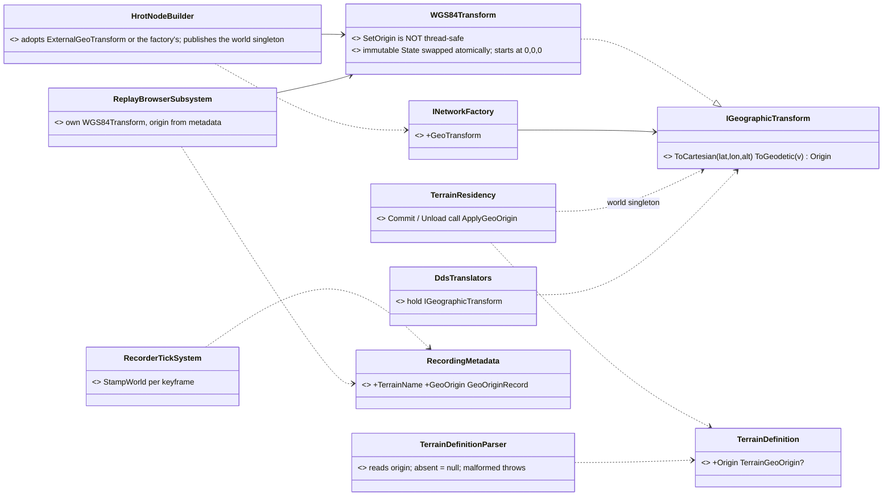
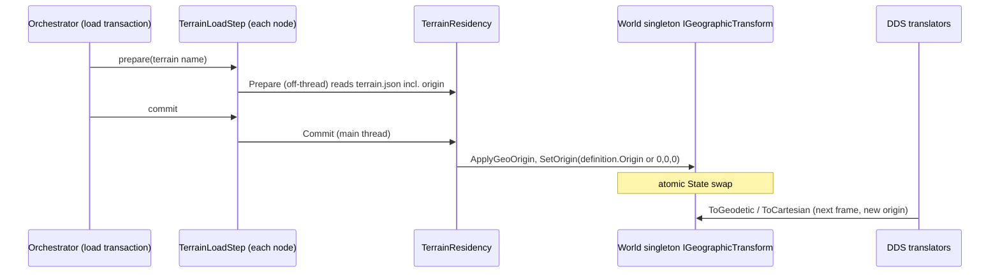
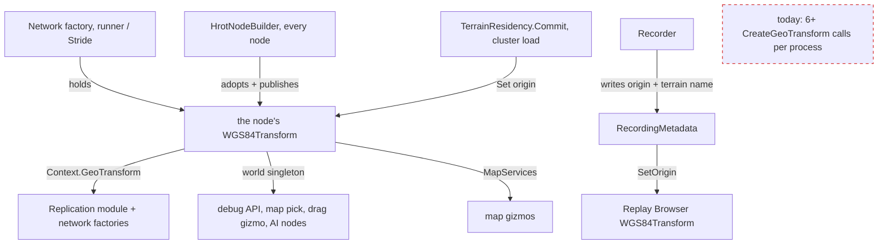
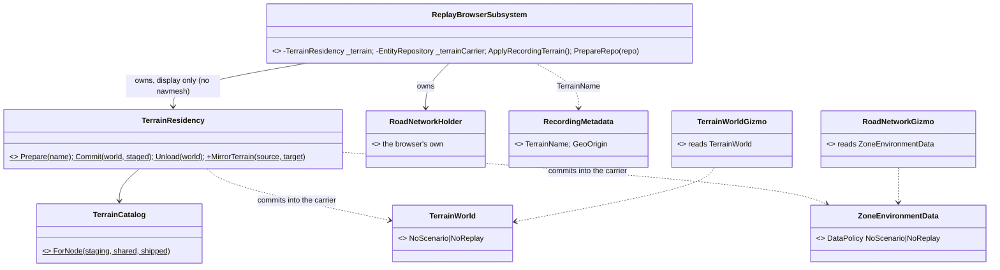
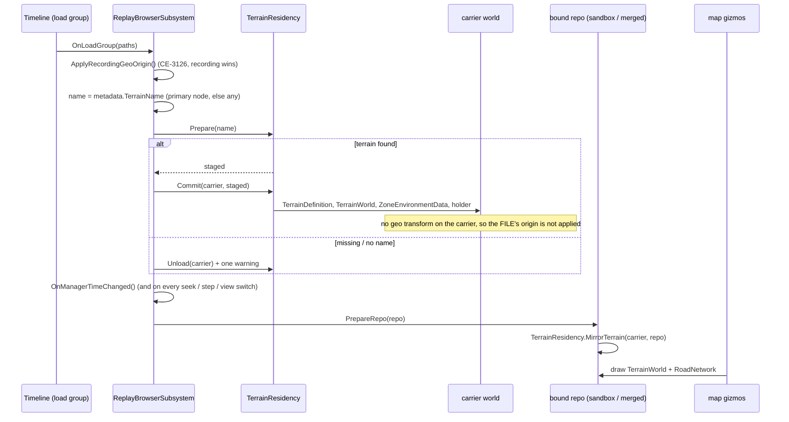
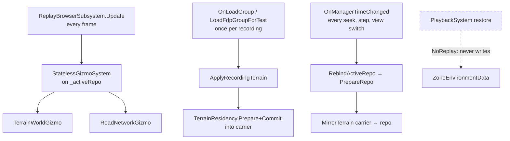

<!--STATUS
state: LIVE
build-state: BUILT — A–F built 2026-10-08 (CE-3126); §4 is the as-built, C deviated (no GeoOrigin class). §5 (CE-3118, the Replay Browser loads the recording's terrain) BUILT 2026-10-09 as designed
updated: 2026-10-09
current-answer: §5 CE-3118 (Replay Browser terrain) · §2 the decisions · §3 the UML (as-built) · §4 as-built notes
stale-below: §2 row C's "GeoOrigin" wording is SUPERSEDED by §4 ① — the class was not needed
known-rot: none
known-conflict: none
related-designs:
  - DESIGN_Terrain_Zones_And_Assets.md — owns the terrain asset and TerrainResidency's prepare/commit; this adds an origin to the asset and one line to Commit.
  - DESIGN_Cluster_Load_Phase.md — owns the cluster-wide load transaction the terrain step runs in; it is what makes every node switch origin together.
  - DESIGN_Terrain_World.md — terrain coordinates are local metres (X east, Y north, Z up); the origin is what ties them to lat/lon.
  - DESIGN_Terrain_Combat_Tuning.md §5a — CE-3118 (Replay Browser loads the recording's terrain by name) is where the recording learns its terrain; this adds the origin beside the name.
  - DESIGN_Uniform_Gizmo_Membership.md §10 — the map's MapServices; the Replay Browser's missing geo transform (mission lines) closes here.
  - designs/replay-and-modules/DESIGN.md — what runs during replay; §5 adds the terrain the browser's replay worlds are drawn over.
-->
# DESIGN — **the geo origin comes from the terrain** *(`CE-3126`, backend, `2026-10-08`)*

> 🔒 **User, `2026-10-08`:** *"Geo origin should be specidied as part of terrain file and passed to geoconverter service from there. Origin can be saved in recording metadata in case terrain with remembered name no longer exists"* — **R-229**.
> 🔒 **User, on the leans:** *"No default berlin. Missing geo = zeros. B-f ok."*

Today every node turns local metres into lat/lon with a hard-coded Berlin origin (`HrotEnvironment.CreateGeoTransform`,
`HrotEnvironment.cs:45`). ⇒ a terrain anywhere else is placed in Berlin on the wire and in every exported position.

## 1. INVENTORY *(two read-only sweeps, `2026-10-08`)*

| query | result |
|---|---|
| where the origin is set | ONLY `HrotEnvironment.CreateGeoTransform` → `SetOrigin(Berlin)`. `NodeConfiguration.GeodeticOrigin` (Tel Aviv, `NodeConfiguration.cs:14-18`) and `IgNetworkConstants` exist but only tests read them |
| how many transforms one process holds | ⚠ SEVERAL, each from its own `CreateGeoTransform()`: `HrotNodeBuilder.cs:244` (→ `Context.GeoTransform`) · `HrotNodeBuilderReplicationExtensions.cs:108,180` (replication module, participant) · `NedNetworkFactory.cs:231` / `BdcNetworkFactory.cs:111` (fallback) · `SimHostApp.cs:339` · `ClusterRunner/Program.cs:208,440` · `StrideNodeShell.cs:141,620` |
| who holds one by construction | the DDS translators (`GeoSpatialEgress/Ingress`, NavigationIntent, MapRoute, overlays, spawn/update commands, perception, `BdcWorldPosTranslator`) — **the wire carries lat/lon**; `GeographicModule` systems; the JSON attribute compiler; `MissionPresentationGizmo`, `AreaAuthoringArm`, IG panels |
| who reads it per call | the world singleton (`SetSingletonManaged<IGeographicTransform>`: Editor, SimHost, CGF, Stride — ⛔ not IG): debug API, map pick, drag gizmo, blueprint/CGF nodes |
| the earlier ruling | `CE-236` (`2026-09-08`): *"one single GeographicTransform implementation"*, read through the interface — ⚠ still instances agreeing by copy-paste (`CE-151` open) |
| the terrain file | `terrain.json` → `TerrainDefinition` (`schemaVersion`, `name`, `roadNetworks`, `world`) — **no origin field** in the format or in the 3 shipped terrains |
| the terrain load | `TerrainResidency.Prepare` (off-thread) / `Commit` (main thread) inside the cluster load transaction (`TerrainLoadStep`, `DESIGN_Cluster_Load_Phase.md`) on SimHost, IG, CGF, Editor ⇒ **every node commits the same terrain in the same transaction** |
| recording metadata | `RecordingMetadata` — no scenario, terrain or origin field (`CE-3118` plans the terrain name) |
| `WGS84Transform.SetOrigin` | can be called again, but is NOT thread-safe (no lock/volatile: a reader can see the new origin with the old matrix) |

## 2. Decisions *(leans — for the user)*

| # | ⭐ lean | rejected (one line each) |
|---|---|---|
| **A** ✅ *(revised)* | `terrain.json` gains `"origin": { "lat", "lon", "alt" }` → `TerrainDefinition.Origin`. ⛔ **No Berlin default in code** (`HrotEnvironment.CreateGeoTransform`'s hard-coded origin goes). The shipped terrains carry Berlin as their OWN DATA — measured: `scenarios/tt-nav-los` (test-town) stores its move target as Berlin lat/lon | origin in the scenario — two scenarios on one terrain could disagree about where it is |
| **B** ✅ *(revised)* | a terrain WITHOUT an origin — and a node with no terrain loaded — has origin **0, 0, 0**, said once in the log. ⚠ Measured consequence: `scenarios/test-move` has no terrain and stores a Berlin lat/lon target ⇒ its value is rewritten to the same local point under 0,0,0 | a Berlin default — ruled out; refuse to load — breaks every terrain without an origin |
| **C** ✅ *(⚠ as-built differs — §4 ①)* | ONE transform per node: `GeoOrigin` (Hrot.Core) — an `IGeographicTransform` that holds an IMMUTABLE `WGS84Transform` snapshot and swaps it atomically. `HrotNodeBuilder` creates it; the replication module, the network factories, `SimHostApp`, the runner and Stride take `Context.GeoTransform` instead of calling `CreateGeoTransform()` again; it is the world singleton too | call `SetOrigin` on each of today's instances — they are not all reachable, and `SetOrigin` is not thread-safe |
| **D** ✅ | `TerrainResidency.Commit` sets the origin (`GeoOrigin.Set(definition.Origin)`) — on every node, in the same cluster transaction that commits the terrain | a separate "set origin" message — a second protocol that can disagree with the terrain |
| **E** ✅ | `RecordingMetadata` gains `TerrainName` (with `CE-3118`) AND `GeoOrigin`; the recorder writes the node's current origin | name only — the user's case: the named terrain may be gone, or its origin edited since |
| **F** ✅ | the Replay Browser sets its `GeoOrigin` from the recording's metadata (authoritative for that recording), then loads the terrain by name if it still exists (`CE-3118`) | origin from the terrain file at replay time — wrong if the file changed after recording |

⚠ **What a switch does to in-flight data:** samples converted with the old origin and read with the new one land in the wrong place for
one frame. The switch only happens at a terrain commit, inside a scenario load that rebuilds the world anyway — so accepted, not engineered around.

## 3. UML

### Classes

*What the picture shows that prose hid:* every converter holds the interface, and on a node it is ONE object — the network factory's,
adopted by the builder and published as the world singleton — so the terrain commit reaches it through the world without any wiring.

### Sequence — a cluster load switches every node's origin together

*What it shows:* the origin rides the terrain's own two-phase commit — no node can hold the new terrain with the old origin.

### Modules — who creates it, who sets it, who reads it

*What it shows:* the dashed box is what goes away — every extra `CreateGeoTransform()` on a node becomes a reference to the node's one transform.

## 4. As-built *(`CE-3126`, `2026-10-08`)*

| # | what was built | where |
|---|---|---|
| ① ⚠ **deviation from C** | ⛔ no `GeoOrigin` class. `WGS84Transform` itself now keeps everything derived from the origin in one immutable `State`, swapped by a single volatile write, and starts at 0,0,0 with valid matrices. ⭐ Reuse over build: that makes EVERY instance safe to switch, not only a new wrapper's — and a bare `new WGS84Transform()` no longer maps everything to the origin (its matrices used to be all zeros until `SetOrigin`) | `WGS84Transform.cs` |
| ② | one transform per node: `INetworkFactory.GeoTransform` (NED/BDC return theirs) → `HrotNodeBuilder` adopts `HrotNodeConfig.ExternalGeoTransform` ?? the factory's ?? a new one, and **publishes it as the world singleton on every node** (IG published none before). The replication extensions take `context.GeoTransform`; SimHostApp adopts the factory's and passes it as `ExternalGeoTransform`; the runner's cluster debug API passes `null` so it reads the active perspective's singleton | `HrotNodeBuilder.cs`, `HrotNodeBuilderReplicationExtensions.cs`, `SimHostApp.cs`, `ClusterRunner/Program.cs` |
| ③ | `TerrainResidency.ApplyGeoOrigin(world, origin, name)` sets the world singleton's origin — called by `Commit` (before the definition is published) and `Unload` (zeros). Missing origin ⇒ 0,0,0 plus one warning | `TerrainResidency.cs` |
| ④ | `HrotEnvironment.CreateGeoTransform()` returns a transform at 0,0,0 — **no Berlin in code**. The three shipped terrains carry `"origin": {52.52, 13.405, 0}` as data; `scenarios/test-move` (no terrain) has its move target rewritten to the same local point (489, 296) under 0,0,0 | `HrotEnvironment.cs`, `Recipes/Terrain/*/terrain.json`, `scenarios/test-move` |
| ⑤ | `RecordingMetadata.TerrainName` + `GeoOrigin` (`GeoOriginRecord`), stamped by `RecorderTickSystem.StampWorld` at each keyframe from the world singletons (the only production keyframe path) | `RecordingMetadata.cs`, `RecorderTickSystem.cs` |
| ⑥ | the Replay Browser owns a `WGS84Transform`, publishes it on every repo it binds, gives it to the map (`MapServices`, so mission lines now draw in replay), and sets its origin from the loaded recording's metadata; a recording without one ⇒ 0,0,0 plus a warning | `ReplayBrowserSubsystem.cs` |

| ⑦ | tests that author positions against Berlin without a terrain now SAY so: `HrotEnvironment.CreateGeoTransform(52.52, 13.405, 0)` (an explicit-origin overload; 24 test call sites). The unread `IgNetworkConstants.GeoOrigin*` Berlin constants are deleted | test projects, `IgNetworkConstants.cs` |

⚠ **Left, flagged:** `NodeConfiguration.GeodeticOrigin` (a config default, Tel Aviv) is read by nothing but its own config tests — a second origin source in name only. Lean: retire it with the next SimHost config change; not removed here (no rush removals).

⚠ **Not done here:** loading the recording's terrain BY NAME in the Replay Browser is `CE-3118` — the metadata now carries the name it needs.

## 5. The Replay Browser loads the recording's terrain *(`CE-3118`, backend, `2026-10-09`; build-state: BUILT)*

> 🔒 **User, `2026-10-08`** (R-226): *"The replay browser must load the terrain in order to display it on the map if nothing else.
> Twreain name should go to metadata for sure."* · **`2026-10-09`:** *"Pls also add the terrain support to replaybrowser so it shows
> terrain and route net on the map."*

### 5.1 INVENTORY *(grep + reads, `2026-10-09`; the graph MCP was down, its CLI index is used)*

| question | answer | where |
|---|---|---|
| what the map's terrain / road gizmos read | world singletons only: `TerrainWorldGizmo` ← `TerrainWorld` (managed); `RoadNetworkGizmo` ← `ZoneEnvironmentData.RoadNetwork` | `TerrainWorldGizmo.cs:40`, `RoadNetworkGizmo.cs:27` |
| the repos the browser draws | the boot repo, each node's sandbox, the Merged transient master — **every one passes `PrepareRepo`** (boot + `RebindActiveRepo`, which every seek, step and view switch goes through) | `ReplayBrowserSubsystem.cs:161,620,646` |
| how a host makes a NAMED terrain resident | `TerrainResidency.Prepare(name)` (I/O, throws when missing) + `Commit(world, staged)`; `Commit` also sets the world's geo origin from the FILE | `TerrainResidency.cs:130,232,251` |
| where names resolve | `TerrainCatalog.ForNode(staging, shared, shipped)` — staging → the shared NAS stand-in → `{app}/Recipes/Terrain` | `TerrainCatalog.cs:46` |
| the recording's terrain | `RecordingMetadata.TerrainName` (CE-3126 ⑤), per node | `RecordingMetadata.cs:68` |
| ⚠ **is the road net in the recording?** | ⛔ **YES, as raw pointers.** `ZoneEnvironmentData` has no `[DataPolicy]` ⇒ a struct defaults to recordable and saveable (`EntityRepository.cs:656-667`) ⇒ its `RoadNetworkBlob` (native array pointers of the RECORDING process) is written into every recording of a terrain with roads — test-town and basic-desert since CE-3128 — and restored into the replay world | `ZoneEnvironmentData.cs:20`, `RecorderSystem.cs:843` |
| `TerrainWorld`, `TerrainDefinition` | `NoScenario │ NoReplay` — never recorded (why the browser shows no terrain today) | `TerrainWorld.cs:81`, `TerrainDefinition.cs:26` |

### 5.2 Classes

*What the picture shows that prose hid: nothing new is drawn and no gizmo changes — the two gizmos already "draw when the data is
there" (CE-3124's own header names CE-3118 as the missing producer). The only new type-level fact is `ZoneEnvironmentData`'s policy.*

### 5.3 Sequence — load a recording, then every seek

### 5.4 Modules — who calls it each frame

*Caption: the dashed edge is the one this change REMOVES — playback restoring a foreign process's pointers into the world the gizmo
reads. The mirror runs on the same path the geo transform already uses, so no repo the browser draws can miss it.*

### 5.5 Decisions *(the user asked for the capability; the shape is the lane's — recorded here)*

| # | decision | why |
|---|---|---|
| T1 | the name comes from `RecordingMetadata.TerrainName`, primary node first, else any node — the SAME lookup as the origin | one recording, one terrain; mirrors CE-3126 ⑥ |
| T2 | the browser owns ONE `TerrainResidency` (its own `RoadNetworkHolder`, no navmesh — display only) resolving through `TerrainCatalog.ForNode(null, shared)` | ⭐ reuse: the residency already parses, resolves names and is idempotent on (name, file time) |
| T3 | it commits into a private **carrier** world; `PrepareRepo` copies the four singletons onto every bound repo (`TerrainResidency.MirrorTerrain`) | the browser draws many repos and rebinds on every seek; a carrier with no geo transform keeps the RECORDING's origin authoritative (§2 F) — `Commit` would otherwise set the file's |
| T4 | a missing terrain, or a recording with no name ⇒ the residency unloads, one warning, the replay still plays | 🔒 *"if it still exists"* (§2 F) |
| T5 | ⭐ `ZoneEnvironmentData` becomes `NoScenario │ NoReplay` | a native pointer is never valid in another process; the terrain is a NAME in a recording (R-226), like `TerrainWorld` |

| rejected | the one fact that killed it |
|---|---|
| `Commit` straight into each bound repo | it sets the repo's geo origin from the terrain FILE (§2 F says the recording wins) and residency is one world |
| record `TerrainWorld` / the road net in the `.fdp` | 🔒 R-226 — the terrain stays referenced by name |
| hand the terrain to the gizmos through `MapServices` | both gizmos read world singletons; a second path would be two producers for one slot (R-132) |

### 5.6 As-built *(`2026-10-09`)*

Built as §5.2–§5.5 draw it, no deviation: `TerrainResidency.MirrorTerrain`, the browser's `_terrain` / `_terrainCarrier` /
`ApplyRecordingTerrain` (called from all THREE load paths — the timeline's group load, `LoadFdpViaManager`, the test seam),
`ZoneEnvironmentData` `NoScenario │ NoReplay`. Rails (`ReplayBrowserSubsystemTests`): `CE3118_TheRecordingsTerrain_AndItsRoads_
AreOnTheReplayWorld` (a real recording naming test-town replays over its world and its 5-node road graph, not the 2-node blob
the recording process held), `CE3118_TheRoadNetworkSingleton_IsNeitherRecordedNorSaved`,
`CE3118_ATerrainThatNoLongerExists_LeavesTheMapEmpty_AndTheReplayPlays`.

⚠ **The same defect class, four more times — filed, not fixed here (`CE-3132`):** `PathfindingBatchData`, `RaycastBatchData`,
`TerrainQueryBatchData` and `EqsResultPool` are ECS structs holding a `NativeArray` with no `NoReplay`, so they too are
recorded as raw pointers.
