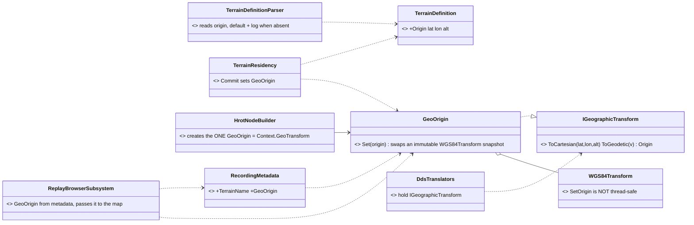
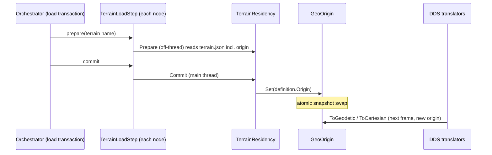
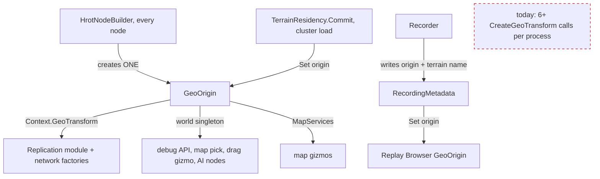

<!--STATUS
state: LIVE
build-state: DESIGN — leans A–F awaiting the user (CE-3126)
updated: 2026-10-08
current-answer: §2 the decisions (leans) · §3 the UML
stale-below: none
known-rot: none
known-conflict: none
related-designs:
  - DESIGN_Terrain_Zones_And_Assets.md — owns the terrain asset and TerrainResidency's prepare/commit; this adds an origin to the asset and one line to Commit.
  - DESIGN_Cluster_Load_Phase.md — owns the cluster-wide load transaction the terrain step runs in; it is what makes every node switch origin together.
  - DESIGN_Terrain_World.md — terrain coordinates are local metres (X east, Y north, Z up); the origin is what ties them to lat/lon.
  - DESIGN_Terrain_Combat_Tuning.md §5a — CE-3118 (Replay Browser loads the recording's terrain by name) is where the recording learns its terrain; this adds the origin beside the name.
  - DESIGN_Uniform_Gizmo_Membership.md §10 — the map's MapServices; the Replay Browser's missing geo transform (mission lines) closes here.
-->
# DESIGN — **the geo origin comes from the terrain** *(`CE-3126`, backend, `2026-10-08`)*

> 🔒 **User, `2026-10-08`:** *"Geo origin should be specidied as part of terrain file and passed to geoconverter service from there. Origin can be saved in recording metadata in case terrain with remembered name no longer exists"* — **R-229**.

Today every node turns local metres into lat/lon with a hard-coded Berlin origin (`HrotEnvironment.CreateGeoTransform`,
`HrotEnvironment.cs:45`). ⇒ a terrain anywhere else is placed in Berlin on the wire and in every exported position.

## 1. INVENTORY *(two read-only sweeps, `2026-10-08`)*

| query | result |
|---|---|
| where the origin is set | ONLY `HrotEnvironment.CreateGeoTransform` → `SetOrigin(Berlin)`. `NodeConfiguration.GeodeticOrigin` (Tel Aviv, `NodeConfiguration.cs:14-18`) and `IgNetworkConstants` exist but only tests read them |
| how many transforms one process holds | ⚠ SEVERAL, each from its own `CreateGeoTransform()`: `HrotNodeBuilder.cs:244` (→ `Context.GeoTransform`) · `HrotNodeBuilderReplicationExtensions.cs:108,180` (replication module, participant) · `NedNetworkFactory.cs:231` / `BdcNetworkFactory.cs:111` (fallback) · `SimHostApp.cs:339` · `ClusterRunner/Program.cs:208,440` · `StrideNodeShell.cs:141,620` |
| who holds one by construction | the DDS translators (`GeoSpatialEgress/Ingress`, NavigationIntent, MapRoute, overlays, spawn/update commands, perception, `BdcWorldPosTranslator`) — **the wire carries lat/lon**; `GeographicModule` systems; the JSON attribute compiler; `MissionPresentationGizmo`, `AreaAuthoringArm`, IG panels |
| who reads it per call | the world singleton (`SetSingletonManaged<IGeographicTransform>`: Editor, SimHost, CGF, Stride — ⛔ not IG): debug API, map pick, drag gizmo, blueprint/CGF nodes |
| the earlier ruling | `CE-236` (`2026-09-08`): *"one single GeographicTransform implementation"*, read through the interface — ⚠ still instances agreeing by copy-paste (`CE-151` open) |
| the terrain file | `terrain.json` → `TerrainDefinition` (`schemaVersion`, `name`, `roadNetworks`, `world`) — **no origin field** in the format or in the 3 shipped terrains |
| the terrain load | `TerrainResidency.Prepare` (off-thread) / `Commit` (main thread) inside the cluster load transaction (`TerrainLoadStep`, `DESIGN_Cluster_Load_Phase.md`) on SimHost, IG, CGF, Editor ⇒ **every node commits the same terrain in the same transaction** |
| recording metadata | `RecordingMetadata` — no scenario, terrain or origin field (`CE-3118` plans the terrain name) |
| `WGS84Transform.SetOrigin` | can be called again, but is NOT thread-safe (no lock/volatile: a reader can see the new origin with the old matrix) |

## 2. Decisions *(leans — for the user)*

| # | ⭐ lean | rejected (one line each) |
|---|---|---|
| **A** | `terrain.json` gains `"origin": { "lat", "lon", "alt" }` → `TerrainDefinition.Origin`; the 3 shipped terrains get Berlin (today's value) so nothing moves | origin in the scenario — two scenarios on one terrain could disagree about where it is |
| **B** | a terrain WITHOUT an origin loads with the default (Berlin) and says so once in the log — ⛔ not silently, ⛔ not a refusal | refuse to load — breaks every terrain authored before today |
| **C** | ONE transform per node: `GeoOrigin` (Hrot.Core) — an `IGeographicTransform` that holds an IMMUTABLE `WGS84Transform` snapshot and swaps it atomically. `HrotNodeBuilder` creates it; the replication module, the network factories, `SimHostApp`, the runner and Stride take `Context.GeoTransform` instead of calling `CreateGeoTransform()` again; it is the world singleton too | call `SetOrigin` on each of today's instances — they are not all reachable, and `SetOrigin` is not thread-safe |
| **D** | `TerrainResidency.Commit` sets the origin (`GeoOrigin.Set(definition.Origin)`) — on every node, in the same cluster transaction that commits the terrain | a separate "set origin" message — a second protocol that can disagree with the terrain |
| **E** | `RecordingMetadata` gains `TerrainName` (with `CE-3118`) AND `GeoOrigin`; the recorder writes the node's current origin | name only — the user's case: the named terrain may be gone, or its origin edited since |
| **F** | the Replay Browser sets its `GeoOrigin` from the recording's metadata (authoritative for that recording), then loads the terrain by name if it still exists (`CE-3118`) | origin from the terrain file at replay time — wrong if the file changed after recording |

⚠ **What a switch does to in-flight data:** samples converted with the old origin and read with the new one land in the wrong place for
one frame. The switch only happens at a terrain commit, inside a scenario load that rebuilds the world anyway — so accepted, not engineered around.

## 3. UML

### Classes

*What the picture shows that prose hid:* nothing that converts holds a `WGS84Transform` any more — they all hold the interface, and the one
object behind it on a node can change its origin without any of them being rebuilt.

### Sequence — a cluster load switches every node's origin together

*What it shows:* the origin rides the terrain's own two-phase commit — no node can hold the new terrain with the old origin.

### Modules — who creates it, who sets it, who reads it

*What it shows:* the dashed box is what goes away — every extra `CreateGeoTransform()` becomes a reference to the node's one `GeoOrigin`.
