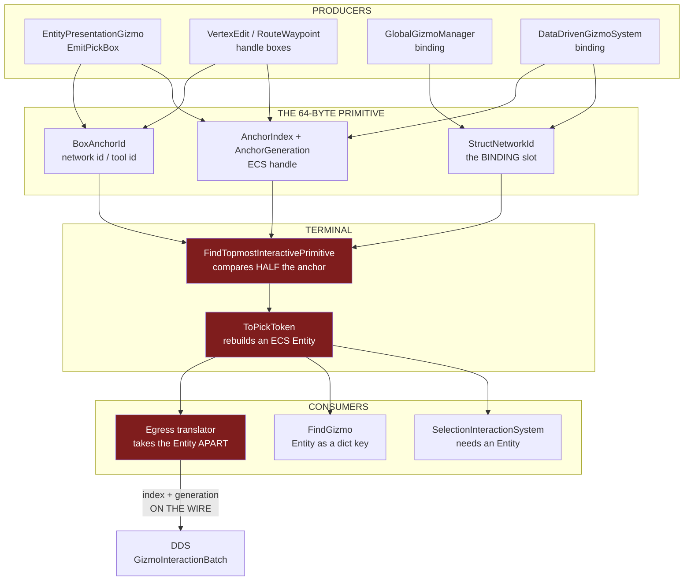
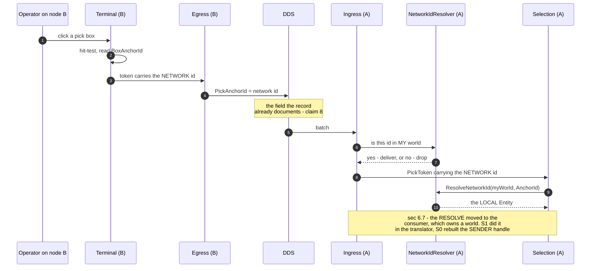

<!--STATUS
state: LIVE
build-state: BUILT (S0..S7 2026-09-10; §6.7 — the ECS payload DELETED — 2026-09-11)
updated: 2026-09-11
current-answer: ⭐⭐⭐ §6.8 (the IDENTITY INVARIANT — hard-guarded at every emission funnel,
  and the live arbiter deadlock it found) then §6.7. §6.7 IS THE CURRENT ANSWER on the model itself and it SUPERSEDES §6.6 entirely: the ECS index and
  generation are gone from GizmoPickToken, from PickToken, and from every primitive producer; identity
  is the network id end to end and each consumer resolves it in its own world. ⭐ Then §6.2, the
  AS-BUILT, which OVERRIDES §5's UML and §6's table wherever they
  disagree — three steps deviated while building. Then §2, the CLAIM LEDGER: every load-bearing claim
  with its file:line proof and how it was measured. §3 is AS-IS-BEFORE, §4 the two defects, §5 the
  target state with the UML, §6 the build order, §6.1/§6.2 the two refinements found during the build,
  §7 the constraints, §8 what is NOT verified, §9 the retraction log.
  ⭐ Read §6.2 then §2. This design was reached through ~8 corrections in one session (§9), so a claim
  without a proof row in §2 is NOT a claim of this document.
stale-below: ⛔⛔ §6.6 IS SUPERSEDED BY §6.7 — do not quote its option table as a live rationale; only
  its CE-259af ingress-strip half is current. ⛔ §5.2's classDiagram and §6's S3/S4/S6/S7 rows describe
  the design AS WRITTEN, not as built, AND predate §6.7 — anywhere they show an ECS payload travelling
  in a token, §6.7 wins. §6.2 names each build deviation and why. ⛔ Claim ⑥ is FALSE as built and claim
  ㉑ is INCOMPLETE — both are annotated in §2 and corrected in §6.2.
design-basis: docs/blueprints/Blueprint_Issues_Tracker.md CE-259x (the exclusive-filter leak) and CE-259h
  (the pick token's network-stable contract) - docs/UX/UX_Feature_Tool_Model.md §4.7g (the entity
  hit-test) - the field contracts in FDP/ExtDeps/GizmoMap/GizmoMap.Contracts/Primitives/DebugPrimitive.cs
  which are the authority for what each slot means.
known-rot: none. §9 lists what was retracted while reaching this state, so nobody re-derives a dead branch.
known-conflict: none. ⚠ FDP/Engine/Fdp.Presentation/Vis2D/Layers/DebugGizmoLayer.cs:271-285 and
  Hrot/Network/Hrot.Network.NED/Gizmos/GizmoInteractionIngressTranslator.cs:56 CONTRADICT the field
  contracts they consume; that is the subject of this design, not an unreconciled disagreement.
-->
# ⭐⭐⭐ Gizmo Anchor Identity — **one id, and it is the network id**

> 🔒 **User, `2026-09-10`, verbatim:** *"why are we mixing ECS entity id and network entity id when we can
> use netwok ALL THE TIME and EVERYWHERE in gizmos"* · *"passing index+generation is overkill if we have
> unique networkId for any entity. It does not make sense at all."*

⭐⭐ **The whole design in one line:** the gizmo layer identifies an anchor by its **network id** only. The
ECS handle (`AnchorIndex` + `AnchorGeneration`) stops being an identity — it is not compared, not routed
and not put on the wire.

⛔⛔ **This is a CONFORMANCE FIX, not a new contract.** Both ends already specify the network id in their
own comments (§2 rows ⑦ and ⑧); the code violates them.

---

## 1. INVENTORY

⭐ Graph first, grep to confirm the sites — 🔒 the rule this design broke and then repaired (§9 ⑧).

| # | query | total | note |
|---|---|---|---|
| ① | `search_graph name_pattern=".*Gizmo$" label="Class"` | **56**, `has_more: false` | ⭐⭐ **the enumeration that caught 5 emitters a hand-picked grep list had missed** — §2 row ⑯ |
| ② | sweep of all 56 for `EmitRaw\|MakeBox2D\|MakeSphere\|DrawContextMenuBinding` | **13 files** | §2 row ⑯ |
| ③ | `check_index_coverage` over the 7 files this design edits | `index_mode: full` · `recording_status: complete` · all **`no_recorded_issue` / `metadata_match`** | ⚠ `signal: best_effort` — never proof of completeness |
| ④ | grep for test files touching `PickAnchorId\|Token.Target\|ToPickToken\|AnchorGeneration` | **11 files** | §2 row ⑮ — the migration surface |

---

## 2. ⭐⭐⭐ THE CLAIM LEDGER — **every load-bearing claim, with its proof**

> 🔒 **Why this section exists** *(user, `2026-09-10`)*: *"provide a proof of every claim. too many flips in
> the last 15 minutes."* ⇒ ⛔ **a claim not in this table is not a claim of this document.**
> ⭐ `read` = I opened those lines this session. `graph` = codebase-memory enumeration. `grep` = text only.

| # | claim | proof | how |
|---|---|---|---|
| ① | `AnchorIndex` is the ECS entity index, and **must not** be used for handle validity | `DebugPrimitive.cs:31-33` — *"Never use AnchorIndex to evaluate handle validity; evaluate AnchorGeneration instead"* | read |
| ② | `AnchorGeneration` is the ECS generation; **0 ⇒ null/uninitialised** | `DebugPrimitive.cs:37` | read |
| ③ | `BoxAnchorId` is authoritative **when `AnchorGeneration == 0`**, and **ignored when `!= 0`**, where the terminal routes `AnchorIndex` | `DebugPrimitive.cs:62-67` | read |
| ④ | `AnchorIndex` **overlays** `StringHash` at offset 8, discriminated by `Space`/`Shape` | `DebugPrimitive.cs:8-11`, `:27-35` | read |
| ⑤ | `AnchorGeneration` **also carries the signed screen-pixel line offset** for Text | `DebugPrimitiveBuffer.cs:202-204` *(write)* · `DebugPrimitiveRenderer2D.cs:345`,`:360` *(read)* · documented `DebugPrimitive.cs:320` | read |
| ⑤b | that Text use is **live in production**, 4 sites | `EntityEditorLabelGizmo.cs:57` `-16f` · `:77` `-30f` · `:82` `-30f` · `:96` `-44f`; its own note at `:51` says the spacing *"is applied via lineOffsetPx (carried in AnchorGeneration)"* | read |
| ⑥ | 🔴🔴 **FALSE AS BUILT — corrected `2026-09-10` during S6.** It said *"after the ECS role is removed, offset 12 has **exactly one** live use"*. ⛔ The as-built S3 **keeps the ECS generation as the interaction PAYLOAD** *(§6.2 ①)*, so the slot has **TWO** live uses. ⇒ ⭐ the answer is an **alias pair**, not a rename — and that **un-retracts §9 ⑨**, whose only reason was this claim | `DebugPrimitive.cs` offset 12 now declares both `AnchorGeneration` and `LineOffsetPx` | read |
| ⑦ | 🔒 **the in-process token already specifies a network id** | `GizmoPickToken.cs:8` — `AnchorId` *"NetworkId / semantic object id (0 = invalid)"*; `:10` `StreamId` *"publisher stream discriminator"* | read |
| ⑧ | 🔒 **the DDS record already specifies a network id** | `GizmoInteractionBatch.cs:21` — *"PickToken fields (**blittable breakdown of stable network ID** + SubElementId)"* over `long PickAnchorId; uint PickSubElementId; uint PickStreamId;` | read |
| ⑨ | 🔴 **the local boundary violates ⑦** — it rebuilds an ECS handle | `Fdp.Presentation/Vis2D/Layers/DebugGizmoLayer.cs:271-285` — `Target = new Entity((int)token.AnchorId, (ushort)token.StreamId)` | read |
| ⑩ | 🔴 **the remote boundary violates ⑧** — it rebuilds a LOCAL entity from the SENDER's handle | `GizmoInteractionIngressTranslator.cs:56` — `new Entity((int)batch.PickAnchorId, (ushort)batch.PickStreamId)`; the `IsAlive` check at `:66` **masks** the mismatch | read |
| ⑪ | 🔴 the egress **disassembles** the entity onto the wire | `GizmoInteractionEgressTranslator.cs:81-82` — `PickAnchorId = token.Target.Index`, `PickStreamId = (uint)token.Target.Generation` | read |
| ⑫ | the exclusive filter compares **half** an anchor — value, never generation | `GizmoMap.Presentation/Layers/DebugGizmoLayer.cs:490-491`: `anchorId` is derived *using* the generation, then only `anchorId != exclusiveAnchorId.Value` is tested | read |
| ⑫b | the binding's anchor arrives in a **different slot** and so is outside ③'s rule | `DebugPrimitive.cs:344-352` — `MakeInputCaptureBinding` writes **`StructNetworkId`** (offset 24), never `BoxAnchorId` (offset 44); the scan reads it at `DebugGizmoLayer.cs:132` | read |
| ⑬ | the two arbiters key their bindings **differently** | `GlobalGizmoManager.cs:212-216` → `networkId: kvp.Key` *(a TOOL id)*, **no generation stamp**; `DataDrivenGizmoSystem.cs:384-388`,`:426-430`,`:459-461` → `networkId: (long)entity.Index` **plus** `binding.AnchorGeneration = entity.Generation` | read |
| ⑬b | tool ids and ECS indices occupy **the same small-integer range** | `GlobalGizmoManager.cs:27` `_nextId = 0`, `:63` `NewId() => Interlocked.Increment(ref _nextId)` ⇒ 1, 2, 3… | read |
| ⑭ | only **two** of four `Token.Target` consumers genuinely need an `Entity` | ✅ `SelectionInteractionSystem.cs:63` *(writes `SelectionState`)* · ✅ `DataDrivenGizmoSystem.cs:497`,`:575` `FindGizmo` *(a **dictionary key** — `:77` `Dictionary<Entity, IEntityStatefulGizmo>`, used at `:92`/`:103`/`:108`/`:115`)* · ⛔ `GizmoInteractionEgressTranslator.cs:81-82` and ⛔ `DataDrivenGizmoSystem.cs:581-583` **take it apart again** | read |
| ⑮ | 🔴 **the WRONG semantics are RAILED** — a green test asserts the sender's ECS index goes on the wire | `Hrot.Network.NED.Tests/GizmoInteractionTranslatorTests.cs:89` `Assert.Equal((uint)entity.Index, record.PickAnchorId)`; `:106-107`, `:141-142`, `:173-174` feed `PickAnchorId = (uint)index`, `PickStreamId = gen`; `:122` asserts `Token.Target` | read |
| ⑯ | the anchored-primitive emitters are **13 files, not the 3 a name list suggested** | graph ① + sweep ②; the 5 missed are `TuningConsoleGizmo:60` *(`MakeStructInspector`)* · `LayerControlGizmo:105` *(layer mask)* · `ContextMenuProjectorGizmo:129` and `CanvasContextMenuGizmo:29` *(`ContextMenuBinding`)* · `RubberBandGizmo:43-52` *(`Box2D` from `default`, **no anchor set**)* | graph + read |
| ⑯b | ⇒ none of the 5 reaches the exclusive comparison | only `Box2D`/`Sphere` are hit-tested *(`DebugGizmoLayer.cs:496`,`:502`)*; binding shapes are skipped at `:481`; an all-zero anchor is skipped at `:483` | read |
| ⑰ | **every interactive entity has a non-zero network id by construction** | `EntityPresentationGizmo.cs:19`,`:37` — `[GizmoProjector(typeof(SimTransform), typeof(NetworkIdentity))]`, *"the query is `SimTransform` + `NetworkIdentity` and nothing else"* ⇒ no `NetworkIdentity`, no pick box | read |
| ⑰b | …and `EmitPickBox` stamps all three fields | `EntityPresentationGizmoShared.cs:21-33` — `entity.Index`, `entity.Generation`, `networkId` | read |
| ⑱ | a tool **handle** can still carry id 0 | `ScenarioToolRegistrations.cs:204-207` — `NetworkIdOf` returns `0L` when `NetworkIdentity` is absent | read |
| ⑲ | ⛔⛔ **CORRECTED `2026-09-10` DURING S1 — THERE ARE **TWO** `NetworkEntityMap` CLASSES AND MY FIRST CITATION WAS THE WRONG ONE.** 📐 `Fdp.Network.Cyclone/Services/NetworkEntityMap.cs` *(namespace `Fdp.Network.Cyclone.Services`, a `ConcurrentDictionary`)* is **NOT** the production one. ⭐ **The production map is `FDP/Toolkits/Fdp.Toolkits/Replication/Services/NetworkEntityMap.cs`, namespace `Fdp.Toolkit.Replication.Services`** — it is what `NetworkSpawningSystem` takes and uses *(`:26`, `:69`, `:198` `Register`, `:113`/`:208` `TryGetEntity`)*, and what `SimHostApp.cs:1009` fully qualifies. ⭐⭐ It is **BIDIRECTIONAL and O(1) both ways** — `:10` `Dictionary<long, Entity> _netToEntity` **and** `:11` `Dictionary<Entity, long> _entityToNet` — plus a graveyard *(`:15-16`)* and an `EntityRegistered` event *(`:27`)*. ⚠ It is a plain `Dictionary`, **not** concurrent | read |
| ⑲b | ⛔ the *other* resolver is a **linear scan** — do not use it | `NetworkIdResolver.cs:67-72` `FindEntityByNetworkId` iterates `repo.Query().With<NetworkIdentity>()` | read |
| ⑳ | 🔴🔴 **RETRACTED `2026-09-10` DURING S1 — THIS CLAIM IS FALSE, AND IT WAS THE ONLY REASON FOR AN ABSTRACTION.** ⛔ It said *"`Fdp.Presentation` cannot reference the map's assembly"* on the strength of `Fdp.Presentation.csproj` having **no `Fdp.Network.Cyclone`** — ✅ **true, and irrelevant**: ⑲ shows the production map lives in **`Fdp.Toolkits`**, which that csproj **does** reference. ⇒ ⭐⭐⭐ **`NetworkEntityMap` is directly reachable from `Fdp.Presentation`; NO host-supplied resolver and NO `IAnchorResolver` interface are needed.** 📌 Root cause of the error: two files named `NetworkEntityMap.cs`, the same trap as the two `DebugPrimitiveBuffer.cs` — ⇒ **cite the NAMESPACE, not the folder** | read |
| ⑳b | 2 of 5 hosts pass **no world** to the adapter | `CgfSubsystem.cs:1425` and `ReplayBrowserSubsystem.cs:251` use the **3-arg** overload; the richer overloads are `Fdp.Presentation/…/DebugGizmoLayer.cs:37-72`. ⚠ **Still true and still the wiring surface for S3/S4** — ⛔ but with ⑳ retracted it is a *constructor argument*, not an architectural gap |
| ⑳c | ⭐ the map is single-threaded-safe **for this use**, despite being a plain `Dictionary` | the terminal reads it during `canvas.Update` and the kernel writes it in `_kernel.Update()` — **the same main thread**, in sequence *(`EditorSubsystem.cs:2519` then `:2560`)* | read |
| ㉑ | `AnchorIndex` is **already** a network id in the renderer | `DebugPrimitiveRenderer2D.cs:104-105` — *"Resolve against SpatialAnchor cache keyed by **AnchorIndex (used as network ID)**"*; matched by `IDebugDrawBuilder.cs:120` and `DebugPrimitiveBuffer.cs:370` *(`SemanticShape`)* | read |
| ㉑b | ⛔⛔ **…AND IT IS TRUNCATED. Found `2026-09-10` during S7 — a live latent defect, `CE-259z`.** 📐 The `SpatialAnchor` cache is **filled** with the full 64-bit `SpatialAnchor.NetworkId` *(`DebugPrimitiveRenderer2D.cs:63` — `anchors[prim.NetworkId]`)* and **probed** with an int-widened `AnchorIndex` *(`:105` — `(long)prim.AnchorIndex`)*, which `DebugPrimitiveBuffer.cs:370` wrote as **`(int)networkId`** — an *unchecked* narrowing. ⇒ 🔴 an `EntityLocal` primitive whose anchor id exceeds `int.MaxValue` **wraps, misses the cache and is SKIPPED** *(`:106` `continue`)* — the shape is never drawn, with no error. ⭐ It **cannot be widened**: `SemanticShape`'s 40-byte union is full *(ProfileId 24-31, Length/Width 32-39, ConditionMask 40-43, `Resolved*` 44-63)* and 64 bytes is a DDS invariant *(C1)* ⇒ **a CONSTRAINT (`C7`), not a slot to find** | read |
| ㉒ | **nothing structural changes on the wire** | `GizmoInteractionBatch.cs:16-25` — field set, `long`/`uint`/`uint` types, `[DdsKey] SourceNodeId, SequenceNumber` and `[DdsQos]` all unchanged; `DebugPrimitive` stays `[StructLayout(Explicit, Size = 64)]` with **no field added, removed or moved** | read |

---

## 3. AS-IS — **two identity domains in one field set**

⭐ **Read the red boxes:** the terminal compares half an anchor (§2 ⑫), rebuilds a handle the contract does
not ask for (⑨), and the egress then puts a **process-local** handle on the wire (⑪).

---

## 4. THE TWO DEFECTS

| | defect | proof |
|---|---|---|
| **D1** *(local, operator-visible)* | a click **leaks past an exclusive tool** to whichever entity's ECS index equals the active tool's id ⇒ the entity drags and gets selected | §2 ⑫ + ⑫b + ⑬ + ⑬b. 🔴 Operator, `2026-09-10`: *"when picking entity and left clicking it and dragging, the entity got dragged … also the dragged entity got selected"* |
| **D2** *(remote, silent)* | a gizmo interaction that crosses DDS targets a **wrong or dead entity** on the receiver | §2 ⑩ + ⑪. ⚠ Masked by the `IsAlive` check at `:66`, and ⑮ shows a **green rail asserts the broken behaviour** |

⛔ **D1 is not a regression from `CE-259r`/`§4.7i`** — every cited producer and the filter predate them.

---

## 5. TARGET STATE

### 5.1 The rule

> ⭐⭐⭐ **An anchor is identified by its NETWORK ID.**
> ⚠⚠ **AMENDED `2026-09-11` by §6.7:** an earlier version of this rule continued *"the ECS handle may
> travel as an optional local payload, but it is never compared, never routed and never authoritative."*
> ⛔ **It does not travel at all now.** The handle is emitted by nothing and read by nothing; each
> consumer resolves the network id in its own world.

### 5.2 Classes

```mermaid
classDiagram
    class DebugPrimitive {
        <<struct 64B>>
        +long BoxAnchorId
        +long StructNetworkId
        +ushort AnchorGeneration
        +short LineOffsetPx
        +int AnchorIndex
    }
    class GizmoPickToken {
        <<struct>>
        +long AnchorId
        +uint SubElementId
        +uint GizmoTypeId
        +uint StreamId
    }
    class PickToken {
        <<struct>>
        +long AnchorId
        +uint SubElementId
        +uint GizmoTypeId
    }
    class NetworkEntityMap {
        EXISTS Fdp.Toolkits
        +TryGetEntity(long id, out Entity e) bool
        +Register(long id, Entity e) void
        +RebuildFromWorld(EntityRepository repo) void
    }
    class NetworkIdResolver {
        EXISTS Fdp.Toolkits
        +ResolveNetworkId(repo, long id) Entity
        +IsKnownDeadAnchor(repo, long id) bool
    }
    class Terminal {
        FindTopmostInteractivePrimitive
        PickTopmostAnchorId
    }
    class IngressTranslator {
        Translate(batch)
    }
    class EgressTranslator {
        Publish(token)
    }
    class SelectionInteractionSystem
    class DataDrivenGizmoSystem

    Terminal ..> DebugPrimitive : compares BoxAnchorId ONLY
    Terminal ..> GizmoPickToken : MakePickToken - one seam, both arms
    EgressTranslator ..> GizmoPickToken : network id straight to the wire
    IngressTranslator ..> PickToken : forwards the RECEIVED id
    Terminal ..> PickToken : ToPickToken - a FIELD COPY, no world
    SelectionInteractionSystem ..> NetworkIdResolver : resolves in ITS OWN world
    DataDrivenGizmoSystem ..> NetworkIdResolver : resolves in ITS OWN world
    IngressTranslator ..> NetworkIdResolver : addressability plus known-dead only
    NetworkIdResolver ..> NetworkEntityMap : fast path, VERIFIED against NetworkIdentity
    DataDrivenGizmoSystem ..> DebugPrimitive : binding keyed by NETWORK id

    note for GizmoPickToken "AS BUILT sec 6.7 - AnchorId is the ONLY identity. The AnchorIndex field is DELETED and StreamId is back to a reserved publisher discriminator. Sec 6.2's IN-PROCESS PAYLOAD is SUPERSEDED"
    note for PickToken "AS BUILT sec 6.7 - was Entity Target. IsValid is AnchorId greater than 0, NOT non-zero: minus 1 is the terminal canvas sentinel"
    note for DebugPrimitive "AS BUILT sec 6.7 - offset 8 has TWO roles now, not three: the SpatialAnchor cache key and StringHash. The ECS payload role is gone. Offset 12 is an ALIAS PAIR and only LineOffsetPx has a producer. The 32-bit anchor key is constraint C7"
    note for NetworkEntityMap "NO NEW ABSTRACTION - claim 20 RETRACTED. EVERY ecs module maintains one, ReplayBrowser included since sec 6.7"
    note for NetworkIdResolver "THE one resolve seam. Map first, then the existing filtered scan as a correctness floor. A map hit is confirmed against the entity own NetworkIdentity, so a stale map degrades to SLOW never to WRONG"
    note for IngressTranslator "Sec 6.7 - no map, no id translation. It still DROPS an anchor this node does not host (DDS is broadcast and routing prefers the focus holder) and still turns a KNOWN-DEAD anchor into a Cancel"
```

### 5.3 Sequence — a remote pick, which is `D2`

---

## 6. ⭐⭐ BUILD ORDER — **each step with its proof and its rail**

| # | step | rests on | rail |
|---|---|---|---|
| **S0** | ⭐ **independent, ship first — close `D1`.** In `FindTopmostInteractivePrimitive`, compare the **whole** anchor: skip unless `anchorId` **and** `prim.AnchorGeneration` both match the binding's *(the binding's generation is already read at `DebugGizmoLayer.cs:137`)* | ⑫ ⑫b ⑬ ⑬b | a tool id `3` + an entity at ECS index `3` must **not** leak *(red-proof on today's code)*; that entity's real anchor must still resolve. ⛔ Needs a `PickTopmostEntityAnchor`-style public overload — the precedent `CE-259p` set |
| **S1** | 🔴 **the receiver stops trusting the sender's handle.** `GizmoInteractionIngressTranslator` takes the **`NetworkEntityMap`** and resolves by network id. ⛔ **No new interface** — ⑳ retracted | ⑩ ⑲ ⑳ | a batch whose `PickAnchorId` is a network id **not** present locally yields **no** event *(today it yields a wrong entity)* |
| **S2** | **the egress stops disassembling.** Write the network id, not `Target.Index`/`Generation` | ⑪ ⑦ ⑧ | round-trip: egress→ingress on **two different index layouts** resolves the **same** entity. ⚠ **`GizmoInteractionTranslatorTests` must be rewritten here** — ⑮ |
| **S3** | **the terminal returns a network id.** `ToPickToken` stops rebuilding an `Entity` | ⑨ ⑦ | the token's `AnchorId` equals the picked primitive's `BoxAnchorId` |
| **S4** | **the two genuine consumers resolve locally.** `SelectionInteractionSystem` via the resolver; `FindGizmo` re-keyed by network id *(5 sites, `DataDrivenGizmoSystem.cs:77`/`:92`/`:103`/`:108`/`:115`)* | ⑭ ⑲ ⑳ ⑳b | selecting by network id sets `SelectionState` on the right entity; a tool armed on entity X is found by X's network id |
| **S5** | **stop stamping the ECS handle for interaction** — the 3 handle emitters and the 3 bindings; the comparison collapses to `BoxAnchorId` and **S0's generation term is deleted** | ⑬ ⑯ ⑯b ⑰ | the exclusive filter admits only same-network-id primitives; §4.7i's suspended-handle rails stay green |
| **S6** | **rename the freed slot** — `[FieldOffset(12)] public short LineOffsetPx`, deleting the two casts *(`unchecked((ushort)(short)…)` on write, `(short)…` on read)* | ⑤ ⑤b ⑥ ㉒ | the editor's 3-line entity label still stacks at `-16/-30/-44` px |
| **S7** | **`AnchorIndex` keeps one meaning** — the network id, matching the renderer that already reads it that way | ㉑ | `EntityLocal` primitives still resolve against the `SpatialAnchor` cache |

⭐ **S0 is shippable alone.** ⛔ **S1+S2 must land together** *(they are the two ends of one hop)*.
⭐ S3→S4 then S5→S7.

### 6.1 ⭐⭐⭐ REFINEMENT FOUND DURING S3/S5 — **one id space needs DISJOINT ALLOCATION**

⚠⚠ **The design said "identity is the network id" and stopped there.** 📐 **Measured `2026-09-10` while
building:** collapsing to one numeric space makes **tool ids and network ids share it**, and they
**collide today** —

| allocator | first id | proof |
|---|---|---|
| tool ids | **1, 2, 3…** | `GlobalGizmoManager.cs:27` `_nextId = 0` + `:63` `Interlocked.Increment` |
| network ids | **2, 3, 4…** | `Hrot.Core/Network/SequentialIdAllocator.cs:14` `_next = 1` + `:17` `Interlocked.Increment` |

⇒ 🔴 **without this, a global tool's exclusive binding would admit the entity whose NETWORK id equals the
tool id** — the same class of bug one level along, and `S0`'s generation term is what had been hiding it.

⭐⭐ **Fix: allocate tool anchor ids from a disjoint high base** — `ToolAnchorIdBase = 1L << 40`, so
`NewId()` yields `2^40 + n`. ⭐ Why that and not negatives: 📐 `DebugGizmoLayer.cs:217` already uses
**`-1L` as the CANVAS sentinel** *(`hitNetworkId = hit.BoxAnchorId != 0 ? hit.BoxAnchorId : -1L`)*, so a
negative tool id would be read as *"the canvas"*. ⭐ A high positive base collides with nothing: a network
id would have to exceed **1.1 × 10¹²**, and `ToPickToken` resolves a tool id to no entity, which is correct.

⛔ **This is why `S5` deletes `S0`'s generation term rather than keeping it as a belt** — with one id space
and disjoint allocation, the generation adds nothing and reintroduces the two-domain thinking.

### 6.2 ⭐⭐⭐ AS-BUILT — **three steps deviated. This section OVERRIDES §5's UML and §6's table.**

🔒 **Obligation ⑤** *(`CLAUDE.md`, "THE DESIGN MUST REFLECT THE AS-BUILT")*: a deviation recorded only in
a batch report leaves the design lying. ⭐ Built `2026-09-10`, commits `882d35f6` *(S3+S4+S5)* and
`6c719f56` *(S6+S7)*, on top of `90bec913` *(S0)* and `740b522c` *(S1+S2)*.

| step | as WRITTEN in §6 | ⭐ as BUILT | why it changed |
|---|---|---|---|
| **S0** | compare the whole anchor *(value **and** generation)* | ✅ as written, **then DELETED by S5** | ⭐ S0 patched the *symptom*; §6.1's disjoint id range removes the *cause*, after which the generation term only reintroduces two-domain thinking |
| **S1 · S2** | ✅ as written | ✅ as written | — |
| **S3** ⚠ *(see §6.6 — the field this produced is justified and ENFORCED there)* | 🔴 **the terminal returns ONLY a network id; every consumer resolves it through `NetworkEntityMap`** | ⭐⭐ **`GizmoPickToken` gained an explicit PAYLOAD field.** `AnchorId` is the identity *(network id)*; `AnchorIndex` + `StreamId` are an **in-process shortcut** the producer already had, so the consumer-side adapter rebuilds `Entity(index, generation)` with **no lookup and no map** | 🔴 **Measured while building: `ReplayBrowser` composes `SelectionInteractionSystem` *(`ReplayBrowserSubsystem.cs:210`)* and has NO `NetworkEntityMap` at all** — and CGF passes no world either *(claim ⑳b)*. ⇒ resolve-at-the-boundary would have **silently dropped ReplayBrowser's selection.** ⚠ The payload is **never compared, never routed, never on the wire** — S1/S2 still resolve at the translators, where a process-local handle is meaningless |
| **S4** | `SelectionInteractionSystem` via the resolver; `FindGizmo` re-keyed by network id | ⭐ **the binding-key half was built** *(all 3 sites in `DataDrivenGizmoSystem`, keyed by `NetworkIdOf`)*; ⭐⭐ **the consumer half became UNNECESSARY** | ⭐ with S3-as-built, **both** paths hand `PickToken.Target` a valid *local* `Entity` — the adapter from the payload, the ingress from the map. ⇒ `SelectionInteractionSystem` and `FindGizmo`'s `Dictionary<Entity, …>` are correct unchanged. ⛔ **No host wiring was needed** ⇒ `U1` and `U4` are moot, not answered |
| **S5** | stop stamping the ECS handle; comparison collapses to `BoxAnchorId` | ⭐ **comparison collapsed as written; the STAMPING STAYS** — it is now the S3 payload | ⇒ ⛔ **claim ⑥ is false as built**, which is what re-opens S6 *(below)* |
| **S6** | **RENAME** offset 12 to `LineOffsetPx` | ⭐⭐ **an ALIAS PAIR** — `AnchorGeneration` *(ushort)* **and** `LineOffsetPx` *(short)*, same two bytes | ⭐ the slot has **two** live uses, not one *(claim ⑥)* ⇒ this is exactly the offset-8 `AnchorIndex`/`StringHash` precedent. ⭐⭐ **§9 ⑨ is UN-RETRACTED**: its only reason was the one-use claim |
| **S7** | `AnchorIndex` **keeps one meaning** — the network id | ⛔⛔ **impossible, and the attempt found a DEFECT instead.** Offset 8 carries **three** roles *(payload index · `EntityLocal` anchor key · `StringHash`)*, discriminated by `Shape`/`Space` — the documented pattern. ⭐ So S7 became: **document all three, and pin the anchor key's 32-bit HARD LIMIT** *(claim ㉑b, `CE-259z`)*, with a `Debug.Assert` at the one truncating writer | ⭐⭐ **an unchecked `(int)networkId` narrowing whose lookup then misses the cache** ⇒ the shape is skipped, silently. ⛔ Cannot be widened *(C1 + a full payload union)* ⇒ it is a constraint, `C7` |

#### ⛔⛔ A SECOND TOKEN SITE — **the first S5 pass converted ONE of TWO, and the rails could not see it**

📐 `HandleInput` builds a pick token **twice**: on **left press** *(the primary drag/pick path)* and on
**right click**. ⭐ Only the right-click arm was converted; the left-press arm kept
`AnchorGeneration != 0 ? AnchorIndex : BoxAnchorId` and **every suite stayed green** — the rails exercise
the hit-test, and `HandleInput` needs a live window.

| ⭐ the fix, and the generalisable lesson | |
|---|---|
| ⭐⭐ **ONE seam: `DebugGizmoLayer.MakePickToken(in DebugPrimitive)`**, called by both arms | ⛔ duplicated construction is *how* half a change ships |
| 🔴 **`R-142` ③ — the blind rail was fixed IN PLACE, not routed around** | `SC-GZ067-1` lived in **`GizmoMap.Contracts.Tests`** as a **RE-IMPLEMENTATION** of the token construction. ⛔ That project references **only `GizmoMap.Contracts`** *(its csproj says so)*, so it **structurally cannot** call production code ⇒ it asserted a COPY, and stayed green through S5 asserting the OLD semantics. ⭐ **Moved to `GizmoMap.Presentation.Tests`, calling the real seam** |
| ⭐ **the search that found it** | `scripts/find.sh 'AnchorGeneration != 0'` — ⛔ it was never hard to find; it was never asked for. 📌 the same shape as `R-139`'s *"a principle where a `file:line` should be"* |

#### ⛔ WHAT IS NOT GATEABLE — **stated, not glossed**

| | |
|---|---|
| 🔴🔴 **`Fdp.Presentation.Tests` aborts with SIGSEGV** *(exit **139**)* inside `DebugGizmoLayerHitTests`, so only ~**90** of its tests are ever reported | ⭐ **PROVEN PRE-EXISTING**: reproduced at `740b522c` with all of this work stashed, and reproduced outside the test host with a reflection loader *(`Segmentation fault`, exit 139)*. ⚠ **`BP-337` records the same abort signature** from a *managed* NRE; this one is a genuine native fault, so it is a **different** cause. ⇒ **`CE-259aa`**. ⭐ This design's own rails were gated by `--filter GizmoLayerEntityHitTestTests` *(11/11)* |
| ⚠ the two RENDERER read sites of `LineOffsetPx` have **no runnable rail** | the only renderer suite is inside that same aborting project. ⭐ **But S6 is byte-identical by construction**, which `SC-FONT-TEXT-6c` proves ⇒ there is nothing behavioural left to catch |
| ⚠ `Fdp.Toolkits.Tests` 2078/2080 | both reds are `TransientSpawnTagRails` *(scenario-save, unrelated)* and **GREEN when run filtered (2/2)** ⇒ the **`DEBT-AIB-030`** rotating-flake signature |
### 6.3 ⭐⭐ LOOSE END CLOSED BY `U3` — **two more publishers were leaking the payload onto the wire**

📐 **Measured `2026-09-10` while verifying `U3`.** `S2` set `PickStreamId = 0u` at the Hrot egress
*(`GizmoInteractionEgressTranslator.cs:95`)*, but **two other publishers of the same DDS record were never
touched** and still wrote `PickStreamId = token.StreamId` — i.e. a **process-local ECS generation on the
wire**, which is defect `D2` one publisher along:

| site | |
|---|---|
| `GizmoMap.Viewer/Program.cs:98`,`:117` | the standalone terminal, both the interaction and the menu-action path |
| `GizmoMap.Network/Transport/DdsGizmoInteractionPublisher.cs:33` | the reusable transport adapter |

⭐ **Harmless today and still wrong:** `search_code`+grep over **every** `PickStreamId` site shows
**nothing reads it** — `S1`'s ingress resolves purely from `PickAnchorId` — but leaving it set contradicts
the rule this design just wrote into `GizmoPickToken.cs` *("NEVER put these on the wire")*, and a future
reader would take the populated field as licence. ⚠ Its **declared** meaning is a *"publisher stream
discriminator for multi-SimHost clusters"*, which nothing sets ⇒ **`0` is the honest value**, not a
placeholder to fill with whatever is to hand *(`R-141`: an unused capability is the natural outcome of
sharing)*.

⭐ **Railed in the publisher's own suite** *(`R-142` ④)*: `SC-GZ-WIRE-1` asserts the identity goes and the
payload stays; `SC-GZ-WIRE-2` asserts the wire record has **no slot** an ECS handle could leak through by
another route, so adding one reddens and sends the author here. Red-proofed by inverse edit.
### 6.4 ⭐⭐⭐ `C7` FINISHED — **the 32-bit key had a THIRD violator, and a `Line` has no identity slot**

📐 **Measured `2026-09-10` while settling `CE-259z`'s open half** *(⚠ which asked a policy question —
*"should the tool range be enforced?"* — and turned out to have a **live defect** underneath it)*.

| ① the defect | |
|---|---|
| 🔴 **`DrawEntityLocal` / `DrawEntityLocalInteractive` wrote `anchor.Index` — an ECS index — into offset 8** | `Fdp.Diagnostics.Contracts/DebugPrimitiveBuffer.cs:266`,`:286`, against a cache **filled** from `SpatialAnchor.NetworkId` *(`DebugPrimitiveRenderer2D.cs:63`)* and **probed** as `(long)AnchorIndex` *(`:105`)* ⇒ **the lookup missed and the primitive was SILENTLY SKIPPED** |
| 🔒 **the design had already specified the fix** | `.dev/_DONE/gizmos-1/feedback2.md:871` — *"`IDebugDrawBuilder` is stripped of ECS awareness. Methods like `DrawEntityLocal` will now accept **`long anchorNetworkId`** instead of an `Entity`."* ⛔ **never built** |
| ✅ **and it was safe to finish** | ⭐ **zero production callers** *(every reference: the declaration, the implementation, a test stub, or a rail)* ⇒ a **trap for the next author**, not a live outage |

⭐ **ROUTED, not deleted** *(the standing rule: prefer routing — the capability is designed-for, just
unfinished)*: both helpers take `long anchorNetworkId`, write it as the key, **stamp no generation**
*(the generation is not part of the key, and stamping it there is what made offset 12 look like an
identity component)*, and assert `C7` through one shared helper.

#### ⛔⛔ ② AND TRYING TO DO IT PROPERLY FOUND SOMETHING BETTER — **a `Line` cannot be interactive, structurally**

📌 I tried to also stamp the `S5` identity in `BoxAnchorId`, and **the rail read back `0`.**
📐 **Cause:** for a `Line` the payload union is `LineStart` **@24-35** + `LineEnd` **@36-47** with
`EndColor` **@48-51**, while `BoxAnchorId` is a `long` **@44-51** ⇒ **it overlaps `LineEnd.Z` AND
`EndColor`**, and `p.LineEnd = localEnd` had simply overwritten it.

| ⭐ why this matters more than the fix | |
|---|---|
| ⭐⭐ **It is a STRONGER statement than `CE-259ac`'s** | *"the hit-test does not serve `Line`"* is a missing branch. **"A `Line` has no slot for an identity"** is a **layout fact** ⇒ ⛔ **`CE-259ac` cannot be closed by teaching the hit-test about lines** — the primitive could not carry what it routes on |
| ✅✅ **RESOLVED `2026-09-11`, and my lean here was WRONG** | 🔒 **User:** *"what is the issue with clickability of something as simple as a line? I do not want to accept it."* ⭐⭐ **The layout fact above is true; the conclusion I drew from it was not.** It argues against storing the identity **inside a Line** — not against clickable lines. ⇒ **`CE-259ac` is FIXED**: the hit-test now does an **oriented-box** test *(it had ignored `BoxAngleDeg` while the renderer honoured it — a real draw-vs-pick bug)*, and **`DebugPrimitive.MakePickSegment`** yields a thin `Box2D` along the segment. ⭐ **A clickable line IS a thin oriented box**, and `Box2D` already carries centre, extents, angle, a 64-bit `BoxAnchorId` and `SubElementId` ⇒ **no new shape, no new field, nothing on the wire.** ⛔ What survives of my analysis: **widening `Line` is genuinely out** — `Stride/…/DebugPrimitiveRenderer3D.cs:222-223` needs the full `Vector3`. 📌 And the red-proof caught a flaw in my own rail: probing the diagonal's MIDPOINT proves nothing *(it hits either way)* — the rails probe off-centre now |
| ⭐ **it was PROVED, not asserted** | the rail writes the identity and **watches the geometry die** — `CE259z_DrawEntityLocalInteractive_HasNoRoomForAnIdentity`. ⚠ The first version of that rail asserted the opposite and **failed**, which is how the fact was found at all |

⭐ **`C7`'s policy question is now MOOT**: no tool emits an `EntityLocal` primitive, and with the helpers
taking an **explicit network id** there is no path by which a `1L<<40` tool id reaches the key.
### 6.5 ⭐⭐⭐ THE FIRST CONSUMER — **areas and routes are selectable and right-clickable by their lines** *(`CE-259ae`)*

🔒 **User, `2026-09-11`:** *"polygon areas and routes entities should be selectable by clicking on their
lines, also context menu by right clicking them."*

⭐⭐⭐ **What made this a small change: BOTH HALVES WERE ALREADY BUILT AND MERELY UNREACHABLE.** Measured
before writing anything — and this is the whole reason the diff is one helper plus two call sites:

| half | ✅ how it already worked | what was missing |
|---|---|---|
| **selection** | `SelectionInteractionSystem.Tick` selects `evt.Token.Target`, with **no `GizmoTypeId` filter** | nothing — any pick primitive carrying the entity's ECS payload selects it |
| **context menu** | `ContextMenuProjectorGizmo` *(`[GizmoProjector(NetworkIdentity)]`)* already emits **`MenuJsonArea`** for an `EditablePolyline` entity and **`MenuJsonRoute`** for a `RoutePlan`, bound by network id; the terminal's right-click arm resolves the menu from the **hit primitive's `BoxAnchorId`** | nothing |
| **a pick target on the lines** | ⛔ `MapOverlayGizmo` / `TacticalAreaGizmo` emit **`Line` only**, and the hit-test serves `Box2D`/`Sphere` | 🔴 **this, and only this** |

⭐ **The change:** one shared `EntityPresentationGizmoShared.EmitPickSegments(…)` — beside `EmitPickBox`,
which is the same pattern for a point — emitting an invisible oriented pick box per edge via §6.4's
`MakePickSegment`. ⚠ `MapOverlayGizmo` passes the `SimTransform` origin *(its points are RELATIVE)*;
`TacticalAreaGizmo` passes `Vector2.Zero` *(ABSOLUTE)*; `IsClosed` tells an area from a route.

| ⛔⛔ two things measurement decided, that guessing would have got wrong | |
|---|---|
| ⭐⭐⭐ **`SubElementId` MUST be 0** | an `EditablePolyline` entity may have a **`VertexEditGizmo` INJECTED**, and `DataDrivenGizmoSystem.FindGizmo` gives injected gizmos **strict priority, ignoring `GizmoTypeId` entirely** ⇒ a non-zero sub-element would reach `OnInteractionStarted`, whose `idx = SubElementId - 1` would **start dragging vertex `i`**. ⭐ With `0` it falls through that gizmo's `idx < 0` guard — and `0` already means *"the whole entity"*, which is what clicking a boundary selects |
| ⭐⭐ **the z-order worry was BACKWARDS** | I first believed these would **steal an active tool's handles**, since the stateless group emits FIRST. 📐 The hit-test walks the buffer in **REVERSE**, so a layer-0 tie goes to the **LAST-emitted** primitive ⇒ the arbiter groups, running after stateless, still win. **`CE-259r` / §4.7i holds unchanged.** ⚠ Reading the loop direction is what stopped me "fixing" a non-problem |

⭐ **Rails** *(`R-142` ④ — into `PresentationGizmoTests`, which already owned `SC-GZ058-5`)*:
`SC-GZ058-6`/`6b` *(edge counts, closed vs open)*, **`7`** *(the requirement)*, `7b` *(every edge carries the
same network id ⇒ the same menu whichever you click)*, `7c` *(inside the area but off the lines MISSES)*,
`7d` *(no `NetworkIdentity` ⇒ no pick target, `C2`)*. **Red-proof: deleting the call reddens 4 of 11.**

⚠ **Deliberately NOT done:** the menu CONTENT is whatever `ContextMenuProjectorGizmo` already defines, and
clicking an edge does nothing gizmo-specific yet *(inserting a vertex there, say)* — ⭐ **searched `docs/`
and `.dev/`, no record specifies such a gesture.**
### 6.6 ⛔⛔ SUPERSEDED BY §6.7 — ~~WHY THE ECS PAYLOAD EXISTS, AND WHAT MAKES IT SAFE~~ *(`CE-259af`)*

> ⛔⛔⛔ **`2026-09-11`, later the same day: THE PAYLOAD IS DELETED and this section's option table is
> HISTORY.** Its ① *(carry the producer's ECS handle)* was chosen because option ② was blocked by
> `ReplayBrowser` having no `NetworkEntityMap` — **a fact about one module, never a constraint.**
> ⇒ 📄 **read [§6.7](#67-the-ecs-payload-is-deleted) instead.** ⭐ What survives here and is still true:
> the `CE-259af` ingress strip and its three shape-discriminated rails *(the sub-sections below
> "THE TRAP" onward)*.

🔒 **Asked `2026-09-11`:** *"why are we still keeping a field for ecs entity index and generation in
the gizmo now? its comment say do not use it for comparison but why it is there in the first place when
we decided to use network ids?"* ⭐ **The right question** — a field whose comment says *"do not compare
this"* has to justify its existence, and §6.2 ③ justified the DECISION without justifying the FIELD.

| 📐 the constraint that forces it | |
|---|---|
| **the consumers need an `Entity`, not an id** | `SelectionInteractionSystem` writes `SelectionState`; `DataDrivenGizmoSystem.FindGizmo` keys `Dictionary<Entity, IEntityStatefulGizmo>` ⇒ **something** must turn the picked network id into a local `Entity` |
| ① **the producer hands its handle along** *(these fields)* | free, no lookup, ⭐ **and nothing to pass per host, so it cannot be silently forgotten in one of them** — the SILENT-DEFAULT failure that produced `CE-259y` |
| ② a `NetworkEntityMap` lookup | O(1), but ⛔ **`ReplayBrowser` HAS NO MAP** — it falls back to `NetworkIdResolver.FindEntityByNetworkId` *(`ReplayBrowserSubsystem.cs:991`)*, and it **does** compose `SelectionInteractionSystem` *(`:211`)* |
| ③ `FindEntityByNetworkId` everywhere | ⛔ a **LINEAR SCAN** over all entities, which `C5` forbids |

⇒ ⭐ ① stands. **But the field was under-defended, and measuring it found a latent trap.**

#### 🔴 THE TRAP — **ingress copies primitives VERBATIM**

📐 `DebugPrimitivesIngressTranslator.PollAndApply` `AppendRaw`s received primitives **unchanged**, so a
receiving node's buffer would hold the **SENDER's** ECS handle at offsets 8/12 ⇒ `ToPickToken` rebuilds
`new Entity(AnchorIndex, StreamId)` from a foreign process's handle and **selects a locally-plausible
WRONG entity, silently.** ⇒ **defect `D2` relocated from the wire to the receiver's own boundary.**
⚠ **Not live:** that translator is instantiated **only in tests** *(measured; no production call site)* —
but IG imports the type, runs `SelectionInteractionSystem`, and holds a map, so the day anyone wires
primitive streaming it bites.

#### ⭐⭐ THE FIX — **enforce the invariant at the ONE place foreign primitives enter**

⭐ The ingress **strips** the payload. ⇒ a received primitive arrives with `StreamId == 0`, the adapter
yields an **invalid** token, and the interaction is published over DDS to the **owning** node, where
`GizmoInteractionIngressTranslator` resolves the network id through its map. ⭐⭐ **It degrades onto the
DESIGNED remote path instead of into a wrong selection** — a dumb terminal does not own entities.
⭐ The **identity is untouched**: `BoxAnchorId`/`StructNetworkId` are network ids, so hit-testing, the
exclusive-capture filter and the context-menu lookup all still work on a received primitive.

⇒ ⭐⭐⭐ **The contract is no longer *"do not compare"*. It is *"valid only for a primitive emitted in
this process"* — and that is now STRUCTURAL rather than a comment.**

#### ⛔⛔ AND THE NAIVE FIX IS WRONG — **I nearly shipped it**

📌 My first version **zeroed offsets 8/12 unconditionally.** That breaks two of the **three** roles
offset 8 carries *(§6.4 / `S7`)*:

| role | verdict |
|---|---|
| (a) interactive `Box2D`/`Sphere` → the **ECS payload** | ⭐ strip |
| (b) any **`EntityLocal`** primitive → the **`SpatialAnchor` cache KEY**, a network id | ⛔⛔ **MUST SURVIVE**, or remote `EntityLocal` geometry stops resolving at all — the whole purpose of the two-pass dumb-terminal renderer |
| (c) **`Text`/`EntityBadge`** → `StringHash` @8 and `LineOffsetPx` @12 | ⛔⛔ **MUST SURVIVE**, or remote text loses its content and its line stacking |

⇒ the strip is **shape-discriminated**, and **three rails pin all three roles** — `CE-259af-1/2/3`, with
**two red-proofs**: removing the strip reddens 1, and a **blanket** zeroing reddens the other 2.
⭐ That second red-proof exists precisely because I made that mistake; it now cannot be repeated silently.
---

### 6.7 ⭐⭐⭐ THE ECS PAYLOAD IS **DELETED** — **§6.6's reasoning was wrong, and the user broke it in one question**

🔒 **User, `2026-09-11`, verbatim:** *"what prevents adding network id map to replaybrowser? the reasoning
sounds weak. we should not losen gizmo design because one of user modules is not having somethinv what
could be added easily especially when everyone else has it. replaybrowser is ecs module like any else. i
do not want such exceptions. Is the presence of ECS entity index and generation necessary?"*

⛔⛔⛔ **§6.6 ABOVE IS SUPERSEDED BY THIS SECTION.** Its option table is retained as history because the
*shape* of the reasoning is the lesson: it compared three ways to turn a picked network id into an
`Entity` and picked ① *(carry the producer's handle)* because option ② was blocked by **one module having
no `NetworkEntityMap`.** ⇒ **the identity model of the whole gizmo pipeline was bent around one module's
missing service, and "nothing prevents adding it" was never measured.**

#### 📐 THE MEASUREMENT THAT DEMOLISHED IT

| §6.6 claimed | measured `2026-09-11` |
|---|---|
| *"`ReplayBrowser` HAS NO MAP"* | ✅ **true, and that is all it was** — a fact about one module, not a constraint |
| *"a map lookup needs something passed per host, so it can be silently forgotten"* | ⛔ **FALSE.** `NetworkEntityMap` is a **world singleton**, not a constructor argument: `CgfSubsystem.cs:637`, `SimHostApp.cs:546`, `EditorSubsystem.cs:1122` all `SetSingletonManaged` it, and `PreviewParticipants.cs:79`, `HillAttackTankNodes.cs:119` read it that way |
| *"③ a linear scan everywhere, which `C5` forbids"* | ⚠ **true but irrelevant** — it was offered as the only alternative to ①, when ② was available all along |
| implicitly: *"giving `ReplayBrowser` a map is work"* | ⛔ **FALSE, and this is the sharpest part.** The *"rebuild the map from ECS state"* routine ALREADY EXISTED — inside `EcsRecordReplayController`'s **private `_afterSeek` lambda**, under a comment claiming to *"unify NetworkEntityMap resync for all subsystems (Editor, SimHost, CGF, etc.)"* while living somewhere **exactly one** of them could reach |

⇒ 🔒 **the answer to the question as asked: NO. The ECS entity index and generation are not necessary.**

#### ⭐⭐ WHAT CHANGED — **identity is the network id END TO END, and the resolve happens where a world is**

| layer | before | after |
|---|---|---|
| `GizmoPickToken` | `AnchorId` + **`AnchorIndex`** + `StreamId`-as-generation | ⭐ `AnchorId` only; `StreamId` back to its declared *"publisher stream discriminator"* (reserved, 0) |
| `PickToken` *(ECS bus)* | **`Entity Target`** | ⭐ **`long AnchorId`**; `IsValid => AnchorId != 0` |
| `DebugPrimitive` offsets 8/12 | **three** roles @8, **two** @12 | ⭐ **two** roles @8 *(anchor cache key · `StringHash`)*, **one** @12 *(`LineOffsetPx`)* — the ECS-payload role is gone, and `AnchorGeneration` survives only as the **unsigned alias** of `LineOffsetPx` *(`S6`)* |
| the terminal's hit-test | `PickTopmostEntityAnchor → (int Index, ushort Generation)` | ⭐ `PickTopmostAnchorId → long?` — an **identity**, not a handle, out of an assembly that exists to be ECS-free |
| DDS egress | `PickAnchorId = NetworkIdOf(token.Target)` — a map lookup **up** from the handle | ⭐ `PickAnchorId = token.AnchorId` — nothing to look up; ⭐⭐ **and a node with no map can now SEND**, where `NetworkIdOf` used to return 0 and anchor the interaction to nothing |
| DDS ingress | `map.TryGetEntity(...)` + **`return` on the miss** | ⭐ `AnchorId = batch.PickAnchorId`, and the DROP **kept** but re-asked: *"is this id in my WORLD"* instead of *"is it in my map"*. ⛔⛔ The old form was a **SILENT DROP of every incoming interaction on a mapless node** |
| the consumers | read a forwarded handle | ⭐ `DataDrivenGizmoSystem` + `SelectionInteractionSystem` resolve the id **in their own world**, which each already holds |
| `ReplayBrowser` | no map | ⭐ `EnsureNetworkEntityMap` at boot and at **every** rebind — the one choke point `OnManagerTimeChanged` routes all seeks through |

#### 🔴🔴 A LIVE DEFECT FELL OUT OF IT — **the last survivor of the `D1` family**

📐 `DataDrivenGizmoSystem` routed `GizmoMenuActionEvent` and `GizmoStructUpdateEvent` through
`FindGizmoByIndex((int)evt.AnchorId, …)` — **narrowing a network id to an `int` and comparing it against
`Entity.Index`.** Two addressing domains compared as one number: **precisely `D1`**, in the one place
`S0`/`S5` never swept. ⚠ Its own doc said the events *"carry just an entity index (AnchorId) with no
generation"* — **true when written, and made FALSE by `S5`**, which is how a stale comment became a live
mis-route: a right-click menu action reached the wrong gizmo or none.

⭐ Fixed by construction: both now `FindGizmo(ResolveAnchor(repo, evt.AnchorId), …)`, and
`FindGizmoByIndex` is deleted. 📌 **`GlobalGizmoManager` already keyed these by the id**
(`Dictionary<long, IEntityStatefulGizmo>`) ⇒ the seam law again, **five** measured instances this
programme: two implementations of one concept, and the caller had the wrong one.

#### ⭐⭐ THE RESOLVE — **one seam, map-first, VERIFIED**

`NetworkIdResolver.ResolveNetworkId(repo, networkId)`:
1. the world's `NetworkEntityMap` singleton — **O(1)**;
2. ⭐⭐⭐ **the hit is CONFIRMED against the entity's own `NetworkIdentity`** *(one component read)*;
3. otherwise the existing filtered `FindEntityByNetworkId` scan.

⛔ **Step 2 is what makes step 1 admissible at all.** `NetworkIdResolver`'s own header refuses a
maintained index because *"a stale one silently answers with the wrong entity"* — ⭐ verifying turns that
into **degrade-to-slow**, never degrade-to-wrong. 📌 Not hypothetical: a replay re-materialises the same
network id as a **different live handle** after a seek, and the old entry survives a liveness check.

⚠ **And why a map at all, when the header says a per-gesture scan is correct:** a **drag** resolves its
anchor on **every frame** of the drag. That is the *"per-tick lookup"* the header itself refers to
`NetworkEntityMap`. ⇒ this is that referral made callable, not a cache bolted onto the resolver.

#### ⭐ WHAT THIS ALSO PAID FOR

| | |
|---|---|
| ⭐ `DrawEntitySphere` | took an `Entity` and stamped offsets 8/12 ⇒ ⛔ it would have become **UNPICKABLE** once the hit-test routed `BoxAnchorId` *(pre-filter passes, token comes out with `AnchorId == 0`)*. Now takes `long anchorNetworkId` → `BoxAnchorId`. ⭐ A capability KEPT *(`R-137`)*, not a signature tidied |
| ⭐ `GizmoTranslatorPack` | the `NetworkEntityMap? entityMap = null` parameter is gone from **both** factories and **both** translators — it existed only to translate id⇄handle |
| ⭐ `EcsDebugPrimitiveExtensions.GetAnchor()` | deleted: `new Entity(p.AnchorIndex, p.AnchorGeneration)` from bytes that mean something else for most shapes. 📐 **No production caller** — only a rail asserting the fabrication |
| ⭐ `NetworkEntityMap.RebuildFromWorld` | extracted from the private lambda; `EcsRecordReplayController` routes through it |
| ⭐ `GizmoPickToken.IsValid` | aligned to `> 0` so both token types agree on what the canvas sentinel means. ⚠ **Consistency, not a live fix** — measured: only rails read this one |
| ⚠ the `CE-259af` ingress strip | **kept**, re-scoped: with no local producer it is now a **wire-compatibility** guard against an older peer. ⛔ Not dead — its inputs come from another process |

#### ⭐⭐⭐ WHAT THE RAILS CAUGHT IN MY OWN CHANGE — **and it was a real regression**

📌 **This is the honest record, because the first cut of this section claimed the opposite.** My draft
said the ingress *"now drops nothing — the consumer decides"*. 🔴 **Two existing rails reddened and they
were right:**

| rail | what it protected |
|---|---|
| `SC-GZ037-4` *(a dead entity's DragUpdate yields a Cancel)* | ⭐ a **capability**, `R-137`. I had collapsed *unknown* and *dead* into one `Entity.Null` ⇒ no Cancel would ever be synthesised again |
| `ANetworkIdThisNodeDoesNotKnowYieldsNoEvent` | ⭐⭐⭐ **cross-node CROSS-TALK.** DDS is broadcast, so every node receives every interaction, and `DataDrivenGizmoSystem.Recipient` routes to the **FOCUS HOLDER FIRST** (`R-144`). ⇒ forwarding a foreign anchor's drag would feed one operator's gesture into **another operator's active tool** |

⇒ ⭐⭐ **Both behaviours are kept, and the fix is better than the code I was replacing:**
- the DROP asks *"is this id in my **world**"* — answerable by **any** ECS node, with or without a map
  *(the resolver falls back to a filtered scan)* — instead of *"is it in my **map**"*, which is what made
  a mapless node drop everything;
- the CANCEL fires only for a **known-and-dead** anchor — `NetworkIdResolver.IsKnownDeadAnchor`, which
  reads a live map entry whose entity is dead **or** the map's graveyard. ⛔ *"Not mine"* is never *"died"*.

🔒 **The lesson, stated plainly: `T-1` did its job.** The feature's own suite reddened on a regression I
had already written a confident design paragraph about. ⛔ I would have shipped it.

#### ⭐⭐ A NARROWING THIS CREATED, AND THE GUARD THAT CLOSES IT *(asked `2026-09-11`: "does that apply to entities having network id but emitting pick boxes with sub-ids?")*

⭐⭐⭐ **No — a sub-element handle on an entity that HAS a network id is completely unaffected**, and the
reason is structural: **identity and sub-element have always lived in different fields** — `BoxAnchorId`
@44 and `SubElementId` @52. 📐 All three production sub-element emitters stamp both
*(`VertexEditGizmo.cs:145`, `RouteWaypointGizmo.cs:135`, and `GizmoMap.Example`'s copy)*, and the routing
is byte-for-byte what it was: the token carries `AnchorId` *(which entity)* + `SubElementId` *(which
handle)*, the consumer resolves the entity, and the injected gizmo reads `token.SubElementId`.

⚠⚠ **But measuring the question found the failure mode is SHARPER than "stops being pickable", and that
correction matters.** For a primitive with `SubElementId != 0` and **`BoxAnchorId == 0`**:

| | |
|---|---|
| ⛔ it still passes the terminal's interactivity **pre-filter** | `FindTopmostInteractivePrimitive`: a non-zero `SubElementId` admits it |
| ⇒ it **WINS the hit-test** and consumes the click through a proxy tool | |
| ⇒ then yields a token with `AnchorId == 0`, which resolves to no entity and reaches no gizmo | |
| ⇒ 🔴 **the click is SWALLOWED, and whatever sits underneath is BLOCKED — silently** | ⛔ worse than inert. Before §6.7 the ECS payload carried the entity, so this shape still worked |

📐 **Reachability, measured rather than assumed:** `ScenarioToolRegistrations.ToggleEntityGizmo` passed
`NetworkIdOf(w, e)` with **no guard**, so a `0` was structurally possible. ✅ **Unreachable in production
today — but only TRANSITIVELY:** the tool's target is the primary selection
*(`ToolActivationDrainSystem:116`)*, and selection now resolves an anchor id, so an unreplicated entity
cannot become the target. ⛔⛔ **That is a property of ANOTHER subsystem, not of this call** — exactly the
kind of accidental safety that breaks the day selection changes.

⇒ ⭐ **Closed with a stated guard at the site that holds the id** *(the silent-default rule in its inverse
form: a caller that HAS the value must check it)*: `Edit Shape` / `Edit Route` now **refuse** an entity
with no network identity and **report why**, instead of arming handles that eat clicks. ⭐ Railed as a
PAIR in the controller's own suite — `AnEntityWithNoNetworkIdentityCannotArmAnEditHandleTool` plus
`AReplicatedEntityStillArmsTheEditHandleTool` so the guard cannot over-refuse; **red-proof: deleting the
guard reddens the first and leaves the second green.**

#### ⛔ WHAT THIS DID **NOT** FIX — *filed, not silently widened*

📌 Measured while enumerating the handle writes: **`DrawEntityBadge` writes `target.Index`/`.Generation`
into `BadgeTargetIndex`/`BadgeTargetGen` (offsets 24/28)**, while `DebugPrimitiveRenderer2D:371` says
*"BadgeTargetIndex holds the anchor network ID"* and reads the badge's world position from
`BoxCenterX/Y` — **which nothing writes.** ⇒ `HealthBarGizmo` badges carry an unread ECS handle and draw
at the world origin. ⭐ Same family, **different offsets and a different feature**, and the fix needs a
badge-placement decision *(`Space = EntityLocal` + the offset-8 key)*. ⇒ filed as **`CE-259ag`**.

---

### 6.8 ⭐⭐⭐ THE IDENTITY INVARIANT — **"how comes there could be a gizmo with no identity?"**

🔒 **User ruling, `2026-09-11`, verbatim:** *"how comes there could be gizmo with no identity? this
should be hard-guarded. Identity was always a requirement so we can not drop it."*

#### 📐 THE ANSWER TO "HOW COMES" — **two reasons, and the second is the interesting one**

| | |
|---|---|
| **①** ⛔ **Nothing enforced it.** | Identity was a requirement stated in **comments**. The only two checks that existed test **PRESENCE, not a usable value** — `EntityPresentationGizmo`'s `[GizmoProjector(SimTransform, NetworkIdentity)]` query and `EmitPickSegments`' `HasComponent<NetworkIdentity>`. ⇒ a component present with `Value == 0` passed both |
| **②** ⭐⭐⭐ **THE ECS PAYLOAD MASKED EVERY VIOLATION.** | A primitive with no anchor id was still pickable, because the terminal forwarded the emitter's ECS handle and the consumer rebuilt an `Entity` from it. ⇒ **breaking the rule had NO SYMPTOM.** §6.7 removed the mask — which is why this surfaces now and not two years ago |

⇒ ⭐⭐ **This is the same mechanism as every other defect in the family, one level up:** the parallel
channel did not merely duplicate identity, **it hid the absence of identity.**

#### ⭐⭐ THE GUARD — `DebugPrimitive.AssertHasIdentity`, at every funnel

⭐ An **INTERACTIVE** primitive must carry an identity, and *where* is shape-discriminated — the
terminal's own hit-test is the authority:

| primitive | identity field |
|---|---|
| interactive + `EntityLocal` | offset 8 (`AnchorIndex`) — the 32-bit `SpatialAnchor` cache key. ⚠ A `Line` has no room for `BoxAnchorId` |
| interactive + any other space | `BoxAnchorId` (offset 44) |
| a **BINDING** | `StructNetworkId` (offset 24). ⚠ **`-1` is LEGAL** — the canvas sentinel ⇒ the test is `!= 0`, never `> 0` |

⛔⛔ **IT LIVES ON `DebugPrimitive`, NOT IN A BUFFER — and finding that out is the process lesson.**
📐 `search_graph` was asked for the complete set of `DebugPrimitiveBuffer` classes and returned **one**;
a filename-based grep had me believing there were two implementations. ⭐ The graph was right — the second
file declares **`GizmoPrimitiveBuffer`**, deliberately renamed to avoid the FQN collision. ⚠⚠ **But the
conclusion still changed:** that ECS-FREE twin in `GizmoMap.Contracts` has its **own**
`Append`/`AppendRaw`, and is what the standalone GizmoMap apps and `Stride/HrotStrideApp.Game` emit
through. ⇒ putting the invariant in `Fdp.Diagnostics.Contracts.DebugPrimitiveBuffer` alone would have
enforced it on **one of two funnel pairs** — ⛔ the seam law, committed by the change whose entire purpose
was removing a second identity channel. ⭐ The check reads only `DebugPrimitive` fields, so the struct's
own assembly is its home and **all four funnels** call it.

⚠ **`Debug.Assert`, not a throw** — the same ruling as `AssertFitsAnchorKey`: a diagnostics emitter must
never take down a frame, and this runs on every primitive of every frame. ⭐ It fires in dev and CI, where
it can be acted on. ⛔ The primitive is still appended: dropping it would trade a loud dev failure for an
invisible production one.

#### 🔴🔴 WHAT ARMING IT FOUND IMMEDIATELY — **a live deadlock, in the arbiter path**

📐 `DataDrivenGizmoSystem` emitted its `InputCaptureBinding` with
`networkId: NetworkIdOf(repo, entity)` at **three** sites — and that is **`0`** for an entity with no
`NetworkIdentity`.

⛔⛔ **A capture id of `0` is not inert, it is a DEADLOCK.** The terminal's filter admits only primitives
whose `BoxAnchorId` **equals** the capture id, and since §6.7 nothing carries `0` ⇒ **an exclusive tool on
an unreplicated entity blocked ALL picking and received nothing.** Silently.

⭐ **Fixed at one seam, `TryEmitCaptureBinding`**, which all three sites now route through: no anchor id ⇒
**no binding**, and an assert. ⭐⭐ **Skipping is the correct degradation, not a workaround** — a gizmo
whose anchor has no durable id cannot take part in a mechanism KEYED by that id; it still draws and still
runs, it just does not claim input it could never be routed.

⚠ **And it re-based eleven rails.** `ToolControllerTests` armed entity-scoped tools on bare
`_world.CreateEntity()` entities — **a state production cannot be in** (the target is the primary
selection, and selection resolves an anchor id). ⇒ giving them a replicated entity is what makes them
FAITHFUL, not what makes them pass. ⭐ **Exactly one rail keeps a bare entity** — the one whose subject
*is* the missing identity.

#### ⚠ WHAT THIS INVARIANT DOES **NOT** COVER — *stated so nobody over-trusts it*

| | |
|---|---|
| ⛔ **Release builds** | `Debug.Assert` is compiled out. ⇒ the enforcement is dev + CI, and the *guards* (§6.7's tool refusal, this section's binding refusal) are what hold in production |
| ⛔ **A WRONG id** | it checks presence, never correctness. An id that names another node's entity passes |
| ⛔ **`Stride/` is outside `IOS-IG-SimHost.sln`** | 📌 so "the solution build is clean" never covered it — a gate gap I had asserted past. ✅ **Measured:** Stride touches none of the changed APIs in a breaking way — only `prim.AnchorIndex` as the `EntityLocal` anchor key *(the role §6.7 preserved)*, `GizmoPrimitiveBuffer` and `NetworkEntityMap` |
| ⚠ **`GizmoMap.Example` / `Viewer`** | now under the invariant too. If a demo emits an identity-less interactive primitive it will assert — correctly, but it is new noise in those apps |

---

## 7. CONSTRAINTS

| # | constraint | why |
|---|---|---|
| **C1** | ⛔ **the 64-byte layout must not move** | it is a DDS-marshalled struct *(㉒)*; S6 is a rename of the same 2 bytes, not a resize |
| **C2** | ⭐ **id 0 cannot reach the comparison for an ENTITY** | ⑰ — no `NetworkIdentity`, no pick box |
| **C3** | ⚠ **but a tool HANDLE can carry 0** *(⑱)* ⇒ **assert non-zero at the arm site**, ⛔ do not keep a fallback for a case ⑰ makes unreachable |
| **C4** | ⭐ **the map is referenced directly** — `Fdp.Toolkit.Replication.Services.NetworkEntityMap`, no abstraction | ⑳ *(retracted)* + ⑲. ⚠ CGF/ReplayBrowser must start passing it *(⑳b)* — a constructor argument |
| **C5** | ⛔ **never `FindEntityByNetworkId`** | ⑲b — linear scan; use the map |
| **C6** | ⚠ **a mixed-version cluster** disagrees on the value's meaning mid-upgrade — ⛔ **not a regression**, because ⑩ means those nodes already mis-target, and ㉒ means nothing fails to parse |
| ⭐⭐ **C7** *(added `2026-09-10`, S7)* | ⛔⛔ **an id used as an `EntityLocal` ANCHOR must stay ≤ `int.MaxValue`** — the `SpatialAnchor` cache key at offset 8 is 32 bits and the narrowing is unchecked, so a larger id wraps, misses, and the primitive is **skipped in silence** | ㉑b. ⭐ Production ids satisfy it *(`SequentialIdAllocator` counts from 1)*, and §6.1's **tool range `1L<<40` is ABOVE it by design** — safe **only** because no tool emits an `EntityLocal` primitive. ⚠ **If that ever changes, this constraint breaks first and quietly** ⇒ railed as `SC-GZ-ANCHOR32-2` |

---

## 8. ⛔ WHAT IS **NOT** VERIFIED — **read before trusting a step**

| # | not verified | which step it bears on |
|---|---|---|
| **U1** | ✅ **MOOT `2026-09-10`** — S3-as-built needs **no** resolver at the local boundary *(§6.2 ③)*, so there is no wiring to scope. ⚠ It asked *'whether CGF/ReplayBrowser need the resolver'* | — |
| **U2** | the **full contents** of the other 10 test files in ①④ — only `GizmoInteractionTranslatorTests` was read | S2's migration cost |
| **U3** | ✅✅ **VERIFIED `2026-09-10`, and it found a LOOSE END — see §6.3.** ⭐ `GizmoMap.Example` was **already** semantic-id based *(`Polygon1AnchorId = 1001L`, `RotatorAnchorId = 2001L`, `LayerControlGizmo.AnchorId = 9999L`, and `VertexEditGizmo.cs:74` stamps `prim.BoxAnchorId = _anchorId`)* ⇒ its boxes carried `AnchorGeneration == 0`, so the OLD multiplex already fell through to `BoxAnchorId` — **identical behaviour before and after S5.** ⭐⭐ `GizmoMap.Viewer` forwards `token.AnchorId` straight to `PickAnchorId` *(`Program.cs:98`,`:117`)*, which is exactly S2's intent ⇒ **S5 fixed D2 for the standalone viewer too, for free.** 🔴 **But both it and `DdsGizmoInteractionPublisher` still forwarded `token.StreamId` to the wire** — §6.3 | ✅ closed |
| **U4** | ✅ **MOOT `2026-09-10`** — `SelectionInteractionSystem` was **not changed** *(§6.2 ④)*, so what it does with the entity no longer bears on any step. ⛔ **Still not measured**, and it would matter again if anyone revived resolve-at-the-boundary | — |
| **U5** | ⚠ `check_index_coverage` is `best_effort` — ⛔ **not proof** that ①/② enumerated everything | ⑯'s completeness |

---

## 9. ⛔ RETRACTION LOG — **what was proposed and withdrawn on `2026-09-10`**

⭐ Kept so nobody re-derives a dead branch. 🔒 The user's own summary: *"too many flips in the last 15 minutes."*

| # | proposed | withdrawn because |
|---|---|---|
| ① | a frame-end marker + a 256 KB buffer | the buffer was **empty**, not partly filled — an ordering bug *(`CE-259r`)* |
| ② | swap `stateless` past `dataDriven` | the picker is on the **Global** arbiter, which still ran first — `stateless` must be **first** |
| ③ | *"undocumented multiplexing on a third axis"* | **documented** at `DebugPrimitive.cs:8-11` |
| ④ | *"`AnchorGeneration` is overloaded so it cannot be a domain tag"* | true in general, **false in the two positions the filter reads it** |
| ⑤ | *"compare `BoxAnchorId`"* as the immediate fix | ③ says that field is **ignored** when `AnchorGeneration != 0` — contract-violating |
| ⑥ | a **domain gate** *(`AnchorGeneration != 0` as a category)* | invented a concept; the real bug is comparing **half an identity** ⇒ compare both fields |
| ⑦ | *"a resolver is not viable"* | conflated *cannot reference the class* with *cannot have the capability* |
| ⑪ | ⭐ **an `IAnchorResolver` abstraction** *(withdrawn during S1)* | 🔴 **two files named `NetworkEntityMap.cs`** — I cited the `Fdp.Network.Cyclone` one; the PRODUCTION map is in **`Fdp.Toolkits`**, which `Fdp.Presentation` already references ⇒ **no abstraction needed at all.** ⑳ retracted, ⑲ corrected |
| ⑧ | *"only 3 gizmos emit anchored primitives"* | grep over a **hand-picked list**; the graph found **13 files** ⇒ ⑯ |
| ⑨ | an **alias pair** at offset 12 | the offset-8 analogy needs **two live uses**; offset 12 will have one ⇒ a plain **rename** |
| ⑩ | *"it changes a wire contract"* | ⑧/㉒ — **it does not**; the record already documents a network id |
| ⓫ | 🔴 **S3 AS WRITTEN** — *"the terminal returns only a network id and every consumer resolves it through the map"* *(withdrawn DURING the build, after being implemented and then reverted)* | ⛔ **`ReplayBrowser` has NO `NetworkEntityMap`** and composes `SelectionInteractionSystem` anyway *(`ReplayBrowserSubsystem.cs:210`)* ⇒ it would have **silently lost selection**. ⭐ Replaced by the explicit **payload field** on `GizmoPickToken` — §6.2 ③ |
| ⓬ | ⭐⭐⭐ **⑨ IS ITSELF UN-RETRACTED `2026-09-10` — the ALIAS PAIR was RIGHT after all.** ⛔ It had been withdrawn *"because the offset-8 analogy needs TWO live uses; offset 12 will have one"* — and **claim ⑥, that one-use premise, is FALSE as built** *(the generation survives as the S3 payload)*. ⇒ 📌 **a retraction resting on a claim about a design that had not been built yet** |
| ⓭ | *"S7: `AnchorIndex` keeps ONE meaning"* | ⛔ offset 8 has **three** roles, discriminated by `Shape`/`Space` — the **documented** overlay pattern, not a defect. ⭐ The real finding was the **32-bit truncation** underneath it *(㉑b / `C7` / `CE-259z`)* |
