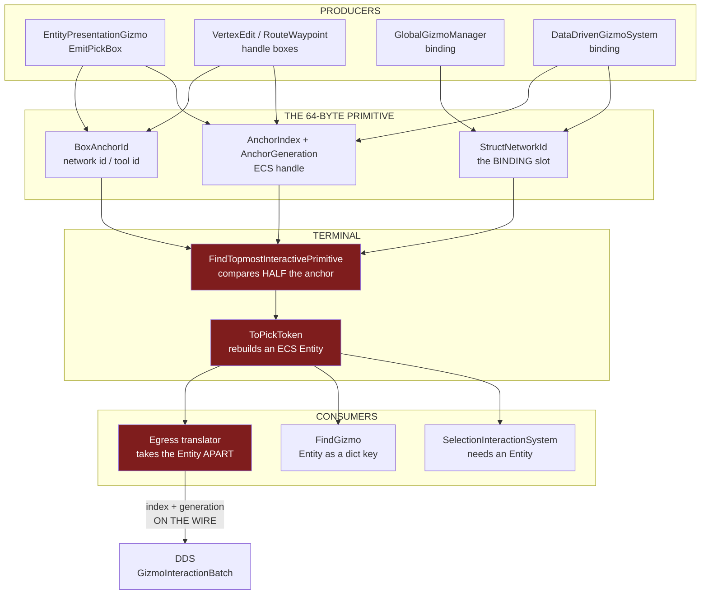
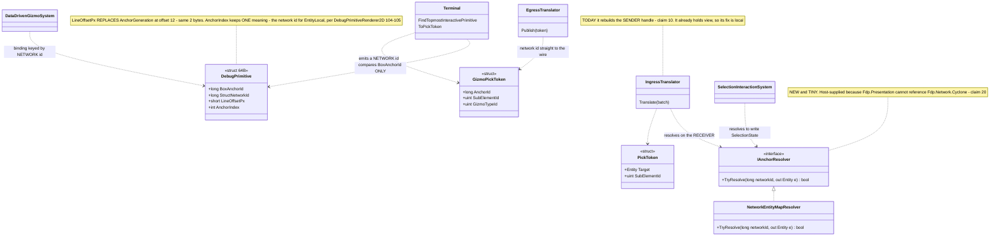
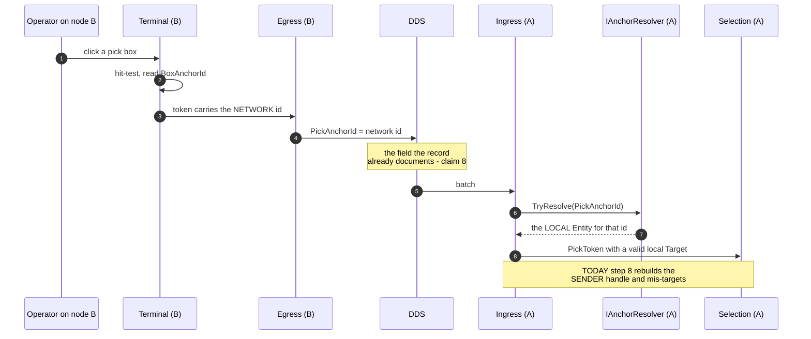

<!--STATUS
state: LIVE
build-state: READY-TO-BUILD (S1..S7 in §6; nothing here is built)
updated: 2026-09-10
current-answer: §2 is the CLAIM LEDGER — every load-bearing claim with its file:line proof and HOW it was
  measured. §3 is AS-IS, §4 the two defects, §5 the target state with the UML, §6 the build order,
  §7 the constraints, §8 what is NOT verified, §9 the retraction log.
  ⭐ Read §2 first. This design was reached through ~8 corrections in one session (§9), so a claim without
  a proof row in §2 is NOT a claim of this document.
design-basis: docs/blueprints/Blueprint_Issues_Tracker.md CE-259x (the exclusive-filter leak) and CE-259h
  (the pick token's network-stable contract) - docs/UX/UX_Feature_Tool_Model.md §4.7g (the entity
  hit-test) - the field contracts in FDP/ExtDeps/GizmoMap/GizmoMap.Contracts/Primitives/DebugPrimitive.cs
  which are the authority for what each slot means.
known-rot: none. §9 lists what was retracted while reaching this state, so nobody re-derives a dead branch.
known-conflict: none. ⚠ FDP/Engine/Fdp.Presentation/Vis2D/Layers/DebugGizmoLayer.cs:271-285 and
  Hrot/Network/Hrot.Network.NED/Gizmos/GizmoInteractionIngressTranslator.cs:56 CONTRADICT the field
  contracts they consume; that is the subject of this design, not an unreconciled disagreement.
-->
# ⭐⭐⭐ Gizmo Anchor Identity — **one id, and it is the network id**

> 🔒 **User, `2026-09-10`, verbatim:** *"why are we mixing ECS entity id and network entity id when we can
> use netwok ALL THE TIME and EVERYWHERE in gizmos"* · *"passing index+generation is overkill if we have
> unique networkId for any entity. It does not make sense at all."*

⭐⭐ **The whole design in one line:** the gizmo layer identifies an anchor by its **network id** only. The
ECS handle (`AnchorIndex` + `AnchorGeneration`) stops being an identity — it is not compared, not routed
and not put on the wire.

⛔⛔ **This is a CONFORMANCE FIX, not a new contract.** Both ends already specify the network id in their
own comments (§2 rows ⑦ and ⑧); the code violates them.

---

## 1. INVENTORY

⭐ Graph first, grep to confirm the sites — 🔒 the rule this design broke and then repaired (§9 ⑧).

| # | query | total | note |
|---|---|---|---|
| ① | `search_graph name_pattern=".*Gizmo$" label="Class"` | **56**, `has_more: false` | ⭐⭐ **the enumeration that caught 5 emitters a hand-picked grep list had missed** — §2 row ⑯ |
| ② | sweep of all 56 for `EmitRaw\|MakeBox2D\|MakeSphere\|DrawContextMenuBinding` | **13 files** | §2 row ⑯ |
| ③ | `check_index_coverage` over the 7 files this design edits | `index_mode: full` · `recording_status: complete` · all **`no_recorded_issue` / `metadata_match`** | ⚠ `signal: best_effort` — never proof of completeness |
| ④ | grep for test files touching `PickAnchorId\|Token.Target\|ToPickToken\|AnchorGeneration` | **11 files** | §2 row ⑮ — the migration surface |

---

## 2. ⭐⭐⭐ THE CLAIM LEDGER — **every load-bearing claim, with its proof**

> 🔒 **Why this section exists** *(user, `2026-09-10`)*: *"provide a proof of every claim. too many flips in
> the last 15 minutes."* ⇒ ⛔ **a claim not in this table is not a claim of this document.**
> ⭐ `read` = I opened those lines this session. `graph` = codebase-memory enumeration. `grep` = text only.

| # | claim | proof | how |
|---|---|---|---|
| ① | `AnchorIndex` is the ECS entity index, and **must not** be used for handle validity | `DebugPrimitive.cs:31-33` — *"Never use AnchorIndex to evaluate handle validity; evaluate AnchorGeneration instead"* | read |
| ② | `AnchorGeneration` is the ECS generation; **0 ⇒ null/uninitialised** | `DebugPrimitive.cs:37` | read |
| ③ | `BoxAnchorId` is authoritative **when `AnchorGeneration == 0`**, and **ignored when `!= 0`**, where the terminal routes `AnchorIndex` | `DebugPrimitive.cs:62-67` | read |
| ④ | `AnchorIndex` **overlays** `StringHash` at offset 8, discriminated by `Space`/`Shape` | `DebugPrimitive.cs:8-11`, `:27-35` | read |
| ⑤ | `AnchorGeneration` **also carries the signed screen-pixel line offset** for Text | `DebugPrimitiveBuffer.cs:202-204` *(write)* · `DebugPrimitiveRenderer2D.cs:345`,`:360` *(read)* · documented `DebugPrimitive.cs:320` | read |
| ⑤b | that Text use is **live in production**, 4 sites | `EntityEditorLabelGizmo.cs:57` `-16f` · `:77` `-30f` · `:82` `-30f` · `:96` `-44f`; its own note at `:51` says the spacing *"is applied via lineOffsetPx (carried in AnchorGeneration)"* | read |
| ⑥ | after the ECS role is removed, offset 12 has **exactly one** live use | every reference is the ECS role, the declaration, or ⑤ — enumerated | grep |
| ⑦ | 🔒 **the in-process token already specifies a network id** | `GizmoPickToken.cs:8` — `AnchorId` *"NetworkId / semantic object id (0 = invalid)"*; `:10` `StreamId` *"publisher stream discriminator"* | read |
| ⑧ | 🔒 **the DDS record already specifies a network id** | `GizmoInteractionBatch.cs:21` — *"PickToken fields (**blittable breakdown of stable network ID** + SubElementId)"* over `long PickAnchorId; uint PickSubElementId; uint PickStreamId;` | read |
| ⑨ | 🔴 **the local boundary violates ⑦** — it rebuilds an ECS handle | `Fdp.Presentation/Vis2D/Layers/DebugGizmoLayer.cs:271-285` — `Target = new Entity((int)token.AnchorId, (ushort)token.StreamId)` | read |
| ⑩ | 🔴 **the remote boundary violates ⑧** — it rebuilds a LOCAL entity from the SENDER's handle | `GizmoInteractionIngressTranslator.cs:56` — `new Entity((int)batch.PickAnchorId, (ushort)batch.PickStreamId)`; the `IsAlive` check at `:66` **masks** the mismatch | read |
| ⑪ | 🔴 the egress **disassembles** the entity onto the wire | `GizmoInteractionEgressTranslator.cs:81-82` — `PickAnchorId = token.Target.Index`, `PickStreamId = (uint)token.Target.Generation` | read |
| ⑫ | the exclusive filter compares **half** an anchor — value, never generation | `GizmoMap.Presentation/Layers/DebugGizmoLayer.cs:490-491`: `anchorId` is derived *using* the generation, then only `anchorId != exclusiveAnchorId.Value` is tested | read |
| ⑫b | the binding's anchor arrives in a **different slot** and so is outside ③'s rule | `DebugPrimitive.cs:344-352` — `MakeInputCaptureBinding` writes **`StructNetworkId`** (offset 24), never `BoxAnchorId` (offset 44); the scan reads it at `DebugGizmoLayer.cs:132` | read |
| ⑬ | the two arbiters key their bindings **differently** | `GlobalGizmoManager.cs:212-216` → `networkId: kvp.Key` *(a TOOL id)*, **no generation stamp**; `DataDrivenGizmoSystem.cs:384-388`,`:426-430`,`:459-461` → `networkId: (long)entity.Index` **plus** `binding.AnchorGeneration = entity.Generation` | read |
| ⑬b | tool ids and ECS indices occupy **the same small-integer range** | `GlobalGizmoManager.cs:27` `_nextId = 0`, `:63` `NewId() => Interlocked.Increment(ref _nextId)` ⇒ 1, 2, 3… | read |
| ⑭ | only **two** of four `Token.Target` consumers genuinely need an `Entity` | ✅ `SelectionInteractionSystem.cs:63` *(writes `SelectionState`)* · ✅ `DataDrivenGizmoSystem.cs:497`,`:575` `FindGizmo` *(a **dictionary key** — `:77` `Dictionary<Entity, IEntityStatefulGizmo>`, used at `:92`/`:103`/`:108`/`:115`)* · ⛔ `GizmoInteractionEgressTranslator.cs:81-82` and ⛔ `DataDrivenGizmoSystem.cs:581-583` **take it apart again** | read |
| ⑮ | 🔴 **the WRONG semantics are RAILED** — a green test asserts the sender's ECS index goes on the wire | `Hrot.Network.NED.Tests/GizmoInteractionTranslatorTests.cs:89` `Assert.Equal((uint)entity.Index, record.PickAnchorId)`; `:106-107`, `:141-142`, `:173-174` feed `PickAnchorId = (uint)index`, `PickStreamId = gen`; `:122` asserts `Token.Target` | read |
| ⑯ | the anchored-primitive emitters are **13 files, not the 3 a name list suggested** | graph ① + sweep ②; the 5 missed are `TuningConsoleGizmo:60` *(`MakeStructInspector`)* · `LayerControlGizmo:105` *(layer mask)* · `ContextMenuProjectorGizmo:129` and `CanvasContextMenuGizmo:29` *(`ContextMenuBinding`)* · `RubberBandGizmo:43-52` *(`Box2D` from `default`, **no anchor set**)* | graph + read |
| ⑯b | ⇒ none of the 5 reaches the exclusive comparison | only `Box2D`/`Sphere` are hit-tested *(`DebugGizmoLayer.cs:496`,`:502`)*; binding shapes are skipped at `:481`; an all-zero anchor is skipped at `:483` | read |
| ⑰ | **every interactive entity has a non-zero network id by construction** | `EntityPresentationGizmo.cs:19`,`:37` — `[GizmoProjector(typeof(SimTransform), typeof(NetworkIdentity))]`, *"the query is `SimTransform` + `NetworkIdentity` and nothing else"* ⇒ no `NetworkIdentity`, no pick box | read |
| ⑰b | …and `EmitPickBox` stamps all three fields | `EntityPresentationGizmoShared.cs:21-33` — `entity.Index`, `entity.Generation`, `networkId` | read |
| ⑱ | a tool **handle** can still carry id 0 | `ScenarioToolRegistrations.cs:204-207` — `NetworkIdOf` returns `0L` when `NetworkIdentity` is absent | read |
| ⑲ | the network→entity map exists and is **O(1)** | `NetworkEntityMap.cs:9` `ConcurrentDictionary<long, Entity>`, `:11` `Register`; populated at `NetworkSpawningSystem.cs:198`, which also stamps `NetworkIdentity` at `:138` | read |
| ⑲b | ⛔ the *other* resolver is a **linear scan** — do not use it | `NetworkIdResolver.cs:67-72` `FindEntityByNetworkId` iterates `repo.Query().With<NetworkIdentity>()` | read |
| ⑳ | `Fdp.Presentation` **cannot** reference the map's assembly | `Fdp.Presentation.csproj` references `GizmoMap.Presentation` · `Fdp.Toolkits` · StructEdit ×2 · `NodeEditor.Core` — **no `Fdp.Network.Cyclone`** | read |
| ⑳b | …and 2 of 5 hosts pass **no world** to the adapter | `CgfSubsystem.cs:1425` and `ReplayBrowserSubsystem.cs:251` use the **3-arg** overload; the richer overloads are `Fdp.Presentation/…/DebugGizmoLayer.cs:37-72` | read |
| ㉑ | `AnchorIndex` is **already** a network id in the renderer | `DebugPrimitiveRenderer2D.cs:104-105` — *"Resolve against SpatialAnchor cache keyed by **AnchorIndex (used as network ID)**"*; matched by `IDebugDrawBuilder.cs:120` and `DebugPrimitiveBuffer.cs:370` *(`SemanticShape`)* | read |
| ㉒ | **nothing structural changes on the wire** | `GizmoInteractionBatch.cs:16-25` — field set, `long`/`uint`/`uint` types, `[DdsKey] SourceNodeId, SequenceNumber` and `[DdsQos]` all unchanged; `DebugPrimitive` stays `[StructLayout(Explicit, Size = 64)]` with **no field added, removed or moved** | read |

---

## 3. AS-IS — **two identity domains in one field set**

⭐ **Read the red boxes:** the terminal compares half an anchor (§2 ⑫), rebuilds a handle the contract does
not ask for (⑨), and the egress then puts a **process-local** handle on the wire (⑪).

---

## 4. THE TWO DEFECTS

| | defect | proof |
|---|---|---|
| **D1** *(local, operator-visible)* | a click **leaks past an exclusive tool** to whichever entity's ECS index equals the active tool's id ⇒ the entity drags and gets selected | §2 ⑫ + ⑫b + ⑬ + ⑬b. 🔴 Operator, `2026-09-10`: *"when picking entity and left clicking it and dragging, the entity got dragged … also the dragged entity got selected"* |
| **D2** *(remote, silent)* | a gizmo interaction that crosses DDS targets a **wrong or dead entity** on the receiver | §2 ⑩ + ⑪. ⚠ Masked by the `IsAlive` check at `:66`, and ⑮ shows a **green rail asserts the broken behaviour** |

⛔ **D1 is not a regression from `CE-259r`/`§4.7i`** — every cited producer and the filter predate them.

---

## 5. TARGET STATE

### 5.1 The rule

> ⭐⭐⭐ **An anchor is identified by its NETWORK ID.** The ECS handle may travel as an optional local
> payload, but ⛔ **it is never compared, never routed and never authoritative** — and after S5 it is not
> stamped for interaction at all.

### 5.2 Classes

### 5.3 Sequence — a remote pick, which is `D2`

---

## 6. ⭐⭐ BUILD ORDER — **each step with its proof and its rail**

| # | step | rests on | rail |
|---|---|---|---|
| **S0** | ⭐ **independent, ship first — close `D1`.** In `FindTopmostInteractivePrimitive`, compare the **whole** anchor: skip unless `anchorId` **and** `prim.AnchorGeneration` both match the binding's *(the binding's generation is already read at `DebugGizmoLayer.cs:137`)* | ⑫ ⑫b ⑬ ⑬b | a tool id `3` + an entity at ECS index `3` must **not** leak *(red-proof on today's code)*; that entity's real anchor must still resolve. ⛔ Needs a `PickTopmostEntityAnchor`-style public overload — the precedent `CE-259p` set |
| **S1** | 🔴 **the receiver stops trusting the sender's handle.** `IAnchorResolver` + `NetworkEntityMapResolver`; `GizmoInteractionIngressTranslator` resolves by network id | ⑩ ⑲ | a batch whose `PickAnchorId` is a network id **not** present locally yields **no** event *(today it yields a wrong entity)* |
| **S2** | **the egress stops disassembling.** Write the network id, not `Target.Index`/`Generation` | ⑪ ⑦ ⑧ | round-trip: egress→ingress on **two different index layouts** resolves the **same** entity. ⚠ **`GizmoInteractionTranslatorTests` must be rewritten here** — ⑮ |
| **S3** | **the terminal returns a network id.** `ToPickToken` stops rebuilding an `Entity` | ⑨ ⑦ | the token's `AnchorId` equals the picked primitive's `BoxAnchorId` |
| **S4** | **the two genuine consumers resolve locally.** `SelectionInteractionSystem` via the resolver; `FindGizmo` re-keyed by network id *(5 sites, `DataDrivenGizmoSystem.cs:77`/`:92`/`:103`/`:108`/`:115`)* | ⑭ ⑲ ⑳ ⑳b | selecting by network id sets `SelectionState` on the right entity; a tool armed on entity X is found by X's network id |
| **S5** | **stop stamping the ECS handle for interaction** — the 3 handle emitters and the 3 bindings; the comparison collapses to `BoxAnchorId` and **S0's generation term is deleted** | ⑬ ⑯ ⑯b ⑰ | the exclusive filter admits only same-network-id primitives; §4.7i's suspended-handle rails stay green |
| **S6** | **rename the freed slot** — `[FieldOffset(12)] public short LineOffsetPx`, deleting the two casts *(`unchecked((ushort)(short)…)` on write, `(short)…` on read)* | ⑤ ⑤b ⑥ ㉒ | the editor's 3-line entity label still stacks at `-16/-30/-44` px |
| **S7** | **`AnchorIndex` keeps one meaning** — the network id, matching the renderer that already reads it that way | ㉑ | `EntityLocal` primitives still resolve against the `SpatialAnchor` cache |

⭐ **S0 is shippable alone.** ⛔ **S1+S2 must land together** *(they are the two ends of one hop)*.
⭐ S3→S4 then S5→S7.

---

## 7. CONSTRAINTS

| # | constraint | why |
|---|---|---|
| **C1** | ⛔ **the 64-byte layout must not move** | it is a DDS-marshalled struct *(㉒)*; S6 is a rename of the same 2 bytes, not a resize |
| **C2** | ⭐ **id 0 cannot reach the comparison for an ENTITY** | ⑰ — no `NetworkIdentity`, no pick box |
| **C3** | ⚠ **but a tool HANDLE can carry 0** *(⑱)* ⇒ **assert non-zero at the arm site**, ⛔ do not keep a fallback for a case ⑰ makes unreachable |
| **C4** | ⭐ the resolver is **host-supplied**, not referenced | ⑳ — and CGF/ReplayBrowser must start passing it *(⑳b)*; they have worlds, so this is unwired, not blocked |
| **C5** | ⛔ **never `FindEntityByNetworkId`** | ⑲b — linear scan; use the map |
| **C6** | ⚠ **a mixed-version cluster** disagrees on the value's meaning mid-upgrade — ⛔ **not a regression**, because ⑩ means those nodes already mis-target, and ㉒ means nothing fails to parse |

---

## 8. ⛔ WHAT IS **NOT** VERIFIED — **read before trusting a step**

| # | not verified | which step it bears on |
|---|---|---|
| **U1** | whether **CGF/ReplayBrowser** actually need the resolver *(do their gizmos hit-test entity-anchored primitives at all?)* | S4's wiring scope |
| **U2** | the **full contents** of the other 10 test files in ①④ — only `GizmoInteractionTranslatorTests` was read | S2's migration cost |
| **U3** | whether any **non-Hrot** consumer *(`GizmoMap.Viewer`, `GizmoMap.Example`)* depends on the index semantics | S3 |
| **U4** | whether `SelectionInteractionSystem` does anything with the entity **beyond** writing `SelectionState` | S4 |
| **U5** | ⚠ `check_index_coverage` is `best_effort` — ⛔ **not proof** that ①/② enumerated everything | ⑯'s completeness |

---

## 9. ⛔ RETRACTION LOG — **what was proposed and withdrawn on `2026-09-10`**

⭐ Kept so nobody re-derives a dead branch. 🔒 The user's own summary: *"too many flips in the last 15 minutes."*

| # | proposed | withdrawn because |
|---|---|---|
| ① | a frame-end marker + a 256 KB buffer | the buffer was **empty**, not partly filled — an ordering bug *(`CE-259r`)* |
| ② | swap `stateless` past `dataDriven` | the picker is on the **Global** arbiter, which still ran first — `stateless` must be **first** |
| ③ | *"undocumented multiplexing on a third axis"* | **documented** at `DebugPrimitive.cs:8-11` |
| ④ | *"`AnchorGeneration` is overloaded so it cannot be a domain tag"* | true in general, **false in the two positions the filter reads it** |
| ⑤ | *"compare `BoxAnchorId`"* as the immediate fix | ③ says that field is **ignored** when `AnchorGeneration != 0` — contract-violating |
| ⑥ | a **domain gate** *(`AnchorGeneration != 0` as a category)* | invented a concept; the real bug is comparing **half an identity** ⇒ compare both fields |
| ⑦ | *"a resolver is not viable"* | conflated *cannot reference the class* with *cannot have the capability* ⇒ ⑳/C4 |
| ⑧ | *"only 3 gizmos emit anchored primitives"* | grep over a **hand-picked list**; the graph found **13 files** ⇒ ⑯ |
| ⑨ | an **alias pair** at offset 12 | the offset-8 analogy needs **two live uses**; offset 12 will have one ⇒ a plain **rename** |
| ⑩ | *"it changes a wire contract"* | ⑧/㉒ — **it does not**; the record already documents a network id |
