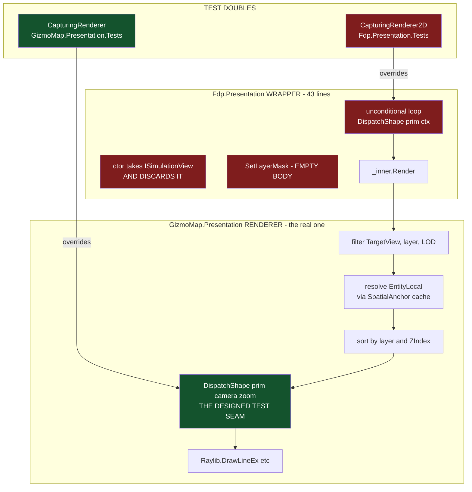
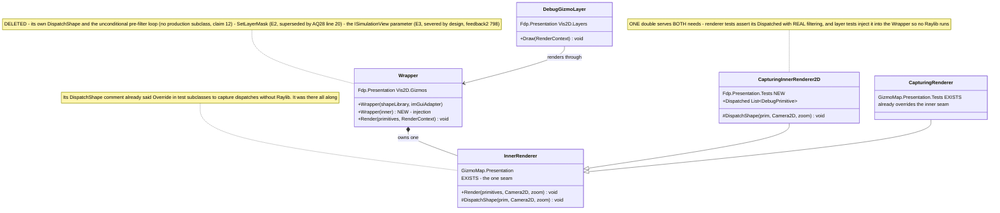
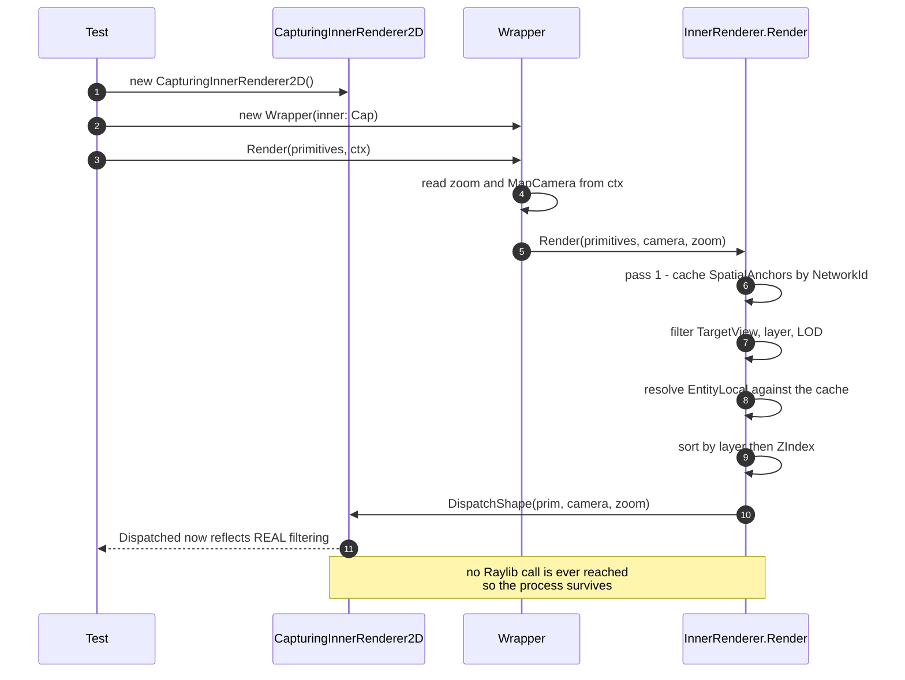

<!--STATUS
state: LIVE
build-state: BUILT (R0..R4, 2026-09-10, commit 05cdfa2e — see §6.1 for the AS-BUILT)
updated: 2026-09-10
current-answer: ⭐⭐⭐ §6.1 is the AS-BUILT and the RESULT. Then §2, the CLAIM LEDGER — every
  load-bearing claim with its file:line proof and how it was measured. §3 AS-IS-BEFORE, §4 the three
  defects, §5 the target with the UML, §6 the build order, §7 the constraints, §8 what is NOT verified.
  ⭐ The one-line answer: there were TWO `DispatchShape` seams for one concept. The GREEN suite used the
  real one; the CRASHING suite used a duplicate the wrapper invented. The duplicate is gone.
  📐 THE RESULT, in one number: `Fdp.Presentation.Tests` now reports **544** tests
  (535 passed / 8 failed / 1 skipped). It reported ~90 and then died. ~450 had never executed.
design-basis: 🔒 docs/UX/Architect_Question_28_Map_Layers.md:20 rules the `LayerControlMask` primitive
  "the only filter that reaches drawn primitives" and authoritative per frame — that settles the layer
  half. 🔒 .dev/_DONE/gizmos-1/feedback2.md:742-798 and :871 are the IMPLEMENTED intent for
  `EntityLocal`: the SpatialAnchor two-pass "completely severs the presentation layer's reliance on the
  heavy simulation ECS (like SimTransform or NetworkEntityMap)" and "Eradicating Entity". That settles
  the ISimulationView half — the dropped view is the DESIGNED END STATE, not a defect.
  Owning rows: docs/blueprints/Blueprint_Issues_Tracker.md CE-259aa (the SIGSEGV) and CE-259y (whose
  premise this design REFUTES).
known-rot: none.
known-conflict: ⚠ CE-259y's own row says the dropped `ISimulationView` makes the EntityLocal path inert.
  §2 rows ⑤–⑧ refute that. The row is corrected by this design, not reconciled with it.
-->
# ⭐⭐⭐ Gizmo Renderer Seam — **two `DispatchShape` seams, and the crashing suite picked the duplicate**

⭐⭐ **The whole design in one line:** `Fdp.Presentation`'s renderer wrapper invented a **second**
`DispatchShape` hook that fires *before* the real renderer runs. Tests that override it capture
**unfiltered** primitives **and** still let Raylib draw — so they are simultaneously **vacuous and
crashing**. The correct seam already exists one layer down, and the suite that uses it is green.

⛔⛔ **This is the seam law again, measured for the fourth time this programme** *(`CE-259p`: two entity
hit-tests, the picker used the dead one · `SC-GZ067-1`: a rail re-implementing production · `CE-259ab`: a
hard cast on the draw-builder seam · this)*.

---

## 1. INVENTORY

⭐ Graph first, grep to confirm the sites.

| # | query | total | note |
|---|---|---|---|
| ① | `search_graph name_pattern=".*DrawBuilder.*" label="Class"` | **7**, `has_more: false` | all test stubs bar `GizmoMap.Example` ⇒ fed `CE-259ab`'s lean |
| ② | `find DebugPrimitiveRenderer2D.cs` | **2 files** | `GizmoMap.Presentation/Rendering/` *(the real renderer, 550+ lines)* and `Fdp.Presentation/Vis2D/Gizmos/` *(a **43-line wrapper**)* |
| ③ | grep `": DebugPrimitiveRenderer2D"` + `"override void DispatchShape"` | **4 subclasses** | 1 in `GizmoMap.Presentation.Tests` *(the inner seam — **green**)*, 3 in `Fdp.Presentation.Tests` *(the wrapper seam — **crashing**)* |
| ④ | grep `"new …Vis2D.Gizmos.DebugPrimitiveRenderer2D("` | **3 production sites**, all in `Fdp.Presentation/Vis2D/Layers/DebugGizmoLayer.cs` `:32`,`:51`,`:71` | ⛔ **zero production subclasses** ⇒ the wrapper's hook has no production purpose |
| ⑤ | grep `SetLayerMask` | **4 sites** | 1 declaration *(a no-op)*, 1 **live production caller**, 2 rails |
| ⑥ | grep `MakeSpatialAnchor\|DrawSpatialAnchor` | **production producers exist** | `EntityPresentationGizmo.cs:95` → `EntityPresentationGizmoShared.cs:18`; also `DebugApiService.cs:1609` |
| ⑦ | `[Fact]`/`[Theory]` count over the 4 affected test files | **30 tests** | the re-homing surface: 18 + 4 + 4 + 4 |

---

## 2. ⭐⭐⭐ THE CLAIM LEDGER — **every load-bearing claim, with its proof**

⭐ `read` = opened those lines. `graph` = codebase-memory enumeration. `run` = executed and observed.

| # | claim | code — how it IS | design basis — how it was MEANT to be | how |
|---|---|---|---|---|
| ① | ⭐⭐⭐ **the real renderer ALREADY has a Raylib-free test seam** | `GizmoMap.Presentation/Rendering/DebugPrimitiveRenderer2D.cs:193-195` — `protected virtual void DispatchShape(in DebugPrimitive, Camera2D, float)`, its own comment: *"Override in test subclasses to capture dispatches **without Raylib**"* | ✅ the type header `:20` says the same | read |
| ② | 🔴 **the wrapper invented a SECOND hook, on the wrong side** | `Fdp.Presentation/Vis2D/Gizmos/DebugPrimitiveRenderer2D.cs:39` — `protected virtual void DispatchShape(in DebugPrimitive, RenderContext)`, called from an **unconditional** loop at `:31-34`, **before** `_inner.Render(...)` at `:36` | ⛔ **searched `docs/` and `.dev/`, no design record for the wrapper's hook** | read |
| ③ | ⇒ a subclass of the WRAPPER sees primitives **before any filtering, sorting or `EntityLocal` resolution**, and Raylib still runs | the loop at `:31-34` has no `TargetView`, layer, LOD or `Space` test; the inner renderer does all of it at `:90-106` | — | read |
| ④ | 🔴🔴 **MEASURED, not inferred: those rails are BOTH vacuous AND crashing** | `SC_GZ011_1_TargetView_None_Skipped` **THROWS `Assert.Equal 0 vs 1`** — the "skipped" primitive is captured anyway; `SC_GZ011_2`, `SC_GZ011_3`, `SC_GZ011_6` exit **139 (SIGSEGV)** inside Raylib. Driven outside the test host with a reflection loader, so the numbers are the process's own | — | run |
| ④b | ⇒ **that is `CE-259aa`'s root cause.** ~90 of ~185 tests report, then the first primitive that actually reaches a draw call kills the host | the surviving 90 are the ones the inner renderer filtered out before any `Raylib.` call | — | run |
| ⑤ | ⭐⭐ **the `EntityLocal` path is NOT inert — the SpatialAnchor mechanism is BUILT and has production producers** | `EntityPresentationGizmo.cs:95` → `EntityPresentationGizmoShared.cs:18` `draw.DrawSpatialAnchor(networkId, …)`; the renderer caches at `:63` `anchors[prim.NetworkId]` and resolves at `:102-106` | ✅ `.dev/_DONE/gizmos-1/feedback2.md:742-752` — *"the system … automatically **prepends exactly one SpatialAnchor** primitive … for that NetworkId"*; `:798` the two-pass algorithm | read |
| ⑥ | ⭐⭐⭐ **the presentation tier is DESIGNED to need no `ISimulationView`** | the wrapper drops it; the inner renderer never asks for one | 🔒 `feedback2.md:798` — *"**Completely severs** the presentation layer's reliance on the heavy simulation ECS (like `SimTransform` **or `NetworkEntityMap`**)"*; `:871` — *"**Eradicating `Entity`**: the `DebugPrimitive` struct and `PickToken` must be refactored to use `long NetworkId`"* | read |
| ⑥b | ⇒ 🔴🔴 **`CE-259y`'s premise is REFUTED.** The dropped view is the **designed end state**, not a defect | — | ⭐ and the record shows a THREE-STEP evolution: `design-talk.md:2778-2791` an `Entity Anchor` field → `feedback2.md:479` *"must **stop casting raw network integers into local Entity handles**"*, use `NetworkEntityMap` → `:742-798` sever the ECS entirely. **Each supersedes the last** | read |
| ⑦ | ⚠ **but a production caller PASSES the view it discards** | `Fdp.Presentation/Vis2D/Layers/DebugGizmoLayer.cs:71` — `new …DebugPrimitiveRenderer2D(view, shapeLibrary, imGuiAdapter)` | ⇒ the **SILENT-DEFAULT pattern inverted**: the caller supplies a dependency the callee throws away. ⭐ That parameter is what generated `CE-259y` | read |
| ⑧ | 🔴 **the 7 `EntityLocal` rails encode the RETIRED mechanism** | `DebugPrimitiveRenderer2DTests.cs:178-206` builds an `EntityRepository`, stamps `AnchorIndex`/`AnchorGeneration` as an **ECS handle** and expects `SimTransform` resolution; `:211-238` expects `IsAlive`-based skipping | ⛔ superseded by ⑤/⑥ — no live code resolves `SimTransform` for `EntityLocal` | read |
| ⑨ | 🔴 **`SetLayerMask` is a NO-OP with a LIVE production caller** | `Fdp.Presentation/Vis2D/Gizmos/DebugPrimitiveRenderer2D.cs:23` — `public void SetLayerMask(ushort mask) { }`; called **every frame** at `Vis2D/Layers/DebugGizmoLayer.cs:100` with `(ushort)ctx.VisibleLayersMask` | — | read |
| ⑩ | ⭐⭐⭐ **…and routing it would be WRONG, by ruling.** The authoritative filter is the `LayerControlMask` PRIMITIVE | `GizmoMap.Presentation/…Renderer2D.cs:54-55` defaults `SetAll()`, `:73-76` a `LayerControlMask` primitive overrides it, `:96` `activeLayers.IsSet(prim.DebugLayer)` applies it | 🔒 `docs/UX/Architect_Question_28_Map_Layers.md:20` — *"✅ **the only filter that reaches drawn primitives**. Default `SetAll()`; a backend `LayerControlMask` primitive **asserts authority for the frame**"*; `docs/projects/Hrot/Engine/Hrot.Common.md:683` *"(**authoritative** 256-bit mask)"*; `GizmoMap.Example.md:517-518` *"Emit `LayerControlMask` every frame. The renderer treats each frame as authoritative"* | read |
| ⑩b | ⇒ ⛔ `ctx.VisibleLayersMask` is **32 bits** against the authoritative **256**, and wiring it would create a **second authority for one fact** | — | 🔒 ruling 9 / `R-132` — a curated authority outranks a second producer for one slot | read |
| ⑪ | ⭐⭐ **the prior art for the fix is IN THE REPO AND GREEN** | `GizmoMap.Presentation.Tests/GizmoPresentationTests.cs:23-30` — `CapturingRenderer : DebugPrimitiveRenderer2D` overriding the **inner** `DispatchShape(in prim, Camera2D, float)`. That suite runs **41/41**, headless, no crash | — | read + run |
| ⑫ | the wrapper is **never subclassed in production** | ① ③ ④ — all 4 subclasses are in test projects | — | graph + grep |
| ⑬ | the re-homing surface is **30 tests in 4 files** | ⑦ | — | read |

---

## 3. AS-IS — **one concept, two seams, and the tests took the wrong one**

⭐ **Read the colours:** the green path is what the passing suite does. Every red box is either a
duplicate of something the inner renderer already owns, or a parameter that is thrown away.

---

## 4. THE THREE DEFECTS

| | defect | proof |
|---|---|---|
| **E1** *(the crash)* | a test overriding the **wrapper's** hook captures **unfiltered** primitives **and** still lets Raylib draw ⇒ the rails are **vacuous where they pass** and **SIGSEGV where a primitive reaches a draw call**. ~95 of ~185 tests in the project never run | §2 ②③④④b — `CE-259aa` |
| **E2** *(a dead seam with a live caller)* | `SetLayerMask` is an empty body called every frame with a mask that is **not** the authority | §2 ⑨⑩⑩b |
| **E3** *(a parameter that manufactures false findings)* | the wrapper takes an `ISimulationView` it discards, one production caller passes it, and that is what `CE-259y` read as *"the whole `EntityLocal` path is inert"* | §2 ⑥⑥b⑦⑧ |

⛔ **E2 and E3 are NOT the same defect and must not be collapsed** — the rule this programme already
wrote down. E3's parameter is **designed away** ⇒ delete it. E2's seam is **superseded by a ruling** ⇒
delete it. Neither is *"wire it up"*.

---

## 5. TARGET STATE

### 5.1 The rule

> ⭐⭐⭐ **ONE `DispatchShape`, and it belongs to the renderer that actually filters.** The wrapper
> composes; it does not re-implement, and it does not accept what it will not use.

### 5.2 Classes

### 5.3 Sequence — **a headless renderer rail, which is what `E1` broke**

---

## 6. ⭐⭐ BUILD ORDER — **each step with its proof and its rail**

| # | step | rests on | rail |
|---|---|---|---|
| **R0** | ⭐ **inject the inner renderer.** Add `Wrapper(GizmoMap.Presentation.DebugPrimitiveRenderer2D inner)`. ⛔ One seam, not a second hook | ① ⑪ | a wrapper built with a capturing inner renderer dispatches through it and calls **no** Raylib |
| **R1** | 🔴 **delete the wrapper's `DispatchShape` and its unconditional pre-filter loop** | ② ③ ⑫ | the renderer rails now see FILTERED primitives — `TargetView.None` really is skipped *(today it is captured, §2 ④)* |
| **R2** | 🔴 **delete `SetLayerMask` and its live caller** *(`Layers/DebugGizmoLayer.cs:100`)*. ⚠ The layer's OWN `LayerBitIndex` gate at `:95-98` **stays** — different concern | ⑨ ⑩ ⑩b | a `LayerControlMask` primitive still filters by layer; ⛔ the two `SetLayerMask` rails are re-homed onto it |
| **R3** | 🔴 **delete the wrapper's `ISimulationView` parameter**, and the `view` argument at `Layers/DebugGizmoLayer.cs:71` | ⑥ ⑥b ⑦ | the 3 production construction sites still compile and behave identically |
| **R4** | ⭐⭐ **re-home the 30 rails onto the inner seam**, and **rewrite the 7 `EntityLocal` ones to the SpatialAnchor mechanism** they were retired in favour of | ⑤ ⑧ ⑬ | `Fdp.Presentation.Tests` **runs to completion** — that is `CE-259aa` closed, and the count goes from ~90 reported to the full set |

⭐ **R0 first and alone** *(it unblocks everything)*. ⛔ **R1 must land with R4**: deleting the hook
breaks the 30 rails in the same commit that re-homes them.

### 6.1 ⭐⭐⭐ AS-BUILT — **what R4 EXPOSED is the substance, not R0–R3**

🔒 Obligation ⑤. Built `2026-09-10`, commit `05cdfa2e`.

📐 **The number that matters:** `Fdp.Presentation.Tests` **544 tests** *(535 pass · 8 fail · 1 skip)*,
from **~90 reported then abort**. ⇒ ⭐⭐ **`CE-088`'s *"54 of 185 discovered"* was an artefact of the
crash, and BOTH numbers understated the suite.** ⛔ *"The suite did not run"* is not *"the suite is
green"* — that is the transferable lesson.

| step | as written | ⭐ as built |
|---|---|---|
| **R0 · R1 · R2** | ✅ | ✅ as written |
| **R3** | delete the WRAPPER's `ISimulationView` | ⭐⭐ **also deleted from the LAYER**, which collapsed its **two byte-identical constructors into one** and stopped **four hosts** passing a world nobody reads. ⚠ Necessary, not extra: removing the parameter alone would have made `new DebugGizmoLayer(31, buf, bus)` **ambiguous** between the two |
| **R4** | *"re-home the 30 rails"* | 🔴 **the re-homing was the cheap half.** Pointing 30 vacuous rails at the real mechanism turned them into **honest failures**, and each failure was a finding — below |

#### ⭐⭐ What R4 turned up, one row per finding

| # | finding | resolution |
|---|---|---|
| ① | **7 `EntityLocal` rails encoded the RETIRED ECS mechanism** — an `EntityRepository`, an ECS handle in offset 8/12, `SimTransform` resolution, `IsAlive` skipping | ⭐ rewritten onto `SpatialAnchor` *(C4)*. ⭐⭐ Including the live equivalent of the dead-entity check: **anchor ABSENT from the frame ⇒ skipped** — because the backend stops emitting the anchor, absence *is* the liveness signal |
| ② | **7 rails in 3 classes asserted `layer.HandleInput(...)` returns `true`.** It returns **`false` by design** — `MapCanvas.cs:229-252` offers input to every layer, and the gizmo layer declines because the terminal polls the hardware *(`GridMapLayer.cs:94` declines identically)* | ⭐⭐ re-homed onto **`OnInteraction`, now `internal`** — which covers the **previously UNCOVERED** `token → PickToken` conversion, i.e. the **S3 payload path** of `DESIGN_Gizmo_Anchor_Identity.md`. ⭐ Plus `SC-GZ025-5`, which **pins the design decision** so a future *"fix"* to `HandleInput` reddens |
| ③ | 🔴🔴 **two HARD-CODED test hooks:** `TestHook_IsCaptureActive => false` and `TestHook_IsInteractionActive => false` ⇒ every `Assert.True` on them **could never pass** and every `Assert.False` was **vacuously green** | ⛔ **DELETED** *(`R-142` ③)*. ⚠ The real state is `GizmoMap.Presentation.DebugGizmoLayer._activeTool` — private, one assembly down, behind a Raylib-polling `HandleInput` ⇒ **not railable headlessly, and now SAID so.** 🔒 An admitted gap beats a constant that lets a rail claim coverage |
| ④ | 🔴 **a SECOND crash site**, revealed only once the first was fixed: `FdpApplicationTests` opens a real window and `Raylib.InitWindow` segfaults with no GL context | ⭐ new **`[RequiresDisplayFact]`** — skips only where there is no display, so the lifecycle-order rail still runs on a dev box and **never again aborts the suite.** ⭐⭐ It is also the **reusable control** for any future window test |
| ⑤ | ⛔⛔ **A CAPABILITY THE MIGRATION DROPPED: a `Line` was UNPICKABLE.** The hit-test served **`Box2D` and `Sphere` only**; the retired rails were its only record | ✅✅ **FIXED `2026-09-11`** — 🔒 **and my "accept it" lean was WRONG** *(user: "what is the issue with clickability of something as simple as a line? I do not want to accept it")*. ⭐⭐ Measuring the routes I had skipped found a **REAL BUG**: the renderer drew `Box2D` **rotated** *(`Renderer2D.cs:296`)* while the hit-test compared **axis-aligned** extents ⇒ draw and pick disagreed, latent only because nothing set a non-zero angle. ⇒ an **oriented-box** test + **`MakePickSegment`** make a line clickable with **no contract change** — a clickable line is a thin oriented box, and `Box2D` already has every field needed. 📄 `CE-259ac` · `DESIGN_Gizmo_Anchor_Identity.md` §6.4 |
| ⑥ | ⚠ **8 reds in `EntityInspectorPanel` / `EventBrowserPanel` / `PerspectiveMenu` / `WindowManagerMainToolbar`** | ⭐ **nothing to do with gizmos, and PROVEN PRE-EXISTING** — the identical 8 reproduce with all of this work stashed. ⛔ They had simply **never run.** ⇒ they belong to their own owners, not to this design |

⇒ ⭐⭐⭐ **`V2` was the right thing to have written down.** It said *"R4 makes the suite run to completion,
which is what will REVEAL them"* — and it revealed a second crash site plus 8 unrelated reds. ⛔ A
not-verified table that never pays out is decoration; this one paid.
---

## 7. CONSTRAINTS

| # | constraint | why |
|---|---|---|
| **C1** | ⛔ **no second authority for the layer mask** | ⑩b — ruling 9 / `R-132`. `LayerControlMask` is it |
| **C2** | ⛔ **the presentation tier gains no ECS dependency** | ⑥ — `feedback2.md:798` severed it deliberately; re-adding a view to "fix" a test is the wrong direction |
| **C3** | ⭐ **one test double, not two** | ⑪ — `GizmoMap.Presentation.Tests` already proves the shape works; a second double is how this started |
| **C4** | ⚠ **a rewritten `EntityLocal` rail must emit a `SpatialAnchor`**, not an ECS handle | ⑤ ⑧ — otherwise it rails the retired mechanism again |

---

## 8. ⛔ WHAT IS **NOT** VERIFIED

| # | not verified | bears on |
|---|---|---|
| **V1** | ✅ **ANSWERED `2026-09-10`** — it is Raylib-without-GL. Two independent sites confirmed it: a draw call reached through the renderer *(fixed by R0–R4)* and `Raylib.InitWindow` in `FdpApplicationTests` *(fixed by `[RequiresDisplayFact]`)*. ⚠ Still **not** proven that no other `Raylib.` call faults *with* a context | ✅ closed |
| **V2** | ✅✅ **ANSWERED, AND IT PAID** — exactly **one** more *(`FdpApplicationTests`)*, plus **8 non-Raylib reds that had never run**. ⭐ The suite now completes at **544** tests. ⚠ New caveat: a NEW window-touching test can re-break this ⇒ use `[RequiresDisplayFact]` | ✅ closed |
| **V3** | ⚠ **PARTLY ANSWERED, and the expectation was WRONG.** Two things the inner seam genuinely cannot see turned up: the **capture/interaction state** *(private, one assembly down — §6.1 ③)* and **`Line` hit-testing** *(never implemented there at all — §6.1 ⑤)*. ⛔ Both are now stated rather than faked | ✅ closed, with the two gaps named |
