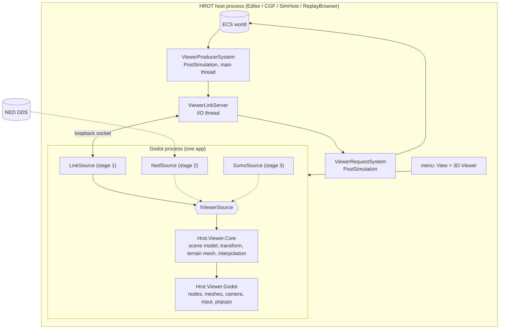
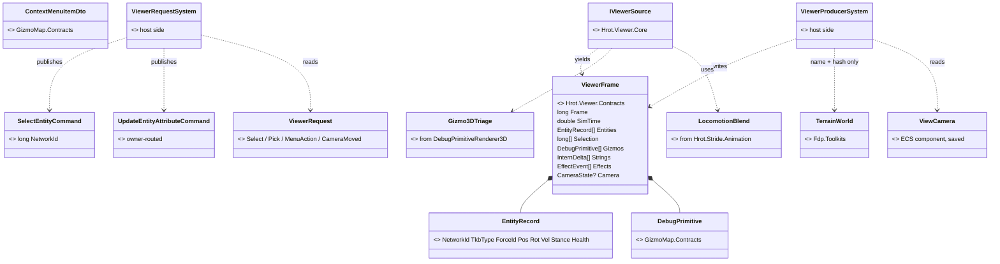
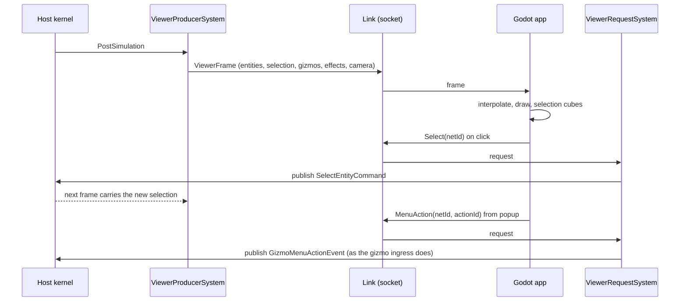
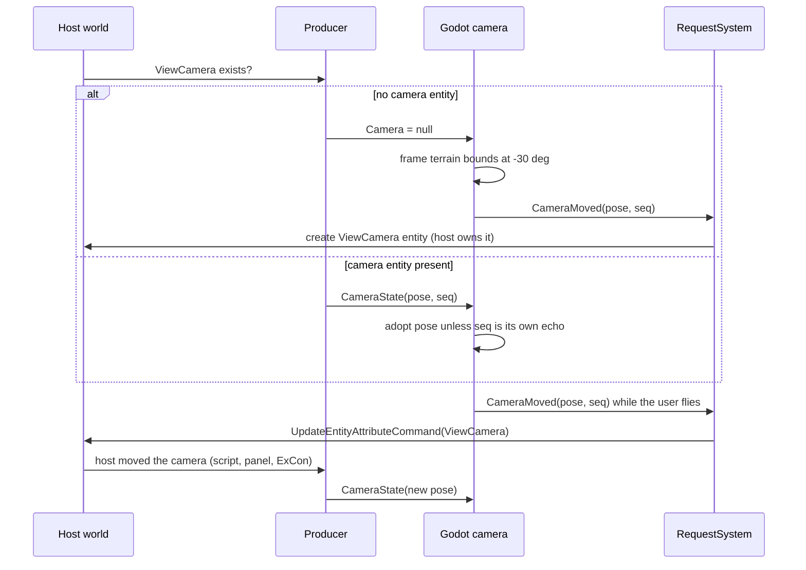

<!--STATUS
state: LIVE
build-state: DESIGN — requirements recorded, approach proposed with a lean per decision (§5), awaiting the user. Nothing built.
updated: 2026-10-10
current-answer: §1 the requirements (V-01..V-20, the user's, 2026-10-10) · §3 what already exists and is reused · §4 the
  proposed architecture (module / class / sequence diagrams) · §5 the decisions, each with a lean and its rejected
  alternatives · §6 the open questions for the user · §7 the stages.
stale-below: nothing.
known-rot: none.
known-conflict: none. ⚠ This is NOT a Stride replacement — §3.1 says why (Stride is a simulation node; this viewer
  simulates nothing). Whether Stride retires is a separate decision, §6 Q1.
related-designs:
  - DESIGN_Stride_Node_Modes.md — owns the Stride story (a 3-D SHELL around a simulating node, modes 1/2). This viewer
    reuses its §8 3-D gizmo triage and §9 locomotion blend by EXTRACTING them, and leaves its roles untouched.
  - designs/gizmos-1/DESIGN.md — owns "Evaluate Once, Present Anywhere": the dumb-terminal gizmo stream, §10 context-menu
    bindings and the MenuAction return trip. The viewer is one more dumb terminal.
  - UX/UX_Feature_Selection.md — owns UXI-11, the one selection store and its request/notification protocol. The viewer is
    one more requester (§2.7 rule 2).
  - DESIGN_Terrain_World.md — owns TerrainWorld (local metres, X east / Y north / Z up, prisms, panels, slabs) — the
    source the 3-D scene is built from.
  - DESIGN_Geo_Origin.md — owns the terrain's geo origin; needed only by the NETWORK source (NED positions are lat/lon).
  - DESIGN_Remote_Map_Control.md — owns remote commands into a host (R-134: the DDS type stops at the translator); the
    viewer's link follows the same boundary rule.
  - DESIGN_Gizmo_Anchor_Identity.md — owns network-id identity of gizmo anchors (the viewer addresses entities by it) and,
    via Architect_Question_73, "an external viewer is a remote screen of one node".
  - DESIGN_Dead_Reckoning.md — owns remote-entity smoothing; the NETWORK source inherits it (stage 2).
  - DESIGN_Node_Roles_And_Policies.md — owns roles and persistence (R-140); decides where the camera entity may be saved (§6 Q3).
-->

# DESIGN — a Godot 3-D viewer for HROT

## Headline

⭐ **A separate Godot 4 (.NET) process, launched by a menu toggle on Editor / CGF / SimHost / ReplayBrowser, fed by a
small renderer-neutral "viewer link".** The host side reads its own ECS world and pushes frames; the Godot side renders
and sends back picks, menu actions and camera moves. ⭐ The **same Godot app** later reads **NED DDS** instead of the link
(stage 2) and **SumoSharp replication** (stage 3) — only its *source* changes.

| | |
|---|---|
| what it renders | terrain (built from `TerrainWorld`), entities (models + mannequin animation), 3-D gizmos, fire/detonation effects, selection cubes, context menus |
| what it never does | physics, simulation, scenario load/save — a viewer only (V-17) |
| what it reuses | the gizmo stream + menu bindings, the selection request protocol, the owner-routed update command, `TerrainWorld`, SumoSharp City3D's split and its cloud test pipeline |
| what is new | the viewer link contract, the host-side producer, the camera entity, the Godot app |

---

## 1. REQUIREMENTS — user, `2026-10-10` (recorded as given; ids are for discussion)

| id | requirement | stage |
|---|---|---|
| **V-01** | A 3-D viewer startable from the **Editor, CGF, SimHost or ReplayBrowser** as a **menu toggle** | 1 |
| **V-02** | Builds its 3-D scene from **our terrain automatically**; may **cache** the built scene on disk if building is slow | 1 |
| **V-03** | **Animated characters** — the open-source Godot **mannequin**; optionally soldier (rifle) / civilian (no rifle) — not mandatory | 1 |
| **V-04** | Ships **open-source 3-D models**: personal car, APC, tank, helicopter, fighter jet | 1 |
| **V-05** | **Free camera** keyboard/mouse controls **as in the Unity editor** | 1 |
| **V-06** | HROT provides **entity state every frame** (position, speed, stance, … whatever is needed) | 1 |
| **V-07** | HROT provides the **gizmo stream**, rendered in 3-D as debug drawing | 1 |
| **V-08** | HROT provides **events — fires, detonations** — rendered as simple particle effects | 1 |
| **V-09** | Godot runs **in its own thread** with **its own 3-D window**, closable **without closing the host** | 1 |
| **V-10** | **Click to select** entities — selection **shared with HROT** — with a **wireframe-cube** indicator | 1 |
| **V-11** | **Entity context menu** in the 3-D window, **from the gizmo data**, same as the HROT UIs | 1 |
| **V-12** | Camera starts at a **tilted top view (~30° below horizontal) framing the whole terrain**, unless an HROT **camera entity** carries a location; **saveable to the scenario** | 1 |
| **V-13** | The **camera entity** is created and **owned by the host that created the Godot instance** | 1 |
| **V-14** | The camera entity **follows Godot's camera** when moved in Godot — through a gateway sending **state-update-request FDP bus events** | 1 |
| **V-15** | If the host moves the camera entity, **Godot follows** | 1 |
| **V-16** | Coordinates: HROT's **internal local frame** (never geodetic), adapted only to **Godot's axis/rotation conventions** | 1 |
| **V-17** | Godot is a **viewer only** — no physics, no simulation | 1 |
| **V-18** | A **gateway** feeding the viewer **either in-process from a host or from the network** (Godot as a separate app on **NED DDS**) | arch 1 · build 2 |
| **V-19** | Later: the **SumoSharp** viewer's features — SUMO road net and cars over the network, rendered **together with HROT data** | 3 |
| **V-20** | **Lightweight**, **developable by Claude in the Linux cloud** (Xvfb for tests) | all |

---

## 2. INVENTORY — measured `2026-10-10`, branch `ui` at `7cc90f685`

⚠ Graph via the MCP (`home-user-HROT`); every total corroborated with grep. `check_index_coverage` not run — no total
below is a proof of completeness.

| query | total | what it settled |
|---|---|---|
| `search_graph(name_pattern=".*Stride.*", label="Class")` | **71** | Stride is a simulation node + 3-D shell; no renderer-neutral entity seam exists (§3.1) |
| `search_graph(name_pattern=".*(Gizmo\|Selection\|ContextMenu\|Camera).*", label="Interface")` | **28** | `IGizmoTransport`, `IGizmoSource`, `IGizmoDrawBuilder`, `ISelectionState`, `IMapCameraProvider` (2-D only) |
| `search_graph(qn_pattern=".*GizmoMap\.Contracts.*")` | **490** | the BCL-only primitive contract, incl. `ContextMenuBinding`, `ContextMenuItemDto`, `SpatialAnchor` |
| `search_graph(name_pattern=".*(Camera\|Viewpoint).*", label="Class")` + grep for camera structs | **18 / 0** | ⛔ **no camera entity or component exists** — only 2-D `MapCamera` and Stride scene scripts |
| `search_graph(name_pattern=".*Selection(Request\|Changed\|…)\w*")` | **179** | the one store: `SelectionRequestSystem`, `EcsSelectionState`, `SelectionChangedNotification`, `SelectEntityCommand` |
| `search_graph(name_pattern=".*(Fire\|Detonat\|Shot\|…)…(Event\|Record\|…)$")` | **47** | `WeaponFireNotification`, `DetonationNotification`, `ShotRecord`, `DetonationRecord`, NED `WeaponFire`/`MunitionDetonation` |
| `search_code("Godot")` over the repo | **3** | passing mentions only — nothing to reuse or conflict with |
| SumoSharp `demos/City3D` (read 2026-10-10) | — | Godot 4.7.1 .NET, `CityLib` (pure C#) + `Viewer` (glue), `IReplicationSource` swap, `fetch-godot.sh`, Xvfb screenshot |

---

## 3. WHAT ALREADY EXISTS — and what each means for this viewer

### 3.1 ⛔ Stride is not a viewer — so this is not a "Stride replacement"

📐 `StrideNodeBootstrapper` provides roles **`MuscleGround | Perception | NavigationSolver`** (Bullet physics, LOS,
navmesh) — `Hrot/Subsystems/Hrot.NodeComposition/StrideNodeBootstrapper.cs:17-21`; `DESIGN_Stride_Node_Modes.md`
headline: *"Stride is not a new node type. It is a SHELL — a 3-D window and a physics/animation backend"*. Mode 1 runs
the editor **inside** the Stride exe; no HROT host launches Stride. It has **no terrain** (a flat 20 km box,
`StrideHrotGame.cs:1009`), **no 3-D context menu**, **no effects**, **no camera entity**.
⇒ A Godot **viewer** takes over Stride's *visual* job only. Stride's simulation roles are SimHost's anyway (mode 2 is
"a node replacing SimHost"). ⇒ §6 Q1.

### 3.2 The reuse table

| need | already exists | file | how the viewer uses it |
|---|---|---|---|
| debug drawing (V-07) | `DebugPrimitive` — 64-byte blittable union, BCL-only | `GizmoMap.Contracts/Primitives/DebugPrimitive.cs` | ships **raw** over the link |
| 3-D triage of gizmo shapes | `DebugPrimitiveRenderer3D` → `IDebugDrawSink3D` (Line/Arrow/Sphere/SemanticShape drawn, 2-D shapes skipped) | `Stride/Hrot.Stride.Core/DebugPrimitiveRenderer3D.cs:219-273` | ⭐ **extract** — it touches Stride only for 14 math value types |
| context menus (V-11) | `ContextMenuBinding` primitive + interned JSON (`ContextMenuItemDto`) + `MenuAction` return | gizmos-1 §10; `ContextMenuProjectorGizmo.cs:32` | the viewer draws its own popup from the JSON, returns the action id |
| selection (V-10) | `SelectEntityCommand{NetworkId}` → `SelectionRequestSystem` → `SelectionChangedNotification` (whole set) | `Hrot.Presentation/.../SelectionRequestSystem.cs` | the viewer is **one more requester** |
| camera follow (V-14) | `UpdateEntityAttributeCommand` — owner-routed, applies only on the owning node | `Hrot.Core/Network/Commands.cs`; `UpdateEntityAttributeRequestSystem` | the gateway's "state-update request" |
| terrain (V-02) | `TerrainWorld` singleton (prisms, panels w/ openings, slabs/ramps, surfaces, doors); `TerrainWorldMesh.Build` (Z-up soup, no materials) | `Fdp.Toolkits/Terrain/TerrainWorld.cs:83`, `TerrainWorldMesh.cs:31` | build Godot meshes per feature kind (materials), cache by content hash |
| locomotion blend (V-03) | `LocomotionBlend` — pure `System`, idle/walk/run by planar speed | `Stride/Hrot.Stride.Animation/LocomotionBlend.cs` | ⭐ **extract** with the gizmo triage |
| per-engine model mapping (V-04) | TKB descriptor `Stride.RenderModelDef` — *"a future 3D engine gets its own descriptor"* | `Fdp.Toolkits/Tkb/Domain/StrideRenderModelDefDto.cs:39-43` | add **`Godot.RenderModelDef`** |
| main-menu toggle (V-01) | `GlobalMenuRegistry.RegisterCheckableItem(path…)` | `Fdp.Presentation/ImGui/WindowManager/WindowManager.cs:394` | `View ▸ 3D Viewer` on every host |
| replay world (V-01) | `ReplayBrowserSubsystem.ActiveRepo` — a merged replay `EntityRepository` | `ReplayBrowserSubsystem.cs:69` | the producer reads it like a live world |
| Godot split + cloud tests (V-20) | `CityLib` + `Viewer`; `fetch-godot.sh`; `--headless` smoke; Xvfb + llvmpipe screenshot | `pjanec/SumoSharp demos/City3D`, `docs/DEMO-CITY3D-DESIGN.md` | the same split and scripts |

---

## 4. THE ARCHITECTURE

### 4.1 Modules — who runs what, and the dead edges

*What the picture shows that prose hid:* the host runs **two systems and a socket thread** and nothing else — no Godot
type ever enters a host; the Godot app has **one** render path whatever the source. Dotted = not built in stage 1.

### 4.2 Classes — existing (left, with file) vs proposed

*What it shows:* every capability except the contract, two systems, one component and the Godot app **already exists**;
`DebugPrimitive` crosses the link **unchanged**, so the 2-D map and the 3-D viewer read the same stream.

### 4.3 Sequences

**A frame, and a select + menu round trip**

**The camera entity, both ways (V-12..V-15)**

---

## 5. DECISIONS — each with a lean

### D1 · Process model — ⭐ **lean: a child PROCESS, not Godot embedded in the host**

| the lean rests on | how it IS (code / measured) | how it was MEANT (design) |
|---|---|---|
| in-process Godot from .NET is not supported officially | ✅ LibGodot landed in 4.6 for C++/others; .NET hosting is listed as a *goal* (GodotCon 2026 talk); only a third-party package (`2dog.engine`) does it, **targeting .NET 10** (HROT is .NET 8) | ⛔ searched `docs/`+`.dev/`, no design record |
| the host already owns a window + GL context on its loop | ✅ Raylib + rlImGui, one shared window (`RaylibPresentationShell.cs:34`) | ✅ `DESIGN_Stride_Node_Modes.md` runs its two windows on **one** thread (`StrideHrotGame.cs:536-550`) — it never tried two GL engines on two threads |
| network mode needs a separate app anyway (V-18) | — | ✅ the user's V-18; SumoSharp City3D tenet 3 (same render path, swap the source) |
| closing the window must not close the host (V-09) | a process gives it for free, plus crash isolation | — |

⛔ **This deviates from V-09's "own thread".** ⭐ It keeps what that requirement protects — the host never blocks, the
window is Godot's own, closing it leaves the host running — and drops the risky part.
**Rejected:** embed via LibGodot/2dog — unofficial, .NET 10, two GL engines in one process · Godot as the *outer* shell
hosting HROT (Stride mode 1's shape) — inverts V-01, the host must stay itself.

### D2 · The data contract — ⭐ **lean: a small BCL-only `Hrot.Viewer.Contracts` (`ViewerFrame` / `ViewerRequest`), gizmos carried as raw `DebugPrimitive`**

**Rejected:** entities from the gizmo stream alone (`SpatialAnchor`) — couples the 3-D scene to 2-D layer toggles, no
stance/velocity/type · NED topics as the local wire — positions are lat/lon, stance is not on IG's ingress, and the
Editor runs no NED (`NullReplicationModule`) · reading the host's ECS from Godot — impossible across a process, and
against gizmos-1's *"the presentation client knows nothing about the ECS"*.

### D3 · Local transport — ⭐ **lean: one loopback socket (TCP on `localhost`), length-prefixed binary frames**

Host writes from an I/O thread off a double buffer the producer fills; Godot reads off its own thread. Stage 1 sends a
full frame per host tick (no delta encoding) — entity counts here are hundreds, not the 15k SumoSharp ladder.
**Rejected:** DDS on localhost — the Editor would have to run NED, and container multicast is not guaranteed (SumoSharp
measured this) · shared memory — fastest, but per-OS code and no network story · named pipes — Windows/Linux APIs
differ for no gain over loopback TCP.

### D4 · Godot app structure — ⭐ **lean: City3D's split — `Hrot.Viewer.Core` (pure net8, no Godot types, unit-tested) + `Hrot.Viewer.Godot` (thin glue)**

Core owns: `IViewerSource`, the one coordinate transform (D5), interpolation between frames, the terrain mesh build,
the gizmo triage and locomotion blend (extracted, §3.2), menu JSON parsing. Godot owns: nodes, `MultiMeshInstance3D`,
`AnimationTree`, `PopupMenu`, the free camera, picking.
**Rejected:** everything in Godot scripts — untestable in the cloud without a running engine (V-20).

### D5 · Coordinates (V-16) — ⭐ **one transform, in Core**

HROT is X east, Y north, Z up, right-handed, yaw 0 = east, +90° = north (`SimComponents.cs:16`). Godot is Y up,
right-handed, camera forward = −Z.

| | HROT → Godot |
|---|---|
| position / velocity | `(x, y, z) → (x, z, −y)` |
| rotation quaternion | `(x, y, z, w) → (x, z, −y, w)` — the axis map has det = +1 (a proper rotation), so **no handedness flip** |
| yaw | HROT yaw θ about +Z **=** Godot rotation θ about +Y |

⭐ It is **the same map** SumoSharp uses for SUMO → Godot (`(x, z, −y)`), because SUMO is also x-east/y-north — V-19 shares it.
⚠ Stride's conversion (`FdpStrideTransform.cs:64-91`) is **not** a template: Stride's axis convention differs.

### D6 · Terrain scene (V-02) — ⭐ **lean: the viewer loads the terrain BY NAME with HROT's own loader, builds per-kind meshes, caches by content hash**

Every HROT node loads terrain by name (`TerrainResidency`, `DESIGN_Terrain_World.md` §5); the viewer is one more reader
of the same files — no second parser, and stage 2 works the same way. The frame carries only `TerrainName + hash`.
Cache: `<LocalAppData>/Hrot/viewer-terrain/<name>-<hash>.res` (precedent: `NavTileCache`'s folder rule).
⚠ **Load-bearing unknown:** the loader lives in `Fdp.Toolkits` (a large ECS assembly). If pulling it into the Godot
process is too heavy, the fallback is a terrain-only slice. ⭐ Measured in stage S0, before anything depends on it.
**Rejected:** streaming terrain geometry over the link — a second representation to keep in step, and a new NED topic in stage 2.

### D7 · Camera entity (V-12..V-15) — ⭐ **lean: a new `ViewCamera` component on an entity the launching host creates and owns**

Pose (HROT frame) + vertical FOV; persisted with the scenario like any component. Godot → host: `CameraMoved(pose, seq)`
→ `UpdateEntityAttributeCommand` (owner-routed, so stage 2 needs no new path). Host → Godot: the pose rides every frame;
the viewer ignores its own echo by `seq` (precedent: selection's `"Remote."` echo suppression, `UX_Feature_Selection.md`
§2.7.17). No entity ⇒ default pose framing `TerrainWorld.BoundsMin/Max` at −30°, facing north, and the entity is created
on the first camera move (so merely opening the viewer does not dirty a scenario — ⚠ a lean, §6 Q3).

### D8 · Selection, picking, context menu (V-10, V-11) — ⭐ **lean: reuse the existing protocols verbatim**

Click → Godot ray vs entity bounds (TKB dimensions) → `Select(netId)` → `SelectEntityCommand`. The selection set returns
in the next frame; Godot draws the wireframe cube. Right-click → the `ContextMenuBinding` for that `netId` in the frame's
gizmos → JSON from the frame's intern deltas → Godot `PopupMenu` → `MenuAction(netId, actionId)` → the same events
`GizmoInteractionIngressTranslator.cs:164` publishes. A ground right-click carries the ray's terrain hit as the world point.
⚠ **Pre-existing defects this exposes** (not caused here, to file): `ContextActionTriggered.EntityNetworkId` is `int`
and is filled from a `long` by a cast · *Move Here / Engage / Stop* have no registered handler.

### D9 · Gizmos in 3-D (V-07) — ⭐ **lean: extract `DebugPrimitiveRenderer3D`'s triage into a shared net8 assembly** (System.Numerics, HROT frame), used by **both** Stride and Godot, with Stride §8's per-shape **skip counters**

**Rejected:** a second interpreter written in Godot — two implementations of one concept (ruling 9).

### D10 · Models and animation (V-03, V-04) — ⭐ **lean: TKB `Godot.RenderModelDef`, mannequin driven by stance + speed**

Locomotion from the extracted `LocomotionBlend` (speed → idle/walk/run) and stance (`StanceStatus.CurrentStance`) →
an `AnimationTree` state. Rifle/no-rifle = an attachment flag on the descriptor. Vehicles static meshes; helicopter rotor
spins with speed. ⚠ Asset sourcing is its own slice with a **licence table** (CC0 / MIT / CC-BY only); candidate sources
— Godot's mannequin, Kenney and Quaternius CC0 packs — are **unverified** for tank / APC / helicopter / jet coverage.
⛔ Not `IAnimationBackend`: that is the **simulation's** animation contract (montages whose notifies drain back into the
sim) — a viewer must not own it.

### D11 · Effects (V-08) — ⭐ **lean: the producer turns `WeaponFireNotification` / `DetonationNotification` into `EffectEvent`s** (muzzle point, target point, munition type) → Godot `GPUParticles3D` one-shots. Stage 2 maps NED `WeaponFire` / `MunitionDetonation` to the same records.

---

## 6. OPEN QUESTIONS — for the user, each with a lean

| # | question | ⭐ lean | what would change it |
|---|---|---|---|
| **Q1** | Stride after this exists: keep, freeze, or retire? | ⭐ **keep untouched**; decide after stage 1 proves out. Godot does not cover Stride's physics/LOS/nav roles, and SimHost already provides them | if Stride's Bullet physics is no longer wanted at all |
| **Q2** | Accept the child-process deviation from V-09's "own thread"? | ⭐ **yes** (D1) | an official .NET 8 LibGodot path |
| **Q3** | Camera entity: one per host or per viewer window; created on open or on first move; saved from which hosts? | ⭐ one per launching host · created on first move · saved wherever that host's scenario save already saves its owned entities. ⚠ ReplayBrowser: **no entity** — the camera stays viewer-local, a replay world is not authored | if several viewers per host are wanted |
| **Q4** | Where the code lives | ⭐ `Viewer3D/` top level: `Hrot.Viewer.Contracts`, `Hrot.Viewer.Host`, `Hrot.Viewer.Core` in `HROT.sln`; the Godot project **outside** it (needs `Godot.NET.Sdk` + an engine binary to run) | — |
| **Q5** | Godot version | ⭐ **4.7.1 .NET** — what SumoSharp City3D already runs, so stage 3 shares a toolchain | — |
| **Q6** | Which host first | ⭐ **Editor** — richest selection/menu surface, offline, no cluster needed | — |

---

## 7. STAGES

| slice | delivers | proves |
|---|---|---|
| **S0** spike | fetch Godot in the cloud; Core builds the `test-town` terrain mesh; Xvfb screenshot; **measure the `Fdp.Toolkits` weight in the Godot process** (D6) | V-20 and D6's unknown, before anything depends on them |
| **S1** link + boxes | contracts; Editor producer + request system; menu toggle spawns/kills the process; entities as boxes; free camera; default camera | V-01, V-05, V-06, V-09, V-16, V-17 |
| **S2** scene | terrain meshes + cache; `Godot.RenderModelDef`; mannequin + vehicles; locomotion/stance | V-02, V-03, V-04 |
| **S3** interaction | extracted gizmo triage; selection cube; picking; context menu | V-07, V-10, V-11 |
| **S4** camera entity | `ViewCamera`, both-way sync, scenario save | V-12..V-15 |
| **S5** effects | fire / detonation particles | V-08 |
| **S6** all hosts | CGF, SimHost, ReplayBrowser | V-01 complete |
| **stage 2** | `NedSource`: lat/lon → local via the terrain origin; terrain name from the load phase; stance topics; ⚠ the missing production `StringInternEntry` publisher (menus cannot resolve remotely today) | V-18 |
| **stage 3** | `SumoSource` over SumoSharp's replication packages; road-net mesh; a shared origin between the SUMO net and the HROT terrain | V-19 |

⭐ Each slice is gated in the cloud by Core unit tests, a `godot --headless` smoke and an Xvfb screenshot (City3D's
`run-smoke.sh` / `screenshot.sh` shape). ⚠ The aesthetic check stays a human one.
