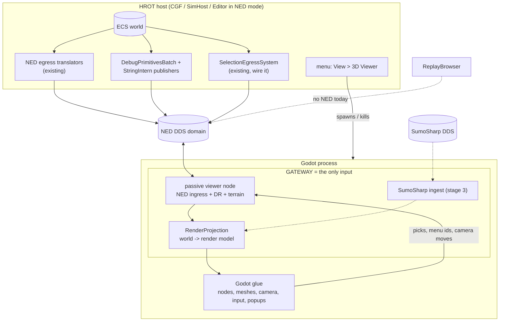
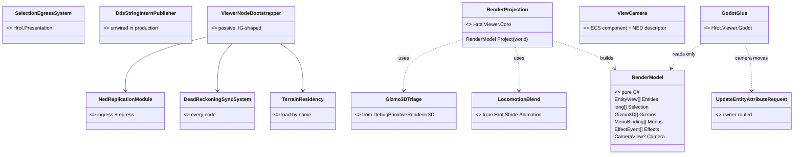
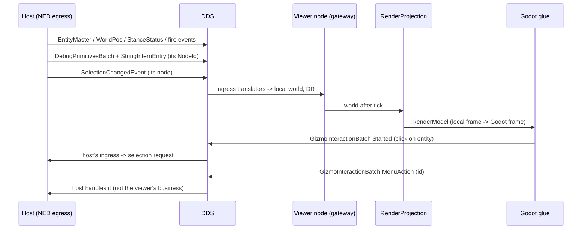
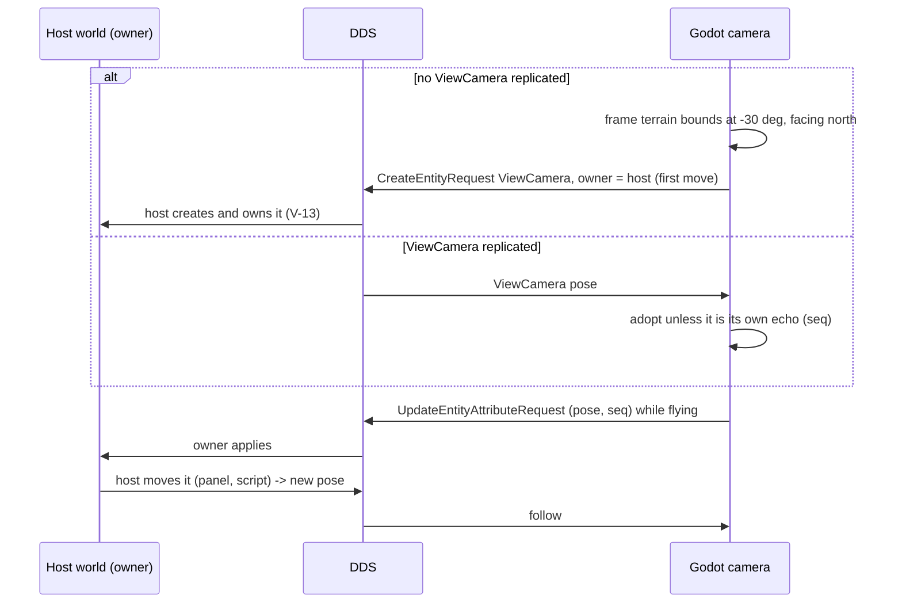

<!--STATUS
state: LIVE
build-state: DESIGN — requirements recorded (§1), user rulings recorded (§1a), approach proposed with a lean per decision
  (§5). ONE decision still open and load-bearing: D3, the transport (lean: full NED). Nothing built.
updated: 2026-10-10 (rev 2 — the user's rulings on rev 1; transport lean changed from a loopback socket to full NED)
current-answer: §1 requirements · §1a the user's rulings · §3 what exists, incl. what NED already carries (§3.3) ·
  §4 the architecture (module / class / sequence diagrams) · §5 decisions · §6 open questions · §7 stages.
stale-below: "## ⛔ HISTORY" — rev 1's loopback-socket transport, its host-side ViewerProducerSystem, and "Editor first".
  Do NOT quote them.
known-rot: none.
known-conflict: none. ⚠ This is NOT a Stride replacement — §3.1 (Stride is a simulating node). The user ruled Stride
  stays untouched (§1a).
related-designs:
  - DESIGN_Stride_Node_Modes.md — owns the Stride story (a 3-D SHELL around a simulating node). This viewer EXTRACTS its §8
    3-D gizmo triage and §9 locomotion blend into shared code and leaves Stride's roles and code paths otherwise untouched.
  - designs/gizmos-1/DESIGN.md — owns "Evaluate Once, Present Anywhere": the dumb-terminal gizmo stream, its DDS topics
    (§6), §10 context-menu bindings and the MenuAction return trip. The viewer is one more dumb terminal.
  - UX/UX_Feature_Selection.md — owns UXI-11, the one selection store, its request/notification protocol and the
    SelectionEgressSystem the viewer listens to (§2.7.17).
  - DESIGN_Terrain_World.md — owns TerrainWorld (local metres, X east / Y north / Z up) — what the 3-D scene is built from.
  - DESIGN_Geo_Origin.md — owns the terrain's geo origin; the viewer needs it because NED positions are lat/lon.
  - DESIGN_Remote_Map_Control.md — owns remote commands into a host and R-134 (the DDS type stops at the translator).
  - DESIGN_Gizmo_Anchor_Identity.md — owns network-id identity of gizmo anchors; via Architect_Question_73 (CE-463),
    "an external viewer is an external view on one node, and selection spreads both ways".
  - DESIGN_Dead_Reckoning.md — owns remote-entity smoothing on every node; the viewer's passive node inherits it.
  - DESIGN_Node_Roles_And_Policies.md — owns roles and persistence (R-140, IG is a passive non-persisting node — the
    viewer node's model).
  - blueprints/Architect_Question_86_Editor_Runs_The_Orchestrator_Core.md — owns the editor as a one-node cluster with an
    orchestrator core and a slave-less MasterSyncController; under D3 the viewer becomes that cluster's second node.
-->

# DESIGN — a Godot 3-D viewer for HROT

## Headline

⭐ **A separate Godot 4.7.1 (.NET) process whose ONLY input is a GATEWAY.** The gateway's lean form (D3) is **a passive
HROT node inside the Godot process** — IG-shaped: NED ingress, dead reckoning, terrain residency — plus a projection of
that node's world into a render model. Godot code reads the render model and nothing else. Later the **SumoSharp**
stream enters the **same gateway** (stage 3). The host menu toggle starts and stops the process.

| | |
|---|---|
| what it renders | terrain (built from `TerrainWorld`), entities (models + mannequin animation; boxes first), 3-D gizmos, fire/detonation effects, selection cubes, context menus |
| what it never does | physics, simulation, scenario load/save, deciding what a menu action means (the host does) |
| what it reuses | NED replication + ingress translators + DR, the gizmo DDS topics, the selection egress, the owner-routed update request, `TerrainWorld`, SumoSharp City3D's split and cloud tests |
| what is new | the gateway's projection, the camera entity (+ its NED descriptor), the Godot app, a NED mode for the Editor |

---

## 1. REQUIREMENTS — user, `2026-10-10` (recorded as given; ids are for discussion)

| id | requirement | stage |
|---|---|---|
| **V-01** | A 3-D viewer startable from the **Editor, CGF, SimHost or ReplayBrowser** as a **menu toggle** | 1 |
| **V-02** | Builds its 3-D scene from **our terrain automatically**; may **cache** the built scene on disk if building is slow | 1 |
| **V-03** | **Animated characters** — the open-source Godot **mannequin**; optionally soldier (rifle) / civilian (no rifle) — not mandatory | 1 |
| **V-04** | Ships **open-source 3-D models**: personal car, APC, tank, helicopter, fighter jet | 1 |
| **V-05** | **Free camera** keyboard/mouse controls **as in the Unity editor** | 1 |
| **V-06** | HROT provides **entity state every frame** (position, speed, stance, … whatever is needed) | 1 |
| **V-07** | HROT provides the **gizmo stream**, rendered in 3-D as debug drawing | 1 |
| **V-08** | HROT provides **events — fires, detonations** — rendered as simple particle effects | 1 |
| **V-09** | Godot runs **in its own thread** with **its own 3-D window**, closable **without closing the host** | 1 |
| **V-10** | **Click to select** entities — selection **shared with HROT** — with a **wireframe-cube** indicator | 1 |
| **V-11** | **Entity context menu** in the 3-D window, **from the gizmo data**, same as the HROT UIs | 1 |
| **V-12** | Camera starts at a **tilted top view (~30° below horizontal) framing the whole terrain**, unless an HROT **camera entity** carries a location; **saveable to the scenario** | 1 |
| **V-13** | The **camera entity** is created and **owned by the host that created the Godot instance** | 1 |
| **V-14** | The camera entity **follows Godot's camera** when moved in Godot — through a gateway sending **state-update-request FDP bus events** | 1 |
| **V-15** | If the host moves the camera entity, **Godot follows** | 1 |
| **V-16** | Coordinates: HROT's **internal local frame** (never geodetic), adapted only to **Godot's axis/rotation conventions** | 1 |
| **V-17** | Godot is a **viewer only** — no physics, no simulation | 1 |
| **V-18** | A **gateway** feeding the viewer **either in-process from a host or from the network** (Godot as a separate app on **NED DDS**) | arch 1 · build 2 |
| **V-19** | Later: the **SumoSharp** viewer's features — SUMO road net and cars over the network, rendered **together with HROT data** | 3 |
| **V-20** | **Lightweight**, **developable by Claude in the Linux cloud** (Xvfb for tests) | all |

### 1a. The user's rulings on rev 1 — `2026-10-10`, verbatim

| # | 🔒 user | consequence |
|---|---|---|
| **U1** | *"Stride untouched for now."* | §6 Q1 closed — keep, no Stride work beyond the two extractions D9/D10 already proposed |
| **U2** | *"How to pass data if not same process? Special non-ned dds topic? Or full NED perhaps - good test for NED?"* | ⭐ D3 rewritten: **full NED** is now the lean (§5 D3). The question assumes a separate process ⇒ D1 is treated as accepted |
| **U3** | *"Ad 3: ok. Ad 4: ok. Ad 5: ok. Ad 6: ok."* | camera entity (one per launching host, created on first move, none in ReplayBrowser) · `Viewer3D/` layout · Godot 4.7.1 · Editor first — ⚠ **but under full NED the Editor is the most expensive first host; §6 Q6 asks again** |
| **U4** | *"the gateway should be the only input to godot, the network stream from sumosharp should go through it"* | ⭐ the gateway is the single input; SumoSharp is a gateway input, never a second path into Godot (§4.1) |
| **U5** | *"3d models could be authored from simple boxes as the first iteration (tank and its turret each one box etc) if easy and nothing better — usable for slice 0"* | D10: **box models first**, articulated where it matters (hull + turret), used from S0 |
| **U6** | *"Menu actions irrelevant — controlled by host, sent back to host, not 3d viewer's business so much."* | D8: the viewer shows the menu and returns the chosen id — nothing more. Rev 1's notes on handler/id defects are dropped from this design |

---

## 2. INVENTORY — measured `2026-10-10`, branch `ui`

⚠ Graph via the MCP (`home-user-HROT`); every total corroborated with grep. `check_index_coverage` not run — no total
below is a proof of completeness.

| query | total | what it settled |
|---|---|---|
| `search_graph(name_pattern=".*Stride.*", label="Class")` | **71** | Stride is a simulation node + 3-D shell; no renderer-neutral entity seam (§3.1) |
| `search_graph(name_pattern=".*(Gizmo\|Selection\|ContextMenu\|Camera).*", label="Interface")` | **28** | `IGizmoTransport`, `IGizmoSource`, `IGizmoDrawBuilder`, `ISelectionState`, `IMapCameraProvider` (2-D only) |
| `search_graph(qn_pattern=".*GizmoMap\.Contracts.*")` | **490** | the BCL-only primitive contract incl. `ContextMenuBinding`, `ContextMenuItemDto`, `SpatialAnchor` |
| `search_graph(name_pattern=".*(Camera\|Viewpoint).*", label="Class")` + grep for camera structs | **18 / 0** | ⛔ **no camera entity or component exists** |
| `search_graph(name_pattern=".*Selection(Request\|Changed\|…)\w*")` | **179** | one store: `SelectionRequestSystem`, `EcsSelectionState`, `SelectionChangedNotification`, `SelectionEgressSystem` |
| `search_graph(name_pattern=".*NetworkFactory$")` + grep `new …NetworkFactory` | **53 / 4** | ⛔ the **Editor is hard-wired offline** (`EditorSubsystem.cs:219` → `OfflineNetworkFactory` → `NullReplicationModule`); CGF/SimHost get NED or BDC from `ClusterRunner/Program.cs:227-228`; ReplayBrowser **discards** its factory (`ReplayBrowserSubsystem.cs:140`) |
| `search_graph(name_pattern=".*(Fire\|Detonat\|Shot\|…)…(Event\|Record\|…)$")` | **47** | local bus `WeaponFireNotification`/`DetonationNotification`; NED `WeaponFire`/`MunitionDetonation` |
| `search_code("Godot")` | **3** | passing mentions only |
| SumoSharp `demos/City3D` (read 2026-10-10) | — | Godot 4.7.1 .NET, `CityLib` + `Viewer`, `IReplicationSource` swap, `fetch-godot.sh`, Xvfb screenshot; DDS used only in its remote mode |

---

## 3. WHAT ALREADY EXISTS

### 3.1 ⛔ Stride is not a viewer

📐 `StrideNodeBootstrapper` provides **`MuscleGround | Perception | NavigationSolver`**
(`Hrot/Subsystems/Hrot.NodeComposition/StrideNodeBootstrapper.cs:17-21`); `DESIGN_Stride_Node_Modes.md`: *"Stride is
not a new node type. It is a SHELL — a 3-D window and a physics/animation backend"*. It has **no terrain** (flat 20 km box,
`StrideHrotGame.cs:1009`), **no 3-D context menu**, **no effects**, **no camera entity**. Ruled untouched (U1).

### 3.2 Reused building blocks

| need | already exists | file | use |
|---|---|---|---|
| 3-D triage of gizmo shapes | `DebugPrimitiveRenderer3D` → `IDebugDrawSink3D` | `Stride/Hrot.Stride.Core/DebugPrimitiveRenderer3D.cs:219-273` | ⭐ **extract** — Stride appears only as 14 math value types |
| locomotion blend | `LocomotionBlend` (pure `System`) | `Stride/Hrot.Stride.Animation/LocomotionBlend.cs` | ⭐ **extract** |
| per-engine model mapping | TKB `Stride.RenderModelDef` — *"a future 3D engine gets its own descriptor"* | `Fdp.Toolkits/Tkb/Domain/StrideRenderModelDefDto.cs:39-43` | add **`Godot.RenderModelDef`** |
| terrain | `TerrainWorld` (prisms, panels w/ openings, slabs/ramps, surfaces, doors); `TerrainResidency` loads it by name on every node | `Fdp.Toolkits/Terrain/TerrainWorld.cs:83`, `Hrot.Core/Services/TerrainResidency.cs:37` | the viewer node loads it like any node; the gateway meshes it |
| a passive node to copy | IG — passive, non-persisting (R-140), NED ingress, DR, 2-D map | `IgNodeBootstrapper.cs` | the viewer node's shape |
| main-menu toggle | `GlobalMenuRegistry.RegisterCheckableItem` | `Fdp.Presentation/ImGui/WindowManager/WindowManager.cs:394` | `View ▸ 3D Viewer` |
| Godot split + cloud tests | `CityLib`/`Viewer`, `fetch-godot.sh`, `--headless` smoke, Xvfb screenshot | `pjanec/SumoSharp demos/City3D` | the same |

### 3.3 ⭐ What NED / DDS already carries — the case for full NED

| the viewer needs | wire form today | file | gap |
|---|---|---|---|
| entity exists / type / side / name | NED `EntityMaster` (TkbType, DisType), `EntityInfo` | `Hrot.Network.NED/GenericDescriptors.cs:92,150` | — |
| pose + velocity | NED `WorldPos` (lat/lon/alt, HPR, velocity) | `SimDescriptors.cs:14` | lat/lon ⇒ needs the terrain's geo origin (loaded with the terrain) |
| health | NED `EntityDamage` | `SimDescriptors.cs:51` | — |
| stance | `hrot/anim/StanceStatus` on real DDS | `Hrot.Animation.Replication/AnimationDdsMessages.cs:79` | not ingested by IG today (CE-2121 "IG ingress open") — the viewer node composes it |
| fire / detonation | NED `WeaponFire`, `MunitionDetonation` | `FireInteractionMessages.cs` | — |
| gizmos | `DebugPrimitivesBatch` (keyed FrameNumber + NodeId) — CGF, SimHost, IG publish | `GizmoMap.Network/Topics/DebugPrimitivesBatch.cs` | the Editor publishes none (offline) |
| menu JSON behind a binding | `StringInternEntry` + `DdsStringInternPublisher` | `GizmoMap.Network/Transport/DdsStringInternPublisher.cs` | ⛔ **no production host constructs the publisher** (only `GizmoMap.Example`) ⇒ menus cannot resolve remotely until wired |
| pick / menu action / ground point back | `GizmoInteractionBatch` (Started, MenuAction + ActionId, WorldPos) | gizmos-1 §5, §10.7 | — |
| the host's selection set | NED `SelectionChangedEvent{MapId, ids}` from the shared `SelectionEgressSystem` | `MapMessages.cs:106`; `Hrot.Presentation/.../SelectionEgressSystem.cs:60` | wired on IG only (`IgApplication.cs:929`) |
| camera moved in Godot → owner | NED `UpdateEntityAttributeRequest` (owner-routed) | `GenericMessages.cs:261-264` | — |
| camera entity state | — | — | ⛔ **new**: a `ViewCamera` component + NED descriptor |
| terrain name | cluster load phase (`NodeTransitionPayloadDto.TerrainName` on `NodeOpCommand`) | `OrchestrationPayloadDtos.cs:146` | the viewer node joins the load phase, as IG does |

⇒ ⭐ **Of eleven needs, eight already cross the wire, two need wiring that exists in code, one is new.** That is why D3
leans to full NED rather than a viewer-private protocol.

---

## 4. THE ARCHITECTURE (lean: full NED)

### 4.1 Modules — who runs what, and the dead edges

*What the picture shows that prose hid:* on the host side **nothing is new except wiring** — the egress translators,
gizmo topics and selection egress already exist; the **ReplayBrowser edge is dead** today (it discards its network
factory), and the **Editor needs a NED mode** before it can be a host at all. Godot code touches only the projection.

### 4.2 Classes — existing vs proposed

*What it shows:* the only new **runtime** pieces are a bootstrapper (a copy of a known shape), a projection, a component
and the Godot glue; everything the node does on the wire is existing code.

### 4.3 Sequences

**A frame, a select, a menu action**

**The camera entity, both ways (V-12..V-15)**

---

## 5. DECISIONS

### D1 · Process model — ⭐ **a separate Godot process** (accepted implicitly by U2)

In-process .NET hosting of Godot is not official (LibGodot lists .NET as a goal; the only package doing it, `2dog`, targets
.NET 10 — HROT is .NET 8); the host already owns a window and GL context on its loop (`RaylibPresentationShell.cs:34`).
A process keeps what V-09 protects — the host never blocks, Godot owns its window, closing it leaves the host running.

### D2 · The gateway — ⭐ **the only input to Godot** (U4)

Godot code depends on `RenderModel` alone. Inputs to the gateway: the viewer node's world (stage 1–2), SumoSharp's
replication (stage 3). ⇒ no Godot type crosses into a host, and no second data path ever reaches Godot.

### D3 · The transport — ⭐ **lean: full NED; the gateway hosts a passive HROT node** — ⚠ **OPEN, awaiting the user**

| the lean rests on | how it IS | how it was MEANT |
|---|---|---|
| almost everything already crosses NED/DDS | ✅ §3.3 — 8 of 11 needs on the wire, 2 need existing code wired, 1 new | ✅ gizmos-1 §6 (gizmo topics are DDS by design); UXI-11 §2.7.17 (selection egress) |
| an external viewer of one node is an already-ruled concept | ✅ CE-463 built it for gizmo picks (`PickStreamId = targetNodeId`) | ✅ Q73 §8: *"the external gizmo viewer is just external view on the node"* |
| a passive node is a known shape | ✅ IG (`IgNodeBootstrapper`) | ✅ R-140 |
| decoding + smoothing must not be written twice | ✅ NED ingress translators + `DeadReckoningSyncSystem` exist | ✅ `DESIGN_Dead_Reckoning.md`: DR is for every node (R-S2) |
| stage 2 (V-18) becomes free | the stage-1 path IS the network path | ✅ V-18 |

**Costs, stated:** ① the **Editor needs a NED mode** — today it is hard-wired offline (`EditorSubsystem.cs:219`). Under
Q86 the editor already is a one-node cluster with an orchestrator core; the viewer becomes its second node on a private
DDS domain. ⚠ Sized as backend-lane work, not measured yet. ② **ReplayBrowser has no network path** — a replay would
have to re-broadcast its sandbox worlds onto DDS; deferred (§6 Q8). ③ the Godot process carries FDP + NED + toolkits —
S0 measures it. ④ a cluster running **BDC** instead of NED (`ClusterRunner/Program.cs:227`) gives the viewer nothing —
NED only, as V-18 asks.

**Rejected:**
- **Viewer-private DDS topics** — uniform across the four hosts, but a **second egress of the entity state NED already
  publishes** (ruling 9), and stage 2 still needs the NED path ⇒ two paths forever.
- **A loopback socket** (rev 1's lean) — the same duplication, plus no `ddsmonitor` sniffing, no second viewer, no remote machine.
- **A plain DDS subscriber gateway without an FDP world** — lighter, but re-implements the ingress translators,
  lat/lon conversion and DR that the node gets for free.

### D4 · Godot app structure — ⭐ **City3D's split**

`Hrot.Viewer.Core` (pure net8, no Godot types, unit-tested: the viewer node bootstrap, `RenderProjection`, the coordinate
transform, terrain meshing, extracted triage + blend) + `Hrot.Viewer.Godot` (thin glue). Godot owns nodes,
`MultiMeshInstance3D`, `AnimationTree`, `PopupMenu`, the free camera, picking.

### D5 · Coordinates (V-16) — ⭐ **one transform, in Core**

HROT: X east, Y north, Z up, right-handed, yaw 0 = east, +90° = north (`SimComponents.cs:16`). Godot: Y up, right-handed,
camera forward −Z.

| | HROT → Godot |
|---|---|
| position / velocity | `(x, y, z) → (x, z, −y)` |
| rotation quaternion | `(x, y, z, w) → (x, z, −y, w)` — the axis map has det = +1, **no handedness flip** |
| yaw | HROT yaw θ about +Z **=** Godot rotation θ about +Y |

⭐ The same map SumoSharp uses for SUMO → Godot (SUMO is also x-east / y-north), so stage 3 shares it. NED's lat/lon is
converted to local metres by the node's `WGS84Transform` (origin from the terrain) **before** this transform.

### D6 · Terrain scene (V-02) — ⭐ **the viewer node loads the terrain by name like any node; the gateway meshes it per kind and caches by content hash**

Cache: `<LocalAppData>/Hrot/viewer-terrain/<name>-<hash>.res` (folder rule precedent: `NavTileCache`).
**Rejected:** streaming terrain geometry — a second representation and a new topic.

### D7 · Camera entity (V-12..V-15) — ⭐ **`ViewCamera` component + NED descriptor; one per launching host; created on first camera move; none in ReplayBrowser** (U3)

Godot → owner: `UpdateEntityAttributeRequest`; owner → Godot: the replicated descriptor; echo ignored by a sequence
number (precedent: selection's `"Remote."` echo suppression).

### D8 · Selection, picking, context menu (V-10, V-11) — ⭐ **reuse the gizmo interaction path** (U6)

Click → Godot ray vs entity bounds → `GizmoInteractionBatch` Started for that `netId` → the host's own ingress makes it a
selection request (CE-463 shape). The selection set returns as the host's `SelectionChangedEvent`; Godot draws the
wireframe cube. Right-click → the `ContextMenuBinding` for that `netId` → JSON from `StringInternEntry` → Godot
`PopupMenu` → `MenuAction(netId, id)` back. ⭐ What the id means is the host's business.

### D9 · Gizmos in 3-D (V-07) — ⭐ **extract the triage, shared by Stride and Godot**, with per-shape skip counters (Stride §8)

### D10 · Models and animation (V-03, V-04) — ⭐ **box models first (U5), then real assets**

`Godot.RenderModelDef` names a model; S0–S2 use **procedural boxes**: a tank = hull box + turret box (+ barrel), APC = hull
box, car = body + cabin, helicopter = fuselage + rotor disc (spins with speed), jet = fuselage + wing slab, person =
mannequin if trivially available, else a capsule. Real assets later, behind the same descriptor, with a licence table
(CC0 / MIT / CC-BY). Locomotion from the extracted `LocomotionBlend` + `StanceStatus`. ⛔ Not `IAnimationBackend` — that
is the simulation's animation contract.

### D11 · Effects (V-08) — ⭐ **NED `WeaponFire` / `MunitionDetonation` → `EffectEvent` → Godot one-shot particles**

---

## 6. OPEN QUESTIONS

| # | question | ⭐ lean | state |
|---|---|---|---|
| Q1 | Stride | untouched | ✅ **ruled** (U1) |
| Q2 | separate process | yes | ✅ accepted (U2 assumes it) |
| Q3 | camera entity shape | one per launching host · on first move · none in ReplayBrowser | ✅ **ruled** (U3) |
| Q4 | code layout | `Viewer3D/`; Godot project outside `HROT.sln` | ✅ **ruled** (U3) |
| Q5 | Godot version | 4.7.1 .NET | ✅ **ruled** (U3) |
| **Q6** | first host | ⚠ **re-asked.** U3 approved "Editor", but under full NED the Editor is the one host that cannot speak NED yet. ⭐ **Lean: SimHost or CGF first** (both already on NED; runnable in the cloud with `--mode all`), Editor as soon as its NED mode lands | **open** |
| **Q7** | transport | ⭐ **full NED** (D3) | **open — the one load-bearing decision** |
| **Q8** | ReplayBrowser | ⭐ defer: it has no network path; decide between "re-broadcast the replay onto DDS" and dropping it from V-01, after stage 1 | open |
| **Q9** | Editor NED mode | ⭐ a private DDS domain per editor instance, NED switched on at boot by a flag (the composition is fixed at boot) — a backend-lane item | open |

---

## 7. STAGES (lean: full NED, SimHost/CGF first)

| slice | delivers | proves |
|---|---|---|
| **S0** spike | fetch Godot in the cloud; a passive viewer node boots inside the Godot process and joins a `--mode all` cluster; box entities move; Xvfb screenshot | D3's feasibility, D1, V-20 — **the FDP-in-Godot weight is measured here** |
| **S1** host toggle | `View ▸ 3D Viewer` on SimHost/CGF spawns/kills the process; free camera; default camera | V-01 (two hosts), V-05, V-09, V-16, V-17 |
| **S2** scene | terrain meshes + cache; `Godot.RenderModelDef` with box models; stance/locomotion | V-02, V-03, V-04 (boxes), V-06 |
| **S3** interaction | extracted gizmo triage; `StringInternEntry` publisher wired; selection egress wired on SimHost/CGF; picking; menu popup | V-07, V-10, V-11 |
| **S4** camera entity | `ViewCamera` + descriptor, both-way sync, scenario save | V-12..V-15 |
| **S5** effects | fire / detonation particles | V-08 |
| **S6** Editor | the Editor's NED mode (Q9) — then the Editor is a host like the others | V-01 (Editor) |
| **S7** ReplayBrowser | per Q8 | V-01 complete |
| **stage 2** | standalone viewer on any NED cluster — the same app, no host launching it | V-18 |
| **stage 3** | SumoSharp ingest in the gateway; road-net mesh; a shared origin with the HROT terrain | V-19 |
| *assets* | real models replacing boxes, licence table | V-03, V-04 |

⭐ Each slice gated in the cloud by Core unit tests, a `godot --headless` smoke and an Xvfb screenshot (City3D's
`run-smoke.sh` / `screenshot.sh`). DDS cross-process works in this cloud (`ddsmonitor` captured a multi-process cluster,
`docs/RUNBOOK_Cluster_Debugging_Over_Http.md` §5a). ⚠ The aesthetic check stays a human one.

---

## ⛔ HISTORY — rev 1 (2026-10-10), superseded by rev 2 the same day. Do NOT quote.

- **Transport:** rev 1 leaned to a **loopback TCP socket** carrying a viewer-private `ViewerFrame` contract, produced by a
  host-side `ViewerProducerSystem` + `ViewerRequestSystem`. Superseded by D3 after U2 and the §3.3 measurement: that
  contract would have been a second egress of state NED already publishes.
- **First host:** rev 1 leaned "Editor first"; under full NED the Editor is offline-only, so Q6 is re-asked.
- **Menu actions:** rev 1 listed two pre-existing defects on the menu-action return path; dropped per U6 — the action's
  meaning is the host's business, not this design's.
