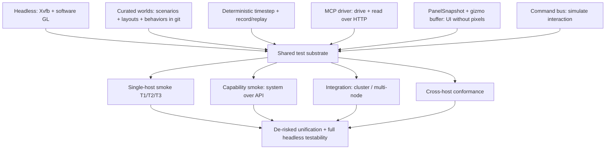
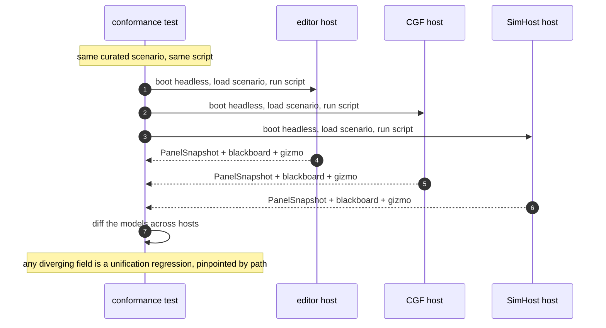

<!--STATUS
state: LIVE
build-state: DESIGN (methodology map — the COMPONENTS are separately buildable; this doc sequences them)
updated: 2026-08-22
current-answer: the whole file — the methodology for de-risking the cross-host unification with FULL HEADLESS
  testability. Defines the test-type taxonomy, the shared substrate every type reuses, the two fixtures and
  when to use each, and how cross-host conformance is the headline de-risking mechanism. Points at the
  component designs; does not duplicate their internals.
design-basis: this session (2026-08-22) with the user. Components: DESIGN_MCP_System_Test_Harness.md ·
  DESIGN_UI_Observability_Snapshot.md · MCP_Integration.md (Groups A–T) · DESIGN_Smoke_Suite.md (single-host
  smoke fixture + tiers). Substrate proven: Editor_Headless_Xvfb.md · UX_Feature_Curated_Scenarios.md.
known-conflict: none. This is the UMBRELLA; DESIGN_Smoke_Suite.md is now the "single-host smoke" COMPONENT under it.
-->
# DESIGN — **headless testability & the de-risking of cross-host unification**

> 🔴 **North star:** the unification programme is merging the editor / CGF / SimHost onto *one* implementation.
> That is risky and much of it is visual. **We need to prove, headlessly and automatically, that behaviour
> stayed the same** — across a change, and across hosts. This doc is the map of *how*; the pieces are built in
> the component designs it points to.

## The one idea

⭐⭐ **One substrate, many test types, one read model.** Every test type reuses the same headless run, the same
curated worlds, and the **same dumpable models** *(panel view-models + the gizmo buffer)*. Cross-host
conformance is then just *"run the same script on each host and diff the models."* ⛔ **No pixels required for
the machine layer**; pixels are a rare human backstop.

## The test-type taxonomy — what each de-risks

| type | the question | fixture | reads | de-risks | owner design |
|---|---|---|---|---|---|
| **Unit** | does a class work? | xUnit | objects | logic regressions *(historically low yield here)* | — |
| ⭐ **Single-host layered smoke** | is ONE host obviously broken, sim → panel? | **in-process `EditorHarness`** *(fast, ~seconds)* | **T1** blackboard · **T2** `PanelSnapshot` model · **T3** pixels | "obviously broken after a change", fast loop | `DESIGN_Smoke_Suite.md` |
| ⭐⭐ **Capability smoke (system)** | does each whole-system capability work end-to-end? | **subprocess editor over MCP** *(real process)* | API responses | the system integrates *(spawn/command/breakpoint/watch/record-replay/trace)* | `DESIGN_MCP_System_Test_Harness.md` |
| **Integration (cluster / multi-node)** | does the cluster hold together? | `ClusterRunner.Integration.Tests` | node/time/transport state | multi-node, time-sync, transport invariants | *(existing suite; see `DESIGN_Smoke_Suite.md` §G-a/G-b)* |
| ⭐⭐⭐ **Cross-host conformance** | do editor / CGF / SimHost **AGREE**? | **each host as a subprocess over MCP** | `PanelSnapshot` + blackboard + gizmo | ⭐ **THE unification didn't break parity** | *this doc §Conformance* |

⚠ **The tally is honest** *(from CLAUDE.md's three-tier rule)*: unit tests rarely catch the real defects here —
the value is in the panel-model / conformance layers, which is why this methodology invests there.

## The shared substrate — built once, reused by every type

| substrate piece | status | where |
|---|---|---|
| **Headless run** *(Xvfb + software GL)* | ✅ proven | `Editor_Headless_Xvfb.md` |
| **Curated worlds** *(scenarios · layouts · behaviors, git-seeded)* | ✅ built | `UX_Feature_Curated_Scenarios.md` + layout defaults |
| **Deterministic timestep + record/replay** | ✅ built + verified | `MCP_Integration.md` |
| **MCP driver** *(drive + read over HTTP)* | ✅ built; extensions in flight | `MCP_Integration.md` Groups A–T |
| ⭐ **`PanelSnapshot` + `DebugPrimitiveBuffer`** *(read the UI without pixels)* | ⛔ **PanelSnapshot NEW** *(the key gap)*; gizmo buffer exists | `DESIGN_UI_Observability_Snapshot.md` |
| **Command bus** *(`IEditorCommands` — simulate interaction)* | ✅ exists; MCP exposure pending | `MCP_Integration.md` *(interaction)* |

## The two fixtures — when to use which

⭐ There are **two** ways to boot the system, and they are complementary — not a duplication to collapse:

| | **in-process `EditorHarness`** | **subprocess editor over MCP** |
|---|---|---|
| speed | ⭐ ~seconds *(no boot)* | ⚠ ~3–8 s boot |
| what it tests | the sim + panels *in-proc* | ⭐ the **whole real process incl. the API** |
| hosts | editor-shaped only | ⭐ **any host that exposes the debug API** |
| best for | **T1/T2 single-host smoke**, tight loops | **capability smoke** + **the driver for conformance** |
| reads | `PanelSnapshot` in-proc | `PanelSnapshot` over `GET /panels` |

⭐⭐ **They share the read contract** *(`PanelSnapshot` / `IPanelViewModel`)* and the curated worlds — so a T2
assertion written against one reads the same model shape from the other. ⛔ **Cross-host conformance MUST use the
subprocess fixture** *(each host is its own process)*.

## ⭐⭐⭐ Cross-host conformance — the headline de-risking mechanism

⛔⛔ **The one prerequisite that does not exist yet:** the debug API is wired **only in the editor**
*(`EditorSubsystem`)*. Conformance needs at least a **read subset** *(`/panels`, `/entities`, blackboard)* on
**CGF and SimHost** too. ⇒ **that wiring is the gating work for conformance** — a named task below.

⭐ **Why the model layer, not pixels:** the draw is per-host by nature; the thing being *unified* is the
model-building logic. Diff the **models** and a divergence is named by field path; a pixel diff could not tell
you *what* differed, only *that* it did *(and would drown in font/AA noise)*.

## Component designs — who owns what

| design | owns |
|---|---|
| **`DESIGN_UI_Observability_Snapshot.md`** | ⭐ the `PanelSnapshot` singleton + `IPanelViewModel` contract *(the read model everything else depends on)* |
| **`DESIGN_MCP_System_Test_Harness.md`** | the subprocess capability harness *(fixture, `McpClient`, smoke ladder — H1–H7)* |
| **`MCP_Integration.md`** | the API itself: Groups A–N *(built)* + O–T *(extensions, incl. Group T panel read)* |
| **`DESIGN_Smoke_Suite.md`** | ⭐ the **single-host layered smoke** component: the in-process `EditorHarness` fixture + the T1/T2/T3 tiers + gating the 174 integration tests |
| *(this doc)* | the map, the taxonomy, the conformance mechanism, the sequencing |

## Sequencing — the whole programme, in dependency order

| # | step | gated on |
|---|---|---|
| **1** | **MCP harness** *(capability smoke)* — H1–H6 | *(running now)* |
| **2** | **`PanelSnapshot` slice `U-obs-1`** — contract + singleton + one pilot panel | the read model — everything visual depends on it |
| **3** | **Group T** *(`GET /panels*`)* — expose the snapshot over MCP | `U-obs-1` |
| **4** | **Smoke suite T2** — read `PanelSnapshot` *(supersedes its bespoke `EditorPanels`, G-c)*; and **fix/gate the 174** *(G-a/G-b)* | `U-obs-1`; the integration suite |
| **5** | **Convert the unified surfaces** *(Details/blackboard/watch — `U-obs-2`)* + **gizmo feed** *(`U-obs-3`)* | `U-obs-1` |
| **6** | ⭐⭐ **Debug-API READ subset on CGF + SimHost** | the API is editor-only today — this is conformance's prerequisite |
| **7** | ⭐⭐⭐ **Cross-host conformance suite** — boot each host, run one script, diff models | steps 2–6 |
| **8** | convert further panels **as touched**; pixels only for the rare tail | standing rule |

⭐ **The critical path is step 2** *(`PanelSnapshot`)* and **step 6** *(the API on the other hosts)* — everything
that actually de-risks the unification hangs off those two.

## INVENTORY — the mechanisms, measured 2026-08-22

| exists? | mechanism | where |
|---|---|---|
| ✅ | headless editor run *(Xvfb + SW GL)* | `Editor_Headless_Xvfb.md` *(proven)* |
| ✅ | MCP drive+read API, record/replay | `Hrot.Editor/DebugApi/` *(Groups A–N)* |
| ✅ | in-process `EditorHarness` *(342 lines)* | `Hrot.ClusterRunner.Integration.Tests/EditorHarness.cs` |
| ✅ | `DebugPrimitiveBuffer.GetFrame()` *(gizmo/map model)* | `Fdp.Diagnostics.Contracts/` |
| ✅ | `IEditorCommands` *(id-addressable command bus)* | `NodeEditor.Core/Action/` |
| ✅ | curated scenarios/layouts/behaviors | `UX_Feature_Curated_Scenarios.md` + git |
| ⛔ | **`PanelSnapshot` singleton + `IPanelViewModel`** | *new — `DESIGN_UI_Observability_Snapshot.md`* |
| ⛔ | **debug API on CGF / SimHost** | *new — conformance prerequisite; today editor-only* |
| ⛔ | **cross-host conformance suite** | *new — this doc §Conformance* |

> Method: read of the named symbols + the wiring site *(only `EditorSubsystem` constructs `DebugApiHost`)*.
> The two ⛔ gaps are the real work; the rest is substrate that already exists and is reused.

## Open questions (resolve with the user / at build time)

1. **Conformance host coverage** — all three hosts, or editor+CGF first? *(Lean: editor+CGF first — the pair the unification touches most.)*
2. **The read subset on CGF/SimHost** — full `DebugApiHost`, or a slimmer read-only variant? *(Lean: reuse `DebugApiHost` with a read-only route set; one implementation.)*
3. **Conformance tolerance** — exact model equality, or field-level allow-lists for legitimately host-specific bits *(window chrome, host name)*? *(Lean: exact by default, an explicit per-field ignore-list where a difference is intended and documented.)*
