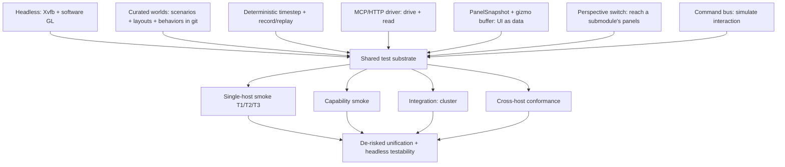
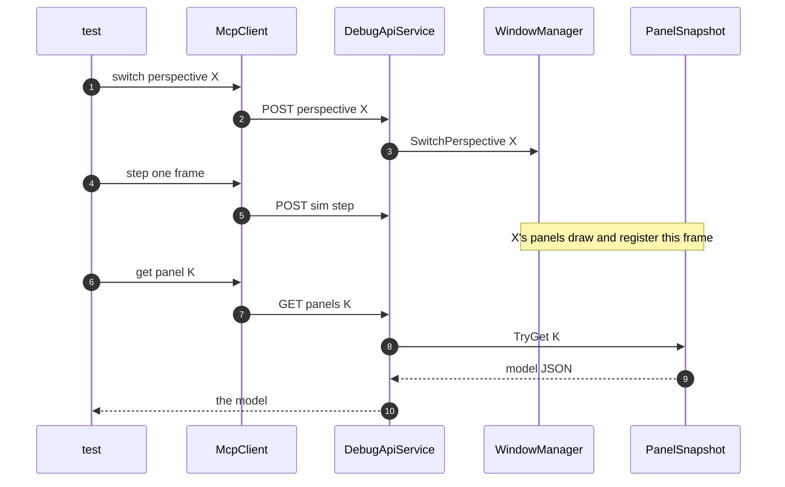

<!--STATUS
state: LIVE
build-state: DESIGN (methodology + architecture — the COMPONENTS are separately buildable; this doc sequences them)
updated: 2026-08-23
current-answer: the whole file — the methodology AND architecture for de-risking the cross-host unification with
  FULL HEADLESS testability. Test-type taxonomy · the shared substrate · the ONE-BINARY/--mode model · the
  PERSPECTIVE-SCOPED capture protocol · cross-host conformance · the UML. The procedural HOW-TO (writing tests,
  maintaining goldens) lives in TESTING_Harness_And_Goldens.md; this doc is the architecture behind it.
stale-below: nothing. ⚠ The 2026-08-22 version modelled conformance as "each host a separate subprocess" and the
  read-API as "add it to CGF/SimHost" — CORRECTED 2026-08-23: it is ONE binary (Hrot.ClusterRunner), --mode
  selects subsystems, and capture is perspective-scoped.
design-basis: this session (2026-08-22/23) with the user. Components: DESIGN_MCP_System_Test_Harness.md ·
  DESIGN_UI_Observability_Snapshot.md · MCP_Integration.md (Groups A–T) · DESIGN_Smoke_Suite.md · the runbook
  TESTING_Harness_And_Goldens.md. Substrate proven: Editor_Headless_Xvfb.md · UX_Feature_Curated_Scenarios.md.
known-conflict: none. This is the UMBRELLA; DESIGN_Smoke_Suite.md is the "single-host smoke" COMPONENT under it.
-->
# DESIGN — **headless testability & the de-risking of cross-host unification**

> 🔴 **North star:** the unification programme is merging the editor / CGF / SimHost onto *one* implementation.
> That is risky and much of it is visual. **We need to prove, headlessly and automatically, that behaviour
> stayed the same** — across a change, and across hosts. This doc is the *architecture*; the day-to-day HOW-TO
> is the runbook **[`TESTING_Harness_And_Goldens.md`](TESTING_Harness_And_Goldens.md)**.

## The one idea

⭐⭐ **One binary, one substrate, one read model.** The editor and the cluster are the **same executable**
*(`Hrot.ClusterRunner`, `--mode` selects the subsystems)*; every test type reuses the same headless run, the same
curated worlds, and the **same dumpable models** *(panel view-models + the gizmo buffer)*. Cross-host conformance
is then *"run the binary in two modes and diff the models by `PanelKind`."* ⛔ **No pixels for the machine layer**;
pixels are a rare human backstop.

## The test-type taxonomy — what each de-risks

| type | the question | fixture | reads | de-risks | owner |
|---|---|---|---|---|---|
| **Unit** | does a class work? | xUnit | objects | logic regressions *(low yield here)* | — |
| ⭐ **Single-host layered smoke** | is one host obviously broken, sim → panel? | **in-process `EditorHarness`** *(~seconds)* | **T1** blackboard · **T2** `PanelSnapshot` model · **T3** pixels | "obviously broken after a change", fast | `DESIGN_Smoke_Suite.md` |
| ⭐⭐ **Capability smoke (system)** | does each whole-system capability work end-to-end? | **subprocess `--mode editor` over HTTP** | API responses | the system integrates | `DESIGN_MCP_System_Test_Harness.md` |
| **Integration (cluster)** | does the cluster hold together? | `ClusterRunner.Integration.Tests` | node/time/transport state | multi-node, time-sync, transport | *(existing suite)* |
| ⭐⭐⭐ **Cross-host conformance** | do editor & cluster hosts **AGREE**? | **the binary in two `--mode`s** | `PanelSnapshot` + state, by `PanelKind` | ⭐ **the unification didn't break parity** | *this doc §Conformance* |

⚠ **The tally is honest** *(CLAUDE.md's three-tier rule)*: unit tests rarely catch the real defects — the value
is the panel-model / conformance layers, which is where this methodology invests.

## The shared substrate — built once, reused by every type

| substrate piece | status | where |
|---|---|---|
| **Headless run** *(Xvfb + software GL)* | ✅ proven | `Editor_Headless_Xvfb.md` |
| **Curated worlds** | ✅ built | `UX_Feature_Curated_Scenarios.md` + layout defaults |
| **Deterministic timestep + record/replay** | ✅ built | `MCP_Integration.md` |
| **MCP/HTTP driver** | ✅ built *(Groups A–T)* | `MCP_Integration.md` |
| ⭐ **`PanelSnapshot` + `DebugPrimitiveBuffer`** | ✅ **BUILT** *(U-obs-1/2; gizmo feed U-obs-3 pending)* | `DESIGN_UI_Observability_Snapshot.md` |
| ⛔ **Perspective switch endpoint** | ⛔ **NEW — the gating gap** *(`WindowManager.SwitchPerspective` exists; no HTTP for it)* | *this doc* |
| **Command bus** *(`IEditorCommands`)* | ✅ exists; MCP exposure pending | `MCP_Integration.md` |

## ⭐⭐⭐ The architecture — one binary, one read model, perspective-scoped capture

⭐⭐ **The editor is not a separate program** — it is `Hrot.ClusterRunner --mode editor`. `--mode cluster` runs
**CGF + SimHost + Orchestrator** in one process. `PanelSnapshot` is a **process-wide static singleton**, so it is
present in *every* mode; what is editor-only today is the **`DebugApiHost` wiring** *(constructed in
`EditorSubsystem`)*. ⇒ the read-API is **lifted one level up** *(to the `ClusterRunner` host)*, not re-added per host.

```mermaid
classDiagram
    direction LR

    class ClusterRunnerFixture {
        <<one fixture, parameterised by --mode>>
        +string Mode
        +McpClient Client
        +InitializeAsync() Task
        +SwitchPerspectiveAsync(name) Task
        +DisposeAsync() Task
    }
    class McpClient {
        <<typed HTTP, direct to DebugApiHost>>
        +LoadScenarioAsync(name) Task
        +StepAsync(ticks) Task
        +ListPerspectivesAsync() string
        +SwitchPerspectiveAsync(name) Task
        +GetPanelAsync(id) JsonNode
        +GetEntityStateAsync(id) JsonNode
    }
    class DebugApiHost {
        <<exists · LIFT from EditorSubsystem to the ClusterRunner host>>
        +Route()
    }
    class DebugApiService {
        <<exists · on the sim thread>>
        +ListPanels() JsonNode
        +GetPanel(id) JsonNode
        +Perspectives() JsonNode
        +SwitchPerspective(name) JsonNode
    }
    class PanelSnapshot {
        <<exists · process-wide static singleton>>
        +bool CaptureEnabled
        +TryGet(id) IPanelViewModel
        +DumpAll() JsonObject
    }
    class WindowManager {
        <<exists>>
        +SwitchPerspective(name) void
    }
    class PerspectiveCoordinatorSystem {
        <<exists · cluster mode: perspective maps to submodule>>
        +string CurrentPerspective
    }
    class GoldenStore {
        <<new · Goldens/scenario/perspective.json>>
        +Compare(dump) Diff
        +Update(dump) void
    }

    ClusterRunnerFixture *-- McpClient : owns
    McpClient ..> DebugApiHost : HTTP
    DebugApiHost ..> DebugApiService : dispatches
    DebugApiService ..> PanelSnapshot : reads
    DebugApiService ..> WindowManager : NEW switch endpoint
    WindowManager ..> PerspectiveCoordinatorSystem : cluster mode
    ClusterRunnerFixture ..> GoldenStore : smoke compares/updates
```

### ⛔⛔ Perspective-scoped capture — a panel only snapshots when its perspective is ACTIVE

⭐⭐ Panels register to `PanelSnapshot` **only when their draw runs**, and only the **active perspective** draws.
📐 Measured: an editor reports **~11 of 47** instrumented panels captured at once. ⇒ the capture protocol:

⚠ **Required, NOT built:** `GET /perspectives` + `POST /perspective {name}` on the DebugApi. Until it exists only
the default perspective's panels are reachable ⇒ it gates cross-perspective smoke **and all conformance**.

## ⭐⭐⭐ Cross-host conformance — same binary, two modes, diff by `PanelKind`

⭐ **No golden to maintain for conformance** — the reference IS the other mode's live dump; both change together
when a feature changes, and if they DON'T, that divergence is the bug conformance exists to catch.
⭐ **Why the model layer, not pixels:** the draw is per-host; the thing being *unified* is the model-building
logic. A model diff names *what* differed; a pixel diff only says *that* it did, and drowns in font/AA noise.

## Goldens & the per-batch obligation — see the runbook

⭐ The procedural detail — the smoke-test shape, `UPDATE_GOLDENS`, the review-the-diff rule, and the **per-batch
obligation** *(a change that alters behaviour or panel content ships its test/golden update in the SAME batch)* —
lives in **[`TESTING_Harness_And_Goldens.md`](TESTING_Harness_And_Goldens.md)**. Handoffs cite the runbook; the
coordinator verifies it on merge *(rule 8 + obligation ⑤)*.

## Component designs — who owns what

| design | owns |
|---|---|
| **`DESIGN_UI_Observability_Snapshot.md`** | the `PanelSnapshot` singleton + `IPanelViewModel` contract |
| **`DESIGN_MCP_System_Test_Harness.md`** | the subprocess capability harness *(fixture, `McpClient`, ladder)* |
| **`MCP_Integration.md`** | the API: Groups A–N + O–T *(+ the NEW perspective endpoint)* |
| **`DESIGN_Smoke_Suite.md`** | the in-process single-host smoke *(EditorHarness, T1/T2/T3, the 174)* |
| **`TESTING_Harness_And_Goldens.md`** | ⭐ the procedural HOW-TO + golden maintenance *(the runbook)* |
| *(this doc)* | the map, the taxonomy, the one-binary architecture, conformance, sequencing |

## Sequencing — dependency order *(status 2026-08-23)*

| # | step | status / gated on |
|---|---|---|
| **1** | MCP capability harness *(H1–H6)* | ✅ **BUILT** *(HN-120)* |
| **2** | `PanelSnapshot` contract + panel sweep *(U-obs-1/2/5)* | ✅ **BUILT** |
| **3** | Group T *(`GET /panels*`)* | ✅ **BUILT** *(HN-122)* |
| **4** | gizmo feed *(U-obs-3)* + smoke-suite T2 reads `PanelSnapshot` *(U-obs-4)* | ⏳ **in the UI lane's current batch** |
| **5** | ⛔⛔ **`GET/POST /perspective` endpoint** *(switch capability)* | ⛔ **NEW — the first conformance prerequisite** |
| **6** | ⛔⛔ **lift `DebugApiHost` to the `ClusterRunner` host** *(answers in `--mode cluster`)* | ⛔ **the second prerequisite** — one wiring move, not a per-host port |
| **7** | ⭐⭐⭐ **conformance suite** — `ClusterRunnerFixture(mode)`, two modes, diff by `PanelKind` | steps 5–6 |
| **8** | convert further panels **as touched**; pixels only for the rare tail | standing rule |

⭐ **The critical path to conformance is steps 5 + 6** — both small now that it is one binary and `PanelSnapshot`
is process-wide.

## INVENTORY — the mechanisms, measured 2026-08-23

| exists? | mechanism | where |
|---|---|---|
| ✅ | headless run *(Xvfb + SW GL)* | `Editor_Headless_Xvfb.md` |
| ✅ | MCP drive+read API *(A–T)*, record/replay | `Hrot.Editor/DebugApi/` |
| ✅ | `PanelSnapshot` + 48 publishing panels | `Fdp.Diagnostics.Contracts/Panels/` |
| ✅ | in-process `EditorHarness` | `Hrot.ClusterRunner.Integration.Tests/EditorHarness.cs` |
| ✅ | `DebugPrimitiveBuffer.GetFrame()` | `Fdp.Diagnostics.Contracts/` |
| ✅ | **`WindowManager.SwitchPerspective`** · **`PerspectiveCoordinatorSystem`** *(cluster: perspective→submodule)* | `Fdp.Presentation/…/WindowManager.cs` · `Hrot.ClusterRunner/Systems/` |
| ✅ | curated scenarios/layouts/behaviors | `UX_Feature_Curated_Scenarios.md` + git |
| ⛔ | **`GET/POST /perspective` HTTP endpoint** | *new — step 5* |
| ⛔ | **`DebugApiHost` wired at the `ClusterRunner` host** *(today only `EditorSubsystem`)* | *new — step 6* |
| ⛔ | **`ClusterRunnerFixture(mode)` + the conformance suite** | *new — step 7* |

> Method: read of the named symbols + the single wiring site *(only `EditorSubsystem` constructs `DebugApiHost`)*.
> The three ⛔ gaps are the conformance work; everything else is substrate that already exists and is reused.

## Open questions (resolve with the user)

1. **Conformance coverage** — which perspectives/panels first? *(Lean: the unified variable/Details/blackboard panels — where the unification risk concentrates.)*
2. **Read-only in cluster mode?** — expose the full `DebugApiHost` in `--mode cluster`, or a read-only route set? *(Lean: reuse the host with a read-only route filter — one implementation.)*
3. **Conformance tolerance** — exact model equality, or a per-field ignore-list for legitimately host-specific bits *(window chrome, host name)*? *(Lean: exact by default, explicit documented ignores.)*
