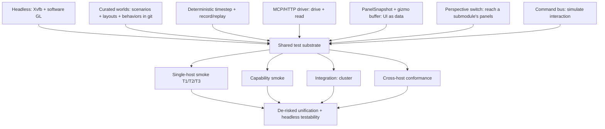
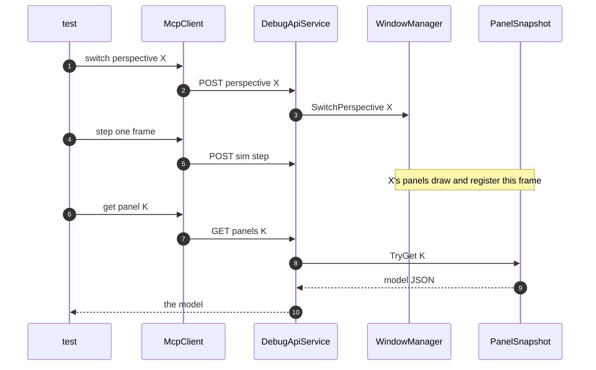
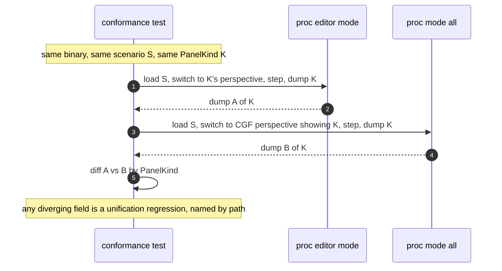
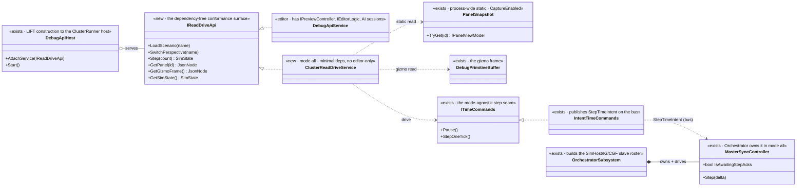
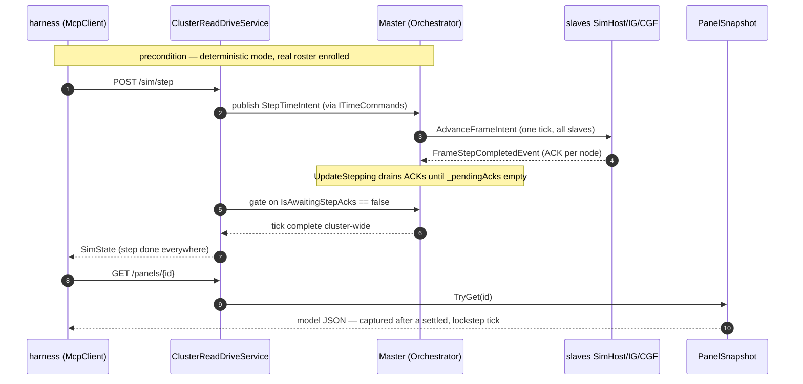

<!--STATUS
state: LIVE
build-state: DESIGN overall; ⭐ §"Step 6" (6a-6d) and §Conformance are READY-TO-BUILD (carry classDiagram + sequenceDiagram)
updated: 2026-08-24
current-answer: the whole file — the methodology AND architecture for de-risking the cross-host unification with
  FULL HEADLESS testability. Test-type taxonomy · the shared substrate · the ONE-BINARY/--mode model · the
  PERSPECTIVE-SCOPED capture protocol · cross-host conformance · the UML. ⭐ Step 6 (the API lift + the ONE
  deterministic cluster-wide stepping law both modes obey) is the current buildable front — §"Step 6". The
  procedural HOW-TO (writing tests, maintaining goldens) lives in TESTING_Harness_And_Goldens.md.
stale-below: nothing. ⚠ The 2026-08-22 version modelled conformance as "each host a separate subprocess" and the
  read-API as "add it to CGF/SimHost" — CORRECTED 2026-08-23: it is ONE binary (Hrot.ClusterRunner), --mode
  selects subsystems, and capture is perspective-scoped. ⚠ SUPERSEDED 2026-08-24: the note that the editor debug
  API steps a SteppingTimeController — measured false; the editor clock is a MasterSyncController and the
  cross-mode step seam is the StepTimeIntent bus message (§"Step 6" 6b).
design-basis: this session (2026-08-22/23) with the user. Components: DESIGN_MCP_System_Test_Harness.md ·
  DESIGN_UI_Observability_Snapshot.md · MCP_Integration.md (Groups A–T) · DESIGN_Smoke_Suite.md · the runbook
  TESTING_Harness_And_Goldens.md. Substrate proven: Editor_Headless_Xvfb.md · UX_Feature_Curated_Scenarios.md.
known-conflict: none. This is the UMBRELLA; DESIGN_Smoke_Suite.md is the "single-host smoke" COMPONENT under it.
-->
# DESIGN — **headless testability & the de-risking of cross-host unification**

> 🔴 **North star:** the unification programme is merging the editor / CGF / SimHost onto *one* implementation.
> That is risky and much of it is visual. **We need to prove, headlessly and automatically, that behaviour
> stayed the same** — across a change, and across hosts. This doc is the *architecture*; the day-to-day HOW-TO
> is the runbook **[`TESTING_Harness_And_Goldens.md`](TESTING_Harness_And_Goldens.md)**.

## The one idea

⭐⭐ **One binary, one substrate, one read model.** The editor and the cluster are the **same executable**
*(`Hrot.ClusterRunner`, `--mode` selects the subsystems)*; every test type reuses the same headless run, the same
curated worlds, and the **same dumpable models** *(panel view-models + the gizmo buffer)*. Cross-host conformance
is then *"run the binary in two modes and diff the models by `PanelKind`."* ⛔ **No pixels for the machine layer**;
pixels are a rare human backstop.

## The test-type taxonomy — what each de-risks

| type | the question | fixture | reads | de-risks | owner |
|---|---|---|---|---|---|
| **Unit** | does a class work? | xUnit | objects | logic regressions *(low yield here)* | — |
| ⭐ **Single-host layered smoke** | is one host obviously broken, sim → panel? | **in-process `EditorHarness`** *(~seconds)* | **T1** blackboard · **T2** `PanelSnapshot` model · **T3** pixels | "obviously broken after a change", fast | `DESIGN_Smoke_Suite.md` |
| ⭐⭐ **Capability smoke (system)** | does each whole-system capability work end-to-end? | **subprocess `--mode editor` over HTTP** | API responses | the system integrates | `DESIGN_MCP_System_Test_Harness.md` |
| **Integration (cluster)** | does the cluster hold together? | `ClusterRunner.Integration.Tests` | node/time/transport state | multi-node, time-sync, transport | *(existing suite)* |
| ⭐⭐⭐ **Cross-host conformance** | do editor & cluster hosts **AGREE**? | **the binary in two `--mode`s** | `PanelSnapshot` + state, by `PanelKind` | ⭐ **the unification didn't break parity** | *this doc §Conformance* |

⚠ **The tally is honest** *(CLAUDE.md's three-tier rule)*: unit tests rarely catch the real defects — the value
is the panel-model / conformance layers, which is where this methodology invests.

## The shared substrate — built once, reused by every type

| substrate piece | status | where |
|---|---|---|
| **Headless run** *(Xvfb + software GL)* | ✅ proven | `Editor_Headless_Xvfb.md` |
| **Curated worlds** | ✅ built | `UX_Feature_Curated_Scenarios.md` + layout defaults |
| **Deterministic timestep + record/replay** | ✅ built | `MCP_Integration.md` |
| **MCP/HTTP driver** | ✅ built *(Groups A–T)* | `MCP_Integration.md` |
| ⭐ **`PanelSnapshot` + `DebugPrimitiveBuffer`** | ✅ **BUILT** *(U-obs-1/2; gizmo feed U-obs-3 pending)* | `DESIGN_UI_Observability_Snapshot.md` |
| ⛔ **Perspective switch endpoint** | ⛔ **NEW — the gating gap** *(`WindowManager.SwitchPerspective` exists; no HTTP for it)* | *this doc* |
| **Command bus** *(`IEditorCommands`)* | ✅ exists; MCP exposure pending | `MCP_Integration.md` |

## ⭐⭐⭐ The architecture — one binary, one read model, perspective-scoped capture

⭐⭐ **The editor is not a separate program** — it is `Hrot.ClusterRunner --mode editor`. ⭐⭐ **`--mode all`** runs
**`orchestrator,simhost,ig,excon,cgf` — FIVE subsystems** in one process *(⚠ CORRECTED `2026-08-23`: this doc
said `--mode cluster`, which **does not exist** and throws; and it named three of the five.
📐 `HrotRunnerConfiguration.cs:104-123`)*. `PanelSnapshot` is a **process-wide static singleton**, so it is
present in *every* mode; what is editor-only today is the **`DebugApiHost` wiring** *(constructed in
`EditorSubsystem`)*. ⇒ the read-API is **lifted one level up** *(to the `ClusterRunner` host)*, not re-added per host.

```mermaid
classDiagram
    direction LR

    class ClusterRunnerFixture {
        <<one fixture, parameterised by --mode>>
        +string Mode
        +McpClient Client
        +InitializeAsync() Task
        +SwitchPerspectiveAsync(name) Task
        +DisposeAsync() Task
    }
    class McpClient {
        <<typed HTTP, direct to DebugApiHost>>
        +LoadScenarioAsync(name) Task
        +StepAsync(ticks) Task
        +ListPerspectivesAsync() string
        +SwitchPerspectiveAsync(name) Task
        +GetPanelAsync(id) JsonNode
        +GetEntityStateAsync(id) JsonNode
    }
    class DebugApiHost {
        <<exists · LIFT from EditorSubsystem to the ClusterRunner host>>
        +Route()
    }
    class DebugApiService {
        <<exists · on the sim thread>>
        +ListPanels() JsonNode
        +GetPanel(id) JsonNode
        +Perspectives() JsonNode
        +SwitchPerspective(name) JsonNode
    }
    class PanelSnapshot {
        <<exists · process-wide static singleton>>
        +bool CaptureEnabled
        +TryGet(id) IPanelViewModel
        +DumpAll() JsonObject
    }
    class WindowManager {
        <<exists>>
        +SwitchPerspective(name) void
    }
    class PerspectiveCoordinatorSystem {
        <<exists · mode all: perspective maps to submodule>>
        +string CurrentPerspective
    }
    class GoldenStore {
        <<new · Goldens/scenario/perspective.json>>
        +Compare(dump) Diff
        +Update(dump) void
    }

    ClusterRunnerFixture *-- McpClient : owns
    McpClient ..> DebugApiHost : HTTP
    DebugApiHost ..> DebugApiService : dispatches
    DebugApiService ..> PanelSnapshot : reads
    DebugApiService ..> WindowManager : NEW switch endpoint
    WindowManager ..> PerspectiveCoordinatorSystem : mode all
    ClusterRunnerFixture ..> GoldenStore : smoke compares/updates
```

### ⛔⛔ Perspective-scoped capture — a panel only snapshots when its perspective is ACTIVE

⭐⭐ Panels register to `PanelSnapshot` **only when their draw runs**, and only the **active perspective** draws.
📐 Measured: an editor reports **~11 of 47** instrumented panels captured at once. ⇒ the capture protocol:

⚠ **Required, NOT built:** `GET /perspectives` + `POST /perspective {name}` on the DebugApi. Until it exists only
the default perspective's panels are reachable ⇒ it gates cross-perspective smoke **and all conformance**.

## ⭐⭐⭐ Cross-host conformance — same binary, two modes, diff by `PanelKind`

⭐ **No golden to maintain for conformance** — the reference IS the other mode's live dump; both change together
when a feature changes, and if they DON'T, that divergence is the bug conformance exists to catch.
⭐ **Why the model layer, not pixels:** the draw is per-host; the thing being *unified* is the model-building
logic. A model diff names *what* differed; a pixel diff only says *that* it did, and drowns in font/AA noise.

⛔⛔ **The verdict is THREE-way, not two.** *"Present in editor, absent in `--mode all`"* is the **expected** state
for every feature not yet ported ⇒ a two-way diff is wrong. The verdict is **SAME · DIFFERENT · NOT-PRESENT**,
and ⭐⭐ **NOT-PRESENT is READ FROM THE CAPABILITY MANIFEST** *(charter D4)*, **never inferred from a missing
panel** — otherwise a genuinely broken panel reads as *"not ported yet"* forever. 📄 The manifest + the
perspective-scoped command routing are [`Architect_Question_54`](blueprints/Architect_Question_54_Cluster_Mcp_Contract.md);
📄 the verdict is `DESIGN_Perspective_Unification.md` §1d.

## ⭐⭐⭐ Step 6 — the lifted read+drive API, and the ONE stepping law both modes obey

> 🔒 **User, `2026-08-24`:** *"do not forget also about the goldens based tests (editor showing same stuff as
> it did before). both need to be proven to work. also lets make sure we are using the deterministic stepping
> for those tests, should tick the simulation cluster wide no matter if editor or distributed mode."*

⭐⭐ **Two requirements fall out of that, and both are DESIGN, not just test authoring:**
① the read+drive API must answer in `--mode all` *(so conformance can drive the cluster via MCP)*; and
② **every** capture — golden **and** conformance, editor **and** `--mode all` — advances the world by the
**same deterministic cluster-wide step**, never by wall-clock free-running. ⛔ A golden captured off a
free-running clock is a golden of a race.

### ⛔⛔ 6a — the lift is a DEPENDENCY SPLIT, not a move *(measured `2026-08-24`)*

> ⚠⚠ **RE-POINTED `2026-08-24` — the "one minimal `ClusterReadDriveService`" framing below is SUPERSEDED by
> [`Architect_Question_54`](blueprints/Architect_Question_54_Cluster_Mcp_Contract.md).** 📌 A single frozen
> cluster service would have to be re-split every time an editor-only feature migrates into a subsystem
> *(charter D3 — they DO migrate)*. ⭐ **The as-designed shape is a PERSPECTIVE-SCOPED DISPATCHER over
> per-subsystem `ISubsystemDebugProvider`s + a capability manifest** *(Q54-1 Option C, Q54-2 Option B)*. The
> dependency-split insight below still holds — the read surface must not carry editor-only deps — but it lands
> as *one provider per subsystem*, not one cluster service. ⛔ Build against Q54 once approved.

📐 `DebugApiService` has **editor-only** constructor deps — `IPreviewController`, `IEditorLogic`, the three AI
debug sessions — all `throw`-guarded *(EditorSubsystem.cs:1804-1833)*, so it **cannot be constructed in
`--mode all`** *(open question 2, now settled)*. ⭐⭐ **But the read+drive surface conformance needs touches
almost none of them:** `GetPanels()/GetPanel(id)` are pure static `PanelSnapshot` reads, `GetGizmoFrame()`
reads the injected `DebugPrimitiveBuffer`, and `Step()` goes through the mode-agnostic time seam below.
⇒ ⭐⭐⭐ **extract that surface behind a small interface — realised per-subsystem *(Q54)* so each subsystem
contributes its own provider as its features land, not as one monolith.**

⭐⭐ **The four wiring points the editor already has, lifted to the ClusterRunner host** *(EditorSubsystem.cs,
measured)* — ⛔ **forget the last and every `RunMain` route hangs:**

| # | point | editor site | note |
|---|---|---|---|
| ① | `PanelSnapshot.CaptureEnabled = true` | `:1782` | gated on `HROT_DEBUG_API_PORT`, same signal |
| ② | construct `MainThreadJobQueue` + `DebugApiHost`, `AttachService`, `Start` | `:1784`,`:1791`,`:1836` | attaches the **`ClusterReadDriveService`** here, not the editor one |
| ③ | per-frame `_debugApiJobQueue.DrainAll()` | `:2078` | the host loop's frame hook |
| ④ | per-frame `PanelSnapshot.ClearCaptured()` **after** the drain | `:2080` | 🔴 order matters — `HN-007` |

### ⭐⭐⭐ 6b — the stepping law: ONE `StepTimeIntent`, honoured by whichever drainer owns the clock

📐 **Measured `2026-08-24` — and it corrects a stale premise in this repo's notes:** `SteppingTimeController`
is **not** the editor's stepper *(it is unused in production — one integration test only)*. The editor's clock
is a **`MasterSyncController`** *(via `TimeControllerFactory.CreateStandalone`)*, the same class the Orchestrator
owns in `--mode all`. ⇒ ⭐⭐⭐ **there is already ONE cross-mode step seam, and it is not `ISteppableTimeController`
— it is the `StepTimeIntent` bus message** *(`ITimeCommands.StepOneTick` → `IntentTimeCommands`)*. *"Same call,
same intent, two drainers chosen by the node's role"* *(`IntentTimeCommands.cs:7-20`)*:

| mode | who drains `StepTimeIntent` | what one step becomes |
|---|---|---|
| ⭐ **editor** *(one node, empty slave roster)* | the standalone `MasterSyncController.Update()` | `Step()` locally, completes immediately *(no ACKs to wait for)* |
| ⭐⭐ **`--mode all`** *(roster = SimHost·IG·CGF)* | Orchestrator's `MasterSyncController.Update()` | `ExecuteStep` → `AdvanceFrameIntent` fan-out → each slave executes and publishes `FrameStepCompletedEvent`; the tick is **complete only when `_pendingAcks` empties** |

### ⛔⛔ 6c — two determinism hazards the harness MUST neutralise *(else "deterministic" is a wish)*

| hazard | why it bites | the design fix |
|---|---|---|
| ⭐⭐⭐ **ack-completion vs fixed sleeps** *(the CORRECTNESS one)* | the existing integration tests approximate sync with `Settle(80 frames)` + `Thread.Sleep` ⇒ flaky, and a panel read between `Step()` and the last ACK captures a **half-stepped** cluster — a golden of a race | ⭐⭐ **`POST /sim/step` returns only when the tick is acknowledged cluster-wide** — gate on `MasterSyncController.IsAwaitingStepAcks == false` *(exposed for exactly this, `MasterSyncController.cs:204`)*, not a sleep. ⭐ **Same return contract in both modes** ⇒ the harness code is identical, which is the whole conformance point. 🔴 **This one is non-negotiable** |
| ⚠ **wall-clock barrier** *(a LATENCY/flakiness one, not a correctness breaker)* | `SwitchToDeterministic` arms the barrier at `_getTick() + LookaheadWallTicks` *(200 ms default, `TimeConfig.cs:75`)*, crossed against the **physical** clock ⇒ ~200 ms per *enter-deterministic* and a reliance on real time passing | ⭐ **correctness holds without touching it:** sim time is FROZEN from the instant `SwitchToDeterministic` is called *(master `UpdateBarrierPending`; slaves freeze in `BarrierPending`)*, so the barrier window advances no state — pump-until-paused *(as the integration tests do)* is sufficient. ⭐⭐ **Zeroing `LookaheadWallTicks` is a speed/flakiness OPTIMISATION**, not a determinism fix |

⚠ **`GET /sim/state` does not expose `isAwaitingStepAcks` today** *(measured — `GetStatus` returns `simTime`/
`isPaused`/… only)*. ⇒ ⭐ either the ack-gate lives **inside** `Step()` *(preferred — one return contract)* or a
`awaitingStepAcks` field is added and the harness polls it. ⛔ **Not both.**

> ⛔⛔ **CROSS-LANE, name it:** zeroing `LookaheadWallTicks` / injecting a `tickSource` in `--mode all` means
> editing `OrchestratorSubsystem.cs` *(`TimeConfig.Default` at `:154`)* — a **TIME-lane** file *(Area H, `TM-`)*.
> ⭐ The harness batch does **not** need it for correctness *(the ack-gate + frozen barrier carry that)*, so it
> is **out of the harness lane's scope**: if the 200 ms one-time latency proves painful, it is a small TIME-lane
> follow-up, coordinated — ⛔ **not a cross-lane edit smuggled into the harness batch.**

### ⭐⭐ 6d — the goldens must be RE-PROVEN under this, not assumed

⭐ The part-C editor goldens *(`PanelGoldenRails`, `GoldenCaptureFixture`)* already drive via
`SwitchPerspectiveAndSettleAsync` → `POST /sim/step`, i.e. the seam above — but in **editor** mode. ⛔ The
user's *"both need to be proven to work"* means the conformance batch **re-runs the golden suite on the
current tree and reports it green** *(it is the editor half of the parity claim)*, and states — per obligation
③ — that its stepping is the same deterministic seam `--mode all` uses. 📌 A conformance pass that let the
editor goldens rot would be proving parity against a broken reference.

## Goldens & the per-batch obligation — see the runbook

⭐ The procedural detail — the smoke-test shape, `UPDATE_GOLDENS`, the review-the-diff rule, and the **per-batch
obligation** *(a change that alters behaviour or panel content ships its test/golden update in the SAME batch)* —
lives in **[`TESTING_Harness_And_Goldens.md`](TESTING_Harness_And_Goldens.md)**. Handoffs cite the runbook; the
coordinator verifies it on merge *(rule 8 + obligation ⑤)*.

## Component designs — who owns what

| design | owns |
|---|---|
| **`DESIGN_UI_Observability_Snapshot.md`** | the `PanelSnapshot` singleton + `IPanelViewModel` contract |
| **`DESIGN_MCP_System_Test_Harness.md`** | the subprocess capability harness *(fixture, `McpClient`, ladder)* |
| **`MCP_Integration.md`** | the API: Groups A–N + O–T *(+ the NEW perspective endpoint)* |
| **`DESIGN_Smoke_Suite.md`** | the in-process single-host smoke *(EditorHarness, T1/T2/T3, the 174)* |
| **`TESTING_Harness_And_Goldens.md`** | ⭐ the procedural HOW-TO + golden maintenance *(the runbook)* |
| *(this doc)* | the map, the taxonomy, the one-binary architecture, conformance, sequencing |

## Sequencing — dependency order *(status 2026-08-23)*

| # | step | status / gated on |
|---|---|---|
| **1** | MCP capability harness *(H1–H6)* | ✅ **BUILT** *(HN-120)* |
| **2** | `PanelSnapshot` contract + panel sweep *(U-obs-1/2/5)* | ✅ **BUILT** |
| **3** | Group T *(`GET /panels*`)* | ✅ **BUILT** *(HN-122)* |
| **4** | gizmo feed *(U-obs-3)* + smoke-suite T2 reads `PanelSnapshot` *(U-obs-4)* | ✅ **read path BUILT** — `GET /panels/_gizmo` → `GetGizmoFrame` projects the `DebugPrimitiveBuffer` |
| **5** | **`GET/POST /perspective` endpoint** *(switch capability)* | ✅ **BUILT `2026-08-24`** — net part B `N0` *(`MX-012`)* |
| **6** | ⛔⛔ **lift the read+drive API to the `ClusterRunner` host** *(answers in `--mode all`)* + **deterministic cluster-wide stepping** | ⛔ **THE CRITICAL BLOCKER, now `READY-TO-BUILD` with UML — see §"Step 6" (6a-6d).** ⭐ It is a **dependency split** *(the editor `DebugApiService` can't be constructed in `--mode all`; extract `IReadDriveApi`)*, the **four wiring points** *(6a)*, the **`StepTimeIntent` step seam** *(6b — reuse; charter D3/D4)*, and the **two determinism hazards** *(6c — `LookaheadWallTicks=0`/injected clock, ack-gated `Step()`)* |
| **7** | ⭐⭐⭐ **conformance suite** — `ClusterRunnerFixture(mode)`, two modes, diff by `PanelKind`; **+ re-prove the part-C editor goldens** *(6d)* | steps 5–6 |
| **8** | convert further panels **as touched**; pixels only for the rare tail | standing rule |

⭐ **Step 5 is DONE; the critical path is now step 6 → step 7.** 🔒 **User, `2026-08-24`:** *"run `--mode all` via MCP so you can drive it yourself; check the gizmos look the same as the editor."* ⇒ ⭐⭐ **step 6 lifts the API onto the cluster host** *(the MCP drive-it-yourself)*, **step 7 is the conformance suite** *(editor-mode vs `--mode all`, diff panels + the gizmo frame by `PanelKind`)*. ⛔ Both small; both unblocked now the net exists and gizmo membership is uniform.

## INVENTORY — the mechanisms, measured 2026-08-23

| exists? | mechanism | where |
|---|---|---|
| ✅ | headless run *(Xvfb + SW GL)* | `Editor_Headless_Xvfb.md` |
| ✅ | MCP drive+read API *(A–T)*, record/replay | `Hrot.Editor/DebugApi/` |
| ✅ | `PanelSnapshot` + 48 publishing panels | `Fdp.Diagnostics.Contracts/Panels/` |
| ✅ | in-process `EditorHarness` | `Hrot.ClusterRunner.Integration.Tests/EditorHarness.cs` |
| ✅ | `DebugPrimitiveBuffer.GetFrame()` | `Fdp.Diagnostics.Contracts/` |
| ✅ | **`WindowManager.SwitchPerspective`** · **`PerspectiveCoordinatorSystem`** *(cluster: perspective→submodule)* | `Fdp.Presentation/…/WindowManager.cs` · `Hrot.ClusterRunner/Systems/` |
| ✅ | curated scenarios/layouts/behaviors | `UX_Feature_Curated_Scenarios.md` + git |
| ✅ | **`GET/POST /perspective` HTTP endpoint** | *step 5 — BUILT (`MX-012`)* |
| ✅ | **the cross-mode step seam** — `ITimeCommands.StepOneTick` → `IntentTimeCommands` publishes `StepTimeIntent`; `MasterSyncController.Update()` drains it | `FDP/Toolkits/…/Time/{ITimeCommands,IntentTimeCommands}.cs` · `Controllers/MasterSyncController.cs:131` |
| ✅ | **the Orchestrator owns the master + builds the roster** *(SimHost·IG·CGF; ExCon excluded)* | `Hrot.Orchestrator/OrchestratorSubsystem.cs:153,289,303-317` |
| ✅ | **the ack gate** — `MasterSyncController.IsAwaitingStepAcks`; slaves ACK via `FrameStepCompletedEvent` | `Controllers/MasterSyncController.cs:204` · `SlaveSyncController.cs:411` |
| ✅ | **an in-process cluster pump** *(the conformance suite may reuse or mirror it)* | `Hrot.ClusterRunner.Integration.Tests/HrotRunnerHarness.cs` (`PumpFrames`/`PumpUntil`); `SimTimeSyncIntegrationTests` |
| ⛔ | **`IReadDriveApi` split + `ClusterReadDriveService`** *(editor `DebugApiService` can't construct in `--mode all`)* | *new — step 6a* |
| ⛔ | **the read+drive API wired at the `ClusterRunner` host** *(today only `EditorSubsystem`)* + **`LookaheadWallTicks=0`/injected clock + ack-gated `Step()`** | *new — step 6a/6c* |
| ⛔ | **`ClusterRunnerFixture(mode)` + the conformance suite + re-proven editor goldens** | *new — step 7 / 6d* |

> Method: read of the named symbols + the single wiring site *(only `EditorSubsystem` constructs `DebugApiHost`)*.
> The three ⛔ gaps are the conformance work; everything else is substrate that already exists and is reused.

## ⭐⭐⭐ Existing test mechanisms — the housekeeping verdicts *(user, 2026-08-23)*

⭐ Audit of every automated-testing mechanism, and what happens to it now the subprocess harness exists.

| mechanism | verdict |
|---|---|
| **59 xUnit projects** *(unit + per-class integration)* | ✅ **KEEP** — the unit layer |
| **MCP harness** *(`Hrot.SystemTests`, subprocess + HTTP)* | ✅ **KEEP — the go-forward spine** for system/capability/conformance |
| **`Hrot.Smoke.Tests`** *(in-process `EditorHarness`, T1/T2, gated)* | ✅ **KEEP** — the fast single-host layer. ⛔ **migrate its `EditorPanels` → `PanelSnapshot`** *(`U-obs-4`)* to kill the duplicate panel-model path |
| **JSON TestScript engine** *(`Fdp.Toolkits/Runner/Testing` + 6 `e2e_*.json`)* | ⛔ **CONVERT + RETIRE** *(user: "convert/reimplement existing json driven e2e stuff to the new harness")* — the 6 record/replay/checkpoint scripts become harness cases; the engine's e2e role ends. ⇒ ⛔ the harness's `H7` is NOT a new DSL |
| **`--mode ci` / `MinimalCIScenario`** | ⚠ **RETIRE once the harness is proven** *(user)* — ⭐ **keep ONLY if it is different or MUCH faster** than a full MCP-driven test; otherwise it goes |
| **Frame rail / ui-probe** *(pixels, T3)* | ✅ **KEEP** — the only pixel path, for the rare tail |
| **Domain goldens** *(blueprint codegen · generator · EQS)* | ✅ **KEEP** — different domains; the new panel/state goldens follow the SAME `<FAMILY>_GOLDEN_CAPTURE` env convention *(not a second mechanism)* |

### ⛔⛔⛔ A crashing / un-gateable test is a DEFECT to RESOLVE — never a permanent filter-around *(user, 2026-08-23)*

> ⭐⭐⭐ **User, verbatim:** *"if [a test] crashes it means it needs analyzing/rethinking/fixing/justified-removal,
> not generic refusal."*

📌 **The cases:** `Hrot.ClusterRunner.Integration.Tests` *(`BP-378` — 89/75/117-of-174, aborts: `MAX_ENTITIES=1M`
**per repository, one per test** → OOM; CycloneDDS `dds_take -3`; module timeouts)* and `Fdp.Presentation.Tests`
*(`BP-419` — host crashes ~18–20 cases in)*. ⛔ **They have been gated by FILTER only for ~40 batches — that is
the "generic refusal" this ruling ends.** ⇒ ⭐ **each such suite gets: root-cause analysis → FIX** *(e.g. make
`MAX_ENTITIES` test-configurable / dispose the repository between tests / fix the DDS-allocator teardown)* **→ or
a JUSTIFIED removal**, ⛔ **not indefinite avoidance.** ⚠ The subprocess harness *relieves* the e2e portion
*(fresh process per collection ⇒ no accumulation)*, but ⛔ **that does not excuse leaving the in-process suites
broken** — the ruling is about resolving them, not routing around them.

### The migration, sequenced

| # | move | note |
|---|---|---|
| **M1** | the 6 `e2e_*.json` scripts → harness capability cases | they test record/replay/checkpoint — the harness ladder already covers the shape |
| **M2** | ⛔ **fix or justify-remove `BP-378` / `BP-419`** *(the crash roots)* — not filter-forever | the user ruling above; a named remediation, its own batch |
| **M3** | smoke `EditorPanels` → `PanelSnapshot` | `U-obs-4` |
| **M4** | retire the JSON TestScript engine's e2e role · retire `--mode ci` | ⭐ **only after** the harness proves the coverage; keep `--mode ci` iff faster/different |

## Open questions (resolve with the user)

> ⭐ **Question 2 is RESOLVED `2026-08-24`** and folded into §"Step 6" 6a *(the dependency split — extract
> `IReadDriveApi`, one editor impl + one minimal `--mode all` impl)*. It stays listed below for the record.
> Questions 1 and 3 remain open for the conformance batch to answer with measurement.

1. **Conformance coverage** — which perspectives/panels first? ⛔⛔ **the earlier lean — *"the unified variable/Details/blackboard panels"* — is IMPOSSIBLE.** 📐 `2026-08-23`: those live in `Hrot/Editor/Hrot.Editor.AiShared/{Windows,Variables}`, **editor-only assemblies `--mode all` cannot host** *(and `editor` may not be combined with the cluster flags — it throws)* ⇒ following it yields an **EMPTY** comparison set. ⭐⭐ New lean: **the shared-presentation panels both hosts draw** — `Hrot/Engine/Hrot.Presentation/Panels` *(`MissionPanel` · `SpawnerPanel` · `PreviewPanel` · `DataBreakpointManagerPanel` · `ZoneEditorPanel` · `ConfigPanel` · `SharedOrbatPanel`)* and `FDP/Engine/Fdp.Presentation/ImGui/Panels`. ⚠ **And the perspective SETS are disjoint** *(editor `{Editor,BTree,HSM,Blueprint}` vs `{IG,SimHost,ExCon,CGF,StrideMock}`)* ⇒ conformance must **discover** per-mode, never assume a shared perspective name.
2. **Read-only in `--mode all`?** ⛔⛔ **the earlier lean — *"reuse the host with a read-only route filter"* — is MEASURED WRONG and does not solve this.** 📐 `2026-08-23`: `DebugApiService` has **9 required ctor params** including editor-only `IPreviewController`/`IEditorLogic`, all `throw`-guarded ⇒ **it cannot be constructed in `--mode all` at all**, and a *route* filter still needs a constructed service. ⭐⭐ **But `GetPanels()`/`GetPanel(id)` touch ZERO instance state** *(pure static `PanelSnapshot` reads; only `GetGizmoFrame` uses `_primitiveBuffer`)* ⇒ ⭐⭐⭐ **the split is by DEPENDENCY, not by verb.** New lean: extract the dependency-free handlers behind a small interface the editor service also satisfies — **one implementation of "what a panel shows"**.
3. **Conformance tolerance** — exact model equality, or a per-field ignore-list for legitimately host-specific bits *(window chrome, host name)*? *(Lean: exact by default, explicit documented ignores.)*
