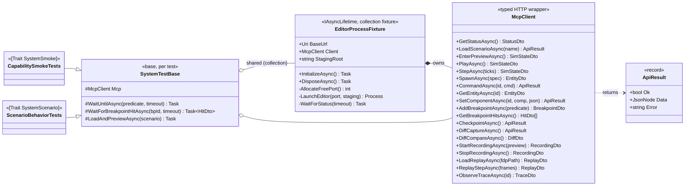
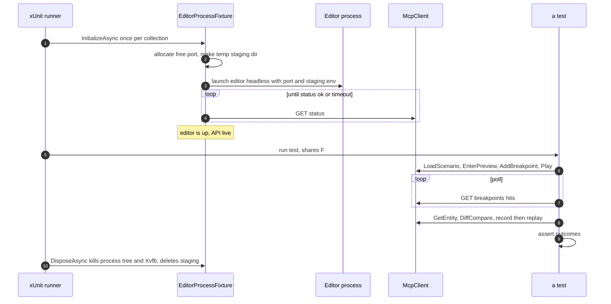

<!--STATUS
state: LIVE
build-state: BUILT (H1–H6, Batch HN-120; extended + the found defects FIXED, Batch HN-121, 2026-08-22)
updated: 2026-08-22
current-answer: §3 classDiagram + §4 sequenceDiagram remain the contract, AS AMENDED BY §9 "AS-BUILT".
  ⭐ §9 is the current truth where it differs from §3/§5 — read it before quoting a member signature or D5.
  §5 decisions D1–D11 and §6 tasks H1–H7 are the build; H7 remains out of scope.
known-rot: §3's classDiagram shows per-endpoint DTO returns (StatusDto, EntityDto, …) — the build returns
  one ApiResult envelope instead; §5 D5 says "Xvfb-wrap on Linux" — the build owns the Xvfb server directly.
  Both are corrected in §9 with the measurements that forced them. ⚠ §9 itself was AMENDED by Batch
  HN-121: /shutdown is no longer inert (teardown asks before it kills), KnownDefectRails is now
  PreviewLifecycleRails with both rails un-skipped, and the H4 ladder's two uncovered rows are closed.
known-conflict: none.
design-basis: docs/MCP_Integration.md (the wired, verified API) · docs/Editor_Headless_Xvfb.md (headless
  launch) · UX_Feature_Curated_Scenarios.md (curated worlds) · UX_Feature_Layout_Defaults.md (curated UI).
-->
# DESIGN — the MCP-driven system-test harness

> A C# harness that boots the **real editor as a subprocess** (headless), drives it through the AI-debug
> (MCP) HTTP API, and asserts on whole-system outcomes. It is **not a test of the MCP server** — it is a
> test of the *system*, through the API. Goal: the standing **smoke test for almost anything the system
> can do**, and the automatable form of the manual drive already proven in `docs/MCP_Integration.md`.

## 1. Goal & shape

| ⭐ | |
|---|---|
| **What it is** | one editor process per test-collection, launched headless (Xvfb on Linux), driven over `http://localhost:{port}/` by a typed `McpClient`; assertions in C#/xUnit. |
| **Why subprocess, not in-process** | it exercises the WHOLE stack as a real process (kernel, subsystems, API, the same path a human/agent drives). ⛔ The in-process route needs the `EditorHarness` reconciliation we deferred (`DEBT-MCP-001`) and still would not test the real process. |
| **The reproducible world** | the three curated pillars: **curated scenarios** (git → seeded on start) · **behaviors** (git) · **curated UI layout** (git, for the visual cases). Deterministic timestep + frame-exact record/replay make assertions stable. |
| **The payoff** | one always-on smoke per capability (spawn, command, watch read/write, breakpoint+hit, checkpoint/diff, record→replay, fault injection, trace), plus scenario-behaviour cases that grow with the curated set. |

## 2. INVENTORY — what already exists *(measured 2026-08-22, not assumed)*

| exists? | thing | where |
|---|---|---|
| ✅ | **43 HTTP endpoints**, wired + verified | `DebugApiHost`/`DebugApiService`; `docs/MCP_Integration.md` |
| ✅ | **enablement by env** `HROT_DEBUG_API_PORT` | `EditorSubsystem` §8b |
| ✅ | **headless launch** `xvfb-run … dotnet Hrot.ClusterRunner.dll --mode editor` | `docs/Editor_Headless_Xvfb.md` |
| ✅ | **curated scenarios** seeded on start | `CuratedScenarios`; `hill-attack`/`test-fire`/`test-move` |
| ✅ | **cross-platform staging root** (`FDP_STAGING_ROOT` or platform temp) | `OrchestrationConstants.ResolveStagingRoot` |
| ✅ | **the Node MCP server** (an alternate driver, 49 tools) | `tools/ai-debug-mcp/` |
| ❌ | **any C# harness that boots + drives the editor over the API** | — *this design* |
| ⚠ | `Hrot.ClusterRunner.Integration.Tests` runs in-process pieces; the ADA unit tests are excluded (`DEBT-MCP-001`) | — |

## 3. Architecture — the class diagram

## 4. A test run — the sequence

## 5. DECISIONS FOR REVIEW — *(recommended leans; change any before build)*

| # | decision | ⭐ lean | why / trade-off |
|---|---|---|---|
| **D1** | project location | **new `Hrot.SystemTests` project** | separate slow/Xvfb/subprocess lifecycle; ⛔ do not pollute the fast `*.Integration.Tests`. Referenced-project build gives the editor binary. |
| **D2** | process model | **subprocess** (real system) | user's requirement. In-process is faster but needs the `EditorHarness` reconciliation and tests less. |
| **D3** | port allocation | **ephemeral free port per collection** (bind `:0`, release, pass via env) | lets collections run in parallel without collision. |
| **D4** | staging root | **a temp dir per run via `FDP_STAGING_ROOT`** | isolation + recording works; cleaned on dispose. |
| **D5** | platform | **Xvfb-wrap on Linux, direct on Windows** (detect) | CI runs Linux+Xvfb; devs on Windows run direct. |
| **D6** | parallelism | **one editor per xUnit *collection*; tests in a collection share it, serial within** | editor boot is ~3–8 s; sharing amortises it. Cross-collection parallel via distinct ports. |
| **D7** | determinism | **deterministic preview timestep; assert on replay frames for exact checks** | frame-exact record/replay already proven. |
| **D8** | assertion model | **poll-with-timeout helpers** (`WaitUntil`, `WaitForBreakpointHit`) for async sim; direct asserts for sync reads | sim advances over frames; naive asserts flake. |
| **D9** | v1 scope | **the capability ladder + 1–2 scenario behaviour cases** (§6 T4/T5) | prove the spine; grow cases later. |
| **D10** | CI gating | **a separate slow lane** `[Trait("Category","SystemSmoke")]`, NOT the per-edit gate | matches the three-tier test rule; keep iteration fast. |
| **D11** | driver language | **C# `McpClient`** (not the Node server) for tests | one toolchain, typed asserts; the Node server stays the agent-facing driver. |

## 6. TASK BREAKDOWN — *(what a build would be, in order)*

| # | task | gate |
|---|---|---|
| **H1** | **`EditorProcessFixture`** — free-port alloc, temp staging, launch (Xvfb/direct), `WaitForStatus`, robust teardown (kill tree + Xvfb + tempdir). | boots + `/status` 200 + clean teardown, on Linux-Xvfb |
| **H2** | **`McpClient`** — typed methods + DTOs for every endpoint group used (lifecycle, scenario, sim, preview, entities, breakpoints, checkpoint/diff, recording, replay, trace). `ApiResult` envelope. | each method round-trips against a booted editor |
| **H3** | **`SystemTestBase`** + assertion helpers (`WaitUntilAsync`, `WaitForBreakpointHitAsync`, `LoadAndPreviewAsync`). | helpers proven by H4 |
| **H4** | **capability smoke suite** — one case each: status · scenario-load(curated) · list/get entities · preview+play advances time · **breakpoint set → play → hit** · **watch read + write a variable** · **checkpoint → mutate → diff** · **record → replay 48 frames** · **fault injection (Group L)** · **trace observe**. | all green headless |
| **H5** | **scenario behaviour cases** — e.g. load `hill-attack`, play N ticks, assert a squad entity reached a state; grows with the curated set. | ≥1 green, documented pattern |
| **H6** | **CI lane** — a separate job that installs Xvfb, builds, runs `--filter Category=SystemSmoke`. | green in CI |
| **H7** *(future, own design)* | **declarative scenario-script layer** — author flows as JSON/YAML steps+expectations run by a small driver over `McpClient`, so non-programmers write system tests. | out of this design |

## 7. Risks / notes

| ⚠ | |
|---|---|
| **Xvfb in CI** | the CI image must provide Xvfb + a GL driver *(software GL is fine — `docs/Editor_Headless_Xvfb.md`)*. |
| **Boot cost** | ~3–8 s per editor; amortised by collection-sharing (D6). Keep collections coarse. |
| **Flakiness** | only via naive timing — mitigated by poll-with-timeout (D8) and deterministic replay for exact checks. |
| **Binary path** | resolve the `Hrot.ClusterRunner` output from the referenced project, not a hard-coded path. |
| **Windows-path staging** | fixed (`ResolveStagingRoot`); the fixture still sets `FDP_STAGING_ROOT` for isolation. |
| **Not a visual test** | this asserts state/behaviour over the API. Pixel/UI verification is a separate concern (could screenshot via the running window, but out of scope here). |

## 8. Out of scope

Pixel/screenshot UI assertions · the declarative script DSL (H7) · reviving the 15 in-process ADA unit
tests (`DEBT-MCP-001` — the smoke suite here is the better gate) · multi-node/cluster tests (the editor is
single-process by design).

---

## 9. AS-BUILT — **Batch HN-120, `2026-08-22`** *(obligation ⑤: the design must reflect what was built)*

⭐ **Built at `Hrot/Runner/Hrot.SystemTests/`** *(7 files)* + `scripts/run-system-tests.sh` +
`.github/workflows/system-tests.yml`. **18 passing · 2 skipped · ~17 s** on Linux/Xvfb.
⭐⭐ **Where this section and §3/§5 disagree, THIS is current.**

### 9.1 The four deviations, and what forced each

| # | design said | built instead | ⭐ why — **measured, not preferred** |
|---|---|---|---|
| **①** | ⭐ §3: typed returns per endpoint — `GetStatusAsync() StatusDto`, `GetEntityAsync() EntityDto`, … | ⭐⭐ **every method returns one `ApiResult(StatusCode, Ok, Data, Error)`**; `StatusDto`/`SimStateDto`/`EntityRowDto`/`ReplayStatusDto` exist as records for typed reads where wanted | ⛔ **Two measurements killed the per-endpoint DTO.** ① **The payload casing is MIXED by construction**: hand-built `JsonObject`s use lowercase keys (`clusterState`), while entity dumps serialize from a DTO and keep **PascalCase** (`NetworkId`) — the host embeds each handler's payload *verbatim*. ② **Six smoke cases assert on a REJECTION** *(bad condition, unknown entity, unknown baseline, missing recording)*; a client typed to the success shape makes the negative cases the awkward path. ⇒ one envelope + case-insensitive readers |
| **②** | ⭐ §5 `D5`: *"Xvfb-wrap on Linux"* — i.e. `xvfb-run` | ⭐⭐⭐ **the fixture starts and stops the `Xvfb` SERVER itself** on a display it picks | 🔴 **Measured leak:** `xvfb-run` is a shell script that stops its Xvfb from an **EXIT trap**, and `Process.Kill` sends **SIGKILL** ⇒ the trap never runs. **Four orphaned `Xvfb` processes and four `/tmp/.X<n>-lock` files** accumulated across this session's runs — on a CI lane that is display exhaustion. ⭐ After the change: **0 orphans, 0 locks**, verified. ⭐ The *environment* is unchanged from the proven recipe *(1600x1000x24, `LIBGL_ALWAYS_SOFTWARE=1`, `GALLIUM_DRIVER=llvmpipe`)* — only the **lifetime** is owned |
| **③** | §4: teardown *"kills process tree and Xvfb"* — via a graceful stop | ⭐⭐ **ASKS first, kills second** — `POST /shutdown`, then a tree-kill if the editor is still there after 10 s | ⚠⚠ **CORRECTED `2026-08-22` (Batch HN-121).** ⛔ The original as-built said *"tree-kill only; `/shutdown` is NOT used"* because 📐 `/shutdown` was **INERT** — `EditorSubsystem` passed `() => { }` *(`HN-003`)*. ⭐ It now ends the runner's frame loop, so the editor tears down in order and the logs end with `[Runner] Shutdown complete.` ⇒ the `free(): corrupted unsorted chunks` kill artifact is gone from the normal path. ⭐ The kill stays as the fallback: teardown must never HANG on a wedged editor |
| **④** | §4: fixture *"polls `/status`"* | ⭐⭐ **polls until `/status` answers `ok` WITH A PAYLOAD** | ⛔ **A bare 200 is not readiness.** The host answers a minimal `{ok:true}` before its service is attached, and `/status`'s payload is served through `MainThreadJobQueue` ⇒ **a payload proves the editor's main loop is DRAINING JOBS** — i.e. actually ticking, which is what every case depends on |

### 9.2 Added beyond the design — **both because the harness found something**

| what | why it exists |
|---|---|
| ⭐ **`SystemSmokeFactAttribute`** — a `FactAttribute` that self-skips with a stated reason | the suite needs a real editor and, on Linux, a display server. On a host without one, a red would say *"the system is broken"* when it means *"this machine cannot host the test"*. ⚠ **Environment limits only** — a boot FAILURE still fails loudly and is never converted into a skip |
| ⭐⭐ **`PreviewLifecycleRails`** + its own collection *(a second editor)* | the harness **found a crash on its first full run** *(`HN-001`)*. A defect recorded only in a batch report is invisible by the next batch; a rail names it, carries the repro, and **becomes a live assertion the day it is fixed.** ⚠⚠ **RENAMED `2026-08-22` from `KnownDefectRails`**: `HN-001` is FIXED and both rails are **un-skipped**, so a class called *"known defects"* would have been a lie. ⭐ It keeps its own collection — a regression here still kills the editor |
| ⭐ **`ShutdownRail`** + its own collection *(Batch HN-121)* | `HN-003`'s fix needs a rail that **ends its own editor**, which no shared collection can host. ⭐ It asserts the editor answers **before** the request and is **gone after** it — otherwise "it exited" would prove nothing |
| ⭐⭐ **`VariableAddressingTests`** *(Batch HN-121)* | `MX1`'s Group O cases, and the **`HN-005`** watch case the H4 ladder owed. ⚠ **Discovery-driven** — which curated entity carries which blueprint is scenario content, so the cases FIND a blueprint-carrying entity rather than hard-coding one |

### 9.3 The `H4` capability ladder — **what is covered, and the two that are not**

⭐ **Covered (18 green):** status · curated-scenario load · entity list + dump · unknown-entity 404 ·
preview+play advancing time · discrete stepping · breakpoint set/list/remove · malformed-condition
rejection · component write + read-back · baseline capture + compare · unknown-baseline rejection ·
attribute schema *(Group L)* · trace observe · command/component catalogs · replay-surface state ·
missing-recording rejection · **hill-attack advances the assault force** *(`H5`)* · **pause holds the
world still**.

| ⚠⚠ **CLOSED `2026-08-22`, Batch HN-121** | as-built |
|---|---|
| ⭐ **"watch read + write a VARIABLE"** *(was: the Group O endpoints do not exist)* | ⭐⭐ **built and railed** — `VariableAddressingTests` reads an entity's blueprint variables by `(entity, asset, path)`, asserts the pending flag is always answered, and rejects an unknown name with its hint. ⚠ **The WRITE half is reached only by code review**: 📐 measured, no curated scenario carries a blueprint with working state *(hill-attack's one blueprint entity is `Library`-dispatch ⇒ no variables)* ⇒ **`HN-006`** |
| ⭐ **record → replay 48 frames** *(was: blocked by `HN-001`)* | ⭐⭐ **un-skipped and GREEN** — `PreviewLifecycleRails.Record_then_replay_round_trips_frames` runs the whole round trip against the real editor now that the rewind restores managed payloads |

### 9.4 Notes that change how the suite is USED

- ⭐⭐ **`ResetToIdleAsync` deliberately does NOT exit preview.** ⚠⚠ **The REASON changed `2026-08-22`:**
  it began as isolation from `HN-001` *(leaving preview aborted the editor)*, which is **fixed** — ⭐ but
  the practice stands on its own now: the shared editor is loaded once per fixture, and dropping out of
  preview between cases rebuilds the world with fresh network ids, invalidating addresses other cases
  just resolved. ⭐ Leaving preview is exercised where it belongs — `PreviewLifecycleRails`, on its own
  editor. ⚠ **The original wording, kept because the lesson survives:**
  the defect has its own rail.
- ⭐ **The world is loaded ONCE per editor**, not per case. 📌 Reloading rebuilds entities with fresh
  network ids, so a case listing entities while another's reload settles holds an id the map has already
  dropped — **a 404 that says nothing about the system.** It cost three false failures before being seen.
- ⭐ **The project IS in `IOS-IG-SimHost.sln`** *(D1 did not settle this)*. ⛔ An out-of-solution test
  project runs a **stale binary** when a run skips the build — a false green this repo has already paid
  for twice. It stays off the fast path by **trait**, not by exclusion.
- ⭐ **`H6` ships MANUAL-trigger** *(`workflow_dispatch`)*: it is **the repository's first GitHub Actions
  workflow**, and several suites carry known pre-existing reds ⇒ enabling it on every push would greet
  everyone with a red badge about someone else's change. ⭐ The file names the one-line change to arm it.
  ⚠ **"green in CI" is therefore NOT claimed** — it has never run on GitHub; the same lane is verified
  locally via `scripts/run-system-tests.sh`.
