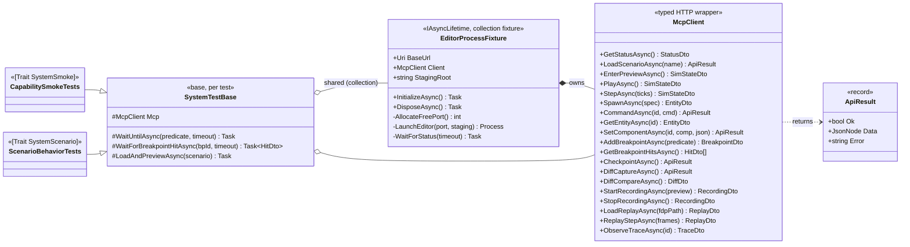

<!--STATUS
state: LIVE
build-state: DESIGN │ READY-TO-BUILD? NO — awaiting user review
updated: 2026-08-22
current-answer: the whole file — the design for a C# system-test harness that drives the REAL editor as a
  subprocess over the AI-debug (MCP) HTTP API, to smoke-test whole-system operations. NOT yet approved to
  build; §5 decisions and §6 task breakdown are what the user reviews.
known-conflict: none.
design-basis: docs/MCP_Integration.md (the wired, verified API) · docs/Editor_Headless_Xvfb.md (headless
  launch) · UX_Feature_Curated_Scenarios.md (curated worlds) · UX_Feature_Layout_Defaults.md (curated UI).
-->
# DESIGN — the MCP-driven system-test harness

> A C# harness that boots the **real editor as a subprocess** (headless), drives it through the AI-debug
> (MCP) HTTP API, and asserts on whole-system outcomes. It is **not a test of the MCP server** — it is a
> test of the *system*, through the API. Goal: the standing **smoke test for almost anything the system
> can do**, and the automatable form of the manual drive already proven in `docs/MCP_Integration.md`.

## 1. Goal & shape

| ⭐ | |
|---|---|
| **What it is** | one editor process per test-collection, launched headless (Xvfb on Linux), driven over `http://localhost:{port}/` by a typed `McpClient`; assertions in C#/xUnit. |
| **Why subprocess, not in-process** | it exercises the WHOLE stack as a real process (kernel, subsystems, API, the same path a human/agent drives). ⛔ The in-process route needs the `EditorHarness` reconciliation we deferred (`DEBT-MCP-001`) and still would not test the real process. |
| **The reproducible world** | the three curated pillars: **curated scenarios** (git → seeded on start) · **behaviors** (git) · **curated UI layout** (git, for the visual cases). Deterministic timestep + frame-exact record/replay make assertions stable. |
| **The payoff** | one always-on smoke per capability (spawn, command, watch read/write, breakpoint+hit, checkpoint/diff, record→replay, fault injection, trace), plus scenario-behaviour cases that grow with the curated set. |

## 2. INVENTORY — what already exists *(measured 2026-08-22, not assumed)*

| exists? | thing | where |
|---|---|---|
| ✅ | **43 HTTP endpoints**, wired + verified | `DebugApiHost`/`DebugApiService`; `docs/MCP_Integration.md` |
| ✅ | **enablement by env** `HROT_DEBUG_API_PORT` | `EditorSubsystem` §8b |
| ✅ | **headless launch** `xvfb-run … dotnet Hrot.ClusterRunner.dll --mode editor` | `docs/Editor_Headless_Xvfb.md` |
| ✅ | **curated scenarios** seeded on start | `CuratedScenarios`; `hill-attack`/`test-fire`/`test-move` |
| ✅ | **cross-platform staging root** (`FDP_STAGING_ROOT` or platform temp) | `OrchestrationConstants.ResolveStagingRoot` |
| ✅ | **the Node MCP server** (an alternate driver, 49 tools) | `tools/ai-debug-mcp/` |
| ❌ | **any C# harness that boots + drives the editor over the API** | — *this design* |
| ⚠ | `Hrot.ClusterRunner.Integration.Tests` runs in-process pieces; the ADA unit tests are excluded (`DEBT-MCP-001`) | — |

## 3. Architecture — the class diagram



## 4. A test run — the sequence

```mermaid
sequenceDiagram
    autonumber
    participant TR as xUnit runner
    participant F as EditorProcessFixture
    participant P as Editor process (Xvfb)
    participant C as McpClient
    participant T as a test

    TR->>F: InitializeAsync (once per collection)
    F->>F: allocate free port, make temp staging dir
    F->>P: launch (HROT_DEBUG_API_PORT, FDP_STAGING_ROOT, xvfb on Linux)
    loop until 200 or timeout
        F->>C: GET /status
    end
    Note over F: editor is up; API live
    TR->>T: run test (shares F)
    T->>C: LoadScenario -> EnterPreview -> AddBreakpoint -> Play
    loop poll
        T->>C: GET /breakpoints/hits
    end
    T->>C: GetEntity / DiffCompare / record->replay
    T->>T: assert outcomes
    TR->>F: DisposeAsync -> kill process tree + Xvfb, delete staging
```

## 5. DECISIONS FOR REVIEW — *(recommended leans; change any before build)*

| # | decision | ⭐ lean | why / trade-off |
|---|---|---|---|
| **D1** | project location | **new `Hrot.SystemTests` project** | separate slow/Xvfb/subprocess lifecycle; ⛔ do not pollute the fast `*.Integration.Tests`. Referenced-project build gives the editor binary. |
| **D2** | process model | **subprocess** (real system) | user's requirement. In-process is faster but needs the `EditorHarness` reconciliation and tests less. |
| **D3** | port allocation | **ephemeral free port per collection** (bind `:0`, release, pass via env) | lets collections run in parallel without collision. |
| **D4** | staging root | **a temp dir per run via `FDP_STAGING_ROOT`** | isolation + recording works; cleaned on dispose. |
| **D5** | platform | **Xvfb-wrap on Linux, direct on Windows** (detect) | CI runs Linux+Xvfb; devs on Windows run direct. |
| **D6** | parallelism | **one editor per xUnit *collection*; tests in a collection share it, serial within** | editor boot is ~3–8 s; sharing amortises it. Cross-collection parallel via distinct ports. |
| **D7** | determinism | **deterministic preview timestep; assert on replay frames for exact checks** | frame-exact record/replay already proven. |
| **D8** | assertion model | **poll-with-timeout helpers** (`WaitUntil`, `WaitForBreakpointHit`) for async sim; direct asserts for sync reads | sim advances over frames; naive asserts flake. |
| **D9** | v1 scope | **the capability ladder + 1–2 scenario behaviour cases** (§6 T4/T5) | prove the spine; grow cases later. |
| **D10** | CI gating | **a separate slow lane** `[Trait("Category","SystemSmoke")]`, NOT the per-edit gate | matches the three-tier test rule; keep iteration fast. |
| **D11** | driver language | **C# `McpClient`** (not the Node server) for tests | one toolchain, typed asserts; the Node server stays the agent-facing driver. |

## 6. TASK BREAKDOWN — *(what a build would be, in order)*

| # | task | gate |
|---|---|---|
| **H1** | **`EditorProcessFixture`** — free-port alloc, temp staging, launch (Xvfb/direct), `WaitForStatus`, robust teardown (kill tree + Xvfb + tempdir). | boots + `/status` 200 + clean teardown, on Linux-Xvfb |
| **H2** | **`McpClient`** — typed methods + DTOs for every endpoint group used (lifecycle, scenario, sim, preview, entities, breakpoints, checkpoint/diff, recording, replay, trace). `ApiResult` envelope. | each method round-trips against a booted editor |
| **H3** | **`SystemTestBase`** + assertion helpers (`WaitUntilAsync`, `WaitForBreakpointHitAsync`, `LoadAndPreviewAsync`). | helpers proven by H4 |
| **H4** | **capability smoke suite** — one case each: status · scenario-load(curated) · list/get entities · preview+play advances time · **breakpoint set → play → hit** · **watch read + write a variable** · **checkpoint → mutate → diff** · **record → replay 48 frames** · **fault injection (Group L)** · **trace observe**. | all green headless |
| **H5** | **scenario behaviour cases** — e.g. load `hill-attack`, play N ticks, assert a squad entity reached a state; grows with the curated set. | ≥1 green, documented pattern |
| **H6** | **CI lane** — a separate job that installs Xvfb, builds, runs `--filter Category=SystemSmoke`. | green in CI |
| **H7** *(future, own design)* | **declarative scenario-script layer** — author flows as JSON/YAML steps+expectations run by a small driver over `McpClient`, so non-programmers write system tests. | out of this design |

## 7. Risks / notes

| ⚠ | |
|---|---|
| **Xvfb in CI** | the CI image must provide Xvfb + a GL driver *(software GL is fine — `docs/Editor_Headless_Xvfb.md`)*. |
| **Boot cost** | ~3–8 s per editor; amortised by collection-sharing (D6). Keep collections coarse. |
| **Flakiness** | only via naive timing — mitigated by poll-with-timeout (D8) and deterministic replay for exact checks. |
| **Binary path** | resolve the `Hrot.ClusterRunner` output from the referenced project, not a hard-coded path. |
| **Windows-path staging** | fixed (`ResolveStagingRoot`); the fixture still sets `FDP_STAGING_ROOT` for isolation. |
| **Not a visual test** | this asserts state/behaviour over the API. Pixel/UI verification is a separate concern (could screenshot via the running window, but out of scope here). |

## 8. Out of scope

Pixel/screenshot UI assertions · the declarative script DSL (H7) · reviving the 15 in-process ADA unit
tests (`DEBT-MCP-001` — the smoke suite here is the better gate) · multi-node/cluster tests (the editor is
single-process by design).
