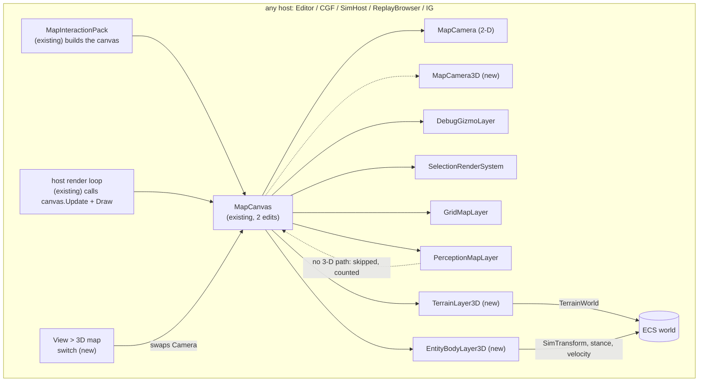
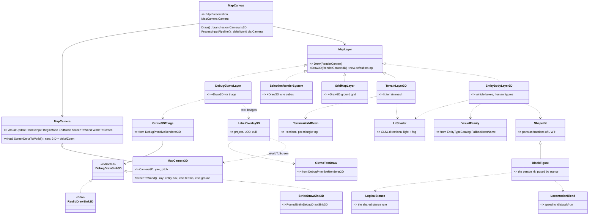
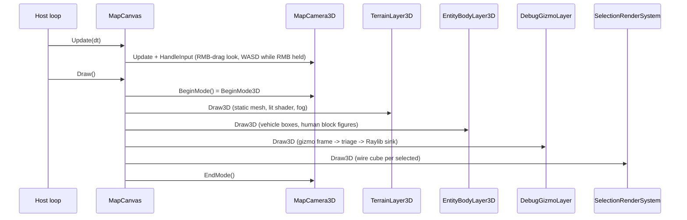
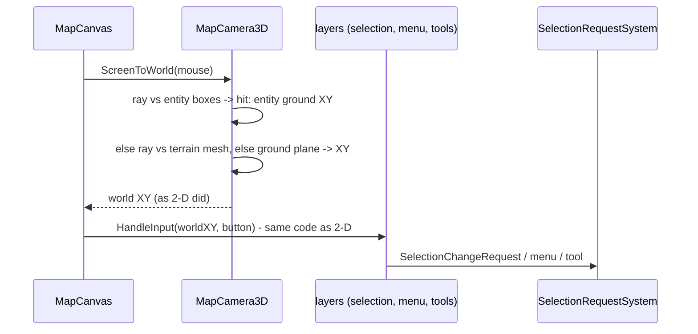
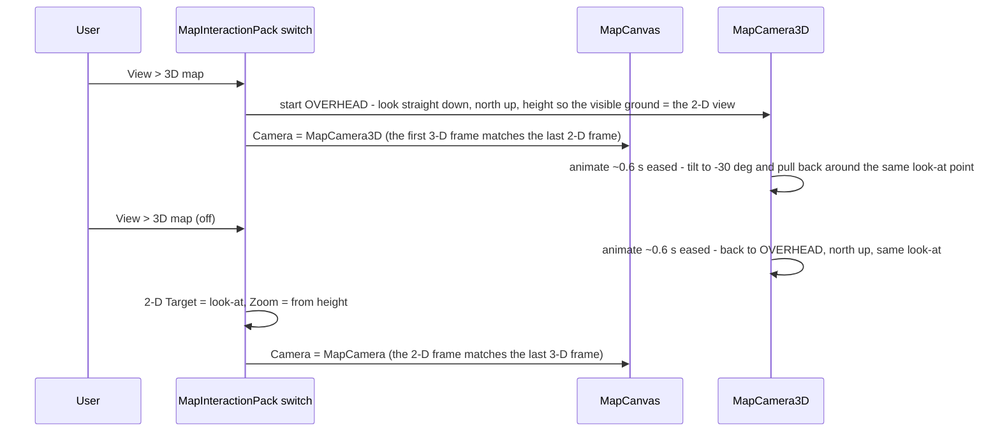
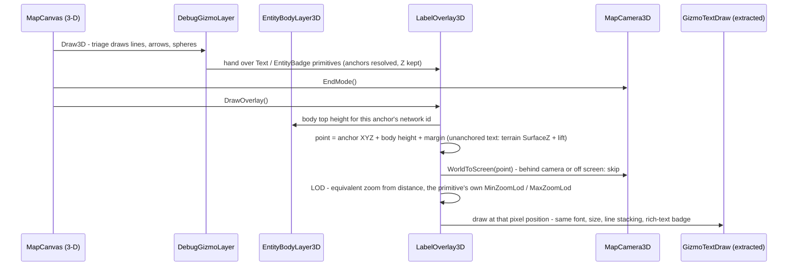

<!--STATUS
state: LIVE
build-state: DESIGN — approach chosen by the user (U13: alternative B, a 2-D/3-D switch on the existing map); the
  leans in §5 await approval before S1. Nothing built.
updated: 2026-10-10 (rev 5 — U18: vehicles and aircraft as multi-part SHAPE KITS (M7), one visual-family classifier shared with the icons. Rev 4 — U17: M10 APPROVED, one camera entity; U16: §3.4 labels in 3-D, M13. Rev 3 — U15: every map host gets 3-D; the switch is an ANIMATED camera transition (M12); M10 restated: one
  camera entity for the map in both modes. Rev 2 — U14: block figures)
current-answer: §1 what the user asked · §3 the module / class / sequence diagrams · §4 the reuse ledger · §5 decisions
  with leans · §6 slices · §7 what is NOT verified.
stale-below: nothing.
known-rot: none.
known-conflict: none. It REPLACES DESIGN_Godot_3D_Viewer.md as the current approach; that file is DEFERRED, not
  withdrawn (U13: "put godot aside but keep its design as deferred").
related-designs:
  - DESIGN_Map_Rendering_And_Interaction.md — owns MapCanvas, IMapLayer, the render frame (§2.3) and the input chain
    (§3) this design extends with a camera subclass and a 3-D draw path; its "dumb terminal" rule holds in 3-D.
  - DESIGN_Godot_3D_Viewer.md — DEFERRED: the Godot-process alternative, the twenty requirements V-01..V-20 this file
    answers, and the user rulings U1..U12.
  - DESIGN_Terrain_World.md — owns TerrainWorld and TerrainWorldMesh; this file adds an optional per-triangle tag
    output to the mesher (the navmesh output stays byte-identical).
  - DESIGN_Stride_Node_Modes.md — owns §8, the 3-D gizmo triage in DebugPrimitiveRenderer3D, which this file EXTRACTS
    into shared code both Stride and the 3-D map use.
  - UX/UX_Feature_Selection.md — owns UXI-11; picks in 3-D reach the one store through the unchanged input chain.
  - designs/gizmos-1/DESIGN.md — owns the primitive stream and §10 context menus; both are reused unchanged in 3-D.
  - DESIGN_Building_Interiors.md — owns wall panels, openings, materials; the 3-D terrain colours by its materials.
-->

# DESIGN — a 3-D mode for the map

## Headline

⭐ **The existing map gets a 2-D / 3-D switch.** Same window, same `MapCanvas`, same layers, same selection, same
context menu, same tools — in 3-D the camera is a `MapCamera3D` subclass and each layer draws through an optional 3-D
path. Built on the Raylib the hosts already run. Godot is deferred.

| in 3-D | |
|---|---|
| terrain | lit, colour-shaded polygons from `TerrainWorld` (ground, surfaces, water, roads, buildings by material); textures later |
| entities | **shape kits** — each kind of entity is a few boxes, cylinders and wedges scaled to its TKB size: tank, APC/IFV, car, truck, helicopter, jet; humans as **Minecraft-style block figures** posed by stance |
| interaction | click-select, right-click menu, tools — through the **unchanged** input chain |
| gizmos | the 3-D subset of the gizmo stream (lines, arrows, spheres, semantic shapes) — fire traces and detonations included |
| camera | Unity-style free camera; an **animated** 2-D ↔ 3-D transition (M12); the camera entity (V-12..V-15, M10) |
| hosts | ⭐ **every host that has the 2-D map**: Editor, CGF, SimHost, ReplayBrowser, IG — one wiring site, `MapInteractionPack` |

---

## 1. What the user asked — `2026-10-10`

| # | 🔒 user | consequence |
|---|---|---|
| **U12** | *"check alternative idea of building own simple in-process 3d viewer … simple planes, boxes, human as cylinder (horizontal if prone, lower if crouched) … with imgui on top for menus?"* | measured in `DESIGN_Godot_3D_Viewer.md` §8 — lean B |
| **U13** | *"The internal 3d solution could be switchable 2d/3d instead of current 2d only map so no new 3d window would be required. I think we should focus on B … Lets put godot aside (but keep its design as deferred). We need the simple renderer to handle the terrain geometry, use lighting color shaded polygons to give it some usable feeling of a real world, if not some freely available texture pack."* | ⭐ this file: a **mode of the map**, not a window; **lit, colour-shaded terrain**; textures as a later slice |
| **U15** | *"Every host having the 2d map will get simple 3d, correct? Not just IG. … The current 2d map can be switched to 3d view and back (some camera animation between 2d camera and 3d camera or something)."* | ✅ yes, all five map hosts (S6). ⭐ M12: the switch is an animated camera move, not a cut |
| **U18** | *"Vehicles and aircraft should be also composed of multiple pieces to resemble what they are in real world, still cheap."* | ⭐ M7 rewritten: **shape kits** (§3.5), chosen by one visual-family classifier the icons already use |
| **U16** | *"The 3d entities will need some label system so that we can show various texts provided by gizmos. So far gizmos were using 2d text, how to adapt to text for entities in 3d?"* | ⭐ §3.4 + M13: the same text primitives, projected; one overlay pass |
| **U17** | *"ok one camera entity."* | ✅ M10 approved |
| **U14** | *"Human characters as simple as in minecraft would be a bit nicer and still feasible i guess."* | ⭐ M7 rewritten: a **six-box figure**, stance poses blended by the transition, limb swing from speed |

The requirements V-01..V-20 live in `DESIGN_Godot_3D_Viewer.md` §1. ⭐ What changes under U13: **V-09** (own window) →
the map's own area, switched; **V-17** holds (render only); **V-18** (network) → an IG node with the map in 3-D;
**V-03/V-04** → primitives (U5/U12).

---

## 2. INVENTORY — measured `2026-10-10`, branch `ui` (graph + grep; `check_index_coverage` not run)

| query | total | what it settled |
|---|---|---|
| `search_graph(name_pattern="^(MapCanvas\|MapCamera\|IMapLayer\|…)$")` | **17** | `MapCanvas` (`Fdp.Presentation/Vis2D/MapCanvas.cs:12-265`), `MapCamera` (`…/Components/MapCamera.cs:13-383`), `IMapLayer`, `TerrainWorldMesh` |
| `search_graph(relationship=IMPLEMENTS, name="IMapLayer")` + grep | **6 / 6** | production layers: `GridMapLayer`, `DebugGizmoLayer`, `SelectionRenderSystem`, `PerceptionMapLayer` (+2 in `FDP/Examples`) |
| grep `MapInteractionContext` constructors | **5 hosts** | Editor, CGF, SimHost, ReplayBrowser, IG all build the map through `MapInteractionPack` |
| grep `BeginMode3D\|Camera3D\|DrawCube(` in `Hrot/ FDP/` | **0** | ⛔ no 3-D Raylib code exists yet |
| restored `Raylib-cs 7.0.2` / `rlImGui-cs 3.2.0` assemblies | — | 3-D API present (`BeginMode3D`, `DrawCylinderEx`, `DrawCubeWires`, `DrawMeshInstanced`, `UploadMesh`, `GetScreenToWorldRay`, `GetRayCollisionBox/Mesh`, `LoadRenderTexture`) |
| grep TKB dimension fields | **3 types** | `VehicleParametersDto` L/W, `SimVehicleDef` L/W/H, `StaticObstacleDto` L/W/H; ⛔ none for infantry |

---

## 3. THE ARCHITECTURE

### 3.1 Modules — who builds, who ticks, what is dead in 3-D

*What the picture shows that prose hid:* **no new composition root and no new tick** — the host loop that draws the
2-D map draws the 3-D one; the pack that builds the 2-D canvas builds both cameras and the two new layers.
`PerceptionMapLayer` has **no 3-D path** in slice 1 — drawn as a dead edge so its absence is visible, not silent.

### 3.2 Classes — existing (with file) vs new

*What it shows:* the 3-D mode is **one camera subclass, two layers, one shader and one sink**; everything else is an
existing class gaining one method. The gizmo triage gets a **second sink, not a second interpreter** — Stride and the
map share it.

### 3.3 Sequences

**A 3-D frame — the same frame, a different branch**

**A click in 3-D — the input chain is unchanged**

**Switching 2-D ↔ 3-D — an animated camera move, not a cut (M12)**

*What it shows:* the 2-D map **is** a 3-D camera looking straight down. Both swaps happen at that overhead pose, so
neither one jumps; the tilt in between is ordinary camera animation. The only thing that changes at the swap is what
is drawn (2-D symbols ↔ 3-D bodies), and the motion masks it.

### 3.4 Labels in 3-D — the same gizmo text, projected *(U16)*

📐 Measured `2026-10-10` in `DebugPrimitiveRenderer2D.cs`: ⭐ **every gizmo text is already a constant-PIXEL label at a
world point** — *"All gizmo text is rendered at a constant on-screen pixel size regardless of camera zoom"* (`:390`);
badges are already drawn in screen space after `GetWorldToScreen2D` (`:437-447`); stacked lines use a pixel offset
(`LineOffsetPx`, `:413-429`); the anchor cache already keeps **Z** (`:58-69`). ⇒ In 3-D only the **world → screen** step
changes; the text drawing itself is reused.

*What it shows:* gizmo authors change **nothing** — the same `Text` / `EntityBadge` primitives. The 3-D mode adds one
overlay pass after the 3-D pass; the drawing code is the 2-D renderer's screen-space branch, extracted so both modes call it.

### 3.5 Shape kits — what each kind of entity looks like *(U18)*

📐 Measured `2026-10-10`: ⭐ the question *"what kind of thing is this type"* is **already answered once**, for the
icons — `EntityTypeCatalog.FallbackIconName` (`EntityTypeCatalog.cs:128-143`) maps DIS kind / domain / category (or
being a composite unit) to a family: person, tank, AFV, wheeled, unit. ⇒ that logic is **extracted** into one
`VisualFamily.Of(TkbTemplate)`; the icon fallback and the 3-D kit choice both call it.

| family *(DIS)* | built-in types today | kit — parts, as fractions of the type's L × W × H |
|---|---|---|
| **person** *(kind 3)* | Rifleman, InfantrySoldier, Grenadier, MortarTeam, Insurgent, CivilianPedestrian | the six-box block figure; **rifle** part for soldiers (category 1), none for civilians |
| **tank** *(1.1, cat 1)* | M1 Abrams, T-72 | lower hull · two track blocks (dark) · turret box set back · barrel cylinder forward |
| **AFV / APC** *(1.1, cat 2)* | Bradley, MilitaryAPC | hull with a sloped front wedge · tracks or wheels (dark) · small turret · thin barrel |
| **wheeled — car** *(1.1, cat 81)* | CivilianCar | lower body · cabin (glass) · four wheels (roll with speed) |
| **wheeled — utility** *(1.1, cat 3/6/7)* | HMMWV | wide low body · cab (glass) · rear bed · four wheels |
| **helicopter** *(air)* | ⛔ none in the built-in TKB | fuselage · tail boom · tail fin · main rotor blades (spin) · tail rotor · skids |
| **fixed wing** *(air)* | ⛔ none in the built-in TKB | fuselage cylinder + nose cone · swept wing slab · two fins · canopy (glass) |
| **unit** *(composite)* | tank platoon, infantry squad | **no body** — its members are entities and draw themselves; its symbol shows as a label |
| unknown | — | one box, the TKB size |

⭐ **Cost:** 6–12 parts per vehicle, each one draw of a shared unit mesh through the lit shader — hundreds of vehicles
stay cheap; instancing per part shape is the later lever. ⭐ **Size:** length / width / height from
`VehicleParametersDto` / `SimVehicleDef`; a per-family default where the TKB has none. ⭐ **Motion is presentation
only** — rotor spin from time, wheel roll from speed; the turret follows the hull (no aim component is read).
⛔ **Air:** the kits are built and railed, but **no built-in type is in the air domain**, and the DIS air category numbers
for helicopter vs fixed wing are **not yet confirmed** against SISO-REF-010 — settled when the first air type is added.

---

## 4. THE REUSE LEDGER

| piece | verdict | evidence |
|---|---|---|
| `MapCanvas` — layers, input routing, right-drag vs right-click | ✅ reused; **2 edits**: `Draw()` branches to `Draw3D` when the camera is 3-D; `deltaWorld` comes from the camera instead of `delta / Zoom` (2-D result unchanged) | `MapCanvas.cs:115-140` (Draw), `:168` (`deltaWorld = delta * (1/Camera.Zoom)`) |
| `MapCamera` | ✅ reused as the base — its `Update`, `HandleInput`, `BeginMode`, `EndMode`, `ScreenToWorld`, `WorldToScreen` are already `virtual` | `MapCamera.cs:144-354` |
| `IMapLayer` | ✅ + one **default** method `Draw3D` (no-op) — no existing layer is forced to change | `CoreInterfaces.cs:37-92` |
| `DebugGizmoLayer`, `SelectionRenderSystem`, `GridMapLayer` | ✅ + a `Draw3D` each | — |
| the whole input side: selection store + request, `ContextMenuAdapter`, tools | ✅ **unchanged** — they receive world XY as today | §3.3 |
| `MapInteractionPack` | ✅ builds the 3-D camera and the two new layers for all five hosts | 5 host call sites |
| `DebugPrimitiveRenderer3D` triage + `IDebugDrawSink3D` | 🔁 **extract** to a shared net8 assembly; Stride keeps its sink, the map adds a Raylib sink | `Stride/Hrot.Stride.Core/DebugPrimitiveRenderer3D.cs:50-292,373-392` |
| `TerrainWorldMesh.Build` | ✅ + an **optional** per-triangle tag output (ground / surface / roof / wall / slab + material) — verts and indices unchanged, so the navmesh is unaffected | `TerrainWorldMesh.cs:31` |
| fire / detonation visuals | ✅ **free in S3** — `FireTraceGizmo` / `DetonationGizmo` already emit 3-D lines and spheres | gizmo sweep 2026-10-10 |
| vehicle sizes | ✅ `VehicleParametersDto` / `SimVehicleDef` | TKB |
| stance | ✅ `LogicalStance.Of` for the pose; `StanceStatus.Phase` / `TransitionProgress` to blend into it | `Tkb/Domain/StanceComponents.cs:58,82` |
| `LocomotionBlend` (speed → idle/walk/run weights, pure `System`) | 🔁 **extract** beside the gizmo triage — drives the limb swing | `Stride/Hrot.Stride.Animation/LocomotionBlend.cs:99-145` |
| 2-D renderer's screen-space text + badge drawing | 🔁 **extract** to `GizmoTextDraw` — the 2-D screen-space branch and the 3-D overlay both call it | `DebugPrimitiveRenderer2D.cs:388-447` |
| icon fallback's "what kind of thing is this type" | 🔁 **extract** to `VisualFamily.Of` — the icons and the 3-D kits both call it | `EntityTypeCatalog.cs:128-143` |
| `MapCamera3D`, `TerrainLayer3D`, `EntityBodyLayer3D`, `LabelOverlay3D`, `ShapeKit` + the kit table, `BlockFigure` (the six-box pose math, unit-tested), `RaylibDrawSink3D`, the lit shader, the switch | 🆕 new | — |

---

## 5. DECISIONS

| # | decision | ⭐ lean | rejected — one line each |
|---|---|---|---|
| **M1** | where 3-D lives | ⭐ a **mode of the existing map** (U13) — camera swap + `Draw3D` | a separate panel/window — a second map, second input chain |
| **M2** | 3-D input | ⭐ `MapCamera3D.ScreenToWorld` = ray → entity box (→ that entity's ground XY) → terrain → ground plane; every layer keeps its 2-D input code | 3-D-specific input per layer — rewrites selection, menus and tools |
| **M3** | 3-D drawing | ⭐ `IMapLayer.Draw3D` default no-op; layers opt in; `PerceptionMapLayer` skipped and **counted** | a parallel 3-D layer list — two lists to keep in step |
| **M4** | terrain mesh | ⭐ extend `TerrainWorldMesh` with optional tags; the renderer adds what navigation does not need (water surface, surface colours, road ribbons) beside it | a second mesher for rendering — duplicates prisms/walls/slabs |
| **M5** | lighting | ⭐ **one small GLSL shader** (330): vertex colour × (ambient + sun·N), distance fog to a sky colour; flat normals by un-indexing triangles | CPU-baked vertex lighting — entities rotate, so it would need re-baking every frame |
| **M6** | textures | ⭐ a later slice: **CC0** packs only, mapped in the shader from **world position** (triplanar) so the mesh needs no UVs | UV-unwrapping terrain — work the triplanar trick avoids |
| **M7** | entities | ⭐ **shape kits** (§3.5): a kit is a short list of parts (box / cylinder / cone / wedge) placed as fractions of the type's length, width and height, each with a colour role (body = side colour, dark, glass, metal) and an optional cheap motion (rotor spin, wheel roll, limb swing). The kit is chosen by **one visual-family classifier** extracted from the icon fallback. **Humans are the person kit** — the six-box block figure (U14), posed by the shared stance rule `LogicalStance.Of` (`StanceComponents.cs:82`), blended by `StanceStatus.TransitionProgress`, limbs swinging via `LocomotionBlend.FromSpeed`; a rifle part when the entity is a soldier (DIS life form, category 1), none for civilians | one box per vehicle (rev 1) — U18 · real models — U12 · a second classifier for 3-D — the icon fallback already answers "what is this type" · showing `StanceStatus.CurrentStance` alone — would disagree with `LogicalStance` readers |
| **M8** | free camera | ⭐ Unity scene view: **RMB-drag** look, **WASD/QE only while RMB is held** (so tools keep their keys), wheel dolly, MMB pan, **F** frames the selection; right-**click** stays the context menu (the canvas already tells drag from click) | always-on WASD — collides with tool keyboard input |
| **M9** | coordinates | ⭐ one transform: HROT `(x, y, z)` → Raylib `(x, z, −y)`, quaternion `(x, y, z, w)` → `(x, z, −y, w)` (det +1, no flip) | — |
| **M10** | the camera entity (V-12..V-15) — **what it stores** | ✅ **APPROVED (U17): one camera entity for the map, in both modes**: look-at point, distance, yaw, pitch and the mode. The 2-D map is simply that camera at pitch −90°, north up. An ordinary spatial entity (U7), owned by the host, saved with the scenario, created on the first camera move — so a saved scenario reopens the map where it was looking, in the mode it was in | 3-D pose only (rev 2's lean) — two camera states for one map · no entity at all — simpler, but drops V-12's "saveable to scenario" |
| **M11** | network viewer (V-18) | ⭐ an IG node with the map in 3-D — nothing extra | a dedicated viewer node — IG already is one |
| **M12** | the 2-D ↔ 3-D switch (U15) | ⭐ an **animated camera move** pivoting at the overhead pose (§3.3): both swaps happen where 2-D and 3-D look the same | a hard cut — the user asked for animation · morphing orthographic into perspective — needless; overhead perspective at matched height is close enough |
| **M13** | labels in 3-D (U16) | ⭐ a screen-space `LabelOverlay3D` pass after the 3-D pass: the existing `Text` / `EntityBadge` primitives, anchors resolved with Z, lifted to the top of the entity's 3-D body, projected by `MapCamera3D.WorldToScreen`, drawn by the 2-D renderer's screen-space text code (extracted, one implementation). Far labels hide by the primitives' own `MinZoomLod` / `MaxZoomLod`, using an equivalent zoom = pixels per metre at the label's distance. Drawn always on top first (name-tag style); hiding labels behind buildings by a ray test is a later option; decluttering overlaps later | 3-D text meshes (billboarded geometry in the scene) — a second text renderer, unreadable at distance · a new label primitive — every gizmo would have to change |

---

## 6. SLICES

| slice | delivers | proves |
|---|---|---|
| **S1** | `MapCamera3D` + the animated switch (Editor); `TerrainLayer3D` from `TerrainWorldMesh` as-is, one colour per kind, lit shader + fog; `EntityBodyLayer3D` with `VisualFamily` + the shape kits for every built-in type (static) and block figures in their three stance poses; free camera; **Xvfb screenshot of the editor in 3-D on `test-town`** | the render path, the shader on the cloud's software GL, M8 |
| **S2** | `ScreenToWorld` ray picking; `deltaWorld` through the camera; `SelectionRenderSystem.Draw3D` wire cubes | select, context menu and tools work in 3-D unchanged |
| **S3** | triage extracted (Stride re-pointed, its compile gate green); `DebugGizmoLayer.Draw3D` with skip counters; **labels**: `GizmoTextDraw` extracted, `LabelOverlay3D` with projection + LOD | gizmos, fire traces, detonations and gizmo text in 3-D (U16) |
| **S4** | mesh tags; colours by surface and material; water; road ribbons from the road network; **things come alive**: stance blending + limb swing (`LocomotionBlend` extracted), wheel roll, rotor spin | "a usable feeling of a real world" (U13), U14 |
| **S5** | camera entity — create, follow, scenario save | V-12..V-15 |
| **S6** | all five hosts through `MapInteractionPack` | V-01, V-18 (IG) |
| **S7** | CC0 textures, triplanar | U13's texture wish |

⭐ Gates per slice: the touched suites + the map's own rails (T-1), a frame rail per R-124, and the Xvfb screenshot.

---

## 7. NOT VERIFIED — say so before it is built on

| claim | how it is settled |
|---|---|
| ⚠ the lit shader compiles and runs on the hosts' GL and on the cloud's software GL (Mesa llvmpipe) | S1's screenshot |
| ⚠ 3-D frame cost inside the host frame (terrain mesh + a few hundred entities) | S1, measured on Windows and in the cloud |
| ⚠ an entity box hit returning that entity's ground XY lands inside its 2-D pick box for every entity kind | S2 rail per kind |
| ⚠ which CC0 texture pack — ambientCG / Poly Haven are CC0 by their own terms; specific textures and repo size not chosen | S7, with a licence table |
| ⚠ the 3-D pass must accept primitives that target `PipelineTarget.Map2D` (the 2-D renderer filters on it, `DebugPrimitiveRenderer2D.cs:93`; `Viewport3D` is declared and read by nobody) — otherwise every label is filtered out | S3 rail |
| ⚠ the overhead perspective camera at matched height looks close enough to the 2-D map at the swap (tall buildings lean slightly at the edges) | S1 screenshot pair |
| ⚠ every built-in TKB type maps to a non-`unknown` family (units excepted) — and the icon fallback's output is unchanged by the extraction | S1 rail over the whole catalog |
| ⚠ DIS air categories for helicopter / fixed wing | when the first air type is added |
| ⚠ IG humans stand upright until IG ingests stance (`CE-2121` "IG ingress open") | S6 |
| ⚠ `LogicalStance.Of` and `StanceStatus` are present on every host's entities (they are `NoScenario` runtime components; the Editor may not run the stance systems) — no stance ⇒ standing, as the rule itself says | S1 rail |
