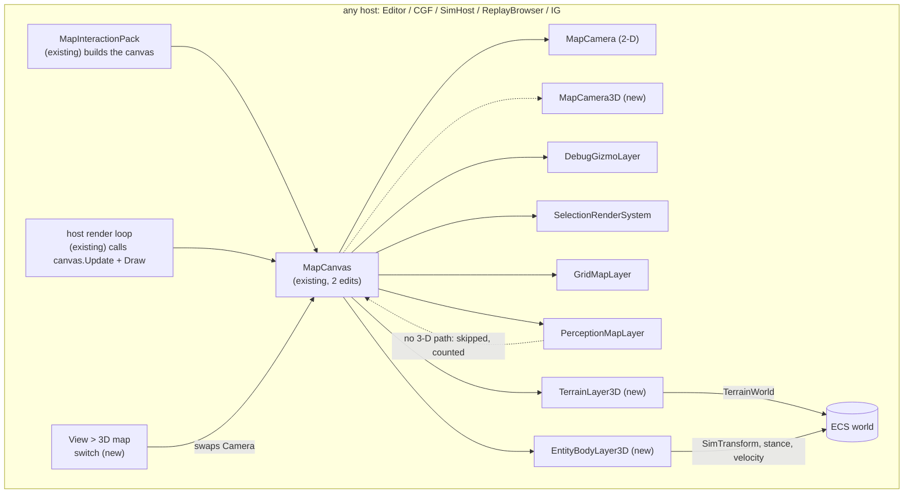
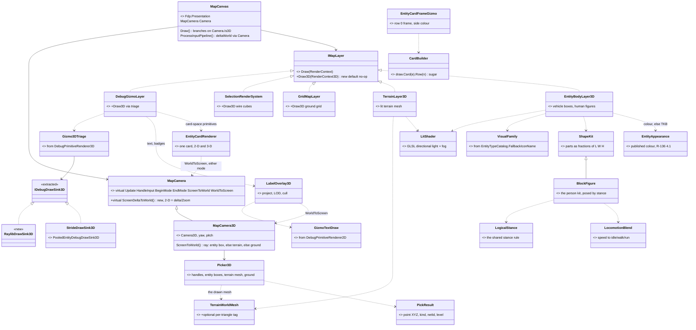
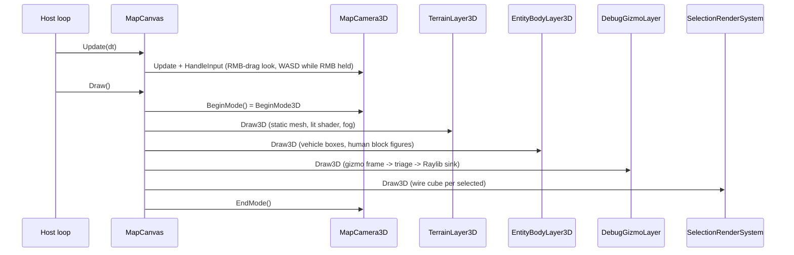
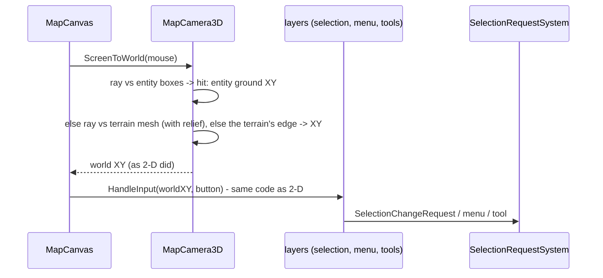
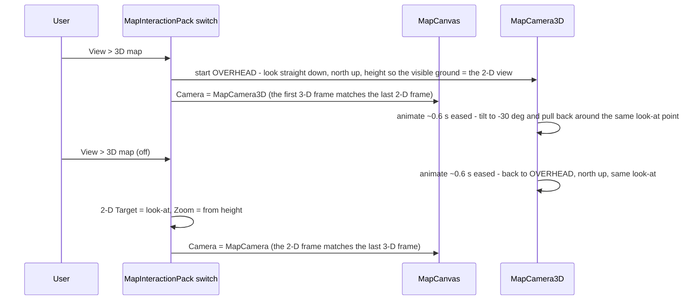
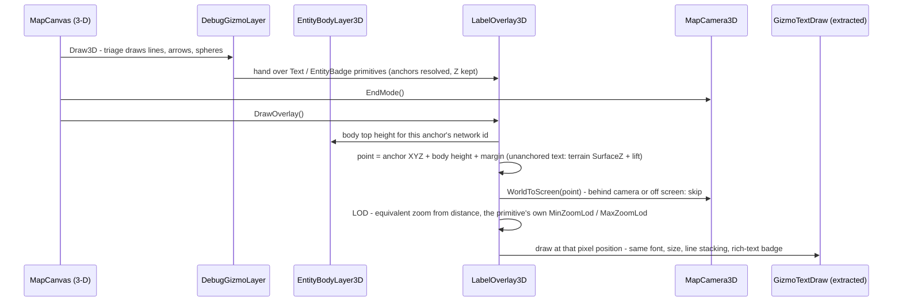
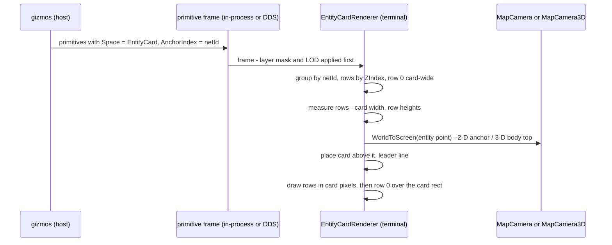
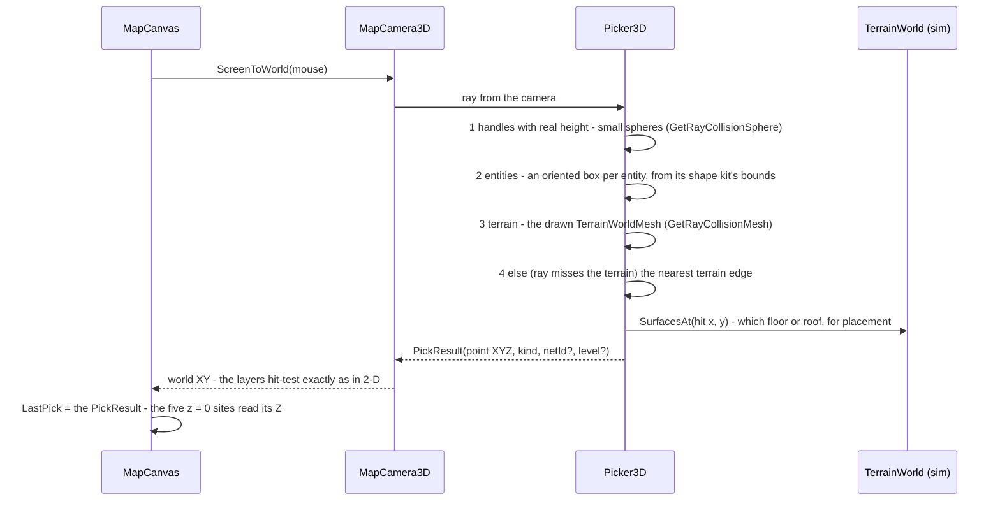
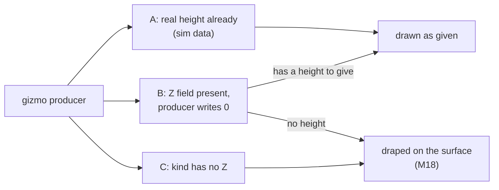
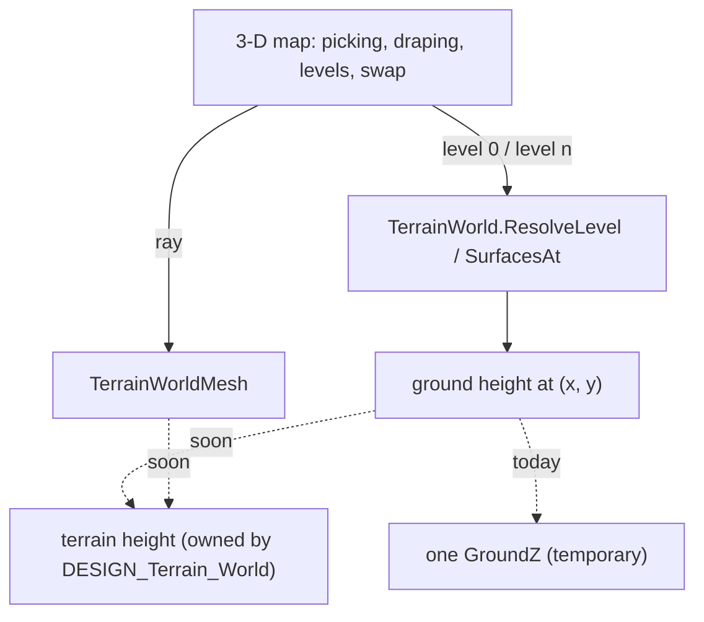

<!--STATUS
state: LIVE
build-state: READY-TO-BUILD for S1 — ALL leans M1–M22 APPROVED (U21, U22, U23, 2026-10-10). Nothing built.
updated: 2026-10-10 (rev 10 — U23: M17–M22 approved; terrain is NEVER assumed flat (R-248) — draping follows the surface
  (subdivided), "level 0" = the ground surface at each point, areas keep a LEVEL not a height, §3.10. Rev 9 — U22: M15 approved and reshaped on the affiliation pattern (§3.7); §3.9 height in gizmos and
  areas (M21, M22); M16 counts THREE palettes; §3.8's "no code" claims for measurement / area authoring corrected. Rev 8 — U21: leans APPROVED; §3.8 picking, handles and 3-D-aware tools (M17–M20); cards unclickable. Rev 7 — U20: the card is a small CANVAS any gizmo draws into, created on first use, no header/bar shapes —
  §3.6 and M14 rewritten. Rev 6 — U19: §3.6 the entity CARD as a new anchoring mode (M14), §3.7 entity colour under R-136 (M15), one
  side palette (M16). Rev 5 — U18: vehicles and aircraft as multi-part SHAPE KITS (M7), one visual-family classifier shared with the icons. Rev 4 — U17: M10 APPROVED, one camera entity; U16: §3.4 labels in 3-D, M13. Rev 3 — U15: every map host gets 3-D; the switch is an ANIMATED camera transition (M12); M10 restated: one
  camera entity for the map in both modes. Rev 2 — U14: block figures)
current-answer: §1 what the user asked · §3 the module / class / sequence diagrams · §4 the reuse ledger · §5 decisions
  with leans · §6 slices · §7 what is NOT verified.
stale-below: the HISTORY heading at the end (rev 6's CardHeader/CardBar card).
known-rot: none.
known-conflict: none. It REPLACES DESIGN_Godot_3D_Viewer.md as the current approach; that file is DEFERRED, not
  withdrawn (U13: "put godot aside but keep its design as deferred").
related-designs:
  - DESIGN_Map_Rendering_And_Interaction.md — owns MapCanvas, IMapLayer, the render frame (§2.3) and the input chain
    (§3) this design extends with a camera subclass and a 3-D draw path; its "dumb terminal" rule holds in 3-D.
  - DESIGN_Godot_3D_Viewer.md — DEFERRED: the Godot-process alternative, the twenty requirements V-01..V-20 this file
    answers, and the user rulings U1..U12.
  - DESIGN_Terrain_World.md — owns TerrainWorld and TerrainWorldMesh; this file adds an optional per-triangle tag
    output to the mesher (the navmesh output stays byte-identical).
  - DESIGN_Stride_Node_Modes.md — owns §8, the 3-D gizmo triage in DebugPrimitiveRenderer3D, which this file EXTRACTS
    into shared code both Stride and the 3-D map use.
  - UX/UX_Feature_Selection.md — owns UXI-11; picks in 3-D reach the one store through the unchanged input chain.
  - designs/gizmos-1/DESIGN.md — owns the primitive stream and §10 context menus; both are reused unchanged in 3-D.
  - DESIGN_Building_Interiors.md — owns wall panels, openings, materials; the 3-D terrain colours by its materials.
  - designs/tkb-1/DESIGN.md — owns §6.6a, the [PerInstanceValue] rule (a TKB default that the per-spawn value beats)
    that affiliation follows and the entity colour copies (§3.7).
  - designs/promote-to-3d/3D_Cognitive_Spatial_Awareness_Promotion_Design_v1_1.md — owns Tier 2, the generators that
    stop flattening Z (EntitiesInArea); §3.9's "area on a level" relies on it.
-->

# DESIGN — a 3-D mode for the map

## Headline

⭐ **The existing map gets a 2-D / 3-D switch.** Same window, same `MapCanvas`, same layers, same selection, same
context menu, same tools — in 3-D the camera is a `MapCamera3D` subclass and each layer draws through an optional 3-D
path. Built on the Raylib the hosts already run. Godot is deferred.

| in 3-D | |
|---|---|
| terrain | lit, colour-shaded polygons from `TerrainWorld` (ground, surfaces, water, roads, buildings by material); textures later |
| entities | **shape kits** — each kind of entity is a few boxes, cylinders and wedges scaled to its TKB size: tank, APC/IFV, car, truck, helicopter, jet; humans as **Minecraft-style block figures** posed by stance |
| interaction | click-select, right-click menu, tools — through the **unchanged** input chain |
| gizmos | the 3-D subset of the gizmo stream (lines, arrows, spheres, semantic shapes) — fire traces and detonations included |
| camera | Unity-style free camera; an **animated** 2-D ↔ 3-D transition (M12); the camera entity (V-12..V-15, M10) |
| hosts | ⭐ **every host that has the 2-D map**: Editor, CGF, SimHost, ReplayBrowser, IG — one wiring site, `MapInteractionPack` |

---

## 1. What the user asked — `2026-10-10`

| # | 🔒 user | consequence |
|---|---|---|
| **U12** | *"check alternative idea of building own simple in-process 3d viewer … simple planes, boxes, human as cylinder (horizontal if prone, lower if crouched) … with imgui on top for menus?"* | measured in `DESIGN_Godot_3D_Viewer.md` §8 — lean B |
| **U13** | *"The internal 3d solution could be switchable 2d/3d instead of current 2d only map so no new 3d window would be required. I think we should focus on B … Lets put godot aside (but keep its design as deferred). We need the simple renderer to handle the terrain geometry, use lighting color shaded polygons to give it some usable feeling of a real world, if not some freely available texture pack."* | ⭐ this file: a **mode of the map**, not a window; **lit, colour-shaded terrain**; textures as a later slice |
| **U15** | *"Every host having the 2d map will get simple 3d, correct? Not just IG. … The current 2d map can be switched to 3d view and back (some camera animation between 2d camera and 3d camera or something)."* | ✅ yes, all five map hosts (S6). ⭐ M12: the switch is an animated camera move, not a cut |
| **U23** | *"Leans accepted. Terrain needs height. Current flat terrain bed is unbearable. never count with terrain being flat, this is just current simplification that should be removed soon."* | ✅ M17–M22 approved; 🔒 `R-248`; ⭐ §3.10 — every rule here reworded for terrain with relief |
| **U22** | *"What are height 0 gizmos? Maybe some might become height aware? Some 2d only stuff areas might be turned into 3d, like area with height? Approval covered m15, color would be then similar to attribute like affiliation - runtime stuff (i hope affiliation is runtime stuff, nothing tkb static). Pls summarize the 3d editing concepts with gizmos"* | ✅ M15 approved; ⭐ §3.7 colour follows `EntityInfo.ForceId`'s pattern; ⭐ §3.9 + M21–M22 |
| **U21** | *"Approved. The 3d entities need to support hit tests so clicking entity (some invisible simple oriented box collider on it) can select it - the same raycast machinery as for simulation can be reused maybe … 3d stays mostly rendering only. I think card should remain unclickable. The map tools like measurement and placement tool and area authoring tool should be made 3d aware so same tool can be used in both environments. So gizmo based handle points and hit testing them etc should still be supported just in 3d, rendered in a way clickable and draggable in 3d (draggable to new location using raycast from camera to the terrain...)"* | ✅ M1–M16 approved; ⭐ §3.8 + M17–M20 |
| **U20** | *"unify the 2d text gizmos and the card gizmos so we use same mechanism for both 2d and 3d. The card concept might work well in 2d as well as 3d, being a small canvas for gizmos. The card would not need any special header, if a gizmo uses card anchor, card will be created if not existing yet … what to allow to be anchored, how to achieve the desired health bar, entity name and card frame colored by affiliation … Still supporting the loose text gizmos for special purposes"* | ⭐ §3.6 rewritten: card = canvas, implicit creation, rows by `ZIndex`, row 0 card-wide, `%` of the card; frame / bar / name are ordinary gizmos; no new shapes (M14) |
| **U19** | *"The entity 3d mode color needs to be somehow settable (from scenario - special component) with tkb default color. Entity needs to support some label rectangle on top of it, with thin line down to entity model, showing health bar on top of entity name and lines for extra colored text info, all together framed in a rectangle with line colored according entity side … switchable on/off (layer for labels) … maybe the label area is just another mode of anchoring the 2d gizmo graphics?"* | ⭐ §3.6 card = a new anchoring mode (M14); §3.7 colour = a published descriptor under R-136 (M15) |
| **U18** | *"Vehicles and aircraft should be also composed of multiple pieces to resemble what they are in real world, still cheap."* | ⭐ M7 rewritten: **shape kits** (§3.5), chosen by one visual-family classifier the icons already use |
| **U16** | *"The 3d entities will need some label system so that we can show various texts provided by gizmos. So far gizmos were using 2d text, how to adapt to text for entities in 3d?"* | ⭐ §3.4 + M13: the same text primitives, projected; one overlay pass |
| **U17** | *"ok one camera entity."* | ✅ M10 approved |
| **U14** | *"Human characters as simple as in minecraft would be a bit nicer and still feasible i guess."* | ⭐ M7 rewritten: a **six-box figure**, stance poses blended by the transition, limb swing from speed |

The requirements V-01..V-20 live in `DESIGN_Godot_3D_Viewer.md` §1. ⭐ What changes under U13: **V-09** (own window) →
the map's own area, switched; **V-17** holds (render only); **V-18** (network) → an IG node with the map in 3-D;
**V-03/V-04** → primitives (U5/U12).

---

## 2. INVENTORY — measured `2026-10-10`, branch `ui` (graph + grep; `check_index_coverage` not run)

| query | total | what it settled |
|---|---|---|
| `search_graph(name_pattern="^(MapCanvas\|MapCamera\|IMapLayer\|…)$")` | **17** | `MapCanvas` (`Fdp.Presentation/Vis2D/MapCanvas.cs:12-265`), `MapCamera` (`…/Components/MapCamera.cs:13-383`), `IMapLayer`, `TerrainWorldMesh` |
| `search_graph(relationship=IMPLEMENTS, name="IMapLayer")` + grep | **6 / 6** | production layers: `GridMapLayer`, `DebugGizmoLayer`, `SelectionRenderSystem`, `PerceptionMapLayer` (+2 in `FDP/Examples`) |
| grep `MapInteractionContext` constructors | **5 hosts** | Editor, CGF, SimHost, ReplayBrowser, IG all build the map through `MapInteractionPack` |
| grep `BeginMode3D\|Camera3D\|DrawCube(` in `Hrot/ FDP/` | **0** | ⛔ no 3-D Raylib code exists yet |
| restored `Raylib-cs 7.0.2` / `rlImGui-cs 3.2.0` assemblies | — | 3-D API present (`BeginMode3D`, `DrawCylinderEx`, `DrawCubeWires`, `DrawMeshInstanced`, `UploadMesh`, `GetScreenToWorldRay`, `GetRayCollisionBox/Mesh`, `LoadRenderTexture`) |
| grep TKB dimension fields | **3 types** | `VehicleParametersDto` L/W, `SimVehicleDef` L/W/H, `StaticObstacleDto` L/W/H; ⛔ none for infantry |

---

## 3. THE ARCHITECTURE

### 3.1 Modules — who builds, who ticks, what is dead in 3-D



*What the picture shows that prose hid:* **no new composition root and no new tick** — the host loop that draws the
2-D map draws the 3-D one; the pack that builds the 2-D canvas builds both cameras and the two new layers.
`PerceptionMapLayer` has **no 3-D path** in slice 1 — drawn as a dead edge so its absence is visible, not silent.

### 3.2 Classes — existing (with file) vs new



*What it shows:* the 3-D mode is **one camera subclass, two layers, one shader and one sink**; everything else is an
existing class gaining one method. The gizmo triage gets a **second sink, not a second interpreter** — Stride and the
map share it.

### 3.3 Sequences

**A 3-D frame — the same frame, a different branch**



**A click in 3-D — the input chain is unchanged**



**Switching 2-D ↔ 3-D — an animated camera move, not a cut (M12)**



*What it shows:* the 2-D map **is** a 3-D camera looking straight down. Both swaps happen at that overhead pose, so
neither one jumps; the tilt in between is ordinary camera animation. The only thing that changes at the swap is what
is drawn (2-D symbols ↔ 3-D bodies), and the motion masks it.

### 3.4 Labels in 3-D — the same gizmo text, projected *(U16)*

📐 Measured `2026-10-10` in `DebugPrimitiveRenderer2D.cs`: ⭐ **every gizmo text is already a constant-PIXEL label at a
world point** — *"All gizmo text is rendered at a constant on-screen pixel size regardless of camera zoom"* (`:390`);
badges are already drawn in screen space after `GetWorldToScreen2D` (`:437-447`); stacked lines use a pixel offset
(`LineOffsetPx`, `:413-429`); the anchor cache already keeps **Z** (`:58-69`). ⇒ In 3-D only the **world → screen** step
changes; the text drawing itself is reused.



*What it shows:* gizmo authors change **nothing** — the same `Text` / `EntityBadge` primitives. The 3-D mode adds one
overlay pass after the 3-D pass; the drawing code is the 2-D renderer's screen-space branch, extracted so both modes call it.


### 3.5 Shape kits — what each kind of entity looks like *(U18)*

📐 Measured `2026-10-10`: ⭐ the question *"what kind of thing is this type"* is **already answered once**, for the
icons — `EntityTypeCatalog.FallbackIconName` (`EntityTypeCatalog.cs:128-143`) maps DIS kind / domain / category (or
being a composite unit) to a family: person, tank, AFV, wheeled, unit. ⇒ that logic is **extracted** into one
`VisualFamily.Of(TkbTemplate)`; the icon fallback and the 3-D kit choice both call it.

| family *(DIS)* | built-in types today | kit — parts, as fractions of the type's L × W × H |
|---|---|---|
| **person** *(kind 3)* | Rifleman, InfantrySoldier, Grenadier, MortarTeam, Insurgent, CivilianPedestrian | the six-box block figure; **rifle** part for soldiers (category 1), none for civilians; body in the entity colour (§3.7), side shown by the card frame |
| **tank** *(1.1, cat 1)* | M1 Abrams, T-72 | lower hull · two track blocks (dark) · turret box set back · barrel cylinder forward |
| **AFV / APC** *(1.1, cat 2)* | Bradley, MilitaryAPC | hull with a sloped front wedge · tracks or wheels (dark) · small turret · thin barrel |
| **wheeled — car** *(1.1, cat 81)* | CivilianCar | lower body · cabin (glass) · four wheels (roll with speed) |
| **wheeled — utility** *(1.1, cat 3/6/7)* | HMMWV | wide low body · cab (glass) · rear bed · four wheels |
| **helicopter** *(air)* | ⛔ none in the built-in TKB | fuselage · tail boom · tail fin · main rotor blades (spin) · tail rotor · skids |
| **fixed wing** *(air)* | ⛔ none in the built-in TKB | fuselage cylinder + nose cone · swept wing slab · two fins · canopy (glass) |
| **unit** *(composite)* | tank platoon, infantry squad | **no body** — its members are entities and draw themselves; its symbol shows as a label |
| unknown | — | one box, the TKB size |

⭐ **Cost:** 6–12 parts per vehicle, each one draw of a shared unit mesh through the lit shader — hundreds of vehicles
stay cheap; instancing per part shape is the later lever. ⭐ **Size:** length / width / height from
`VehicleParametersDto` / `SimVehicleDef`; a per-family default where the TKB has none. ⭐ **Motion is presentation
only** — rotor spin from time, wheel roll from speed; the turret follows the hull (no aim component is read).
⛔ **Air:** the kits are built and railed, but **no built-in type is in the air domain**, and the DIS air category numbers
for helicopter vs fixed wing are **not yet confirmed** against SISO-REF-010 — settled when the first air type is added.

### 3.6 The entity CARD — a small canvas for gizmos, the SAME in 2-D and 3-D *(U19, reshaped by U20)*

📐 Measured `2026-10-10`: the card's content **already exists as gizmos drawn as loose text** — `EntityEditorLabelGizmo`
stacks id / behaviour / `HP:x/y` lines at the entity point (`EntityEditorLabelGizmo.cs:61-100`), `HealthBarGizmo` draws a
text badge (`HealthBarGizmo.cs:54`). ⭐ **U20: the card is a small canvas any gizmo can draw into; it exists because a
gizmo drew into it — no header, no special shape.** Loose text keeps working for special purposes.

#### What a card is

```text
    card for entity #1043 — created this frame because ≥ 1 visible primitive targets it
    ┌──────────────────────────┐   row 0  (card-wide)  frame + background  ← EntityCardFrameGizmo, side colour
    │ ███████████████░░░░░░░░░ │   row 10             health bar           ← HealthBarGizmo: two Box2D, widths in % of the card
    │ T-72 #1043               │   row 20             name                 ← EntityNameGizmo: Text
    │ Attack (moving)          │   row 40             behaviour            ← EntityEditorLabelGizmo: Text, own layer
    │ ammo 34/40   [icon]      │   row 50             any other gizmo      ← Text + Icon in one row
    └────────────┬─────────────┘
                 │                 leader line, drawn by the card renderer
               [entity]            2-D: its symbol · 3-D: the top of its body
```

| rule | carried by | ⭐ why it needs no new field |
|---|---|---|
| ⭐ **a card exists iff a visible primitive targets it** — anchor = the entity's network id | `Space = EntityCard` (a 4th value) · `AnchorIndex` = network id | `Space` byte at offset 1 uses values 0–2 today; `AnchorIndex` already is the network id (`DebugPrimitive.cs:24,63`) |
| ⭐ **rows**: primitives sharing an order key form one row; rows stack top-down by key; ties broken by gizmo type | `ZIndex` | `ZIndex` byte at offset 15 is already *"intra-layer sort"* — in a card the sort is the row order |
| ⭐ **row 0 is card-WIDE** — not in the flow; drawn over the whole card after layout (frame, background, a badge in a corner) | `ZIndex = 0` | `ZIndex` already says *"0 = background"* |
| ⭐ **coordinates are card-local pixels**, origin at the row's top-left | the shape's own x/y fields (`TextX/Y`, `BoxCenter/Extent`, `LineStart/End`, `IconWorldPos`) | the same fields the screen space uses |
| ⭐ **"% of the card"** for widths/heights that should fill (a bar, the frame) | `SizeMode = ScreenPercent` | it already means *"fraction of the container"* (the viewport for screen panels, `ImGuiPropertyTreeAdapter.cs:92`) — the container is now the card |
| ⭐ **on / off per row** | `DebugLayer` | each gizmo keeps its own layer; a card with no visible rows disappears |
| card width | the widest row, measured; a minimum width | — |

#### What may be drawn into a card

| ✅ allowed | use |
|---|---|
| `Text` | names, values, coloured info lines |
| `Box2D` (filled / outline) | bars (health, fuel, ammo), swatches, the frame |
| `Line` | separators, small indicators |
| `Icon` | status icons |
| `EntityBadge` (rich text) | coloured runs inside one line |
| `MilStd2525` | the unit's symbol inside the card |
| `FilledTriangle` | arrows / markers |
| ⛔ ignored, counted | `Sphere`, `Arrow`, `SemanticShape`, `SpatialAnchor`, bindings, `StructInspector` — they are world or panel things |

#### How the three things you asked for emerge — all as ordinary gizmos

| wanted | gizmo *(host side, reads ECS)* | emits into the card |
|---|---|---|
| **frame coloured by side** | `EntityCardFrameGizmo` *(new; `NetworkIdentity` + `EntityInfo`)* | row 0: an outline `Box2D` 100 % × 100 % in the side colour (one palette, M16) + a translucent filled one behind it |
| **health bar** | `HealthBarGizmo` *(existing, re-targeted)* | row 10: a dark `Box2D` 100 % wide + a coloured one `Current / Max` wide, both `ScreenPercent` |
| **entity name** | `EntityNameGizmo` *(new, or split from `EntityEditorLabelGizmo`)* | row 20: `Text` from `EntityInfo.Name` |
| extra lines | any gizmo | rows 30+ on their own layers |

⭐ The leader line is the **card renderer's**, because only the terminal knows where it placed the card; ⭐ it takes the
colour of the card's row-0 outline when there is one (so it matches the frame), else grey.

#### One renderer, both modes — only "where is the entity on screen" differs



*What it shows:* the renderer never asks which mode it is in — it asks the camera for a screen point, and the camera
classes already answer that in both modes (`MapCamera.WorldToScreen` is virtual, `MapCamera.cs:354`). ⭐ So a card gizmo is
written **once** and appears identically in 2-D and 3-D, in-process and on a remote IG.

#### Gizmo-author API — sugar over existing primitives

```csharp
var card = draw.Card(entity);                    // sets Space = EntityCard, AnchorIndex = netId on everything below
card.Row(10).Bar(fraction: hp, fill: Green, back: DarkGrey, heightPx: 4);   // two Box2D, ScreenPercent widths
card.Row(20).Text("T-72 #1043", White);
card.Row(0).Frame(sideColour);                   // outline + translucent fill, 100 % x 100 %
```

⭐ No new primitive kind travels on the wire — only a new `Space` value, so DDS and the IG need nothing extra.

#### Loose text stays

`World` / `EntityLocal` text is untouched: in 2-D it draws as today; in 3-D it is projected (§3.4, M13). ⭐ A gizmo chooses
per call — card when it describes *the entity*, loose when it marks *a place* (a measurement, a waypoint label).

#### Later, cheap options

- **declutter** overlapping cards; hide cards below a zoom (2-D) or beyond a distance (3-D) — card-level LOD on top of each row's own.

### 3.7 Entity colour — a scenario-settable value with a TKB default *(U19)*

📐 Measured `2026-10-10`: a TKB colour **already exists** — `VisualData.ColorHex`, filled from the TKB visual definition
at spawn (`PresentationTkbTranslator.cs:65`; e.g. `#2E4057` for the M1, `BdcTkbCatalog.cs:30`), already used by IG's 2-D
style as a tint (`StyleResolutionSystem.cs:103`).

🔒🔒 ⛔ **But it may NOT be overridden in place.** `R-136`: *"entity state has exactly two legal sources: the TKB, or a
published TransientLocal descriptor; anything in neither must not exist as durable state"*
(`DESIGN_Entity_State_Sourcing.md` §1). `VisualData` is TKB-derived, and saving TKB-derived components into a scenario is
an error (§3 ②). ⇒ ⭐ **the user's "special component" is exactly what the rule demands** — and its only legal shape is
§4.1's recipe, with `SimTransform` → `dtWorldPos` as the worked example:

| step *(§4.1)* | for the colour |
|---|---|
| ① classify it as published state | ⭐ a new component `EntityAppearance { ColorRgba }` — authored, so it MAY live in the scenario |
| ② a descriptor arm | `EDescriptorType` / `EntityDescriptorUnion` |
| ③ its own topic, `Reliable` + `TransientLocal` | ⭐ what makes a late-joining IG see the colour |
| ④ egress + ingress translators, gated on authority | the established pattern |
| resolution at draw time | `EntityAppearance` if present → else `VisualData.ColorHex` (TKB) → else the family default |

✅ **Approved (U22)** — *"color would be then similar to attribute like affiliation - runtime stuff"*.

📐 **Affiliation is exactly that shape already, measured `2026-10-10`** — so the colour copies it field for field and is
**not** the first of its kind (an earlier revision said it was):

| | affiliation today | the colour |
|---|---|---|
| ECS component | `EntityInfo.ForceId`, `[PerInstanceValue]` (`EntityInfo.cs:3-16`) — *"authored PER SPAWN … the template value is a placeholder that must lose"* | `EntityAppearance.ColorRgba`, `[PerInstanceValue]` |
| TKB default | stamped only if absent: `BehaviorTkbTranslator.cs:61-62`, `PresentationTkbTranslator.cs:70-73` | `VisualData.ColorHex` → stamped only if absent (`PresentationTkbTranslator`) |
| per-spawn value wins | `NetworkSpawningSystem.cs:207-209` applies `InitialComponents` after the TKB translators | same path, unchanged |
| saved in the scenario | `"EntityInfo": { "ForceId": "Friend" }` (`scenarios/hill-attack/scenario.json:123-126`) | `"EntityAppearance": { … }` |
| network | DDS `EntityInfo` descriptor, `Reliable`/`TransientLocal` (`GenericDescriptors.cs:146-171`; translators `EntityInfoEgress/IngressTranslator`) | its own descriptor arm, same QoS, same translator pair |
| runtime change | attribute `"Affiliation"` → `UpdateEntityAttributeRequest`, authority-checked (`AttributeIds.cs:49`, `UpdateEntityAttributeRequestSystem.cs:24-59`) | attribute `"Color"` through the same path |
| design basis | `docs/designs/tkb-1/DESIGN.md` §6.6a (`:828`, `:845`) | the same section's `[PerInstanceValue]` rule |

⭐ **Its own descriptor, not a field on `EntityInfo`**: `EntityInfo` is a wire descriptor other nodes already read; a
separate arm adds a topic and changes no existing message. ⚠ The NED part is the backend lane's area — named, not a stop.

### 3.8 Picking, handles and tools in 3-D — the same tools, the same handles *(U21)*

⭐ **Goal (U21):** click an entity to select it (an invisible oriented box, no new raycast engine); measurement, placement
and area-authoring tools work in both modes; gizmo handles are clickable and draggable in 3-D, dragged along the
terrain; **cards are not clickable**; the 3-D map stays mostly rendering.

📐 **What was measured `2026-10-10`, and what it decided**

| question | measured | ⇒ |
|---|---|---|
| reuse the simulation's raycasts for picking? | ⛔ `RaycastSolverSystem` is **asynchronous** — a `RaycastRequestEvent` now, its `RaycastResultEvent` on a later tick (`RaycastSolverSystem.cs:13-21`) — and runs in the sim schedule, which is often **paused** while authoring; its entity collider is a **2-D circle + height** (`PhysicsCollider`, `PhysicsComponents.cs`) | ⛔ not for clicks: a click needs its answer in the same frame, paused or not |
| …the terrain's own segment query? | `TerrainWorld.QuerySight` is synchronous and knows walls, panels, doors, slabs, ramps — ⚠ but for a prism it reports where the ray's **footprint** enters it (`t0 * length`, `TerrainWorld.cs:400-405`), not where it meets a roof from above, and its own doc calls it a **diagnostic** that allocates (R-220) | ⛔ not for the hit POINT; ✅ the sim's `SurfacesAt` / `ResolveLevel` (`:241,283`) say **which floor** a point is on |
| what geometry to hit? | the terrain we draw **is** `TerrainWorldMesh` — the same soup the navmesh is baked from (`TerrainWorldMesh.cs:31`) | ⭐ ray vs **that mesh** (Raylib `GetRayCollisionMesh`) — exact, allocation-free, the simulation's own geometry |
| where does height get lost today? | five sites build the 3-D event position with `z = 0`: `DebugGizmoLayer.cs:122`, `GizmoInteractionProxyTool.cs:42,61,75`, `EntityPlacementGizmo.cs:236` — while the interaction API is **already 3-D** (`IGizmoInteractionHandler.OnDragUpdate(Vector3)`, `GizmoDragUpdateEvent.WorldPos`) | ⭐ feed those five from the pick, and every handle and tool gets real height for free |

#### The pick — one function in `MapCamera3D`, nearest hit wins



*What it shows:* the layers still receive world X/Y and run their **2-D hit tests unchanged**. ⭐ An entity hit returns the
entity's own ground position, so its existing 2-D pick box contains it; ⭐ a handle or pick box lying on the ground is found
because the ray lands on the ground exactly under it. Only height is new, and it reaches the gizmos through one value.

#### The rules

| # | rule | why |
|---|---|---|
| **P1** | ⭐ **entity hit volume = an invisible oriented box from the entity's shape-kit bounds** (TKB length / width / height, the entity's heading) — not the sim's collider | the box is **what the user sees**; the sim collider is a bounding circle (a 10 m tank gets a ~5 m radius, so clicking empty ground beside it would select it) and not every entity has one |
| **P2** | ⭐ **while dragging, the ray hits terrain and ground only** — not entities, not the handle being dragged | a handle follows the terrain under the cursor; `MapCanvas` asks `Camera.ScreenToWorldForDrag` when it routes a drag (2-D: same as `ScreenToWorld`) |
| **P3** | ⭐ **the dragged point takes the terrain's height** at the cursor; on a building, the roof or floor the ray hit | real `Z` in `GizmoDragUpdateEvent.WorldPos` |
| **P4** | ⭐ **2-D-authored shapes are draped onto the surface — and FOLLOW it**: a world-space shape whose points all have `z = 0` (a pick box, an area, a measurement line, a route) is drawn on **level 0 at each point** — the ground surface there, `ResolveLevel(x, y, 0)` — plus a few cm. ⭐ Lines and fills are **subdivided** (a segment split every few metres, a fill tessellated) and every vertex draped, so a line crosses a hill instead of cutting through it (§3.10). A shape with real height is drawn as given | handles, areas and lines lie on the terrain in 3-D without touching their gizmos; level 0 keeps a ground shape on the ground under a roof, not on the roof. ⛔ (rev 9 said `SurfaceZ(x, y, zHint = 0)` — a constant hint is wrong once the ground has height, R-248) |
| **P5** | ⭐ **cards are not pickable** — renderer only | U21 |
| **P6** | ⭐ hover runs the same pick every frame; clicks reuse it | one code path |

#### The three tools — what changes

| tool | in 3-D | code change |
|---|---|---|
| **measurement** | endpoints are pick points with real height; the line drawn in 3-D between them; distance as today (a slant distance can be shown too) | ⚠ corrected rev 9: `MeasureGizmo` stores `Vector3` points but **draws** at `z = 0` (`:122-136`) and measures in 2-D (`:140,172-174`) ⇒ a small edit to draw at the stored Z (§3.9 H1) |
| **area authoring** | points picked on the terrain; the polygon draped (P4) | ⚠ corrected rev 9: `PointSequenceGizmo` keeps only `Vector2` (`:134`) and `AreaAuthoringArm` forces the anchor to `z = 0` (`:198`) ⇒ an area drawn on a roof would drape to the ground. Fixed by §3.9 M22 step 1 (the anchor keeps the picked height) |
| **placement** | a translucent **shape-kit ghost** at the pick point instead of the 2-D ghost; ⭐ clicking a **roof or upper floor** chooses that level, through the sim's `SurfacesAt` / `ResolveLevel` and the existing `SpawnHeight` request (CE-1017 S2) | the ghost's 3-D draw; the level from `PickResult.Level` |

⭐ **Gizmo handles generally** — any `IStatefulGizmo` with pick boxes keeps working: its pick boxes and handles drape onto
the ground (P4), clicking lands under them (the pick), dragging follows the terrain (P2/P3), and `OnDragUpdate` now
receives real height. ⛔ No gizmo is rewritten; ⚠ the few that should SHOW height get small edits (§3.9).

⚠ **What "the five `z = 0` sites" means** (rev 9): those five build the 3-D position that goes INTO a gizmo. Many more
gizmos DRAW at `z = 0` — they are §3.9's group B, and draping covers them.

### 3.9 Height — which gizmos have it, which should get it, and areas with height *(U22)*

📐 **Measured `2026-10-10`.** The primitive format mixes kinds that carry a Z for each point (`Line`, `Arrow`, `Sphere`,
`SpatialAnchor`) and kinds that have **no Z field at all** (`Box2D`, `FilledTriangle`, world `Text`, `Icon`, `MilStd2525`;
`DebugPrimitive.cs:99-235`). There is no polygon kind (a polygon is lines + filled triangles) and no volume kind. The
graph lists 73 `*Gizmo` classes (tests and examples included). ⚠ The ground is flat **today only** — `TerrainWorld` has one
`GroundZ` (`:93`, *"until a heightfield exists"* `:319`). 🔒 **`R-248`: nothing here may rely on that** (§3.10).



*What the picture shows:* only group B is a choice. A is already right, and C cannot carry height without changing the
64-byte wire struct.

| group | examples, measured | in 3-D |
|---|---|---|
| **A — real height already** | fire traces (`FireTraceGizmo.cs:82-94`), detonation bursts (`DetonationGizmo.cs:40-44`), door leaves (`DoorLeafGizmo.cs:47-62`), visibility cones (`VisibilityConeGizmo.cs:40-58`); everything anchored to an entity (bodies, badges, labels, cards) through `SpatialAnchor` | drawn as given |
| **B — could carry height, writes 0** | measurement (`MeasureGizmo.cs:122-136`), area outline (`PointSequenceGizmo.cs:95-108`), vertex edit (`VertexEditGizmo.cs:122-123`), routes (`AuthoredRouteGizmo.cs:70`, `RouteGizmo.cs:37`), entity-drag marker (`EntityDragGizmo.cs:89`), terrain outlines (`TerrainWorldGizmo.cs:125`), rubber band, pickers; the danger area draws at its centre height and **ignores its own height band** (`DangerAreaGizmo.cs:47-55`) | draped, unless H1 gives it a height |
| **C — no Z in the kind** | pick boxes and handles (`Box2D`), area and terrain fills (`FilledTriangle`, `MapOverlayGizmo.cs:34-41`), loose world text, icons, 2525 symbols | always draped |

| # | rule |
|---|---|
| **H1** | ⭐ a group-B producer becomes height-aware **when it has a real height to give**: tools take it from the pick (measurement endpoints and its slant distance; area points), routes from their waypoints, the danger area from its band. Everything else keeps writing 0 and is draped — **no blanket conversion** |
| **H2** | ⭐ group C stays draped; the 64-byte primitive is not widened. One cheap exception, to confirm first: `FilledTriangle` seems to leave bytes 48-51 unused, enough for one **flat fill height**, so an area's fill can sit on a roof |
| **H3** | ⭐ the danger area shows its band in 3-D: bottom outline, top outline and corner edges as `Line`s at `ZFloor` / `ZCeiling` (all already in `DangerAreaDescriptor`, `:44`). In 2-D the extra lines lie on top of each other, so it looks the same |

#### Areas with height

📐 **Measured: no authored area has a height today.** The tactical area (`TacGraphic_Area`) and the terrain zone store
2-D point offsets (`EditablePolyline`, `List<Vector2>`, `EditablePolyline.cs:39`) around an anchor forced to `z = 0`
(`AreaAuthoringArm.cs:198`). The "is it inside" test is 2-D (`EntitiesInAreaGenerator.cs:66-107`). The network form
carries an altitude per point (`GeoPoint`), but the receiver throws it away (`MapVisualOverlayIngressTranslator.cs:196-211`).
The only height bands in the code are runtime ones: the danger area's `ZFloor`/`ZCeiling`, and a no-fly box used only
in navigation tests. ⛔ A **terrain zone** is a load window (R-146), not a tactical area — it never gets a height.

| step | what | basis |
|---|---|---|
| **1 — an area on a level** *(with S2)* | the area sits on the **level that was clicked** — 0 = the ground, n = the n-th surface above it (a roof, a deck, an upper floor). ⭐ It is a LEVEL, not a height: the anchor keeps the picked height, the level is read back from it (`SurfacesAt` at the anchor), and every point is draped to that level **at its own (x, y)** — so a ground area over a hill follows the hill (R-248). No new field. `EntitiesInArea` stops flattening Z and tests "same level" | `docs/designs/promote-to-3d/3D_Cognitive_Spatial_Awareness_Promotion_Design_v1_1.md` Tier 2 (`:115-122`): *"stop flattening SimTransform's 3D position"*, *"no new vertical-band parameter needed"* |
| **2 — an area with a height band** *(only when something needs it)* | an optional `{ Floor, Ceiling }` relative to the anchor — the danger area's pattern; drawn as a wire prism (H3); the inside test checks the band | `docs/designs/group-maneuvers/Squad_Coordination_Design_v1_1.md` §5.2 (`:201-205`): *"2.5D extent — OBB footprint + height band (multi-level: street vs. deck = two areas, same X/Y, disjoint Z)"* — written for danger areas |

⚠ Step 2 has **no consumer yet**. A translucent filled prism would need triangles with height, which the format does
not have, so the first version is wireframe only. Step 1 is what the 3-D tools need; step 2 waits for a real use
(airspace for helicopters, a defended rooftop).

### 3.10 Terrain with relief — what the 3-D map assumes *(U23, R-248)*

🔒 **User:** *"never count with terrain being flat, this is just current simplification that should be removed soon."*
⇒ the 3-D map never reads `GroundZ`. It asks the terrain only these questions, which mean the same thing on a flat bed
and on hills:

| the 3-D map needs | asked through | over relief |
|---|---|---|
| what does the terrain look like | `TerrainWorldMesh`, drawn as-is (M4) | ⭐ the relief is in the mesh the moment the mesher emits it — no renderer change |
| where did the click land | ray vs that mesh (M17) | ⭐ exact on any shape; nothing assumes a plane |
| where is the ground at (x, y) | `ResolveLevel(x, y, 0)` — level 0 | ⚠ today returns `GroundZ`; with terrain height it must return the ground height there |
| which floor or roof is this | `SurfacesAt(x, y)` / `ResolveLevel(x, y, n)` | ⚠ today counts level 0 as `GroundZ`; same change |
| draping a line or fill | level 0 per vertex, **subdivided** (P4) | ⭐ follows hills; on a flat bed it collapses to the old result |
| the 2-D ↔ 3-D swap pivot | the look-at point at its ground height | ⭐ pivots on a hilltop correctly |
| spawning on the clicked spot | the existing `SpawnHeight` + `ResolveLevel` | ⭐ unchanged |



*What the picture shows:* the 3-D map touches the ground through two seams only — the mesh and level 0. Replacing the
flat bed changes what is behind the dashed edges; nothing on the map side changes. ⭐ **Proven before the flat bed goes**:
S1/S2 run on a small sloped test terrain, so the map is never built against the simplification.

⚠ Supplying terrain height (file format, mesher, navmesh, sensors, ballistics) belongs to `DESIGN_Terrain_World.md`, not
to this file.

---

## 4. THE REUSE LEDGER

| piece | verdict | evidence |
|---|---|---|
| `MapCanvas` — layers, input routing, right-drag vs right-click | ✅ reused; **2 edits**: `Draw()` branches to `Draw3D` when the camera is 3-D; `deltaWorld` comes from the camera instead of `delta / Zoom` (2-D result unchanged) | `MapCanvas.cs:115-140` (Draw), `:168` (`deltaWorld = delta * (1/Camera.Zoom)`) |
| `MapCamera` | ✅ reused as the base — its `Update`, `HandleInput`, `BeginMode`, `EndMode`, `ScreenToWorld`, `WorldToScreen` are already `virtual` | `MapCamera.cs:144-354` |
| `IMapLayer` | ✅ + one **default** method `Draw3D` (no-op) — no existing layer is forced to change | `CoreInterfaces.cs:37-92` |
| `DebugGizmoLayer`, `SelectionRenderSystem`, `GridMapLayer` | ✅ + a `Draw3D` each | — |
| the whole input side: selection store + request, `ContextMenuAdapter`, tools | ✅ **unchanged** — they receive world XY as today | §3.3 |
| `MapInteractionPack` | ✅ builds the 3-D camera and the two new layers for all five hosts | 5 host call sites |
| `DebugPrimitiveRenderer3D` triage + `IDebugDrawSink3D` | 🔁 **extract** to a shared net8 assembly; Stride keeps its sink, the map adds a Raylib sink | `Stride/Hrot.Stride.Core/DebugPrimitiveRenderer3D.cs:50-292,373-392` |
| `TerrainWorldMesh.Build` | ✅ + an **optional** per-triangle tag output (ground / surface / roof / wall / slab + material) — verts and indices unchanged, so the navmesh is unaffected | `TerrainWorldMesh.cs:31` |
| fire / detonation visuals | ✅ **free in S3** — `FireTraceGizmo` / `DetonationGizmo` already emit 3-D lines and spheres | gizmo sweep 2026-10-10 |
| vehicle sizes | ✅ `VehicleParametersDto` / `SimVehicleDef` | TKB |
| stance | ✅ `LogicalStance.Of` for the pose; `StanceStatus.Phase` / `TransitionProgress` to blend into it | `Tkb/Domain/StanceComponents.cs:58,82` |
| `LocomotionBlend` (speed → idle/walk/run weights, pure `System`) | 🔁 **extract** beside the gizmo triage — drives the limb swing | `Stride/Hrot.Stride.Animation/LocomotionBlend.cs:99-145` |
| 2-D renderer's screen-space text + badge drawing | 🔁 **extract** to `GizmoTextDraw` — the 2-D screen-space branch and the 3-D overlay both call it | `DebugPrimitiveRenderer2D.cs:388-447` |
| icon fallback's "what kind of thing is this type" | 🔁 **extract** to `VisualFamily.Of` — the icons and the 3-D kits both call it | `EntityTypeCatalog.cs:128-143` |
| `MapCamera3D`, `TerrainLayer3D`, `EntityBodyLayer3D`, `LabelOverlay3D`, `ShapeKit` + the kit table, `BlockFigure` (the six-box pose math, unit-tested), `RaylibDrawSink3D`, the lit shader, the switch | 🆕 new | — |

---

## 5. DECISIONS

| # | decision | ⭐ lean | rejected — one line each |
|---|---|---|---|
| **M1** | where 3-D lives | ⭐ a **mode of the existing map** (U13) — camera swap + `Draw3D` | a separate panel/window — a second map, second input chain |
| **M2** | 3-D input | ⭐ `MapCamera3D.ScreenToWorld` = ray → entity box (→ that entity's ground XY) → terrain → ground plane; every layer keeps its 2-D input code | 3-D-specific input per layer — rewrites selection, menus and tools |
| **M3** | 3-D drawing | ⭐ `IMapLayer.Draw3D` default no-op; layers opt in; `PerceptionMapLayer` skipped and **counted** | a parallel 3-D layer list — two lists to keep in step |
| **M4** | terrain mesh | ⭐ extend `TerrainWorldMesh` with optional tags; the renderer adds what navigation does not need (water surface, surface colours, road ribbons) beside it | a second mesher for rendering — duplicates prisms/walls/slabs |
| **M5** | lighting | ⭐ **one small GLSL shader** (330): vertex colour × (ambient + sun·N), distance fog to a sky colour; flat normals by un-indexing triangles | CPU-baked vertex lighting — entities rotate, so it would need re-baking every frame |
| **M6** | textures | ⭐ a later slice: **CC0** packs only, mapped in the shader from **world position** (triplanar) so the mesh needs no UVs | UV-unwrapping terrain — work the triplanar trick avoids |
| **M7** | entities | ⭐ **shape kits** (§3.5): a kit is a short list of parts (box / cylinder / cone / wedge) placed as fractions of the type's length, width and height, each with a colour role (body = the entity colour, §3.7; dark; glass; metal) and an optional cheap motion (rotor spin, wheel roll, limb swing). The kit is chosen by **one visual-family classifier** extracted from the icon fallback. **Humans are the person kit** — the six-box block figure (U14), posed by the shared stance rule `LogicalStance.Of` (`StanceComponents.cs:82`), blended by `StanceStatus.TransitionProgress`, limbs swinging via `LocomotionBlend.FromSpeed`; a rifle part when the entity is a soldier (DIS life form, category 1), none for civilians | one box per vehicle (rev 1) — U18 · real models — U12 · a second classifier for 3-D — the icon fallback already answers "what is this type" · showing `StanceStatus.CurrentStance` alone — would disagree with `LogicalStance` readers |
| **M8** | free camera | ⭐ Unity scene view: **RMB-drag** look, **WASD/QE only while RMB is held** (so tools keep their keys), wheel dolly, MMB pan, **F** frames the selection; right-**click** stays the context menu (the canvas already tells drag from click) | always-on WASD — collides with tool keyboard input |
| **M9** | coordinates | ⭐ one transform: HROT `(x, y, z)` → Raylib `(x, z, −y)`, quaternion `(x, y, z, w)` → `(x, z, −y, w)` (det +1, no flip) | — |
| **M10** | the camera entity (V-12..V-15) — **what it stores** | ✅ **APPROVED (U17): one camera entity for the map, in both modes**: look-at point, distance, yaw, pitch and the mode. The 2-D map is simply that camera at pitch −90°, north up. An ordinary spatial entity (U7), owned by the host, saved with the scenario, created on the first camera move — so a saved scenario reopens the map where it was looking, in the mode it was in | 3-D pose only (rev 2's lean) — two camera states for one map · no entity at all — simpler, but drops V-12's "saveable to scenario" |
| **M11** | network viewer (V-18) | ⭐ an IG node with the map in 3-D — nothing extra | a dedicated viewer node — IG already is one |
| **M12** | the 2-D ↔ 3-D switch (U15) | ⭐ an **animated camera move** pivoting at the overhead pose (§3.3): both swaps happen where 2-D and 3-D look the same | a hard cut — the user asked for animation · morphing orthographic into perspective — needless; overhead perspective at matched height is close enough |
| **M13** | labels in 3-D (U16) | ⭐ a screen-space `LabelOverlay3D` pass after the 3-D pass: the existing `Text` / `EntityBadge` primitives, anchors resolved with Z, lifted to the top of the entity's 3-D body, projected by `MapCamera3D.WorldToScreen`, drawn by the 2-D renderer's screen-space text code (extracted, one implementation). Far labels hide by the primitives' own `MinZoomLod` / `MaxZoomLod`, using an equivalent zoom = pixels per metre at the label's distance. Drawn always on top first (name-tag style); hiding labels behind buildings by a ray test is a later option; decluttering overlaps later | 3-D text meshes (billboarded geometry in the scene) — a second text renderer, unreadable at distance · a new label primitive — every gizmo would have to change |
| **M14** | the entity card (U19, U20) | ⭐ **a small canvas per entity**: a 4th anchoring mode `CoordinateSpace.EntityCard`; the card **exists iff a visible primitive targets it**; rows by `ZIndex`, row 0 card-wide; card-local pixels, `ScreenPercent` = % of the card; frame, health bar and name are **ordinary gizmos** (`EntityCardFrameGizmo`, re-targeted `HealthBarGizmo`, `EntityNameGizmo`); one `EntityCardRenderer` for 2-D and 3-D asking the camera for the screen point; **no new primitive kind**; loose text unchanged (§3.6) | dedicated `CardHeader` / `CardBar` shapes (rev 6) — U20: a header is not needed and shapes would be card-only · absolute card pixels per gizmo — independent gizmos would collide · a card drawn by the terminal from ECS — not network-capable, not extensible |
| **M15** | entity colour (U19) | ✅ **APPROVED (U22)**: `EntityAppearance { ColorRgba }`, built **like affiliation** (`EntityInfo.ForceId`, §3.7): `[PerInstanceValue]`, TKB default `VisualData.ColorHex` stamped only if absent, saved in the scenario, its own `Reliable`/`TransientLocal` descriptor arm (`R-136` §4.1), changeable at runtime through the `"Color"` attribute | writing the override into `VisualData` — illegal under R-136 (TKB-derived, §3 ②) · a command to set it — §5: unreconstructible by a late joiner |
| **M16** | side colours | ⭐ **one palette**: friend / opposing / neutral colours defined once, looked up by `ForceId` (the card frame, placement ghost) and by the 2525 affiliation letter (the symbol renderer) | ⚠ today there are **three** mappings and they disagree: IG's `ResolvedStyleConstants.cs:29-67` (by `ForceId`; its `ResolvedStyle.Tint` is read by no renderer), `EntityPlacementGizmo.cs:278-283` (by the placement JSON) and `MilStd2525Renderer.cs:84-96` (by symbol code). The 2-D map's entity shape ignores side altogether — fixed cyan (`EntityPresentationGizmoShared.cs:247`) |
| **M17** | picking (U21) | ⭐ one `Picker3D` in `MapCamera3D`: handles (spheres with height) → entities (an **oriented box from the shape-kit bounds**) → terrain (Raylib ray vs the drawn `TerrainWorldMesh`, the sim's own geometry) → ground; the floor from the sim's `SurfacesAt`/`ResolveLevel`; the layers keep their 2-D hit tests | the sim's `RaycastSolverSystem` — asynchronous and tick-driven (`:13-21`), no answer while paused · its `PhysicsCollider` — a bounding circle, too wide for long vehicles, absent on some types · `TerrainWorld.QuerySight` for the hit point — reports the footprint entry for prisms (`:400-405`), allocates (R-220) |
| **M18** | draping (U21, U23) | ⭐ a world-space shape whose points are all `z = 0` is drawn on **level 0 at each point** (`ResolveLevel(x, y, 0)`), **subdivided** so it follows relief; a shape with height is drawn as given | skipping 2-D shapes in 3-D (Stride's triage) — handles, areas and measurement lines would vanish |
| **M19** | height into gizmos (U21) | ⭐ `MapCanvas.LastPick` carries the 3-D hit; the five `z = 0` sites read its Z (2-D: 0, byte-identical); dragging hits terrain only (`ScreenToWorldForDrag`) | widening `IMapLayer.HandleInput` to `Vector3` — six implementers changed for one number |
| **M21** | height in gizmos (U22) | ⭐ §3.9 H1–H3: group B gets a height **only where it has one** (tools from the pick, routes, the danger band); groups B (no height) and C drape; the wire struct unchanged | converting every producer to 3-D — dozens of edits for shapes that mean "on the ground" · widening `Box2D` / `Text` — breaks the 64-byte DDS invariant |
| **M22** | areas with height (U22) | ⭐ **step 1 now** (the anchor keeps the picked height; same-level inside test); **step 2 on demand** (an optional floor/ceiling band, danger-area pattern, wireframe) | a band on every area now — no consumer; R-150 (complexity an author must understand is a cost) · authored per-point Z — a ramp-shaped area nobody asked for |
| **M20** | 3-D-aware tools (U21) | ⭐ measurement and area authoring need no code beyond M19; placement shows a **shape-kit ghost** and takes the clicked roof/floor as the spawn level via the existing `SpawnHeight` | per-tool 3-D variants — two tools per concept |

---

## 6. SLICES

| slice | delivers | proves |
|---|---|---|
| **S1** | `MapCamera3D` + the animated switch (Editor); `TerrainLayer3D` from `TerrainWorldMesh` as-is, one colour per kind, lit shader + fog; `EntityBodyLayer3D` with `VisualFamily` + the shape kits for every built-in type (static) and block figures in their three stance poses; free camera; **Xvfb screenshot of the editor in 3-D on `test-town`** | the render path, the shader on the cloud's software GL, M8 |
| **S2** | `Picker3D` (handles → entity boxes → terrain mesh → ground, `SurfacesAt` level); `ScreenToWorldForDrag`; `MapCanvas.LastPick` feeding the five `z = 0` sites; draping (M18); `SelectionRenderSystem.Draw3D` wire cubes; the placement ghost + roof/floor level (M20); measurement drawn at its picked height; **areas on a level** (M22 step 1); the danger band (H3); ⭐ every rail also runs on a **sloped test terrain** (R-248) | select, context menu, measurement, area authoring, placement and handle drags work in 3-D — the same tools (U21) |
| **S3** | triage extracted (Stride re-pointed, its compile gate green); `DebugGizmoLayer.Draw3D` with skip counters; **labels**: `GizmoTextDraw` extracted, `LabelOverlay3D` with projection + LOD | gizmos, fire traces, detonations and gizmo text in 3-D (U16) |
| **S4** | mesh tags; colours by surface and material; water; road ribbons from the road network; **things come alive**: stance blending + limb swing (`LocomotionBlend` extracted), wheel roll, rotor spin | "a usable feeling of a real world" (U13), U14 |
| **S5** | camera entity — create, follow, scenario save | V-12..V-15 |
| **S5b** | **the card**: `CoordinateSpace.EntityCard`; `EntityCardRenderer` (rows by `ZIndex`, row 0 card-wide, `%` of the card, leader line) in 2-D and 3-D; `CardBuilder` sugar; `EntityCardFrameGizmo` + one side palette (M16); `HealthBarGizmo` re-targeted to a bar row; `EntityNameGizmo`; `EntityEditorLabelGizmo` rows moved in; a "Labels" layer default | U19, U20 |
| **S5c** | **entity colour**: `EntityAppearance` per M15 — only after the user's answer | U19 colour |
| **S6** | all five hosts through `MapInteractionPack` | V-01, V-18 (IG) |
| **S7** | CC0 textures, triplanar | U13's texture wish |

⭐ Gates per slice: the touched suites + the map's own rails (T-1), a frame rail per R-124, and the Xvfb screenshot.

---

## 7. NOT VERIFIED — say so before it is built on

| claim | how it is settled |
|---|---|
| ⚠ the lit shader compiles and runs on the hosts' GL and on the cloud's software GL (Mesa llvmpipe) | S1's screenshot |
| ⚠ 3-D frame cost inside the host frame (terrain mesh + a few hundred entities) | S1, measured on Windows and in the cloud |
| ⚠ an entity box hit returning that entity's ground XY lands inside its 2-D pick box for every entity kind | S2 rail per kind |
| ⚠ M18's `z = 0` test stays a convention: once the ground has height, a real point at exactly 0 m is rare, and where it happens it is drawn on the ground at that spot — the same place. A gizmo that means "on the roof" must give the roof's height | S2 rail |
| ⚠ draping subdivision cost — a few metres per step over a long route or a large area fill, every frame | S2, measured; cache per primitive while the terrain is unchanged |
| ⚠ door leaves move (open/closed) but the terrain mesh is built once — picking through a door that opened after load | S2: doors as separate dynamic boxes, or accepted |
| ⚠ hover picking every frame: entity boxes + one mesh ray per frame | S2, measured |
| ⚠ which CC0 texture pack — ambientCG / Poly Haven are CC0 by their own terms; specific textures and repo size not chosen | S7, with a licence table |
| ⚠ the 3-D pass must accept primitives that target `PipelineTarget.Map2D` (the 2-D renderer filters on it, `DebugPrimitiveRenderer2D.cs:93`; `Viewport3D` is declared and read by nobody) — otherwise every label is filtered out | S3 rail |
| ⚠ the overhead perspective camera at matched height looks close enough to the 2-D map at the swap (tall buildings lean slightly at the edges) | S1 screenshot pair |
| ⚠ every built-in TKB type maps to a non-`unknown` family (units excepted) — and the icon fallback's output is unchanged by the extraction | S1 rail over the whole catalog |
| ⚠ DIS air categories for helicopter / fixed wing | when the first air type is added |
| ⚠ a terminal that does not know `CoordinateSpace.EntityCard` (an old build on the wire) must skip card primitives, not draw them as world text — the 2-D renderer treats every non-`EntityLocal` space as world today | S5b rail on the 2-D renderer |
| ⚠ `FilledTriangle` bytes 48-51 are free (no reader treats `BoxAnchorId` or anything else there as set for a triangle) | before H2's flat fill height |
| ⚠ route waypoint axes: `RouteWaypoint.Position` is documented as ENU (`RoutePlan.cs:11-20`), yet every route gizmo reads **Z as north** (`RouteWaypointGizmo.cs:18-21,111-128`, `AuthoredRouteGizmo.cs:70`) — one of the two is wrong, and a route in 3-D needs to know which is up | before routes get height (H1) |
| ⚠ until `TerrainWorld` gets terrain height (`:319`), S1's screenshot shows flat ground — 🔒 `R-248`: the 3-D map is built for relief regardless (§3.10), and a test fixture with relief proves it | S1–S2, a sloped test terrain |
| ⚠ IG humans stand upright until IG ingests stance (`CE-2121` "IG ingress open") | S6 |
| ⚠ `LogicalStance.Of` and `StanceStatus` are present on every host's entities (they are `NoScenario` runtime components; the Editor may not run the stance systems) — no stance ⇒ standing, as the rule itself says | S1 rail |

## ⛔ HISTORY — superseded the same day, do NOT quote

- **rev 6 card:** dedicated `CardHeader` and `CardBar` primitive shapes and a mandatory `EntityCardGizmo` header. Superseded by U20 — the card is created by any primitive that targets it; frame, bar and name are ordinary gizmos; no new shapes.
