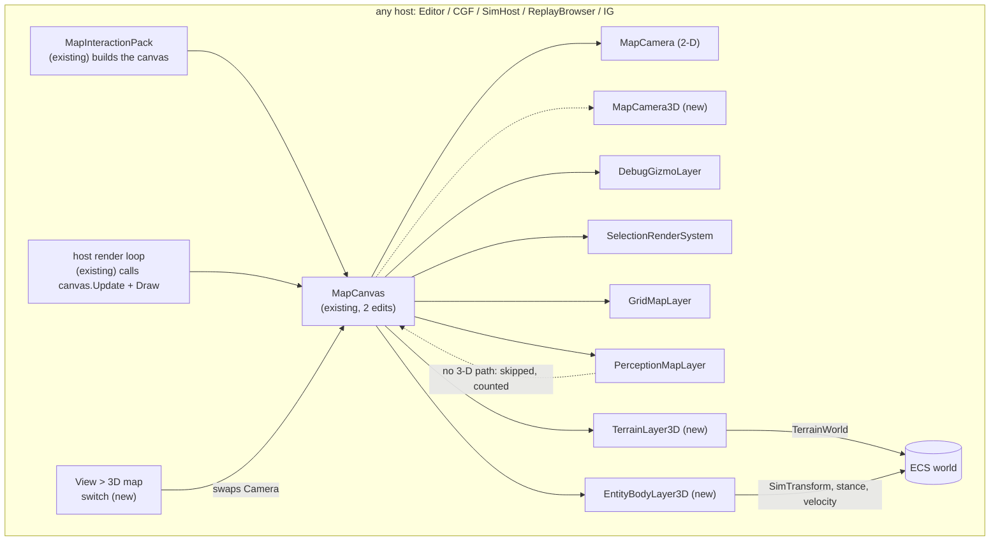
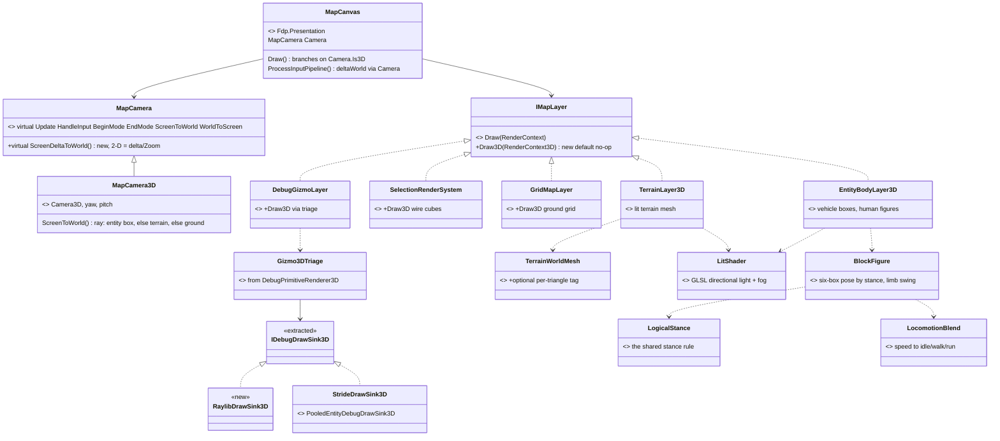
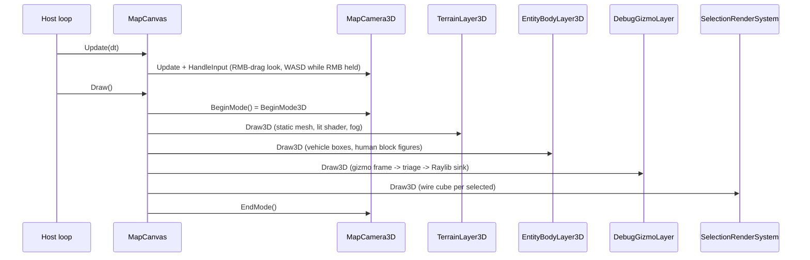
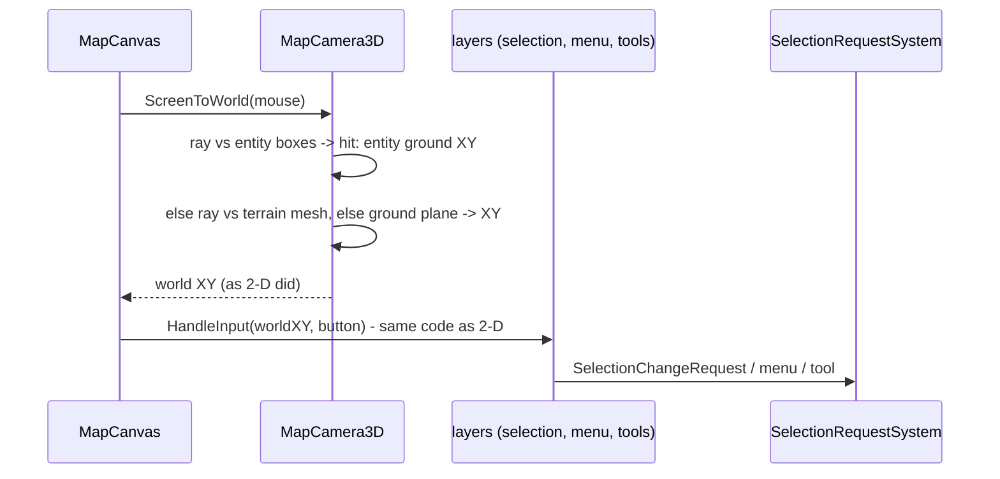
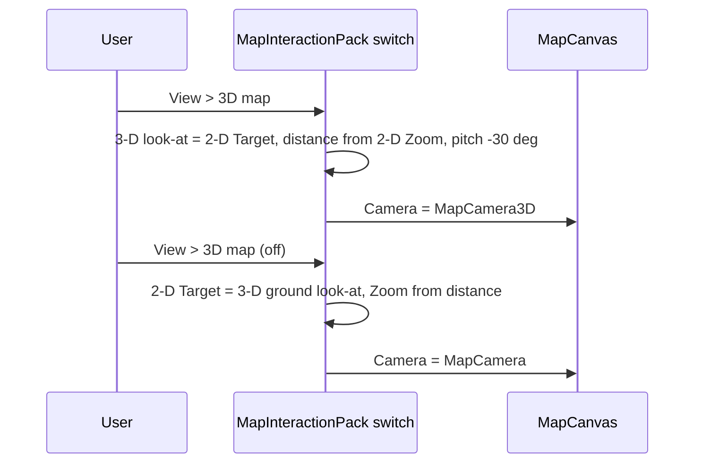

<!--STATUS
state: LIVE
build-state: DESIGN — approach chosen by the user (U13: alternative B, a 2-D/3-D switch on the existing map); the
  leans in §5 await approval before S1. Nothing built.
updated: 2026-10-10 (rev 2 — U14: humans as Minecraft-style block figures, M7 rewritten)
current-answer: §1 what the user asked · §3 the module / class / sequence diagrams · §4 the reuse ledger · §5 decisions
  with leans · §6 slices · §7 what is NOT verified.
stale-below: nothing.
known-rot: none.
known-conflict: none. It REPLACES DESIGN_Godot_3D_Viewer.md as the current approach; that file is DEFERRED, not
  withdrawn (U13: "put godot aside but keep its design as deferred").
related-designs:
  - DESIGN_Map_Rendering_And_Interaction.md — owns MapCanvas, IMapLayer, the render frame (§2.3) and the input chain
    (§3) this design extends with a camera subclass and a 3-D draw path; its "dumb terminal" rule holds in 3-D.
  - DESIGN_Godot_3D_Viewer.md — DEFERRED: the Godot-process alternative, the twenty requirements V-01..V-20 this file
    answers, and the user rulings U1..U12.
  - DESIGN_Terrain_World.md — owns TerrainWorld and TerrainWorldMesh; this file adds an optional per-triangle tag
    output to the mesher (the navmesh output stays byte-identical).
  - DESIGN_Stride_Node_Modes.md — owns §8, the 3-D gizmo triage in DebugPrimitiveRenderer3D, which this file EXTRACTS
    into shared code both Stride and the 3-D map use.
  - UX/UX_Feature_Selection.md — owns UXI-11; picks in 3-D reach the one store through the unchanged input chain.
  - designs/gizmos-1/DESIGN.md — owns the primitive stream and §10 context menus; both are reused unchanged in 3-D.
  - DESIGN_Building_Interiors.md — owns wall panels, openings, materials; the 3-D terrain colours by its materials.
-->

# DESIGN — a 3-D mode for the map

## Headline

⭐ **The existing map gets a 2-D / 3-D switch.** Same window, same `MapCanvas`, same layers, same selection, same
context menu, same tools — in 3-D the camera is a `MapCamera3D` subclass and each layer draws through an optional 3-D
path. Built on the Raylib the hosts already run. Godot is deferred.

| in 3-D | |
|---|---|
| terrain | lit, colour-shaded polygons from `TerrainWorld` (ground, surfaces, water, roads, buildings by material); textures later |
| entities | vehicles as boxes from TKB dimensions (tank = hull + turret box); humans as **Minecraft-style block figures** — head, torso, arms, legs — posed by stance, limbs swinging with speed |
| interaction | click-select, right-click menu, tools — through the **unchanged** input chain |
| gizmos | the 3-D subset of the gizmo stream (lines, arrows, spheres, semantic shapes) — fire traces and detonations included |
| camera | Unity-style free camera; the camera entity (V-12..V-15) |

---

## 1. What the user asked — `2026-10-10`

| # | 🔒 user | consequence |
|---|---|---|
| **U12** | *"check alternative idea of building own simple in-process 3d viewer … simple planes, boxes, human as cylinder (horizontal if prone, lower if crouched) … with imgui on top for menus?"* | measured in `DESIGN_Godot_3D_Viewer.md` §8 — lean B |
| **U13** | *"The internal 3d solution could be switchable 2d/3d instead of current 2d only map so no new 3d window would be required. I think we should focus on B … Lets put godot aside (but keep its design as deferred). We need the simple renderer to handle the terrain geometry, use lighting color shaded polygons to give it some usable feeling of a real world, if not some freely available texture pack."* | ⭐ this file: a **mode of the map**, not a window; **lit, colour-shaded terrain**; textures as a later slice |
| **U14** | *"Human characters as simple as in minecraft would be a bit nicer and still feasible i guess."* | ⭐ M7 rewritten: a **six-box figure**, stance poses blended by the transition, limb swing from speed |

The requirements V-01..V-20 live in `DESIGN_Godot_3D_Viewer.md` §1. ⭐ What changes under U13: **V-09** (own window) →
the map's own area, switched; **V-17** holds (render only); **V-18** (network) → an IG node with the map in 3-D;
**V-03/V-04** → primitives (U5/U12).

---

## 2. INVENTORY — measured `2026-10-10`, branch `ui` (graph + grep; `check_index_coverage` not run)

| query | total | what it settled |
|---|---|---|
| `search_graph(name_pattern="^(MapCanvas\|MapCamera\|IMapLayer\|…)$")` | **17** | `MapCanvas` (`Fdp.Presentation/Vis2D/MapCanvas.cs:12-265`), `MapCamera` (`…/Components/MapCamera.cs:13-383`), `IMapLayer`, `TerrainWorldMesh` |
| `search_graph(relationship=IMPLEMENTS, name="IMapLayer")` + grep | **6 / 6** | production layers: `GridMapLayer`, `DebugGizmoLayer`, `SelectionRenderSystem`, `PerceptionMapLayer` (+2 in `FDP/Examples`) |
| grep `MapInteractionContext` constructors | **5 hosts** | Editor, CGF, SimHost, ReplayBrowser, IG all build the map through `MapInteractionPack` |
| grep `BeginMode3D\|Camera3D\|DrawCube(` in `Hrot/ FDP/` | **0** | ⛔ no 3-D Raylib code exists yet |
| restored `Raylib-cs 7.0.2` / `rlImGui-cs 3.2.0` assemblies | — | 3-D API present (`BeginMode3D`, `DrawCylinderEx`, `DrawCubeWires`, `DrawMeshInstanced`, `UploadMesh`, `GetScreenToWorldRay`, `GetRayCollisionBox/Mesh`, `LoadRenderTexture`) |
| grep TKB dimension fields | **3 types** | `VehicleParametersDto` L/W, `SimVehicleDef` L/W/H, `StaticObstacleDto` L/W/H; ⛔ none for infantry |

---

## 3. THE ARCHITECTURE

### 3.1 Modules — who builds, who ticks, what is dead in 3-D

*What the picture shows that prose hid:* **no new composition root and no new tick** — the host loop that draws the
2-D map draws the 3-D one; the pack that builds the 2-D canvas builds both cameras and the two new layers.
`PerceptionMapLayer` has **no 3-D path** in slice 1 — drawn as a dead edge so its absence is visible, not silent.

### 3.2 Classes — existing (with file) vs new

*What it shows:* the 3-D mode is **one camera subclass, two layers, one shader and one sink**; everything else is an
existing class gaining one method. The gizmo triage gets a **second sink, not a second interpreter** — Stride and the
map share it.

### 3.3 Sequences

**A 3-D frame — the same frame, a different branch**

**A click in 3-D — the input chain is unchanged**

**Switching 2-D ↔ 3-D keeps the place**

---

## 4. THE REUSE LEDGER

| piece | verdict | evidence |
|---|---|---|
| `MapCanvas` — layers, input routing, right-drag vs right-click | ✅ reused; **2 edits**: `Draw()` branches to `Draw3D` when the camera is 3-D; `deltaWorld` comes from the camera instead of `delta / Zoom` (2-D result unchanged) | `MapCanvas.cs:115-140` (Draw), `:168` (`deltaWorld = delta * (1/Camera.Zoom)`) |
| `MapCamera` | ✅ reused as the base — its `Update`, `HandleInput`, `BeginMode`, `EndMode`, `ScreenToWorld`, `WorldToScreen` are already `virtual` | `MapCamera.cs:144-354` |
| `IMapLayer` | ✅ + one **default** method `Draw3D` (no-op) — no existing layer is forced to change | `CoreInterfaces.cs:37-92` |
| `DebugGizmoLayer`, `SelectionRenderSystem`, `GridMapLayer` | ✅ + a `Draw3D` each | — |
| the whole input side: selection store + request, `ContextMenuAdapter`, tools | ✅ **unchanged** — they receive world XY as today | §3.3 |
| `MapInteractionPack` | ✅ builds the 3-D camera and the two new layers for all five hosts | 5 host call sites |
| `DebugPrimitiveRenderer3D` triage + `IDebugDrawSink3D` | 🔁 **extract** to a shared net8 assembly; Stride keeps its sink, the map adds a Raylib sink | `Stride/Hrot.Stride.Core/DebugPrimitiveRenderer3D.cs:50-292,373-392` |
| `TerrainWorldMesh.Build` | ✅ + an **optional** per-triangle tag output (ground / surface / roof / wall / slab + material) — verts and indices unchanged, so the navmesh is unaffected | `TerrainWorldMesh.cs:31` |
| fire / detonation visuals | ✅ **free in S3** — `FireTraceGizmo` / `DetonationGizmo` already emit 3-D lines and spheres | gizmo sweep 2026-10-10 |
| vehicle sizes | ✅ `VehicleParametersDto` / `SimVehicleDef` | TKB |
| stance | ✅ `LogicalStance.Of` for the pose; `StanceStatus.Phase` / `TransitionProgress` to blend into it | `Tkb/Domain/StanceComponents.cs:58,82` |
| `LocomotionBlend` (speed → idle/walk/run weights, pure `System`) | 🔁 **extract** beside the gizmo triage — drives the limb swing | `Stride/Hrot.Stride.Animation/LocomotionBlend.cs:99-145` |
| `MapCamera3D`, `TerrainLayer3D`, `EntityBodyLayer3D`, `BlockFigure` (the six-box pose math, unit-tested), `RaylibDrawSink3D`, the lit shader, the switch | 🆕 new | — |

---

## 5. DECISIONS

| # | decision | ⭐ lean | rejected — one line each |
|---|---|---|---|
| **M1** | where 3-D lives | ⭐ a **mode of the existing map** (U13) — camera swap + `Draw3D` | a separate panel/window — a second map, second input chain |
| **M2** | 3-D input | ⭐ `MapCamera3D.ScreenToWorld` = ray → entity box (→ that entity's ground XY) → terrain → ground plane; every layer keeps its 2-D input code | 3-D-specific input per layer — rewrites selection, menus and tools |
| **M3** | 3-D drawing | ⭐ `IMapLayer.Draw3D` default no-op; layers opt in; `PerceptionMapLayer` skipped and **counted** | a parallel 3-D layer list — two lists to keep in step |
| **M4** | terrain mesh | ⭐ extend `TerrainWorldMesh` with optional tags; the renderer adds what navigation does not need (water surface, surface colours, road ribbons) beside it | a second mesher for rendering — duplicates prisms/walls/slabs |
| **M5** | lighting | ⭐ **one small GLSL shader** (330): vertex colour × (ambient + sun·N), distance fog to a sky colour; flat normals by un-indexing triangles | CPU-baked vertex lighting — entities rotate, so it would need re-baking every frame |
| **M6** | textures | ⭐ a later slice: **CC0** packs only, mapped in the shader from **world position** (triplanar) so the mesh needs no UVs | UV-unwrapping terrain — work the triplanar trick avoids |
| **M7** | entities | ⭐ box per vehicle from TKB size (tank: hull + turret box). **Human = a six-box block figure (U14)**: head, torso, two arms, two legs, ~1.8 m, torso in the side's colour. **Pose** = the shared stance rule `LogicalStance.Of` (`StanceComponents.cs:82`: *"a unit's LOGICAL stance is what its brain ordered … an animation only shows it and never gates it"*) — standing; crouched (hips lowered, knees bent); prone (the whole figure laid along its heading). While `StanceStatus.Phase` is transitioning, the pose blends by `TransitionProgress`. **Limb swing** (arms and legs counter-swinging, Minecraft-style) from planar speed through the extracted `LocomotionBlend.FromSpeed` (`LocomotionBlend.cs:114`) — walk and run weights set amplitude and rate; a per-entity phase advances with distance walked. Optional rifle = a thin box in the hands | cylinders (rev 1) — U14 · real models — U12 · showing `StanceStatus.CurrentStance` alone — it would disagree with the hit model, fire chain and perception, which all read `LogicalStance` |
| **M8** | free camera | ⭐ Unity scene view: **RMB-drag** look, **WASD/QE only while RMB is held** (so tools keep their keys), wheel dolly, MMB pan, **F** frames the selection; right-**click** stays the context menu (the canvas already tells drag from click) | always-on WASD — collides with tool keyboard input |
| **M9** | coordinates | ⭐ one transform: HROT `(x, y, z)` → Raylib `(x, z, −y)`, quaternion `(x, y, z, w)` → `(x, z, −y, w)` (det +1, no flip) | — |
| **M10** | the camera entity (V-12..V-15) | ⭐ an ordinary spatial entity (U7) holding the **3-D** pose, created on first 3-D move, owned by the host, saved with the scenario; the 2-D mode derives its target from it on switch | ⚠ open: should the 2-D view also persist through it? (§7) |
| **M11** | network viewer (V-18) | ⭐ an IG node with the map in 3-D — nothing extra | a dedicated viewer node — IG already is one |

---

## 6. SLICES

| slice | delivers | proves |
|---|---|---|
| **S1** | `MapCamera3D` + the switch (Editor); `TerrainLayer3D` from `TerrainWorldMesh` as-is, one colour per kind, lit shader + fog; `EntityBodyLayer3D` vehicle boxes + block figures in their three stance poses (static); free camera; **Xvfb screenshot of the editor in 3-D on `test-town`** | the render path, the shader on the cloud's software GL, M8 |
| **S2** | `ScreenToWorld` ray picking; `deltaWorld` through the camera; `SelectionRenderSystem.Draw3D` wire cubes | select, context menu and tools work in 3-D unchanged |
| **S3** | triage extracted (Stride re-pointed, its compile gate green); `DebugGizmoLayer.Draw3D` with skip counters | gizmos, fire traces, detonations in 3-D |
| **S4** | mesh tags; colours by surface and material; water; road ribbons from the road network; **figures come alive**: stance blending + limb swing (`LocomotionBlend` extracted), optional rifle | "a usable feeling of a real world" (U13), U14 |
| **S5** | camera entity — create, follow, scenario save | V-12..V-15 |
| **S6** | all five hosts through `MapInteractionPack` | V-01, V-18 (IG) |
| **S7** | CC0 textures, triplanar | U13's texture wish |

⭐ Gates per slice: the touched suites + the map's own rails (T-1), a frame rail per R-124, and the Xvfb screenshot.

---

## 7. NOT VERIFIED — say so before it is built on

| claim | how it is settled |
|---|---|
| ⚠ the lit shader compiles and runs on the hosts' GL and on the cloud's software GL (Mesa llvmpipe) | S1's screenshot |
| ⚠ 3-D frame cost inside the host frame (terrain mesh + a few hundred entities) | S1, measured on Windows and in the cloud |
| ⚠ an entity box hit returning that entity's ground XY lands inside its 2-D pick box for every entity kind | S2 rail per kind |
| ⚠ which CC0 texture pack — ambientCG / Poly Haven are CC0 by their own terms; specific textures and repo size not chosen | S7, with a licence table |
| ⚠ M10's open part: one camera entity for both modes, or 3-D only | ask the user |
| ⚠ IG humans stand upright until IG ingests stance (`CE-2121` "IG ingress open") | S6 |
| ⚠ `LogicalStance.Of` and `StanceStatus` are present on every host's entities (they are `NoScenario` runtime components; the Editor may not run the stance systems) — no stance ⇒ standing, as the rule itself says | S1 rail |
