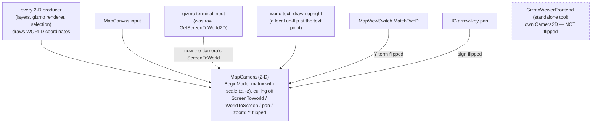
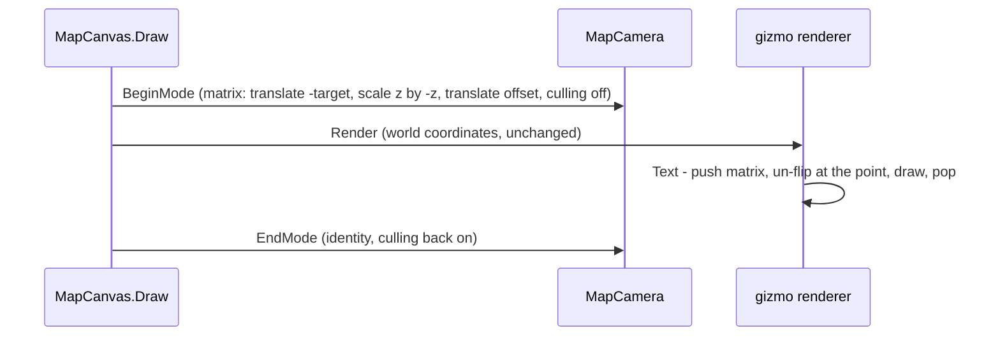

<!--STATUS
state: LIVE
build-state: BUILDING — N1–N6 below; the as-built lands in §5.
updated: 2026-10-11
current-answer: §2 inventory · §3 the camera seam (diagrams) · §4 decisions · §5 as-built.
stale-below: nothing.
known-rot: none.
known-conflict: none.
related-designs:
  - DESIGN_Map_3D_Mode.md — found the mirror (§6a, CE-1033 S1) and keeps north fixed at the 2-D ↔ 3-D swap once this lands.
  - DESIGN_Map_Rendering_And_Interaction.md — owns MapCanvas, its layers and the gizmo terminal this flips the camera under.
  - DESIGN_Gizmo_Renderer_Seam.md — owns the one 2-D gizmo renderer whose world text this keeps upright.
  - PLAN_3D_World_And_Realism.md — the programme index (item A3).
-->

# DESIGN — the 2-D map, north up *(CE-1040)*

🔒 User, `2026-10-10`: *"yes file it"* — the 2-D map draws north at the BOTTOM: `MapCamera` maps world Y screen-DOWN (a Raylib
`Camera2D`, no flip) and HROT's axes are ENU (x east, y north), so the map is the view from BELOW the ground — a mirror. The 3-D
view cannot show a mirror, so every 2-D ↔ 3-D swap flips north and south.

## 1. The goal in one line

World Y goes screen-UP, at ONE seam — the 2-D camera — so every producer keeps drawing in world coordinates and nothing else
learns about the flip.

## 2. INVENTORY — measured `2026-10-11` (a sweep of every screen↔world conversion, world-space text, Y offsets, screen
rectangles, headings and culling in production map code; graph `search_graph` + grep; `check_index_coverage` not available via the CLI)

| category | needs its own change | goes through the seam / unaffected |
|---|---|---|
| screen ↔ world conversions | 5 formulas inside `MapCamera` (zoom-to-cursor, pan, `ScreenDeltaToWorld`, `ScreenToWorld`, `WorldToScreen`) + `BeginMode`; **bypassers**: the gizmo terminal's raw `GetScreenToWorld2D` (`GizmoMap.Presentation/Layers/DebugGizmoLayer.cs:129` — every gizmo press, hover, drag, right-click), the badge's `GetWorldToScreen2D`, the renderer's screen-space re-entry (`BeginMode2D(camera)`), `MapViewSwitch.MatchTwoD`, IG's arrow-key pan | 14 sites through `MapCamera` (canvas, IG, Editor, `MapCamera3D.OverheadMatching`) |
| text drawn in world space | the gizmo renderer's `Text` case; `MilStd2525Renderer`'s label | screen text (`GizmoTextDraw.DrawScreen`, HUDs, the 3-D overlay) |
| label offsets along Y | 8 gizmos offset a label in WORLD units by `+Y` meaning "below" (placement ghost ×2, measure, rotator, detonation, EQS, bounding-box picker, MIL-STD label); 12 `lineOffsetPx` calls in PIXELS — one renderer conversion | 7 anchored labels with no offset |
| screen rectangle → world | none — all 8 (culling viewports, rubber band, grid, bounding box) take min/max | — |
| headings / rotations | none — all world-space; they become visually correct (world counter-clockwise shows counter-clockwise) | — |
| triangle winding | ⛔ a one-axis mirror reverses winding ⇒ back-face culling would drop filled shapes and text | — |

## 3. THE SEAM

*What the picture shows that prose hid:* the gizmo terminal's input was a second, raw camera conversion beside the seam — a
flip at the seam alone would have drawn north-up and picked north-DOWN. The standalone viewer is the one dead edge: a separate
tool with its own camera, left mirrored and named.

## 4. DECISIONS *(built — the user may redirect any row)*

| # | decision | ⭐ chosen | rejected — one line each |
|---|---|---|---|
| **N1** | where the flip lives | ⭐ inside `MapCamera` only: its own matrix in `BeginMode` (a `Camera2D` cannot express a one-axis mirror — one scalar zoom), and the five formulas | flipping each producer's Y — dozens of producers, and a new one would get it wrong |
| **N2** | the gizmo terminal's input | ⭐ always handed the live camera's `ScreenToWorld3D` (it already takes one for 3-D) | teaching the terminal the flip — a second copy of the camera rule |
| **N3** | world text | ⭐ drawn upright by a local un-flip at the text's point (`Rlgl` push / scale 1,−1 / pop); `lineOffsetPx` then still means screen-down | converting text to screen space — toggling camera mode per primitive breaks the batch (the renderer's own warning) |
| **N4** | back-face culling | ⭐ off for the 2-D camera pass, back on after | drawing every shape twice — every producer |
| **N5** | world-unit "below" label offsets | ⭐ left as they are: they now sit ABOVE the point (EQS's comment already says "above"); the placement ghost's two stacked lines get `−` so the name stays above the hint | changing all eight — cosmetic, and above reads as well |
| **N6** | the standalone `GizmoViewerFrontend` | ⭐ not flipped (its own tool and camera); named here | flipping it too — not a map host, no swap to 3-D |

## 5. AS-BUILT

*(filled by the build)*
