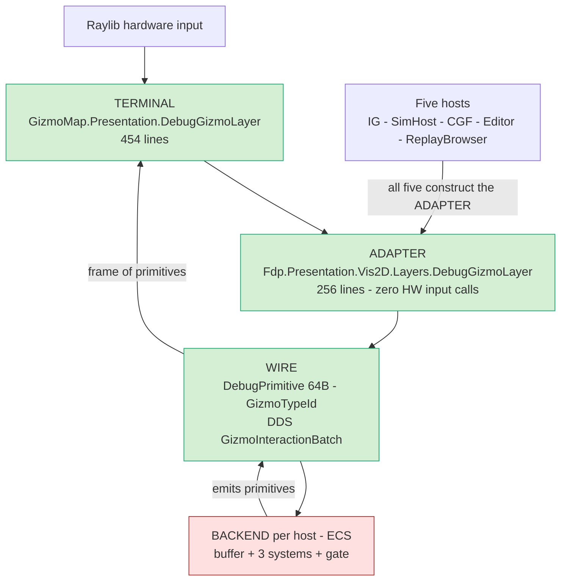
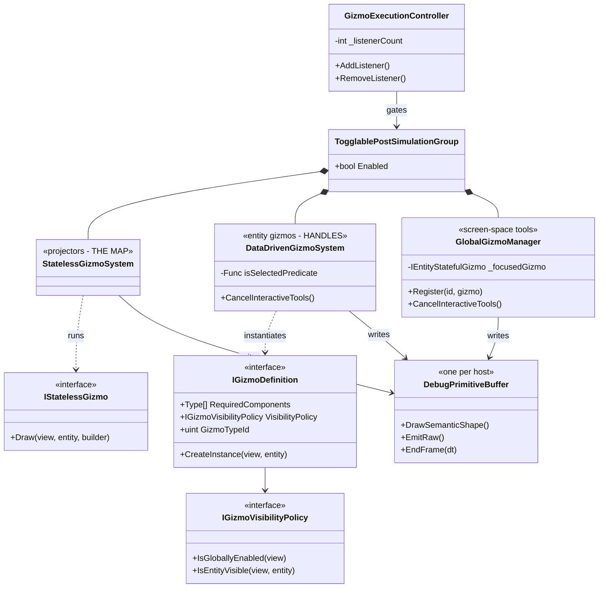
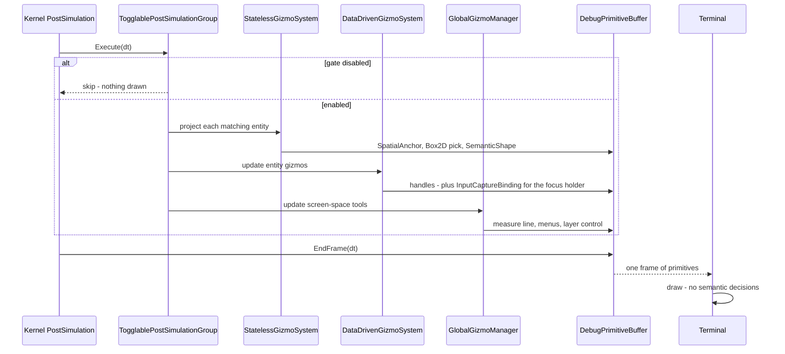
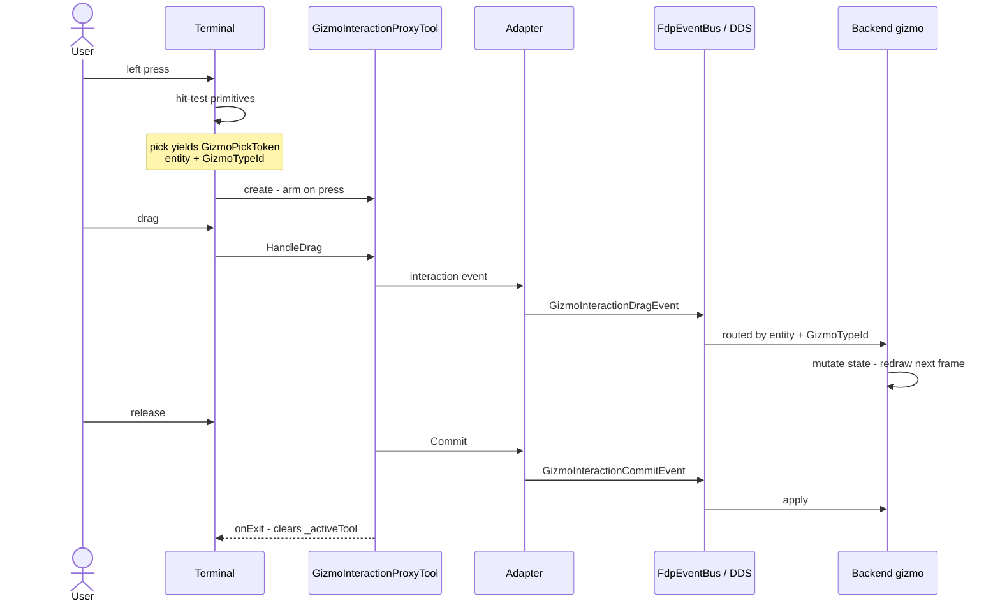
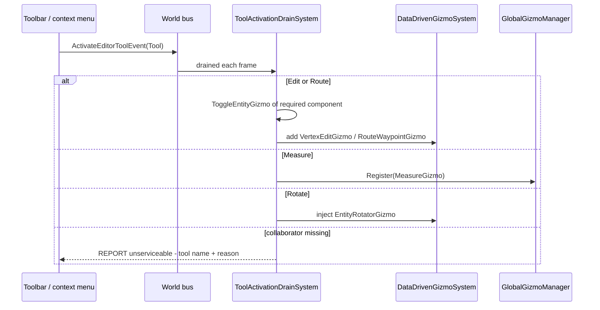
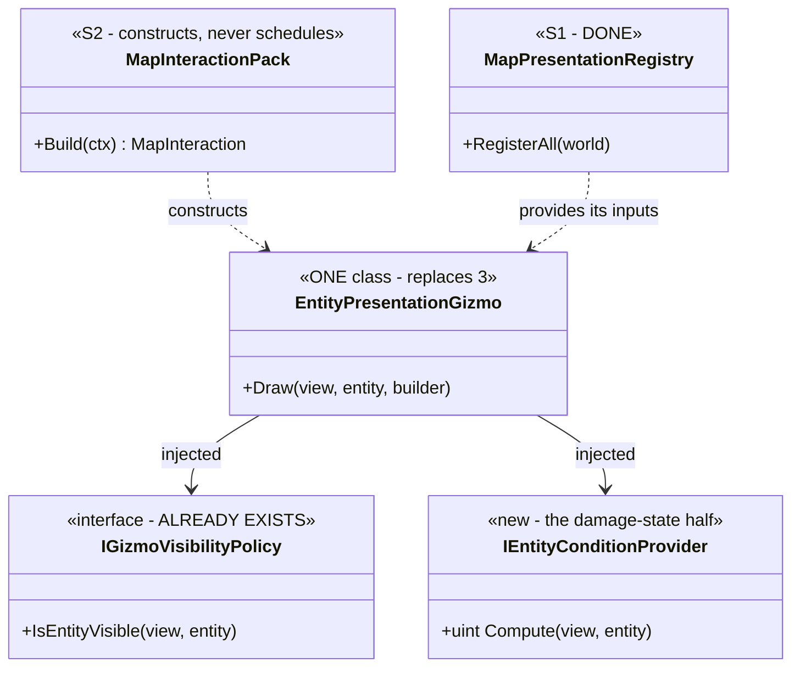
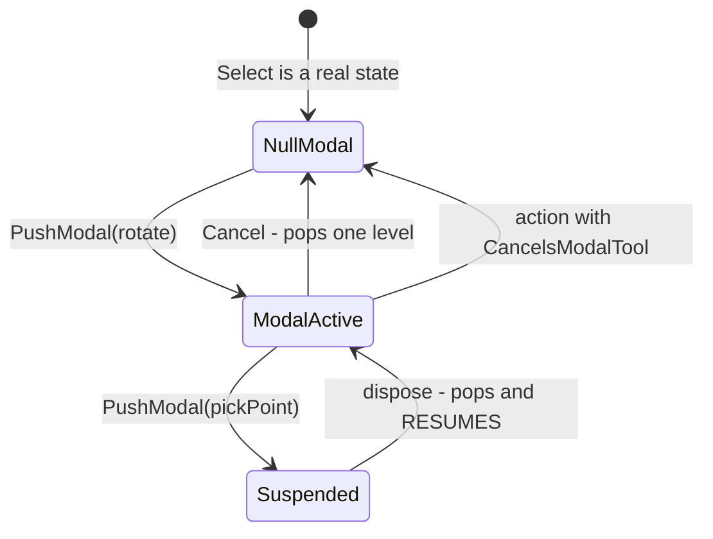

<!--STATUS
state: LIVE
build-state: REFERENCE (describes the AS-IS; the TO-BE is owned by UXI-23 and UXI-07)
updated: 2026-08-28
verified: 2026-08-28 — every AS-IS claim measured from source this session; file:line cited inline.
current-answer: read section 1 (the two halves) first — it is the orientation. Section 2 is the
  AS-IS with diagrams, section 3 the interaction path, section 4 the TO-BE including the restored
  tool stack, section 5 the risk register that governs any merge.
rulings: R-137 unification may not cost a feature; if it does, put it back as configuration.
  gizmo != tool (user, Q27, 2026-08-10) — the taxonomy is encoded in the interfaces.
  The pack owns construction, the host decides scheduling (user, 2026-08-28).
known-conflict: docs/designs/gizmos-1/gizmo-input-focus-design.md section 14 says the FRONTEND keeps a
  tool stack; UX_Feature_Tool_Model.md (UXI-07, newer and user-ruled) puts the MODAL stack in the
  BACKEND. RECONCILED in section 1.3: the word names two different mechanisms at two layers.
known-rot: none known. Every numeric claim carries its measurement date.
-->
# Map rendering & interaction — how it works, and where it is going

> **Scope.** The 2-D map: what draws it, what makes it interactive, and how the pieces divide across
> the frontend/backend boundary. **Owns nothing** — it is the shared reference that
> [`UXI-23`](UX/UX_Feature_Map_Parity.md) *(map unification)* and
> [`UXI-07`](UX/UX_Feature_Tool_Model.md) *(the tool model)* both build against.
>
> 📐 Written because two slices in a row hit architecture nobody had written down.

---

## 1. The two halves

### 1.1 One sentence

🔒 **The map looks different per host because each host's BACKEND emits a different set of primitives —
not because anything draws differently.** There is exactly **one** terminal, shared by all five hosts.

### 1.2 The layer map



| layer | shared today? | evidence |
|---|:--:|---|
| **terminal** — hit-test, input capture, drawing | ✅ **one** | one inner layer; `GizmoMap.Presentation/Layers/DebugGizmoLayer.cs` |
| **adapter** — the FDP face of it | ✅ **one** | `Fdp.Presentation/Vis2D/Layers/DebugGizmoLayer.cs`; all five hosts import `Fdp.Toolkit.Vis2D.Layers` |
| **wire** — the primitive language | ✅ **one contract** | `GizmoMap.Contracts/Primitives/DebugPrimitive.cs` |
| 🔴 **backend** — what to draw, and the tools | ⛔ **diverges per host** | this is `UXI-23`'s whole subject |

⚠ **The adapter is genuinely inert on input:** 📐 measured — **zero** `Raylib.IsMouse*`/`IsKey*` calls;
`HandleInput`/`HandleKeyInput` return `false` and `PickEntity` returns `null` (`:111`, `:114`, `:116`).
It delegates to the inner terminal (`:83`) and translates `Commit`/`Cancel` into `FdpEventBus` events.

### 1.3 "Dumb terminal" — 90% true, and the word *stack* means two things

| claim | verdict |
|---|---|
| the terminal decides what a press **means** | ✅ **no** — the backend does. `InputCaptureBinding` is emitted by `GlobalGizmoManager:138` and `DataDrivenGizmoSystem:334,373`, consumed by the terminal at `:124`, railed by `DebugGizmoLayerCaptureTests` |
| the terminal decides **which physical button** starts one | ⚠ **yes** — it still names `MouseButton.Left` and `KeyboardKey.Escape` |
| the terminal holds tool **state** | ⚠ **one slot** — `_activeTool` (a `GizmoInteractionProxyTool`), not a stack |

⇒ 🔒 **The residual smartness is input VOCABULARY, not semantics.**

**The two stacks — this is the reconciliation:**

| | **frontend stack** *(routing)* | **backend stack** *(modality)* |
|---|---|---|
| holds | which input handler receives mouse/keys | which editing **operation** is active vs suspended |
| doc | `gizmo-input-focus-design.md` §14 — *"for routing … no semantic decisions in the stack"* | `UXI-07` — `IToolController`, `ModalStack`, `PushModal` |
| today | ⚠ collapsed to a single `_activeTool` slot | 🔴 **does not exist** |

---

## 1.4 INVENTORY — the gizmo seam, enumerated

⚠ **Recorded because §4 names WHERE things should live**, and a design may not claim a set it did not
enumerate. ⭐ The MCP graph was disconnected; run through the **CLI fallback** *(`CLAUDE.md`: the same
binary serves every tool)*:

```bash
codebase-memory-mcp cli search_graph \
  '{"project":"home-user-HROT","name_pattern":".*Gizmo.*","label":"Interface"}'
# total: 16   has_more: false
```

| interface | role |
|---|---|
| `IStatelessGizmo` | ⭐ **the map projectors** — `UXI-23` |
| `IGlobalStatelessGizmo` | screen-space stateless draw |
| `IEntityStatefulGizmo` · `IStatefulGizmo` | ⭐ **the tools** — `UXI-07` |
| `IGizmoDefinition` | ⭐ registration record: `RequiredComponents`, `VisibilityPolicy`, `GizmoTypeId` |
| `IGizmoVisibilityPolicy` | ⭐⭐ **the per-rule visibility seam** — only `AlwaysVisiblePolicy` / `NeverVisiblePolicy` exist |
| `IGizmoInteractionHandler` | where `RequiresExclusiveFocus` is declared |
| `IGizmoControllable` | the host's handle onto its `GizmoExecutionController` |
| `IGizmoDrawBuilder` · `IGizmoSource` · `IGizmoTransport` · `IGizmoUiStatePublisher` | the draw/feed/wire surfaces |
| `IGizmoNetworkFactory` · `IBehaviorGizmoFactory` · `IGizmoUndoRecord` | construction + undo |

⚠ **Three were absent from my prose before this enumeration** — `IGlobalStatelessGizmo`,
`IGizmoUndoRecord`, `IGizmoUiStatePublisher`. 📌 Exactly why the rule exists.
🔒 **`IGizmoUndoRecord` is a live question for `UXI-07`**: a suspend/resume stack and an undo record are
adjacent concerns, ⛔ and this document does **not** claim to have analysed their interaction.

## 2. Rendering — the AS-IS

### 2.1 Two gizmo kinds, one buffer



🔒 **All three write into ONE buffer, inside ONE group, behind ONE gate.** ⇒ ⚠ **map rendering and editing
handles are not separable** — anything done to the group touches both.

### 2.2 The taxonomy — `gizmo ≠ tool` *(user ruling, Q27, `2026-08-10`)*

| category | encoding | examples | how many active | owner |
|---|---|---|---|---|
| **not a tool** — status draw | `IStatelessGizmo` | symbols, health bars, route lines | many, per entity | **`UXI-23`** |
| **modeless tool** | `IEntityStatefulGizmo`, `RequiresExclusiveFocus => false` | `LayerControlGizmo`, `EntityDragGizmo` | several at once | `UXI-07` |
| **modal tool** | `IEntityStatefulGizmo`, `RequiresExclusiveFocus => true` | `EntityRotatorGizmo`, `MeasureGizmo`, pickers | 🔒 **at most one per subsystem** | `UXI-07` |

⚠ `UXI-07`: *"The taxonomy exists; the enforcement does not"* — each engine consults the flag only within
itself *(its two-arbiter defect)*.

### 2.3 The render frame



---

## 3. Interaction — the AS-IS

### 3.1 Press to commit



🔴 **`GizmoTypeId` is a WIRE CONTRACT.** It is the FNV-1a hash of the implementing type's **full name**
(`DebugPrimitive.cs:140`, `[FieldOffset(60)]`), sent as `GizmoInteractionBatch.PickGizmoTypeId` and echoed
back by the terminal. ⇒ ⚠ **renaming or merging a gizmo class silently breaks remote dragging while the
handle still draws** — and a single-process test cannot see it, because both sides hash the same name.

### 3.2 Tool activation



⭐⭐ **`ToolActivationDrainSystem` already implements *declare-and-report-unserviceable*** — per tool, with
name and reason, defaulting to the log and rail-injectable. 🔒 **It is the pattern the map should copy, not
redesign.**

### 3.3 Why a handle may or may not appear — **three gates, all silent**

| # | gate | where |
|---|---|---|
| ① | the host composed the collaborator | the drain's `Func<>` resolvers — ⭐ **reports** when null |
| ② | the selected entity carries the tool's component | `ToggleEntityGizmo<T>` — ⇒ **per ENTITY, not per host** |
| ③ | the entity is drawn at all | `isSelectedPredicate` — `null` on IG/CGF *(always draw)*, selection-gated elsewhere. ⚠ `DataDrivenGizmoSystem:308` — **`null` means ALWAYS, not never** |

### 3.4 Focus — single slot, first-come, silent denial

```csharp
// GlobalGizmoManager.Register, :66
_activeGizmos[id] = gizmo;
if ((gizmo.RequiresExclusiveFocus || gizmo.WantsRawInput) && _focusedGizmo == null)
{ _focusedGizmo = gizmo; gizmo.SetFocus(true); }        // else: registered, NEVER focused
```

| | |
|---|---|
| ✅ **intentional** | one exclusive holder — `gizmo-input-focus-design.md` §6.2: *"the terminal would have no honest way to choose … we prevent that situation entirely on the backend"* |
| 🔴🔴 **TWO ARBITERS** | 📐 `GlobalGizmoManager._focusedGizmo` *(`:31`)* and `DataDrivenGizmoSystem._focusedGizmo` *(`:65`)* are **independent** — no shared state, same first-come guard. ⇒ both can hold "exclusive" focus at once |
| 🔴 **not a decision** | the **denial is silent**, and there is **no suspend/resume**. ⇒ *"jump to another tool and come back"* is **half**-implemented: the caller's control flow resumes *(`TaskCompletionSource` + `ct.Register`)*, the **previous tool does not** |

### 3.5 Exclusive input — **the mechanism EXISTS; the arbitration is what is missing**

🔒 **"Only the top tool receives input" is a first-class primitive**: `InputCaptureBinding`.

| bit | meaning | effect at the terminal |
|:--:|---|---|
| `ConditionMask & 1` | **exclusive** | ⭐ **spatial hit-testing is SUPPRESSED** |
| `ConditionMask & 2` | **raw input** | ⭐ **all raw HW events route to the capturing token** |

⇒ ✅ **A tool stack needs NO new input primitive.** ⛔ What it needs is the two things below.

🔴 **But the terminal takes the FIRST binding and stops** *(`DebugGizmoLayer.cs:118-134`)*:

```csharp
if (prim.Shape != DebugPrimitiveShape.InputCaptureBinding) continue;
…
break;                    // 🔴 first in buffer order wins. No arbitration, no report.
```

⇒ ⚠⚠ **With two arbiters, raw-input capture goes to whichever system EMITS EARLIER**, while the loser
still receives the typed events *(`UXI-07`'s bus-side defect)* ⇒ 🔴 **one tool's input can split across
two tools**, silently. 📌 `gizmo-input-focus-design.md` §6.2 predicted precisely this and said the backend
must prevent it — ⛔ **the prevention is the missing piece**, because there are two backends-within-the-backend.

| for a tool stack | status |
|---|---|
| **exclusive input routing** | ✅ **built** — `InputCaptureBinding` |
| **ONE arbiter deciding who is top** | 🔴 **absent** — two independent slots |
| **suspend / resume of the displaced tool** | 🔴 **absent** — the slot is first-come; teardown DESTROYS |

⇒ 🔒 **`UXI-07`'s single `IToolController` closes the first two at once**: one arbiter ⇒ one capture binding
per frame ⇒ the terminal's `break` becomes **correct rather than arbitrary**.

⚠ **`CancelInteractiveTools()` destroys only the ON-DEMAND gizmos** — one that is neither exclusive-focus
nor raw-input *(e.g. the layer control)* is **permanent** and survives a perspective switch.

---

## 4. The TO-BE

### 4.1 Rendering — one projector, two injected collaborators



🔒 **Every line of the projector is shared; only the two injected instances differ, and that is
CONFIGURATION** *(`R-137`)*. ⛔ **The `[GizmoProjector]` attribute declares the MINIMUM** —
`SimTransform` + `NetworkIdentity`. ⚠ Listing `CullingState` there would make the query match nothing on
SimHost and CGF and **silently empty their maps**.

### 4.2 Interaction — the tool stack, restored in the BACKEND



| element | source |
|---|---|
| `IToolController` · `ActiveModal` · `ModalStack` · `PushModal` *("SUSPENDS the top; dispose pops & resumes")* · `Cancel` *("pops ONE level")* | 🔒 **`UXI-07`, already designed, user-ruled, NOT-BUILT** |
| `ToolDescriptor { Id, Label, Modality, ShowOnToolbar, ToggleOnReactivate }` | `UXI-07` — registration-time flags |
| `CancelsModalTool` on the **action**, not the tool | `UXI-07`, corrected `2026-08-10` — *"must be driven by focus changes only"* |

⚠ **Suspend ≠ deactivate.** Both current teardown paths **destroy** the gizmo; a stack needs a suspend that
preserves state. 🔒 That is `UXI-07`'s work, **not** `UXI-23`'s.

### 4.3 Who owns what

| area | owner |
|---|---|
| projectors, their inputs, construction, declaration, policy/settings | **`UXI-23`** `S1`–`S4` |
| tools, modality, the modal stack, action→tool routing | **`UXI-07`** |
| the wire contract (`GizmoTypeId`) | ⚠ **joint** — pin it before either merges classes |
| the action half | ⚠ **joint** — `UXI-23` `S5` **after** `UXI-07` migration steps 3–4 |

---

## 5. The risk register — **every item is SILENT when hit**

| # | risk | guard |
|---|---|---|
| 1 | `[GizmoProjector]` / `RequiredComponents` lists an optional input | declare the minimum; check optional capability in the collaborator |
| 2 | `isSelectedPredicate` collapsed to one value | stays a per-host parameter — IG needs *always*, the editor needs *selected* |
| 3 | 🔴 **`GizmoTypeId` changes on rename/merge** | pin it as an explicit constant **first**; rail the value. ⚠ cross-node only |
| 4 | teardown stops cancelling both managers | keep both `CancelInteractiveTools()` calls |
| 5 | a merged gizmo declares `RequiresExclusiveFocus` and steals focus | treat the two focus flags as contract |
| 6 | permanent/on-demand is **derived** from those flags | rail the classification per gizmo type |
| 7 | the drain's `Func<>` resolvers captured into fields | keep them lazy — the editor creates selection/camera **after** `Initialize()` |
| 8 | ⚠ **a refused focus is not reported** | make `Register` report it, using the drain's unserviceable pattern |

---

## 6. Sources

| | |
|---|---|
| [`UX_Feature_Map_Parity.md`](UX/UX_Feature_Map_Parity.md) | `UXI-23` — the map slices `S1`–`S5`, and §3.9a–i |
| [`UX_Feature_Tool_Model.md`](UX/UX_Feature_Tool_Model.md) | `UXI-07` — the tool model and the modal stack |
| [`gizmo-input-focus-design.md`](designs/gizmos-1/gizmo-input-focus-design.md) | the backend-driven focus architecture *(marked "Design proposal")* |
| [`RULINGS.md`](blueprints/RULINGS.md) | `R-137` — unification may not cost a feature |
