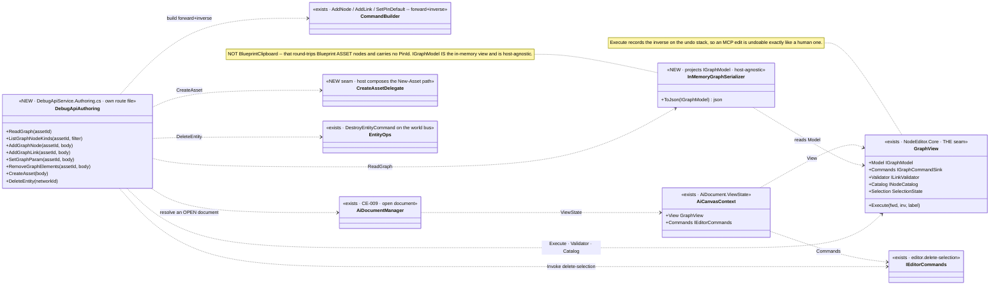
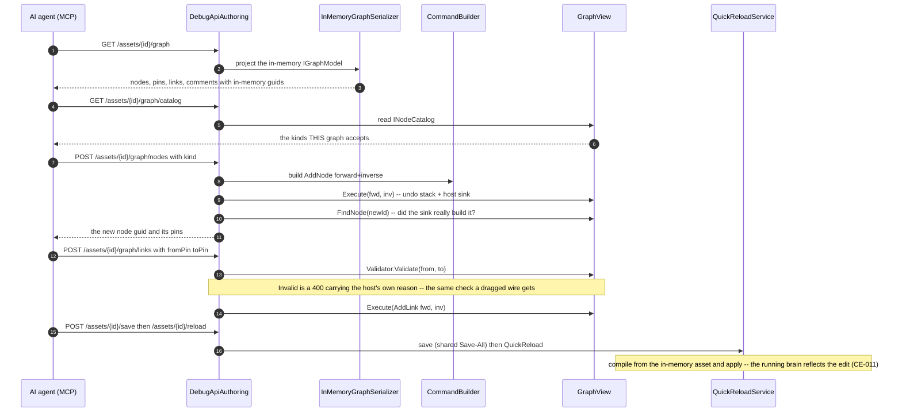
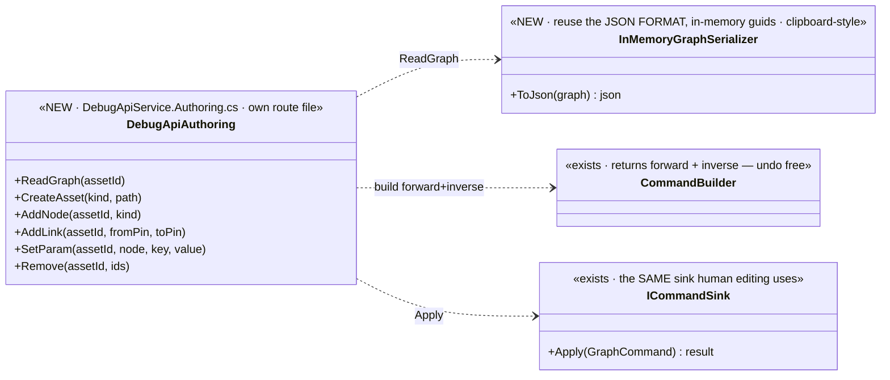

<!--STATUS
state: LIVE
build-state: BUILT — `2026-08-25`, ids `MA-001`…`MA-010`. §10 IS THE AS-BUILT and wins over anything above
  it that disagrees. §5's classDiagram has been REDRAWN to the as-built; the dispatched version is in
  §11 HISTORY. Carries classDiagram + sequenceDiagram (§5/§6). Part of the MCP design docs (sibling of
  MCP_Integration.md).
updated: 2026-08-25
current-answer: §10 for what exists; §5/§6 for the shape; §1–§4 for the WHY, which the build did not change.
known-rot: ⚠ §3's "closer analog to reuse: BlueprintClipboard" is WRONG and §10.1 supersedes it — measured,
  the clipboard round-trips Blueprint ASSET nodes and carries no PinId at all. The RULE §3 states (two id
  spaces; expose the in-memory ids) is CORRECT and load-bearing; only the named analog was wrong.
  ⚠ §7's item list is missing the node-kind CATALOG route, which building the edit routes proved necessary
  (§10.2). ⚠ §7 ④ said "extend /entities/* for the gaps (place/configure/assign)"; measured, those three
  already had routes and DELETE was the only gap (§10.5).
design-basis: Architect_Question_56_Mcp_Authoring_Surface.md (the decision trail — Q56-A..F resolved with
  the user; this doc is its graduation to a buildable design) · CE-009 (open + read/switch — the
  precondition) · CE-011 (save + QuickReload — the runtime effect) · AQ10 (deterministic pin/link ids on
  disk) · R-133/HN-030 (routes self-document; SKILL.md generated).
known-conflict: ⚠ shares the DebugApi surface with the CE-* editing slices — the collision plan is §8.
-->
# DESIGN — **the MCP authoring surface** *(AI-asset editing + scenario authoring)*

> 🎯 Turn the MCP server from **read/drive** *(open, inspect, switch tabs, save/reload — CE-009/011)* into
> **authoring**: an AI agent creates and edits AI assets *(graphs)* and authors scenarios *(the world)* over
> MCP. 📄 Graduates **[`Architect_Question_56`](blueprints/Architect_Question_56_Mcp_Authoring_Surface.md)**
> *(the resolved decision trail)* into a buildable design.

## 1. ⭐⭐⭐ TWO DISTINCT SURFACES *(Q56-C, resolved)* — they share little
| surface | what it is | mechanism |
|---|---|---|
| ⭐ **① AI-ASSET authoring** *(graph documents: BTree · HSM · Blueprint)* | **DOCUMENT editing** — create an asset, add/connect nodes, set params, remove | read-then-edit-by-guid via the **same command sink human editing uses** → save → QuickReload |
| ⭐ **② SCENARIO authoring** | **WORLD manipulation** — place/configure/assign/spawn/delete entities | the **existing `/entities/*` ops**; `scenario/save` **snapshots** the world, `scenario/load` reconstitutes |

⛔⛔ **There is no "edit a scenario file"** *(user)* — the scenario file is a **reduced SNAPSHOT of the world
at save time**. ⇒ scenario authoring is world manipulation, and ⭐ it is **ONE way with no modes** — the
same operations whether the exercise is **not-yet-running or running**. ⭐⭐ **AI-asset editing is likewise
UNIFORM pre/post-running** *(user, `2026-08-25`)* — the hot-reload path *(CE-011)* is what makes editing a
running asset the same operation as editing a stopped one.

## 2. ⭐⭐ INVENTORY — measured `2026-08-25` *(the authoring vocabulary EXISTS)*
| ✅ exists | where | role |
|---|---|---|
| `INewAssetService` per kind *(`Blueprint`/`Hsm`/`BTree`NewAssetService)* | `Hrot.*.Editor` | **create-asset** |
| `GraphCommand.AddNode`/`AddLink`/`SetNodeProperty`/`RemoveNodes` over `IGraphModel`, applied by a **command sink** *(`BlueprintCommandSink`)*; `CommandBuilder` returns **forward+inverse** | `NodeEditor.Core` · `Hrot.*.Editor/Host` | ⭐⭐ **the edit vocabulary — MCP translates into these** *(one path with human editing, undo free)* |
| open / read-tabs / switch / save / reload over MCP | `DebugApi` *(CE-009/011)* | the precondition + the runtime effect |
| `/entities/command` · `/entities/{id}/variable` *(stage)* · `scenario/load` · `scenario/save` | `DebugApi` | ⭐ **scenario authoring is largely THESE**, extended for the gaps |

## 3. 🔴🔴 THE READ SHAPE — **reuse the JSON FORMAT, NOT the save serialization** *(user caution, verified `2026-08-25`)*
📐 **Measured:** the on-disk `.bp.json` is **NOT a copy of the in-memory graph.** `SaveActiveBlueprintCommand`
**rewrites every link endpoint to a DETERMINISTIC name-derived pin guid** *(`IdGenerator.Deterministic("pin:{node}:{name}:{dir}")`)*
and **strips the in-memory pins** *(serialize-only, reverted in `finally`)* — so the FILE binds by name
*(AQ10 rehydration)*, while the **in-memory model uses RANDOM guids** that the **command sink edits by**.

⇒ ⛔⛔ **TWO ID SPACES.** The MCP read MUST expose the **in-memory** guids *(the ones the edit commands
reference)*, NOT the on-disk deterministic ones. ⇒ ⭐⭐ **reuse the JSON FORMAT** *(graphs · nodes · pins ·
links · params — the shape)* but ⛔ **not the save transform**.

> ⛔⛔ **SUPERSEDED — do not quote the next sentence as current.** ~~*Closer analog to reuse:
> `BlueprintClipboard`.*~~ 📐 **Measured `2026-08-25` (§10.1): the clipboard round-trips Blueprint ASSET
> nodes and carries no `PinId` at all**, so it cannot express this id space. ⭐ **The built answer is
> `InMemoryGraphSerializer`, projecting `IGraphModel`** — host-agnostic, and exposing exactly the ids the
> commands take. ⚠ **The RULE above this box is unchanged and load-bearing.**

| the rule | |
|---|---|
| ⭐⭐⭐ **read and edit share ONE id space — the IN-MEMORY guids** | ⛔ never return the on-disk deterministic ids to the agent, or its edit-by-guid targets nothing |
| ⭐ **the read is an in-memory-faithful serialization** *(pins present, in-memory guids)* | ⚠ NOT `SaveActiveBlueprintCommand`'s output. ⭐ **As built: `InMemoryGraphSerializer` over `IGraphModel`** *(§10.1)* — ⛔ not clipboard-style |
| ⭐ the on-disk deterministic ids stay a **persistence** concern | AQ10 owns them; MCP authoring never sees them |

## 4. ⭐ DETERMINISM — **not an authoring problem** *(Q56-D, resolved)*
⛔ No deterministic-id scheme, no human-naming layer. GUIDs as-is: the agent **reads** the in-memory guids,
**edits by** them, and the server **returns** any new guid *(add-node)*. For TESTS the harness already
normalizes ids *(conformance ignores `panelId`; goldens treat ids as storage keys)*.

## 5. ⭐⭐⭐ CLASS DIAGRAM — **AS BUILT** *(`2026-08-25`; the dispatched version is §11 HISTORY)*

> ⭐⭐ **Three names changed and one box was added.** The seam is **`IGraphCommandSink`**, not `ICommandSink`;
> the apply goes through **`GraphView.Execute`** *(the undo stack)*, not the sink directly; the serializer
> projects **`IGraphModel`**, not the clipboard; and **`INodeCatalog`** had to be exposed as a route.
> ⛔ Everything the dispatched diagram said about the DIRECTION of the dependencies was right.

## 6. ⭐⭐⭐ SEQUENCE DIAGRAM *(AI-asset authoring)* — **AS BUILT**

> ⭐⭐ **Two steps the dispatched sequence did not have, both forced by measurement:** the **catalog**
> read *(the agent cannot invent a node-kind id — §10.2)*, and the **model re-read after AddNode**
> *(the sink can answer success and build nothing — §10.2)*.

## 7. ⭐ THE ITEMS
| # | task | note |
|---|---|---|
| ⭐ **①** | **`GET /assets/{id}/graph`** — the in-memory-faithful serialization *(§3; in-memory guids; reuse the JSON format/clipboard serializer, ⛔ not the save transform)* | the primitive that makes read-then-edit work |
| ⭐ **②** | **AI-asset edit routes** — `POST /assets/{id}/graph/{nodes,links,params,remove}` → `CommandBuilder` → the command sink; add-node returns its guid | ⭐ one path with human editing; undo/inverse free |
| ⭐ **③** | **`POST /assets` create** → `INewAssetService` per kind | reuse |
| ⭐ **④** | **Scenario authoring** — extend the existing `/entities/*` for the world-manipulation gaps *(place/configure/assign)*; `scenario/save` snapshots | ⛔ no "edit a scenario file"; ⭐ one way, no modes |
| ⭐ **⑤** | validation via the existing `IAssetValidator` set | ⛔ no unvalidated write; a structure change hot-reloads via CE-011 |
| ⚠ **⑥** | ⚠ **the §17 Cosmetic/Soft/Hard classification is NOT on the QuickReload path** *(CE-011 §10.3, CE-023)* — authoring edits hot-apply, but the "Hard resets N instances" distinction rides the ALC file-watcher path, not yet wired | state it; do not assert a classification the path cannot produce |

## 8. ⭐⭐⭐ PARALLELISATION — **must not collide with the CE-* editing slices**
| | |
|---|---|
| ⭐ **own route file** | `DebugApiService.Authoring.cs`; ⛔ the CE-slices own `DebugApiService.Assets.cs` |
| ⚠ **shared, coordinator-serialized** | `DebugApiHost` registration · `DebugApiRouteDocs` · `tool-catalog.mjs` · `SKILL.md` · `src/index.mjs` handlers · `CapabilityManifest` ⇒ ⭐⭐ **this session branches from a base that ALREADY contains CE-011** and adds on top — ⛔ never concurrently from the same base |
| ⭐ **every new route carries a `RouteDoc`** + a handler in `src/index.mjs` | 📌 `gen:catalog:check` / `gen:skill:check` / `test-catalog` are the gates — CE-009 §4c caught six advertised-but-unreachable tools; ⛔ don't repeat it |

## 9. GATES
rule 8 + build/test rules. **Row 8 rails:** a conformance/rail that **round-trips** — read graph → add a node+link over MCP → the read now shows them → save+reload → the running brain reflects it; the add-node returns a resolvable guid; a create-asset appears in `GET /assets`; scenario authoring places an entity that `scenario/save` then snapshots. ⛔ `gen:catalog`/`gen:skill`/`test-catalog` green for every new route+handler; conformance suite as the integration gate.

## 10. ⭐⭐⭐ AS BUILT — `2026-08-25`, ids `MA-001`…`MA-010` *(obligation ⑤)*

> ⭐⭐ **This section wins over anything above it that disagrees.** The `STATUS` block's `known-rot` lists
> the three places the dispatched text is now wrong; each is corrected below in its own words.

### 10.0 ⭐ What shipped

| route | tool | what it does |
|---|---|---|
| `GET /assets/{id}/graph` | `read_asset_graph` | the in-memory-faithful projection — **the first call of any session** |
| `GET /assets/{id}/graph/catalog` | `list_node_kinds` | ⚠ **NOT in §7** — see §10.2 |
| `POST /assets/{id}/graph/nodes` | `add_graph_node` | returns the new guid **and its pins** |
| `POST /assets/{id}/graph/links` | `add_graph_link` | validator first, then the sink |
| `POST /assets/{id}/graph/params` | `set_graph_param` | an input DATA pin's default |
| `POST /assets/{id}/graph/remove` | `remove_graph_elements` | invokes `editor.delete-selection` |
| `POST /assets` | `create_asset` | the host's own New-Asset path, via a delegate |
| `DELETE /entities/{networkId}` | `delete_entity` | scenario authoring's one missing verb |

📐 `gen:catalog` **74 → 82 tools**; `test-catalog` **657 / 0**.
⭐ All eight live in **`Hrot/Subsystems/Hrot.Editor/DebugApi/DebugApiService.Authoring.cs`** — §8's own
route file. ⛔ `DebugApiService.Assets.cs` was **not edited**; the authoring file CALLS its private
`ResolveOpenDocument` because a partial class shares members.

### 10.1 🔴🔴 THE SERIALIZER PROJECTS `IGraphModel` — **§3's named analog was wrong, its RULE was right**

| | |
|---|---|
| ⭐⭐⭐ **§3's RULE holds and is load-bearing** | there are **two id spaces**; the read must expose the **in-memory** ones. ⛔ Nothing about that changed |
| ⛔⛔ **§3's ANALOG was wrong** | *"closer analog to reuse: `BlueprintClipboard`"*. 📐 Measured: the clipboard round-trips `Hrot.Blueprints.Core.Assets.Node` — the **ASSET** model, Blueprint-only, and its own header says the vendored NodeEdit tree *"knows nothing about"* it. ⚠ **It carries no `PinId` at all**, so it cannot express the id space the edit commands use |
| ⭐⭐ **What was built instead** | `InMemoryGraphSerializer` projects **`IGraphModel` / `INodeModel` / `IPinModel` / `ILinkModel`** — the NodeEdit read-only view. ⭐ Those interfaces expose exactly the `NodeId`/`PinId`/`LinkId` that `GraphCommand` takes, ⇒ read and edit share one id space **by construction**, not by care |
| ⭐⭐⭐ **And it is HOST-AGNOSTIC** | one serializer covers **BTree, HSM and Blueprint**. ⛔ A clipboard-shaped one would have been three |

### 10.2 ⭐⭐ TWO STEPS THE DESIGN DID NOT HAVE, both forced by building it

| # | what | why it had to exist |
|---|---|---|
| ⭐⭐⭐ **the node-kind CATALOG route** | `GET /assets/{id}/graph/catalog` | 📐 `add_graph_node` takes a `kind` **string**, and the host sink answers an unknown kind by **building nothing while reporting success**. ⇒ ⛔ without discovery the agent must GUESS, and a wrong guess is a silent no-op — 📌 the *"advertised but unreachable"* shape `CE-009` §4c caught. ⭐ `INodeCatalog` already hangs off `GraphView`; this is a projection, not a registry |
| ⭐⭐ **the model RE-READ inside add-node** | `FindNode(newId)` after `Execute` | 📌 `AuthoringPath.AddNode`'s own message documents the failure: *"did not produce a node — the sink rejected the kind id"*. ⇒ the route re-reads and 400s, ⛔ rather than returning a guid that addresses nothing |

### 10.3 ⭐ THE SEAM NAMES — measured, and three differ from §5's dispatched diagram

| §5 said | it is actually | consequence |
|---|---|---|
| `ICommandSink` | **`IGraphCommandSink`** *(`NodeEditor.Core.Interfaces`)* | naming only |
| *"`DebugApiAuthoring ..> ICommandSink : Apply`"* | ⭐⭐ **`GraphView.Execute(fwd, inv, label)`** | ⭐ Execute records the inverse on the **undo stack** ⇒ an MCP edit is undoable exactly like a human one. ⛔ Applying to the sink directly *(what `AuthoringPath` does in tests)* would have skipped undo |
| `CommandBuilder` covers `SetNodeProperty` / `RemoveNodes` | ⛔ **it does not** | ⭐ It offers `AddNode` · `AddLink` · `SetPinDefault` · `MoveNodes` · `AddAttachment` · `Batch`. ⇒ **params became a PIN DEFAULT** *(the one edit whose inverse the model can produce)*, and **remove invokes `editor.delete-selection`** |

⭐⭐ **Why remove reuses the editor command rather than building `RemoveNodes`:** `EditCommands.DeleteSelectedUndoable`
already handles the **implicitly** deleted links incident to a removed node, the reroute waypoints, the
attachments, and an inverse whose steps are **reversed** so nodes are restored before the links that
reference them. ⛔ A hand-rolled removal gets the last of those wrong silently — undo appears to work.

### 10.4 🔴🔴 A DEFECT THIS BATCH FOUND AND FIXED — **CGF's save was a silent no-op after any edit**

📐 **Measured:** `SaveAllAiDocumentsCommand.Execute` skips a document whose `IsDirty` is false, and
`AiDocument.MarkDirty` had **exactly ONE production caller in the repo** — the EDITOR's `DocumentOpened`
factory *(`EditorSubsystem:4016`)*, which subscribes `doc.Asset.Changed` ⛔ **and only when a regeneration
scheduler exists**. ⚠⚠ **CGF's factory never subscribed at all** *(`CE-015` built the factories; the dirty
subscription was not part of them)*. ⇒ ⛔ **CGF could edit a graph and then write NOTHING, reporting
success** — `CE-020`'s save was reachable and inert.

⭐ **`MA-003`** adds the subscription to `CgfSubsystem`'s `DocumentOpened`, trimmed to what this host has
*(no scheduler — CGF regenerates nothing; the reload compiles from the in-memory asset)*.
⚠ **The route also calls `MarkEdited` per edit as a guard** — 📐 revert probe B shows it is **redundant on
a correctly-wired host**, and that is the point: the subscription is per-host COMPOSITION, which a host can
forget and did. ⛔ **No rail covers the guard** — pinning it needs a host lacking the subscription, and the
one that lacked it now has it. Filed `MA-009`.

### 10.5 ⭐⭐ SCENARIO AUTHORING — **§7 ④ asked for three verbs that already existed**

📐 Measured the existing `/entities/*` set against the four world-manipulation verbs:

| verb | route | verdict |
|---|---|---|
| **place** | `POST /entities/spawn` *(takes a transform)* | ✅ already built |
| **configure** | `POST /entities/{id}/attribute` · `/component` | ✅ already built |
| **assign** | `POST /entities/{id}/attach-blueprint` | ✅ already built |
| 🔴 **delete** | — | ⛔ **nothing.** ⇒ the one gap |

⇒ ⭐ `DELETE /entities/{networkId}` publishes the same `DestroyEntityCommand` that CGF's canvas delete and
the cluster's `DeleteEntityRequestSystem` publish. ⚠ **Queued like spawn** — teardown runs on a later tick.

### 10.6 ⛔⛔ WHAT THE RAILS MAY NOT DO — **never `save` a COMMITTED asset**

🔴 **Measured `2026-08-25`, the hard way:** the first cut of the headline rail edited and saved
`ComponentCollectionDemo.bp.json`, and `git status` came back with **372 deleted lines**.
⚠ **NOT a defect this batch introduced** — `SaveActiveBlueprintCommand` strips the projected pins and
rewrites link endpoints to deterministic name-derived ids on the way to disk *(§3, and `AQ10` rehydration
reverses it on load)*, so what the editor writes legitimately differs in SHAPE from the fatter committed
file. ⇒ **any save of any blueprint through the editor dirties the tree**; slice 3's rail never noticed
because it saved a CLEAN document, which is a no-op.

⇒ ⭐⭐ **The rails are split accordingly:** the EDIT half runs against committed assets and never saves
*(it removes what it added and reloads, which asserts the round trip left a graph the compiler still
accepts)*; the **SAVE half runs on an asset the rail CREATES** in a sentinel folder it deletes afterwards.
⚠ **Filed as `MA-010`:** the committed-vs-written shape difference is real and outside this batch.

### 10.7 ⭐ CGF DIVERGES ON CREATE — declared, not hidden

⛔ `create_asset` is wired on the **EDITOR only**. 📐 The path needs the per-kind `INewAssetService`
registry, the Blueprint source-root override *(`BUG-A6`: the SOURCE dir the contributor scans, not `bin/`)*
and the per-contributor `Refresh`; **CGF composes none of them**. ⇒ CGF answers **503** with a message that
says so and points out that EDITING an existing asset needs none of it. ⚠ Closing this is a `CE-` item, not
an `MA-` one.

---

## 11. ⛔ HISTORY — the dispatched class diagram *(SUPERSEDED by §5)*

> ⚠ Kept because the handoff cites it. ⛔ **Do not quote it as current** — §10.1/§10.3 say what changed.

## 12. ⭐ WHEN DONE
Fold the as-built here *(§10 — done)*; state the ids *(its own lane/prefix — `MA-`, tracker **Area M**)*;
the report points here. ⭐ **`AQ56` is BUILT.**
