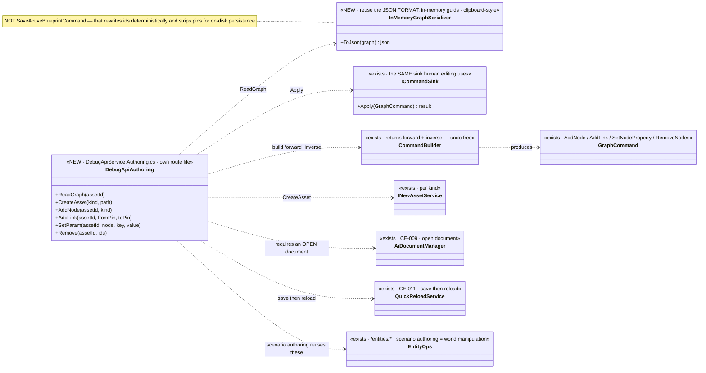
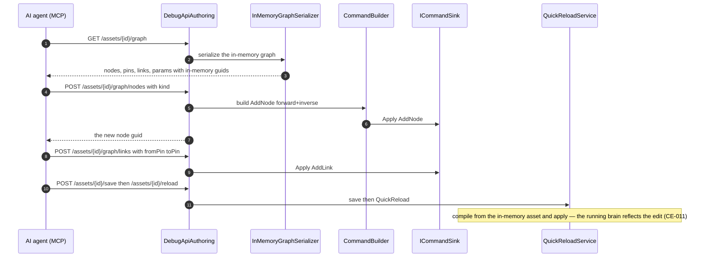
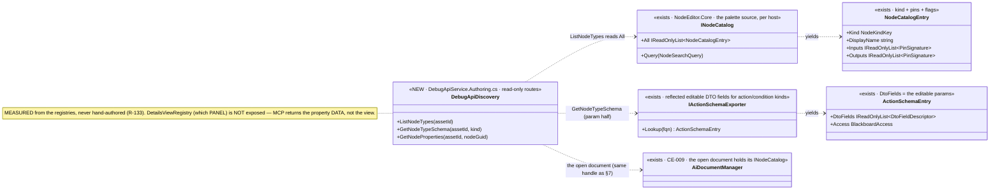
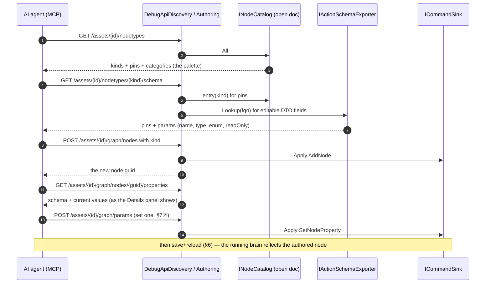
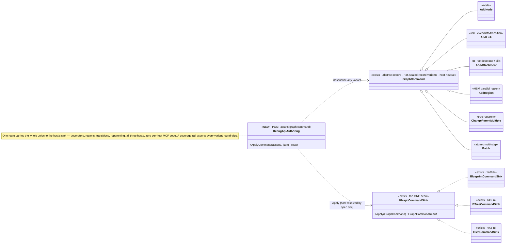

<!--STATUS
state: LIVE
build-state: READY-TO-BUILD — carries classDiagram + sequenceDiagram (§5/§6). Part of the MCP design docs
  (sibling of MCP_Integration.md). The MCP server gains AUTHORING: AI-asset (graph document) editing and
  scenario (world) authoring. Dispatch to a SEPARATE session from a base that includes CE-011 (§8).
updated: 2026-08-25
current-answer: the whole file. ⭐ §10 (the DISCOVERY surface — list node kinds + read a kind's property
  schema, auto-discovered from the registries) is a FOLLOW-UP SLICE, sequenced AFTER the mutation batch (§8):
  it shares the DebugApi route surface + generated catalog, so it CANNOT run concurrently.
  🔴 §11 (COMPLETENESS, `2026-08-25`) SUPERSEDES §7②'s 4-verb sketch: the edit surface is the WHOLE
  GraphCommand union (~35 variants incl. attachments=BTree decorators + regions=HSM parallel) via ONE generic
  route, and read/discover/monitor must match it across all three hosts. ⛔ Build §11's shape, not §7's.
  ✅ APPROVED by the user `2026-08-25`: the union-backbone route (§11.2) + discovery ships schema AND usage
  docs harvested from descriptive attributes, RouteDoc-style, with a doc-coverage rail (§10.6).
design-basis: Architect_Question_56_Mcp_Authoring_Surface.md (the decision trail — Q56-A..F resolved with
  the user; this doc is its graduation to a buildable design) · CE-009 (open + read/switch — the
  precondition) · CE-011 (save + QuickReload — the runtime effect) · AQ10 (deterministic pin/link ids on
  disk) · R-133/HN-030 (routes self-document; SKILL.md generated).
known-conflict: ⚠ shares the DebugApi surface with the CE-* editing slices — the collision plan is §8.
-->
# DESIGN — **the MCP authoring surface** *(AI-asset editing + scenario authoring)*

> 🎯 Turn the MCP server from **read/drive** *(open, inspect, switch tabs, save/reload — CE-009/011)* into
> **authoring**: an AI agent creates and edits AI assets *(graphs)* and authors scenarios *(the world)* over
> MCP. 📄 Graduates **[`Architect_Question_56`](blueprints/Architect_Question_56_Mcp_Authoring_Surface.md)**
> *(the resolved decision trail)* into a buildable design.

## 1. ⭐⭐⭐ TWO DISTINCT SURFACES *(Q56-C, resolved)* — they share little
| surface | what it is | mechanism |
|---|---|---|
| ⭐ **① AI-ASSET authoring** *(graph documents: BTree · HSM · Blueprint)* | **DOCUMENT editing** — create an asset, add/connect nodes, set params, remove | read-then-edit-by-guid via the **same command sink human editing uses** → save → QuickReload |
| ⭐ **② SCENARIO authoring** | **WORLD manipulation** — place/configure/assign/spawn/delete entities | the **existing `/entities/*` ops**; `scenario/save` **snapshots** the world, `scenario/load` reconstitutes |

⛔⛔ **There is no "edit a scenario file"** *(user)* — the scenario file is a **reduced SNAPSHOT of the world
at save time**. ⇒ scenario authoring is world manipulation, and ⭐ it is **ONE way with no modes** — the
same operations whether the exercise is **not-yet-running or running**. ⭐⭐ **AI-asset editing is likewise
UNIFORM pre/post-running** *(user, `2026-08-25`)* — the hot-reload path *(CE-011)* is what makes editing a
running asset the same operation as editing a stopped one.

## 2. ⭐⭐ INVENTORY — measured `2026-08-25` *(the authoring vocabulary EXISTS)*
| ✅ exists | where | role |
|---|---|---|
| `INewAssetService` per kind *(`Blueprint`/`Hsm`/`BTree`NewAssetService)* | `Hrot.*.Editor` | **create-asset** |
| `GraphCommand.AddNode`/`AddLink`/`SetNodeProperty`/`RemoveNodes` over `IGraphModel`, applied by a **command sink** *(`BlueprintCommandSink`)*; `CommandBuilder` returns **forward+inverse** | `NodeEditor.Core` · `Hrot.*.Editor/Host` | ⭐⭐ **the edit vocabulary — MCP translates into these** *(one path with human editing, undo free)* |
| open / read-tabs / switch / save / reload over MCP | `DebugApi` *(CE-009/011)* | the precondition + the runtime effect |
| `/entities/command` · `/entities/{id}/variable` *(stage)* · `scenario/load` · `scenario/save` | `DebugApi` | ⭐ **scenario authoring is largely THESE**, extended for the gaps |

## 3. 🔴🔴 THE READ SHAPE — **reuse the JSON FORMAT, NOT the save serialization** *(user caution, verified `2026-08-25`)*
📐 **Measured:** the on-disk `.bp.json` is **NOT a copy of the in-memory graph.** `SaveActiveBlueprintCommand`
**rewrites every link endpoint to a DETERMINISTIC name-derived pin guid** *(`IdGenerator.Deterministic("pin:{node}:{name}:{dir}")`)*
and **strips the in-memory pins** *(serialize-only, reverted in `finally`)* — so the FILE binds by name
*(AQ10 rehydration)*, while the **in-memory model uses RANDOM guids** that the **command sink edits by**.

⇒ ⛔⛔ **TWO ID SPACES.** The MCP read MUST expose the **in-memory** guids *(the ones the edit commands
reference)*, NOT the on-disk deterministic ones. ⇒ ⭐⭐ **reuse the JSON FORMAT** *(graphs · nodes · pins ·
links · params — the shape)* but ⛔ **not the save transform**. ⭐ **Closer analog to reuse:**
`BlueprintClipboard` *(copy/paste serializes an in-memory subgraph faithfully)*, not `SaveActiveBlueprintCommand`.

| the rule | |
|---|---|
| ⭐⭐⭐ **read and edit share ONE id space — the IN-MEMORY guids** | ⛔ never return the on-disk deterministic ids to the agent, or its edit-by-guid targets nothing |
| ⭐ **the read is an in-memory-faithful serialization** *(pins present, in-memory guids)* | ⚠ NOT `SaveActiveBlueprintCommand`'s output; the impl confirms the closest reusable serializer *(clipboard-style)* |
| ⭐ the on-disk deterministic ids stay a **persistence** concern | AQ10 owns them; MCP authoring never sees them |

## 4. ⭐ DETERMINISM — **not an authoring problem** *(Q56-D, resolved)*
⛔ No deterministic-id scheme, no human-naming layer. GUIDs as-is: the agent **reads** the in-memory guids,
**edits by** them, and the server **returns** any new guid *(add-node)*. For TESTS the harness already
normalizes ids *(conformance ignores `panelId`; goldens treat ids as storage keys)*.

## 5. ⭐⭐⭐ CLASS DIAGRAM

## 6. ⭐⭐⭐ SEQUENCE DIAGRAM *(AI-asset authoring)*

## 7. ⭐ THE ITEMS
| # | task | note |
|---|---|---|
| ⭐ **①** | **`GET /assets/{id}/graph`** — the in-memory-faithful serialization *(§3; in-memory guids; reuse the JSON format/clipboard serializer, ⛔ not the save transform)* | the primitive that makes read-then-edit work |
| ⭐ **②** | **AI-asset edit routes** — `POST /assets/{id}/graph/{nodes,links,params,remove}` → `CommandBuilder` → the command sink; add-node returns its guid | ⭐ one path with human editing; undo/inverse free |
| ⭐ **③** | **`POST /assets` create** → `INewAssetService` per kind | reuse |
| ⭐ **④** | **Scenario authoring** — extend the existing `/entities/*` for the world-manipulation gaps *(place/configure/assign)*; `scenario/save` snapshots | ⛔ no "edit a scenario file"; ⭐ one way, no modes |
| ⭐ **⑤** | validation via the existing `IAssetValidator` set | ⛔ no unvalidated write; a structure change hot-reloads via CE-011 |
| ⚠ **⑥** | ⚠ **the §17 Cosmetic/Soft/Hard classification is NOT on the QuickReload path** *(CE-011 §10.3, CE-023)* — authoring edits hot-apply, but the "Hard resets N instances" distinction rides the ALC file-watcher path, not yet wired | state it; do not assert a classification the path cannot produce |

## 8. ⭐⭐⭐ PARALLELISATION — **must not collide with the CE-* editing slices**
| | |
|---|---|
| ⭐ **own route file** | `DebugApiService.Authoring.cs`; ⛔ the CE-slices own `DebugApiService.Assets.cs` |
| ⚠ **shared, coordinator-serialized** | `DebugApiHost` registration · `DebugApiRouteDocs` · `tool-catalog.mjs` · `SKILL.md` · `src/index.mjs` handlers · `CapabilityManifest` ⇒ ⭐⭐ **this session branches from a base that ALREADY contains CE-011** and adds on top — ⛔ never concurrently from the same base |
| ⭐ **every new route carries a `RouteDoc`** + a handler in `src/index.mjs` | 📌 `gen:catalog:check` / `gen:skill:check` / `test-catalog` are the gates — CE-009 §4c caught six advertised-but-unreachable tools; ⛔ don't repeat it |

## 9. GATES
rule 8 + build/test rules. **Row 8 rails:** a conformance/rail that **round-trips** — read graph → add a node+link over MCP → the read now shows them → save+reload → the running brain reflects it; the add-node returns a resolvable guid; a create-asset appears in `GET /assets`; scenario authoring places an entity that `scenario/save` then snapshots. ⛔ `gen:catalog`/`gen:skill`/`test-catalog` green for every new route+handler; conformance suite as the integration gate.

## 10. ⭐⭐⭐ THE DISCOVERY SURFACE *(user, `2026-08-25`)* — **"what the user can SEE and change, the MCP can too"**
> 🎯 **User:** *"the MCP needs to add nodes to graphs, read/set their properties (shown in the detail panel),
> list all available nodes, and for a given node know its properties schema — all auto-discovered from
> various registries."* ⭐ **This is a READ companion to surface ① (mutation).** The add-node/set-param half
> is §7②; ⛔ what was missing is the **DISCOVERY** — the agent can't add a node without knowing *which kinds
> exist* and *what params a kind takes.* ⭐⭐ **The parity rule:** the palette + Details panel already read
> these registries; MCP reads the SAME ones. ⛔ Nothing is hand-authored — R-133's discipline *(the manifest
> is MEASURED from the routes)* applied to node kinds + schema.

### 10.1 ⭐⭐ INVENTORY — the registries, measured `2026-08-25` *(NOT one registry — several)*
| ✅ the registry | where | what it yields | the user's phrase it answers |
|---|---|---|---|
| ⭐⭐⭐ **`INodeCatalog.All`** *(→ `NodeCatalogEntry`)* | `NodeEditor.Core/Interfaces/INodeCatalog.cs` *(in-deg 63)*; populated per host by `BlueprintNodeCatalog` · `BTreeNodeCatalog` · `HsmNodeCatalog` | **every node KIND** with `DisplayName`, `Description`, `CategoryPath`, `Keywords`, flags *(`IsPure`/`IsLatent`/`IsDeprecated`)*, and ⭐ **`Inputs`/`Outputs` (`PinSignature`)** | ⭐ *"list all available nodes"* **and** the pin half of *"its properties schema"* |
| ⭐⭐ **`IActionSchemaExporter`** *(→ `ActionSchemaEntry.DtoFields`)* | `Hrot.Editor.AiShared/Blackboard/IActionSchemaExporter.cs` | for an **action/condition** kind: the reflected **editable DTO fields** `DtoFieldDescriptor(Name, Type)` + `Access` *(ReadOnly/ReadWrite)* + `Hosting` | ⭐ the **param half** of *"its properties schema"* — the fields the Details/Variables panel shows |
| ⚠ node **param model / drawer** *(`NodeDrawers/*`, `Inspector/DrawerRegistry`)* | `Hrot.Blueprints.Editor` | for **structural** kinds *(non-action)*: the editable config fields the inspector draws | the param half for non-action nodes |
| ⛔ `DetailsViewRegistry.OfferSet` *(which PANEL to draw)* | `Hrot.Editor.AiShared/Shell` | **NOT exposed** — it selects a UI *view*, not data | — *(scope line: MCP returns the property DATA, not the panel chrome)* |

⇒ ⭐⭐⭐ **"various registries" is literal:** kinds+pins from `INodeCatalog`, editable params from `IActionSchemaExporter` *(action nodes)* or the drawer *(structural nodes)*. ⭐ **The catalog is PER OPEN DOCUMENT** *(the host's palette)* — so discovery keys off the **same open-document handle the §7 mutation routes already require**; ⚠ the impl confirms the open `AiDocument`/host exposes its `INodeCatalog` *(thread it from the catalog builder if not)*.

### 10.2 ⭐ THE ROUTES *(read-only; mutation is §7)*
| # | route | reads | returns |
|---|---|---|---|
| ⭐ **①** | **`GET /assets/{id}/nodetypes`** | the open document's `INodeCatalog.All` | every kind: `kind`, `displayName`, `description`, `categoryPath`, flags, `inputs`/`outputs` *(name·direction·type)* — ⭐ **the palette the user sees** |
| ⭐ **②** | **`GET /assets/{id}/nodetypes/{kind}/schema`** | the catalog entry *(pins)* **+** `IActionSchemaExporter.Lookup(fqn)` *(DTO fields)* or the drawer *(structural params)* | `pins` + `params` *(name·type·enum-values if enum·readOnly)* — ⭐ **the properties schema for one kind** |
| ⭐ **③** | **`GET /assets/{id}/graph/nodes/{nodeGuid}/properties`** | §7①'s graph read *(current param VALUES by guid)* **joined** with ②'s schema | the node's current properties **as the Details panel shows them** *(schema + value)* — ⭐ the *read* half of *"read/set properties shown in the detail panel"* |

⭐⭐ **The SET half is already §7② `POST /assets/{id}/graph/params`** *(`SetNodeProperty` via the command sink)* — discovery adds the SCHEMA + the node-scoped read that makes that set target the right field with the right type. ⇒ **the full loop:** `list kinds → read a kind's schema → add a node of that kind → read its properties → set a param → save+reload.`

### 10.3 ⭐⭐⭐ DISCOVERY CLASS DIAGRAM

### 10.4 ⭐⭐⭐ DISCOVERY SEQUENCE DIAGRAM *(the full authoring loop discovery unlocks)*

### 10.5 ⭐ ITEMS & GATES *(the follow-up slice)*
| # | task | the one thing not to get wrong |
|---|---|---|
| ⭐ **①** | the three read routes *(10.2)* off the open document's `INodeCatalog` + `IActionSchemaExporter` | ⛔ **read the registries — never a hand-authored kind/param list** *(R-133; a hard-coded list rots the moment a node kind is added)* |
| ⭐ **②** | each route: a `RouteDoc` + a handler in `src/index.mjs`; `gen:catalog`/`gen:skill`/`test-catalog` green | 📌 CE-009 §4c — advertised-but-unreachable tools |
| ⭐ **③** | **schema-coverage rail:** for **every** kind in `INodeCatalog.All`, `GET .../{kind}/schema` returns without error | ⭐⭐ **this is the auto-discovery proof** — it fails the moment a registry adds a kind the route can't describe, which is exactly what "measured, not authored" must guarantee |
| ⚠ **④** | ⚠ **sequenced AFTER the mutation batch (§8)** — shares `DebugApiService.Authoring.cs` + the generated catalog; ⛔ not concurrent | branch from a base that includes the merged mutation slice |

### 10.6 ⭐⭐⭐ USAGE DOCS — **harvested from descriptive attributes, NOT hand-authored** *(user, `2026-08-25`)*
> 🎯 **User:** *"discovery must provide schemas AND enough docs on how to use — gathered from code via
> descriptive attributes, as elsewhere."* ⭐⭐ **"as elsewhere" = the `RouteDoc` pattern** *(`RouteDoc.cs`:
> `Summary`·`Returns`·`Hint`·`Params[]`·`Notes[]`·`ExampleArgsJson` — a colocated descriptor harvested at
> runtime; SKILL.md is GENERATED from it, R-133/HN-030)*. ⇒ ⭐⭐⭐ **discovery returns the same doc SHAPE for
> node kinds + params, harvested — never a second hand-written catalog.**

**The harvest sources, measured `2026-08-25`:**
| doc need | ✅ harvest source | kind |
|---|---|---|
| kind display name · description · keywords · category | `NodeCatalogEntry` *(already populated per host)* | structural, ✅ auto |
| ⭐ **which hosts a primitive is valid in** *(BTree action/condition · HSM action/guard · Blueprint call)* | **`GeneratedAiPrimitiveActionAttribute`** flags | structural, ✅ auto |
| action binding *(DTO type + field)* | `SharedAiActionAttribute(DtoType, FieldName)` + `ActionSchemaEntry` | structural, ✅ auto |
| ⭐ **param display name · range · unit · read-only · buffer shape** | **StructEdit `Edit*Attribute` family** *(`EditDisplayName`·`EditRange`·`EditUnit`·`EditReadOnly`·`InlineArrayHint`·`FixedBufferHint`)* — the SAME the Details editor reads | structural, ✅ auto |
| pin name + type + tooltip | `PinSignature` + the pin-tooltip builder | structural, ✅ auto |
| the discovery ROUTES themselves | **`RouteDoc`** *(self-documenting, like every DebugApi route)* | ✅ auto |

⚠🔴 **THE ONE GAP — free-text "how to use" prose.** ⛔ The attributes above carry **structural** doc; a
free-text *description/how-to* is NOT in any attribute today — it lives in **XML `/// 
` comments.**
⇒ ⭐ **Recommended lean:** harvest the XML `
` *(ship the doc-XML or extract it)* for the prose half,
and for kinds/params that lack one add a small **`[Doc("…")]` attribute to the StructEdit family** *(additive,
one line, exactly the `RouteDoc.Summary` idea at field granularity)*. ⛔ **Do NOT hand-author a parallel doc
table** — that is the rot `RouteDoc` was built to avoid.

⇒ ⭐⭐ **DOC-COVERAGE RAIL** *(extends 10.5③, mirrors `test-catalog`/`gen:catalog`)*: **every** node kind in
`INodeCatalog.All` and **every** editable param resolves a non-empty **schema + doc** *(structural always;
prose from `
`/`[Doc]`)* — the rail REDS on a kind/param that discovery cannot describe **or** document.
⭐ **That is the machine proof of "enough docs, measured not authored."**

## 11. 🔴🔴🔴 COMPLETENESS — **the WHOLE command union, and the host specifics** *(user, `2026-08-25`; measured)*
> 🎯 **User:** *"the goal is to make the graphs and AI assets editable AND monitorable by an AI agent so we
> can automatically test all the authoring features — and there's not just blueprints but BTree and HSM
> graphs, and they have specifics: regions, decorators, etc."* ⛔⛔ **This exposes a real gap in §7:** §7②
> named only `nodes/links/params/remove` — **4 of a ~35-variant union.** ⭐⭐⭐ **That subset cannot express a
> BTree decorator or an HSM region** — exactly the host specifics called out.

### 11.1 ⭐⭐⭐ THE FINDING — editing is ONE closed union through ONE seam *(measured `2026-08-25`)*
📐 `GraphCommand` *(`NodeEditor.Core/Commands/GraphCommand.cs`, in-deg 126)* is an **abstract record with ~35
`sealed record` variants**, applied through the **single** seam `IGraphCommandSink.Apply(GraphCommand)` —
implemented by **all three** sinks: `BlueprintCommandSink` *(1466 ln)* · `BTreeCommandSink` *(641 ln)* ·
`HsmCommandSink` *(443 ln)*. ⇒ ⭐⭐ **the edit vocabulary is host-NEUTRAL and complete already;** each sink
interprets the same commands for its host. The full union, grouped:

| group | variants | ⭐ the host it matters most for |
|---|---|---|
| **nodes** | `AddNode` · `RemoveNodes` · `MoveNodes` · `SetNodeProperty` · `SetNode{Collapsed,AdvancedShown,Disabled}` | all |
| **links / pins** | `AddLink` · `RemoveLinks` · `ReplaceLinkEndpoint` · `SetPinDefault` | ⭐ Blueprint *(exec vs data pins)* · HSM *(a transition IS a link + guard/event props)* |
| ⭐⭐ **attachments** | `AddAttachment` · `RemoveAttachments` · `SetAttachmentProperty` · `ReorderAttachments` · `MoveAttachment` | ⭐⭐⭐ **BTree DECORATORS / condition pills** *(`BTreePillAttachmentModel`)* · `HsmAttachment` |
| ⭐⭐ **containers / regions** | `AddRegion` · `RemoveRegion` · `ReorderRegions` · `SetRegionProperty` · `ChangeParent` · `ChangeParentMultiple` · `SetContainerCollapsed` | ⭐⭐⭐ **HSM parallel REGIONS** *(`RegionNode`/`RegionDescriptor`)* · BTree tree reparenting |
| **comments / reroutes** | `AddComment` · `UpdateComment` · `RemoveComment` · `InsertReroute` · `MoveReroute` · `RemoveReroute` | all *(cosmetic)* |
| **refactor** | `PromoteToVariable` · `CollapseToFunction` · `CollapseToMacro` · `CollapseToComment` · `ExpandNode` | Blueprint |
| **atomic** | `Batch(label, commands[])` | all |

### 11.2 ⭐⭐⭐ THE DECISION — **expose the union, don't curate verbs** *(recommended lean)*
⛔⛔ **A hand-picked verb list WILL lag the union** — 📌 it already did *(this section is that miss)*. ⭐⭐ Since
every sink is `Apply(GraphCommand)` and the union is **closed + discriminated + host-neutral**, the backbone is
**one generic route**:

| route | shape |
|---|---|
| ⭐⭐⭐ **`POST /assets/{id}/graph/command`** | body = **one serialized `GraphCommand`** *(a `type` tag + the variant's fields; ids/enums as strings)* → deserialize → `Apply` → return the `GraphCommandResult` + any new ids. ⭐ **`Batch` gives atomic multi-step for free** |
| ⭐ sugar *(optional)* — `.../nodes`, `.../links`, `.../params` | thin helpers that BUILD the union command; ⛔ never a parallel model — they call the same route |

⇒ ⭐⭐⭐ **This is the parity guarantee:** the MCP edit surface IS the human edit surface, because it dispatches
the same union to the same sink — decorators, regions, transitions, reparenting, refactors, all three hosts,
**zero per-host MCP code.** ⚠ **Tiering for the rail:** *semantic* variants *(AddNode/AddLink/AddAttachment/
AddRegion/SetNodeProperty/SetPinDefault/reparent/refactor)* must round-trip **and** survive save→reload;
*cosmetic* variants *(collapsed/advanced/move/reroute/comment-color)* must round-trip in the read but need not
change the running brain.

### 11.3 ⭐⭐ THE READ + DISCOVER MUST MATCH THE UNION — else the round-trip can't verify the host specifics
| surface | §-was | ⛔ the gap | ✅ the fix |
|---|---|---|---|
| **read** *(§7①)* | "nodes/pins/links/params" | ⛔ omits attachments · regions/containers · comments/reroutes · **HSM transition guard/event on links** | ⭐ the in-memory serializer emits the **full** structure — so a decorator/region edit is READ-BACKABLE *(the round-trip proof)* |
| **discover** *(§10)* | kinds + pins + params | ⛔ omits **which kinds are region CONTAINERS** *(`IContainerNodeModel`)* · **which accept ATTACHMENTS and of what `AttachmentCategory`** · **pin KIND** *(exec vs data, single vs collection)* | ⭐ discovery reports host-structure capability, not just kinds — so the agent knows a state is parallel-capable / a BTree node takes a decorator |

### 11.4 ⭐⭐ MONITORABLE — **runtime read-back, so an authoring test can assert the EFFECT** *(the user's "auto-test")*
⭐ Structural read-back *(11.3)* proves *"the edit landed in the model."* **Monitoring** proves *"the running brain
changed."* Name the runtime surfaces per host and confirm each is MCP-readable per graph *(mostly EXISTS —
CE-001..024 + slice-4)*:

| host | the live signal to expose | source |
|---|---|---|
| all | node runtime status *(active/ticking/last-result)* · breakpoint + pause state | the debug session + slice-4 |
| ⭐ **HSM** | **active states per region · `HsmTransitionFired` · `HsmRegionConflict`** | `Hsm.Editor/Debug/HsmDebugTypes` |
| ⭐ **BTree** | **per-node tick status overlay** | `BTreeHostServices` runtime overlay |
| all | blackboard / watch VALUES · validation results | the watch *(BP-508..512)* · `IAssetValidator` |

⇒ ⭐⭐ **The auto-test loop the user wants:** discover kinds+structure → author via the union → **read back the
structure** *(landed?)* → save+reload → **read the runtime signal** *(took effect?)* → assert. ⛔ Any host specific
missing from read/discover/monitor is a hole the authoring test cannot cover — 11.1–11.4 close them for all three.

### 11.5 ⭐⭐⭐ COMPLETENESS CLASS DIAGRAM

⇒ ⭐ **§7② is superseded by §11.2** *(generic union route + sugar)*; §7① and §10 are extended by §11.3; the
runtime surfaces are §11.4. ⛔ **The implementing session builds §11's shape, not §7's 4-verb sketch** — §7
stays as the narrative; §11 is the completeness contract.

## 12. ⭐ WHEN DONE
Fold the as-built here; state the ids *(its own lane/prefix)*; the report points here. Mark `AQ56` BUILT. ⭐ The discovery slice *(§10)* folds its as-built into §10 and flips the parity claim *("what the user sees, MCP reads")* from designed to built. ⭐⭐ **The completeness rail *(§11)* — every semantic `GraphCommand` variant round-trips across all three hosts — is the machine proof that "editable = whatever the human can do."**
