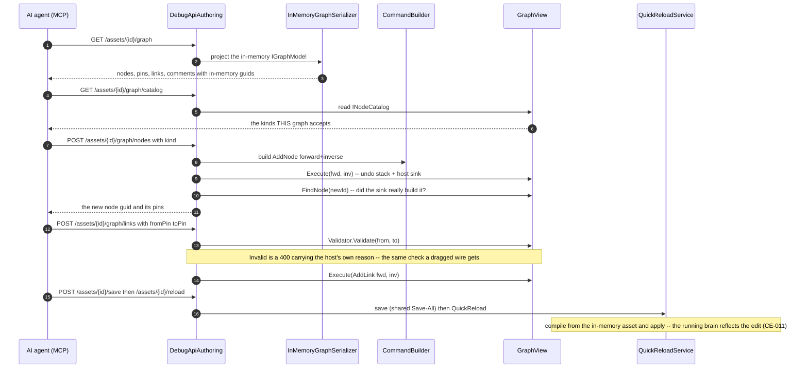
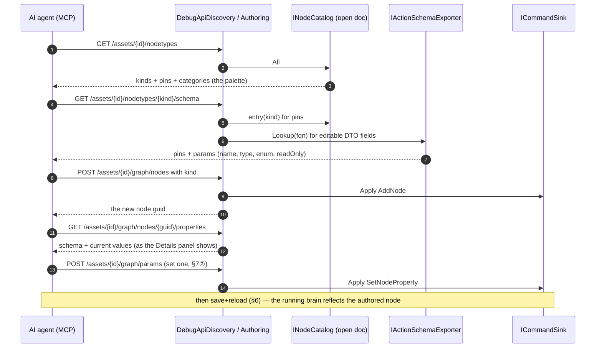
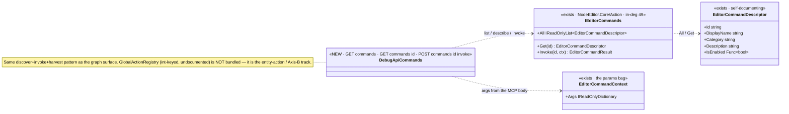
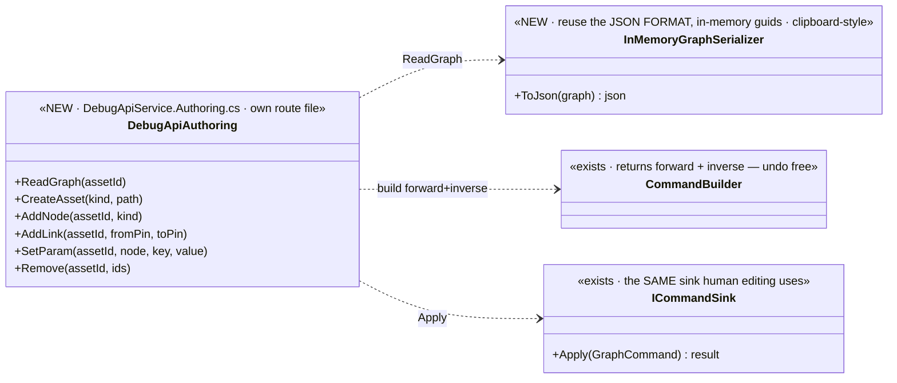

<!--STATUS
state: LIVE
build-state: BUILT — `2026-08-25`, ids `MA-001`…`MA-010`. §10 IS THE AS-BUILT and wins over anything above
  it that disagrees. §5's classDiagram has been REDRAWN to the as-built; the dispatched version is in
  §13 HISTORY. Carries classDiagram + sequenceDiagram (§5/§6). Part of the MCP design docs (sibling of
  MCP_Integration.md).
updated: 2026-08-25
current-answer: ⭐ §12 for WHAT EXISTS (the as-built of the mutation batch, `MA-001`…`MA-010`);
  §5/§6 for its shape; §1–§4 for the WHY, which the build did not change.
  ⭐ §10 (the DISCOVERY surface) and §11 (COMPLETENESS — the whole GraphCommand union) are the NEXT
  slices, written AFTER the mutation batch was dispatched. ⛔ They describe work NOT YET BUILT.
known-rot: ⚠ §3's "closer analog to reuse: BlueprintClipboard" is WRONG and §12.1 supersedes it — measured,
  the clipboard round-trips Blueprint ASSET nodes and carries no PinId at all. The RULE §3 states (two id
  spaces; expose the in-memory ids) is CORRECT and load-bearing; only the named analog was wrong.
  ⚠ §7's item list is missing the node-kind CATALOG route, which building the edit routes proved necessary
  (§12.2). ⚠ §7 ④ said "extend /entities/* for the gaps (place/configure/assign)"; measured, those three
  already had routes and DELETE was the only gap (§12.5).
known-conflict: 🔴🔴 §11 (added AFTER dispatch `8cf450cec`) says "the edit surface is the WHOLE GraphCommand
  union via ONE generic route — build §11's shape, not §7's". §12 IS §7's shape: 4 typed verbs, built and
  shipped before §11 existed. ⛔ NOT adapted — scope was frozen at the dispatch sha; reported instead
  (REPORT_Mcp_Authoring.md §8). ⚠ §10.2 ①'s proposed `GET /assets/{id}/nodetypes` is the SAME capability
  as the SHIPPED `GET /assets/{id}/graph/catalog` (§12.2, MA-004) — building both is ruling 9's duplicate.
design-basis: Architect_Question_56_Mcp_Authoring_Surface.md (the decision trail — Q56-A..F resolved with
  the user; this doc is its graduation to a buildable design) · CE-009 (open + read/switch — the
  precondition) · CE-011 (save + QuickReload — the runtime effect) · AQ10 (deterministic pin/link ids on
  disk) · R-133/HN-030 (routes self-document; SKILL.md generated).
known-conflict: ⚠ shares the DebugApi surface with the CE-* editing slices — the collision plan is §8.
-->
# DESIGN — **the MCP authoring surface** *(AI-asset editing + scenario authoring + UI-command actions)*

> 🎯 Turn the MCP server from **read/drive** *(open, inspect, switch tabs, save/reload — CE-009/011)* into
> **authoring**: an AI agent creates and edits AI assets *(graphs)* and authors scenarios *(the world)* over
> MCP. 📄 Graduates **[`Architect_Question_56`](blueprints/Architect_Question_56_Mcp_Authoring_Surface.md)**
> *(the resolved decision trail)* into a buildable design.

## 1. ⭐⭐⭐ TWO DISTINCT SURFACES *(Q56-C, resolved)* — they share little
| surface | what it is | mechanism |
|---|---|---|
| ⭐ **① AI-ASSET authoring** *(graph documents: BTree · HSM · Blueprint)* | **DOCUMENT editing** — create an asset, add/connect nodes, set params, remove | read-then-edit-by-guid via the **same command sink human editing uses** → save → QuickReload |
| ⭐ **② SCENARIO authoring** | **WORLD manipulation** — place/configure/assign/spawn/delete entities | the **existing `/entities/*` ops**; `scenario/save` **snapshots** the world, `scenario/load` reconstitutes |

⛔⛔ **There is no "edit a scenario file"** *(user)* — the scenario file is a **reduced SNAPSHOT of the world
at save time**. ⇒ scenario authoring is world manipulation, and ⭐ it is **ONE way with no modes** — the
same operations whether the exercise is **not-yet-running or running**. ⭐⭐ **AI-asset editing is likewise
UNIFORM pre/post-running** *(user, `2026-08-25`)* — the hot-reload path *(CE-011)* is what makes editing a
running asset the same operation as editing a stopped one.

## 2. ⭐⭐ INVENTORY — measured `2026-08-25` *(the authoring vocabulary EXISTS)*
| ✅ exists | where | role |
|---|---|---|
| `INewAssetService` per kind *(`Blueprint`/`Hsm`/`BTree`NewAssetService)* | `Hrot.*.Editor` | **create-asset** |
| `GraphCommand.AddNode`/`AddLink`/`SetNodeProperty`/`RemoveNodes` over `IGraphModel`, applied by a **command sink** *(`BlueprintCommandSink`)*; `CommandBuilder` returns **forward+inverse** | `NodeEditor.Core` · `Hrot.*.Editor/Host` | ⭐⭐ **the edit vocabulary — MCP translates into these** *(one path with human editing, undo free)* |
| open / read-tabs / switch / save / reload over MCP | `DebugApi` *(CE-009/011)* | the precondition + the runtime effect |
| `/entities/command` · `/entities/{id}/variable` *(stage)* · `scenario/load` · `scenario/save` | `DebugApi` | ⭐ **scenario authoring is largely THESE**, extended for the gaps |

## 3. 🔴🔴 THE READ SHAPE — **reuse the JSON FORMAT, NOT the save serialization** *(user caution, verified `2026-08-25`)*
📐 **Measured:** the on-disk `.bp.json` is **NOT a copy of the in-memory graph.** `SaveActiveBlueprintCommand`
**rewrites every link endpoint to a DETERMINISTIC name-derived pin guid** *(`IdGenerator.Deterministic("pin:{node}:{name}:{dir}")`)*
and **strips the in-memory pins** *(serialize-only, reverted in `finally`)* — so the FILE binds by name
*(AQ10 rehydration)*, while the **in-memory model uses RANDOM guids** that the **command sink edits by**.

⇒ ⛔⛔ **TWO ID SPACES.** The MCP read MUST expose the **in-memory** guids *(the ones the edit commands
reference)*, NOT the on-disk deterministic ones. ⇒ ⭐⭐ **reuse the JSON FORMAT** *(graphs · nodes · pins ·
links · params — the shape)* but ⛔ **not the save transform**.

> ⛔⛔ **SUPERSEDED — do not quote the next sentence as current.** ~~*Closer analog to reuse:
> `BlueprintClipboard`.*~~ 📐 **Measured `2026-08-25` (§12.1): the clipboard round-trips Blueprint ASSET
> nodes and carries no `PinId` at all**, so it cannot express this id space. ⭐ **The built answer is
> `InMemoryGraphSerializer`, projecting `IGraphModel`** — host-agnostic, and exposing exactly the ids the
> commands take. ⚠ **The RULE above this box is unchanged and load-bearing.**

| the rule | |
|---|---|
| ⭐⭐⭐ **read and edit share ONE id space — the IN-MEMORY guids** | ⛔ never return the on-disk deterministic ids to the agent, or its edit-by-guid targets nothing |
| ⭐ **the read is an in-memory-faithful serialization** *(pins present, in-memory guids)* | ⚠ NOT `SaveActiveBlueprintCommand`'s output. ⭐ **As built: `InMemoryGraphSerializer` over `IGraphModel`** *(§12.1)* — ⛔ not clipboard-style |
| ⭐ the on-disk deterministic ids stay a **persistence** concern | AQ10 owns them; MCP authoring never sees them |

## 4. ⭐ DETERMINISM — **not an authoring problem** *(Q56-D, resolved)*
⛔ No deterministic-id scheme, no human-naming layer. GUIDs as-is: the agent **reads** the in-memory guids,
**edits by** them, and the server **returns** any new guid *(add-node)*. For TESTS the harness already
normalizes ids *(conformance ignores `panelId`; goldens treat ids as storage keys)*.

## 5. ⭐⭐⭐ CLASS DIAGRAM — **AS BUILT** *(`2026-08-25`; the dispatched version is §13 HISTORY)*

> ⭐⭐ **Three names changed and one box was added.** The seam is **`IGraphCommandSink`**, not `ICommandSink`;
> the apply goes through **`GraphView.Execute`** *(the undo stack)*, not the sink directly; the serializer
> projects **`IGraphModel`**, not the clipboard; and **`INodeCatalog`** had to be exposed as a route.
> ⛔ Everything the dispatched diagram said about the DIRECTION of the dependencies was right.

## 6. ⭐⭐⭐ SEQUENCE DIAGRAM *(AI-asset authoring)* — **AS BUILT**

> ⭐⭐ **Two steps the dispatched sequence did not have, both forced by measurement:** the **catalog**
> read *(the agent cannot invent a node-kind id — §12.2)*, and the **model re-read after AddNode**
> *(the sink can answer success and build nothing — §12.2)*.

## 7. ⭐ THE ITEMS
| # | task | note |
|---|---|---|
| ⭐ **①** | **`GET /assets/{id}/graph`** — the in-memory-faithful serialization *(§3; in-memory guids; reuse the JSON format/clipboard serializer, ⛔ not the save transform)* | the primitive that makes read-then-edit work |
| ⭐ **②** | **AI-asset edit routes** — `POST /assets/{id}/graph/{nodes,links,params,remove}` → `CommandBuilder` → the command sink; add-node returns its guid | ⭐ one path with human editing; undo/inverse free |
| ⭐ **③** | **`POST /assets` create** → `INewAssetService` per kind | reuse |
| ⭐ **④** | **Scenario authoring** — extend the existing `/entities/*` for the world-manipulation gaps *(place/configure/assign)*; `scenario/save` snapshots | ⛔ no "edit a scenario file"; ⭐ one way, no modes |
| ⭐ **⑤** | validation via the existing `IAssetValidator` set | ⛔ no unvalidated write; a structure change hot-reloads via CE-011 |
| ⚠ **⑥** | ⚠ **the §17 Cosmetic/Soft/Hard classification is NOT on the QuickReload path** *(CE-011 §10.3, CE-023)* — authoring edits hot-apply, but the "Hard resets N instances" distinction rides the ALC file-watcher path, not yet wired | state it; do not assert a classification the path cannot produce |

## 8. ⭐⭐⭐ PARALLELISATION — **must not collide with the CE-* editing slices**
| | |
|---|---|
| ⭐ **own route file** | `DebugApiService.Authoring.cs`; ⛔ the CE-slices own `DebugApiService.Assets.cs` |
| ⚠ **shared, coordinator-serialized** | `DebugApiHost` registration · `DebugApiRouteDocs` · `tool-catalog.mjs` · `SKILL.md` · `src/index.mjs` handlers · `CapabilityManifest` ⇒ ⭐⭐ **this session branches from a base that ALREADY contains CE-011** and adds on top — ⛔ never concurrently from the same base |
| ⭐ **every new route carries a `RouteDoc`** + a handler in `src/index.mjs` | 📌 `gen:catalog:check` / `gen:skill:check` / `test-catalog` are the gates — CE-009 §4c caught six advertised-but-unreachable tools; ⛔ don't repeat it |

## 9. GATES
rule 8 + build/test rules. **Row 8 rails:** a conformance/rail that **round-trips** — read graph → add a node+link over MCP → the read now shows them → save+reload → the running brain reflects it; the add-node returns a resolvable guid; a create-asset appears in `GET /assets`; scenario authoring places an entity that `scenario/save` then snapshots. ⛔ `gen:catalog`/`gen:skill`/`test-catalog` green for every new route+handler; conformance suite as the integration gate.

## 10. ⭐⭐⭐ THE DISCOVERY SURFACE *(user, `2026-08-25`)* — **"what the user can SEE and change, the MCP can too"**
> 🎯 **User:** *"the MCP needs to add nodes to graphs, read/set their properties (shown in the detail panel),
> list all available nodes, and for a given node know its properties schema — all auto-discovered from
> various registries."* ⭐ **This is a READ companion to surface ① (mutation).** The add-node/set-param half
> is §7②; ⛔ what was missing is the **DISCOVERY** — the agent can't add a node without knowing *which kinds
> exist* and *what params a kind takes.* ⭐⭐ **The parity rule:** the palette + Details panel already read
> these registries; MCP reads the SAME ones. ⛔ Nothing is hand-authored — R-133's discipline *(the manifest
> is MEASURED from the routes)* applied to node kinds + schema.

### 10.1 ⭐⭐ INVENTORY — the registries, measured `2026-08-25` *(NOT one registry — several)*
| ✅ the registry | where | what it yields | the user's phrase it answers |
|---|---|---|---|
| ⭐⭐⭐ **`INodeCatalog.All`** *(→ `NodeCatalogEntry`)* | `NodeEditor.Core/Interfaces/INodeCatalog.cs` *(in-deg 63)*; populated per host by `BlueprintNodeCatalog` · `BTreeNodeCatalog` · `HsmNodeCatalog` | **every node KIND** with `DisplayName`, `Description`, `CategoryPath`, `Keywords`, flags *(`IsPure`/`IsLatent`/`IsDeprecated`)*, and ⭐ **`Inputs`/`Outputs` (`PinSignature`)** | ⭐ *"list all available nodes"* **and** the pin half of *"its properties schema"* |
| ⭐⭐ **`IActionSchemaExporter`** *(→ `ActionSchemaEntry.DtoFields`)* | `Hrot.Editor.AiShared/Blackboard/IActionSchemaExporter.cs` | for an **action/condition** kind: the reflected **editable DTO fields** `DtoFieldDescriptor(Name, Type)` + `Access` *(ReadOnly/ReadWrite)* + `Hosting` | ⭐ the **param half** of *"its properties schema"* — the fields the Details/Variables panel shows |
| ⚠ node **param model / drawer** *(`NodeDrawers/*`, `Inspector/DrawerRegistry`)* | `Hrot.Blueprints.Editor` | for **structural** kinds *(non-action)*: the editable config fields the inspector draws | the param half for non-action nodes |
| ⛔ `DetailsViewRegistry.OfferSet` *(which PANEL to draw)* | `Hrot.Editor.AiShared/Shell` | **NOT exposed** — it selects a UI *view*, not data | — *(scope line: MCP returns the property DATA, not the panel chrome)* |

⇒ ⭐⭐⭐ **"various registries" is literal:** kinds+pins from `INodeCatalog`, editable params from `IActionSchemaExporter` *(action nodes)* or the drawer *(structural nodes)*. ⭐ **The catalog is PER OPEN DOCUMENT** *(the host's palette)* — so discovery keys off the **same open-document handle the §7 mutation routes already require**; ⚠ the impl confirms the open `AiDocument`/host exposes its `INodeCatalog` *(thread it from the catalog builder if not)*.

### 10.2 ⭐ THE ROUTES *(read-only; mutation is §7)*
| # | route | reads | returns |
|---|---|---|---|
| ⭐ **①** | **`GET /assets/{id}/nodetypes`** | the open document's `INodeCatalog.All` | every kind: `kind`, `displayName`, `description`, `categoryPath`, flags, `inputs`/`outputs` *(name·direction·type)* — ⭐ **the palette the user sees** |
| ⭐ **②** | **`GET /assets/{id}/nodetypes/{kind}/schema`** | the catalog entry *(pins)* **+** `IActionSchemaExporter.Lookup(fqn)` *(DTO fields)* or the drawer *(structural params)* | `pins` + `params` *(name·type·enum-values if enum·readOnly)* — ⭐ **the properties schema for one kind** |
| ⭐ **③** | **`GET /assets/{id}/graph/nodes/{nodeGuid}/properties`** | §7①'s graph read *(current param VALUES by guid)* **joined** with ②'s schema | the node's current properties **as the Details panel shows them** *(schema + value)* — ⭐ the *read* half of *"read/set properties shown in the detail panel"* |

⭐⭐ **The SET half is already §7② `POST /assets/{id}/graph/params`** *(`SetNodeProperty` via the command sink)* — discovery adds the SCHEMA + the node-scoped read that makes that set target the right field with the right type. ⇒ **the full loop:** `list kinds → read a kind's schema → add a node of that kind → read its properties → set a param → save+reload.`

### 10.3 ⭐⭐⭐ DISCOVERY CLASS DIAGRAM

### 10.4 ⭐⭐⭐ DISCOVERY SEQUENCE DIAGRAM *(the full authoring loop discovery unlocks)*

### 10.5 ⭐ ITEMS & GATES *(the follow-up slice)*
| # | task | the one thing not to get wrong |
|---|---|---|
| ⭐ **①** | the three read routes *(10.2)* off the open document's `INodeCatalog` + `IActionSchemaExporter` | ⛔ **read the registries — never a hand-authored kind/param list** *(R-133; a hard-coded list rots the moment a node kind is added)* |
| ⭐ **②** | each route: a `RouteDoc` + a handler in `src/index.mjs`; `gen:catalog`/`gen:skill`/`test-catalog` green | 📌 CE-009 §4c — advertised-but-unreachable tools |
| ⭐ **③** | **schema-coverage rail:** for **every** kind in `INodeCatalog.All`, `GET .../{kind}/schema` returns without error | ⭐⭐ **this is the auto-discovery proof** — it fails the moment a registry adds a kind the route can't describe, which is exactly what "measured, not authored" must guarantee |
| ⚠ **④** | ⚠ **sequenced AFTER the mutation batch (§8)** — shares `DebugApiService.Authoring.cs` + the generated catalog; ⛔ not concurrent | branch from a base that includes the merged mutation slice |

### 10.6 ⭐⭐⭐ USAGE DOCS — **harvested from descriptive attributes, NOT hand-authored** *(user, `2026-08-25`)*
> 🎯 **User:** *"discovery must provide schemas AND enough docs on how to use — gathered from code via
> descriptive attributes, as elsewhere."* ⭐⭐ **"as elsewhere" = the `RouteDoc` pattern** *(`RouteDoc.cs`:
> `Summary`·`Returns`·`Hint`·`Params[]`·`Notes[]`·`ExampleArgsJson` — a colocated descriptor harvested at
> runtime; SKILL.md is GENERATED from it, R-133/HN-030)*. ⇒ ⭐⭐⭐ **discovery returns the same doc SHAPE for
> node kinds + params, harvested — never a second hand-written catalog.**

**The harvest sources, measured `2026-08-25`:**
| doc need | ✅ harvest source | kind |
|---|---|---|
| kind display name · description · keywords · category | `NodeCatalogEntry` *(already populated per host)* | structural, ✅ auto |
| ⭐ **which hosts a primitive is valid in** *(BTree action/condition · HSM action/guard · Blueprint call)* | **`GeneratedAiPrimitiveActionAttribute`** flags | structural, ✅ auto |
| action binding *(DTO type + field)* | `SharedAiActionAttribute(DtoType, FieldName)` + `ActionSchemaEntry` | structural, ✅ auto |
| ⭐ **param display name · range · unit · read-only · buffer shape** | **StructEdit `Edit*Attribute` family** *(`EditDisplayName`·`EditRange`·`EditUnit`·`EditReadOnly`·`InlineArrayHint`·`FixedBufferHint`)* — the SAME the Details editor reads | structural, ✅ auto |
| pin name + type + tooltip | `PinSignature` + the pin-tooltip builder | structural, ✅ auto |
| the discovery ROUTES themselves | **`RouteDoc`** *(self-documenting, like every DebugApi route)* | ✅ auto |

⚠🔴 **THE ONE GAP — free-text "how to use" prose.** ⛔ The attributes above carry **structural** doc; a
free-text *description/how-to* is NOT in any attribute today — it lives in **XML `/// 
` comments.**
⇒ ⭐ **Recommended lean:** harvest the XML `
` *(ship the doc-XML or extract it)* for the prose half,
and for kinds/params that lack one add a small **`[Doc("…")]` attribute to the StructEdit family** *(additive,
one line, exactly the `RouteDoc.Summary` idea at field granularity)*. ⛔ **Do NOT hand-author a parallel doc
table** — that is the rot `RouteDoc` was built to avoid.

⇒ ⭐⭐ **DOC-COVERAGE RAIL** *(extends 10.5③, mirrors `test-catalog`/`gen:catalog`)*: **every** node kind in
`INodeCatalog.All` and **every** editable param resolves a non-empty **schema + doc** *(structural always;
prose from `
`/`[Doc]`)* — the rail REDS on a kind/param that discovery cannot describe **or** document.
⭐ **That is the machine proof of "enough docs, measured not authored."**

### 10.7 ⭐⭐⭐ UI-COMMAND ACTIONS — **same discover+invoke shape ⇒ BUNDLED here** *(user, `2026-08-25`)*
> 🎯 **User:** *"the MCP UI-actions discovery and use is a pretty similar task — could be bundled as well?"*
> ✅ **Yes — measured `2026-08-25`, it is the SAME pattern**, and bundling is strictly better than the
> separately-queued "B" *(it shares the exact collision surface — one catalog regen, one RouteDoc set, one rail)*.

📐 **The parity is exact:** the editor command bus `IEditorCommands` is *discover-from-registry → invoke-through-
ONE-seam*, identical to the graph surface:
| | graph authoring | ⭐ UI-command actions |
|---|---|---|
| **list** | `INodeCatalog.All` | `IEditorCommands.All` *(in-deg 49)* |
| **describe one** | catalog entry + attributes | `Get(id)` → **`EditorCommandDescriptor`** |
| **doc harvest** | attributes + `
` *(§10.6)* | ⭐⭐ **the descriptor already carries `DisplayName`·`Category`·`Description`·`DefaultKey` INLINE** — even easier, no reflection |
| **invoke seam** | `IGraphCommandSink.Apply(GraphCommand)` | **`IEditorCommands.Invoke(id, ctx)`** → `EditorCommandResult` |
| **params** | the command's fields | ⭐ **`EditorCommandContext.Args` = `IReadOnlyDictionary<string,object?>`** *(+ optional canvas/screen pos)* |
| **live state** | node runtime status | `IsEnabled`/`IsChecked` + the `AvailabilityChanged` event |

**Routes** *(mirror the graph trio):* `GET /commands` *(list descriptors + enabled/checked)* · `GET /commands/{id}`
*(describe)* · `POST /commands/{id}/invoke` *(body = `{args, canvasPos?}` → `Invoke`)*.

⚠🔴 **TWO command registries — bundle ONLY the documented one:**
| registry | shape | verdict |
|---|---|---|
| ⭐⭐ **`IEditorCommands`** *(`NodeEditor.Core/Action`)* — the editor/toolbar/menu command bus | rich self-describing `EditorCommandDescriptor` + `All` + one `Invoke` seam | ✅ **BUNDLE** — self-documenting, exact same pattern |
| ⛔ **`GlobalActionRegistry`** *(`Hrot.Common/Interactions`)* — engine gizmo/entity-context actions | `Register(int actionId, handler)` / `TryGetHandler` — ⛔ **int-keyed, NO descriptor, NO display name, NOT self-documenting** | ⛔ **OUT** — it needs an author-a-descriptor pass and belongs with the ENTITY-ACTION vocabulary / Axis-B track *(`UX_Feature_Entity_Action_Vocabulary`, Q26-C1)*, not this bundle |

⇒ ⭐⭐ **The UI-command surface joins §10.6's doc-coverage rail** *(every `IEditorCommands` command is discoverable
AND has a non-empty `Description`)* and §11.2's "invoke through one seam" backbone — ⭐ **the slice now covers THREE
invoke surfaces through one pattern:** the graph-command union · scenario/entity ops · the editor command bus.

## 11. 🔴🔴🔴 COMPLETENESS — **the WHOLE command union, and the host specifics** *(user, `2026-08-25`; measured)*
> 🎯 **User:** *"the goal is to make the graphs and AI assets editable AND monitorable by an AI agent so we
> can automatically test all the authoring features — and there's not just blueprints but BTree and HSM
> graphs, and they have specifics: regions, decorators, etc."* ⛔⛔ **This exposes a real gap in §7:** §7②
> named only `nodes/links/params/remove` — **4 of a ~35-variant union.** ⭐⭐⭐ **That subset cannot express a
> BTree decorator or an HSM region** — exactly the host specifics called out.

### 11.1 ⭐⭐⭐ THE FINDING — editing is ONE closed union through ONE seam *(measured `2026-08-25`)*
📐 `GraphCommand` *(`NodeEditor.Core/Commands/GraphCommand.cs`, in-deg 126)* is an **abstract record with ~35
`sealed record` variants**, applied through the **single** seam `IGraphCommandSink.Apply(GraphCommand)` —
implemented by **all three** sinks: `BlueprintCommandSink` *(1466 ln)* · `BTreeCommandSink` *(641 ln)* ·
`HsmCommandSink` *(443 ln)*. ⇒ ⭐⭐ **the edit vocabulary is host-NEUTRAL and complete already;** each sink
interprets the same commands for its host. The full union, grouped:

| group | variants | ⭐ the host it matters most for |
|---|---|---|
| **nodes** | `AddNode` · `RemoveNodes` · `MoveNodes` · `SetNodeProperty` · `SetNode{Collapsed,AdvancedShown,Disabled}` | all |
| **links / pins** | `AddLink` · `RemoveLinks` · `ReplaceLinkEndpoint` · `SetPinDefault` | ⭐ Blueprint *(exec vs data pins)* · HSM *(a transition IS a link + guard/event props)* |
| ⭐⭐ **attachments** | `AddAttachment` · `RemoveAttachments` · `SetAttachmentProperty` · `ReorderAttachments` · `MoveAttachment` | ⭐⭐⭐ **BTree DECORATORS / condition pills** *(`BTreePillAttachmentModel`)* · `HsmAttachment` |
| ⭐⭐ **containers / regions** | `AddRegion` · `RemoveRegion` · `ReorderRegions` · `SetRegionProperty` · `ChangeParent` · `ChangeParentMultiple` · `SetContainerCollapsed` | ⭐⭐⭐ **HSM parallel REGIONS** *(`RegionNode`/`RegionDescriptor`)* · BTree tree reparenting |
| **comments / reroutes** | `AddComment` · `UpdateComment` · `RemoveComment` · `InsertReroute` · `MoveReroute` · `RemoveReroute` | all *(cosmetic)* |
| **refactor** | `PromoteToVariable` · `CollapseToFunction` · `CollapseToMacro` · `CollapseToComment` · `ExpandNode` | Blueprint |
| **atomic** | `Batch(label, commands[])` | all |

### 11.2 ⭐⭐⭐ THE DECISION — **expose the union, don't curate verbs** *(recommended lean)*
⛔⛔ **A hand-picked verb list WILL lag the union** — 📌 it already did *(this section is that miss)*. ⭐⭐ Since
every sink is `Apply(GraphCommand)` and the union is **closed + discriminated + host-neutral**, the backbone is
**one generic route**:

| route | shape |
|---|---|
| ⭐⭐⭐ **`POST /assets/{id}/graph/command`** | body = **one serialized `GraphCommand`** *(a `type` tag + the variant's fields; ids/enums as strings)* → deserialize → `Apply` → return the `GraphCommandResult` + any new ids. ⭐ **`Batch` gives atomic multi-step for free** |
| ⭐ sugar *(optional)* — `.../nodes`, `.../links`, `.../params` | thin helpers that BUILD the union command; ⛔ never a parallel model — they call the same route |

⇒ ⭐⭐⭐ **This is the parity guarantee:** the MCP edit surface IS the human edit surface, because it dispatches
the same union to the same sink — decorators, regions, transitions, reparenting, refactors, all three hosts,
**zero per-host MCP code.** ⚠ **Tiering for the rail:** *semantic* variants *(AddNode/AddLink/AddAttachment/
AddRegion/SetNodeProperty/SetPinDefault/reparent/refactor)* must round-trip **and** survive save→reload;
*cosmetic* variants *(collapsed/advanced/move/reroute/comment-color)* must round-trip in the read but need not
change the running brain.

### 11.3 ⭐⭐ THE READ + DISCOVER MUST MATCH THE UNION — else the round-trip can't verify the host specifics
| surface | §-was | ⛔ the gap | ✅ the fix |
|---|---|---|---|
| **read** *(§7①)* | "nodes/pins/links/params" | ⛔ omits attachments · regions/containers · comments/reroutes · **HSM transition guard/event on links** | ⭐ the in-memory serializer emits the **full** structure — so a decorator/region edit is READ-BACKABLE *(the round-trip proof)* |
| **discover** *(§10)* | kinds + pins + params | ⛔ omits **which kinds are region CONTAINERS** *(`IContainerNodeModel`)* · **which accept ATTACHMENTS and of what `AttachmentCategory`** · **pin KIND** *(exec vs data, single vs collection)* | ⭐ discovery reports host-structure capability, not just kinds — so the agent knows a state is parallel-capable / a BTree node takes a decorator |

### 11.4 ⭐⭐ MONITORABLE — **runtime read-back, so an authoring test can assert the EFFECT** *(the user's "auto-test")*
⭐ Structural read-back *(11.3)* proves *"the edit landed in the model."* **Monitoring** proves *"the running brain
changed."* Name the runtime surfaces per host and confirm each is MCP-readable per graph *(mostly EXISTS —
CE-001..024 + slice-4)*:

| host | the live signal to expose | source |
|---|---|---|
| all | node runtime status *(active/ticking/last-result)* · breakpoint + pause state | the debug session + slice-4 |
| ⭐ **HSM** | **active states per region · `HsmTransitionFired` · `HsmRegionConflict`** | `Hsm.Editor/Debug/HsmDebugTypes` |
| ⭐ **BTree** | **per-node tick status overlay** | `BTreeHostServices` runtime overlay |
| all | blackboard / watch VALUES · validation results | the watch *(BP-508..512)* · `IAssetValidator` |

⇒ ⭐⭐ **The auto-test loop the user wants:** discover kinds+structure → author via the union → **read back the
structure** *(landed?)* → save+reload → **read the runtime signal** *(took effect?)* → assert. ⛔ Any host specific
missing from read/discover/monitor is a hole the authoring test cannot cover — 11.1–11.4 close them for all three.

### 11.5 ⭐⭐⭐ COMPLETENESS CLASS DIAGRAM

⇒ ⭐ **§7② is superseded by §11.2** *(generic union route + sugar)*; §7① and §10 are extended by §11.3; the
runtime surfaces are §11.4. ⛔ **The implementing session builds §11's shape, not §7's 4-verb sketch** — §7
stays as the narrative; §11 is the completeness contract.

---

> ⛔⛔ **§12 and §13 below are the AS-BUILT of the MUTATION batch (`MA-001`…`MA-010`, dispatch
> `8cf450cec`).** ⭐ §10 and §11 above were written **after** that dispatch and describe **NOT-YET-BUILT**
> follow-up slices. ⚠ Where they disagree — notably §11's *"one generic union route, not §7's 4 verbs"* —
> **§12 records what SHIPPED and §11 records what is NEXT.** 📄 The reconciliation is
> [`REPORT_Mcp_Authoring.md`](blueprints/batches/REPORT_Mcp_Authoring.md) §8.

## 12. ⭐⭐⭐ AS BUILT — `2026-08-25`, ids `MA-001`…`MA-010` *(obligation ⑤)*

> ⭐⭐ **This section wins over anything above it that disagrees.** The `STATUS` block's `known-rot` lists
> the three places the dispatched text is now wrong; each is corrected below in its own words.

### 10.0 ⭐ What shipped

| route | tool | what it does |
|---|---|---|
| `GET /assets/{id}/graph` | `read_asset_graph` | the in-memory-faithful projection — **the first call of any session** |
| `GET /assets/{id}/graph/catalog` | `list_node_kinds` | ⚠ **NOT in §7** — see §12.2 |
| `POST /assets/{id}/graph/nodes` | `add_graph_node` | returns the new guid **and its pins** |
| `POST /assets/{id}/graph/links` | `add_graph_link` | validator first, then the sink |
| `POST /assets/{id}/graph/params` | `set_graph_param` | an input DATA pin's default |
| `POST /assets/{id}/graph/remove` | `remove_graph_elements` | invokes `editor.delete-selection` |
| `POST /assets` | `create_asset` | the host's own New-Asset path, via a delegate |
| `DELETE /entities/{networkId}` | `delete_entity` | scenario authoring's one missing verb |

📐 `gen:catalog` **74 → 82 tools**; `test-catalog` **657 / 0**.
⭐ All eight live in **`Hrot/Subsystems/Hrot.Editor/DebugApi/DebugApiService.Authoring.cs`** — §8's own
route file. ⛔ `DebugApiService.Assets.cs` was **not edited**; the authoring file CALLS its private
`ResolveOpenDocument` because a partial class shares members.

### 10.1 🔴🔴 THE SERIALIZER PROJECTS `IGraphModel` — **§3's named analog was wrong, its RULE was right**

| | |
|---|---|
| ⭐⭐⭐ **§3's RULE holds and is load-bearing** | there are **two id spaces**; the read must expose the **in-memory** ones. ⛔ Nothing about that changed |
| ⛔⛔ **§3's ANALOG was wrong** | *"closer analog to reuse: `BlueprintClipboard`"*. 📐 Measured: the clipboard round-trips `Hrot.Blueprints.Core.Assets.Node` — the **ASSET** model, Blueprint-only, and its own header says the vendored NodeEdit tree *"knows nothing about"* it. ⚠ **It carries no `PinId` at all**, so it cannot express the id space the edit commands use |
| ⭐⭐ **What was built instead** | `InMemoryGraphSerializer` projects **`IGraphModel` / `INodeModel` / `IPinModel` / `ILinkModel`** — the NodeEdit read-only view. ⭐ Those interfaces expose exactly the `NodeId`/`PinId`/`LinkId` that `GraphCommand` takes, ⇒ read and edit share one id space **by construction**, not by care |
| ⭐⭐⭐ **And it is HOST-AGNOSTIC** | one serializer covers **BTree, HSM and Blueprint**. ⛔ A clipboard-shaped one would have been three |

### 10.2 ⭐⭐ TWO STEPS THE DESIGN DID NOT HAVE, both forced by building it

| # | what | why it had to exist |
|---|---|---|
| ⭐⭐⭐ **the node-kind CATALOG route** | `GET /assets/{id}/graph/catalog` | 📐 `add_graph_node` takes a `kind` **string**, and the host sink answers an unknown kind by **building nothing while reporting success**. ⇒ ⛔ without discovery the agent must GUESS, and a wrong guess is a silent no-op — 📌 the *"advertised but unreachable"* shape `CE-009` §4c caught. ⭐ `INodeCatalog` already hangs off `GraphView`; this is a projection, not a registry |
| ⭐⭐ **the model RE-READ inside add-node** | `FindNode(newId)` after `Execute` | 📌 `AuthoringPath.AddNode`'s own message documents the failure: *"did not produce a node — the sink rejected the kind id"*. ⇒ the route re-reads and 400s, ⛔ rather than returning a guid that addresses nothing |

### 10.3 ⭐ THE SEAM NAMES — measured, and three differ from §5's dispatched diagram

| §5 said | it is actually | consequence |
|---|---|---|
| `ICommandSink` | **`IGraphCommandSink`** *(`NodeEditor.Core.Interfaces`)* | naming only |
| *"`DebugApiAuthoring ..> ICommandSink : Apply`"* | ⭐⭐ **`GraphView.Execute(fwd, inv, label)`** | ⭐ Execute records the inverse on the **undo stack** ⇒ an MCP edit is undoable exactly like a human one. ⛔ Applying to the sink directly *(what `AuthoringPath` does in tests)* would have skipped undo |
| `CommandBuilder` covers `SetNodeProperty` / `RemoveNodes` | ⛔ **it does not** | ⭐ It offers `AddNode` · `AddLink` · `SetPinDefault` · `MoveNodes` · `AddAttachment` · `Batch`. ⇒ **params became a PIN DEFAULT** *(the one edit whose inverse the model can produce)*, and **remove invokes `editor.delete-selection`** |

⭐⭐ **Why remove reuses the editor command rather than building `RemoveNodes`:** `EditCommands.DeleteSelectedUndoable`
already handles the **implicitly** deleted links incident to a removed node, the reroute waypoints, the
attachments, and an inverse whose steps are **reversed** so nodes are restored before the links that
reference them. ⛔ A hand-rolled removal gets the last of those wrong silently — undo appears to work.

### 10.4 🔴🔴 A DEFECT THIS BATCH FOUND AND FIXED — **CGF's save was a silent no-op after any edit**

📐 **Measured:** `SaveAllAiDocumentsCommand.Execute` skips a document whose `IsDirty` is false, and
`AiDocument.MarkDirty` had **exactly ONE production caller in the repo** — the EDITOR's `DocumentOpened`
factory *(`EditorSubsystem:4016`)*, which subscribes `doc.Asset.Changed` ⛔ **and only when a regeneration
scheduler exists**. ⚠⚠ **CGF's factory never subscribed at all** *(`CE-015` built the factories; the dirty
subscription was not part of them)*. ⇒ ⛔ **CGF could edit a graph and then write NOTHING, reporting
success** — `CE-020`'s save was reachable and inert.

⭐ **`MA-003`** adds the subscription to `CgfSubsystem`'s `DocumentOpened`, trimmed to what this host has
*(no scheduler — CGF regenerates nothing; the reload compiles from the in-memory asset)*.
⚠ **The route also calls `MarkEdited` per edit as a guard** — 📐 revert probe B shows it is **redundant on
a correctly-wired host**, and that is the point: the subscription is per-host COMPOSITION, which a host can
forget and did. ⛔ **No rail covers the guard** — pinning it needs a host lacking the subscription, and the
one that lacked it now has it. Filed `MA-009`.

### 10.5 ⭐⭐ SCENARIO AUTHORING — **§7 ④ asked for three verbs that already existed**

📐 Measured the existing `/entities/*` set against the four world-manipulation verbs:

| verb | route | verdict |
|---|---|---|
| **place** | `POST /entities/spawn` *(takes a transform)* | ✅ already built |
| **configure** | `POST /entities/{id}/attribute` · `/component` | ✅ already built |
| **assign** | `POST /entities/{id}/attach-blueprint` | ✅ already built |
| 🔴 **delete** | — | ⛔ **nothing.** ⇒ the one gap |

⇒ ⭐ `DELETE /entities/{networkId}` publishes the same `DestroyEntityCommand` that CGF's canvas delete and
the cluster's `DeleteEntityRequestSystem` publish. ⚠ **Queued like spawn** — teardown runs on a later tick.

### 10.6 ⛔⛔ WHAT THE RAILS MAY NOT DO — **never `save` a COMMITTED asset**

🔴 **Measured `2026-08-25`, the hard way:** the first cut of the headline rail edited and saved
`ComponentCollectionDemo.bp.json`, and `git status` came back with **372 deleted lines**.
⚠ **NOT a defect this batch introduced** — `SaveActiveBlueprintCommand` strips the projected pins and
rewrites link endpoints to deterministic name-derived ids on the way to disk *(§3, and `AQ10` rehydration
reverses it on load)*, so what the editor writes legitimately differs in SHAPE from the fatter committed
file. ⇒ **any save of any blueprint through the editor dirties the tree**; slice 3's rail never noticed
because it saved a CLEAN document, which is a no-op.

⇒ ⭐⭐ **The rails are split accordingly:** the EDIT half runs against committed assets and never saves
*(it removes what it added and reloads, which asserts the round trip left a graph the compiler still
accepts)*; the **SAVE half runs on an asset the rail CREATES** in a sentinel folder it deletes afterwards.
⚠ **Filed as `MA-010`:** the committed-vs-written shape difference is real and outside this batch.

### 10.7 ⭐ CGF DIVERGES ON CREATE — declared, not hidden

⛔ `create_asset` is wired on the **EDITOR only**. 📐 The path needs the per-kind `INewAssetService`
registry, the Blueprint source-root override *(`BUG-A6`: the SOURCE dir the contributor scans, not `bin/`)*
and the per-contributor `Refresh`; **CGF composes none of them**. ⇒ CGF answers **503** with a message that
says so and points out that EDITING an existing asset needs none of it. ⚠ Closing this is a `CE-` item, not
an `MA-` one.

---

## 13. ⛔ HISTORY — the dispatched class diagram *(SUPERSEDED by §5)*

> ⚠ Kept because the handoff cites it. ⛔ **Do not quote it as current** — §12.1/§12.3 say what changed.

## 14. ⭐ WHEN DONE
Fold the as-built here; state the ids *(its own lane/prefix)*; the report points here. Mark `AQ56` BUILT. ⭐ The discovery slice *(§10)* folds its as-built into §10 and flips the parity claim *("what the user sees, MCP reads")* from designed to built. ⭐⭐ **The completeness rail *(§11)* — every semantic `GraphCommand` variant round-trips across all three hosts — is the machine proof that "editable = whatever the human can do."**
