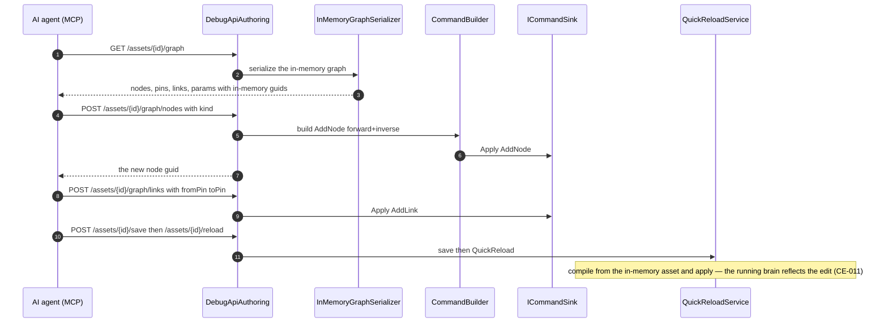

<!--STATUS
state: LIVE
build-state: READY-TO-BUILD — carries classDiagram + sequenceDiagram (§5/§6). Part of the MCP design docs
  (sibling of MCP_Integration.md). The MCP server gains AUTHORING: AI-asset (graph document) editing and
  scenario (world) authoring. Dispatch to a SEPARATE session from a base that includes CE-011 (§8).
updated: 2026-08-25
current-answer: the whole file.
design-basis: Architect_Question_56_Mcp_Authoring_Surface.md (the decision trail — Q56-A..F resolved with
  the user; this doc is its graduation to a buildable design) · CE-009 (open + read/switch — the
  precondition) · CE-011 (save + QuickReload — the runtime effect) · AQ10 (deterministic pin/link ids on
  disk) · R-133/HN-030 (routes self-document; SKILL.md generated).
known-conflict: ⚠ shares the DebugApi surface with the CE-* editing slices — the collision plan is §8.
-->
# DESIGN — **the MCP authoring surface** *(AI-asset editing + scenario authoring)*

> 🎯 Turn the MCP server from **read/drive** *(open, inspect, switch tabs, save/reload — CE-009/011)* into
> **authoring**: an AI agent creates and edits AI assets *(graphs)* and authors scenarios *(the world)* over
> MCP. 📄 Graduates **[`Architect_Question_56`](blueprints/Architect_Question_56_Mcp_Authoring_Surface.md)**
> *(the resolved decision trail)* into a buildable design.

## 1. ⭐⭐⭐ TWO DISTINCT SURFACES *(Q56-C, resolved)* — they share little
| surface | what it is | mechanism |
|---|---|---|
| ⭐ **① AI-ASSET authoring** *(graph documents: BTree · HSM · Blueprint)* | **DOCUMENT editing** — create an asset, add/connect nodes, set params, remove | read-then-edit-by-guid via the **same command sink human editing uses** → save → QuickReload |
| ⭐ **② SCENARIO authoring** | **WORLD manipulation** — place/configure/assign/spawn/delete entities | the **existing `/entities/*` ops**; `scenario/save` **snapshots** the world, `scenario/load` reconstitutes |

⛔⛔ **There is no "edit a scenario file"** *(user)* — the scenario file is a **reduced SNAPSHOT of the world
at save time**. ⇒ scenario authoring is world manipulation, and ⭐ it is **ONE way with no modes** — the
same operations whether the exercise is **not-yet-running or running**. ⭐⭐ **AI-asset editing is likewise
UNIFORM pre/post-running** *(user, `2026-08-25`)* — the hot-reload path *(CE-011)* is what makes editing a
running asset the same operation as editing a stopped one.

## 2. ⭐⭐ INVENTORY — measured `2026-08-25` *(the authoring vocabulary EXISTS)*
| ✅ exists | where | role |
|---|---|---|
| `INewAssetService` per kind *(`Blueprint`/`Hsm`/`BTree`NewAssetService)* | `Hrot.*.Editor` | **create-asset** |
| `GraphCommand.AddNode`/`AddLink`/`SetNodeProperty`/`RemoveNodes` over `IGraphModel`, applied by a **command sink** *(`BlueprintCommandSink`)*; `CommandBuilder` returns **forward+inverse** | `NodeEditor.Core` · `Hrot.*.Editor/Host` | ⭐⭐ **the edit vocabulary — MCP translates into these** *(one path with human editing, undo free)* |
| open / read-tabs / switch / save / reload over MCP | `DebugApi` *(CE-009/011)* | the precondition + the runtime effect |
| `/entities/command` · `/entities/{id}/variable` *(stage)* · `scenario/load` · `scenario/save` | `DebugApi` | ⭐ **scenario authoring is largely THESE**, extended for the gaps |

## 3. 🔴🔴 THE READ SHAPE — **reuse the JSON FORMAT, NOT the save serialization** *(user caution, verified `2026-08-25`)*
📐 **Measured:** the on-disk `.bp.json` is **NOT a copy of the in-memory graph.** `SaveActiveBlueprintCommand`
**rewrites every link endpoint to a DETERMINISTIC name-derived pin guid** *(`IdGenerator.Deterministic("pin:{node}:{name}:{dir}")`)*
and **strips the in-memory pins** *(serialize-only, reverted in `finally`)* — so the FILE binds by name
*(AQ10 rehydration)*, while the **in-memory model uses RANDOM guids** that the **command sink edits by**.

⇒ ⛔⛔ **TWO ID SPACES.** The MCP read MUST expose the **in-memory** guids *(the ones the edit commands
reference)*, NOT the on-disk deterministic ones. ⇒ ⭐⭐ **reuse the JSON FORMAT** *(graphs · nodes · pins ·
links · params — the shape)* but ⛔ **not the save transform**. ⭐ **Closer analog to reuse:**
`BlueprintClipboard` *(copy/paste serializes an in-memory subgraph faithfully)*, not `SaveActiveBlueprintCommand`.

| the rule | |
|---|---|
| ⭐⭐⭐ **read and edit share ONE id space — the IN-MEMORY guids** | ⛔ never return the on-disk deterministic ids to the agent, or its edit-by-guid targets nothing |
| ⭐ **the read is an in-memory-faithful serialization** *(pins present, in-memory guids)* | ⚠ NOT `SaveActiveBlueprintCommand`'s output; the impl confirms the closest reusable serializer *(clipboard-style)* |
| ⭐ the on-disk deterministic ids stay a **persistence** concern | AQ10 owns them; MCP authoring never sees them |

## 4. ⭐ DETERMINISM — **not an authoring problem** *(Q56-D, resolved)*
⛔ No deterministic-id scheme, no human-naming layer. GUIDs as-is: the agent **reads** the in-memory guids,
**edits by** them, and the server **returns** any new guid *(add-node)*. For TESTS the harness already
normalizes ids *(conformance ignores `panelId`; goldens treat ids as storage keys)*.

## 5. ⭐⭐⭐ CLASS DIAGRAM

## 6. ⭐⭐⭐ SEQUENCE DIAGRAM *(AI-asset authoring)*

## 7. ⭐ THE ITEMS
| # | task | note |
|---|---|---|
| ⭐ **①** | **`GET /assets/{id}/graph`** — the in-memory-faithful serialization *(§3; in-memory guids; reuse the JSON format/clipboard serializer, ⛔ not the save transform)* | the primitive that makes read-then-edit work |
| ⭐ **②** | **AI-asset edit routes** — `POST /assets/{id}/graph/{nodes,links,params,remove}` → `CommandBuilder` → the command sink; add-node returns its guid | ⭐ one path with human editing; undo/inverse free |
| ⭐ **③** | **`POST /assets` create** → `INewAssetService` per kind | reuse |
| ⭐ **④** | **Scenario authoring** — extend the existing `/entities/*` for the world-manipulation gaps *(place/configure/assign)*; `scenario/save` snapshots | ⛔ no "edit a scenario file"; ⭐ one way, no modes |
| ⭐ **⑤** | validation via the existing `IAssetValidator` set | ⛔ no unvalidated write; a structure change hot-reloads via CE-011 |
| ⚠ **⑥** | ⚠ **the §17 Cosmetic/Soft/Hard classification is NOT on the QuickReload path** *(CE-011 §10.3, CE-023)* — authoring edits hot-apply, but the "Hard resets N instances" distinction rides the ALC file-watcher path, not yet wired | state it; do not assert a classification the path cannot produce |

## 8. ⭐⭐⭐ PARALLELISATION — **must not collide with the CE-* editing slices**
| | |
|---|---|
| ⭐ **own route file** | `DebugApiService.Authoring.cs`; ⛔ the CE-slices own `DebugApiService.Assets.cs` |
| ⚠ **shared, coordinator-serialized** | `DebugApiHost` registration · `DebugApiRouteDocs` · `tool-catalog.mjs` · `SKILL.md` · `src/index.mjs` handlers · `CapabilityManifest` ⇒ ⭐⭐ **this session branches from a base that ALREADY contains CE-011** and adds on top — ⛔ never concurrently from the same base |
| ⭐ **every new route carries a `RouteDoc`** + a handler in `src/index.mjs` | 📌 `gen:catalog:check` / `gen:skill:check` / `test-catalog` are the gates — CE-009 §4c caught six advertised-but-unreachable tools; ⛔ don't repeat it |

## 9. GATES
rule 8 + build/test rules. **Row 8 rails:** a conformance/rail that **round-trips** — read graph → add a node+link over MCP → the read now shows them → save+reload → the running brain reflects it; the add-node returns a resolvable guid; a create-asset appears in `GET /assets`; scenario authoring places an entity that `scenario/save` then snapshots. ⛔ `gen:catalog`/`gen:skill`/`test-catalog` green for every new route+handler; conformance suite as the integration gate.

## 10. ⭐ WHEN DONE
Fold the as-built here; state the ids *(its own lane/prefix)*; the report points here. Mark `AQ56` BUILT.
