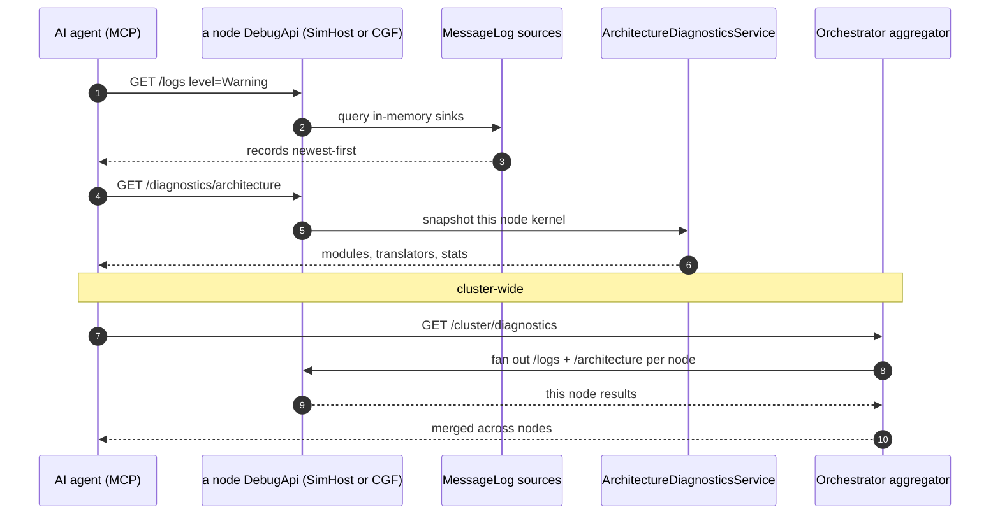

<!--STATUS
state: LIVE
build-state: BUILT (items ①②) — `2026-08-25`, ids `MD-001`..`MD-005`. ⛔ Items ③/④ are STOPPED, each with a
  measured blocker; see §8 AS BUILT. Carries classDiagram + sequenceDiagram (§4/§5). A NEW MCP capability area,
  sibling of DESIGN_Mcp_Authoring.md and MCP_Integration.md. Two things: (1) DOCUMENTS the per-node
  federation topology that already exists (each node hosts its own DebugApi with mode-gated capabilities);
  (2) designs the DIAGNOSTICS surface over MCP — per-node logs, per-node architecture snapshot, and
  cluster-wide collection — all on the SHARED DebugApiService so every node (incl. SimHost) exposes its own.
updated: 2026-08-25
current-answer: ⭐⭐ §8 AS BUILT — it WINS over §2.1/§2.2/§6 where they disagree (three premises moved).
design-basis: Hrot.ClusterRunner/Program.cs (the per-node DebugApiHost — editor-owned vs cluster-limited) ·
  EditorSubsystem.cs (the full-surface host) · DebugApiService.GetLogs + Fdp.Core/Logging (IMessageLogSource,
  MessageLog registry, NLogMessageLogTarget) · Fdp.ModuleHost/Diagnostics (IArchitectureDiagnosticsService) ·
  docs/designs/dump-diag/DESIGN.md (the cluster-wide diagnostic dump: CQRS intent -> per-node gather -> SMB
  pull to NAS; ClusterDiagnosticsPanel) · R-133/HN-030 (routes self-document; GET /capabilities is measured).
known-conflict: none. ⚠ The MCP authoring/create sessions own DebugApiService.Authoring.cs + the generated
  catalog; a diagnostics slice adds its own routes and MUST coordinate the ONE catalog regen if it runs
  concurrently with an authoring slice.
-->
# DESIGN — **MCP diagnostics + the per-node federation** *(logs · architecture · cluster-wide)*

> 🎯 Two parts. **①** Write down the topology that already exists: **every node runs its own MCP/DebugApi
> endpoint**, with capabilities gated by the subsystems it hosts. **②** Add the **diagnostics** surface —
> per-node logs, per-node architecture snapshot, cluster-wide collection — on the SHARED `DebugApiService`,
> so a SimHost node exposes *its own* logs/diagnostics, and the orchestrator can aggregate across nodes.

## 1. ⭐⭐⭐ THE FEDERATION — **each node hosts its own MCP endpoint** *(measured `2026-08-25`)*
| | |
|---|---|
| ⭐⭐ **who hosts** | `Hrot.ClusterRunner/Program.cs` — if the node's mode **includes the editor** *(editor / `--mode all`)*, **`EditorSubsystem`** owns the API with the **FULL** surface; otherwise the runner builds its **own** `DebugApiHost` *(HttpListener, `clusterPort` / `HROT_DEBUG_API_PORT`)* + a **limited** `DebugApiService(dispatcher)` |
| ⭐⭐ **what a node exposes** | the dispatcher is `PerspectiveScopedDispatcher(debugProviders,…)` — the providers for **the subsystems THAT node runs**. ⇒ a SimHost-only node exposes SimHost's providers *(entities, panels, and — once §2.1 lands — logs + diagnostics)*, but **NOT** the editor/authoring routes *(those live in `EditorSubsystem`)* |
| ⭐ **self-report** | `GET /capabilities` is **measured** from the route table *(R-133)* ⇒ an agent asks each node what it actually holds; ⛔ nothing hand-authored |
| ⇒ ⭐⭐⭐ **answer to "does a separate SimHost node run its own MCP server?"** | **YES — its own port, LIMITED capabilities** *(no authoring; entities/panels/logs/diagnostics for its subsystems)*. The editor/CGF/`--mode all` node gets the full surface because it runs `EditorSubsystem` |

⇒ ⭐⭐ **Design consequence, load-bearing:** anything that must work **per node** *(logs, architecture)* goes on the
**SHARED `DebugApiService`** *(reached by both the editor-owned and cluster-limited hosting paths)* — ⛔ NOT the
editor-only path, or the SimHost node cannot answer for itself.

## 2. ⭐⭐ THE DIAGNOSTICS SURFACE
### 2.1 ⭐⭐⭐ `GET /logs` — reads in-memory records, NOT the file *(exists; wiring gap)*
📐 **Route + handler EXIST:** `GetLogs(level, logger, since, max)` iterates `_logSinks`
*(`IReadOnlyList<IMessageLogSource>`)* off-thread, returns `[{timestamp, level, logger, message}]` newest-first.
The sources are real: `Fdp.Core/Logging` — a `MessageLog` registry + `NLogMessageLogTarget` *(the ring buffer that
feeds the on-screen `MessageLogWindow`)* + `AiBehaviorLogTarget` + `HotReloadMessageLogSource`.
🔴 **THE GAP (silent default):** `_logSinks = logSinks ?? Array.Empty<…>()` — if the composition builds
`DebugApiService` **without passing** `MessageLog.Sources`, `get_logs` returns `[]` while the same records feed the
UI window. ⚠ **Sharpest on the cluster path** — `Program.cs` builds `new DebugApiService(dispatcher)` with **no**
sinks ⇒ on a SimHost node `get_logs` is empty today. ⇒ ⭐⭐ **wire `MessageLog.Sources` at BOTH composition roots +
a rail.** *(the caller-had-the-value silent-default pattern.)*

### 2.2 ⭐⭐ `GET /diagnostics/architecture` — the modules/translators/stats snapshot *(per node)*
📐 The "Architecture Diagnostics" window is `ArchitectureDiagnosticsPanel` → **`IArchitectureDiagnosticsService`** /
`ArchitectureDiagnosticsService(ModuleHostKernel)` *(Fdp.ModuleHost)*. It builds a snapshot of **that node's**
modules, translators and stats straight from its kernel *(already JSON-able — `…DumpsItsSnapshot` test)*. ⇒ ⭐ expose
it as a read route on the shared service; **each node answers for its own kernel** ⇒ per-subsystem by construction.

### 2.3 ⭐⭐ Cluster-wide — reuse `dump-diag`, plus a records aggregator
The cluster window is the Orchestrator/ExCon **`ClusterDiagnosticsPanel`**, backed by the built **dump-diag** programme
*(`docs/designs/dump-diag/DESIGN.md`)*: an operator triggers a dump; every selected node gathers entity state, event
history, architecture, and NLog files, stages in `LocalTempRoot`, pulled to NAS over **SMB**; driven through the **CQRS
intent** pathway *(works from any node)*. Two MCP shapes, sequenced:
| | |
|---|---|
| ⭐ **(a) trigger the dump** | `POST /cluster/diagnostics/dump` *(select nodes)* + `GET /cluster/diagnostics/status` — reuse the CQRS pipeline; full archive to NAS. ⭐ Faithful to the window |
| ⭐ **(b) records aggregator** | the orchestrator **fans out** §2.1/§2.2 to every node's endpoint and merges JSON — *"recent records + architecture across nodes"*, no files. ⚠ needs §2.1 wired first |

## 3. ⭐⭐ INVENTORY — measured `2026-08-25`
| ✅ exists | where |
|---|---|
| `DebugApiHost` *(per node)* + `DebugApiService(dispatcher)` *(limited)* / editor full surface | `Hrot.ClusterRunner/Program.cs` · `EditorSubsystem.cs` |
| `DebugApiService.GetLogs` + `_logSinks` default-empty | `Hrot.Editor/DebugApi/DebugApiService.cs` |
| `IMessageLogSource` · `MessageLog` registry · `NLogMessageLogTarget` · `AiBehaviorLogTarget` · `HotReloadMessageLogSource` | `Fdp.Core/Logging` |
| `IArchitectureDiagnosticsService` · `ArchitectureDiagnosticsService(kernel)` · `ArchitectureDiagnosticsPanel` | `Fdp.ModuleHost/Diagnostics` · `Fdp.Presentation` |
| `ClusterDiagnosticsPanel` · `ILogArchiveExtractionService` · the merge worker · the CQRS dump pipeline | `Hrot.Orchestrator` · `Hrot.Core/Diagnostics` · `docs/designs/dump-diag/DESIGN.md` |
| `GET /capabilities` measured from routes | `DebugApi/CapabilityManifest.cs` |

## 4. ⭐⭐⭐ CLASS DIAGRAM

```mermaid
classDiagram
    direction LR
    class DebugApiHost {
        <<exists · per node · HttpListener on its own port>>
    }
    class DebugApiService {
        <<exists · shared · reached by editor-full AND cluster-limited hosting>>
        +GetLogs(level, logger, since, max)
        +GetArchitecture() NEW
    }
    class IMessageLogSource {
        <<exists · Fdp.Core/Logging · in-memory ring, feeds MessageLogWindow>>
    }
    class MessageLogRegistry {
        <<exists · MessageLog.Sources · WIRE into DebugApiService>>
    }
    class IArchitectureDiagnosticsService {
        <<exists · per-node kernel snapshot: modules, translators, stats>>
    }
    class ClusterDumpPipeline {
        <<exists · dump-diag · CQRS intent -> per-node gather -> SMB pull to NAS>>
    }
    class OrchestratorAggregator {
        <<NEW option b · fan out /logs + /architecture to each node, merge>>
    }
    DebugApiHost ..> DebugApiService : dispatches
    DebugApiService ..> MessageLogRegistry : GetLogs reads sources (FIX the empty default)
    MessageLogRegistry ..> IMessageLogSource : collects
    DebugApiService ..> IArchitectureDiagnosticsService : GetArchitecture
    OrchestratorAggregator ..> DebugApiHost : fan out per node
    OrchestratorAggregator ..> ClusterDumpPipeline : or trigger the file dump
    note for DebugApiService "Every NODE runs its own DebugApiHost/Service; capabilities are gated by the subsystems it hosts and self-reported by GET /capabilities. Diagnostics live on the SHARED service so a SimHost node answers for itself."
```

## 5. ⭐⭐⭐ SEQUENCE DIAGRAM

## 6. ⭐⭐ ITEMS
| # | task | the one thing not to get wrong |
|---|---|---|
| ⭐ **①** | **Wire `MessageLog.Sources` into `DebugApiService`** at BOTH composition roots *(editor + `ClusterRunner/Program.cs`)* + a rail | ⛔ the cluster path builds `DebugApiService(dispatcher)` with no sinks — that is the SimHost-node gap; the rail must assert `get_logs` is non-empty after a logged line on a cluster-limited node |
| ⭐ **②** | **`GET /diagnostics/architecture`** on the shared service, from `IArchitectureDiagnosticsService` | per-node kernel; a `RouteDoc` + handler + `test-catalog` |
| ⭐ **③** | **Cluster (a):** `POST /cluster/diagnostics/dump` + `GET .../status` reusing the dump-diag CQRS pipeline | ⛔ do not reinvent the collection — trigger the built pipeline |
| ⚠ **④** *(sequence after ①)* | **Cluster (b):** an orchestrator-side aggregator that fans out `/logs` + `/architecture` to each node and merges | records, not files; needs the per-node endpoints reachable |

## 7. GATES
rule 8 + build/test rules. **Row 8 rails:** ⭐ `get_logs` non-empty after a logged line on a **cluster-limited** node *(red by reverting the sink wiring — the SimHost-node proof)* · `GET /diagnostics/architecture` returns a node's modules/translators · the cluster route triggers a dump / aggregates across `--mode all` nodes. `gen:catalog`/`gen:skill`/`test-catalog` green for each new route+handler; `GET /capabilities` reflects the new routes *(the R-133 inversion)*. ⚠ coordinate the ONE catalog regen if an authoring slice runs concurrently.

## 8. ⭐ WHEN DONE
Fold the as-built here *(obligation ⑤)*; state the ids; the report points here. ⭐ Add the diagnostics tools to the MCP catalog; note which are per-node vs orchestrator-only.

---

# ⭐⭐⭐ 8. AS BUILT — `2026-08-25`, ids `MD-001`…`MD-005` *(obligation ⑤)*

> ⭐⭐ **Items ① and ② SHIPPED.** ⛔ **Items ③ and ④ are STOPPED, not skipped** — each has a measured
> blocker recorded below *(autonomy protocol: stop the item, not the batch)*.
> ⚠ **Three of this design's own premises turned out false when measured.** They are corrected here.

## 8.1 ⭐ WHAT SHIPPED

| item | as built | ids |
|---|---|---|
| ⭐⭐⭐ **①** | `MessageLogSinks.ForDiagnostics(registry?)` *(new, `Fdp.Core/Logging`)*, wired at **both** composition roots | `MD-001` |
| ⭐⭐ **②** | `GET /diagnostics/architecture` on the shared service, fed by a new `ISubsystemDebugProvider.Architecture` member | `MD-002` |
| ⭐ rails | `A_non_editor_node_reports_its_own_logs_and_architecture` — the first conformance rail that is NOT editor-owned | `MD-003` |
| ⚠ ③/④ | **STOPPED** — §8.5 | `MD-004` · `MD-005` |

📐 `gen:catalog` **90 → 91 tools** · `test-catalog` **729 / 0** · editor unit suite **251 / 0**.

## 8.2 🔴🔴 CORRECTION 1 — **`MessageLog.Sources` DOES NOT EXIST**

⛔ §2.1 says *"wire `MessageLog.Sources`"*. 📐 **Measured: there is no such static.** The registry is
**`MessageLogRegistry`, an INSTANCE**, reached through **`WindowManager.MessageLogRegistry`**.

⇒ ⭐⭐⭐ **A HEADLESS NODE HAS NO REGISTRY AT ALL** — which is precisely the SimHost case §2.1 exists to
serve, so the named fix would not have fixed the named gap. ⭐ **What actually works:**
`NLogMessageLogTarget.SharedInstance` and `AiBehaviorLogTarget.SharedInstance` are process-wide statics
that **`Program.Main` installs as NLog rules for EVERY mode, headless included** ⇒ they are populated on
a node with no window. ⭐ The helper unions those with the registry's own sources *(which carry the
host-specific `HotReloadMessageLogSource`)*, de-duplicated **by reference** — ⚠ without that the editor
would read the global NLog ring twice, because `MessageLogHostWiring.CreateAndRegister` seeds the
registry with the very same instance.

## 8.3 🔴🔴 CORRECTION 2 — **the seam had to become LAZY**

📐 **Measured:** the editor builds its `DebugApiService` in `Initialize`; its `MessageLogRegistry` is
created in **`RegisterWindows`, which runs LATER** — and which is also when subsystems register their own
sources. ⇒ ⛔ an eagerly-captured `IReadOnlyList` would latch the registry *as it was before anyone had
registered anything*, i.e. empty, forever.

⇒ ⭐⭐ **`logSinks` changed from `IReadOnlyList<IMessageLogSource>?` to
`Func<IReadOnlyList<IMessageLogSource>>?`**, re-read per request.
📌 **The same lesson `SubsystemDebugProvider`'s lazy accessors already carry**, and for the same measured
reason — value-capturing a composition-root dependency reports an absence the host acquires seconds later.

## 8.4 🔴🔴 CORRECTION 3 — **architecture is per SUBSYSTEM, not per NODE**

⛔ §2.2 says *"each node answers for its own kernel"*. 📐 **Measured: a node holds SEVERAL.**
`--mode all` expands to `orchestrator,simhost,ig,excon,cgf` and **SimHost, IG and CGF each construct
their own `ArchitectureDiagnosticsService`** *(6 construction sites across the subsystems)*. ⇒ one
snapshot per node would have had to pick one kernel and drop the rest silently.

⭐⭐⭐ **So the route did NOT get a new attach seam — the EXISTING per-subsystem one was extended.**
`ISubsystemDebugProvider` already carries `World`, `EntityMap`, `Drive`, `RequestTransition`, each
nullable-by-design and each measured into a capability cell in ONE place. ⭐ `Architecture` is the fifth,
built the same way: a lazy `Func<>`, a `DebugCapabilities.ArchitectureDiagnostics` cell derived from it
being non-null, and **`architecture: null` written out EXPLICITLY in ExCon** — which genuinely has no
kernel — rather than omitted.
⚠ The dispatcher gained **`AllProviders`**, ⛔ deliberately not `Active()`: architecture is the one read
where *"the perspective the user is looking at"* is the wrong scope.

⇒ 📐 **Measured on a real node: `SimHost — 10 modules, 56 systems, 37 translators`**, and the orchestrator
correctly reports nothing.

## 8.5 ⚠⚠ ITEMS ③ AND ④ — **CORRECTED `2026-08-25` after user challenge**

> 🔒 **User, verbatim:** *"in the UI as a user i can click and data gets collected and saved. the cluster
> wide collection works. No further aggregation needed. What is missing from the MCP?"*
>
> ⛔⛔ **The first version of this section claimed both items were BLOCKED. Both claims were wrong, in two
> different ways, and the correction is recorded here rather than silently overwritten.**

### ⛔ THE MISTAKE — **`MD-004`: I measured the wrong class**

📐 I read `DiagnosticsDumpProcessManager` *(which does expose only `Tick()`)* and concluded *"there is no
status read-model, so `GET /cluster/diagnostics/status` would have nothing to read."*

🔴 **The panel does not read status from that class.** 📐 Measured:

| the panel reads | from |
|---|---|
| the RESULT — the file manifest of the completed dump | ⭐ **`ClusterUiCache.LastDiagnosticManifest`** *(`ClusterDiagnosticsPanel.SyncManifestFromCache`)* |
| in-flight / completed transactions | ⭐ **`ClusterUiCache.HasInFlightTransaction` · `TxHistory`** |
| the target node list | ⭐ **`ClusterUiCache.ActiveNodes`** |
| the log-merge result | `LogMergeCompletedEvent` off the bus |

⇒ ⭐⭐⭐ **`ClusterUiCache` IS the CQRS read model, and the provider seam ALREADY REACHES IT** — ExCon's
`SubsystemDebugProvider` passes `clusterState: () => _uiCache…` and
`availableScenarios: () => _uiCache?.AvailableScenarios` from that very object, and the orchestrator holds
one too. 📌 **The seam law again: what I called missing was already there and under-adopted.**

### ⛔ THE OTHER MISTAKE — **`MD-005` is NOT BLOCKED, it is NOT NEEDED**

⭐ §2.3 offered **two** cluster shapes. **(a)** trigger the built dump-diag pipeline; **(b)** an
orchestrator-side HTTP fan-out that re-collects logs/architecture per node and merges JSON.
⇒ 🔒 **The user's ruling settles it: (a) is the answer and (b) is not wanted** — *"the cluster wide
collection works. No further aggregation needed."*

⚠ **My "no node → endpoint registry exists" finding is factually TRUE and was IRRELEVANT** — it is a
blocker for **(b)**, a mechanism that should not be built at all. ⛔ Reporting a true blocker for an
unwanted item read as *"the capability is unreachable"*, which is a different and false claim.

⇒ ⭐ **`MD-005` is WITHDRAWN as duplicate mechanism** *(ruling 9: the dump pipeline already collects
cluster-wide)*, ⛔ not deferred.

### ⭐⭐ WHAT IS ACTUALLY MISSING FROM MCP — **two routes, no new mechanism**

| # | route | what it does | reuses |
|---|---|---|---|
| ⭐ **1** | `POST /cluster/diagnostics/dump` | build a `DiagnosticDumpPayloadDto` *(target node ids · dump kinds · providers · severity · max-age)* and publish `ExecuteDiagnosticDumpIntent { RequestId, PayloadJson }` on the node's orchestration bus | ⭐ **exactly what `ClusterDiagnosticsPanel`'s Execute button does.** The publish path is the one `SubsystemDebugProvider.TransitionsVia` already proves reaches a `ClusterMaster` from any host |
| ⭐ **2** | `GET /cluster/diagnostics/status` | the in-flight transaction and the last manifest | ⭐ `ClusterUiCache` — the same object the panel renders and the provider already exposes two fields from |
| ⚠ **3** *(free)* | node selection | `ClusterUiCache.ActiveNodes` — already reachable by the same seam | |

⇒ ⭐⭐ **No new cluster contract, no endpoint registry, no aggregator.** The remaining work is a
`RequestDiagnosticDump` member on `ISubsystemDebugProvider` *(mirroring `RequestTransition`)* plus a
`Diagnostics` cache accessor, and the two routes above.
⚠ **The one real coordination point stands:** `Hrot.Orchestrator` / `Hrot.ExCon` provider wiring was
outside this handoff's §4 lane, and a parallel session was live — ⛔ that is a scheduling fact, not a
capability gap, and the earlier text conflated the two.

## 8.6 ⚠ A GATE THAT WAS NOT THERE

📐 **`DebugApiBatch11Tests.cs` — the ONLY test that exercises the `logSinks` seam — is
`<Compile Remove>`-excluded from its csproj**, along with nine sibling `DebugApiBatch*` files.
⇒ ⛔ **nothing has gated this seam**, which is part of why the empty default survived. ⭐ Its call site was
updated to the new `Func<>` shape so it is correct whenever it is re-enabled, ⚠ **but it does not compile
today and must not be counted as coverage.**
