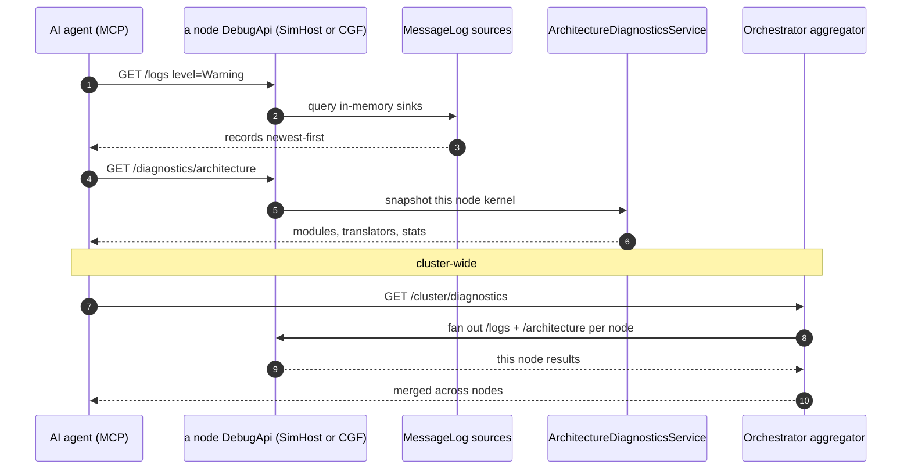

<!--STATUS
state: LIVE
build-state: BUILT — `2026-08-26`, ids `MD-001`..`MD-008`. ⭐ Items ①②③ SHIPPED; ⛔ item ④ WITHDRAWN as an
  unwanted duplicate mechanism (user ruling). See §8 AS BUILT and §9. Carries classDiagram + sequenceDiagram (§4/§5). A NEW MCP capability area,
  sibling of DESIGN_Mcp_Authoring.md and MCP_Integration.md. Two things: (1) DOCUMENTS the per-node
  federation topology that already exists (each node hosts its own DebugApi with mode-gated capabilities);
  (2) designs the DIAGNOSTICS surface over MCP — per-node logs, per-node architecture snapshot, and
  cluster-wide collection — all on the SHARED DebugApiService so every node (incl. SimHost) exposes its own.
updated: 2026-09-03
current-answer: ⭐⭐ §8 AS BUILT — it WINS over §2.1/§2.2/§6 where they disagree (three premises moved).
  ⭐⭐ §1c (CE-163) is the live answer for the SEPARATE-PROCESS topology, and it CORRECTS §7's
  "only a ClusterUiCache pumper can observe cluster state" as true-of-the-cache but incomplete: every ECS
  node's ClusterSlave holds its own committed state. ✅ BUILT — as-built + live evidence at §1c.1.
  ⛔ §1d (CE-164, IG publishes transition intents nothing drains) is measured and NOT built.
design-basis: Hrot.ClusterRunner/Program.cs (the per-node DebugApiHost — editor-owned vs cluster-limited) ·
  EditorSubsystem.cs (the full-surface host) · DebugApiService.GetLogs + Fdp.Core/Logging (IMessageLogSource,
  MessageLog registry, NLogMessageLogTarget) · Fdp.ModuleHost/Diagnostics (IArchitectureDiagnosticsService) ·
  docs/designs/dump-diag/DESIGN.md (the cluster-wide diagnostic dump: CQRS intent -> per-node gather -> SMB
  pull to NAS; ClusterDiagnosticsPanel) · R-133/HN-030 (routes self-document; GET /capabilities is measured).
known-conflict: none. ⚠ The MCP authoring/create sessions own DebugApiService.Authoring.cs + the generated
  catalog; a diagnostics slice adds its own routes and MUST coordinate the ONE catalog regen if it runs
  concurrently with an authoring slice.
-->
# DESIGN — **MCP diagnostics + the per-node federation** *(logs · architecture · cluster-wide)*

> 🎯 Two parts. **①** Write down the topology that already exists: **every node runs its own MCP/DebugApi
> endpoint**, with capabilities gated by the subsystems it hosts. **②** Add the **diagnostics** surface —
> per-node logs, per-node architecture snapshot, cluster-wide collection — on the SHARED `DebugApiService`,
> so a SimHost node exposes *its own* logs/diagnostics, and the orchestrator can aggregate across nodes.

## 1. ⭐⭐⭐ THE FEDERATION — **each node hosts its own MCP endpoint** *(measured `2026-08-25`)*
| | |
|---|---|
| ⭐⭐ **who hosts** | `Hrot.ClusterRunner/Program.cs` — if the node's mode **includes the editor** *(editor / `--mode all`)*, **`EditorSubsystem`** owns the API with the **FULL** surface; otherwise the runner builds its **own** `DebugApiHost` *(HttpListener, `clusterPort` / `HROT_DEBUG_API_PORT`)* + a **limited** `DebugApiService(dispatcher)` |
| ⭐⭐ **what a node exposes** | the dispatcher is `PerspectiveScopedDispatcher(debugProviders,…)` — the providers for **the subsystems THAT node runs**. ⇒ a SimHost-only node exposes SimHost's providers *(entities, panels, and — once §2.1 lands — logs + diagnostics)*, but **NOT** the editor/authoring routes *(those live in `EditorSubsystem`)* |
| ⭐ **self-report** | `GET /capabilities` is **measured** from the route table *(R-133)* ⇒ an agent asks each node what it actually holds; ⛔ nothing hand-authored |
| ⇒ ⭐⭐⭐ **answer to "does a separate SimHost node run its own MCP server?"** | **YES — its own port, LIMITED capabilities** *(no authoring; entities/panels/logs/diagnostics for its subsystems)*. The editor/CGF/`--mode all` node gets the full surface because it runs `EditorSubsystem` |

⇒ ⭐⭐ **Design consequence, load-bearing:** anything that must work **per node** *(logs, architecture)* goes on the
**SHARED `DebugApiService`** *(reached by both the editor-owned and cluster-limited hosting paths)* — ⛔ NOT the
editor-only path, or the SimHost node cannot answer for itself.

### 1c ✅ `CE-163` — **A SEPARATE-PROCESS CLUSTER COULD NOT READ ITS OWN CLUSTER STATE** *(measured `2026-09-03`; **FIXED** — as-built at §1c.1)*

> ⚠ **`R-129`/proper-noun note.** This section exists because the reasoning above turned out to key on the
> `--mode all` topology only. §7's *"only a subsystem that builds and PUMPS a `ClusterUiCache` can OBSERVE
> — in `--mode all` that is ExCon"* is **true and incomplete**: it is a fact about the **UI cache**, not
> about what a node KNOWS.

#### 📐 What was measured — four processes, one port each

| node | `--mode` | port | `GET /capabilities` matrix |
|---|---|---|---|
| orchestrator | `orchestrator` | `8100` | `hasMaster: true`, **`routablePerspectives: []`** ⇒ ⛔ **no `scenario.load`** |
| CGF | `cgf` | `8101` | `scenario.load: true` ⇒ ⛔ **no `cluster.state`** |
| SimHost | `simhost` | `8102` | same shape |
| IG | `ig` | `8103` | same shape *(and, after `CE-162`, `world.entityMap: true`)* |

⇒ 🔴 **`POST /scenario/load/live {waitForReady:true}` is unreachable in the real topology:** the
orchestrator refuses `scenario.load`, every ECS node refuses `cluster.state`. ⭐⭐ **But
`{waitForReady:false}` SUCCEEDS on any ECS node** — `via: cluster-intent`, and the fan-out demonstrably
lands *(entity counts move on all three nodes)*. ⇒ ⛔⛔ **the COMMAND is fine; only the READINESS READ is
missing.** ⚠ Exactly the shape `MCP_Integration.md` ② already named once — *a response making a supported
command look unsupported* — reappearing one topology down.

#### ⭐⭐⭐ The mechanism, and why the current fix does not reach here

```
DebugApiService.CurrentClusterState()
    => _clusterStateGetter?.Invoke()          // supplied ONLY by EditorSubsystem + ExConSubsystem
       ?? _dispatcher?.ClusterStateAnyNode    // any IN-PROCESS sibling's pumped ClusterUiCache
       ?? throw NotSupportedHere("cluster.state");
```

⭐ Both arms are **`--mode all` arms.** In a separate-process cluster there is no editor and no ExCon in
the CGF/SimHost/IG processes, so both are empty.

#### ⭐⭐ But the node DOES know — the fact the design never used

📐 **Every ECS node runs a `ClusterSlave`** *(`IgNodeBootstrapper.BuildOrchestration` → `new ClusterSlave(…)`;
`CgfApplication._clusterSlave`; SimHost via `NodeBootstrapper`)*, and `ClusterSlave` holds
**`_localStateId`** — its own **committed** cluster state, set in the `CommitState` arm and republished as
`TkClusterStateChangedEvent`. ⛔ **It is exposed today only as `LocalStateIdForTest`.** ⇒ ⭐⭐⭐ **the
capability is present on every node and no node passes it** — the same family as `CE-162` and the ten
before it, but shared rather than per-host.

#### ⭐⭐⭐ THE LEAN — **promote `ClusterSlave._localStateId` to a real property and project it from the SHARED path**

| | |
|---|---|
| **①** | `ClusterSlave` gains **`public ClusterState LocalClusterState => (ClusterState)_localStateId;`** — `LocalStateIdForTest` becomes a forwarder or goes |
| **②** | `SubsystemDebugProvider` gains a static **`ClusterStateFrom(Func<ClusterSlave?>)`** — the same shape as its existing `TkbFrom(...)` / `TransitionsVia(...)` statics, so this is a **known seam, not a new one** |
| **③** | ⭐⭐ **every ECS node bootstrap passes it** — ⛔ not IG-only. 🔒 *"every ECS node must use the same shared code"* |
| ⭐ **why NOT extend `ClusterStateAnyNode`** | it reads a **UI cache** that only cluster-UI subsystems build. ⛔ Making CGF/SimHost/IG build a `ClusterUiCache` to answer a question their `ClusterSlave` already answers is a second mechanism for one fact — the thing this programme keeps collapsing |
| ⚠ **the one honest caveat** | `LocalClusterState` is **this node's committed state**, not the master's view. ⇒ during a transition a node can legitimately lag. ⭐ That is the **right** semantic for a readiness poll *(the caller asks "is THIS node at the target?")*, and it is strictly more informative than today's refusal — ⛔ but it must be **named** in the payload, not passed off as a cluster-wide fact |

⭐ **Blast radius:** `ClusterSlave` *(one property)* · `SubsystemDebugProvider` *(one static)* · four node
bootstraps *(one argument each)*. ⛔ No route changes, no capability-key changes, no protocol change.

⚠ **What would change the lean:** if a design record says a node's `_localStateId` is deliberately NOT a
readable fact *(e.g. because only the master may assert cluster state)*, then the right answer is instead an
**orchestrator-side** `cluster.state` projection plus a `scenario.load` route on the orchestrator. ⛔
**Searched `docs/` and `.dev/` for such a ruling — none found**; `MCP_Integration.md` ② and this file's §7
both discuss only the `ClusterUiCache` source and never consider `ClusterSlave`.

### 1c.1 ✅ AS BUILT — `CE-163` *(obligation ⑤; `2026-09-03`)*

⭐ **The lean above was built as written**, with one correction and one question the user raised that
belongs in the record.

| # | as built |
|---|---|
| **①** | `ClusterSlave.LocalClusterState` — `public ClusterState LocalClusterState => (ClusterState)_localStateId;`. `LocalStateIdForTest` **kept** as the raw `int` the heartbeat carries, so wire-level assertions stay wire-level |
| **②** | `SubsystemDebugProvider.ClusterStateFrom(Func<ClusterSlave?>)` — the fourth member of the family beside `TransitionsVia` · `DumpsVia` · `TkbFrom` |
| **③** | **all three ECS nodes**, the same line: `CgfSubsystem` *(`() => _context?.ClusterSlave`)* · `IgSubsystem` and `SimHostSubsystem` *(`() => _app?.ClusterSlave`)* |
| ⚠ **correction to the lean** | it said "four node bootstraps". ⭐ It is **three** — `ExConSubsystem` keeps its `ClusterUiCache` arm, which is the **cluster-wide** view and the source `ClusterStateAnyNode` rests on. ⛔ Two different facts; collapsing them would have removed the `--mode all` readiness read |
| ⭐ **naming** | `IgApplication` and `SimHostApp` gained a production-named `ClusterSlave` property matching `CgfApplication`'s; `IgApplication.TestHook_ClusterSlave` is now a forwarder. ⛔ A production reader should not be reaching through a member called `TestHook_` |

#### ⭐⭐⭐ *"A shared STATIC — isn't that wrong for `--mode all`?"* — the question, and why the answer is no

⭐⭐ **Because it is a static FACTORY METHOD, not static STATE.** `ClusterStateFrom` has **no fields**; it
takes a caller's accessor and returns a closure over it:

```csharp
public static Func<ClusterState?> ClusterStateFrom(Func<ClusterSlave?> clusterSlave)
    => () => clusterSlave()?.LocalClusterState;
```

⇒ each subsystem calls it **once, with its OWN accessor**, and gets its **own** delegate. In `--mode all`
CGF's provider closes over CGF's slave and IG's over IG's; nothing is shared but the code. 📐 Verified
structurally: `SubsystemDebugProvider` has **four statics, all of this shape, and ZERO static fields** —
and the three that predate this one have shipped in `--mode all` since `HN-029`/`MD-006`.

⚠⚠ **The concern is nonetheless the RIGHT one to raise, because this file records a case where it was
real.** 📌 `BP-487`: a comment here asserted *"panels and the gizmo frame are PROCESS-WIDE statics"*, and
`CapabilityManifest` hard-coded `panels.gizmo = true` on every perspective on the strength of it — while
the buffer is **per subsystem** and ExCon has none, so `--mode all` claimed a feed that answered 404.
⇒ ⭐ **the checkable distinction: shared CODE is fine, shared STATE is the bug.** A static field caching a
`ClusterState` would have been exactly the `BP-487` defect again — every perspective reporting whichever
node wrote last.

#### ✅ LIVE EVIDENCE — the same four-process cluster *(`2026-09-03`)*

| | before `CE-163` | after |
|---|---|---|
| `GET /status` → `clusterState`, CGF · SimHost · IG | 🔴 `NOT_SUPPORTED_HERE(cluster.state)` on all three | ✅ `Idle` on all three at boot |
| ⭐⭐⭐ `POST /scenario/load/live {waitForReady:true}` | 🔴 refused on **every** node ⇒ unreachable in the real topology | ✅ **`ok, awaited:true, entityCount:1, sawWorldChange:true` in 1.6 s** |
| ⭐⭐⭐ the state **ADVANCES**, per node, independently | *(unobservable)* | ✅ `Idle` → **`OperatingLive`** on CGF, SimHost **and** IG, each in its own process |
| a later `load/edit` from CGF | — | ✅ all three → **`OperatingEdit`**, entity counts moved |
| orchestrator `8100` | `None` | `None` — ⭐ **correct**: it runs no ECS perspective and holds the master, not a slave |

⭐⭐ **The load-bearing assumption was MEASURED, not assumed.** The lean rested on *"`_localStateId`
actually advances on CGF/SimHost/IG"* — ⚠ and an old review (`.dev/_DONE/cgf-1/reviews/CGF-1-BATCH-05-REVIEW.md`
Issue 1) records a period when the **heartbeat field** was pinned to `Standby`. 📐 That was fixed
(`ClusterSlave.cs:156` now writes `_localStateId`), and the run above confirms the value moves. ⛔ Had it
not, this change would have reported a WRONG state instead of refusing — strictly worse — which is why it
was measured before the batch closed.

⭐ **Gated** by `Hrot.SimHost.Tests/TheDebugProvidersDoNotUnderReportTests.cs`:
`AnEcsNodeProjectsItsOwnClusterState_ThroughTheSharedSeam` *(theory over all three ECS subsystems)* plus
`TheSharedSeamReadsTheSlavesCommittedState` *(anti-vacuity — the seam still reads `_localStateId`)*.
⚠ **The assertion shape deliberately differs from `CE-162`'s:** there the argument was present and `null`;
here it was **absent entirely**, which no "not null" check can see — so the rail asserts the CALL.

### 1d 🔴 `CE-164` — **IG CAN PUBLISH A TRANSITION INTENT AND NOTHING DRAINS IT** *(measured `2026-09-03`; NOT fixed)*

⭐⭐ **Found only because `CE-163` landed.** Before it, `scenario/load/*` refused on `cluster.state`
regardless, so an inert publish and a capability refusal were indistinguishable.

| 📐 measured, same cluster | |
|---|---|
| `POST /scenario/load/live` on **IG** `8103` | ✅ `ok, via: "cluster-intent"` — ⛔ **and the cluster never moves**; all three nodes stay put |
| the **identical** call on **CGF** `8101` | ✅ moves all three nodes to the target |
| ⇒ | ⛔ **not an illegal transition, not a state problem — the ORIGIN node** |

⭐⭐⭐ **The cause, measured to the line.** CGF/SimHost get `NedSlaveOrchestrationTranslator`, which builds
**two** things — `NodeOpSlaveTranslator` *(ingress + heartbeat)* **and** `ClusterOpEgressTranslator`, whose
`Tick()` drains `TransitionStateIntent` off the node's bus to DDS *(`ClusterOpEgressTranslator.cs:91`)*.
⛔ **`IgNodeBootstrapper.BuildOrchestration` constructs a bare `NodeOpSlaveTranslator` directly** and no
egress translator — and `NodeOpSlaveTranslator` contains **zero** references to `TransitionStateIntent`.
⇒ ⭐ IG's `requestTransition` is **declared and inert**: the intent is published onto a bus nothing reads.

⚠⚠ **And the prose already claimed otherwise.** `IgApplication.cs`'s own remark says the bus is the one
*"its `ClusterSlave` and `ClusterOpEgressTranslator` sit on (`NodeBootstrapper:194-200`, **shared by
SimHost · CGF · IG**)"* — 🔴 **false for IG.** 📌 The same shape as `CE-162`: a documented absence that
was not the measured one.

⛔⛔ **THE PARAGRAPH ABOVE IS INCOMPLETE AND ITS LEAN WAS WRONG — SUPERSEDED `2026-09-03`.** It said IG
*"hand-constructs half of it"*, implying the egress translator is **missing** on IG. 🔴 **It is not
missing. It is BUILT and then DISCARDED.** ⇒ 📄 **the corrected mechanism, and the design consequence, is
`DESIGN_Subsystem_Composition_Unification.md` §4.1b** — which owns node bootstrap and is where this
belongs. ⭐ Keep reading there; the two paragraphs above remain true only as far as *"nothing drains IG's
intent"*.

⭐ **Still true, and still not built here:** the fix changes IG's DDS/bus wiring, a different blast radius
from `CE-163`'s read-only projection.

## 2. ⭐⭐ THE DIAGNOSTICS SURFACE
### 2.1 ⭐⭐⭐ `GET /logs` — reads in-memory records, NOT the file *(exists; wiring gap)*
📐 **Route + handler EXIST:** `GetLogs(level, logger, since, max)` iterates `_logSinks`
*(`IReadOnlyList<IMessageLogSource>`)* off-thread, returns `[{timestamp, level, logger, message}]` newest-first.
The sources are real: `Fdp.Core/Logging` — a `MessageLog` registry + `NLogMessageLogTarget` *(the ring buffer that
feeds the on-screen `MessageLogWindow`)* + `AiBehaviorLogTarget` + `HotReloadMessageLogSource`.
🔴 **THE GAP (silent default):** `_logSinks = logSinks ?? Array.Empty<…>()` — if the composition builds
`DebugApiService` **without passing** `MessageLog.Sources`, `get_logs` returns `[]` while the same records feed the
UI window. ⚠ **Sharpest on the cluster path** — `Program.cs` builds `new DebugApiService(dispatcher)` with **no**
sinks ⇒ on a SimHost node `get_logs` is empty today. ⇒ ⭐⭐ **wire `MessageLog.Sources` at BOTH composition roots +
a rail.** *(the caller-had-the-value silent-default pattern.)*

### 2.2 ⭐⭐ `GET /diagnostics/architecture` — the modules/translators/stats snapshot *(per node)*
📐 The "Architecture Diagnostics" window is `ArchitectureDiagnosticsPanel` → **`IArchitectureDiagnosticsService`** /
`ArchitectureDiagnosticsService(ModuleHostKernel)` *(Fdp.ModuleHost)*. It builds a snapshot of **that node's**
modules, translators and stats straight from its kernel *(already JSON-able — `…DumpsItsSnapshot` test)*. ⇒ ⭐ expose
it as a read route on the shared service; **each node answers for its own kernel** ⇒ per-subsystem by construction.

### 2.3 ⭐⭐ Cluster-wide — reuse `dump-diag`, plus a records aggregator
The cluster window is the Orchestrator/ExCon **`ClusterDiagnosticsPanel`**, backed by the built **dump-diag** programme
*(`docs/designs/dump-diag/DESIGN.md`)*: an operator triggers a dump; every selected node gathers entity state, event
history, architecture, and NLog files, stages in `LocalTempRoot`, pulled to NAS over **SMB**; driven through the **CQRS
intent** pathway *(works from any node)*. Two MCP shapes, sequenced:
| | |
|---|---|
| ⭐ **(a) trigger the dump** | `POST /cluster/diagnostics/dump` *(select nodes)* + `GET /cluster/diagnostics/status` — reuse the CQRS pipeline; full archive to NAS. ⭐ Faithful to the window |
| ⭐ **(b) records aggregator** | the orchestrator **fans out** §2.1/§2.2 to every node's endpoint and merges JSON — *"recent records + architecture across nodes"*, no files. ⚠ needs §2.1 wired first |

## 3. ⭐⭐ INVENTORY — measured `2026-08-25`
| ✅ exists | where |
|---|---|
| `DebugApiHost` *(per node)* + `DebugApiService(dispatcher)` *(limited)* / editor full surface | `Hrot.ClusterRunner/Program.cs` · `EditorSubsystem.cs` |
| `DebugApiService.GetLogs` + `_logSinks` default-empty | `Hrot.Editor/DebugApi/DebugApiService.cs` |
| `IMessageLogSource` · `MessageLog` registry · `NLogMessageLogTarget` · `AiBehaviorLogTarget` · `HotReloadMessageLogSource` | `Fdp.Core/Logging` |
| `IArchitectureDiagnosticsService` · `ArchitectureDiagnosticsService(kernel)` · `ArchitectureDiagnosticsPanel` | `Fdp.ModuleHost/Diagnostics` · `Fdp.Presentation` |
| `ClusterDiagnosticsPanel` · `ILogArchiveExtractionService` · the merge worker · the CQRS dump pipeline | `Hrot.Orchestrator` · `Hrot.Core/Diagnostics` · `docs/designs/dump-diag/DESIGN.md` |
| `GET /capabilities` measured from routes | `DebugApi/CapabilityManifest.cs` |

## 4. ⭐⭐⭐ CLASS DIAGRAM


## 5. ⭐⭐⭐ SEQUENCE DIAGRAM


## 6. ⭐⭐ ITEMS
| # | task | the one thing not to get wrong |
|---|---|---|
| ⭐ **①** | **Wire `MessageLog.Sources` into `DebugApiService`** at BOTH composition roots *(editor + `ClusterRunner/Program.cs`)* + a rail | ⛔ the cluster path builds `DebugApiService(dispatcher)` with no sinks — that is the SimHost-node gap; the rail must assert `get_logs` is non-empty after a logged line on a cluster-limited node |
| ⭐ **②** | **`GET /diagnostics/architecture`** on the shared service, from `IArchitectureDiagnosticsService` | per-node kernel; a `RouteDoc` + handler + `test-catalog` |
| ⭐ **③** | **Cluster (a):** `POST /cluster/diagnostics/dump` + `GET .../status` reusing the dump-diag CQRS pipeline | ⛔ do not reinvent the collection — trigger the built pipeline |
| ⚠ **④** *(sequence after ①)* | **Cluster (b):** an orchestrator-side aggregator that fans out `/logs` + `/architecture` to each node and merges | records, not files; needs the per-node endpoints reachable |

## 7. GATES
rule 8 + build/test rules. **Row 8 rails:** ⭐ `get_logs` non-empty after a logged line on a **cluster-limited** node *(red by reverting the sink wiring — the SimHost-node proof)* · `GET /diagnostics/architecture` returns a node's modules/translators · the cluster route triggers a dump / aggregates across `--mode all` nodes. `gen:catalog`/`gen:skill`/`test-catalog` green for each new route+handler; `GET /capabilities` reflects the new routes *(the R-133 inversion)*. ⚠ coordinate the ONE catalog regen if an authoring slice runs concurrently.

## 8. ⭐ WHEN DONE
Fold the as-built here *(obligation ⑤)*; state the ids; the report points here. ⭐ Add the diagnostics tools to the MCP catalog; note which are per-node vs orchestrator-only.

---

# ⭐⭐⭐ 8. AS BUILT — `2026-08-25`, ids `MD-001`…`MD-005` *(obligation ⑤)*

> ⭐⭐ **Items ① and ② SHIPPED.** ⛔ **Items ③ and ④ are STOPPED, not skipped** — each has a measured
> blocker recorded below *(autonomy protocol: stop the item, not the batch)*.
> ⚠ **Three of this design's own premises turned out false when measured.** They are corrected here.

## 8.1 ⭐ WHAT SHIPPED

| item | as built | ids |
|---|---|---|
| ⭐⭐⭐ **①** | `MessageLogSinks.ForDiagnostics(registry?)` *(new, `Fdp.Core/Logging`)*, wired at **both** composition roots | `MD-001` |
| ⭐⭐ **②** | `GET /diagnostics/architecture` on the shared service, fed by a new `ISubsystemDebugProvider.Architecture` member | `MD-002` |
| ⭐ rails | `A_non_editor_node_reports_its_own_logs_and_architecture` — the first conformance rail that is NOT editor-owned | `MD-003` |
| ⚠ ③/④ | **STOPPED** — §8.5 | `MD-004` · `MD-005` |

📐 `gen:catalog` **90 → 91 tools** · `test-catalog` **729 / 0** · editor unit suite **251 / 0**.

## 8.2 🔴🔴 CORRECTION 1 — **`MessageLog.Sources` DOES NOT EXIST**

⛔ §2.1 says *"wire `MessageLog.Sources`"*. 📐 **Measured: there is no such static.** The registry is
**`MessageLogRegistry`, an INSTANCE**, reached through **`WindowManager.MessageLogRegistry`**.

⇒ ⭐⭐⭐ **A HEADLESS NODE HAS NO REGISTRY AT ALL** — which is precisely the SimHost case §2.1 exists to
serve, so the named fix would not have fixed the named gap. ⭐ **What actually works:**
`NLogMessageLogTarget.SharedInstance` and `AiBehaviorLogTarget.SharedInstance` are process-wide statics
that **`Program.Main` installs as NLog rules for EVERY mode, headless included** ⇒ they are populated on
a node with no window. ⭐ The helper unions those with the registry's own sources *(which carry the
host-specific `HotReloadMessageLogSource`)*, de-duplicated **by reference** — ⚠ without that the editor
would read the global NLog ring twice, because `MessageLogHostWiring.CreateAndRegister` seeds the
registry with the very same instance.

## 8.3 🔴🔴 CORRECTION 2 — **the seam had to become LAZY**

📐 **Measured:** the editor builds its `DebugApiService` in `Initialize`; its `MessageLogRegistry` is
created in **`RegisterWindows`, which runs LATER** — and which is also when subsystems register their own
sources. ⇒ ⛔ an eagerly-captured `IReadOnlyList` would latch the registry *as it was before anyone had
registered anything*, i.e. empty, forever.

⇒ ⭐⭐ **`logSinks` changed from `IReadOnlyList<IMessageLogSource>?` to
`Func<IReadOnlyList<IMessageLogSource>>?`**, re-read per request.
📌 **The same lesson `SubsystemDebugProvider`'s lazy accessors already carry**, and for the same measured
reason — value-capturing a composition-root dependency reports an absence the host acquires seconds later.

## 8.4 🔴🔴 CORRECTION 3 — **architecture is per SUBSYSTEM, not per NODE**

⛔ §2.2 says *"each node answers for its own kernel"*. 📐 **Measured: a node holds SEVERAL.**
`--mode all` expands to `orchestrator,simhost,ig,excon,cgf` and **SimHost, IG and CGF each construct
their own `ArchitectureDiagnosticsService`** *(6 construction sites across the subsystems)*. ⇒ one
snapshot per node would have had to pick one kernel and drop the rest silently.

⭐⭐⭐ **So the route did NOT get a new attach seam — the EXISTING per-subsystem one was extended.**
`ISubsystemDebugProvider` already carries `World`, `EntityMap`, `Drive`, `RequestTransition`, each
nullable-by-design and each measured into a capability cell in ONE place. ⭐ `Architecture` is the fifth,
built the same way: a lazy `Func<>`, a `DebugCapabilities.ArchitectureDiagnostics` cell derived from it
being non-null, and **`architecture: null` written out EXPLICITLY in ExCon** — which genuinely has no
kernel — rather than omitted.
⚠ The dispatcher gained **`AllProviders`**, ⛔ deliberately not `Active()`: architecture is the one read
where *"the perspective the user is looking at"* is the wrong scope.

⇒ 📐 **Measured on a real node: `SimHost — 10 modules, 56 systems, 37 translators`**, and the orchestrator
correctly reports nothing.

## 8.5 ⚠⚠ ITEMS ③ AND ④ — **CORRECTED `2026-08-25` after user challenge**

> 🔒 **User, verbatim:** *"in the UI as a user i can click and data gets collected and saved. the cluster
> wide collection works. No further aggregation needed. What is missing from the MCP?"*
>
> ⛔⛔ **The first version of this section claimed both items were BLOCKED. Both claims were wrong, in two
> different ways, and the correction is recorded here rather than silently overwritten.**

### ⛔ THE MISTAKE — **`MD-004`: I measured the wrong class**

📐 I read `DiagnosticsDumpProcessManager` *(which does expose only `Tick()`)* and concluded *"there is no
status read-model, so `GET /cluster/diagnostics/status` would have nothing to read."*

🔴 **The panel does not read status from that class.** 📐 Measured:

| the panel reads | from |
|---|---|
| the RESULT — the file manifest of the completed dump | ⭐ **`ClusterUiCache.LastDiagnosticManifest`** *(`ClusterDiagnosticsPanel.SyncManifestFromCache`)* |
| in-flight / completed transactions | ⭐ **`ClusterUiCache.HasInFlightTransaction` · `TxHistory`** |
| the target node list | ⭐ **`ClusterUiCache.ActiveNodes`** |
| the log-merge result | `LogMergeCompletedEvent` off the bus |

⇒ ⭐⭐⭐ **`ClusterUiCache` IS the CQRS read model, and the provider seam ALREADY REACHES IT** — ExCon's
`SubsystemDebugProvider` passes `clusterState: () => _uiCache…` and
`availableScenarios: () => _uiCache?.AvailableScenarios` from that very object, and the orchestrator holds
one too. 📌 **The seam law again: what I called missing was already there and under-adopted.**

### ⛔ THE OTHER MISTAKE — **`MD-005` is NOT BLOCKED, it is NOT NEEDED**

⭐ §2.3 offered **two** cluster shapes. **(a)** trigger the built dump-diag pipeline; **(b)** an
orchestrator-side HTTP fan-out that re-collects logs/architecture per node and merges JSON.
⇒ 🔒 **The user's ruling settles it: (a) is the answer and (b) is not wanted** — *"the cluster wide
collection works. No further aggregation needed."*

⚠ **My "no node → endpoint registry exists" finding is factually TRUE and was IRRELEVANT** — it is a
blocker for **(b)**, a mechanism that should not be built at all. ⛔ Reporting a true blocker for an
unwanted item read as *"the capability is unreachable"*, which is a different and false claim.

⇒ ⭐ **`MD-005` is WITHDRAWN as duplicate mechanism** *(ruling 9: the dump pipeline already collects
cluster-wide)*, ⛔ not deferred.

### ⭐⭐ WHAT IS ACTUALLY MISSING FROM MCP — **two routes, no new mechanism**

| # | route | what it does | reuses |
|---|---|---|---|
| ⭐ **1** | `POST /cluster/diagnostics/dump` | build a `DiagnosticDumpPayloadDto` *(target node ids · dump kinds · providers · severity · max-age)* and publish `ExecuteDiagnosticDumpIntent { RequestId, PayloadJson }` on the node's orchestration bus | ⭐ **exactly what `ClusterDiagnosticsPanel`'s Execute button does.** The publish path is the one `SubsystemDebugProvider.TransitionsVia` already proves reaches a `ClusterMaster` from any host |
| ⭐ **2** | `GET /cluster/diagnostics/status` | the in-flight transaction and the last manifest | ⭐ `ClusterUiCache` — the same object the panel renders and the provider already exposes two fields from |
| ⚠ **3** *(free)* | node selection | `ClusterUiCache.ActiveNodes` — already reachable by the same seam | |

⇒ ⭐⭐ **No new cluster contract, no endpoint registry, no aggregator.** The remaining work is a
`RequestDiagnosticDump` member on `ISubsystemDebugProvider` *(mirroring `RequestTransition`)* plus a
`Diagnostics` cache accessor, and the two routes above.
⚠ **The one real coordination point stands:** `Hrot.Orchestrator` / `Hrot.ExCon` provider wiring was
outside this handoff's §4 lane, and a parallel session was live — ⛔ that is a scheduling fact, not a
capability gap, and the earlier text conflated the two.

## 8.6 ⚠ A GATE THAT WAS NOT THERE

📐 **`DebugApiBatch11Tests.cs` — the ONLY test that exercises the `logSinks` seam — is
`<Compile Remove>`-excluded from its csproj**, along with nine sibling `DebugApiBatch*` files.
⇒ ⛔ **nothing has gated this seam**, which is part of why the empty default survived. ⭐ Its call site was
updated to the new `Func<>` shape so it is correct whenever it is re-enabled, ⚠ **but it does not compile
today and must not be counted as coverage.**

---

# ⭐⭐⭐ 9. AS BUILT — the cluster dump, `2026-08-26`, ids `MD-006` / `MD-007`

> 🔒 **Built on the user's ruling that §8.5's "blocked" verdict was wrong.** ⭐ This section is the
> as-built for item ③; ⛔ item ④ stays WITHDRAWN.

## 9.1 ⭐⭐ TWO ROUTES, AND **NOTHING NEW COLLECTS ANYTHING**

| route | tool | what it does |
|---|---|---|
| `POST /cluster/diagnostics/dump` | `trigger_cluster_diagnostic_dump` | ⭐ builds a `DiagnosticDumpPayloadDto` and publishes `ExecuteDiagnosticDumpIntent` — **byte-for-byte what `ClusterDiagnosticsPanel`'s Execute button publishes** |
| `GET /cluster/diagnostics/status` | `get_cluster_diagnostic_status` | ⭐ `inFlight` + the last successful dump's manifest, read from **`ClusterUiCache` — the same read model the panel's results section renders** |

📐 `gen:catalog` **91 → 93 tools** · `test-catalog` **745 / 0** · editor unit suite **251 / 0**.

⇒ ⭐⭐⭐ **The dump-diag pipeline is untouched.** It already fans out over CQRS intent, gathers on every
selected node and pulls to NAS over SMB. ⛔ These routes are a **second surface on one mechanism**, which
is the whole reason §2.3 (b)'s aggregator is not built *(ruling 9)*.

## 9.2 ⭐⭐ THE SEAM — **the fifth and sixth members of the same provider contract**

```
ISubsystemDebugProvider
  World · EntityMap · Drive · RequestTransition · ClusterState · AvailableScenarios
  + Architecture            (MD-002)
  + RequestDiagnosticDump   (MD-006)  ── SubsystemDebugProvider.DumpsVia(bus), mirroring TransitionsVia
  + DumpStatus              (MD-007)  ── a DiagnosticDumpStatus record: primitives, never the cache object
```

| ⭐ decision | why |
|---|---|
| **`DumpsVia` mirrors `TransitionsVia`** | 📐 every host publishes onto its own orchestration bus and every one of those buses reaches a `ClusterMaster`. ⛔ Four hand-written copies of one lambda is four places to drift |
| **trigger on all four subsystems, status on ExCon only** | ⭐ any node may ASK *(the dump is cluster-wide by construction)*; ⛔ only a subsystem that builds and PUMPS a `ClusterUiCache` can OBSERVE — in `--mode all` that is ExCon, the same measured fact `ClusterStateAnyNode` already rests on |
| **`DiagnosticDumpStatus` carries primitives** | ⭐ identical to how `clusterState` and `availableScenarios` are projected out of the cache ⇒ `Hrot.Presentation` needs no reference to `Hrot.Orchestrator`. ⚠ Lossless: the cached manifest carries only `RelativeDest` |
| **`RequestDiagnosticDumpAnyNode` falls back past the active perspective** | ⛔ unlike `Drive`, where the asking node IS the answer. ⭐ A cluster-wide dump does not care which node asks |

## 9.3 ⭐⭐⭐ THE ONE ASSERTION THAT EARNS THE RAIL

⛔⛔ **A `200` with a transaction id proves only that the ROUTE ran.** 📌 This surface has been bitten
twice by exactly that gap — `MA-004` *(an id resolving to nothing)* and `MA-017` *(a command accepted that
built nothing)*.

⇒ ⭐⭐ **the rail polls the node's own output for the `ClusterMaster`'s fan-out line carrying THAT
transaction id.** 📐 Measured green:
`ClusterMaster | [Orchestrator] Diagnostic Dump 39d84531-… fanned out to 1 node(s).`
🔴 **Probed by making the publish a silent no-op:** the route still answers `200 queued:true`, and the rail
**reddens** — *"the route returned queued:true … but the ClusterMaster never logged fanning it out."*

⚠ **What the rail deliberately does NOT assert: that files appeared.** ⛔ There is no NAS in the harness,
so demanding a non-empty manifest would redden on the ENVIRONMENT, not the code. ⭐ It asserts what this
SURFACE owns — publish, fan-out, honest status, and that an empty node list is REFUSED.

## 9.4 ⭐ AN EMPTY NODE LIST IS REFUSED, NOT READ AS "ALL"

📐 `ClusterDiagnosticsPanel` **disables its Execute button** on an empty selection. ⇒ ⛔ accepting `[]`
over MCP would make it **the one path that does what the UI refuses** — 📌 the same parity argument as the
`409` on a disabled editor command *(`MA-015`)*. ⭐ And dumping every node is a materially different
operation from dumping one.

---

# ⚠⚠ 10. `MD-008` — **A REPORTED GAP THAT WAS NOT ONE** *(`2026-08-26`)*

> 📌 Filed by the coordinator as the next candidate: *"`/editor/commands` is empty on the CGF node —
> `Program.cs` never calls `AttachEditorCommands` for the cluster service though CGF builds an
> `EditorCommandsImpl`."*
> ⛔⛔ **Measured FALSE. A CGF node answers with 68 commands.** Nothing was wired; a rail was added.

## 10.1 📐 THE MEASUREMENT

| the claim | 📐 measured |
|---|---|
| *"`Program.cs` never calls `AttachEditorCommands`"* | ✅ **TRUE** — it appears exactly once in the repo, in `EditorSubsystem` |
| *"⇒ `/editor/commands` is empty on the CGF node"* | 🔴 **FALSE** — `GET /editor/commands` returns **68 commands** on `--mode orchestrator,cgf` |

⭐⭐⭐ **Why both can be true:** `DebugApiService.ResolveEditorCommands()` checks the attached delegate
**first** and then **falls back**:

```csharp
if (_editorCommands?.Invoke() is { } attached) return attached;
var active = _documents?.Active;
return active == null ? null : ContextOf(active)?.Commands;
```

⇒ ⭐ `_documents` arrives with **`AttachAssetShell`**, which **both** roots call *(`Program.cs:480`,
`EditorSubsystem:3011`)*. ⛔ So the explicit attach computes the **same expression from the same object**
as the fallback — it is a duplicate wiring, **not a missing one.**

## 10.2 ⛔ WHAT WAS *NOT* DONE, AND WHY

⚠ A first cut **did** add the attach to `Program.cs` and factored the lambda into a shared helper.
🔴 **Its revert probe stayed GREEN** — the rail passed with the attach removed — which is what exposed the
false premise. ⇒ ⭐⭐ **all three code edits were reverted.** Adding a second path to an answer that
already resolves is exactly the duplication ruling 9 forbids.

⭐ **`AttachEditorCommands` itself is KEPT** *(no rush removals)*: it is checked FIRST, so it is a genuine
**override hook** for a host whose commands do not come from a document. ⚠ Both call sites now carry a
comment saying the fallback covers the ordinary case — ⛔ so the next reader does not "fix" this again.

## 10.3 ⭐⭐ WHAT SHIPPED — **the rail, and only the rail**

`The_editor_command_bus_answers_on_a_non_editor_node` *(`--mode orchestrator,cgf`)*.
📐 68 commands · describable · **the `409`-on-disabled parity arm actually driven** *(`editor.undo` is
disabled on a freshly-opened document)*.

⚠⚠ **No existing rail covered this**, and that is the real defect the episode exposed:
`The_editor_command_bus_is_discoverable_and_invocable_over_mcp` runs on `--mode all`, which **includes the
editor** ⇒ the API is the editor's, and the cluster path was never asked. 📌 **The third time this
session that "`--mode all` is not a cluster-limited host" mattered** *(`MD-003`, `MD-006`, now this)*.

## 10.4 ⭐⭐⭐ THE LESSON — **twice in one session, the same mistake**

| | ⛔ what was measured | ⭐ what should have been |
|---|---|---|
| `MD-004` | `DiagnosticsDumpProcessManager` has no read-model | **what the PANEL reads** — `ClusterUiCache` |
| `MD-008` | `AttachEditorCommands` has one call site | **what the ROUTE answers** — 68 commands |

⇒ ⭐⭐⭐ **A CALL-SITE COUNT IS NOT A BEHAVIOUR.** ⛔ Both claims were literally true and both licensed a
false conclusion. 📌 The generic form of the `2026-08-18` rule *(never claim "X is not built" without
running the enumeration)* — extended: ⭐ **never claim "X does not work" without RUNNING X.**
