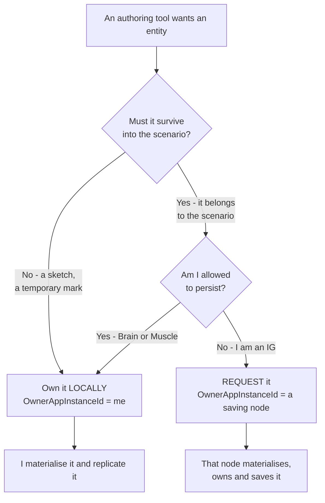

<!--STATUS
state: LIVE
updated: 2026-09-02
current-answer: §3 is the role table, §4 is ownership, §5 is persistence, §6 is where an entity
  should be created. §7 is the honest list of what is ENFORCED versus merely CONVENTION.
stale-below: nothing.
known-rot: nothing known. ⚠ This document is NEW and consolidates statements that were previously
  scattered across HROT-Engine-Guide §1.3–§1.3c, RULINGS R-138/R-140, and Architect_Question_65. If it
  disagrees with any of those, THIS file is the one to correct — the others are index or orientation.
known-conflict: none reconciled away silently. §7 records two places where the CODE cannot enforce what
  this document states, and names them as gaps rather than pretending the rule holds.
design-basis: docs/blueprints/RULINGS.md R-138 (fully distributed; NodeRole is a convention) and R-140
  (IG is passive and non-persisting) - docs/HROT-Engine-Guide/HROT-Engine-Guide.md §1.3a/§1.3b/§1.3c -
  docs/blueprints/Architect_Question_65_Entity_Genesis_Uniformity.md §0, §4 (Q65-A′), §5.5 (CE-143) -
  Hrot/Engine/Hrot.Core/NodeRole.cs (the enum itself)
-->

# ⭐⭐⭐ Node Roles, Policies and Conventions

> 🔒 **Why this document exists** *(user, `2026-09-02`)*: *"can we create a standalone design document
> explaining the node roles and policies and conventions, not hiding it into a small ruling document?"*

⭐⭐ **The single home for *"what is a node allowed and expected to do."*** Before this, the answer was
split across an orientation guide, two ledger rows and an architect question — ⛔ and the most important
part of it *(why IG may not own persistable entities)* **existed in no document at all**, only in the
user's head. That is what this fixes.

---

## 1. INVENTORY

⭐ Run `2026-09-02`, graph **and** grep, per the seam law.

| # | query | result |
|---|---|---|
| ① | `search_graph name_pattern="NodeRole\|ClusterRole\|.*NodeRole.*"` | **25** hits — ⭐ exactly **one** production type: `Hrot/Engine/Hrot.Core/NodeRole.cs`. The rest are docs and reports |
| ② | `grep "enum NodeRole"` production | **1** definition — no second, competing role enum |
| ③ | `grep -rln "NodeRole\|node role\|passive.*node"` over `docs/` | **12** files, all **orientation or per-project reference** — ⛔ **no standalone role/policy design existed** |
| ④ | existing owners of the topic | `HROT-Engine-Guide` §1.3/§1.3a/§1.3b/§1.3c · `RULINGS` R-138/R-140 · `Architect_Question_65` |

⇒ ⭐ **No prior standalone design to extend** ⇒ this file is new, and the four sources in ④ become
**pointers to it** rather than parallel accounts.

---

## 2. ⭐⭐⭐ THE ONE RULE THAT GOVERNS EVERYTHING ELSE

> 🔒 **`R-138`:** the system is **fully distributed**. Every ECS node can create entities. Ownership is
> **per-component, dynamic and transferable**. ⛔ **`NodeRole` is a CONVENTION, never a protocol
> restriction.**

⭐⭐ **Everything below is a convention.** ⛔ Nothing in this document is enforced by the protocol, and
almost none of it is enforced by code *(§7 is the honest accounting)*. ⇒ **These are the expectations a
correct deployment satisfies**, not invariants the engine will defend for you.

⚠ **The checkable habit `R-138` demands:** ⛔ never write *"node X owns Y"* or *"only X can Z"*.
⭐ Write *"X owns Y **for entities it originated or was delegated**"*, or name the configuration flag
that makes it so.

---

## 3. ⭐⭐ THE ROLES — **what the enum actually says**

📐 `Hrot/Engine/Hrot.Core/NodeRole.cs`. ⭐⭐ **It is a `[Flags]` enum — roles COMBINE**, and that matters:
a deployment is described by a *set* of roles, not by a node "type".

| role | bit | what the bootstrapper installs |
|---|---|---|
| `None` | `0` | no role assigned |
| ⭐ `Brain` | `1<<0` | MissionControl · CognitiveRuntime · ActionDispatch · Combat. ⛔ **no ground kinematics** — it commands movement as `NavigationIntent` to a Muscle |
| ⭐ `MuscleGround` | `1<<1` | ActionDispatch · GroundKinematics · Combat. ⛔ **no behaviour/BTree** — orders arrive as `NavigationIntent` from a Brain |
| ⭐ `ImageGenerator` | `1<<2` | presentation only, **no simulation logic** |
| `Perception` | `1<<3` | LOS · broadphase · threat evaluation |
| `NavigationSolver` | `1<<4` | on-demand pathfinding |

| ⚠ | |
|---|---|
| ⛔ **`NodeRole.AllInOne` does not exist** | a single-process deployment is a **combination**, e.g. `Brain \| MuscleGround` |
| ⭐ production SimHost is **`MuscleGround \| Perception`** | 📄 `docs/projects/Hrot/Subsystems/Hrot.SimHost.md` |
| ⭐ the role selects **modules**, not permissions | ⇒ a role does not gate what a node *may* do, only what it is *built with* |

---

## 4. ⭐⭐ OWNERSHIP — **a role is an EXPECTATION, the mask is the fact**

| ⭐ | |
|---|---|
| **ownership is per-component** | an entity's `AuthorityMask` says which components this node owns — not the whole entity |
| **it is transferable at runtime** | over the `OwnershipUpdate` topic; the previous owner yields symmetrically |
| ⭐⭐ **a node that originates an entity KEEPS what it creates** | ⛔ *"SimHost owns `SimTransform`"* is **not** a property of SimHost — it is the **outcome** of CGF's `BrainMuscleOwnershipStrategy` delegating kinematics **for entities CGF spawned** |
| ⭐ **the broadcast arbiter is a TIEBREAKER, not an authority** | exactly one node sets `isDefaultProcessor`, and it services requests addressed to **nobody** (`OwnerAppInstanceId == 0`) so they are not serviced twice. ⛔ A request **targeted at a node is processed by that node regardless** of the flag |

📄 The role-derived default is designed in
[`DESIGN_Role_Affinity_Ownership.md`](DESIGN_Role_Affinity_Ownership.md) — ⚠ **designed, not built.**

---

## 5. ⭐⭐⭐ PERSISTENCE — **the policy that had no home**

> 🔒 **`R-140`, user `2026-09-02`, verbatim:** *"by convention it is considered passive listening node,
> not maintaining any persistent state. If IG creates entities, then only temporary ones, possibly shared
> with other IGs, but never persisted to scenario. If IG crashes, its entities are gone, but no one cares,
> they were temporary anyway. There can be many IGs in the system, dynamically added and removed, none
> should affect the scenario being edited. This was the reason why persistable entities can not be owned
> by IGs and why the request was sent to another node who owns them and who saves them to scenario
> because he is allowed to save."*

| role | may hold persistent state? | rationale |
|---|---|---|
| ⭐ `Brain` / `MuscleGround` | ✅ **yes** — these are the simulation tiers whose state *is* the scenario | |
| 🔴 `ImageGenerator` **(IG)** | ⛔ **NO** | **many IGs, added and removed at runtime** ⇒ none may affect the scenario being edited. An IG crash must cost nothing |
| **ExCon** *(operator console)* | ⛔ no — it is not an ECS node; it issues **unowned** requests (`Owner == 0`) | |

⇒ ⭐⭐ **An IG-owned entity is TEMPORARY BY DEFINITION.** A working sketch or shared mark, possibly
replicated IG↔IG, ⛔ **never written to the scenario.** ⇒ **a persistable entity may not be IG-owned** —
IG **requests** it from a node that is allowed to save, and that node owns and persists it.

---

## 6. ⭐⭐⭐ WHERE SHOULD THIS ENTITY BE CREATED? — **the decision, per entity**

⭐⭐ **Both arms are the same request type; only the target owner differs.**
`EntityCreationRequest.OwnerAppInstanceId` carries the choice, and `CreateEntityRequestSystem`'s level-1
routing guard already honours it in its own words: *"If the request specifies an explicit target node,
only that node processes it. If the target is 0, only the designated default processor intercepts it —
all other nodes drop the packet silently to prevent duplicate ID allocation."*

⭐ **A second, INDEPENDENT axis rides along** *(`CE-143`)*: `EntityCreationRequest.InitType` decides
whether the creator **waits for peers to ACK** before the entity goes `Active`. ⛔ **Do not conflate
them** — *"I own this"* does not imply *"nobody needs to ACK it."* An IG sketch typically wants
`ReliableInitType.None`; the default is `AllPeers`.

---

## 7. ⚠⚠ WHAT IS ACTUALLY ENFORCED — **and what is only convention**

⭐⭐ **The most useful section in this document.** ⛔ A policy nobody checks decays; naming which half is
which is what keeps the next reader honest.

| statement | enforced by |
|---|---|
| a request targeted at a node is processed only by that node | ✅ **CODE** — `CreateEntityRequestSystem` level-1 routing guard |
| an unowned (`Owner == 0`) request is serviced once | ✅ **CODE** — the `isDefaultProcessor` tiebreaker |
| a node cannot hold both a local spawner and a spawn-forwarder | ✅ **RAIL** — `EntityGenesisHazardRails` *(`CE-160`)*, red-proved |
| ownership is per-component and transferable | ✅ **CODE** — `AuthorityMask` + the `OwnershipUpdate` topic |
| 🔴 **IG entities are never persisted to the scenario** | ⛔⛔ **NOTHING** — see below |
| 🔴 **a persistable entity is not IG-owned** | ⛔⛔ **NOTHING** — a convention only |

### 🔴 The persistence gap, measured `2026-09-02`

📐 `StagingEntityExtractor.BuildStaticMask()` **STRIPS** `NetworkOwnership`, `NetworkAuthority`,
`NetworkIdentity`, `DescriptorOwnership`, `TkbIdentity`, `GhostStateTracker` and `PendingNetworkAck`
from what it saves. ⇒ **ownership is DISCARDED at save time, never consulted**, and there is no
owner-based filter deciding *which* entities are written.

| | |
|---|---|
| ⭐ **the good half** | choosing an owner does **not** silently change whether something is saved ⇒ the two axes really are independent, so §6's per-entity choice is safe to make |
| 🔴 **the bad half** | *"IG entities are never persisted"* is guaranteed by **nothing**. The save path cannot distinguish an IG-owned entity ⇒ **if one ever reaches the extracted world, it WOULD be written** |

⛔⛔ **NOT MEASURED, and it decides whether that is a LIVE defect or a LATENT one:** do IG-owned entities
replicate into the world the extractor runs over at all? 📌 The extractor lives in **`Hrot.CGF`** — it
runs on the **Brain**, not on IG. ⇒ ⭐ **Settle this before IG gains local entity creation**
*(host (f), `Q65-A′`)*. If they do reach it, this rule needs a **mechanism**, not a convention.

---

## 8. ⭐ OPEN QUESTIONS

| # | question | why it matters |
|---|---|---|
| ① | do IG-owned entities reach the scenario extractor's world? | §7 — decides whether the persistence rule is safe by topology or broken by default |
| ② | when an IG holding temporary entities disappears, what removes the replicas on other IGs? | 🔒 the ruling says its entities are *"gone, and no one cares"* — ⚠ but peers hold ghosts, and an undisposed ghost is the **silent** half of the `CE-144` family |
| ③ | should `RequestFromDefaultProcessor` remain reachable from IG once it can create locally? | §6 says yes — it is the only way IG can author something persistable |

---

## 9. ⭐ WHERE THIS IS REFERENCED FROM

| document | relationship |
|---|---|
| [`HROT-Engine-Guide` §1.3a–§1.3c](HROT-Engine-Guide/HROT-Engine-Guide.md) | ⭐ **orientation** — the "at a glance" diagram and the one-line statements. ⛔ It stays short and points here |
| [`RULINGS.md`](blueprints/RULINGS.md) `R-138`, `R-140` | ⭐ **the INDEX** — the canon rows and their verbatim probes. ⛔ A ledger row is a pointer, never the explanation |
| [`Architect_Question_65`](blueprints/Architect_Question_65_Entity_Genesis_Uniformity.md) | the entity-genesis decisions that made these conventions load-bearing |
| [`DESIGN_Entity_Creation_Unification.md`](DESIGN_Entity_Creation_Unification.md) | the shared creation pipeline every role composes |
| [`DESIGN_Role_Affinity_Ownership.md`](DESIGN_Role_Affinity_Ownership.md) | ⚠ **designed, not built** — would turn §4's expectations into a derived default |
