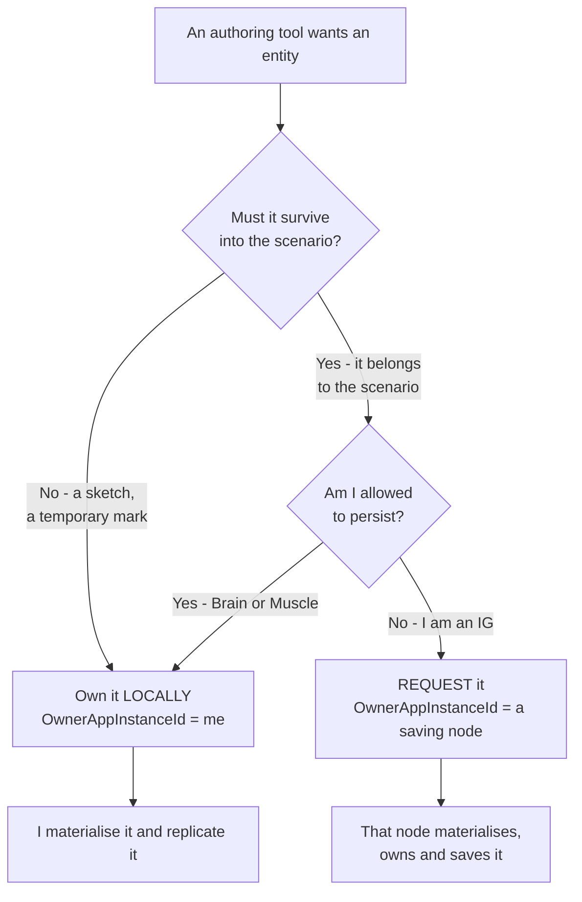

<!--STATUS
state: LIVE
updated: 2026-09-02
current-answer: §3 is the role table and §3.1 is entity-creation uniformity (a role never denies a
  capability), §4 is ownership, §5 is persistence, §6 is where an entity should be created. §7 is the
  honest list of what is ENFORCED versus merely CONVENTION.
open-elsewhere: §8 ① — what happens to a REPLICATED entity at save time — is a SCENARIO-SAVING
  question parked here; its owning home is docs/designs/cgf-scn-2/DESIGN.md (scenario serialization
  correctness). §8.1 records that an earlier draft claimed no such design existed, which was FALSE —
  it searched docs/ only and its filename filter missed cgf-scn because the folder says "scn".
  ⭐ §7.3 now MEASURES that question and answers it: the sketch DOES reach the saving node, so R-140
  does not hold by topology. What remains open there is the MECHANISM CHOICE (a/b/c), not the fact.
stale-below: §7.2's closing "NOT MEASURED" paragraph is SUPERSEDED by §7.3, and §8.1's
  "the existing exclusion mechanism cannot express §8 ①" is SUPERSEDED — ScenarioIgnoreTag can.
  Both supersessions are marked in place and the dead text is quoted under a HISTORY heading.
known-rot: nothing known. ⚠ This document is NEW and consolidates statements that were previously
  scattered across HROT-Engine-Guide §1.3–§1.3c, RULINGS R-138/R-140, and Architect_Question_65. If it
  disagrees with any of those, THIS file is the one to correct — the others are index or orientation.
known-conflict: none reconciled away silently. §7 records two places where the CODE cannot enforce what
  this document states, and names them as gaps rather than pretending the rule holds.
design-basis: docs/blueprints/RULINGS.md R-138 (fully distributed; NodeRole is a convention) and R-140
  (IG is passive and non-persisting) - docs/HROT-Engine-Guide/HROT-Engine-Guide.md §1.3a/§1.3b/§1.3c -
  docs/blueprints/Architect_Question_65_Entity_Genesis_Uniformity.md §0, §4 (Q65-A′), §5.5 (CE-143) -
  Hrot/Engine/Hrot.Core/NodeRole.cs (the enum itself)
-->

# ⭐⭐⭐ Node Roles, Policies and Conventions

> 🔒 **Why this document exists** *(user, `2026-09-02`)*: *"can we create a standalone design document
> explaining the node roles and policies and conventions, not hiding it into a small ruling document?"*

⭐⭐ **The single home for *"what is a node allowed and expected to do."*** Before this, the answer was
split across an orientation guide, two ledger rows and an architect question — ⛔ and the most important
part of it *(why IG may not own persistable entities)* **existed in no document at all**, only in the
user's head. That is what this fixes.

---

## 1. INVENTORY

⭐ Run `2026-09-02`, graph **and** grep, per the seam law.

| # | query | result |
|---|---|---|
| ① | `search_graph name_pattern="NodeRole\|ClusterRole\|.*NodeRole.*"` | **25** hits — ⭐ exactly **one** production type: `Hrot/Engine/Hrot.Core/NodeRole.cs`. The rest are docs and reports |
| ② | `grep "enum NodeRole"` production | **1** definition — no second, competing role enum |
| ③ | `grep -rln "NodeRole\|node role\|passive.*node"` over **`docs/`** | **12** files, all **orientation or per-project reference** |
| ④ | existing owners of the topic | `HROT-Engine-Guide` §1.3/§1.3a/§1.3b/§1.3c · `RULINGS` R-138/R-140 · `Architect_Question_65` |
| ⑤ | ⚠ **ADDED `2026-09-02` after the search flaw in §8.1** — `find .dev -iname "*role*" -o -iname "*node*"` over all **2939** `.dev` markdown files, **including `_DONE/`** | **13** hits, ⭐ **every one a Blueprint EDITOR-node document** *(graph nodes, not cluster nodes)* ⇒ ⛔ **nothing on cluster node roles** |

⇒ ⭐ **No prior standalone design to extend** — ⭐⭐ **now measured across BOTH trees**, not just `docs/`
⇒ this file is new, and the sources in ④ become **pointers to it** rather than parallel accounts.
⚠ **Row ⑤ exists because rows ①–④ searched `docs/` only, and §8.1 records where that same flaw produced
a FALSE claim about scenario-saving designs.** ⛔ The conclusion survived; the method did not.

---

## 2. ⭐⭐⭐ THE ONE RULE THAT GOVERNS EVERYTHING ELSE

> 🔒 **`R-138`:** the system is **fully distributed**. Every ECS node can create entities. Ownership is
> **per-component, dynamic and transferable**. ⛔ **`NodeRole` is a CONVENTION, never a protocol
> restriction.**

⭐⭐ **Everything below is a convention.** ⛔ Nothing in this document is enforced by the protocol, and
almost none of it is enforced by code *(§7 is the honest accounting)*. ⇒ **These are the expectations a
correct deployment satisfies**, not invariants the engine will defend for you.

⚠ **The checkable habit `R-138` demands:** ⛔ never write *"node X owns Y"* or *"only X can Z"*.
⭐ Write *"X owns Y **for entities it originated or was delegated**"*, or name the configuration flag
that makes it so.

---

## 3. ⭐⭐ THE ROLES — **what the enum actually says**

📐 `Hrot/Engine/Hrot.Core/NodeRole.cs`. ⭐⭐ **It is a `[Flags]` enum — roles COMBINE**, and that matters:
a deployment is described by a *set* of roles, not by a node "type".

| role | bit | what the bootstrapper installs |
|---|---|---|
| `None` | `0` | no role assigned |
| ⭐ `Brain` | `1<<0` | MissionControl · CognitiveRuntime · ActionDispatch · Combat. ⛔ **no ground kinematics** — it commands movement as `NavigationIntent` to a Muscle |
| ⭐ `MuscleGround` | `1<<1` | ActionDispatch · GroundKinematics · Combat. ⛔ **no behaviour/BTree** — orders arrive as `NavigationIntent` from a Brain |
| ⭐ `ImageGenerator` | `1<<2` | presentation only, **no simulation logic** |
| `Perception` | `1<<3` | LOS · broadphase · threat evaluation |
| `NavigationSolver` | `1<<4` | on-demand pathfinding |

| ⚠ | |
|---|---|
| ⛔ **`NodeRole.AllInOne` does not exist** | a single-process deployment is a **combination**, e.g. `Brain \| MuscleGround` |
| ⭐ production SimHost is **`MuscleGround \| Perception`** | 📄 `docs/projects/Hrot/Subsystems/Hrot.SimHost.md` |
| ⭐ the role selects **modules**, not permissions | ⇒ a role does not gate what a node *may* do, only what it is *built with* |

---

### 3.1 ⭐⭐⭐ A ROLE NEVER DENIES A CAPABILITY — **entity-creation uniformity**

📄 **The full design: [`DESIGN_Entity_Creation_Unification.md`](DESIGN_Entity_Creation_Unification.md) ·
the decisions: [`Architect_Question_65`](blueprints/Architect_Question_65_Entity_Genesis_Uniformity.md)
§0 and §4 (`Q65-A′`).**

> 🔒 **The governing ruling, user `2026-08-31`, verbatim:** *"the shared code for entity creation support
> should not restrict any ECS enabled node from creating own networked entities … no exceptions, not
> removing capabilities by design, and only concrete authoring code picks the way it needs."*

⭐⭐ **This is the sharpest consequence of §2, and it belongs here rather than only in the creation
design, because it is a statement about ROLES:** ⛔ **a role selects which modules a node is BUILT with —
it must never be used to withhold the ability to create entities.**

| ⭐ what `Q65-A′` settles | |
|---|---|
| **every ECS node composes the FULL genesis pipeline** | ⛔ no half-pack, no per-host omission. `EntityCreationPack` has **no opt-out switch**, and rails enforce that |
| ⭐ **the ONE value that legitimately differs per node** | `IsBroadcastArbiter` — and it is a **tiebreaker** for unowned requests, ⛔ not an authority gate *(§4)* |
| ⭐ **the authoring code chooses, per entity** | §6's decision — own it locally, or request it from another node. ⛔ **The node's role does not choose for it** |

⚠⚠ **This does NOT contradict §5.** Persistence is a policy about **what an IG SHOULD own**; uniformity is
about **what every node CAN do**. ⇒ ⭐ IG composes the same pipeline as everyone else *(it must, to hold
its own temporary entities)*, and then **declines to own persistable ones by choosing a different target
owner** — a choice made in authoring code, exactly as the ruling requires. ⛔ **If IG were denied the
pipeline instead, the capability would be gone and §6's second arm could not exist.**

---

## 4. ⭐⭐ OWNERSHIP — **a role is an EXPECTATION, the mask is the fact**

| ⭐ | |
|---|---|
| **ownership is per-component** | an entity's `AuthorityMask` says which components this node owns — not the whole entity |
| **it is transferable at runtime** | over the `OwnershipUpdate` topic; the previous owner yields symmetrically |
| ⭐⭐ **a node that originates an entity KEEPS what it creates** | ⛔ *"SimHost owns `SimTransform`"* is **not** a property of SimHost — it is the **outcome** of CGF's `BrainMuscleOwnershipStrategy` delegating kinematics **for entities CGF spawned** |
| ⭐ **the broadcast arbiter is a TIEBREAKER, not an authority** | exactly one node sets `isDefaultProcessor`, and it services requests addressed to **nobody** (`OwnerAppInstanceId == 0`) so they are not serviced twice. ⛔ A request **targeted at a node is processed by that node regardless** of the flag |

📄 The role-derived default is designed in
[`DESIGN_Role_Affinity_Ownership.md`](DESIGN_Role_Affinity_Ownership.md) — ⚠ **designed, not built.**

---

## 5. ⭐⭐⭐ PERSISTENCE — **the policy that had no home**

> 🔒 **`R-140`, user `2026-09-02`, verbatim:** *"by convention it is considered passive listening node,
> not maintaining any persistent state. If IG creates entities, then only temporary ones, possibly shared
> with other IGs, but never persisted to scenario. If IG crashes, its entities are gone, but no one cares,
> they were temporary anyway. There can be many IGs in the system, dynamically added and removed, none
> should affect the scenario being edited. This was the reason why persistable entities can not be owned
> by IGs and why the request was sent to another node who owns them and who saves them to scenario
> because he is allowed to save."*

| role | may hold persistent state? | rationale |
|---|---|---|
| ⭐ `Brain` / `MuscleGround` | ✅ **yes** — these are the simulation tiers whose state *is* the scenario | |
| 🔴 `ImageGenerator` **(IG)** | ⛔ **NO** | **many IGs, added and removed at runtime** ⇒ none may affect the scenario being edited. An IG crash must cost nothing |
| **ExCon** *(operator console)* | ⛔ no — it is not an ECS node; it issues **unowned** requests (`Owner == 0`) | |

⇒ ⭐⭐ **An IG-owned entity is TEMPORARY BY DEFINITION.** A working sketch or shared mark, possibly
replicated IG↔IG, ⛔ **never written to the scenario.** ⇒ **a persistable entity may not be IG-owned** —
IG **requests** it from a node that is allowed to save, and that node owns and persists it.

---

## 6. ⭐⭐⭐ WHERE SHOULD THIS ENTITY BE CREATED? — **the decision, per entity**

⭐⭐ **Both arms are the same request type; only the target owner differs.**
`EntityCreationRequest.OwnerAppInstanceId` carries the choice, and `CreateEntityRequestSystem`'s level-1
routing guard already honours it in its own words: *"If the request specifies an explicit target node,
only that node processes it. If the target is 0, only the designated default processor intercepts it —
all other nodes drop the packet silently to prevent duplicate ID allocation."*

⭐ **A second, INDEPENDENT axis rides along** *(`CE-143`)*: `EntityCreationRequest.InitType` decides
whether the creator **waits for peers to ACK** before the entity goes `Active`. ⛔ **Do not conflate
them** — *"I own this"* does not imply *"nobody needs to ACK it."* An IG sketch typically wants
`ReliableInitType.None`; the default is `AllPeers`.

---

## 7. ⚠⚠ WHAT IS ACTUALLY ENFORCED — **and what is only convention**

⭐⭐ **The most useful section in this document.** ⛔ A policy nobody checks decays; naming which half is
which is what keeps the next reader honest.

| statement | enforced by |
|---|---|
| a request targeted at a node is processed only by that node | ✅ **CODE** — `CreateEntityRequestSystem` level-1 routing guard |
| an unowned (`Owner == 0`) request is serviced once | ✅ **CODE** — the `isDefaultProcessor` tiebreaker |
| a node cannot hold both a local spawner and a spawn-forwarder | ✅ **RAIL** — `EntityGenesisHazardRails` *(`CE-160`)*, red-proved |
| ownership is per-component and transferable | ✅ **CODE** — `AuthorityMask` + the `OwnershipUpdate` topic |
| ⭐⭐ **IG entities are never persisted to the scenario** | ✅ **COMPOSITION** — ⛔ **IG registers no scenario-SAVE handler**, so it never runs an extractor. ⚠ **Enforced by an ABSENCE, and nothing checks the absence** — see §7.1 |
| 🔴 **a persistable entity is not IG-owned** | ⛔ **convention only** |

### 7.1 ✅⭐⭐ HOW THE RULE IS ACTUALLY ENFORCED — **by NOT HANDLING THE OPERATION** *(user, `2026-09-02`)*

> 🔒 **User, verbatim:** *"IG not saving to scenario is as simple as not letting the IG subsystem handle
> the clusterwide scenario save operation."*

⭐⭐⭐ **Correct, and it is already true.** ⚠ **This CORRECTS an earlier draft of this section**, which said
the rule was *"enforced by NOTHING."* ⛔ **That was too pessimistic** — it looked for a per-entity filter
and missed that the enforcement is one level up, at **which cluster operations the node handles at all.**

📐 **Measured `2026-09-02` — every handler `IgNodeBootstrapper` registers on its `ClusterSlave`:**

| handler | what it is |
|---|---|
| `ReferenceReplayLoadHandler` | **load** |
| `ReferenceLiveLoadHandler` | **load** |
| `IgZoneDummyHandler` | ⭐ a **dummy** |
| `ReferencePrefetchHandler` | **read** |
| `ReferencePreviewHandler(liveRepo: null)` | ⭐⭐ **read, and IG passes a NULL live repo** — it declares it has nothing to contribute from its own world |
| `DiagnosticsDumpClusterOpHandler` | diagnostics |

⇒ ⭐⭐⭐ **Not one of them is a SAVE handler**, and `ScenarioSerializer`/`IScenarioEntityExtractor` are never
wired on IG. ⇒ **`ClusterOpType.SaveScenario` is serviced by the Orchestrator and the saving nodes; IG
simply does not answer it.** ⭐ **The entity-level question does not arise, because IG never extracts.**

| ⚠ **the residual risk, and it is now NARROW** | |
|---|---|
| ⛔ **the enforcement is an ABSENCE** | *"IG registers no save handler"* is the **silent-default shape**: nothing stops the next person adding one, and it would look like a feature |
| ⭐⭐ **the guard is a RAIL, and it is cheap** | assert IG's composition root registers **no** save/extraction handler — ⭐ the same pattern as `EntityGenesisHazardRails`, which turned another absence into a checked invariant |
| ⚠ **STILL OPEN — a DIFFERENT question from the one this closes** | ⛔ if an IG-owned temporary entity **replicates to a SAVING node**, that node's extractor sees it in **its own** world, and *(per §7.2)* cannot tell it apart. ⇒ **the question is no longer "does IG save?" but "does IG's sketch reach CGF?"** |

### 7.2 The save path cannot distinguish an owner, measured `2026-09-02`

📐 `StagingEntityExtractor.BuildStaticMask()` **STRIPS** `NetworkOwnership`, `NetworkAuthority`,
`NetworkIdentity`, `DescriptorOwnership`, `TkbIdentity`, `GhostStateTracker` and `PendingNetworkAck`
from what it saves. ⇒ **ownership is DISCARDED at save time, never consulted**, and there is no
owner-based filter deciding *which* entities are written.

| | |
|---|---|
| ⭐ **the good half** | choosing an owner does **not** silently change whether something is saved ⇒ the two axes really are independent, so §6's per-entity choice is safe to make |
| ⚠ **the half that still matters** | the extractor **cannot tell an IG-owned entity apart from any other**. ⭐ §7.1 means this never bites *on IG* — IG does not extract. ⛔ It bites **on a saving node**, if an IG-owned entity is present in that node's world |

⚠ **An earlier draft of this section ended here with *"NOT MEASURED."* ⭐ It has now been measured — see
§7.3, which SUPERSEDES that paragraph.**

### 7.3 ✅⛔ MEASURED `2026-09-02` — **§5's rule does NOT hold by topology. The sketch reaches the saving node.**

⭐⭐⭐ **The question §7.2 left open** — *do IG-owned temporary entities reach a SAVING node's world?* —
**is answered, and the answer is YES.** ⛔ **`R-140` is therefore a CONVENTION with a HOLE, not an
invariant**, and the hole is on the receiving side, exactly where §7.2 predicted it would be.

#### ⭐ The chain, link by link — **two hold, the third does not**

| link | what it does | measured |
|---|---|---|
| **①** the cluster save **fans out to EVERY active node**, with no role filter | `ProcessStorageOpIntent` → `FanOutSerializeLocal(txId, new List<int>(_roster.ActiveNodes.Keys), …)` | ✅ `Hrot/Subsystems/Hrot.Orchestrator/ClusterMaster.cs:983-987` |
| **②** ⭐⭐ a node with **no handler** for the op answers `Success` with **`IsParticipating = false`**, and does **not** stall the 2PC | ⇒ §7.1's *"IG simply does not answer it"* is a **first-class engine outcome**, not an accident | ✅ `FDP/Toolkits/Fdp.Toolkits/Orchestration/ClusterSlave.cs:349-359` |
| **②b** IG registers **no** `SerializeLocal` handler; **CGF and ExCon do** *(`ReferenceArchiveHandler`, whose `CanHandle(op) => op == NodeOpType.SerializeLocal`)* | ⇒ link ① is doing real work — IG **is** asked, and declines | ✅ `Hrot/Subsystems/Hrot.IG/IgNodeBootstrapper.cs:250-288` · `Hrot.CGF/CgfApplication.cs:227` · `Hrot.ExCon/ExConSubsystem.cs:305` · `Fdp.Toolkits/Orchestration/Handlers/ReferenceArchiveHandler.cs:44-45` |
| **③** 🔴 **the receiving node spawns the entity UNCONDITIONALLY** — `ProcessSpawn` has **no** owner check, no role gate; `cmd.OwnerNodeId` is only used to *fill in* `NetworkOwnership`/`NetworkAuthority` and to compute `isLocalAuthority` | ⇒ ⭐ this is `Q65-A′` behaving exactly as designed: **every ECS node materialises every spawn it receives** | ✅ `Fdp.Toolkits/NetworkSpawning/Systems/NetworkSpawningSystem.cs:104-175` |
| **④** 🔴 **the saving node's serializer filters on ONE thing only** — `CollectSaveableEntities` walks every live entity and skips **only** those bearing `ScenarioIgnoreTag`. ⛔ **No ownership filter, no ghost filter, no authority filter** | ⇒ the replicated sketch is written to the scenario, and *(per §7.2)* its ownership components are stripped on the way out ⇒ **indistinguishable in the file from a real entity** | ✅ `Fdp.Toolkits/Scenario/ScenarioSerializer.cs:523-541` |
| **④b** ⭐⭐ **and that IS the production save path, not a test-only one** — `IEditorLogic.SaveScenario` → `EditorScenarioSession.SaveTo` → `ScenarioFileService.SaveScenario(repo, path)` → `ScenarioSerializer.Serialize(repo, header)` → `CollectSaveableEntities` | ⇒ ⭐ **the tag is honoured by the save the user actually runs.** ⚠ **Measured `2026-09-02` after an earlier pass cited only the serializer** — a filter nothing production reaches would have made §7.3's remedy worthless | ✅ `ScenarioFileService.cs:114-120` |

⇒ ⭐⭐⭐ **An IG sketch is saved — by CGF, not by IG.** ⛔ **§7.1's enforcement is necessary and NOT
sufficient**: it stops IG writing a file; it does nothing about IG's *entities* being written by someone
else. ⚠ **This is a silent failure of exactly the shape this codebase keeps producing** — nothing errors,
nothing logs, and it is visible only by opening the saved scenario.

#### ⭐⭐ The one row that is NOT a fresh end-to-end run

| ⚠ | |
|---|---|
| ⛔ **not run as a live two-node test** | *"IG publishes → the command leaves IG → CGF's `ProcessSpawn` runs"*. ⭐ It is **measured by composition of two halves**: `SpawnEntityCommandEgressTranslator` reads `SpawnEntityCommand` off the bus *(`Hrot.Network.NED/Replication/Map/Egress/SpawnEntityCommandEgressTranslator.cs:80`)*, and `ProcessSpawn` is unconditional on receipt. ⚠ **Stated as inference, not as a run** |
| ⭐ **why it does not change the verdict** | ⛔ if that link were BROKEN, IG could not replicate anything at all — which would contradict IG's whole purpose *(and the ruling's own words: temporary entities "possibly shared with other IGs")* |

#### ⭐⭐⭐ The mechanism that closes it ALREADY EXISTS AND IS UNUSED

📐 **`ScenarioIgnoreTag`** *(`Fdp.Toolkits/Scenario/ScenarioIgnoreTag.cs`, component id `200`)* — an
empty tag whose doc says *"instructs the scenario serializer to skip the entire entity bearing it."*
⭐⭐ It is **per-ENTITY**, and it is itself `[DataPolicy(DataPolicy.NoSave)]` so the tag never serializes —
it is **purely a filter**.

📐 **Production writers: ZERO.** *(grep + `search_graph`: one unit test — `ScenarioSerializerTests.ScenarioIgnoreTag_EntitySkipped` — and no production `AddComponent`/`SetComponent` anywhere.)*
⇒ 📌 **the `UNREFERENCED IS NOT UNINTENTIONAL` pattern**: it was built for precisely this and never wired.

#### ⭐ How the tag gets onto the receiver's copy — **three options, with a lean**

| | option | verdict |
|---|---|---|
| **(a)** | the **receiver derives it** — stamp the tag when `NetworkOwnership.PrimaryOwnerId` resolves to a node whose declared role is non-persisting | ⛔ **rejected.** It makes persistence depend on **roster state at save time**: once the IG disconnects the receiver can no longer resolve the role, and the sketch **silently becomes persistent**. ⚠ Same silent-failure family as everything else in this section |
| ⭐⭐ **(b)** | ⭐ **the REQUEST carries it** — `EntityCreationRequest` gains a transient flag, `CreateEntityRequestSystem` copies it into `SpawnEntityCommand` at both publish sites, and `ProcessSpawn` adds `ScenarioIgnoreTag` when set | ✅ **THE LEAN.** ⭐ It is the **same seam `CE-143` widened one commit ago** for the same class of problem *("the request cannot express X")*, so precedent and shape both match. ⭐⭐ The knowledge *"this is a sketch"* lives with the **author**, which is where it actually is; every receiver then derives the tag **locally at spawn**, so nothing depends on the tag replicating or on the author still being alive. ⭐ Additive, defaulted to today's behaviour |
| **(c)** | forbid IG from creating replicated entities | ⛔ **rejected — it contradicts `R-138`** *(fully distributed; a role never denies a capability, §3.1)* |

⭐ **Blast radius of (b):** `EntityCreationRequest` *(+1 `init` member, default = today)* · `CreateEntityRequestSystem` *(the same two publish sites `CE-143` touched, `:321` and `:416`)* · `SpawnEntityCommand` *(+1 field)* · `ProcessSpawn` *(one `if`, beside the existing `PendingNetworkAck` one)*. ⛔ **No behaviour changes for any existing caller.**

⚠ **What would change the lean:** if a *persistable* entity ever needs to be created by a node that is
not its owner **and** marked transient on some peers but not others — i.e. if transience turns out to be
**per-node** rather than **per-entity**. 📐 Nothing measured suggests that; the ruling states it as a
property of the entity *("only temporary ones… never persisted to scenario")*.

⇒ 🔴 **This is a DECISION, not a build item — it is not implemented, and §8 ① stays open until approved.**

---

## 8. ⭐ OPEN QUESTIONS

| # | question | why it matters |
|---|---|---|
| ① | ✅ **DECIDED AND BUILT `2026-09-02`** — the user approved option (b) *(`D2`)*, and it is implemented: `EntityCreationRequest.IsTransient` carries the intent, `NetworkSpawningSystem` stamps `ScenarioIgnoreTag` at spawn on every receiver, with rails in `TransientSpawnTagRails` + `NodeRolePersistenceRails`. ⛔ **The approval line further down this row is SUPERSEDED — it says "awaiting approval; nothing is implemented" and that is no longer true.** ⚠ What REMAINS open is only the wider *"what else must be kept out of scenario JSON"* question, whose home is [`docs/designs/cgf-scn-2/DESIGN.md`](designs/cgf-scn-2/DESIGN.md) per §8.1. ⭐ HISTORY of how it was decided follows: **ANSWERED `2026-09-02` in §7.3**: ~~does IG save?~~ **no (§7.1)**; ~~does the sketch reach a saving node?~~ 🔴 **YES, measured — the fan-out is roster-wide, `ProcessSpawn` is unconditional, and `CollectSaveableEntities` filters only on `ScenarioIgnoreTag`, which nothing in production sets.** ⇒ ⛔ **`R-140` does NOT hold by topology.** ⭐ **§7.3 recommends option (b)** — the request carries a transient flag, each receiver derives `ScenarioIgnoreTag` at spawn. ⚠ **Awaiting approval; nothing is implemented.** 🔒 **User, `2026-09-02`:** *"saving replicated entities is not yet resolved so it should stay as open question. very likely in a design document dedicated to scenario saving."* ⭐⭐ **AND SUCH DOCUMENTS DO EXIST — see §8.1. The owning home is [`docs/designs/cgf-scn-2/DESIGN.md`](designs/cgf-scn-2/DESIGN.md)** *(scenario serialization correctness — what belongs in scenario JSON and what must be kept out)*. ⇒ ⭐ **this question is PARKED here and belongs there** | it decides whether §5's rule is safe **by topology** or needs a rule on the saving side. ⛔ **It is a SCENARIO-SAVING question, not a node-role one** — this document only records that the role policy depends on its answer |
| ①b | ⭐ **a rail that IG's composition root registers no save/extraction handler** | §7.1 — turns an ABSENCE into a checked invariant, the same move `EntityGenesisHazardRails` made for the spawn/destroy hazards |
| ② | when an IG holding temporary entities disappears, what removes the replicas on other IGs? | 🔒 the ruling says its entities are *"gone, and no one cares"* — ⚠ but peers hold ghosts, and an undisposed ghost is the **silent** half of the `CE-144` family |
| ③ | should `RequestFromDefaultProcessor` remain reachable from IG once it can create locally? | §6 says yes — it is the only way IG can author something persistable. ⭐⭐ **OWNED ELSEWHERE `2026-09-02`: [`DESIGN_Entity_Creation_Unification.md`](DESIGN_Entity_Creation_Unification.md) §3.4b** — the level mismatch and its option (b) *(the forwarder subscribes to the REQUEST, and fires when the owner is someone else)*. ⛔ **That is a CROSS-HOST change of principle, not an IG fix**; this row is a pointer, not the decision |

### 8.1 ⛔⛔ CORRECTION `2026-09-02` — **the scenario-saving designs DO exist; my search was wrong**

⚠ **An earlier version of §8 ① said *"NO SUCH DOCUMENT EXISTS."* 🔴 That was FALSE**, and the way it was
false is worth recording because `CLAUDE.md` warns about it in exactly these words.

| ⛔ what I did | ⭐ why it missed |
|---|---|
| searched **`docs/` only** | 📌 `CLAUDE.md`: *"there are ~2900 markdown files in `.dev/` and this programme had never searched them"* — ⛔ including **`.dev/_DONE/`**, where finished programmes' designs live |
| filtered filenames on `scenario\|sav\|persist\|storage` | 🔴 **the programme is called `cgf-scn`** — *"scn"*, not *"scenario"* ⇒ **the filter excluded the very thing it was looking for** |

⭐⭐ **What actually exists** *(found `2026-09-02` after the user challenged the claim)*:

| document | what it covers |
|---|---|
| ⭐⭐ [`docs/designs/cgf-scn-2/DESIGN.md`](designs/cgf-scn-2/DESIGN.md) | **CGF Scenario Serialization Correctness** — ⭐ **the closest thing to a scenario-SAVING design**: what belongs in scenario JSON, `[DataPolicy(DataPolicy.NoSave)]` guards, `IEntityScenarioTranslator`, and the serializer's silent-truncation defects ⇒ **the owning home for §8 ①** |
| [`docs/designs/cgf-scn/DESIGN.md`](designs/cgf-scn/DESIGN.md) | **CGF Scenario Loading via Genesis Pipeline** — makes CGF the *authoritative entity genesis source* for scenario load. ⭐ Directly relevant to §3.1 and §4 |
| `.dev/_DONE/cgf-scn-3/DESIGN.md` | scenario save producing wrong JSON — missing missions, and **runtime-tier state leaking into declarative initial conditions** ⇒ ⭐ **the same DISEASE as §8 ①, one level down** |

### ⭐⭐ The existing exclusion mechanisms — **there are TWO, and the second one FITS**

⚠⚠ **CORRECTED `2026-09-02`, later the same day.** ⛔ **An earlier version of this sub-section is
SUPERSEDED — it is reproduced in §HISTORY below.** It said the save path has *"a per-type opt-out and a
static exclusion mask, and neither can express a per-entity origin."* 🔴 **The first clause is true; the
conclusion is FALSE, because it enumerated only two of the three mechanisms.**

| # | mechanism | granularity | can it say *"THIS entity is a sketch"*? |
|---|---|---|---|
| ① | `[DataPolicy(DataPolicy.NoSave)]` *(`FDP/Engine/Fdp.Core/DataPolicyAttribute.cs:48`)* | ⛔ **component TYPE** | ⛔ **no** — it says *"`UnitRoster` is never saved"* |
| ② | `StagingEntityExtractor.BuildStaticMask()` | ⛔ **component TYPE**, statically | ⛔ **no** |
| ⭐⭐⭐ **③** | **`ScenarioIgnoreTag`** *(`Fdp.Toolkits/Scenario/ScenarioIgnoreTag.cs`, id `200`)* — honoured by `ScenarioSerializer.CollectSaveableEntities` *(`:523-541`)* | ⭐⭐ **per ENTITY** | ✅ **YES — that is literally its stated purpose** |

⇒ ⭐⭐ **§8 ① is not open for want of a mechanism.** ⭐ It is open on a **design decision**: *how does the
tag get onto the copy that lives on the SAVING node?* — ⭐⭐ **§7.3 measures the problem and recommends
option (b)** *(the request carries a transient flag; each receiver derives the tag at spawn)*.

📌 **This is the `UNREFERENCED IS NOT UNINTENTIONAL` rule paying out twice in one document** — once for
the mechanism *(built for this, zero production writers)*, and once for **the search that missed it**: the
earlier claim was made after reading `DataPolicyAttribute.cs` and the extractor, **and not enumerating
what the serializer itself filters on.**

#### ⛔ HISTORY — the superseded claim, kept so nobody re-derives it

> *"⇒ ⭐⭐ That is precisely why §8 ① is still open: the save path has a per-type opt-out and a static
> exclusion mask, and neither can express a per-entity origin."*

⛔ **Do not quote this.** ⭐ `ScenarioIgnoreTag` is the third mechanism, and it is per-entity.

---

## 9. ⭐ WHERE THIS IS REFERENCED FROM

| document | relationship |
|---|---|
| [`HROT-Engine-Guide` §1.3a–§1.3c](HROT-Engine-Guide/HROT-Engine-Guide.md) | ⭐ **orientation** — the "at a glance" diagram and the one-line statements. ⛔ It stays short and points here |
| [`RULINGS.md`](blueprints/RULINGS.md) `R-138`, `R-140` | ⭐ **the INDEX** — the canon rows and their verbatim probes. ⛔ A ledger row is a pointer, never the explanation |
| [`Architect_Question_65`](blueprints/Architect_Question_65_Entity_Genesis_Uniformity.md) | the entity-genesis decisions that made these conventions load-bearing |
| [`DESIGN_Entity_Creation_Unification.md`](DESIGN_Entity_Creation_Unification.md) | the shared creation pipeline every role composes. ⭐⭐ **§3.4b is the owning home for the CREATION-side half of this document's problem** — the level mismatch and the cross-host resolution of creation duplication. ⛔ This file owns the PERSISTENCE side (§7.3); it does not restate §3.4b |
| ⭐ [`docs/designs/cgf-scn-2/DESIGN.md`](designs/cgf-scn-2/DESIGN.md) | **scenario serialization correctness** — what belongs in scenario JSON. ⭐ **The owning home for §8 ①** |
| [`docs/designs/cgf-scn/DESIGN.md`](designs/cgf-scn/DESIGN.md) | CGF as the authoritative entity genesis source for scenario LOAD — relevant to §3.1 and §4 |
| [`DESIGN_Role_Affinity_Ownership.md`](DESIGN_Role_Affinity_Ownership.md) | ⚠ **designed, not built** — would turn §4's expectations into a derived default |
