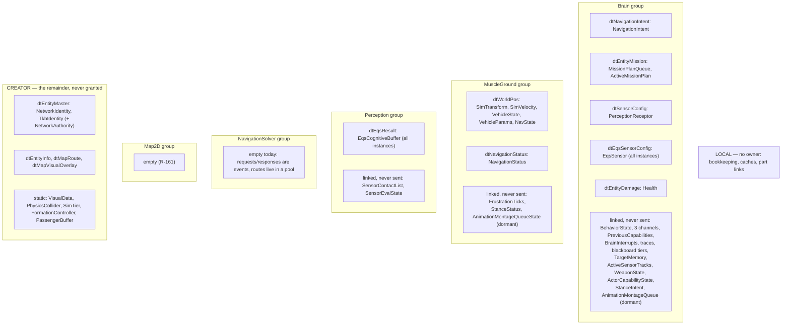
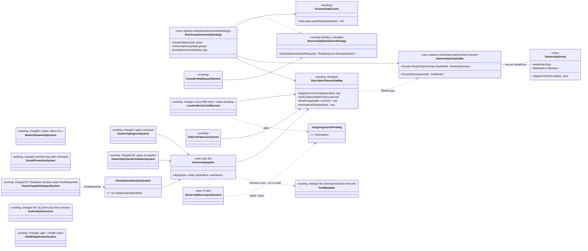
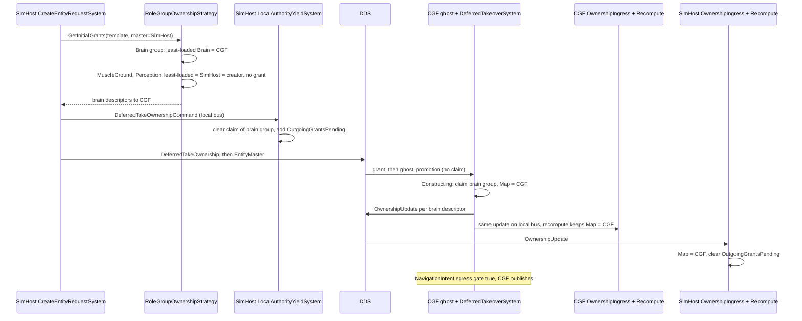
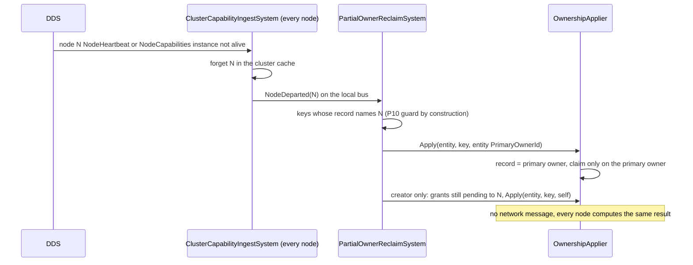
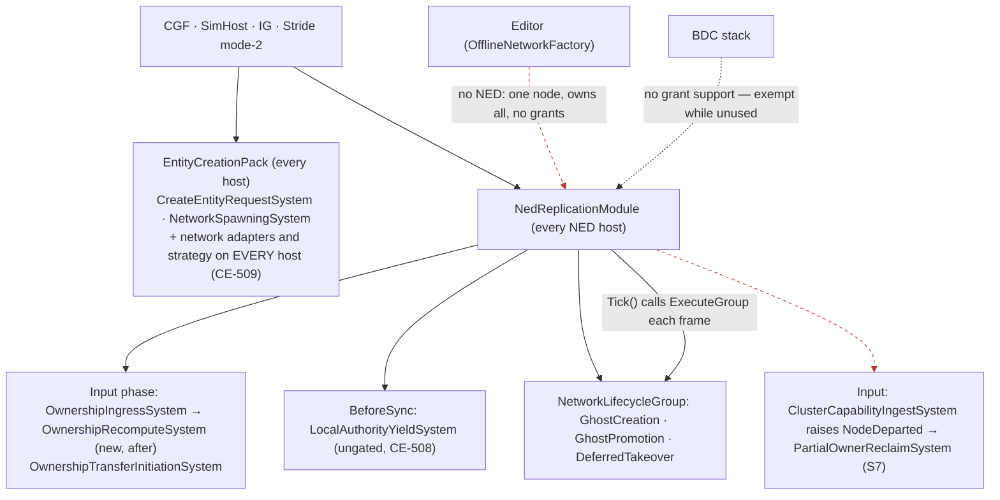
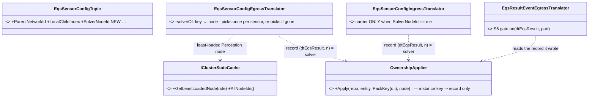
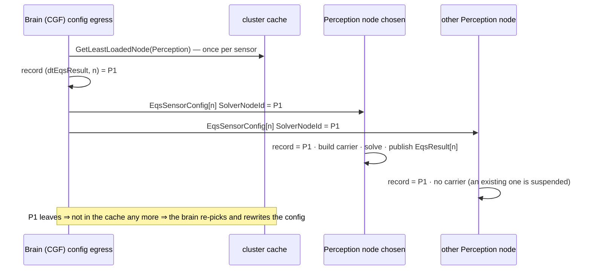
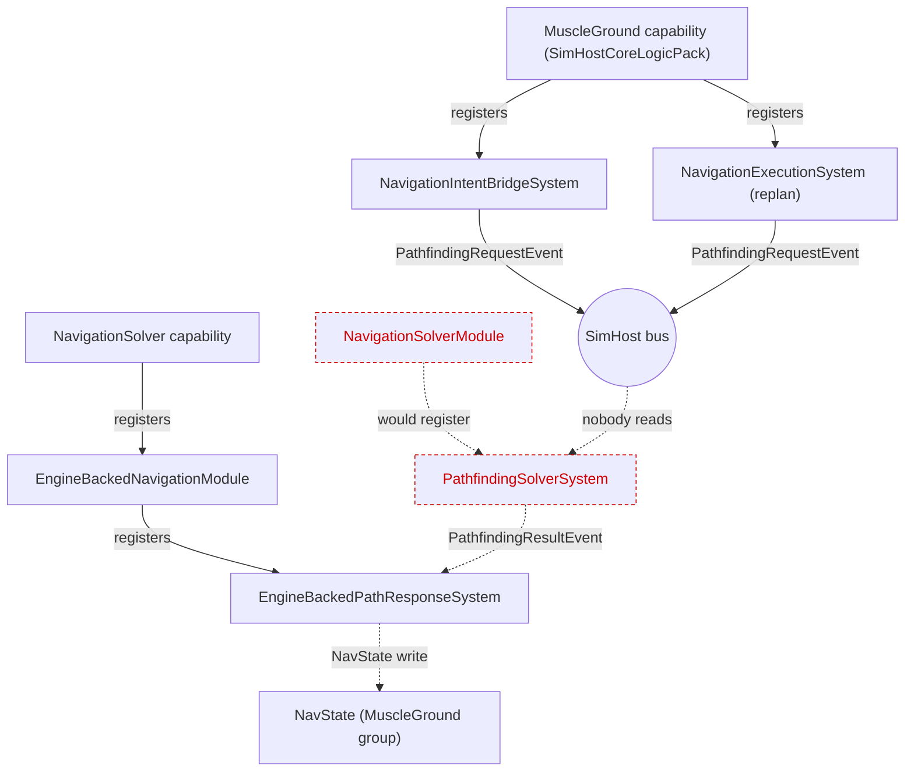
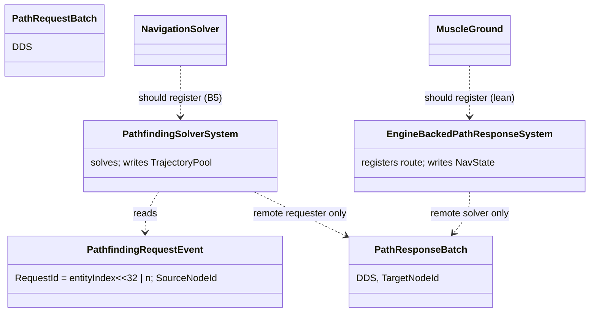
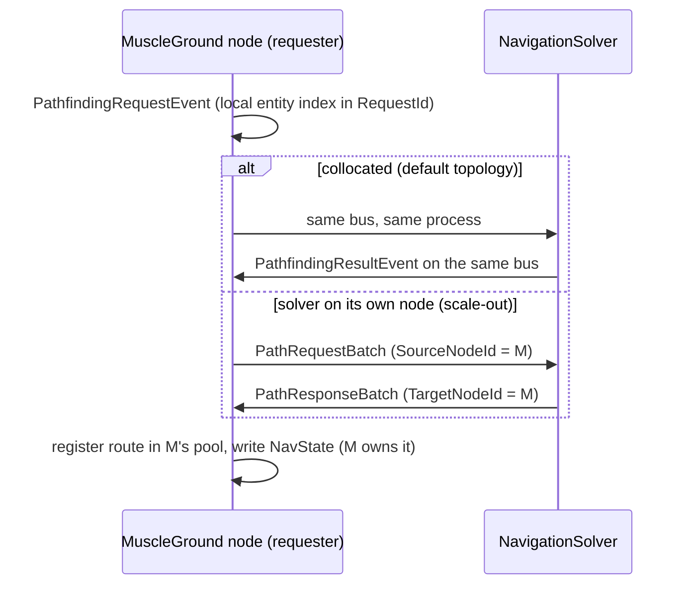

<!--STATUS
state: LIVE
updated: 2026-10-02
build-state: BUILDING — §5.5 D-4..D-7 approved (R-173, 2026-10-02); S1–S8 built and green (CE-500 and CE-507 fixed, one ownership truth on both creation paths and on parts, a departed node's ownership returns to the primary owner); §5.7 first live run 2026-10-02 (§5.7.1): E1–E6 ownership ✅, E4/E6 routed edits ✅ (CE-3003), E8 crash reclaim ✅ multi-process (+10.2 s, no message), E7 ✅ after §5.8 (the brain names each EQS sensor's solver, R-179; live 48/48 results); S8 ✅ (CE-523 damage on SimHost/IG-created entities, F-5 ingress skip incl. the F7 handover race, CE-3001).
current-answer: §5 the design (UML, decisions, build order) · §2 the ownership groups — one per NodeRole (R-172) + CREATOR remainder + LOCAL · §1 the classification they are derived from · §3 findings · §4 decisions (resolved, R-171).
stale-below: nothing yet.
known-rot: none.
known-conflict: docs/DESIGN_Role_Affinity_Ownership.md §3.9/§3.9a role tables (brainOnly) — §1 measures that brainOnly misses most brain-written components (tiers, BrainInterrupts, WeaponState, TargetMemory, ActiveMissionPlan, EqsSensor, …). Push-only (Q79 §0.7) retires the role tables as the source of ownership; this doc's §2 replaces them.
related-designs:
  - docs/blueprints/Architect_Question_79_One_Ownership_Truth.md — owns the DECISIONS (push-only, the grant, parts, crash, external nodes, build scope §0.13); this doc is the build design they asked for (R-170).
  - docs/DESIGN_Role_Affinity_Ownership.md — owned WHO claims WHICH component by role; superseded in part by push-only. Its §2.3 shape (ownership as component masks, network-agnostic) is kept here.
  - docs/DESIGN_Entity_Creation_Unification.md — owns the EntityCreationPack every host builds; S2b made its NetworkAdapters the one network input and its NetworkSystems the poll + delete systems.
  - docs/DESIGN_Entity_Ownership_Transfer.md — owns transfer INITIATION (CE-276); groups move by its OwnershipUpdate after creation.
  - docs/DESIGN_Node_Roles_And_Policies.md — §4.1 the creation legs; this doc decides which group each leg grants.
  - docs/reference/BDC_NED_SST_Descriptor_Rules.md — the wire spec (per-descriptor owners, OwnershipUpdate, disposal).
  - docs/blueprints/DESIGN_Behaviour_Fault_And_Teardown.md — §1 D5 the EQS part id (parts follow their descriptor type's group, Q79 §0.10).
  - docs/designs/eqs-2/EQS_Design_v1.3_final.md — owns the EQS solve, the child-sensor wire and its lifecycle; §5.8 here decides only WHICH node solves (R-179).
  - docs/DESIGN_Subsystem_Composition_Unification.md — owns role-based composition; its B5 (not started) is what composes NavigationSolverModule and the Muscle executor set, which §5.9/§5.10 here wait on.
  - docs/designs/navig-2/Navigation_Design_v2_0.md — owns the navigation topologies (collocated in-process answer, scale-out batch pair) that §5.9 keeps.
-->

# Ownership groups and grants — the build design

**Goal** (Q79 §0.7, push-only): one owner per component. The creator owns everything at birth and **grants whole groups** —
each role's group to a node serving that role — one group per `NodeRole` (R-172): Brain, MuscleGround, Perception (R-171), NavigationSolver and Map2D (both empty today). A group is a set of **whole descriptors**
plus the components that are never on the wire but **linked** to one of those descriptors (R-165). Everything else stays with
the creator. Approvals: R-170 (`dtWorldPos` moves whole; `CE-520` is phase 2; this doc).

## INVENTORY *(the classification pass, `2026-10-02`)*

- **Component set:** the union of every component present on a CGF- and a SimHost-created `Tank_M1Abrams` on both nodes
  (Q79 §10 live probe, 39 components) + the brain's occurrence-store tiers + the EQS part components + the map-geometry
  components — 54 classified below, plus `WeaponMountInfo`, which never exists in production (F-6).
- **Method, per component:** every production write site (grep for every write form: `SetComponent`, `AddComponent`,
  `GetComponentRW`/`ref`, command buffers, managed in-place mutation, `InitialComponents`, TKB translators, generic writers),
  then the host that registers the writing system (module packs and bootstrappers), then the wire descriptor (egress
  translators' `TargetComponentIds` + `NedReplicationModule.cs:623-638`). Four parallel read-only sweeps; the surprising rows
  were re-checked by hand (`HealthApplicationSystem.cs:73-77`, `CgfLogicPack.cs:175`; `WeaponMountInfo` has no production
  registration; `DescriptorOwnershipMap.cs:97-100`).
- **Write kinds:** SIM = steady-state logic · INIT = once at spawn/promotion/template · INGRESS = applying a received sample
  (a replica update, not ownership) · LOCAL = node-local cache/bookkeeping · EDIT = operator/tooling.
- **Generic writers** reach any component and are not listed per row: spawn `InitialComponents` and `UpdateEntityCommand`
  (`NetworkSpawningSystem.cs:225-227, 309`), TKB translators at spawn/promotion/construction, scenario load (staging repo →
  `InitialComponents`), replay playback, the ImGui inspector, the editor debug API, data-breakpoint mutations, blueprint
  `SetComponent` nodes (Brain only). They are INIT/EDIT/replay paths, so they do not decide a group.
- ⚠ The Editor is offline (one node, owns everything) and runs both the Brain and the Muscle packs; it never decides a group.

## 1. Classification — who writes what, where

**Rule used to assign a group:** the group of the node whose **SIM** writers write the component. INIT-only components stay
with the creator. LOCAL components are in no group (each node writes its own copy; no claim decides anything).

### 1.1 Brain-written (SIM writers only on CGF)

| component | SIM writers (host CGF) | wire |
|---|---|---|
| `BehaviorState` | `BehaviorIngressSystem.cs:284-288` | — |
| `LocomotionChannel`, `WeaponChannel`, `InteractionChannel` | `ChannelArbitrationSystem`, the dispatchers, executors, BTree/HSM nodes, blueprint-generated code | — |
| `PreviousCapabilities` | `CognitiveInterruptSystem.cs:98,114` | — |
| `BrainInterrupts` | `CognitiveInterruptSystem.cs:105`, `CognitiveCleanupSystem.cs:43`, `RouteContextSystem.cs:185` | — |
| `BTreeTraceWorkingMemory1024`, `HsmTraceWorkingMemory1024` | `BrainTickSystem.cs:305,566`, `TraceBufferLifecycleSystem.cs:74-80` | — |
| `BlueprintBlackboard256/1024/4096/16384` (occurrence store) | `BrainTickSystem`, `BlueprintTickSystem`, `BehaviorIngressSystem`, `BlueprintMaintenanceSystem` | — |
| `NavigationIntent` | `MoveToExecutor.cs:60,151`, `FollowRouteExecutor.cs:39,77,94` | `dtNavigationIntent` (52) |
| `MissionPlanQueue`, `ActiveMissionPlan` | `MissionControlExecutionSystem.cs:182-236`, `MissionDirectorSystem.cs:118-221` | `dtEntityMission` (51) |
| `PerceptionReceptor` (sensor config) | Brain authors it; SimHost only ingests (`PerceptionTranslators.cs:376`) | `dtSensorConfig` |
| `EqsSensor` (part) | `EqsChildSensor`, `EqsLifecycleNodes`, `HillAttackCommanderNodes`, blueprint `SpawnEqsSensor` | `dtEqsSensorConfig` (95) |
| `TargetMemory` | `ThreatEvaluationSystem.cs:54,100,115` | — |
| `ActiveSensorTracks` | `ActiveSensorTracksUpdateSystem.cs:96-98` | — |
| `WeaponState` | `AimAndFireExecutor.cs:53-76`, `WeaponDispatcherSystem.cs:50-53` | — |
| `Health` | `HealthApplicationSystem.cs:85` | `dtEntityDamage` (30) |
| `ActorCapabilityState` | `HealthApplicationSystem.cs:106,115` | — |

### 1.2 MuscleGround-written (SIM writers only on SimHost / Stride)

| component | SIM writers (SimHost; Stride equivalents) | wire |
|---|---|---|
| `SimTransform`, `SimVelocity` | `CarKinematicsSystem.cs:301-302`, `LinearKinematicsSystem.cs:108`; Stride `CrowdAgentUpdateSystem`, `BulletReverseSyncSystem` | `dtWorldPos` (2) |
| `VehicleState` | `CarKinematicsSystem.cs:299`; Stride `VehicleNavigationIntentSystem.cs:310` | `dtWorldPos` (mapped) |
| `NavState` | `NavigationIntentBridgeSystem.cs:174`, `EngineBackedPathResponseSystem.cs:52`, `CarKinematicsSystem.cs:300` | `dtWorldPos` (mapped) |
| `VehicleParams` | INIT only — but part of `dtWorldPos` (R-170: the descriptor moves whole) | `dtWorldPos` (mapped) |
| `NavigationStatus` | `NavigationExecutionSystem.cs:124-282`, `NavigationIntentBridgeSystem.cs:365` | `dtNavigationStatus` (53) |
| `FrustrationTicks` | `NavigationExecutionSystem.cs:127-273` | — |

### 1.2b Perception-execution-written (SIM writers in the Perception role — today co-hosted on SimHost / Stride)

🔒 R-171, user verbatim: *"Damage application stays on brain where the healtb component is. Sensors and any perception should be perception group, not mixed with kinematic group, perception execution  could run on differrent node in the future. Sensor config (any perception intents) stay on brain."*

| component | SIM writers | wire |
|---|---|---|
| `EqsCognitiveBuffer` (part) | `EqsResultUpdateSystem.cs:131-152` (local solver result), `EqsSolverSystem.cs:164` | `dtEqsResult` (96, event stream) |
| `SensorEvalState` (part) | `EqsSolverSystem.cs:97-388` | — |
| `SensorContactList` | `SensorTrackDebounceSystem.cs:123,138` | — (its transitions leave as `dtSensorTrackState` events) |

### 1.3 Entity identity and creator-held (no steady-state writer outside the owner)

| component | writers | wire |
|---|---|---|
| `NetworkIdentity`, `TkbIdentity` | INIT (spawn, ghost creation) | `dtEntityMaster` (0) |
| `NetworkAuthority` | INIT; on transfer `OwnershipIngressSystem.cs:103-107`, `OwnershipTransferInitiationSystem.cs:114` | via `OwnershipUpdate` on `dtEntityMaster` |
| `EntityInfo` | INIT; SimHost attribute requests (owner-gated); editor rename | `dtEntityInfo` |
| `RoutePlan` | INIT/EDIT (route tools, gizmos) | `dtMapRoute` |
| `EditablePolyline`, `MapOverlayStyle` | INIT/EDIT (area tools, vertex gizmo); owner-gated request on SimHost | `dtMapVisualOverlay` |
| `VisualData`, `PhysicsCollider`, `SimTier`, `FormationController`, `PassengerBuffer` | INIT only (latent/editor-only SIM writers) | — |

### 1.5 Found while building S1 — animation (dormant) and ground clamping

| component | writers | group |
|---|---|---|
| `StanceIntent`, `AnimationMontageQueue` (Brain → Muscle intents) | Brain-side animation executors | BRAIN |
| `StanceStatus`, `AnimationMontageQueueState` (Muscle → Brain statuses) | Muscle animation systems | MUSCLEGROUND |
| `AnimationChannel`, `LookAtChannel` | ~~intent fields by the Brain AND status fields by the Muscle in ONE component~~ ✅ split `2026-10-03`: request → Brain group, new `AnimationChannelStatus`/`LookAtChannelStatus` → MuscleGround | ✅ F-9 / `CE-513 (backend)` built (Q80 §5) |
| `GroundClampingConfig` | IG ingress of an externally sent `dtGroundClampingOverride` only | LOCAL |

⚠ **Animation replication is dormant:** `AnimationReplicationModule` is constructed by no production host and referenced by no
host project; its translators are `INetworkTranslator`s outside the descriptor map and gate on ENTITY authority. The tank probe
never saw these components. ⇒ the intent/status components are placed by their own documented direction; they move only once
the module is composed.

### 1.4 Local — in no group

`EgressPublicationState`, `DescriptorOwnership`, `OutgoingGrantsPending` (S5), `NetworkAckPeerSet`, `ReportLifecycleOnActive`, `MapDisplayComponent`,
`MissionAdapterState`, `PersonalRouteRef`, `PartMetadata`, `BehaviorOwnedPart`, `NetworkTransform`, `NetworkVelocity`
(the last two: the ingress replica value and the egress shadow, written on every NED host), `GroundClampingConfig` (§1.5).

## 2. ⭐ The ownership groups

🔒 **R-172, user verbatim:** *"Note the component groups are role based, never node based."* ⇒ ⭐ **ONE group per `NodeRole`** (`NodeRole.cs`: `Brain`, `MuscleGround`, `Perception`, `NavigationSolver`, `Map2D`); which NODE holds a group is the owner's per-entity choice (R-164), never part of the definition. A new role ⇒ a new group, nothing else. CREATOR is not a group of any role: it is the remainder the creator keeps (R-160).

*What the picture shows that prose hid:* every group is **whole descriptors + linked components**, so a grant or an
`OwnershipUpdate` of one descriptor can never half-move a group's wire state (P4), and a component sits in exactly one box.

| rule | |
|---|---|
| G-1 | A group is granted as ONE `DeferredTakeOwnership` (one entry per descriptor in the group, same target) — the message already batches per entity |
| G-2 | Receiving a descriptor sets the claim of its components **and of the components linked to that group** — the descriptor→component map gains the linked members (today it holds only translator targets + two hand-written blocks) |
| G-3 | Multi-instance descriptors (`dtEqsSensorConfig`, `dtEqsResult`) cover every instance (Q79 §0.10) |
| G-4 | Brain group granted only when the template has a brain (`BrainTier != 0`, G5); MuscleGround group only when it has kinematics (`VehicleParametersDto`); perception group only when it has perception (`VisionRange > 0`, the `PerceptionTkbTranslator` condition) |
| G-6 | ⭐ Each group IS a role (R-172). The strategy picks, per entity and per non-empty group, one node serving that role — independently per group, so a perception-only or solver-only node needs no design change |
| G-9 | An empty group grants nothing. `NavigationSolver` and `Map2D` are empty today; a component enters them only when that role's own logic becomes its steady-state writer |
| G-7 | A part entity can hold components of different groups (an EQS part: `EqsSensor` = BRAIN, `EqsCognitiveBuffer`/`SensorEvalState` = PERCEPTION); claims are per component, so this needs nothing extra |
| G-8 | Event outputs (`dtSensorTrackState`, `dtAudioTargetDetected`, `dtEntityHitDamage`) are events, not descriptors: no group, no owner |
| G-5 | The creator keeps CREATOR and any group whose chosen target is itself |

## 3. Findings from the classification

| # | finding | evidence | action |
|---|---|---|---|
| F-1 | ✅ **FIXED in S8 (`CE-523`).** ~~An entity SimHost creates never takes damage~~ — `Health`'s only steady-state writer runs on CGF and checked ENTITY-level authority; on a SimHost-created entity CGF is not the primary owner, and SimHost does not run the system. ⭐ As built: the gate is the `Health` CLAIM (the Brain group's grant carries it), and the replica's `dtEntityDamage` ingress keys on the descriptor's record (§5.6 S8) | `HealthApplicationSystem.cs:73-79`; `CgfLogicPack.cs:176` only | `CE-523` ✅ |
| F-2 | Five descriptors carry state but declare no components, so granting/transferring them moves **no claim**: `dtEntityDamage` (Health), `dtEntityMission` (mission queue/plan), `dtSensorConfig` (PerceptionReceptor), `dtEqsSensorConfig`, `dtEqsResult` | the translators have no `TargetComponentIds` | B2: §2 supplies the mapping (generalises G3) |
| F-3 | The explicit `dtWorldPos` mapping REPLACES the translator's (`NetworkTransform`, `NetworkVelocity` drop out of the forward map) | `DescriptorOwnershipMap.cs:97-100`, `NedReplicationModule.cs:623` | moot under §2 (both are LOCAL); the group definition becomes the single source |
| F-4 | `brainOnly` misses most brain-written components (tiers, `BrainInterrupts`, `WeaponState`, `TargetMemory`, `ActiveMissionPlan`, `EqsSensor`, …) | `HrotRoleComponentSets.cs:126-159` vs §1.1 | superseded by §2 (push-only retires the role tables as ownership) |
| F-5 | ✅ **FIXED in S8** (S3 did `EntityMissionIngressTranslator`). Every ingress that writes a group or creator descriptor's state skips its OWN sample: `NavigationIntent`, `NavigationStatus`, `SensorConfig` (`PerceptionTranslators.cs`), `EqsResult` (per instance `(96,n)`), `MapVisualOverlay` (incl. its deferred rebuild), `MapRoute` (incl. deferred samples), and `EntityDamage` re-keyed from the entity to `dtEntityDamage`. ⛔ Not swept, with reason: `EqsSensorConfigIngressTranslator` writes a local CARRIER, never the owned `EqsSensor`; `MapEntitySymbolIngressTranslator` writes an IG-local `IgSymbolOverride` and `dtMapEntitySymbol` is in no group; the 8 animation translators are dormant (§1.5) | ONE helper `AuthorityExtensions.IsRecordedOwner` — ⭐ which now treats a descriptor in `OutgoingGrantsPending` as NOT owned (§5.6 S8, measured race) | `GeoSpatialIngressTranslator.cs:90` keys on the claim, the older form; left as is |
| F-6 | Weapon-mount parts never exist in production: `WeaponMountInfo` is never registered, so `CombatTkbTranslator.cs:97` never creates them | no production `RegisterComponent<WeaponMountInfo>` | record only (unreferenced ≠ unintended); Q79 §0.10's table corrected |
| F-8 | ⚠ **The navigation solver writes the Muscle's component in-process.** `EngineBackedPathResponseSystem` (registered by the `NavigationSolver` capability, `SimHostCapabilities.cs:85-100`) sets `NavState.TrajectoryId/Mode` by a LOCAL entity index taken from the request id and a trajectory pool SHARED with the Muscle (`EngineBackedPathResponseSystem.cs:44-55`). Correct only while both roles share a process; ⇒ when `NavigationSolver` runs on its own node this write must become a response message to the Muscle (the Brain-side path already is one: `PathResponseBrainIngressTranslator` registers into its own pool and publishes an event) | `EngineBackedPathResponseSystem.cs:30-55` | filed `CE-524`; not in this build's scope |
| F-9 | ⚠ **`AnimationChannel` / `LookAtChannel` mix a Brain-written intent and a Muscle-written status in ONE component** — one component cannot have two owners. Harmless while animation replication is dormant (both writers share a process); must be split (intent/status, like `StanceIntent`/`StanceStatus`) before animation replication is composed across nodes | `ReplicatedComponents.cs:40-90` | filed `CE-513 (backend)`; outside this build. ✅ fixed `2026-10-03` (CE-513, Q80 §5) |
| F-10 | ✅ FIXED in S2b (every host registers the handlers). Was: 🔴 **Only SimHost can apply an edit request from another node.** The owner-side handlers (`UpdateEntityAttributeRequestSystem`, `UpdateEntityDescriptorRequestSystem`) are built by `CreateSimHostAttributeUpdateSystems` and registered ONLY at `SimHostNodeBootstrapper.cs:297`. A non-owner's edit (a gizmo drag) goes through `EntityWriteRouter` as a change REQUEST to the owner (design intent: *"owner receives → applies, ownership-gated"*, `DESIGN_Cgf_AxisB_Rotation_Slice.md` §311). ⇒ today map-symbol drags work only because the type-blind strategy grants every position to SimHost (Q79 F14); once G-4 leaves a non-vehicle position with its creator (CGF or IG), those requests would land on a node with no handler and be lost | `NedNetworkFactory.cs:155-165`; `SimHostNodeBootstrapper.cs:297` | **S2b** — the handlers on every host, BEFORE S3 |
| F-7 | Stale comment: `CognitiveComponentRegistry` says SimHost receives mission data; `EntityMissionIngressTranslator` is Brain-only | `CognitiveTranslatorPack.cs:60` | fix the comment in the build |
| F-11 | ✅ FIXED `2026-10-02`. Ingress translators treated an entity with NO `NetworkAuthority` as locally OWNED (the raw gate's "no record ⇒ AllInOne" fallback), but on an ingress that entity is a replica still being built from the wire. ⇒ `EntityDamageIngressTranslator` dropped the first health of every entity first seen through `dtEntityDamage`, and `EntityInfoIngressTranslator` dropped a ghost's commander assignment (its 2026-09-30 loopback fix covered the component, not the hierarchy). Found by making the 6 red IG translator tests pass, not by deleting them. Fix: ONE shared helper `AuthorityExtensions.IsRecordedOwner` (owner only when the record exists and says so); both translators use it | `AuthorityExtensions.cs`; `EntityDamageIngressTranslator.cs:100`; `EntityInfoIngressTranslator.cs:172` | ⭐ F-5's skip-when-owned sweep (S8) uses `IsRecordedOwner`, never the raw gate |
| F-12 | ✅ FIXED in S6. `EqsResultEventEgressTranslator` published every local EQS solver result with NO ownership gate, and every MuscleGround node builds a carrier for every sensor config it hears ⇒ with two Muscle nodes both would publish one sensor's result (two writers of one Perception-group descriptor) | `EqsResultEventEgressTranslator.cs` (no `HasAuthority`); `SimHostAuxiliaryTranslatorPack.cs:86-87` (role-gated on MuscleGround only) | gate on the owner of `(dtEqsResult, part)`; ⭐ since §5.8 (`R-179`) a child sensor's config NAMES its solver, so a non-named node builds no carrier and solves nothing (a legacy instance-0 sensor and a config naming no solver still solve everywhere, gated on publish) |

## 4. Decisions before the UML *(all resolved `2026-10-02`)*

| # | question | lean |
|---|---|---|
| ~~D-1~~ | ✅ R-171: damage application stays on the Brain with `Health` (BRAIN group) | — |
| ~~D-2~~ | ✅ R-171: a separate PERCEPTION group (§1.2b), not mixed into MuscleGround | — |
| ✅ | D-4..D-7 approved by the user `2026-10-02` (R-173): *"approved D-4 to D-7, start step 1"* | — |
| ~~D-8~~ | ✅ R-175: who owns the position of a composite unit and of a standalone tactical symbol (area, route, overlay) | ⭐ **the CREATOR, position included**: neither has kinematics, so G-4 grants no MuscleGround group (G-5 keeps it with the creator). 🔒 User `2026-10-02`: *"whoever creates them should own them including their position i guess (logical entity anyway does not have any kinematics components so this should work consistently)"* and *"map tactical symbols … should be owned by the creator, same mechanism (no kinematics parts)"*. A composite unit is typically created on a Brain node; deriving its position from its members (averaging) is future work for its owner, not yet decided (CE-514). A node that moves a creator-owned symbol (e.g. Map2D) sends an edit request to the owner (BDC spec "descriptor change requests"), which needs F-10 fixed (S2b). 📐 Measured templates: tanks, IFV, truck, infantry rifleman (`BdcTkbCatalog.cs:26-168`), the `UrbanCombatTkbCatalog` entities get MuscleGround; `TacGraphic_Area`/`TacGraphic_Route` (`BdcTkbCatalog.cs:238-247`) and `Unit_TankPlatoon`/`Unit_InfantrySquad` (`:182-216`, no `WithPhysics`) do not |
| ~~D-3~~ | ✅ R-171: sensor config and every perception INTENT (`PerceptionReceptor`, `EqsSensor`) stay in BRAIN | — |
| ~~D-9~~ | ✅ R-175 (user `2026-10-02` confirmed the "no kinematics ⇒ creator" mechanism): how a group's applicability (G-4) is decided per template — user: *"this might need some TKB entity-type based data driven rule"* | ⭐ **Keep it keyed on the template's CAPABILITY DESCRIPTORS** (`HrotOwnershipGroups.cs:97-99`). That is already TKB data, synced to every node, with no entity-class vocabulary (TKB `DESIGN.md` §6.6a, user `2026-09-13`: *"the components the entity have makes the entity a vehicle"*). Rejected: ① keying on the entity TYPE id (`TkbEntityTypes`) is the per-class hardcode §6.6a bans. ② Keying on the LIVE component mask is host-dependent: Stride strips `VehicleState` from infantry (`InfantryVehicleStateStripTkbTranslator.cs:21`), so a Stride creator would deny infantry its MuscleGround grant. ③ Keying on `produced(translators)` cannot see descriptor values: `BehaviorState` is stamped for `BrainTier 0` too (`BehaviorTkbTranslator.cs:75`). ④ A per-template file field, e.g. an ownership-profile descriptor, is the escape hatch for when a template needs a different answer than its descriptors give (§6.6, "when a file field WOULD be the right answer": a schema change plus loud load-time validation, because the deserializer skips unknown keys). No template needs it today: the user ruled a composite unit's position stays with its creator (D-8), so the composite case is not one either |

Nothing open (D-8, D-9 resolved by R-175 `2026-10-02`); next step is the UML.

## 5. ⭐⭐ THE DESIGN — UML *(drafted `2026-10-02`, after §1's inventory; awaiting the user's approval)*

### 5.1 Class — what exists, what changes, what is new

*What the picture shows that prose hid:* the new types are small and few (`OwnershipGroup`/`Table`, `RoleGroupOwnershipStrategy`,
`OwnershipApplier`, `OwnershipRecomputeSystem`, `PartialOwnerReclaimSystem`, `OutgoingGrantsPending`); every
protocol participant (`DeferredTakeoverSystem`, the DTO translators, `OwnershipUpdateTranslator`) is **unchanged**. The group table
replaces the role tables in the same `Hrot.Core` home (reuse, not a second table), and the descriptor binding extends the existing
`DescriptorOwnershipMap` rather than adding a parallel map.

### 5.2 Sequence — SimHost creates a tank (the `CE-500` path, now fixed)

*What the picture shows:* the creator's record stays "mine" for the granted descriptors until the confirming `OwnershipUpdate`
(F7, P6) — `OutgoingGrantsPending` is what lets the recompute leave it alone in that window.

### 5.3 Sequence — a Muscle node crashes (`R-167`, Q79 §0.11) *(as built in S7)*

*What the picture shows that prose hid:* the trigger is the node LEAVING, not a not-alive sample of the crashed owner's
descriptor (the §0.11 wording, SUPERSEDED). ⚠ The creator writes a granted descriptor until the grantee confirms (F7), so its
writer has that instance registered too; DDS reports an instance not-alive only when no writer is left, so a grantee's
crash would never surface on `dtWorldPos`. 📐 **Measured `2026-10-02`** (CycloneDDS.NET 0.3.2, a reader process and a
writer child process on one topic, Reliable): ONE writer, SIGKILL ⇒ `NotAliveDisposed` at **+10.0 s** (lease expiry) on an
invalid sample; ONE writer, clean exit ⇒ `NotAliveDisposed` at once — an invalid (data-less) sample while the reader keeps taking, but
⚠ when a data sample is still UNREAD as the dispose arrives, no invalid sample is added and take reports the not-alive
state on that data sample (measured with an idle reader); TWO writers with one still alive (the F7 case), SIGKILL or exit ⇒
**nothing**. ⇒ the descriptor cannot carry the signal and the node's own instances can. A node's heartbeat instance has
one writer, so it goes not-alive on a crash and on a clean exit alike. ⚠ Readers test the instance STATE before `IsValid`
(the unread-sample case above), as `EntityMasterIngressTranslator` already did.

⭐ **Could a handed-over descriptor have ONE writer, so the grantee's crash shows on it?** 📐 Measured: the giver calling
`UnregisterInstance` after the grantee confirmed made every reader see `NotAliveDisposed` IMMEDIATELY (default writer QoS
`autodispose_unregistered_instances = true`) — the descriptor would be deleted mid-handover, which the spec's step 2
forbids (*"It does NOT dispose sample/writer/instance"*); after it, the grantee as sole writer, SIGKILLed, gave
`NotAliveDisposed` at +10 s. ⇒ a sole writer needs `autodispose = false` on every descriptor writer, which the
`[DdsQos]` attribute of CycloneDDS.NET 0.3.2 does not expose (Reliability, Durability, History only) — filed as `CE-3000` ②. Not built: the node
departure covers every descriptor whatever its writers. ⭐ The durable `NodeCapabilities` instance (Reliable + TransientLocal, written once at join, also keyed by node) is watched too: it is the RELIABLE half — measured, the BestEffort heartbeat alone missed a departure 1 run in 10, when a reader had not yet received one of its samples. Only keys whose record STILL names the departed node move, which is the P10 guard.

### 5.4 Module — who registers what, and who calls it each frame

*What the picture shows that prose hid:* the takeover runs inside `NetworkLifecycleGroup`, whose ONLY executor is
`NedReplicationModule.Tick` (`NedReplicationModule.cs:654`) — so grants are honoured exactly on NED hosts. The two dashed red edges
are the hosts where no grant is ever executed: the offline editor (correct — one node) and BDC (exempt, Q79 §0.7 G6).

### 5.5 Design decisions inside the frame

| # | decision | lean / why |
|---|---|---|
| D-4 | which descriptor carries a group's never-sent members (R-165) | the group's **anchor**: Brain → `dtNavigationIntent`, MuscleGround → `dtWorldPos`, Perception → `dtEqsResult`. ⭐ A single-descriptor transfer (an external node, Q79 §0.12 E2) then moves exactly that descriptor's components; only the anchor drags the linked members. Rejected: link to every descriptor of the group — an external hand-in of `dtEntityMission` would flip the whole brain |
| D-5 | where the groups live | `Hrot.Core`, replacing `HrotRoleComponentSets.Owned` in place; `OwnershipGroup` (the shape) in `Fdp.Toolkits/Replication/Abstractions` next to `IOwnershipDistributionStrategy` |
| D-6 | strategy input | `GrantRequest { DISEntityType, TkbTemplate?, MasterNodeId }` — the template is needed for G-4; the creator already holds it (`CreateEntityRequestSystem.cs:277`) |
| D-7 | the creator's claim | ALL at create (role policy retired as ownership); the yield removes granted groups. `IRoleAffinityPolicy.RegisterComponentSet` stays (registration is a different concern) |

### 5.6 Build order *(each step green before the next; feature suites first — T-1)*

| step | items (Q79 §0.13) | proven by |
|---|---|---|
| S1 ✅ `006b85453` | `OwnershipGroup`/`Table`, `DescriptorOwnershipMap.BindGroups` + boot validation (every descriptor in exactly one group or CREATOR); F-2 mappings | ✅ `OwnershipGroupBindingTests`, `HrotOwnershipGroupsTests`, `TheDescriptorMapIsWiredTests` (every role binds the same groups, 0 violations), `SplitAuthoritySpawnTests` 3/0. As built: the binding is `NedOwnershipGroupBinding`; violations are LOGGED at boot (not thrown) and railed; `HrotRoleComponentSets` stays the claim source until S4 |
| S2 ✅ `26d64f4fd` | composition on every host (`CE-509`), yield ungated (`CE-508`) | ✅ `SplitAuthoritySpawnTests` + `AllSubsystemsSpawnMovingVehicleTests` 4/0; `StrideNodeBootstrapperTests` (adapters reach the constructed request system, poll runs); `NedReplicationModuleTests` (yield on every role). As built: the base bootstrapper exposes `ConfiguredNetworkFactory`; SimHost/Stride register `NetworkPollingSystem` (CGF/IG poll from their app loops). ⚠ SimHost, Stride and IG hold TWO cluster caches (the replication module's, built by the shared builder, and the adapters', from the factory), both fed from the same topics; CGF builds both from one factory, so one cache — S3's strategy reads the adapters' one; unify when the base composes the creation tier (§4.1d lean) |
| S2b ✅ | ⭐ R-174 (user: *"i hope you keep the "unify and share" strategy over "duplicate", especially in the node bootstrap code"*): move S2's adapter wiring out of the hosts into shared code; register the owner-side edit-request handlers on every host (F-10) | ✅ `EntityCreationPackRails` (pack builds poll + delete from the adapters; offline none; the adapters' egress forwards; adapters and per-seam fields are exclusive; `Unserviceable` names an unscheduled network system; no networked root builds or copies them itself), `SharedApplicationBootstrapperTests` (the configured factory's edit handlers run on a base-built host), `StrideNodeBootstrapperTests`. As built: `EntityCreationContext.NetworkAdapters` is the ONE network input; the pack takes request source, ack sink, JSON compiler, ownership strategy and egress from it, and returns `EntityCreation.NetworkSystems` (`NetworkPollingSystem`, `DeleteEntityRequestSystem` sharing the pack's finalization). All four hosts (SimHost, Stride, IG, CGF) pass it and register `NetworkSystems`. CGF and IG no longer poll from their app loops (both tick the kernel every frame, so the Input-phase poll runs as often). IG now takes the adapters from the node-configured factory like the others (it used the raw one). Delete requests are now served on every host (only CGF before). Edit handlers: `SharedApplicationBootstrapper` adds `ConfiguredNetworkFactory.CreateSimHostAttributeUpdateSystems()` to the replay-disabled input group (SimHost, Stride, IG); CGF adds them to its own input group (it composes inline, `DESIGN_Subsystem_Composition_Unification` §4.1). 🔴 Found while widening: `UpdateEntityAttributeRequestSystem.InterceptCommanderId` set `intercepted` BEFORE its authority check, so a non-owner receiving a `CommanderId` patch with `RequireAck` sent a false Success ack (harmless while only SimHost ran it). Fixed: a non-owner is a silent bystander (`UpdateEntityAttributeCommanderIdTests.CommanderIdPatch_OnANonOwner_PublishesNothing_AndSendsNoAck`). SimHost's second `ConfigureForNode` call (a second factory, made only to build these) is gone. ⚠ Not proven end-to-end over DDS on an IG-owned entity (§5.7 E4/E6). The editor builds the SAME pack, networkless by ruling (Q26 constraint 2, ruling 66 "the editor is a one-node cluster"); its editor-specific remainder is its inline composition root, tracked as Axis C of `PROGRAMME_Cgf_Equals_Editor_Gap_Map.md` §2c — no editor-specific creation code. ⚠ `CreateSimHostAttributeUpdateSystems` keeps its SimHost name (a rename needs Roslyn); it is now every host's |
| S3 ✅ | `RoleGroupOwnershipStrategy` (B3) + F-5 for `dtEntityMission` | ✅ `RoleGroupOwnershipStrategyTests` (8: SimHost/IG/CGF create a tank, symbol, composite, brainless vehicle, no node for a role, no template); `TheDescriptorMapIsWiredTests` (the strategy's lists ARE every node's live binding); ⭐ the CE-500 rail `CgfSubsystemHeadlessTests.SimHost_MoveToLocationMission_EntityMovesWithoutGhostTick` RED at base `c81a54ac8` and after S2b (0.000 m) → GREEN (5.0 m; CGF behaviour assigned, intent DirectPoint on both nodes, SimHost navState Direct). As built: `GrantRequest {EntityType, Template, MasterNodeId}` replaces the two-argument call (D-6); `CreateEntityRequestSystem` passes the template for the entity and for composite children. `NedOwnershipGroupBinding` is the ONE source of group descriptors (`GroupDescriptors`; the module's explicit `dtWorldPos`/`dtNavigationStatus` mappings moved into it). `BrainMuscleOwnershipStrategy` deleted. ⭐ Three more links had to be fixed for the rail to be honestly green, each measured by `WhoOwnsTheBrainProbe` and the rail's new per-link failure message: ① `SimHostApp.TestHook_SpawnEntity` published a raw `SpawnEntityCommand`, bypassing `CreateEntityRequestSystem` and so granting NOTHING (19 test classes use it); it now goes through the pack's request path with a pre-allocated id. ② 🔴 a FALSE GREEN: the rail read its baseline position before SimHost's own spawn landed (grants reach CGF a frame earlier than the spawn), `TestHook_GetSimTransform` answered (0,0,0) and any real position read as movement. Waits now require the creator's entity too, and the baseline must be non-zero. ③ `EntityMissionIngressTranslator` skipped samples only for the ENTITY owner (primary, which a replica reads as -1), so CGF overwrote its fresh mission queue with an incoming one (0/0 phases); it now skips when it is the RECORDED owner of `dtEntityMission` (F-5, pulled forward from S8). ⚠ Not yet: `HealthApplicationSystem`'s gate (S8, CE-523); the other F-5 ingress translators (S8) |
| S4 ✅ | retire the promote-leg claim (B4); creator claims all (D-7) | ✅ `TheClusterAiDebugSurfaceAnswersTests`: SimHost creates (`CreateRequest_creates_on_the_selected_node_and_the_ownership_reads_one_truth`) and CGF creates (`A_CGF_created_tank_reads_one_ownership_truth_on_both_nodes`); on BOTH nodes every descriptor's claim equals its record, i.e. no component is claimed by two nodes. RED after S3 (CGF's ghost claimed `dtEntityMaster` 50/65, `dtEntityInfo` 164, `dtEqsResult` 172, `dtWorldPos` 1/30/31/32/69, `dtNavigationStatus` 68) → GREEN. `RoleAffinitySpawnRails`/`RoleAffinityPromoteRails` converted to the push-only invariants (the creator owns all it materialised; a promoted ghost claims nothing; a grant already on a ghost survives promotion); the rails of the retired role legs and their create/promote partition were removed with the mechanism. As built: the role-affinity block is gone from `NetworkSpawningSystem` (create) and `GhostPromotionSystem` (promote), both lose their `IRoleAffinityPolicy` parameter, `EntityCreationContext.RoleAffinity` is gone and SimHost/IG/CGF no longer pass a policy. The policy TYPE stays (D-7: registration sets). ⚠ The ordering of the yield after the spawn was ALREADY declared (`[UpdateAfter(NetworkSpawningSystem)]` on `LocalAuthorityYieldSystem`); a pending-grant buffer written on the opposite assumption was red-proofed as unnecessary and removed. 📌 `IRoleAffinityPolicy.OwnableMask` now has no production caller; it goes with the D-5 consolidation of `HrotRoleComponentSets` into the groups |
| S5 ✅ | `OwnershipApplier` extraction + `OwnershipRecomputeSystem` + `OutgoingGrantsPending` (B5) | ✅ `OwnershipRecomputeTests` (F7 timeline: the creator's record of a granted descriptor stays "mine" with its claim gone until the grantee's update, then follows it and the pending mark is removed; claimed-but-recorded-elsewhere ⇒ mine; ~~unclaimed-but-recorded-mine ⇒ not mine~~ ⛔ SUPERSEDED in S6, see below; agreement writes nothing; a split descriptor recorded elsewhere is left alone; a master move keeps every other descriptor with the old owner on the giver, the receiver and a third node), `OwnershipTransferInitiationTests.MasterOnly_TheGiverKeepsPublishingEveryOtherDescriptorItStillWrites`, `NedReplicationModuleTests.EveryRoleRegistersTheRecordRecompute_AfterTheIngress`, `TheDescriptorMapIsWiredTests.NoComponentIsSharedByDescriptorsWithDifferentOwners`. As built: `OwnershipApplier` (`Fdp.Toolkits/Replication/Services`) is the one apply path — `OwnershipIngressSystem` and `OwnershipTransferInitiationSystem` both call it (S7's reclaim will). `LocalAuthorityYieldSystem` marks each granted descriptor in `OutgoingGrantsPending` (component id 159, LOCAL, Transient). `OwnershipRecomputeSystem` runs on every NED host after the ingress, on every entity named by an `OwnershipUpdate` or a `ConstructionOrder`. ⛔ **Corrected in S6:** the first rule wrote "not me" when the record said mine and a component was unclaimed; `EntityRepository.AddComponent` sets no claim, so a component the owner adds after birth (e.g. a legacy `EqsSensor` on the root) made the owner stop publishing a descriptor it owns — 9 EQS cluster rails red once S6 made the senders honour the record (green at S5 `be4b85ca9`, measured in a worktree). Since S5 every path that clears a claim writes the record or marks the handover pending, so "unclaimed, recorded mine" is always a late component: **its claim now follows the record** (`OwnershipRecomputeTests.AComponentTheOwnerAddsAfterBirth_TakesTheRecordsClaim_AndTheRecordStaysMine`). ⚠ Two deviations from §9b, both argued here: ① it writes only where claim and record DISAGREE (a record that already names the right remote owner keeps it — §9b's "else UNKNOWN" would have wiped a third node's correct record to -1); ② the `MasterOnly` row is made true by the APPLIER, not the recompute: on a master move every descriptor without a record entry is first pinned to the OLD primary owner, on every node, so the giver keeps publishing what it writes and every node records the same owner (the recompute alone would fix the giver and receiver but leave a third node naming the new master). A descriptor whose present components are partly claimed is skipped and counted, never guessed. Not covered: part entities (S6) |
| S6 ✅ | parts: gate lookup, part claims, per-instance apply, `PartMetadata.DescriptorOrdinal` removed, `CE-507` (B6) | ✅ EQS suites; `AuthorityExtensionsTests.HasAuthority_InstanceKey_FallsBackToTheDescriptorType_ThenToThePrimaryOwner`; `OwnershipRecomputeTests.ANewPart_TakesTheClaimOfItsRootsGroups`, `…APerInstanceUpdate_MovesOnlyThatPart_AndNeverTheRoot`; ⭐ the CE-507 rail `EqsDistributedTests.EqsSensor_OnAMuscleCreatedCommander_ReachesTheMuscle_AndAnswersTheBrain` (a SimHost-created commander, so CGF holds the brain group by GRANT, not as primary owner). As built: ① the gate (`AuthorityExtensions`) resolves `(d,i)` → `(d,0)` → primary; ② a part's claim FOLLOWS its record — a parts pass in `OwnershipRecomputeSystem` runs every frame (parts are created later by the running logic, never by the creator's spawn, so there is no birth claim to follow); it gives a new part its root group's claim at once and splits one EQS part naturally (config claimed on the Brain, result on the Perception node); ③ `OwnershipApplier` writes an instance key `(d,i≠0)` to the record only — it never touches the root's claim (it used to, by dropping the instance), and the parts pass moves that one part; ④ `PartMetadata.DescriptorOrdinal` removed (4 writers, all 0, no reader); ⑤ CE-507: `SensorConfigEgressTranslator` and the three gates of `EqsSensorConfigEgressTranslator` key on `PackKey(d, instance)`. ⭐ Found and fixed (F-12): `EqsResultEventEgressTranslator` published every local solver result UNGATED, so two Muscle nodes would both publish a sensor's result; it now publishes only where this node owns `(dtEqsResult, part)`. ⚠ Every Muscle still builds carriers and solves (wasted work on a non-owner) — the ingress skip is S8's F-5. Debug API: `GET /entities/{id}/ownership` now lists `parts[]` with each instance's record and claim (CE-515 ② complete). ⚠ `CgfSubsystem.TestHook_SpawnEntityWithSplitAuthority` (used by ~20 EQS cluster rails) granted only `dtWorldPos`/`dtNavigationStatus`; it now grants the whole MuscleGround and Perception groups from the bound descriptor map, as the strategy does — 11 rails were red until then |
| S7 ✅ | `PartialOwnerReclaim` (B7) with the P10 guard (`CE-512 (backend)` (b)(c); (a) stays with `CE-520`) | ✅ `PartialOwnerReclaimTests` (toolkit: the departed grantee's keys, a part instance included, return to the primary owner on the primary and on a bystander; a former owner's exit moves nothing it handed on (P10); an entity whose master owner left is not reclaimed; a grant whose target left before taking over is taken back) and `Hrot.ClusterRunner.Integration.Tests.PartialOwnerReclaimTests` (a foreign participant, node 77, heartbeats then disposes its heartbeat: ① CGF takes back the kinematic grant it had pending to 77; ② after 77 was handed `dtWorldPos` by an external `OwnershipUpdate`, CGF and SimHost both record CGF again and only CGF claims it). As built: ⛔ the trigger is the node LEAVING (its `NodeHeartbeat` or durable `NodeCapabilities` instance not alive → `NodeDeparted`, raised once per departure by `ClusterCapabilityIngestSystem` on every NED host), not a not-alive descriptor sample — §5.3 says why. `PartialOwnerReclaimSystem` (toolkit, every NED host) applies each key whose record names the departed node to the entity's primary owner through `OwnershipApplier` (R-167: a direct call, no message); entities whose primary owner left are skipped (the master's departure deletes them). ⭐ Q79 P2 partly closed: `OutgoingGrantsPending` now records each grant's TARGET, and a grant whose target left before taking over is taken back by its creator. Both cluster caches forget a departed node (`SimpleClusterStateCache.RemoveNode`; nothing ever pruned before — measured: `PruneStale` had no caller), so the grant strategy no longer picks it. ⭐ A REPLICA records a reclaimed key as the primary owner it learned from the `EntityMaster`'s writer (`CE-517`, fixed — see §5.6 S7a); where no writer resolves to a node (an untracked participant, e.g. the integration harness's shared one) it records `-1` ("not me"). Gating is correct either way. ⚠ The cluster rails needed a WALL-CLOCK alive phase for the leaving node: a dispose for a heartbeat instance a reader never received ends nothing (measured: 150 × ~5 ms frames failed, 3 s passed). ✅ The multi-process crash run passed live (§5.7.1 E8, 2026-10-02); `CE-512 (backend)` (a), two initiators, stays with `CE-520` |
| S7a ✅ | a replica knows each entity's primary owner (`CE-517`, `R-177`) | ✅ `EntityMasterTranslatorTests` (`PollIngress_RecordsTheEntityMastersWriter_AsTheGhostsPrimaryOwner` end to end over two sender-tracked participants; `ProcessSample_*` — a new ghost records its writer, an unknown owner is filled, a known one is never overwritten). As built: the primary owner of a ghost is the node that WROTE its `EntityMaster` (spec `BDC_NED_SST_Descriptor_Rules.md`: *"Ownership is determined by the most recent writer"*), read from CycloneDDS sender identity — every production participant already enables it with `AppInstanceId` = node id (`BUG2-DESIGN.md` §1.2). No message changes. `RetryUnresolvedOwners_*` (the late path, through a resolver seam). 📐 Measured: with an idle thread pool every sample resolves on delivery (a node joining a running cluster: 50/50 durable samples, 5 runs). ⚠ But CycloneDDS.NET 0.3.2 moves an ARRIVED identity into its lookup only from an async thread-pool loop (`SenderRegistry.MonitorIdentitiesAsync`; decompiled), so under thread-pool starvation a delivered sample has no sender — measured once in four full `Hrot.IG.Tests` runs and in a starved-pool probe. Such a ghost keeps -1 and is resolved by its writer's publication handle on a later poll; ⭐ the right fix is in the library (drain pending identities synchronously on a lookup miss — `CE-3000` ①), after which the retry goes. A KNOWN owner is never overwritten from a writer — a master move reaches every node as an `OwnershipUpdate` through `OwnershipApplier`, and an old writer's late sample must not flip it back. ⚠ Spec line 141 says `OwnershipUpdate` is *"for the current and the new owner only"*: a third node is meant to learn a move from the writer — following the most recent writer after a move is NOT built (our nodes apply every `OwnershipUpdate`, so it is not needed between our nodes) |
| S8 ✅ | `HealthApplicationSystem` gate (`CE-523`); ingress skip-when-owned (F-5); late root claims (`CE-3001`) | ✅ the damage feature's own rail `DistributedBrainMuscleIntegrationTests.DistributedCombat_HitOnMuscle_AppliesDamageOnBrain` is now a Theory over the creator: `simhost` RED before (no node applied the hit) → GREEN, and both cases assert SimHost's replica follows CGF's health; `HealthApplicationSystemTests` (claim, not primary owner; no network applies); `EntityDamageTranslatorTests` (primary owner that granted `dtEntityDamage` away takes the health, the grantee does not); `AuthorityExtensionsTests.IsRecordedOwner_IsFalse_WhileThisNodeIsHandingTheDescriptorOver`; `MapRouteTranslatorTests` + new `MapVisualOverlayIngressTranslatorTests` (owner skips, replica takes); `OwnershipRecomputeTests` (late component claimed with no event; never for a replica or during a handover); `HrotOwnershipGroupsTests.EveryProductionTemplateWithHealth_HasABrain_…_CE523`. As built, three things the row did not foresee: ① ⭐ **the replica side of the same bug** — `EntityDamageIngressTranslator`'s CE-272 guard keyed on the ENTITY's primary owner, so a SimHost-created tank's SimHost (primary owner) skipped CGF's health and kept a stale full value (CE-272's re-engage-a-dead-target bug, on every SimHost/IG-created entity) ⇒ keyed on the `dtEntityDamage` record. ② ⭐⭐ **a handover race the skip itself creates, measured on the rail**: the creator's record stays "mine" through F7 while the grantee already writes, so the skip dropped CGF's FIRST hit (3000→2975) as SimHost's own loopback, and nothing republishes an unchanged value ⇒ `IsRecordedOwner` excludes a descriptor in `OutgoingGrantsPending` (one helper, every ingress). ③ the per-frame pass for `CE-3001` claims only (record mine ⇒ claim present components); it never clears a claim or writes a record, and skips a pending handover. ⚠ The fix is complete only because every production template that provisions `Health` has a brain (rail above): a brainless combat template would keep `Health` on its creator, which runs no `HealthApplicationSystem` |

### 5.8 EQS — the brain names the solver of each sensor (`CE-3002`, `R-179`) *(build-state: BUILT)*

🔒 **User, `2026-10-02`:** *"Isnt the chisen simhost id already traveling with sensor config? So target simhost knows exactly he will own the result child entiry?"* — then *"Approved, least loaded"*.

*What the pictures show that prose hid:* the config **is** the per-sensor grant — the solver learns it owns result
part `n` from the same sample that tells it what to solve, so there is no second message to race; the S6 result gate
reads a record the config wrote, so the gate itself is unchanged. ⭐ The entity's Perception GROUP no longer decides who
solves its EQS — which is why a brain without vision sensors (the platoon commander, §5.7.1 E7) works.

| why, not what | |
|---|---|
| ⭐ sticky per sensor, re-picked only when the node leaves the cluster cache | a moving solver would restart the query; departure already removes the node from the cache (S7) |
| ⭐ a new brain owner adopts the solver already on the wire | the config topic is TransientLocal, so the last sample names it |
| ⭐ `SolverNodeId = 0` keeps the old behaviour (every Perception node solves, the record gates the publish) | configs from rails and from any writer that does not name a solver; legacy instance-0 sensors keep their group |
| ⭐ the Muscle-side EQS translators register on the **Perception** role | the solver is registered by the Perception capability (EQS §17.3); they were gated on MuscleGround only (F-12 row) |
| ⛔ rejected: grant Perception to every brain | one solver for all of an entity's sensors, and a grant round trip |
| ⛔ rejected: a per-sensor `OwnershipUpdate` | a second topic, so the solver could hear the config before it knows it owns it |

### 5.9 `CE-524` — where the `NavState` write belongs, and why nothing writes it today *(build-state: DESIGN — not built, lean below)*

📐 **Measured live `2026-10-02`** (`--mode all`, a CGF tank given `MoveToLocation`): SimHost's architecture lists
`EngineBackedPathResponseSystem` but **no `PathfindingSolverSystem`**; the `PathRequestBatch`/`PathResponseBatch`
translators sent/received **0**; the tank drove ~39 m with `NavState.Mode = Direct`, `TrajectoryId = 0`. ⇒ the in-process
write F-8 describes **never fires**: `NavigationSolverModule` — the only producer of `PathfindingResultEvent` — has **zero
production constructions** (`DESIGN_Subsystem_Composition_Unification.md` §4.1p *"the DORMANT class … which role selection
is what switches on"*; its B5 *"has not started"*). Filed `CE-3006`.

*What the picture shows that prose hid:* the request side is wired and the answer side is wired, but the box between
them is constructed by nobody, so every dashed edge is dead on every host.

| ⭐ | |
|---|---|
| **User direction `2026-10-03`** | 🔒 *"MuscleGround should implement navigation solver, but just some POC one, as there is no real terrain with obstacles yet"* — and first a broader design discussion on how SimHost represents terrain (SimHost = a simplified debug stand-in for a real MuscleGround host with full terrain, perception, motion, navigation and obstacle avoidance; the terrain concept may not be settled). ⇒ `CE-3006` is NOT started |
| **Decision (lean, for the user)** | ⛔ **do not build `CE-524` yet.** It is an ownership fix for a write that cannot happen until `NavigationSolverModule` is composed (`CE-3006` / Composition B5). When that lands: the `NavState` writer moves under **MuscleGround** (the requester — the request id's entity index is valid only on its world), and the scale-out hop reuses the **existing** `PathRequestBatch`/`PathResponseBatch` (no new message, R-158/R-169) |
| Rejected: a new Solver→Muscle response message | the pair already exists, addressed by node (`PathfindingTranslators.cs:305-405`) |
| Rejected: keep the writer under NavigationSolver | a solver node without MuscleGround would write a component it does not own, by an entity index from another world |
| Design docs checked | `Navigation_Design_v2_0.md` §topologies — applies: collocated answer is in-process (`:72`), scale-out uses the batch pair · `DESIGN_Subsystem_Composition_Unification.md` §4.1p — applies: the solver is dormant · `DESIGN_Node_Roles_And_Policies.md` — applies only to the solver's road-graph needs · `eyes-and-muscle/DESIGN.md` — does not apply (pattern example only) |

### 5.10 `CE-513 (backend)` — the animation channels' Muscle-written fields *(build-state: BUILT `2026-10-03` — as-built in `Architect_Question_80` §5)*

⭐ **Current answer:** [`Architect_Question_80`](blueprints/Architect_Question_80_Animation_Channel_Ownership_Split.md) §0 — split
each animation channel into the request (Brain group) and a new status component (MuscleGround group), the
`StanceIntent`/`StanceStatus` shape; the generic `IActionExecutor<TChannel>` contract does NOT change, because
locomotion/weapon/interaction channels never leave the Brain node (`CgfLogicPack.cs:164`; they cross nodes as
`NavigationIntent`/`NavigationStatus`).

⛔ **SUPERSEDED `2026-10-03`** (formed before the inventory): this section said the cause was the generic executor
contract and that *"Locomotion escapes today only because its Muscle executors are not built"*. Both wrong —
locomotion's executors are built and run on the Brain node, bridging to `NavigationStatus`; only the two animation
channels are replicated whole and written by the Muscle.

### 5.7 End-to-end acceptance on `ClusterRunner --mode all` *(user `2026-10-02`)*

> 🔒 *"we need to test various use cases (ig creates kinematic entity, simhost creates brain enable entity, cgf
> creates tactical map symbol etc) the new system on "clusterunnerr --mode all" with ai debug HTTP as the e2e
> test so be sure the new system works (as soon as it becomes testable)"*

⭐ Run from **S3 on**, and re-run in full after every later step. Driven only through the ai-debug HTTP surface
(📄 [`RUNBOOK_Cluster_Debugging_Over_Http.md`](RUNBOOK_Cluster_Debugging_Over_Http.md) §1–§6): select the creator's
perspective, `POST /entities/create-request {tkbType, ownerNodeId: <that node>}`, unpause, then read
`GET /entities/{id}/ownership` and `GET /entities/{id}` from **every** perspective.

| # | creator (perspective) | entity | expected owner per group (R-172, G-4, R-175) | behaviour check |
|---|---|---|---|---|
| E1 | IG (Map2D) | tank `Tank_M1Abrams` | Brain → a CGF · MuscleGround + Perception → a SimHost · rest → IG | a `MoveToLocation` mission moves it (Δposition over ΔsimTime on every node) |
| E2 | SimHost | tank (brain-enabled) | Brain → CGF · MuscleGround + Perception stay on SimHost · rest → SimHost | ⭐ CE-500: CGF's `NavigationIntent` reaches SimHost (`sentSamples` on CGF's egress > 0) and the tank moves |
| E3 | CGF | tank | Brain stays on CGF · MuscleGround + Perception → SimHost · rest → CGF | moves; brain trace on CGF |
| E4 | CGF | tactical symbol `TacGraphic_Area` / `_Route` | everything stays on CGF (no group applies) | an IG edit of its position (`EntityWriteRouter` request) is applied by CGF and seen on every node (F-10, S2b) |
| E5 | CGF | composite `Unit_TankPlatoon` | Brain → CGF · position stays with the creator (R-175) | the platoon's position is NOT moved by any MuscleGround node |
| E6 | IG | symbol | everything stays on IG | a CGF edit is applied by IG (owner-side handlers on IG, S2b) |
| E7 | SimHost | tank, then EQS sensor added (S6) | sensor config part → Brain · result part → Perception | EQS results reach the brain |
| E8 | any | tank, then kill the MuscleGround process (S7, multi-process launch, runbook §1.2) | MuscleGround group reclaimed by the creator (R-167) | no component unowned; position keeps publishing |

**Every row asserts the one-truth invariant**, from all perspectives: each non-local component is claimed by
exactly ONE node, and that node is the descriptor's recorded owner (claim == record, Q79 §0.7).

**Prerequisites — the HTTP surface cannot drive or read all of this yet** (filed as `CE-515`):
1. ✅ DONE with S3: `POST /entities/create-request` resolves the ACTIVE perspective's pack on every node (`IEntityCreationHost`, implemented by the SimHost, IG, CGF and editor subsystems; Stride passes its own; `ClusterDebugApiComposition.EntityCreation`). It was IG only (`OfType<IgSubsystem>`).
2. ✅ DONE with S3, part instances with S6 (`parts[]`): `GET /entities/{id}/ownership` now reports, per descriptor, its `group` and the CLAIM (`claims[]`, `claimMatchesRecord`) beside the record.
3. ✅ DONE `2026-10-02` (user-approved lean, R-174 one creation path): `POST /entities/spawn` goes through the active node's pack (`EntityCreation.RequestEntityCreation`), so its entities get the creator's ownership and role-group grants like any other. Its `ownerNodeId: 0` means **this node** (not the request path's "forward to the arbiter"); `reliable` keeps its own no-wait default, and `reliableTimeoutSeconds` now rides the request (`EntityCreationRequest.ReliableInitTimeout`, carried at both spawn-order sites). ~~It published a raw `SpawnEntityCommand` and bypassed the grant~~ — superseded.
4. ✅ DONE `2026-10-02` (`CE-3003`): **the debug write routes reach the owner.** `POST /entities/{id}/attribute` applies locally what the active node owns and sends the rest to its owner as an `UpdateEntityAttributeRequest` on the **JSON arm** the owner already applies (`UpdateEntityAttributeRequestSystem`, the path `ExConOrbatAdapter` uses) — no new message (`R-158`). The response reports `write.route` = `direct` · `requested` · `noMatch`. `POST /entities/{id}/component` **refuses** a component another node owns instead of editing the replica the owner overwrites. Both follow `CE-191`: a write nobody can honour refuses, it never answers `ok`. Rails: `AttributeChangeRequestRoundTripTests.ANonOwningNodesDebugAttributePatchIsAppliedByTheOwner` (real IG → real SimHost over DDS, with an inverse-edit red-proof) and `Hrot.Editor.Tests` `TheWriteRoutesAskTheOwnerTests` (the decision, offline).
   - ⭐ **How "another node owns it" is decided** — and the measurement that fixed it. The route asks, per component its gate REFUSED, whether a network descriptor **binds** it (`DescriptorOwnershipMap.IsBoundToAnyDescriptor`, the FORWARD table, NED's map as `GET …/ownership` reads it). ⛔ Two other sources looked right and were measured wrong: ① the world map `AttributeInterpreterProvider.GetDescriptorMap` is contributed from EGRESS translators only, so a pure IG — which publishes no `WorldPos` — reports `SimTransform` as not networked at all; ② `GetDescriptorsForComponentId` is the REPUBLISH index (translator-fed; D-4's linked members deliberately left out) and on a NED node it was EMPTY for `SimTransform` on every node, owner included, because NED fills the map through `RegisterMapping(int[])`, which writes the forward table only. ⇒ the reverse index answers *"what do I republish"*, the forward table answers *"who owns it"*.
   - ⭐ The refusal is recorded where the gate is: `EcsPatchContext.CanWrite`/`CanWriteManaged` now keep `RefusedComponentIds`, which separates *"another node owns it"* from *"no key matched"* — the two outcomes `HasAppliedAny` alone conflated.

#### 5.7.1 First run — `2026-10-02`, `ClusterRunner --mode all` *(nodes: SimHost 1 · IG 100 · CGF 400)*

Driven over HTTP only (`create-request`, `/ownership` from SimHost, IG and Scenario/CGF, `/missions`, `/entities`, `/diagnostics/architecture`). The invariant checked per descriptor: all three nodes record the same owner, only that owner claims, and it claims every member it has (a member present only on a replica — e.g. IG's `ActiveMissionPlan` display copy — is claimed by nobody, correctly).

| # | result | measured |
|---|---|---|
| E1 IG tank | ✅ | Brain → CGF · MuscleGround + Perception → SimHost · rest → IG; a `MoveToLocation` task moved it to its target (+80, +60 m) identically on all three nodes |
| E2 SimHost tank | ✅ | Brain → CGF · rest SimHost; ⭐ `CE-500` closed live: the CGF brain drove a SimHost-created tank to its target |
| E3 CGF tank | ✅ | Brain + rest → CGF · MuscleGround + Perception → SimHost; moved |
| E4 CGF area symbol | ✅ ownership · ✅ routed edit *(after prerequisite 4, `CE-3003`)* | everything on CGF; an IG `POST /entities/201/attribute {"Heading":45}` answered `write.route: requested` (requested `EntityInfo`, `SimTransform`; applied none locally) and the rotation changed to `[0,0,0.383,0.924]` on SimHost, CGF **and** IG |
| E5 CGF platoon | ✅ | everything on CGF, never granted to a MuscleGround node; position unchanged over 6.6 s sim on all nodes |
| E6 IG area symbol | ✅ ownership · ✅ routed edit *(`CE-3003`)* | everything on IG; a CGF (`Scenario` perspective) patch of entity 101 answered `requested` and the rotation changed to `[0,0,-0.383,0.924]` on all three nodes. ⚠ the state dump showed `Name` as none on every node before and after — the rotation is the evidence, the name readback was not investigated |
| E7 EQS parts (`hill-attack`, CGF-created) | ✅ *(re-run after §5.8)* · first run 🔴 `CE-3002` | the platoon commander (tkb 303, brain, no vision sensors) runs EQS child sensor 1: config part `(95,1)` → CGF; result part `(96,1)` → SimHost on CGF **and** SimHost (the brain named SimHost as solver; `claimMatchesRecord` true on both; IG holds no EQS part). SimHost `EqsResult` egress **sent 48**, CGF ingress **received 48** over ~20 s sim (first run: **0** — the result part fell back to CGF because G-4 granted no Perception group to a sensorless brain, and S6's gate (F-12) suppressed SimHost's publish) |
| E8 multi-process crash | ✅ *(2026-10-02, one process per node on DDS domain 7, runbook §1.2)* | a CGF-created tank (301, E3 shape) and an IG-created tank (401, E1 shape) granted MuscleGround + Perception to SimHost on all three nodes; `kill -9` of the SimHost process at 21:40:51.316. ⭐ `ddsmonitor` capture: SimHost's `NodeHeartbeat`, `NodeCapabilities` and `SenderIdentity` instances went `NotAliveDisposed` at **21:41:01.238 (+9.92 s, the lease)**; its `WorldPos` instances did NOT (the creator still has them registered — §5.3's two-writer case), and **zero `OwnershipUpdate` samples crossed the wire after the kill** (R-167: no message). Polled every ~1.7 s: still SimHost at +8.5 s, at **+10.2 s** every MuscleGround and Perception record returned to the creator on both surviving nodes (301 → CGF, 401 → IG; Brain stayed CGF); one-truth check PASS on both (records agree, only the recorded owner claims). Position keeps publishing: a routed `Heading` edit after the reclaim (IG→301, CGF→401) answered `requested` and reached both nodes. ⚠ Tracked as `CE-3007` (to be handled later): on the IG creator, the reclaimed MuscleGround/Perception descriptors cover components IG never instantiated (d53's 68, d96's 172, and 30/32/69 of d2) — recorded IG, claimed by nobody, so nothing publishes them until a MuscleGround node takes them again (whether a rejoining SimHost is re-granted was not tested) |

⭐ **Behaviour outcome, same day, after §5.8** (`ClusterRunner --mode all`, HTTP only, one fresh cluster per scenario): `hill-attack` · `hill-attack-close` · `hill-attack-close-bp` — all three ✅: the commander finishes (t = 55.6 / 45.4 / 55.6 s sim), both hostiles end at `Health` 0, the four tanks return to the baseline, zero exceptions in the logs. ⚠ Every entity there is created by CGF's scenario load, so `CE-523` (damage dropped on SimHost-/IG-created entities) is not exercised by these scenarios.
⭐ **Re-run after S8** (same day, merged `5f390d407`): all three ✅ again — commanders finish at 55.6 / 55.6 / 60.7 s sim, both hostiles at `Health` 0, zero exceptions. `CE-523` itself is covered by the rail `DistributedCombat_HitOnMuscle_AppliesDamageOnBrain(simhost)`, not by these scenarios.

⚠ Found on the way: `CE-3001` (✅ fixed in S8) — a component added after birth to a descriptor this node already owns (a blueprint's `BlueprintBlackboard256`) stayed UNCLAIMED on its owner: S5's late-component rule runs only on ownership/construction events (every hill-attack tank, entity 1000 of `test-move`). Latent today (nothing gates on those claims; egress gates on the record), not after S8's ingress skip. `CE-3005` (fixed): replicas of a neutral entity held `(ForceId)3` — ingress cast the wire enum, which numbers differently — and the debug API could not serialize them. `CE-3004`: mission edits over HTTP apply but the route reports "not acknowledged within 15 s" on `--mode all`.
