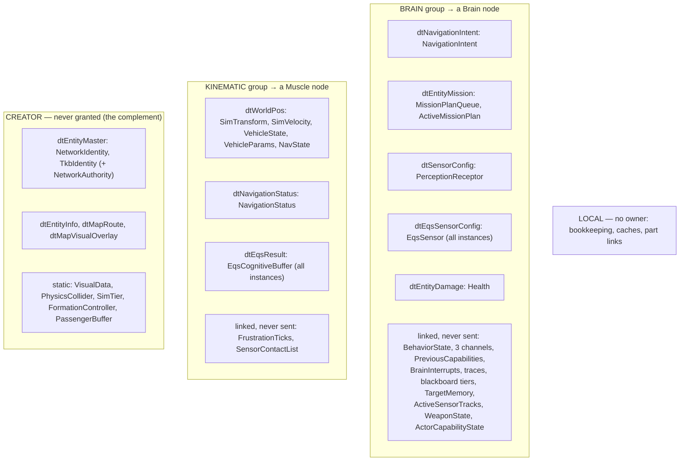

<!--STATUS
state: LIVE
updated: 2026-10-02
build-state: DESIGN — §1 (classification) and §2 (the groups) are done; the UML (class, sequence, module) is the next step, then READY-TO-BUILD.
current-answer: §2 the ownership groups · §1 the classification they are derived from · §3 findings · §4 decisions still open.
stale-below: nothing yet.
known-rot: none.
known-conflict: docs/DESIGN_Role_Affinity_Ownership.md §3.9/§3.9a role tables (brainOnly) — §1 measures that brainOnly misses most brain-written components (tiers, BrainInterrupts, WeaponState, TargetMemory, ActiveMissionPlan, EqsSensor, …). Push-only (Q79 §0.7) retires the role tables as the source of ownership; this doc's §2 replaces them.
related-designs:
  - docs/blueprints/Architect_Question_79_One_Ownership_Truth.md — owns the DECISIONS (push-only, the grant, parts, crash, external nodes, build scope §0.13); this doc is the build design they asked for (R-170).
  - docs/DESIGN_Role_Affinity_Ownership.md — owned WHO claims WHICH component by role; superseded in part by push-only. Its §2.3 shape (ownership as component masks, network-agnostic) is kept here.
  - docs/DESIGN_Entity_Ownership_Transfer.md — owns transfer INITIATION (CE-276); groups move by its OwnershipUpdate after creation.
  - docs/DESIGN_Node_Roles_And_Policies.md — §4.1 the creation legs; this doc decides which group each leg grants.
  - docs/reference/BDC_NED_SST_Descriptor_Rules.md — the wire spec (per-descriptor owners, OwnershipUpdate, disposal).
  - docs/DESIGN_Behaviour_Fault_And_Teardown.md — §1 D5 the EQS part id (parts follow their descriptor type's group, Q79 §0.10).
-->

# Ownership groups and grants — the build design

**Goal** (Q79 §0.7, push-only): one owner per component. The creator owns everything at birth and **grants whole groups** —
the brain group to a chosen Brain node, the kinematic group to a chosen Muscle node. A group is a set of **whole descriptors**
plus the components that are never on the wire but **linked** to one of those descriptors (R-165). Everything else stays with
the creator. Approvals: R-170 (`dtWorldPos` moves whole; `CE-506` is phase 2; this doc).

## INVENTORY *(the classification pass, `2026-10-02`)*

- **Component set:** the union of every component present on a CGF- and a SimHost-created `Tank_M1Abrams` on both nodes
  (Q79 §10 live probe, 39 components) + the brain's occurrence-store tiers + the EQS part components + the map-geometry
  components — 54 classified below, plus `WeaponMountInfo`, which never exists in production (F-6).
- **Method, per component:** every production write site (grep for every write form: `SetComponent`, `AddComponent`,
  `GetComponentRW`/`ref`, command buffers, managed in-place mutation, `InitialComponents`, TKB translators, generic writers),
  then the host that registers the writing system (module packs and bootstrappers), then the wire descriptor (egress
  translators' `TargetComponentIds` + `NedReplicationModule.cs:623-638`). Four parallel read-only sweeps; the surprising rows
  were re-checked by hand (`HealthApplicationSystem.cs:73-77`, `CgfLogicPack.cs:175`; `WeaponMountInfo` has no production
  registration; `DescriptorOwnershipMap.cs:97-100`).
- **Write kinds:** SIM = steady-state logic · INIT = once at spawn/promotion/template · INGRESS = applying a received sample
  (a replica update, not ownership) · LOCAL = node-local cache/bookkeeping · EDIT = operator/tooling.
- **Generic writers** reach any component and are not listed per row: spawn `InitialComponents` and `UpdateEntityCommand`
  (`NetworkSpawningSystem.cs:225-227, 309`), TKB translators at spawn/promotion/construction, scenario load (staging repo →
  `InitialComponents`), replay playback, the ImGui inspector, the editor debug API, data-breakpoint mutations, blueprint
  `SetComponent` nodes (Brain only). They are INIT/EDIT/replay paths, so they do not decide a group.
- ⚠ The Editor is offline (one node, owns everything) and runs both the Brain and the Muscle packs; it never decides a group.

## 1. Classification — who writes what, where

**Rule used to assign a group:** the group of the node whose **SIM** writers write the component. INIT-only components stay
with the creator. LOCAL components are in no group (each node writes its own copy; no claim decides anything).

### 1.1 Brain-written (SIM writers only on CGF)

| component | SIM writers (host CGF) | wire |
|---|---|---|
| `BehaviorState` | `BehaviorIngressSystem.cs:284-288` | — |
| `LocomotionChannel`, `WeaponChannel`, `InteractionChannel` | `ChannelArbitrationSystem`, the dispatchers, executors, BTree/HSM nodes, blueprint-generated code | — |
| `PreviousCapabilities` | `CognitiveInterruptSystem.cs:98,114` | — |
| `BrainInterrupts` | `CognitiveInterruptSystem.cs:105`, `CognitiveCleanupSystem.cs:43`, `RouteContextSystem.cs:185` | — |
| `BTreeTraceWorkingMemory1024`, `HsmTraceWorkingMemory1024` | `BrainTickSystem.cs:305,566`, `TraceBufferLifecycleSystem.cs:74-80` | — |
| `BlueprintBlackboard256/1024/4096/16384` (occurrence store) | `BrainTickSystem`, `BlueprintTickSystem`, `BehaviorIngressSystem`, `BlueprintMaintenanceSystem` | — |
| `NavigationIntent` | `MoveToExecutor.cs:60,151`, `FollowRouteExecutor.cs:39,77,94` | `dtNavigationIntent` (52) |
| `MissionPlanQueue`, `ActiveMissionPlan` | `MissionControlExecutionSystem.cs:182-236`, `MissionDirectorSystem.cs:118-221` | `dtEntityMission` (51) |
| `PerceptionReceptor` (sensor config) | Brain authors it; SimHost only ingests (`PerceptionTranslators.cs:376`) | `dtSensorConfig` |
| `EqsSensor` (part) | `EqsChildSensor`, `EqsLifecycleNodes`, `HillAttackCommanderNodes`, blueprint `SpawnEqsSensor` | `dtEqsSensorConfig` (95) |
| `TargetMemory` | `ThreatEvaluationSystem.cs:54,100,115` | — |
| `ActiveSensorTracks` | `ActiveSensorTracksUpdateSystem.cs:96-98` | — |
| `WeaponState` | `AimAndFireExecutor.cs:53-76`, `WeaponDispatcherSystem.cs:50-53` | — |
| `Health` | `HealthApplicationSystem.cs:85` | `dtEntityDamage` (30) |
| `ActorCapabilityState` | `HealthApplicationSystem.cs:106,115` | — |

### 1.2 Muscle-written (SIM writers only on SimHost / Stride)

| component | SIM writers (SimHost; Stride equivalents) | wire |
|---|---|---|
| `SimTransform`, `SimVelocity` | `CarKinematicsSystem.cs:301-302`, `LinearKinematicsSystem.cs:108`; Stride `CrowdAgentUpdateSystem`, `BulletReverseSyncSystem` | `dtWorldPos` (2) |
| `VehicleState` | `CarKinematicsSystem.cs:299`; Stride `VehicleNavigationIntentSystem.cs:310` | `dtWorldPos` (mapped) |
| `NavState` | `NavigationIntentBridgeSystem.cs:174`, `EngineBackedPathResponseSystem.cs:52`, `CarKinematicsSystem.cs:300` | `dtWorldPos` (mapped) |
| `VehicleParams` | INIT only — but part of `dtWorldPos` (R-170: the descriptor moves whole) | `dtWorldPos` (mapped) |
| `NavigationStatus` | `NavigationExecutionSystem.cs:124-282`, `NavigationIntentBridgeSystem.cs:365` | `dtNavigationStatus` (53) |
| `FrustrationTicks` | `NavigationExecutionSystem.cs:127-273` | — |
| `SensorContactList` | `SensorTrackDebounceSystem.cs:123,138` (Perception, always co-hosted with MuscleGround — `HrotRoleComponentSets.cs` remarks) | — (its transitions leave as `dtSensorTrackState` events) |
| `EqsCognitiveBuffer` (part) | `EqsResultUpdateSystem.cs:131-152` (solver result), `EqsSolverSystem.cs:164` | `dtEqsResult` (96, event stream) |

### 1.3 Entity identity and creator-held (no steady-state writer outside the owner)

| component | writers | wire |
|---|---|---|
| `NetworkIdentity`, `TkbIdentity` | INIT (spawn, ghost creation) | `dtEntityMaster` (0) |
| `NetworkAuthority` | INIT; on transfer `OwnershipIngressSystem.cs:103-107`, `OwnershipTransferInitiationSystem.cs:114` | via `OwnershipUpdate` on `dtEntityMaster` |
| `EntityInfo` | INIT; SimHost attribute requests (owner-gated); editor rename | `dtEntityInfo` |
| `RoutePlan` | INIT/EDIT (route tools, gizmos) | `dtMapRoute` |
| `EditablePolyline`, `MapOverlayStyle` | INIT/EDIT (area tools, vertex gizmo); owner-gated request on SimHost | `dtMapVisualOverlay` |
| `VisualData`, `PhysicsCollider`, `SimTier`, `FormationController`, `PassengerBuffer` | INIT only (latent/editor-only SIM writers) | — |

### 1.4 Local — in no group

`EgressPublicationState`, `DescriptorOwnership`, `NetworkAckPeerSet`, `ReportLifecycleOnActive`, `MapDisplayComponent`,
`MissionAdapterState`, `PersonalRouteRef`, `PartMetadata`, `BehaviorOwnedPart`, `NetworkTransform`, `NetworkVelocity`
(the last two: the ingress replica value and the egress shadow, written on every NED host).

## 2. ⭐ The ownership groups

*What the picture shows that prose hid:* every group is **whole descriptors + linked components**, so a grant or an
`OwnershipUpdate` of one descriptor can never half-move a group's wire state (P4), and a component sits in exactly one box.

| rule | |
|---|---|
| G-1 | A group is granted as ONE `DeferredTakeOwnership` (one entry per descriptor in the group, same target) — the message already batches per entity |
| G-2 | Receiving a descriptor sets the claim of its components **and of the components linked to that group** — the descriptor→component map gains the linked members (today it holds only translator targets + two hand-written blocks) |
| G-3 | Multi-instance descriptors (`dtEqsSensorConfig`, `dtEqsResult`) cover every instance (Q79 §0.10) |
| G-4 | Brain group granted only when the template has a brain (`BrainTier != 0`, G5); kinematic group only when it has kinematics (`VehicleParametersDto`) |
| G-5 | The creator keeps CREATOR and any group whose chosen target is itself |

## 3. Findings from the classification

| # | finding | evidence | action |
|---|---|---|---|
| F-1 | 🔴 **An entity SimHost creates never takes damage.** `Health`'s only steady-state writer runs on CGF and checks ENTITY-level authority; on a SimHost-created entity CGF is not the primary owner (probe: `HasAuthority=False`) and SimHost does not run the system. Same for an IG-targeted creation | `HealthApplicationSystem.cs:73-77`; `CgfLogicPack.cs:175` only | `CE-510`; fixed by the brain group + gating on the group claim instead of entity authority |
| F-2 | Five descriptors carry state but declare no components, so granting/transferring them moves **no claim**: `dtEntityDamage` (Health), `dtEntityMission` (mission queue/plan), `dtSensorConfig` (PerceptionReceptor), `dtEqsSensorConfig`, `dtEqsResult` | the translators have no `TargetComponentIds` | B2: §2 supplies the mapping (generalises G3) |
| F-3 | The explicit `dtWorldPos` mapping REPLACES the translator's (`NetworkTransform`, `NetworkVelocity` drop out of the forward map) | `DescriptorOwnershipMap.cs:97-100`, `NedReplicationModule.cs:623` | moot under §2 (both are LOCAL); the group definition becomes the single source |
| F-4 | `brainOnly` misses most brain-written components (tiers, `BrainInterrupts`, `WeaponState`, `TargetMemory`, `ActiveMissionPlan`, `EqsSensor`, …) | `HrotRoleComponentSets.cs:126-159` vs §1.1 | superseded by §2 (push-only retires the role tables as ownership) |
| F-5 | Several INGRESS writers do not skip when this node owns the descriptor (`NavigationIntentIngressTranslator.cs:82`, `MapVisualOverlayIngressTranslator.cs:152`, `NavigationStatusIngressTranslator.cs:69`, `PerceptionTranslators.cs:376`, `EqsSensorConfigIngressTranslator`) | per-row gates in the sweep | ⚠ matters once a node can GAIN a descriptor it also ingests (transfer, external hand-in): skip when owned, like `GeoSpatialIngressTranslator.cs:90` |
| F-6 | Weapon-mount parts never exist in production: `WeaponMountInfo` is never registered, so `CombatTkbTranslator.cs:97` never creates them | no production `RegisterComponent<WeaponMountInfo>` | record only (unreferenced ≠ unintended); Q79 §0.10's table corrected |
| F-7 | Stale comment: `CognitiveComponentRegistry` says SimHost receives mission data; `EntityMissionIngressTranslator` is Brain-only | `CognitiveTranslatorPack.cs:60` | fix the comment in the build |

## 4. Open before the UML

| # | question | lean |
|---|---|---|
| D-1 | `Health`/`ActorCapabilityState` in the BRAIN group (where their only writer runs) — or move `HealthApplicationSystem` to the Muscle where damage is resolved? | BRAIN group: follow the writer; moving the system is a separate design question |
| D-2 | `SensorContactList` linked to the KINEMATIC group (Perception is always co-hosted with MuscleGround today) | yes; a separate perception group only if Perception ever runs on its own node |
| D-3 | `PerceptionReceptor` in the BRAIN group (the Brain authors the sensor config, SimHost consumes it) | yes |
