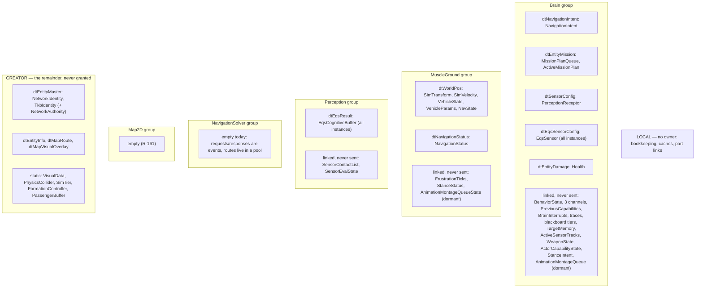
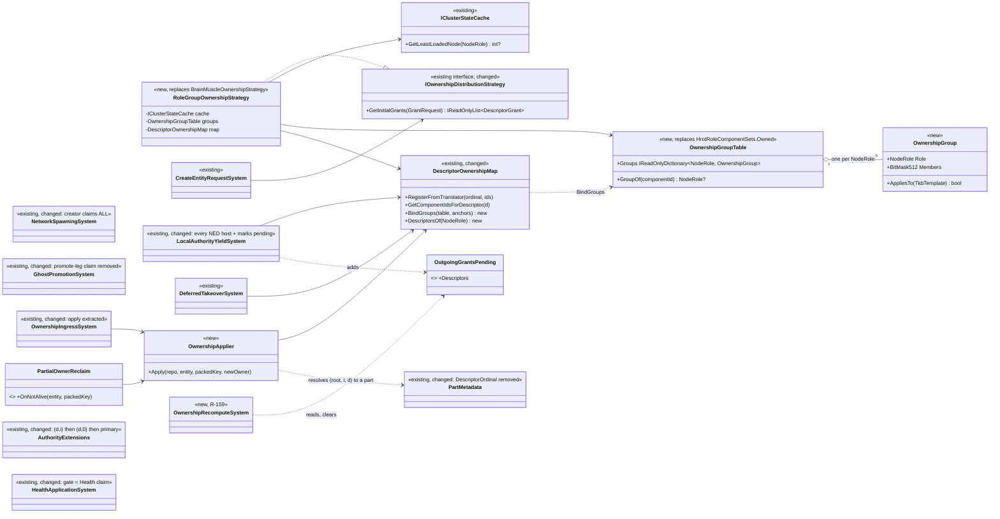
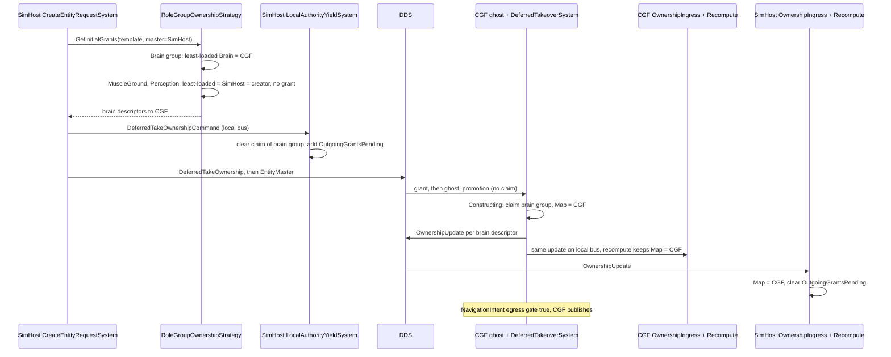
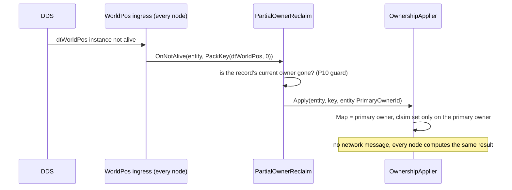
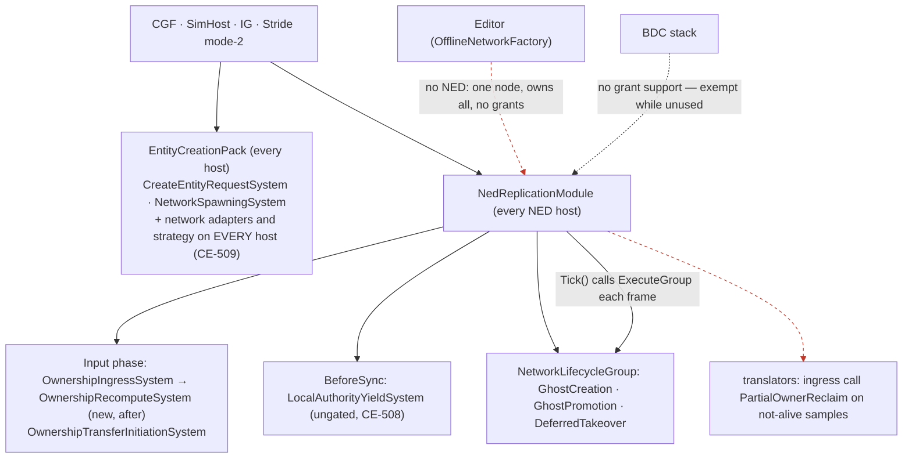

<!--STATUS
state: LIVE
updated: 2026-10-02
build-state: BUILDING — §5.5 D-4..D-7 approved (R-173, 2026-10-02); S1, S2 built and green; S3 next.
current-answer: §5 the design (UML, decisions, build order) · §2 the ownership groups — one per NodeRole (R-172) + CREATOR remainder + LOCAL · §1 the classification they are derived from · §3 findings · §4 decisions (resolved, R-171).
stale-below: nothing yet.
known-rot: none.
known-conflict: docs/DESIGN_Role_Affinity_Ownership.md §3.9/§3.9a role tables (brainOnly) — §1 measures that brainOnly misses most brain-written components (tiers, BrainInterrupts, WeaponState, TargetMemory, ActiveMissionPlan, EqsSensor, …). Push-only (Q79 §0.7) retires the role tables as the source of ownership; this doc's §2 replaces them.
related-designs:
  - docs/blueprints/Architect_Question_79_One_Ownership_Truth.md — owns the DECISIONS (push-only, the grant, parts, crash, external nodes, build scope §0.13); this doc is the build design they asked for (R-170).
  - docs/DESIGN_Role_Affinity_Ownership.md — owned WHO claims WHICH component by role; superseded in part by push-only. Its §2.3 shape (ownership as component masks, network-agnostic) is kept here.
  - docs/DESIGN_Entity_Ownership_Transfer.md — owns transfer INITIATION (CE-276); groups move by its OwnershipUpdate after creation.
  - docs/DESIGN_Node_Roles_And_Policies.md — §4.1 the creation legs; this doc decides which group each leg grants.
  - docs/reference/BDC_NED_SST_Descriptor_Rules.md — the wire spec (per-descriptor owners, OwnershipUpdate, disposal).
  - docs/DESIGN_Behaviour_Fault_And_Teardown.md — §1 D5 the EQS part id (parts follow their descriptor type's group, Q79 §0.10).
-->

# Ownership groups and grants — the build design

**Goal** (Q79 §0.7, push-only): one owner per component. The creator owns everything at birth and **grants whole groups** —
each role's group to a node serving that role — one group per `NodeRole` (R-172): Brain, MuscleGround, Perception (R-171), NavigationSolver and Map2D (both empty today). A group is a set of **whole descriptors**
plus the components that are never on the wire but **linked** to one of those descriptors (R-165). Everything else stays with
the creator. Approvals: R-170 (`dtWorldPos` moves whole; `CE-506` is phase 2; this doc).

## INVENTORY *(the classification pass, `2026-10-02`)*

- **Component set:** the union of every component present on a CGF- and a SimHost-created `Tank_M1Abrams` on both nodes
  (Q79 §10 live probe, 39 components) + the brain's occurrence-store tiers + the EQS part components + the map-geometry
  components — 54 classified below, plus `WeaponMountInfo`, which never exists in production (F-6).
- **Method, per component:** every production write site (grep for every write form: `SetComponent`, `AddComponent`,
  `GetComponentRW`/`ref`, command buffers, managed in-place mutation, `InitialComponents`, TKB translators, generic writers),
  then the host that registers the writing system (module packs and bootstrappers), then the wire descriptor (egress
  translators' `TargetComponentIds` + `NedReplicationModule.cs:623-638`). Four parallel read-only sweeps; the surprising rows
  were re-checked by hand (`HealthApplicationSystem.cs:73-77`, `CgfLogicPack.cs:175`; `WeaponMountInfo` has no production
  registration; `DescriptorOwnershipMap.cs:97-100`).
- **Write kinds:** SIM = steady-state logic · INIT = once at spawn/promotion/template · INGRESS = applying a received sample
  (a replica update, not ownership) · LOCAL = node-local cache/bookkeeping · EDIT = operator/tooling.
- **Generic writers** reach any component and are not listed per row: spawn `InitialComponents` and `UpdateEntityCommand`
  (`NetworkSpawningSystem.cs:225-227, 309`), TKB translators at spawn/promotion/construction, scenario load (staging repo →
  `InitialComponents`), replay playback, the ImGui inspector, the editor debug API, data-breakpoint mutations, blueprint
  `SetComponent` nodes (Brain only). They are INIT/EDIT/replay paths, so they do not decide a group.
- ⚠ The Editor is offline (one node, owns everything) and runs both the Brain and the Muscle packs; it never decides a group.

## 1. Classification — who writes what, where

**Rule used to assign a group:** the group of the node whose **SIM** writers write the component. INIT-only components stay
with the creator. LOCAL components are in no group (each node writes its own copy; no claim decides anything).

### 1.1 Brain-written (SIM writers only on CGF)

| component | SIM writers (host CGF) | wire |
|---|---|---|
| `BehaviorState` | `BehaviorIngressSystem.cs:284-288` | — |
| `LocomotionChannel`, `WeaponChannel`, `InteractionChannel` | `ChannelArbitrationSystem`, the dispatchers, executors, BTree/HSM nodes, blueprint-generated code | — |
| `PreviousCapabilities` | `CognitiveInterruptSystem.cs:98,114` | — |
| `BrainInterrupts` | `CognitiveInterruptSystem.cs:105`, `CognitiveCleanupSystem.cs:43`, `RouteContextSystem.cs:185` | — |
| `BTreeTraceWorkingMemory1024`, `HsmTraceWorkingMemory1024` | `BrainTickSystem.cs:305,566`, `TraceBufferLifecycleSystem.cs:74-80` | — |
| `BlueprintBlackboard256/1024/4096/16384` (occurrence store) | `BrainTickSystem`, `BlueprintTickSystem`, `BehaviorIngressSystem`, `BlueprintMaintenanceSystem` | — |
| `NavigationIntent` | `MoveToExecutor.cs:60,151`, `FollowRouteExecutor.cs:39,77,94` | `dtNavigationIntent` (52) |
| `MissionPlanQueue`, `ActiveMissionPlan` | `MissionControlExecutionSystem.cs:182-236`, `MissionDirectorSystem.cs:118-221` | `dtEntityMission` (51) |
| `PerceptionReceptor` (sensor config) | Brain authors it; SimHost only ingests (`PerceptionTranslators.cs:376`) | `dtSensorConfig` |
| `EqsSensor` (part) | `EqsChildSensor`, `EqsLifecycleNodes`, `HillAttackCommanderNodes`, blueprint `SpawnEqsSensor` | `dtEqsSensorConfig` (95) |
| `TargetMemory` | `ThreatEvaluationSystem.cs:54,100,115` | — |
| `ActiveSensorTracks` | `ActiveSensorTracksUpdateSystem.cs:96-98` | — |
| `WeaponState` | `AimAndFireExecutor.cs:53-76`, `WeaponDispatcherSystem.cs:50-53` | — |
| `Health` | `HealthApplicationSystem.cs:85` | `dtEntityDamage` (30) |
| `ActorCapabilityState` | `HealthApplicationSystem.cs:106,115` | — |

### 1.2 MuscleGround-written (SIM writers only on SimHost / Stride)

| component | SIM writers (SimHost; Stride equivalents) | wire |
|---|---|---|
| `SimTransform`, `SimVelocity` | `CarKinematicsSystem.cs:301-302`, `LinearKinematicsSystem.cs:108`; Stride `CrowdAgentUpdateSystem`, `BulletReverseSyncSystem` | `dtWorldPos` (2) |
| `VehicleState` | `CarKinematicsSystem.cs:299`; Stride `VehicleNavigationIntentSystem.cs:310` | `dtWorldPos` (mapped) |
| `NavState` | `NavigationIntentBridgeSystem.cs:174`, `EngineBackedPathResponseSystem.cs:52`, `CarKinematicsSystem.cs:300` | `dtWorldPos` (mapped) |
| `VehicleParams` | INIT only — but part of `dtWorldPos` (R-170: the descriptor moves whole) | `dtWorldPos` (mapped) |
| `NavigationStatus` | `NavigationExecutionSystem.cs:124-282`, `NavigationIntentBridgeSystem.cs:365` | `dtNavigationStatus` (53) |
| `FrustrationTicks` | `NavigationExecutionSystem.cs:127-273` | — |

### 1.2b Perception-execution-written (SIM writers in the Perception role — today co-hosted on SimHost / Stride)

🔒 R-171, user verbatim: *"Damage application stays on brain where the healtb component is. Sensors and any perception should be perception group, not mixed with kinematic group, perception execution  could run on differrent node in the future. Sensor config (any perception intents) stay on brain."*

| component | SIM writers | wire |
|---|---|---|
| `EqsCognitiveBuffer` (part) | `EqsResultUpdateSystem.cs:131-152` (local solver result), `EqsSolverSystem.cs:164` | `dtEqsResult` (96, event stream) |
| `SensorEvalState` (part) | `EqsSolverSystem.cs:97-388` | — |
| `SensorContactList` | `SensorTrackDebounceSystem.cs:123,138` | — (its transitions leave as `dtSensorTrackState` events) |

### 1.3 Entity identity and creator-held (no steady-state writer outside the owner)

| component | writers | wire |
|---|---|---|
| `NetworkIdentity`, `TkbIdentity` | INIT (spawn, ghost creation) | `dtEntityMaster` (0) |
| `NetworkAuthority` | INIT; on transfer `OwnershipIngressSystem.cs:103-107`, `OwnershipTransferInitiationSystem.cs:114` | via `OwnershipUpdate` on `dtEntityMaster` |
| `EntityInfo` | INIT; SimHost attribute requests (owner-gated); editor rename | `dtEntityInfo` |
| `RoutePlan` | INIT/EDIT (route tools, gizmos) | `dtMapRoute` |
| `EditablePolyline`, `MapOverlayStyle` | INIT/EDIT (area tools, vertex gizmo); owner-gated request on SimHost | `dtMapVisualOverlay` |
| `VisualData`, `PhysicsCollider`, `SimTier`, `FormationController`, `PassengerBuffer` | INIT only (latent/editor-only SIM writers) | — |

### 1.5 Found while building S1 — animation (dormant) and ground clamping

| component | writers | group |
|---|---|---|
| `StanceIntent`, `AnimationMontageQueue` (Brain → Muscle intents) | Brain-side animation executors | BRAIN |
| `StanceStatus`, `AnimationMontageQueueState` (Muscle → Brain statuses) | Muscle animation systems | MUSCLEGROUND |
| `AnimationChannel`, `LookAtChannel` | intent fields by the Brain AND status fields by the Muscle in ONE component | ⚠ none yet — F-9 / `CE-513` |
| `GroundClampingConfig` | IG ingress of an externally sent `dtGroundClampingOverride` only | LOCAL |

⚠ **Animation replication is dormant:** `AnimationReplicationModule` is constructed by no production host and referenced by no
host project; its translators are `INetworkTranslator`s outside the descriptor map and gate on ENTITY authority. The tank probe
never saw these components. ⇒ the intent/status components are placed by their own documented direction; they move only once
the module is composed.

### 1.4 Local — in no group

`EgressPublicationState`, `DescriptorOwnership`, `NetworkAckPeerSet`, `ReportLifecycleOnActive`, `MapDisplayComponent`,
`MissionAdapterState`, `PersonalRouteRef`, `PartMetadata`, `BehaviorOwnedPart`, `NetworkTransform`, `NetworkVelocity`
(the last two: the ingress replica value and the egress shadow, written on every NED host), `GroundClampingConfig` (§1.5).

## 2. ⭐ The ownership groups

🔒 **R-172, user verbatim:** *"Note the component groups are role based, never node based."* ⇒ ⭐ **ONE group per `NodeRole`** (`NodeRole.cs`: `Brain`, `MuscleGround`, `Perception`, `NavigationSolver`, `Map2D`); which NODE holds a group is the owner's per-entity choice (R-164), never part of the definition. A new role ⇒ a new group, nothing else. CREATOR is not a group of any role: it is the remainder the creator keeps (R-160).

*What the picture shows that prose hid:* every group is **whole descriptors + linked components**, so a grant or an
`OwnershipUpdate` of one descriptor can never half-move a group's wire state (P4), and a component sits in exactly one box.

| rule | |
|---|---|
| G-1 | A group is granted as ONE `DeferredTakeOwnership` (one entry per descriptor in the group, same target) — the message already batches per entity |
| G-2 | Receiving a descriptor sets the claim of its components **and of the components linked to that group** — the descriptor→component map gains the linked members (today it holds only translator targets + two hand-written blocks) |
| G-3 | Multi-instance descriptors (`dtEqsSensorConfig`, `dtEqsResult`) cover every instance (Q79 §0.10) |
| G-4 | Brain group granted only when the template has a brain (`BrainTier != 0`, G5); MuscleGround group only when it has kinematics (`VehicleParametersDto`); perception group only when it has perception (`VisionRange > 0`, the `PerceptionTkbTranslator` condition) |
| G-6 | ⭐ Each group IS a role (R-172). The strategy picks, per entity and per non-empty group, one node serving that role — independently per group, so a perception-only or solver-only node needs no design change |
| G-9 | An empty group grants nothing. `NavigationSolver` and `Map2D` are empty today; a component enters them only when that role's own logic becomes its steady-state writer |
| G-7 | A part entity can hold components of different groups (an EQS part: `EqsSensor` = BRAIN, `EqsCognitiveBuffer`/`SensorEvalState` = PERCEPTION); claims are per component, so this needs nothing extra |
| G-8 | Event outputs (`dtSensorTrackState`, `dtAudioTargetDetected`, `dtEntityHitDamage`) are events, not descriptors: no group, no owner |
| G-5 | The creator keeps CREATOR and any group whose chosen target is itself |

## 3. Findings from the classification

| # | finding | evidence | action |
|---|---|---|---|
| F-1 | 🔴 **An entity SimHost creates never takes damage.** `Health`'s only steady-state writer runs on CGF and checks ENTITY-level authority; on a SimHost-created entity CGF is not the primary owner (probe: `HasAuthority=False`) and SimHost does not run the system. Same for an IG-targeted creation | `HealthApplicationSystem.cs:73-77`; `CgfLogicPack.cs:175` only | `CE-510`; fixed by the brain group + gating on the group claim instead of entity authority |
| F-2 | Five descriptors carry state but declare no components, so granting/transferring them moves **no claim**: `dtEntityDamage` (Health), `dtEntityMission` (mission queue/plan), `dtSensorConfig` (PerceptionReceptor), `dtEqsSensorConfig`, `dtEqsResult` | the translators have no `TargetComponentIds` | B2: §2 supplies the mapping (generalises G3) |
| F-3 | The explicit `dtWorldPos` mapping REPLACES the translator's (`NetworkTransform`, `NetworkVelocity` drop out of the forward map) | `DescriptorOwnershipMap.cs:97-100`, `NedReplicationModule.cs:623` | moot under §2 (both are LOCAL); the group definition becomes the single source |
| F-4 | `brainOnly` misses most brain-written components (tiers, `BrainInterrupts`, `WeaponState`, `TargetMemory`, `ActiveMissionPlan`, `EqsSensor`, …) | `HrotRoleComponentSets.cs:126-159` vs §1.1 | superseded by §2 (push-only retires the role tables as ownership) |
| F-5 | Several INGRESS writers do not skip when this node owns the descriptor (`NavigationIntentIngressTranslator.cs:82`, `MapVisualOverlayIngressTranslator.cs:152`, `NavigationStatusIngressTranslator.cs:69`, `PerceptionTranslators.cs:376`, `EqsSensorConfigIngressTranslator`) | per-row gates in the sweep | ⚠ matters once a node can GAIN a descriptor it also ingests (transfer, external hand-in): skip when owned, like `GeoSpatialIngressTranslator.cs:90` |
| F-6 | Weapon-mount parts never exist in production: `WeaponMountInfo` is never registered, so `CombatTkbTranslator.cs:97` never creates them | no production `RegisterComponent<WeaponMountInfo>` | record only (unreferenced ≠ unintended); Q79 §0.10's table corrected |
| F-8 | ⚠ **The navigation solver writes the Muscle's component in-process.** `EngineBackedPathResponseSystem` (registered by the `NavigationSolver` capability, `SimHostCapabilities.cs:85-100`) sets `NavState.TrajectoryId/Mode` by a LOCAL entity index taken from the request id and a trajectory pool SHARED with the Muscle (`EngineBackedPathResponseSystem.cs:44-55`). Correct only while both roles share a process; ⇒ when `NavigationSolver` runs on its own node this write must become a response message to the Muscle (the Brain-side path already is one: `PathResponseBrainIngressTranslator` registers into its own pool and publishes an event) | `EngineBackedPathResponseSystem.cs:30-55` | filed `CE-511`; not in this build's scope |
| F-9 | ⚠ **`AnimationChannel` / `LookAtChannel` mix a Brain-written intent and a Muscle-written status in ONE component** — one component cannot have two owners. Harmless while animation replication is dormant (both writers share a process); must be split (intent/status, like `StanceIntent`/`StanceStatus`) before animation replication is composed across nodes | `ReplicatedComponents.cs:40-90` | filed `CE-513`; outside this build |
| F-10 | 🔴 **Only SimHost can apply an edit request from another node.** The owner-side handlers (`UpdateEntityAttributeRequestSystem`, `UpdateEntityDescriptorRequestSystem`) are built by `CreateSimHostAttributeUpdateSystems` and registered ONLY at `SimHostNodeBootstrapper.cs:297`. A non-owner's edit (a gizmo drag) goes through `EntityWriteRouter` as a change REQUEST to the owner (design intent: *"owner receives → applies, ownership-gated"*, `DESIGN_Cgf_AxisB_Rotation_Slice.md` §311). ⇒ today map-symbol drags work only because the type-blind strategy grants every position to SimHost (Q79 F14); once G-4 leaves a non-vehicle position with its creator (CGF or IG), those requests would land on a node with no handler and be lost | `NedNetworkFactory.cs:155-165`; `SimHostNodeBootstrapper.cs:297` | **S2b** — the handlers on every host, BEFORE S3 |
| F-7 | Stale comment: `CognitiveComponentRegistry` says SimHost receives mission data; `EntityMissionIngressTranslator` is Brain-only | `CognitiveTranslatorPack.cs:60` | fix the comment in the build |

## 4. Decisions before the UML *(all resolved `2026-10-02`)*

| # | question | lean |
|---|---|---|
| ~~D-1~~ | ✅ R-171: damage application stays on the Brain with `Health` (BRAIN group) | — |
| ~~D-2~~ | ✅ R-171: a separate PERCEPTION group (§1.2b), not mixed into MuscleGround | — |
| ✅ | D-4..D-7 approved by the user `2026-10-02` (R-173): *"approved D-4 to D-7, start step 1"* | — |
| ~~D-8~~ | ✅ R-175: who owns the position of a composite unit and of a standalone tactical symbol (area, route, overlay) | ⭐ **the CREATOR, position included**: neither has kinematics, so G-4 grants no MuscleGround group (G-5 keeps it with the creator). 🔒 User `2026-10-02`: *"whoever creates them should own them including their position i guess (logical entity anyway does not have any kinematics components so this should work consistently)"* and *"map tactical symbols … should be owned by the creator, same mechanism (no kinematics parts)"*. A composite unit is typically created on a Brain node; deriving its position from its members (averaging) is future work for its owner, not yet decided (CE-514). A node that moves a creator-owned symbol (e.g. Map2D) sends an edit request to the owner (BDC spec "descriptor change requests"), which needs F-10 fixed (S2b). 📐 Measured templates: tanks, IFV, truck, infantry rifleman (`BdcTkbCatalog.cs:26-168`), the `UrbanCombatTkbCatalog` entities get MuscleGround; `TacGraphic_Area`/`TacGraphic_Route` (`BdcTkbCatalog.cs:238-247`) and `Unit_TankPlatoon`/`Unit_InfantrySquad` (`:182-216`, no `WithPhysics`) do not |
| ~~D-3~~ | ✅ R-171: sensor config and every perception INTENT (`PerceptionReceptor`, `EqsSensor`) stay in BRAIN | — |
| ~~D-9~~ | ✅ R-175 (user `2026-10-02` confirmed the "no kinematics ⇒ creator" mechanism): how a group's applicability (G-4) is decided per template — user: *"this might need some TKB entity-type based data driven rule"* | ⭐ **Keep it keyed on the template's CAPABILITY DESCRIPTORS** (`HrotOwnershipGroups.cs:97-99`). That is already TKB data, synced to every node, with no entity-class vocabulary (TKB `DESIGN.md` §6.6a, user `2026-09-13`: *"the components the entity have makes the entity a vehicle"*). Rejected: ① keying on the entity TYPE id (`TkbEntityTypes`) is the per-class hardcode §6.6a bans. ② Keying on the LIVE component mask is host-dependent: Stride strips `VehicleState` from infantry (`InfantryVehicleStateStripTkbTranslator.cs:21`), so a Stride creator would deny infantry its MuscleGround grant. ③ Keying on `produced(translators)` cannot see descriptor values: `BehaviorState` is stamped for `BrainTier 0` too (`BehaviorTkbTranslator.cs:75`). ④ A per-template file field, e.g. an ownership-profile descriptor, is the escape hatch for when a template needs a different answer than its descriptors give (§6.6, "when a file field WOULD be the right answer": a schema change plus loud load-time validation, because the deserializer skips unknown keys). No template needs it today: the user ruled a composite unit's position stays with its creator (D-8), so the composite case is not one either |

Nothing open (D-8, D-9 resolved by R-175 `2026-10-02`); next step is the UML.

## 5. ⭐⭐ THE DESIGN — UML *(drafted `2026-10-02`, after §1's inventory; awaiting the user's approval)*

### 5.1 Class — what exists, what changes, what is new

*What the picture shows that prose hid:* the new types are small and few (`OwnershipGroup`/`Table`, `RoleGroupOwnershipStrategy`,
`OwnershipApplier`, `OwnershipRecomputeSystem`, `PartialOwnerReclaim`, `OutgoingGrantsPending`); every
protocol participant (`DeferredTakeoverSystem`, the DTO translators, `OwnershipUpdateTranslator`) is **unchanged**. The group table
replaces the role tables in the same `Hrot.Core` home (reuse, not a second table), and the descriptor binding extends the existing
`DescriptorOwnershipMap` rather than adding a parallel map.

### 5.2 Sequence — SimHost creates a tank (the `CE-500` path, now fixed)

*What the picture shows:* the creator's record stays "mine" for the granted descriptors until the confirming `OwnershipUpdate`
(F7, P6) — `OutgoingGrantsPending` is what lets the recompute leave it alone in that window.

### 5.3 Sequence — a Muscle node crashes (`R-167`, Q79 §0.11)

### 5.4 Module — who registers what, and who calls it each frame

*What the picture shows that prose hid:* the takeover runs inside `NetworkLifecycleGroup`, whose ONLY executor is
`NedReplicationModule.Tick` (`NedReplicationModule.cs:654`) — so grants are honoured exactly on NED hosts. The two dashed red edges
are the hosts where no grant is ever executed: the offline editor (correct — one node) and BDC (exempt, Q79 §0.7 G6).

### 5.5 Design decisions inside the frame

| # | decision | lean / why |
|---|---|---|
| D-4 | which descriptor carries a group's never-sent members (R-165) | the group's **anchor**: Brain → `dtNavigationIntent`, MuscleGround → `dtWorldPos`, Perception → `dtEqsResult`. ⭐ A single-descriptor transfer (an external node, Q79 §0.12 E2) then moves exactly that descriptor's components; only the anchor drags the linked members. Rejected: link to every descriptor of the group — an external hand-in of `dtEntityMission` would flip the whole brain |
| D-5 | where the groups live | `Hrot.Core`, replacing `HrotRoleComponentSets.Owned` in place; `OwnershipGroup` (the shape) in `Fdp.Toolkits/Replication/Abstractions` next to `IOwnershipDistributionStrategy` |
| D-6 | strategy input | `GrantRequest { DISEntityType, TkbTemplate?, MasterNodeId }` — the template is needed for G-4; the creator already holds it (`CreateEntityRequestSystem.cs:277`) |
| D-7 | the creator's claim | ALL at create (role policy retired as ownership); the yield removes granted groups. `IRoleAffinityPolicy.RegisterComponentSet` stays (registration is a different concern) |

### 5.6 Build order *(each step green before the next; feature suites first — T-1)*

| step | items (Q79 §0.13) | proven by |
|---|---|---|
| S1 ✅ `006b85453` | `OwnershipGroup`/`Table`, `DescriptorOwnershipMap.BindGroups` + boot validation (every descriptor in exactly one group or CREATOR); F-2 mappings | ✅ `OwnershipGroupBindingTests`, `HrotOwnershipGroupsTests`, `TheDescriptorMapIsWiredTests` (every role binds the same groups, 0 violations), `SplitAuthoritySpawnTests` 3/0. As built: the binding is `NedOwnershipGroupBinding`; violations are LOGGED at boot (not thrown) and railed; `HrotRoleComponentSets` stays the claim source until S4 |
| S2 ✅ `26d64f4fd` | composition on every host (`CE-509`), yield ungated (`CE-508`) | ✅ `SplitAuthoritySpawnTests` + `AllSubsystemsSpawnMovingVehicleTests` 4/0; `StrideNodeBootstrapperTests` (adapters reach the constructed request system, poll runs); `NedReplicationModuleTests` (yield on every role). As built: the base bootstrapper exposes `ConfiguredNetworkFactory`; SimHost/Stride register `NetworkPollingSystem` (CGF/IG poll from their app loops). ⚠ SimHost, Stride and IG hold TWO cluster caches (the replication module's, built by the shared builder, and the adapters', from the factory), both fed from the same topics; CGF builds both from one factory, so one cache — S3's strategy reads the adapters' one; unify when the base composes the creation tier (§4.1d lean) |
| S2b | ⭐ R-174 (user: *"i hope you keep the "unify and share" strategy over "duplicate", especially in the node bootstrap code"*): move S2's adapter wiring out of the hosts into shared code (the pack takes the adapters as ONE input and builds the request, delete and polling systems itself); register the owner-side edit-request handlers on every host (F-10) | composition rails; an edit request applied on a CGF-/IG-owned entity |
| S3 | `RoleGroupOwnershipStrategy` (B3) | strategy rails; `CE-500` rail (SimHost creates, CGF publishes `NavigationIntent`) |
| S4 | retire the promote-leg claim (B4); creator claims all (D-7) | §10 probe as a rail: no component claimed by two nodes, every creation path |
| S5 | `OwnershipApplier` extraction + `OwnershipRecomputeSystem` + `OutgoingGrantsPending` (B5) | `MasterOnly` transfer rail; F7 timeline rail |
| S6 | parts: gate lookup, part claims, per-instance apply, `PartMetadata.DescriptorOrdinal` removed, `CE-507` (B6) | EQS suites |
| S7 | `PartialOwnerReclaim` (B7) with the P10 guard (`CE-512` (b)(c); (a) stays with `CE-506`) | crash rail (kill a Muscle process) |
| S8 | `HealthApplicationSystem` gate (`CE-510`); ingress skip-when-owned for group descriptors (F-5) | damage rail on a SimHost-created entity |
